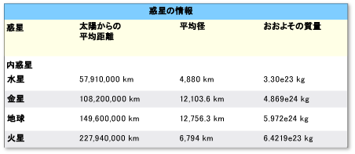
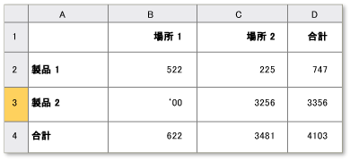

# UI オートメーション Table コントロール パターンの実装
> [!NOTE]
>  このドキュメントが目的とする、管理を使用する .NET Framework 開発者[!INCLUDE[TLA2#tla_uiautomation](../../../includes/tla2sharptla-uiautomation-md.md)]で定義されたクラス、 <xref:System.Windows.Automation>名前空間。 最新情報について[!INCLUDE[TLA2#tla_uiautomation](../../../includes/tla2sharptla-uiautomation-md.md)]を参照してください[Windows Automation API: UI 自動化](http://go.microsoft.com/fwlink/?LinkID=156746)します。  
  
 このトピックでは、実装するため<xref:System.Windows.Automation.Provider.ITableProvider>プロパティ、メソッド、およびイベントに関する情報などです。 その他のリファレンスへのリンクは、概要の最後に記載します。  
  
 <xref:System.Windows.Automation.TablePattern>子要素のコレクションのコンテナーとして機能するコントロールをサポートするコントロール パターンを使用します。 この要素の子を実装する必要があります<xref:System.Windows.Automation.Provider.ITableItemProvider>や、2 次元論理座標系行と列で走査できるで整理されます。 このコントロール パターンと似ています<xref:System.Windows.Automation.Provider.IgridProvider>、任意の制御を実装する区別を<xref:System.Windows.Automation.Provider.ITableProvider>も、各子要素の列や行ヘッダー リレーションシップを公開する必要があります。 このコントロール パターンを実装するコントロールの例については、次を参照してください。 [UI オートメーション クライアントのコントロール パターン マッピング](../../../docs/framework/ui-automation/control-pattern-mapping-for-ui-automation-clients.md)します。  
  
   
## 実装のガイドラインと規則  
 Table コントロール パターンを実装する場合は、次のガイドラインと規則に留意してください。  
  
-   個別のセルのコンテンツへのアクセスは&2; 次元の論理座標系または配列の必要な同時実行の実装によって提供される、 <xref:System.Windows.Automation.Provider.IGridProvider>します。  
  
-   列ヘッダーまたは行ヘッダーは、テーブル オブジェクト内に含めることも、テーブル オブジェクトに関連付けられた別のヘッダー オブジェクトにすることもできます。  
  
-   列ヘッダーと行ヘッダーには、プライマリ ヘッダーだけでなく、任意の補助ヘッダーも含めることができます。  
  
> [!NOTE]
>  この概念がで明らかになります、[!INCLUDE[TLA#tla_xl](../../../includes/tlasharptla-xl-md.md)]スプレッドシート ユーザーが「姓」列が定義されています。 これで、この列のヘッダーは、ユーザーが定義した [ファースト ネーム] ヘッダーとアプリケーションによって割り当てられたその列の英数字指定の&2; つになります。  
  
-   参照してください[UI オートメーション Grid コントロール パターンを実装する](../../../docs/framework/ui-automation/implementing-the-ui-automation-grid-control-pattern.md)の関連するグリッド機能します。  
  
   
列ヘッダーが複雑なテーブルの例  
  
   
RowOrColumnMajor プロパティがあいまいなテーブルの例  
  
   
## ITableProvider の必須メンバー  
 ITableProvider インターフェイスには、次のプロパティとメソッドが必要です。  
  
|必須メンバー|メンバーの型|ノート|  
|----------------------|-----------------|-----------|  
|<xref:System.Windows.Automation.Provider.ITableProvider.RowOrColumnMajor%2A>|プロパティ|なし|  
|<xref:System.Windows.Automation.Provider.ITableProvider.GetColumnHeaders%2A>|メソッド|なし|  
|<xref:System.Windows.Automation.Provider.ITableProvider.GetRowHeaders%2A>|メソッド|なし|  
  
 このコントロール パターンに関連付けられたイベントはありません。  
  
   
## 例外  
 このコントロール パターンに関連付けられる例外はありません。  
  
## 関連項目  
 [UI オートメーション コントロール パターンの概要](../../../docs/framework/ui-automation/ui-automation-control-patterns-overview.md)   
 [UI オートメーション プロバイダーでコントロール パターンをサポートします。](../../../docs/framework/ui-automation/support-control-patterns-in-a-ui-automation-provider.md)   
 [クライアントの UI オートメーション コントロール パターン](../../../docs/framework/ui-automation/ui-automation-control-patterns-for-clients.md)   
 [UI オートメーション TableItem コントロール パターンの実装](../../../docs/framework/ui-automation/implementing-the-ui-automation-tableitem-control-pattern.md)   
 [UI オートメーション Grid コントロール パターンの実装](../../../docs/framework/ui-automation/implementing-the-ui-automation-grid-control-pattern.md)   
 [UI オートメーション ツリーの概要](../../../docs/framework/ui-automation/ui-automation-tree-overview.md)   
 [UI オートメーションにおけるキャッシュを使用します。](../../../docs/framework/ui-automation/use-caching-in-ui-automation.md)