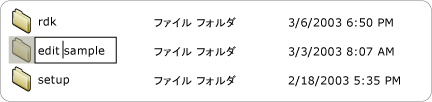

# Implementing the UI Automation Value Control Pattern
> [!NOTE]
>  このドキュメントは、[!INCLUDE[TLA2#tla_uiautomation](../../../includes/tla2sharptla-uiautomation-md.md)] 名前空間で定義されているマネージ <xref:System.Windows.Automation> クラスを使用する .NET Framework 開発者を対象としています。[!INCLUDE[TLA2#tla_uiautomation](../../../includes/tla2sharptla-uiautomation-md.md)] の最新情報については、「[Windows Automation API: UI オートメーション](http://go.microsoft.com/fwlink/?LinkID=156746)」を参照してください。  
  
 このトピックでは、イベントおよびプロパティに関する情報など、<xref:System.Windows.Automation.Provider.IValueProvider> の実装のためのガイドラインと規則について説明します。 その他のリファレンスへのリンクは、このトピックの最後に記載します。  
  
 <xref:System.Windows.Automation.ValuePattern> コントロール パターンは、範囲にまたがることのない組み込み値を持つコントロールや、文字列として表すことができるコントロールをサポートするために使用されます。 この文字列は、コントロールとその設定によっては、編集できます。 このパターンを実装するコントロールの例については、「[Control Pattern Mapping for UI Automation Clients](../../../docs/framework/ui-automation/control-pattern-mapping-for-ui-automation-clients.md)」を参照してください。  
  
   
## 実装のガイドラインと規則  
 Value コントロール パターンを実装する場合は、次のガイドラインと規則に留意してください。  
  
-   <xref:System.Windows.Automation.ControlType.ListItem> や <xref:System.Windows.Automation.ControlType.TreeItem> などのコントロールは、コントロールの現在の編集モードに関係なく、いずれかの項目の値が編集可能である場合は、<xref:System.Windows.Automation.ValuePattern> をサポートする必要があります。 子項目が編集可能である場合は、親コントロールも <xref:System.Windows.Automation.ValuePattern> をサポートする必要があります。  
  
   
編集可能なリスト項目の例  
  
-   単一行のエディット コントロールは、そのコンテンツへのプログラムによるアクセスをサポートするために、<xref:System.Windows.Automation.Provider.IValueProvider> を実装します。 一方、複数行のエディット コントロールは <xref:System.Windows.Automation.Provider.IValueProvider> を実装しません。代わりに <xref:System.Windows.Automation.Provider.ITextProvider> を実装して、そのコンテンツへのアクセスを提供します。  
  
-   複数行の編集コントロールのテキスト コンテンツを取得するには、コントロールが <xref:System.Windows.Automation.Provider.ITextProvider> を実装していなければなりません。 ただし、<xref:System.Windows.Automation.Provider.ITextProvider> はコントロールの値の設定はサポートしていません。  
  
-   <xref:System.Windows.Automation.Provider.IValueProvider> は、書式設定情報や部分文字列の値の取得をサポートしていません。 このようなシナリオでは <xref:System.Windows.Automation.Provider.ITextProvider> を実装します。  
  
-   <xref:System.Windows.Automation.Provider.IValueProvider> を実装する必要があるコントロールの一例は、[!INCLUDE[TLA#tla_word](../../../includes/tlasharptla-word-md.md)] の **カラー ピッカー**選択コントロールです \(以下を参照\)。このコントロールは、色の値 \(たとえば「黄」\) と同等の内部 [!INCLUDE[TLA#tla_rgb](../../../includes/tlasharptla-rgb-md.md)] 構造の間の文字列マッピングをサポートしています。  
  
   
色見本の文字列マッピング例  
  
-   <xref:System.Windows.Automation.Provider.IValueProvider.SetValue%2A> を呼び出せるようにするには、コントロールの <xref:System.Windows.Automation.AutomationElement.IsEnabledProperty> を `true` に設定し、<xref:System.Windows.Automation.ValuePattern.IsReadOnlyProperty> を `false` に設定する必要があります。  
  
   
## IValueProvider の必須メンバー  
 <xref:System.Windows.Automation.Provider.IValueProvider> の実装には、次のプロパティとメソッドが必要です。  
  
|必須メンバー|メンバーの型|ノート|  
|------------|------------|---------|  
|<xref:System.Windows.Automation.ValuePattern.IsReadOnlyProperty>|プロパティ|なし|  
|<xref:System.Windows.Automation.ValuePattern.ValueProperty>|プロパティ|なし|  
|<xref:System.Windows.Automation.ValuePattern.SetValue%2A>|メソッド|なし|  
  
   
## 例外  
 プロバイダーは、次の例外をスローする必要があります。  
  
|例外の種類|状態|  
|-----------|--------|  
|<xref:System.InvalidOperationException>|<xref:System.Windows.Automation.ValuePattern.SetValue%2A>   -   ロケールに固有の情報が、誤った形式でコントロールに渡された場合 \(誤った日付形式など\)。|  
|<xref:System.ArgumentException>|<xref:System.Windows.Automation.ValuePattern.SetValue%2A>   -   新しい値を、文字列からコントロールが認識する形式に変換できない場合。|  
|<xref:System.Windows.Automation.ElementNotEnabledException>|<xref:System.Windows.Automation.ValuePattern.SetValue%2A>   -   有効になっていないコントロールの操作が試行された場合。|  
  
## 参照  
 [UI Automation Control Patterns Overview](../../../docs/framework/ui-automation/ui-automation-control-patterns-overview.md)   
 [Support Control Patterns in a UI Automation Provider](../../../docs/framework/ui-automation/support-control-patterns-in-a-ui-automation-provider.md)   
 [UI Automation Control Patterns for Clients](../../../docs/framework/ui-automation/ui-automation-control-patterns-for-clients.md)   
 [TextPattern Insert Text Sample](http://msdn.microsoft.com/ja-jp/67353f93-7ee2-42f2-ab76-5c078cf6ca16)   
 [UI Automation Tree Overview](../../../docs/framework/ui-automation/ui-automation-tree-overview.md)   
 [Use Caching in UI Automation](../../../docs/framework/ui-automation/use-caching-in-ui-automation.md)