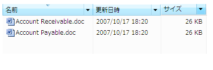

# UI オートメーションによる DataItem コントロール型のサポート
> [!NOTE]
>  このドキュメントは、[!INCLUDE[TLA2#tla_uiautomation](../../../includes/tla2sharptla-uiautomation-md.md)] 名前空間で定義されているマネージ <xref:System.Windows.Automation> クラスを使用する .NET Framework 開発者を対象としています。 [!INCLUDE[TLA2#tla_uiautomation](../../../includes/tla2sharptla-uiautomation-md.md)]の最新情報については、「 [Windows Automation API: UI オートメーション](http://go.microsoft.com/fwlink/?LinkID=156746)」を参照してください。  
  
 このトピックでは、DataItem コントロール型に対する [!INCLUDE[TLA#tla_uiautomation](../../../includes/tlasharptla-uiautomation-md.md)] のサポートについて説明します。 [!INCLUDE[TLA2#tla_uiautomation](../../../includes/tla2sharptla-uiautomation-md.md)] でのコントロール型とは、コントロールが <xref:System.Windows.Automation.AutomationElement.ControlTypeProperty> プロパティを使用するために満たす必要がある一連の条件のことです。 条件には、 [!INCLUDE[TLA2#tla_uiautomation](../../../includes/tla2sharptla-uiautomation-md.md)] ツリー構造、 [!INCLUDE[TLA2#tla_uiautomation](../../../includes/tla2sharptla-uiautomation-md.md)] プロパティの値、およびコントロール パターンに関する特定のガイドラインが含まれます。  
  
 連絡先リストのエントリは、データ項目コントロールの一例です。 データ項目コントロールには、エンド ユーザーに必要な情報が格納されます。 これは、より豊富な情報が格納されるため、単純なリスト項目よりも複雑になります。  
  
 以下の各セクションで、DataItem コントロール型に必要な [!INCLUDE[TLA2#tla_uiautomation](../../../includes/tla2sharptla-uiautomation-md.md)] ツリー構造、プロパティ、コントロール パターン、およびイベントを定義します。 [!INCLUDE[TLA2#tla_uiautomation](../../../includes/tla2sharptla-uiautomation-md.md)] の要件は、 [!INCLUDE[TLA#tla_winclient](../../../includes/tlasharptla-winclient-md.md)]、 [!INCLUDE[TLA#tla_win32](../../../includes/tlasharptla-win32-md.md)]、 [!INCLUDE[TLA#tla_winforms](../../../includes/tlasharptla-winforms-md.md)]のいずれの場合も、すべてのデータ項目コントロールに適用されます。  
  
   
## 必須の UI オートメーション ツリー構造  
 次の表に、データ項目コントロールに関連する [!INCLUDE[TLA2#tla_uiautomation](../../../includes/tla2sharptla-uiautomation-md.md)] ツリーのコントロール ビューとコンテンツ ビューを示し、それぞれのビューに含めることができる内容について説明します。 詳細については、[!INCLUDE[TLA2#tla_uiautomation](../../../includes/tla2sharptla-uiautomation-md.md)]ツリーを参照してください[UI オートメーション ツリーの概要](../../../docs/framework/ui-automation/ui-automation-tree-overview.md)です。  
  
|[!INCLUDE[TLA2#tla_uiautomation](../../../includes/tla2sharptla-uiautomation-md.md)] ツリー - コントロール ビュー|[!INCLUDE[TLA2#tla_uiautomation](../../../includes/tla2sharptla-uiautomation-md.md)] ツリー - コンテンツ ビュー|  
|------------------------------------------------------------------------------------------------|------------------------------------------------------------------------------------------------|  
|DataItem   -異なります (0 以上階層で構造化できます)。|DataItem   -異なります (0 以上階層で構造化できます)。|  
  
 データ グリッド内のデータ項目要素は、さまざまなオブジェクトをホストできます。たとえば、別のレイヤーのデータ項目や、テキスト、イメージ、エディット コントロールなどの特定のグリッド要素をホストできます。 データ項目要素に特定のオブジェクトの役割がある場合は、その要素を特定のコントロール型 (たとえば、グリッド内の選択可能なデータ項目の場合は ListItem コントロール型など) として公開する必要があります。  
  
   
## 必須の UI オートメーション プロパティ  
 次の表に、データ項目コントロールに特に関連する値または定義を持つプロパティを示します。 詳細については[!INCLUDE[TLA2#tla_uiautomation](../../../includes/tla2sharptla-uiautomation-md.md)]プロパティを参照してください[クライアントの UI オートメーション プロパティ](../../../docs/framework/ui-automation/ui-automation-properties-for-clients.md)です。  
  
|プロパティ|値|ノート|  
|--------------|-----------|-----------|  
|<xref:System.Windows.Automation.AutomationElementIdentifiers.AutomationIdProperty>|ノートを参照してください。|このプロパティの値は、アプリケーションのすべてのコントロールで一意である必要があります。|  
|<xref:System.Windows.Automation.AutomationElementIdentifiers.BoundingRectangleProperty>|「ノート」をご覧ください。|コントロール全体を格納する最も外側の四角形。|  
|<xref:System.Windows.Automation.AutomationElementIdentifiers.ClickablePointProperty>|「ノート」をご覧ください。|四角形領域が存在する場合にサポートされます。 四角形領域の内側にクリック不可能な点が存在し、特別なヒット テストを実行する場合は、クリック可能な点をオーバーライドして提供します。|  
|<xref:System.Windows.Automation.AutomationElementIdentifiers.ControlTypeProperty>|DataItem|この値は、すべての UI フレームワークで同じです。|  
|<xref:System.Windows.Automation.AutomationElementIdentifiers.IsContentElementProperty>|True|データ項目コントロールは、常にコンテンツである必要があります。|  
|<xref:System.Windows.Automation.AutomationElementIdentifiers.IsControlElementProperty>|True|データ項目コントロールは、常にコントロールである必要があります。|  
|<xref:System.Windows.Automation.AutomationElementIdentifiers.IsKeyboardFocusableProperty>|「ノート」を参照。|コントロールがキーボード フォーカスを受け取ることができる場合は、このプロパティをサポートする必要があります。|  
|<xref:System.Windows.Automation.AutomationElementIdentifiers.ItemStatusProperty>|「ノート」を参照。|コントロールに動的に更新される状態が含まれる場合、要素の状態が変化したときに支援技術が更新を受け取ることができるように、このプロパティをサポートする必要があります。|  
|<xref:System.Windows.Automation.AutomationElementIdentifiers.ItemTypeProperty>|「ノート」を参照。|これは、項目が表す基になるオブジェクトをエンド ユーザーに伝達する文字列値です。 例として "メディア ファイル" や "連絡先" があります。|  
|<xref:System.Windows.Automation.AutomationElementIdentifiers.LabeledByProperty>|`Null`|データ項目コントロールに静的なテキスト ラベルはありません。|  
|<xref:System.Windows.Automation.AutomationElementIdentifiers.LocalizedControlTypeProperty>|"data item"|DataItem コントロール型に対応するローカライズされた文字列。|  
|<xref:System.Windows.Automation.AutomationElementIdentifiers.NameProperty>|「ノート」を参照。|データ項目コントロールには、主要なテキスト要素が常に含まれています。この要素は、その項目に対してユーザーが最も意味的な識別子として連想するものに関連しています。|  
  
   
## 必須の UI オートメーション コントロール パターン  
 次の表に、すべてのデータ項目コントロールでサポートされなければならない [!INCLUDE[TLA#tla_uiautomation](../../../includes/tlasharptla-uiautomation-md.md)] コントロール パターンを示します。 コントロール パターンの詳細については、「 [UI Automation Control Patterns Overview](../../../docs/framework/ui-automation/ui-automation-control-patterns-overview.md)」を参照してください。  
  
|コントロール パターン|Support|ノート|  
|---------------------|-------------|-----------|  
|<xref:System.Windows.Automation.Provider.IExpandCollapseProvider>|状況に依存|データ項目を展開したり折りたたんだりして、情報の表示/非表示を切り替える場合、Expand Collapse パターンをサポートする必要があります。|  
|<xref:System.Windows.Automation.Provider.IGridItemProvider>|状況に依存|データ項目の集合が、空間的に項目間を移動できるコンテナー内にある場合、データ項目は Grid Item パターンをサポートします。|  
|<xref:System.Windows.Automation.Provider.IScrollItemProvider>|状況に依存|画面に収まる項目数を超える項目がデータ コンテナーにある場合、すべてのデータ項目は Scroll Item パターンを使用して、スクロールして表示する機能をサポートします。|  
|<xref:System.Windows.Automation.Provider.ISelectionItemProvider>|はい|すべてのデータ項目は、項目が選択されたタイミングを示す Selection Item パターンをサポートする必要があります。|  
|<xref:System.Windows.Automation.Provider.ITableItemProvider>|状況に依存|データ項目が Data Grid コントロール型の中に含まれている場合、このパターンをサポートします。|  
|<xref:System.Windows.Automation.Provider.IToggleProvider>|状況に依存|データ項目に循環する状態が含まれる場合。|  
|<xref:System.Windows.Automation.Provider.IValueProvider>|状況に依存|データ項目の主要なテキストが編集可能な場合は、Value パターンをサポートする必要があります。|  
  
   
## 大きなリストでのデータ項目の操作  
 大きなリストでは、多くの場合、パフォーマンスを向上させるため、 [!INCLUDE[TLA2#tla_ui](../../../includes/tla2sharptla-ui-md.md)] フレームワーク内でデータが仮想化されます。 そのため、UI オートメーション クライアントは、 [!INCLUDE[TLA2#tla_uiautomation](../../../includes/tla2sharptla-uiautomation-md.md)] クエリ機能を使用して、他の項目コンテナーと同じように完全なツリーからコンテンツを取得することができません。 クライアントは、データ項目の完全に揃った情報にアクセスする前に、項目をスクロールして表示する (またはコントロールを展開して重要なすべてのオプションを表示する) 必要があります。  
  
 データ項目の `SetFocus` 要素で [!INCLUDE[TLA2#tla_uiautomation](../../../includes/tla2sharptla-uiautomation-md.md)] を呼び出すときに、 [!INCLUDE[TLA#tla_winexpl](../../../includes/tlasharptla-winexpl-md.md)] の場合は正常に値を返し、データ項目サブツリー内でフォーカスを編集に設定します。  
  
   
## 必須の UI オートメーション イベント  
 次の表に、すべてのデータ項目コントロールでサポートされなければならない [!INCLUDE[TLA2#tla_uiautomation](../../../includes/tla2sharptla-uiautomation-md.md)] イベントを示します。 イベントの詳細については、「 [UI Automation Events Overview](../../../docs/framework/ui-automation/ui-automation-events-overview.md)」を参照してください。  
  
|[!INCLUDE[TLA2#tla_uiautomation](../../../includes/tla2sharptla-uiautomation-md.md)] イベント|Support|ノート|  
|---------------------------------------------------------------------------------|-------------|-----------|  
|<xref:System.Windows.Automation.AutomationElementIdentifiers.AutomationFocusChangedEvent>|必要|なし|  
|<xref:System.Windows.Automation.AutomationElementIdentifiers.BoundingRectangleProperty> プロパティ変更イベント。|必要|なし|  
|<xref:System.Windows.Automation.AutomationElementIdentifiers.IsEnabledProperty> プロパティ変更イベント。|必要|なし|  
|<xref:System.Windows.Automation.AutomationElementIdentifiers.IsOffscreenProperty> プロパティ変更イベント。|必要|なし|  
|<xref:System.Windows.Automation.AutomationElementIdentifiers.NameProperty> プロパティ変更イベント。|必要|なし|  
|<xref:System.Windows.Automation.AutomationElementIdentifiers.StructureChangedEvent>|必須|なし|  
|<xref:System.Windows.Automation.InvokePatternIdentifiers.InvokedEvent>|状況に依存|なし|  
|<xref:System.Windows.Automation.ExpandCollapsePatternIdentifiers.ExpandCollapseStateProperty> プロパティ変更イベント。|状況に依存|なし|  
|<xref:System.Windows.Automation.SelectionItemPatternIdentifiers.ElementAddedToSelectionEvent>|必須|なし|  
|<xref:System.Windows.Automation.SelectionItemPatternIdentifiers.ElementRemovedFromSelectionEvent>|必須|なし|  
|<xref:System.Windows.Automation.SelectionItemPatternIdentifiers.ElementSelectedEvent>|必須|なし|  
|<xref:System.Windows.Automation.TogglePatternIdentifiers.ToggleStateProperty> プロパティ変更イベント。|状況に依存|なし|  
|<xref:System.Windows.Automation.ValuePatternIdentifiers.ValueProperty> プロパティ変更イベント。|状況に依存|なし|  
  
   
## DataItem コントロール型の例  
 次の図は、列の豊富な情報をサポートするリスト ビュー コントロール内の DataItem コントロール型を示しています。  
  
   
  
 以下には、データ項目コントロールに関連する [!INCLUDE[TLA2#tla_uiautomation](../../../includes/tla2sharptla-uiautomation-md.md)] ツリーのコントロール ビューとコンテンツ ビューが表示されています。 オートメーションの各要素のコントロール パターンが、かっこ内に示されています。 グループ "Contoso" は、データ グリッド ホスト コントロールのグリッドの一部でもあります。  
  
|[!INCLUDE[TLA2#tla_uiautomation](../../../includes/tla2sharptla-uiautomation-md.md)] ツリー - コントロール ビュー|[!INCLUDE[TLA2#tla_uiautomation](../../../includes/tla2sharptla-uiautomation-md.md)] ツリー - コンテンツ ビュー|  
|------------------------------------------------------------------------------------------------|------------------------------------------------------------------------------------------------|  
|-グループ"Contoso"(テーブル、グリッド) -DataItem"Accounts Receivable.doc"(TableItem、GridItem、SelectionItem を呼び出す) イメージの"Accounts Receivable.doc" -"Name"(TableItem、GridItem、値"Accounts Receivable.doc") を編集します。 編集「日時」(TableItem、GridItem、値"2006/8/25 3時 29分 PM") -[サイズ] (GridItem、TableItem、値"11.0 KB) を編集します。 -DataItem"Accounts Payable.doc"(TableItem、GridItem、SelectionItem を呼び出す) -   ...|-グループ"Contoso"(テーブル、グリッド) -DataItem"Accounts Receivable.doc"(TableItem、GridItem、SelectionItem を呼び出す) イメージの"Accounts Receivable.doc" -"Name"(TableItem、GridItem、値"Accounts Receivable.doc") を編集します。 編集「日時」(TableItem、GridItem、値"2006/8/25 3時 29分 PM") -[サイズ] (GridItem、TableItem、値"11.0 KB) を編集します。 -DataItem"Accounts Payable.doc"(TableItem、GridItem、SelectionItem を呼び出す) -   …|  
  
 グリッドが選択可能な項目のリストを表している場合、DataItem コントロール型の代わりに、ListItem コントロール型で対応する UI 要素を公開できます。 前の例では、グループ ("Contoso") の下の DataItem 要素 ("Accounts Receivable.doc" および "Accounts Payable.doc") を ListItem コントロール型として公開することで、その型が既に SelectionItem コントロール パターンをサポートしているため、それらの要素を向上させることができます。  
  
## 関連項目  
 <xref:System.Windows.Automation.ControlType.DataItem>  
 [UI オートメーション コントロール型の概要](../../../docs/framework/ui-automation/ui-automation-control-types-overview.md)  
 [UI オートメーションの概要](../../../docs/framework/ui-automation/ui-automation-overview.md)
