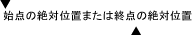

# UI オートメーション TextPattern の概要UI Automation TextPattern Overview
> [!NOTE]
>  このドキュメントは、[!INCLUDE[TLA2#tla_uiautomation](../../../includes/tla2sharptla-uiautomation-md.md)] 名前空間で定義されているマネージ <xref:System.Windows.Automation> クラスを使用する .NET Framework 開発者を対象としています。This documentation is intended for .NET Framework developers who want to use the managed [!INCLUDE[TLA2#tla_uiautomation](../../../includes/tla2sharptla-uiautomation-md.md)] classes defined in the <xref:System.Windows.Automation> namespace. [!INCLUDE[TLA2#tla_uiautomation](../../../includes/tla2sharptla-uiautomation-md.md)]の最新情報については、「 [Windows Automation API: UI Automation (Windows のオートメーション API: UI オートメーション)](http://go.microsoft.com/fwlink/?LinkID=156746)」を参照してください。For the latest information about [!INCLUDE[TLA2#tla_uiautomation](../../../includes/tla2sharptla-uiautomation-md.md)], see [Windows Automation API: UI Automation](http://go.microsoft.com/fwlink/?LinkID=156746).  
  
 この概要では、 [!INCLUDE[TLA#tla_uiautomation](../../../includes/tlasharptla-uiautomation-md.md)] を使用して、 [!INCLUDE[TLA2#tla_uiautomation](../../../includes/tla2sharptla-uiautomation-md.md)]でサポートされているプラットフォームのテキスト コントロールのテキストの内容 (書式とスタイルの属性など) を公開する方法について説明します。This overview describes how to use [!INCLUDE[TLA#tla_uiautomation](../../../includes/tlasharptla-uiautomation-md.md)] to expose the textual content, including format and style attributes, of text controls in [!INCLUDE[TLA2#tla_uiautomation](../../../includes/tla2sharptla-uiautomation-md.md)]-supported platforms. これらのコントロールがありますが、Microsoft .NET Framework に限定されない<xref:System.Windows.Controls.TextBox>と<xref:System.Windows.Controls.RichTextBox>だけでなく、[!INCLUDE[TLA2#tla_win32](../../../includes/tla2sharptla-win32-md.md)]相当します。These controls include, but are not limited to, the Microsoft .NET Framework <xref:System.Windows.Controls.TextBox> and <xref:System.Windows.Controls.RichTextBox> as well as their [!INCLUDE[TLA2#tla_win32](../../../includes/tla2sharptla-win32-md.md)] equivalents.  
  
 コントロールのテキストの内容は、 <xref:System.Windows.Automation.TextPattern> コントロール パターンを使用することで公開できます。コントロール パターンは、テキスト コンテナーの内容をテキスト ストリームとして表したものです。Exposing the textual content of a control is accomplished through the use of the <xref:System.Windows.Automation.TextPattern> control pattern, which represents the contents of a text container as a text stream. さらに、 <xref:System.Windows.Automation.TextPattern> は、書式とスタイルの属性を公開する <xref:System.Windows.Automation.Text.TextPatternRange> クラスをサポートする必要があります。In turn, <xref:System.Windows.Automation.TextPattern> requires the support of the <xref:System.Windows.Automation.Text.TextPatternRange> class to expose format and style attributes. <xref:System.Windows.Automation.Text.TextPatternRange> は、 <xref:System.Windows.Automation.TextPattern> および <xref:System.Windows.Automation.Text.TextPatternRangeEndpoint.Start> エンドポイントのコレクションがあるテキスト コンテナーに、連続する、または複数の非結合テキスト範囲を表すことで <xref:System.Windows.Automation.Text.TextPatternRangeEndpoint.End> をサポートします。<xref:System.Windows.Automation.Text.TextPatternRange> supports <xref:System.Windows.Automation.TextPattern> by representing contiguous or multiple, disjoint text spans in a text container with a collection of <xref:System.Windows.Automation.Text.TextPatternRangeEndpoint.Start> and <xref:System.Windows.Automation.Text.TextPatternRangeEndpoint.End> endpoints. <xref:System.Windows.Automation.Text.TextPatternRange> は、選択、比較、取得、トラバースなどの機能をサポートしています。<xref:System.Windows.Automation.Text.TextPatternRange> supports functionality such as selection, comparison, retrieval and traversal.  
  
> [!NOTE]
>  <xref:System.Windows.Automation.TextPattern> クラスには、テキストを挿入または変更する手段がありません。The <xref:System.Windows.Automation.TextPattern> classes do not provide a means to insert or modify text. しかし、コントロールによっては、 [!INCLUDE[TLA2#tla_uiautomation](../../../includes/tla2sharptla-uiautomation-md.md)] <xref:System.Windows.Automation.ValuePattern> によって、または直接キーボードから入力して、これを実現できます。However, depending on the control, this may be accomplished by the [!INCLUDE[TLA2#tla_uiautomation](../../../includes/tla2sharptla-uiautomation-md.md)] <xref:System.Windows.Automation.ValuePattern> or through direct keyboard input. 参照してください、 [TextPattern の挿入テキスト サンプル](http://msdn.microsoft.com/library/67353f93-7ee2-42f2-ab76-5c078cf6ca16)例についてはします。See the [TextPattern Insert Text Sample](http://msdn.microsoft.com/library/67353f93-7ee2-42f2-ab76-5c078cf6ca16) for an example.  
  
 この概要で説明されている機能は、支援技術ベンダーとそのエンドユーザーにとって重要です。The functionality described in this overview is vital to assistive technology vendors and their end users. 支援技術は、 [!INCLUDE[TLA2#tla_uiautomation](../../../includes/tla2sharptla-uiautomation-md.md)] を使用してユーザー向けに完全なテキストの書式設定情報を収集するとともに、プログラムによるナビゲーションと、 <xref:System.Windows.Automation.Text.TextUnit> によるテキストの選択 (文字、単語、行、または段落) を行います。Assistive technologies can use [!INCLUDE[TLA2#tla_uiautomation](../../../includes/tla2sharptla-uiautomation-md.md)] to gather complete text formatting information for the user and provide programmatic navigation and selection of text by <xref:System.Windows.Automation.Text.TextUnit> (character, word, line, or paragraph).  
  
   
## UI オートメーション TextPattern とText Services Framework (TSF)UI Automation TextPattern vs. Text Services Framework  
 [!INCLUDE[TLA#tla_tsf](../../../includes/tlasharptla-tsf-md.md)] は、デスクトップ上およびアプリケーション内で、自然言語サービスと高度なテキスト入力を行えるようにする、拡張性のあるシステム フレームワークです。 is a simple and scalable system framework that enables natural language services and advanced text input on the desktop and within applications. アプリケーションのテキスト ストアを公開するインターフェイスをアプリケーションに提供するだけでなく、そのテキスト ストアのメタデータもサポートします。In addition to providing interfaces for applications to expose their text store it also supports metadata for that text store.  
  
 ただし、 [!INCLUDE[TLA2#tla_tsf](../../../includes/tla2sharptla-tsf-md.md)] は、コンテキストに対応したシナリオに入力を挿入する必要がある一方、 <xref:System.Windows.Automation.TextPattern> は、スクリーン リーダーとブライユ点字デバイス用のテキスト ストアに最適にアクセスできるようにすることを意図した、(前述の制限付きの回避策による) 読み取り専用のソリューションです。However, [!INCLUDE[TLA2#tla_tsf](../../../includes/tla2sharptla-tsf-md.md)] was designed for applications that need to inject input into context-aware scenarios whereas <xref:System.Windows.Automation.TextPattern> is a read-only solution (with the limited workaround noted above) meant to provide optimized access to a text store for screen-readers and Braille devices.  
  
 つまり、テキスト ストアへの読み取り専用のアクセスが必要なアクセス可能なテクノロジでは <xref:System.Windows.Automation.TextPattern>を使用できますが、コンテキストに対応する入力には [!INCLUDE[TLA2#tla_tsf](../../../includes/tla2sharptla-tsf-md.md)] のより複雑な機能が必要になります。In short, accessible technologies that require read-only access to a text store can use <xref:System.Windows.Automation.TextPattern>, but will need the more complex functionality of [!INCLUDE[TLA2#tla_tsf](../../../includes/tla2sharptla-tsf-md.md)] for context-aware input.  
  
   
## コントロールの種類Control Types  
  
#### テキストText  
 テキスト コントロールは、画面上のテキストの一部を表す基本要素です。The Text control is the basic element representing a piece of text on the screen.  
  
 スタンドアロンのテキスト コントロールは、フォーム上のラベルまたは静的テキストとして使用できます。A standalone text control can be used as a label or static text on a form. また、テキスト コントロールを、 <xref:System.Windows.Automation.ControlType.ListItem>、 <xref:System.Windows.Automation.ControlType.TreeItem> 、または <xref:System.Windows.Automation.ControlType.DataItem>の構造に含めることもできます。Text controls can also be contained within the structure of a <xref:System.Windows.Automation.ControlType.ListItem>, <xref:System.Windows.Automation.ControlType.TreeItem> or <xref:System.Windows.Automation.ControlType.DataItem>.  
  
> [!NOTE]
>  テキスト コントロールは、 [!INCLUDE[TLA2#tla_uiautomation](../../../includes/tla2sharptla-uiautomation-md.md)] ツリーのコンテンツ ビューに表示されないことがあります (「 [UI Automation Tree Overview](../../../docs/framework/ui-automation/ui-automation-tree-overview.md)」をご覧ください)。Text controls might not appear in the content view of the [!INCLUDE[TLA2#tla_uiautomation](../../../includes/tla2sharptla-uiautomation-md.md)] tree (see [UI Automation Tree Overview](../../../docs/framework/ui-automation/ui-automation-tree-overview.md)). これは、テキスト コントロールが別のコントロールの Name プロパティを通じて表示されることがよくあるためです。This is because text controls are often displayed through the Name property of another control. たとえば、エディット コントロールのラベルに使用するテキストは、エディット コントロールの Name プロパティを通じて公開されます。For instance, the text that is used to label an Edit control is exposed through the Name property of the Edit control. エディット コントロールが [!INCLUDE[TLA2#tla_uiautomation](../../../includes/tla2sharptla-uiautomation-md.md)] ツリーのコンテンツ ビューに存在するので、テキスト要素自体は [!INCLUDE[TLA2#tla_uiautomation](../../../includes/tla2sharptla-uiautomation-md.md)] ツリーの対象のビューに存在する必要はありません。Because the Edit control is in the content view of the [!INCLUDE[TLA2#tla_uiautomation](../../../includes/tla2sharptla-uiautomation-md.md)] tree, it is not necessary for the text element itself to be in that view of the [!INCLUDE[TLA2#tla_uiautomation](../../../includes/tla2sharptla-uiautomation-md.md)] tree. コンテンツ ビューに表示されるテキストは、冗長な情報ではないテキストのみです。The only text that shows up in the content view is text that is not redundant information. これにより、支援テクノロジは、ユーザーが必要とする情報のみをすばやくフィルター処理できるようになります。This enables any assistive technology to quickly filter only on the pieces of information that their users need.  
  
#### 編集Edit  
 エディット コントロールを使用すると、ユーザーは 1 行のテキストを表示および編集できます。Edit controls enable a user to view and edit a single line of text.  
  
> [!NOTE]
>  1 行のテキストは、特定のレイアウトのシナリオでは折り返すことができます。The single line of text may wrap in certain layout scenarios.  
  
#### ドキュメントDocument  
 ドキュメント コントロールを使用すると、ユーザーは複数のページのテキストに移動して、そこから情報を取得できます。Document controls let a user navigate and obtain information from multiple pages of text.  
  
   
## TextPattern クライアント APITextPattern Client API's  
  
|||  
|-|-|  
|`System.Windows.Automation.TextPattern Class`|[!INCLUDE[TLA#tla_uiautomation](../../../includes/tlasharptla-uiautomation-md.md)] テキスト モデルのエントリ ポイントです。The entry point for the [!INCLUDE[TLA#tla_uiautomation](../../../includes/tlasharptla-uiautomation-md.md)] text model.   このクラスには、 <xref:System.Windows.Automation.TextPattern> と <xref:System.Windows.Automation.TextPattern.TextSelectionChangedEvent> という 2 つの <xref:System.Windows.Automation.TextPattern.TextChangedEvent>イベント リスナーが含まれています。This class also contains the two <xref:System.Windows.Automation.TextPattern> event listeners, <xref:System.Windows.Automation.TextPattern.TextSelectionChangedEvent> and <xref:System.Windows.Automation.TextPattern.TextChangedEvent>.|  
|`System.Windows.Automation.Text.TextPatternRange Class`|<xref:System.Windows.Automation.TextPattern>をサポートする、テキスト コンテナー内のテキストの範囲の表記です。The representation of a span of text within a text container that supports <xref:System.Windows.Automation.TextPattern>.   UI オートメーション クライアントは、 <xref:System.Windows.Automation.Text.TextPatternRange>を使用して作成されるテキスト範囲の現在の有効性に関して注意する必要があります。UI Automation clients should be careful about the current validity of a text range created using <xref:System.Windows.Automation.Text.TextPatternRange>. テキスト コントロールにある元のテキストが完全に新しいテキストに置き換えられた場合、現在のテキスト範囲は無効になります。If the original text in the text control is completely replaced by new text, the current text range becomes invalid. ただし、元のテキストの一部のみが変更され、基になるテキスト コントロールが、文字の絶対位置ではなくアンカー (またはエンドポイント) が付いたテキストの「ポインター」で管理している場合、テキスト範囲にはまだいくらかの有効性があります。However, the text range may still have some viability if only part of the original text is changed and the underlying text control is managing its text "pointer" with anchors (or endpoints) rather than with absolute character positioning.   クライアントは、 <xref:System.Windows.Automation.TextPattern.TextChangedEvent> をリッスンして、操作するテキスト コンテンツに変更があった場合に通知を受けることができます。Clients can listen for a <xref:System.Windows.Automation.TextPattern.TextChangedEvent> for notification of any changes to the textual content they are working with.|  
|`System.Windows.Automation.AutomationTextAttribute Class`|テキスト範囲の書式設定の属性を識別するために使用されます。Used to identify the formatting attributes of a text range.|  
  
   
## TextPattern プロバイダー APITextPattern Provider API's  
 ネイティブに、または <xref:System.Windows.Automation.TextPattern> プロキシを介して <xref:System.Windows.Automation.Provider.ITextProvider> および <xref:System.Windows.Automation.Provider.ITextRangeProvider> の各インターフェイスを実装することで [!INCLUDE[TLA#tla_uiautomation](../../../includes/tlasharptla-uiautomation-md.md)] をサポートする UI 要素またはコントロールは、堅牢なナビゲーション機能を提供するだけでなく、含まれている任意のテキストの詳細な属性情報を公開することができます。UI elements or controls that support <xref:System.Windows.Automation.TextPattern> by implementing the <xref:System.Windows.Automation.Provider.ITextProvider> and <xref:System.Windows.Automation.Provider.ITextRangeProvider> interfaces, either natively or through [!INCLUDE[TLA#tla_uiautomation](../../../includes/tlasharptla-uiautomation-md.md)] proxies, are capable of exposing detailed attribute information for any text they contain in addition to providing robust navigational capabilities.  
  
 <xref:System.Windows.Automation.TextPattern> プロバイダーは、コントロールで特定の属性のサポートが不足している場合、すべてのテキスト属性をサポートする必要はありません。A <xref:System.Windows.Automation.TextPattern> provider does not have to support all text attributes if the control lacks support for any particular attributes.  
  
 <xref:System.Windows.Automation.TextPattern> プロバイダーは、コントロールがテキスト領域内でテキストの選択またはテキストのカーソル (またはシステム キャレット) の配置をサポートする場合に <xref:System.Windows.Automation.TextPattern.GetSelection%2A> 機能と <xref:System.Windows.Automation.Text.TextPatternRange.Select%2A> 機能をサポートする必要があります。A <xref:System.Windows.Automation.TextPattern> provider must support the <xref:System.Windows.Automation.TextPattern.GetSelection%2A> and <xref:System.Windows.Automation.Text.TextPatternRange.Select%2A> functions if the control supports text selection or placement of the text cursor (or system caret) within the text area. コントロールがこの機能をサポートしない場合、これらのメソッドのいずれもサポートする必要はありません。If the control does not support this functionality then it does not need to support either of these methods. ただし、 <xref:System.Windows.Automation.Provider.ITextProvider.SupportedTextSelection%2A> プロパティを実装することで、コントロールはサポートするテキスト選択項目の種類を公開する必要があります。However, the control must expose the type of text selection it supports by implementing the <xref:System.Windows.Automation.Provider.ITextProvider.SupportedTextSelection%2A> property.  
  
 <xref:System.Windows.Automation.TextPattern> プロバイダーは、 <xref:System.Windows.Automation.Text.TextUnit> の定数 <xref:System.Windows.Automation.Text.TextUnit.Character> と <xref:System.Windows.Automation.Text.TextUnit.Document> 、およびサポートが可能なその他すべての <xref:System.Windows.Automation.Text.TextUnit> 定数を常にサポートする必要があります。A <xref:System.Windows.Automation.TextPattern> provider must always support the <xref:System.Windows.Automation.Text.TextUnit> constants <xref:System.Windows.Automation.Text.TextUnit.Character> and <xref:System.Windows.Automation.Text.TextUnit.Document> as well as any other <xref:System.Windows.Automation.Text.TextUnit> constants it is capable of supporting.  
  
> [!NOTE]
>  プロバイダーは、次に大きい <xref:System.Windows.Automation.Text.TextUnit> ( <xref:System.Windows.Automation.Text.TextUnit> 、 <xref:System.Windows.Automation.Text.TextUnit.Character>、 <xref:System.Windows.Automation.Text.TextUnit.Format>、 <xref:System.Windows.Automation.Text.TextUnit.Word>、 <xref:System.Windows.Automation.Text.TextUnit.Line>、 <xref:System.Windows.Automation.Text.TextUnit.Paragraph>、 <xref:System.Windows.Automation.Text.TextUnit.Page>の順序でサポートされています) を遅らせることで、特定の <xref:System.Windows.Automation.Text.TextUnit.Document>のサポートを省略できます。The provider may skip support for a specific <xref:System.Windows.Automation.Text.TextUnit> by deferring to the next largest <xref:System.Windows.Automation.Text.TextUnit> supported in the following order: <xref:System.Windows.Automation.Text.TextUnit.Character>, <xref:System.Windows.Automation.Text.TextUnit.Format>, <xref:System.Windows.Automation.Text.TextUnit.Word>, <xref:System.Windows.Automation.Text.TextUnit.Line>, <xref:System.Windows.Automation.Text.TextUnit.Paragraph>, <xref:System.Windows.Automation.Text.TextUnit.Page>, and <xref:System.Windows.Automation.Text.TextUnit.Document>.  
  
|||  
|-|-|  
|`ITextProvider Interface`|クライアント アプリケーションで <xref:System.Windows.Automation.TextPattern> をサポートするメソッド、プロパティ、および属性を公開します ( <xref:System.Windows.Automation.Provider.ITextProvider>を参照してください)。Exposes methods, properties and attributes that support <xref:System.Windows.Automation.TextPattern> in client applications (see <xref:System.Windows.Automation.Provider.ITextProvider>).|  
|`ITextRangeProvider Interface`|テキスト プロバイダー内のテキストの範囲を表します ( <xref:System.Windows.Automation.Provider.ITextRangeProvider>を参照してください)。Represents a span of text in a text provider (see <xref:System.Windows.Automation.Provider.ITextRangeProvider>).|  
|`System.Windows.Automation.TextPatternIdentifiers Class`|テキスト プロバイダーの識別子として使用される値が含まれています ( <xref:System.Windows.Automation.TextPatternIdentifiers>を参照してください)。Contains values that are used as identifiers for text providers (see <xref:System.Windows.Automation.TextPatternIdentifiers>).|  
  
   
## セキュリティSecurity  
 [!INCLUDE[TLA2#tla_uiautomation](../../../includes/tla2sharptla-uiautomation-md.md)]アーキテクチャは、セキュリティを考慮して設計されました (を参照してください[UI オートメーションのセキュリティ概要](../../../docs/framework/ui-automation/ui-automation-security-overview.md))。The [!INCLUDE[TLA2#tla_uiautomation](../../../includes/tla2sharptla-uiautomation-md.md)] architecture was designed with security in mind (see [UI Automation Security Overview](../../../docs/framework/ui-automation/ui-automation-security-overview.md)). ただし、この概要で説明する TextPattern クラスにはいくつか特定のセキュリティの考慮事項が必要です。However, the TextPattern classes described in this overview require some specific security considerations.  
  
-   [!INCLUDE[TLA#tla_uiautomation](../../../includes/tlasharptla-uiautomation-md.md)] テキスト プロバイダーは、読み取り専用のインターフェイスを提供しますが、コントロールにある既存のテキストを変更する機能はありません。 text providers supply read-only interfaces and do not provide the ability to change the existing text in a control.  
  
-   UI オートメーション クライアントは、それらが完全に「信頼できる」場合にのみ [!INCLUDE[TLA#tla_uiautomation](../../../includes/tlasharptla-uiautomation-md.md)] を使用します。UI Automation clients can only use [!INCLUDE[TLA#tla_uiautomation](../../../includes/tlasharptla-uiautomation-md.md)] if they are fully "trusted". この一例となるものが、信頼できる既知のアプリケーションのみが実行できる、保護されたログオン デスクトップです。An example of this would be the protected Logon Desktop, where only known and trusted applications can run.  
  
-   UI オートメーション プロバイダーの開発者は、 [!INCLUDE[TLA#tla_uiautomation](../../../includes/tlasharptla-uiautomation-md.md)] を介してコントロールに公開することにしたすべての情報が、基本的にパブリックであり、他のコードで完全にアクセスできることを認識する必要があります。Developers of UI Automation providers should be aware that all information they choose to expose in their controls through [!INCLUDE[TLA#tla_uiautomation](../../../includes/tlasharptla-uiautomation-md.md)] is essentially public and fully accessible by other code. [!INCLUDE[TLA#tla_uiautomation](../../../includes/tlasharptla-uiautomation-md.md)] は、UI オートメーション クライアントの信頼性を判断しようとしません。そのため、保護されたコンテンツまたは機密性の高いテキストの情報 (パスワード フィールドなど) をUI オートメーション プロバイダーで公開しないことをお勧めします。 makes no effort to determine the trustworthiness of any UI Automation client and therefore the UI Automation provider should not expose protected content or sensitive textual information (such as password fields).  
  
-   [!INCLUDE[TLA#tla_winvista](../../../includes/tlasharptla-winvista-md.md)] のセキュリティにおける最も重要な変更の 1 つは、「セキュリティで保護された入力」と広く言われるものです。これは、最小特権 (または制限付き) ユーザー アカウント (LUA) と UI 特権レベルの分離 (UIPI) などのテクノロジを包含しています。One of the most significant changes in security for [!INCLUDE[TLA#tla_winvista](../../../includes/tlasharptla-winvista-md.md)] is broadly referred to as "Secure Input" which encompasses technologies such as Least-privileged (or Limited) User Accounts (LUA) and UI Privilege Level Isolation (UIPI).  
  
    -   UIPI は、プログラムが他のより「特権が高い」プログラムを制御または監視できないようにすることで、ユーザー入力になりすましたプロセス間のウィンドウ メッセージ攻撃を防ぎます。UIPI prevents one program from controlling and/or monitoring another more "privileged" program, preventing cross-process window message attacks that spoof user input.  
  
    -   LUA は、管理者グループのユーザーが実行しているアプリケーションの特権に制限を設定します。LUA sets limits on the privileges of applications being run by users in the Administrators group. アプリケーションには必ずしも管理者特権は必要なく、代わりに必要最小限の特権で実行します。Applications won't necessarily have administrator privileges, but will instead run with the least privileges necessary. その結果、LUA シナリオに制限が適用される可能性があります。As a consequence, there may be some restrictions enforced in LUA scenarios. 最も顕著な文字列の切り捨て (TextPattern 文字列など) では、管理者レベルのアプリケーションから取得される文字列のサイズを制限する必要があることがあります。そうすることで、これらのアプリケーションは、アプリケーションを無効にするポイントまで強制的にメモリを割り当てられずに済みます。Most notably string truncation (including TextPattern strings), where it may be necessary to limit the size of strings being retrieved from administrator-level applications so they aren't forced to allocate memory to the point of disabling the application.  
  
   
## パフォーマンスPerformance  
 TextPattern はその機能のほとんどでプロセス間の呼び出しに依存しているので、コンテンツを処理するときにパフォーマンスを向上させるキャッシュのメカニズムは提供しません。Because TextPattern relies on cross-process calls for most of its functionality, it does not provide a caching mechanism to improve performance when processing content. これは、 [!INCLUDE[TLA#tla_uiautomation](../../../includes/tlasharptla-uiautomation-md.md)] メソッドまたは <xref:System.Windows.Automation.AutomationElement.GetCachedPattern%2A> メソッドを使用してアクセスできる <xref:System.Windows.Automation.AutomationElement.TryGetCachedPattern%2A> の他のコントロール パターンとは異なります。This is unlike other control patterns in [!INCLUDE[TLA#tla_uiautomation](../../../includes/tlasharptla-uiautomation-md.md)] that can be accessed using the <xref:System.Windows.Automation.AutomationElement.GetCachedPattern%2A> or <xref:System.Windows.Automation.AutomationElement.TryGetCachedPattern%2A> methods.  
  
 パフォーマンスを向上させるための 1 つの方法は、 <xref:System.Windows.Automation.Text.TextPatternRange.GetText%2A>を使用して、UI オートメーション クライアントに中型のテキスト ブロックの取得を試みさせることです。One tactic for improving performance is by making sure UI Automation clients attempt to retrieve moderately-sized blocks of text using <xref:System.Windows.Automation.Text.TextPatternRange.GetText%2A>. たとえば、GetText(1) の呼び出しでは、文字ごとにプロセス間の影響を受けます。一方、GetText(-1) の呼び出しでは、1 つのプロセス間の影響を受けますが、テキストのプロバイダーのサイズによっては待機時間が長くなることがあります。For example, GetText(1) calls will incur cross-process hits for each character whereas one GetText(-1) call will incur one cross-process hit, but can have high latency depending on the size of the text provider.  
  
   
## TextPattern 用語集TextPattern Terminology  
 **属性****Attribute**  
 テキスト範囲の書式設定特性 ( <xref:System.Windows.Automation.TextPattern.IsItalicAttribute> または <xref:System.Windows.Automation.TextPattern.FontNameAttribute>など)。A formatting characteristic of a text range (for example, <xref:System.Windows.Automation.TextPattern.IsItalicAttribute> or <xref:System.Windows.Automation.TextPattern.FontNameAttribute>).  
  
 **低次元テキスト範囲****Degenerate Range**  
 低次元テキスト範囲は、空または 0 文字のテキスト範囲です。A degenerate range is an empty or zero-character text range. TextPattern コントロール パターンの目的から、テキスト挿入ポイント (またはシステム キャレット) は低次元テキスト範囲と見なされます。For the purposes of the TextPattern control pattern, the text insertion point (or system caret) is considered a degenerate range. テキストが選択されていない場合、 <xref:System.Windows.Automation.TextPattern.GetSelection%2A> は、テキスト挿入ポイントで低次元テキスト範囲を返し、 <xref:System.Windows.Automation.TextPattern.RangeFromPoint%2A> は、開始エンドポイントとして低次元テキスト範囲を返します。If no text is selected, <xref:System.Windows.Automation.TextPattern.GetSelection%2A> would return a degenerate range at the text insertion point and <xref:System.Windows.Automation.TextPattern.RangeFromPoint%2A> would return a degenerate range as its starting endpoint. テキスト プロバイダーで指定された条件に一致するテキスト範囲が見つからない場合、<xref:System.Windows.Automation.TextPattern.RangeFromChild%2A> および <xref:System.Windows.Automation.TextPattern.GetVisibleRanges%2A> は低次元テキスト範囲を返す可能性があります。<xref:System.Windows.Automation.TextPattern.RangeFromChild%2A> and <xref:System.Windows.Automation.TextPattern.GetVisibleRanges%2A> may return degenerate ranges when the text provider cannot find any text ranges that match the given condition. この低次元テキスト範囲は、テキスト プロバイダー内の開始エンドポイントとして使用できます。This degenerate range can be used as a starting endpoint within the text provider. <xref:System.Windows.Automation.Text.TextPatternRange.FindText%2A> および<xref:System.Windows.Automation.Text.TextPatternRange.FindAttribute%2A>null 参照を返します (`Nothing` Microsoft Visual Basic .net) を検出した範囲と低次元テキスト範囲を混同しないようにします。<xref:System.Windows.Automation.Text.TextPatternRange.FindText%2A> and <xref:System.Windows.Automation.Text.TextPatternRange.FindAttribute%2A> return a null reference (`Nothing` in Microsoft Visual Basic .NET) to avoid confusion with a discovered range versus a degenerate range.  
  
 **埋め込みオブジェクト****Embedded Object**  
 [!INCLUDE[TLA2#tla_uiautomation](../../../includes/tla2sharptla-uiautomation-md.md)] テキスト モデルには、2 種類の埋め込みオブジェクトがあります。There are two types of embedded objects in the [!INCLUDE[TLA2#tla_uiautomation](../../../includes/tla2sharptla-uiautomation-md.md)] text model. これらは、ハイパーリンクやテーブルなどのテキスト ベースのコンテンツ要素、およびイメージとボタンなどのコントロール要素で構成しています。They consist of text-based content elements such as hyperlinks or tables, and control elements such as images and buttons. 詳しくは、「 [Access Embedded Objects Using UI Automation](../../../docs/framework/ui-automation/access-embedded-objects-using-ui-automation.md)」をご覧ください。For more detailed information, see [Access Embedded Objects Using UI Automation](../../../docs/framework/ui-automation/access-embedded-objects-using-ui-automation.md).  
  
 **エンドポイント****Endpoint**  
 テキスト コンテナー内のテキスト範囲の <xref:System.Windows.Automation.Text.TextPatternRangeEndpoint.Start> または <xref:System.Windows.Automation.Text.TextPatternRangeEndpoint.End> の絶対ポイント。The absolute <xref:System.Windows.Automation.Text.TextPatternRangeEndpoint.Start> or <xref:System.Windows.Automation.Text.TextPatternRangeEndpoint.End> point of a text range within a text container.  
  
 ![TextPatternRangeEndpoints&#40;の先頭し、末尾&#41;です。] (../../../docs/framework/ui-automation/media/uia-textpattern-endpoints.PNG "UIA_TextPattern_Endpoints")  
始点と終点のセットを次に示します。The following illustrates a set of start and end points.  
  
 **TextRange****TextRange**  
 関連するすべての属性と機能を含むテキスト コンテナーの始点と終点で、テキストの範囲を表したもの。A representation of a span of text, with start and end points, in a text container including all associated attributes and functionality.  
  
 <xref:System.Windows.Automation.Text.TextUnit>  
 テキストの範囲の論理セグメントを介して移動するために使用するテキストの定義済みの単位 (文字、単語、行、または段落) 。A pre-defined unit of text (character, word, line, or paragraph) used for navigating through logical segments of a text range.  
  
## 関連項目See Also  
 [クライアントの UI オートメーション コントロール パターンUI Automation Control Patterns for Clients](../../../docs/framework/ui-automation/ui-automation-control-patterns-for-clients.md)  
 [UI Automation コントロール パターンの概要UI Automation Control Patterns Overview](../../../docs/framework/ui-automation/ui-automation-control-patterns-overview.md)  
 [UI Automation ツリーの概要UI Automation Tree Overview](../../../docs/framework/ui-automation/ui-automation-tree-overview.md)  
 [UI オートメーションにおけるキャッシュの使用Use Caching in UI Automation](../../../docs/framework/ui-automation/use-caching-in-ui-automation.md)  
 [UI オートメーション プロバイダーでのコントロール パターンのサポートSupport Control Patterns in a UI Automation Provider](../../../docs/framework/ui-automation/support-control-patterns-in-a-ui-automation-provider.md)  
 [UI オートメーション クライアントのコントロール パターン マッピングControl Pattern Mapping for UI Automation Clients](../../../docs/framework/ui-automation/control-pattern-mapping-for-ui-automation-clients.md)  
 [テキスト サービス フレームワークText Services Framework](http://msdn.microsoft.com/library/default.asp?url=/library/tsf/tsf/text_services_framework.asp)
