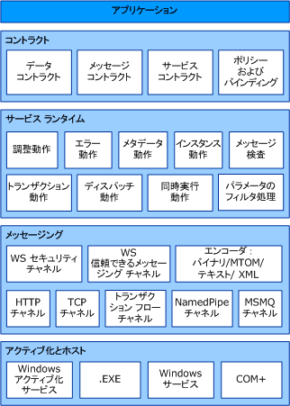

# Windows Communication Foundation のアーキテクチャ
次の図は、Windows Communication Foundation (WCF) アーキテクチャの主要なレイヤーを示しています。  
  
## WCF アーキテクチャ  
   
  
### コントラクトと記述  
 コントラクトは、メッセージ システムのさまざまな側面を定義します。 データ コントラクトには、サービスが作成または処理できるすべてのメッセージを構成するすべてのパラメーターが記述されます。 メッセージ パラメーターは、XML を理解できるすべてのシステムがドキュメントを処理できるように XML スキーマ定義言語 (XSD) ドキュメントによって定義されます。 メッセージ コントラクトは、SOAP プロトコルを使用する特定のメッセージ部分を定義し、相互運用性機能によって正確さが要求される場合に、よりきめ細かな制御を許可します。 サービス コントラクトは、サービスの実際のメソッド署名を指定し、サポートされているプログラミング言語のいずれか (Visual Basic や Visual C# など) で記述されたインターフェイスとして配布されます。  
  
 ポリシーとバインディングは、サービスとの通信に必要な条件を規定します。  たとえば、バインディングでは、使用するトランスポート (HTTP や TCP など) とエンコーディングを少なくとも指定する必要があります。 ポリシーには、セキュリティ要件、およびサービスと通信するために満たす必要があるその他の条件が含まれます。  
  
### サービス ランタイム  
 サービス ランタイム レイヤーには、サービスの実際の操作の実行中にのみ発生する動作 (つまり、サービスのランタイム動作) が含まれます。 調整コントロールでは、処理されるメッセージの数を制御します。サービスの需要が事前設定した上限に達した場合は、この数を変更できます。 エラー動作では、サービスで内部エラーが発生した場合の処理方法 (たとえば、クライアントに伝達される情報を制御するなど) を指定します  (情報の量が多すぎると、悪意のあるユーザーに攻撃のきっかけを与える可能性があります)。メタデータの動作では、メタデータを外部に公開するかどうか、およびその方法を制御します。 インスタンスの動作では、サービスのインスタンスをいくつ実行できるかを指定します (たとえば、シングルトンは、1 つのインスタンスですべてのメッセージを処理するように指定します)。 トランザクションの動作では、エラーが発生した場合にトランザクション操作をロールバックできるようにします。 ディスパッチ動作は、WCF インフラストラクチャによって、メッセージを処理する方法のコントロールです。  
  
 拡張機能を使用すると、ランタイム プロセスをカスタマイズできます。 たとえば、メッセージの検査はメッセージの各部分を検査する機能です。また、パラメーターのフィルター処理を使用すると、メッセージ ヘッダーに作用するフィルターに基づいて、事前設定されたアクションを実行できます。  
  
### メッセージング  
 メッセージング レイヤーで構成されます*チャネル*です。 チャネルは、何らかの方法 (たとえば、メッセージを認証するなど) によってメッセージを処理するコンポーネントです。 一連のチャネルとも呼ばれます、*チャネル スタック*です。 チャネルは、メッセージおよびメッセージ ヘッダーに対して作用します。 これは、主にメッセージ本文の内容の処理に関係するサービス ランタイム レイヤーとは異なります。  
  
 チャネルの種類としては、トランスポート チャネルとプロトコル チャネルの 2 つがあります。  
  
 トランスポート チャネルは、ネットワーク (または外部との通信ポイント) からのメッセージの読み取りと書き込みを行います。 一部のトランスポートはエンコーダーを使用して、(XML Infoset として表現される) メッセージを、ネットワークで使用されるバイト ストリーム表現に (またはその逆に) 変換します。 トランスポートの例としては、HTTP、名前付きパイプ、TCP、MSMQ などがあります。 エンコーディングの例としては、XML と最適化されたバイナリがあります。  
  
 プロトコル チャネルは、メッセージ処理プロトコルを実装します。多くの場合、これはメッセージから追加のヘッダーを読み取るまたは書き込むことによって行います。 このようなプロトコルの例としては、WS-Security と WS-Reliability があります。  
  
 メッセージング レイヤーは、データに使用できる形式と交換パターンを示します。 WS-Security は、メッセージ レイヤーでのセキュリティを有効にする WS-Security 仕様の実装です。 WS-ReliableMessaging チャネルは、メッセージ配信の保証を有効にします。 エンコーダーは、メッセージのニーズに合わせて使用できるさまざまなエンコーディングを提供します。 HTTP チャネルは、ハイパーテキスト転送プロトコルをメッセージ配信に使用することを指定します。 同様に、TCP チャネルは TCP プロトコルを指定します。 トランザクション フロー チャネルは、トランザクション メッセージ パターンを制御します。 名前付きパイプ チャネルは、プロセス間通信を有効にします。 MSMQ チャネルは、MSMQ アプリケーションとの相互運用を有効にします。  
  
### ホストとアクティブ化  
 サービスの最終的な形はプログラムです。 他のプログラムと同様、サービスは実行可能ファイルで実行される必要があります。 これと呼ばれますが、*セルフホスト*サービス。  
  
 サービスがすることもできます*ホスト*、または IIS や Windows アクティブ化サービス (WAS) などの外部エージェントによって管理される実行可能ファイルで実行します。 WCF アプリケーション側で実行しているコンピューターに展開されているときに自動的にアクティブ化がでした。 サービスは、実行可能ファイル (.exe ファイル) として手動で実行することもできます。 また、Windows サービスとして自動的に実行することもできます。 COM + コンポーネントは、WCF サービスとしてホストすることもできます。  
  
## 関連項目  
 [Windows Communication Foundation とは](../../../docs/framework/wcf/whats-wcf.md)  
 [Windows Communication Foundation の基本概念](../../../docs/framework/wcf/fundamental-concepts.md)
