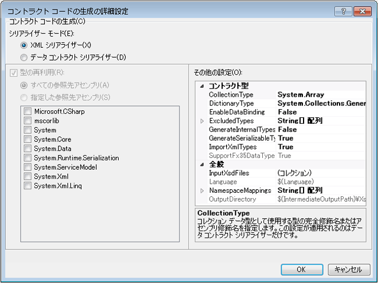

# <a name="contract-first-tool"></a>コントラクト優先ツール
サービス コントラクトは、多くの場合、既存のサービスから作成する必要があります。 [!INCLUDE[net_v45](../../../includes/net-v45-md.md)] では、コントラクト優先ツールを使用して、データ コントラクト クラスを既存のサービスから自動的に作成できます。 コントラクト優先ツールを使用するには、XML スキーマ定義ファイル (XSD) をローカルにダウンロードする必要があります。ツールは、HTTP 経由でリモート データ コントラクトをインポートすることはできません。  
  
 コントラクト優先ツールは、ビルド タスクとして、[!INCLUDE[vs_current_long](../../../includes/vs-current-long-md.md)] に統合されています。 ビルド タスクによって生成されるコード ファイルは、基になるサービス コントラクトの変更をプロジェクトが簡単に取り込むことができるように、プロジェクトがビルドされるたびに作成されます。  
  
 コントラクト優先ツールがインポートできるスキーマ型には、次のようなものがあります。  
  
```xml  
<xsd:complexType>  
<xsd:simpleType>  
```  
  
 単純型は、`Int16` または `String` のようなプリミティブである場合は生成されません。複合型は、`Collection` 型である場合は生成されません。 他の `xsd:complexType` の一部である型も、生成されません。 これらのすべての場合に、型はプロジェクト内の既存の型を参照するようになります。  
  
## <a name="adding-a-data-contract-to-a-project"></a>プロジェクトへのデータ コントラクトの追加  
 コントラクト優先ツールを使用する前に、サービス コントラクト (XSD) をプロジェクトに追加する必要があります。 この概要説明では、コントラクト優先機能を示すために、次のコントラクトを使用します。 このサービス定義は、Bing の検索 API で使用されているサービス コントラクトのごく一部です。  
  
```xml  
<?xml version="1.0" encoding="utf-8"?>  
<xs:schema id="ServiceSchema"  
    targetNamespace="http://tempuri.org/ServiceSchema.xsd"  
    elementFormDefault="qualified"  
    xmlns="http://tempuri.org/ServiceSchema.xsd"  
    xmlns:mstns="http://tempuri.org/ServiceSchema.xsd"  
    xmlns:xs="http://www.w3.org/2001/XMLSchema"  
>  
  <xs:complexType name="SearchRequest">  
    <xs:sequence>  
      <xs:element minOccurs="0" maxOccurs="1" name="Version" type="xs:string" default="2.2" />  
      <xs:element minOccurs="0" maxOccurs="1" name="Market" type="xs:string" />  
      <xs:element minOccurs="0" maxOccurs="1" name="UILanguage" type="xs:string" />  
      <xs:element minOccurs="1" maxOccurs="1" name="Query" type="xs:string" />  
      <xs:element minOccurs="1" maxOccurs="1" name="AppId" type="xs:string" />  
      <xs:element minOccurs="0" maxOccurs="1" name="Latitude" type="xs:double" />  
      <xs:element minOccurs="0" maxOccurs="1" name="Longitude" type="xs:double" />  
      <xs:element minOccurs="0" maxOccurs="1" name="Radius" type="xs:double" />  
    </xs:sequence>  
  </xs:complexType>  
  <xs:simpleType name="WebSearchOption">  
    <xs:restriction base="xs:string">  
      <xs:enumeration value="DisableHostCollapsing" />  
      <xs:enumeration value="DisableQueryAlterations" />  
    </xs:restriction>  
  </xs:simpleType>  
</xs:schema>  
```  
  
 上記のサービス コントラクトをプロジェクトに追加するには、プロジェクトを右クリックして**新規追加しています.**. [テンプレート] ダイアログ ボックスの [WCF] ペインで [スキーマ定義] を選択し、新しいファイルの名前を SampleContract.xsd にします。 上のコードをコピーし、新しいファイルのコード ビューに貼り付けます。  
  
## <a name="configuring-contract-first-options"></a>コントラクト優先のオプションの構成  
 プロパティのメニューでコントラクト優先のオプションを構成することができます、[!INCLUDE[indigo2](../../../includes/indigo2-md.md)]プロジェクト。 コントラクト優先の開発を有効にするを選択して、**型定義言語として有効にする XSD**プロジェクトのプロパティ ウィンドウの [WCF] ページでチェック ボックスをオンします。  
  
   
  
 高度なプロパティを構成するには、[詳細設定] をクリックします。  
  
   
  
 次の詳細設定は、コントラクトからコードを生成するために構成できます。 設定は、プロジェクト内のすべてのファイルに対してのみ構成できます。現時点では、ファイルごとの構成はできません。  
  
-   **シリアライザー モード**: この設定は、サービス コントラクト ファイルを読み取るために使用がどのシリアライザーを決定します。 ときに**XML シリアライザー**が選択されている、**コレクション型**と**再利用の型**オプションが無効になります。 これらのオプションにのみ適用、**データ コントラクト シリアライザー**です。  
  
-   **型を再利用**: この設定を指定するライブラリは型の再利用するためです。 この設定は、場合にのみ適用されます。**シリアライザー モード**に設定されている**データ コントラクト シリアライザー**です。  
  
-   **コレクション型**: この設定は、コレクション データ型に使用する完全修飾またはアセンブリ修飾型を指定します。 この設定は、場合にのみ適用されます。**シリアライザー モード**に設定されている**データ コントラクト シリアライザー**です。  
  
-   **ディクショナリ型**: この設定は、ディクショナリ データ型に使用する完全修飾またはアセンブリ修飾型を指定します。  
  
-   **EnableDataBinding**: この設定では、実装するかどうかを指定します、<xref:System.ComponentModel.INotifyPropertyChanged>データ バインディングを実装するすべてのデータ型のインターフェイスです。  
  
-   **[Excludedtypes]**: この設定は、参照されたアセンブリから除外する完全修飾またはアセンブリ修飾型のリストを指定します。 この設定は、場合にのみ適用されます。**シリアライザー モード**に設定されている**データ コントラクト シリアライザー**です。  
  
-   **[Generateinternaltypes]**: この設定では、内部としてマークされているクラスを生成するかどうかを指定します。 この設定は、場合にのみ適用されます。**シリアライザー モード**に設定されている**データ コントラクト シリアライザー**です。  
  
-   **[Generateserializabletypes]**: この設定を持つクラスを生成するかどうかを指定します、<xref:System.SerializableAttribute>属性。 この設定は、場合にのみ適用されます。**シリアライザー モード**に設定されている**データ コントラクト シリアライザー**です。  
  
-   **ImportXMLTypes**: この設定を適用するデータ コントラクト シリアライザーを構成するかどうかを指定します、<xref:System.SerializableAttribute>属性のないクラスに、<xref:System.Runtime.Serialization.DataContractAttribute>属性。  この設定は、場合にのみ適用されます。**シリアライザー モード**に設定されている**データ コントラクト シリアライザー**です。  
  
-   **[Supportfx35typeddatasets]**: この設定では、.Net 用に作成されたデータ セットの型指定された追加の機能を提供するかどうかを指定します Framework 3.5。 ときに**シリアライザー モード**に設定されている**XML シリアライザー**、<xref:System.Data.Design.TypedDataSetSchemaImporterExtensionFx35>拡張機能は、この値が True に設定されている場合、XML スキーマ インポーターに追加されます。 ときに**シリアライザー モード**に設定されている**データ コントラクト シリアライザー**、種類<xref:System.DateTimeOffset>この値は False に設定する場合に、参照から除外するように、<xref:System.DateTimeOffset>は常に生成古いバージョンのフレームワークです。  
  
-   **[Inputxsdfiles]**: この設定は、入力ファイルの一覧を指定します。 各ファイルは、有効な XML スキーマを含んでいる必要があります。  
  
-   **言語**: この設定が生成されるコントラクト コードの言語を指定します。 設定は、<xref:System.CodeDom.Compiler.CodeDomProvider> が認識できるものである必要があります。  
  
-   **[Namespacemappings]**: この設定は、XSD ターゲット名前空間から CLR 名前空間へのマッピングを指定します。 各マッピングは、次の形式を使用する必要があります。  
  
    ```xml  
    "<Schema Namespace>, <CLR Namespace>"  
    ```  
  
     XML シリアライザーは、次の形式の 1 つのマッピングだけを受け取ります。  
  
    ```xml  
    "*, <CLR Namespace>"  
    ```  
  
-   **OutputDirectory**: この設定は、コード ファイルを生成するディレクトリを指定します。  
  
 設定は、プロジェクトのビルド時に、サービス コントラクト ファイルからサービス コントラクト型を生成するために使用されます。  
  
## <a name="using-contract-first-development"></a>コントラクト優先の開発の使用  
 サービス コントラクトをプロジェクトに追加して、ビルド設定を確認するには、キーを押してプロジェクトをビルド後**F6**です。 これで、サービス コントラクトで定義された型が、プロジェクト内で利用できるようになります。  
  
 サービス コントラクトで定義した型を使用するには、現在の名前空間に `ContractTypes` への参照を追加します。  
  
```csharp  
using MyProjectNamespace.ContractTypes;  
```  
  
 これで、サービス コントラクトで定義された型が、以下に示すように、プロジェクト内で解決可能になります。  
  
   
  
 ツールによって生成された型は、GeneratedXSDTypes.cs ファイル内に作成されます。 ファイルが作成、\<プロジェクト ディレクトリ >/obj/\<ビルド構成 >/xsdgeneratedcode/ディレクトリが既定値です。 このトピックの冒頭のサンプル スキーマは、次のように変換されています。  
  
```csharp
//------------------------------------------------------------------------------  
// <auto-generated>  
//     This code was generated by a tool.  
//     Runtime Version:4.0.30319.17330  
//  
//     Changes to this file may cause incorrect behavior and will be lost if  
//     the code is regenerated.  
// </auto-generated>  
//------------------------------------------------------------------------------  
  
namespace TestXSD3.ContractTypes  
{  
    using System.Xml.Serialization;  
  
    /// <remarks/>  
    [System.CodeDom.Compiler.GeneratedCodeAttribute("System.Xml", "4.0.30319.17330")]  
    [System.SerializableAttribute()]  
    [System.Diagnostics.DebuggerStepThroughAttribute()]  
    [System.ComponentModel.DesignerCategoryAttribute("code")]  
    [System.Xml.Serialization.XmlTypeAttribute(Namespace="http://tempuri.org/ServiceSchema.xsd")]  
    [System.Xml.Serialization.XmlRootAttribute(Namespace="http://tempuri.org/ServiceSchema.xsd", IsNullable=true)]  
    public partial class SearchRequest  
    {  
  
        private string versionField;  
  
        private string marketField;  
  
        private string uILanguageField;  
  
        private string queryField;  
  
        private string appIdField;  
  
        private double latitudeField;  
  
        private bool latitudeFieldSpecified;  
  
        private double longitudeField;  
  
        private bool longitudeFieldSpecified;  
  
        private double radiusField;  
  
        private bool radiusFieldSpecified;  
  
        public SearchRequest()  
        {  
            this.versionField = "2.2";  
        }  
  
        /// <remarks/>  
        [System.ComponentModel.DefaultValueAttribute("2.2")]  
        public string Version  
        {  
            get  
            {  
                return this.versionField;  
            }  
            set  
            {  
                this.versionField = value;  
            }  
        }  
  
        /// <remarks/>  
        public string Market  
        {  
            get  
            {  
                return this.marketField;  
            }  
            set  
            {  
                this.marketField = value;  
            }  
        }  
  
        /// <remarks/>  
        public string UILanguage  
        {  
            get  
            {  
                return this.uILanguageField;  
            }  
            set  
            {  
                this.uILanguageField = value;  
            }  
        }  
  
        /// <remarks/>  
        public string Query  
        {  
            get  
            {  
                return this.queryField;  
            }  
            set  
            {  
                this.queryField = value;  
            }  
        }  
  
        /// <remarks/>  
        public string AppId  
        {  
            get  
            {  
                return this.appIdField;  
            }  
            set  
            {  
                this.appIdField = value;  
            }  
        }  
  
        /// <remarks/>  
        public double Latitude  
        {  
            get  
            {  
                return this.latitudeField;  
            }  
            set  
            {  
                this.latitudeField = value;  
            }  
        }  
  
        /// <remarks/>  
        [System.Xml.Serialization.XmlIgnoreAttribute()]  
        public bool LatitudeSpecified  
        {  
            get  
            {  
                return this.latitudeFieldSpecified;  
            }  
            set  
            {  
                this.latitudeFieldSpecified = value;  
            }  
        }  
  
        /// <remarks/>  
        public double Longitude  
        {  
            get  
            {  
                return this.longitudeField;  
            }  
            set  
            {  
                this.longitudeField = value;  
            }  
        }  
  
        /// <remarks/>  
        [System.Xml.Serialization.XmlIgnoreAttribute()]  
        public bool LongitudeSpecified  
        {  
            get  
            {  
                return this.longitudeFieldSpecified;  
            }  
            set  
            {  
                this.longitudeFieldSpecified = value;  
            }  
        }  
  
        /// <remarks/>  
        public double Radius  
        {  
            get  
            {  
                return this.radiusField;  
            }  
            set  
            {  
                this.radiusField = value;  
            }  
        }  
  
        /// <remarks/>  
        [System.Xml.Serialization.XmlIgnoreAttribute()]  
        public bool RadiusSpecified  
        {  
            get  
            {  
                return this.radiusFieldSpecified;  
            }  
            set  
            {  
                this.radiusFieldSpecified = value;  
            }  
        }  
    }  
  
    /// <remarks/>  
    [System.CodeDom.Compiler.GeneratedCodeAttribute("System.Xml", "4.0.30319.17330")]  
    [System.SerializableAttribute()]  
    [System.Xml.Serialization.XmlTypeAttribute(Namespace="http://tempuri.org/ServiceSchema.xsd")]  
    [System.Xml.Serialization.XmlRootAttribute(Namespace="http://tempuri.org/ServiceSchema.xsd", IsNullable=false)]  
    public enum WebSearchOption  
    {  
  
        /// <remarks/>  
        DisableHostCollapsing,  
  
        /// <remarks/>  
        DisableQueryAlterations,  
    }  
}  
```  
  
## <a name="errors-and-warnings"></a>エラーと警告  
 XSD スキーマの解析中に発生したエラーと警告は、ビルドのエラーと警告として表示されます。  
  
## <a name="interface-inheritance"></a>インターフェイスの継承  
 コントラクト優先の開発でインターフェイスの継承を使用することはできません。これは、他の操作におけるインターフェイスの動作と一致しています。 基底インターフェイスを継承するインターフェイスを使用するには、2 つの別個のエンドポイントを使用します。 最初のエンドポイントは継承されるコントラクトを使用し、2 番目のエンドポイントは基底インターフェイスを実装します。
