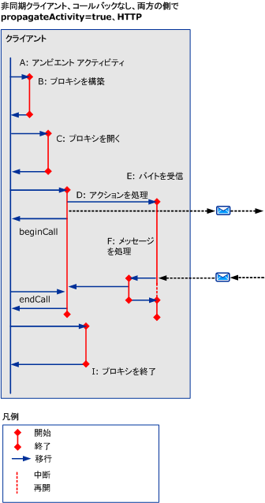
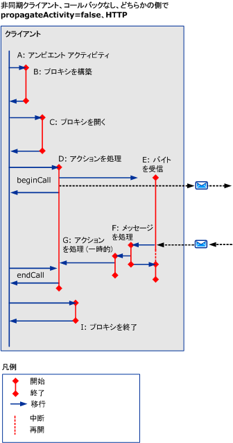
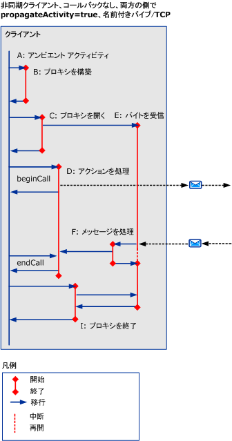
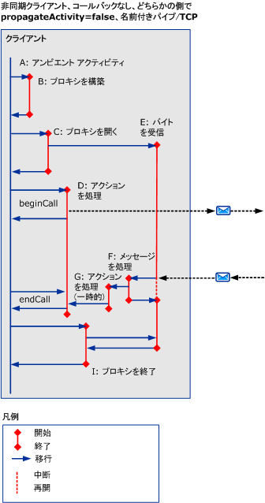
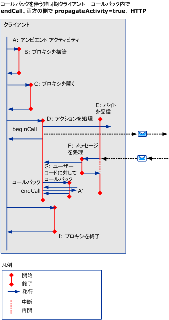
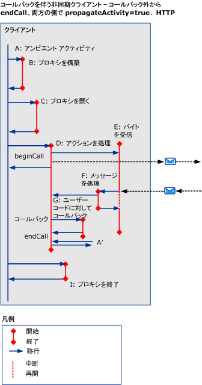
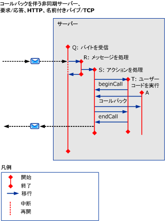

# HTTP、TCP、または名前付きパイプを使用した非同期シナリオ
ここでは、マルチスレッド要求で HTTP、TCP、または名前付きパイプを使用したときの、さまざまな非同期要求/応答シナリオでのアクティビティおよび転送について説明します。  
  
## エラーを伴わない非同期要求/応答  
 ここでは、マルチスレッド クライアントを使用したときの、非同期要求/応答シナリオでのアクティビティおよび転送について説明します。  
  
 呼び出し元アクティビティは、`beginCall` が返され、`endCall` が返されると終了します。 コールバックが呼び出されたときは、そのコールバックが返されます。  
  
 呼び出されたアクティビティは、`beginCall` が返され、`endCall` が返されると終了します。または、そのアクティビティからコールバックが呼び出された場合は、コールバックが返されると終了します。  
  
### コールバックを伴わない非同期クライアント  
  
#### HTTP を使用して、両方の側で伝達が有効になっている場合  
   
  
 図 1 です。 非同期クライアント、コールバックなし、 `propagateActivity` = `true`両方の側では、HTTP で  
  
 場合`propagateActivity` = `true`ProcessMessage がどの ProcessAction アクティビティに転送することを示します。  
  
 HTTP ベースのシナリオでは、最初に送信するメッセージで "バイトを受信" が呼び出され、要求の有効期間だけ存在します。  
  
#### HTTP を使用して、両方の側で伝達が無効になっている場合  
 場合`propagateActivity` = `false`いずれかの側は示しません ProcessAction アクティビティに転送します。 したがって、新しい ID を使用して、新しい一時的な "アクションを処理" アクティビティが呼び出されます。 非同期応答と ServiceModel コード内の要求が一致する場合は、アクティビティ ID をローカル コンテキストから取得できます。 その ID を使用して、実際の "アクションを処理" アクティビティに転送できます。  
  
   
  
 図 2 になります。 非同期クライアント、コールバックなし、 `propagateActivity` = `false`右辺でも左辺でも、HTTP  
  
 HTTP ベースのシナリオでは、最初に送信するメッセージで "バイトを受信" が呼び出され、要求の有効期間だけ存在します。  
  
 Process Action アクティビティが、非同期クライアントで作成されたときに`propagateActivity` = `false`呼び出し元または呼び出し先、および応答メッセージに Action ヘッダーが含まれていない場合。  
  
#### TCP または名前付きパイプを使用して、両方の側で伝達が有効になっている場合  
   
  
 図 3. 非同期クライアント、コールバックなし、 `propagateActivity` = `true`両側で名前付きパイプ/TCP  
  
 名前付きパイプまたは TCP ベースのシナリオでは、クライアントが開かれるときに "バイトを受信" が呼び出され、接続の有効期間だけ存在します。  
  
 場合 1 を図のような`propagateActivity` = `true`ProcessMessage がどの ProcessAction アクティビティに転送することを示します。  
  
#### TCP または名前付きパイプを使用して、両方の側で伝達が無効になっている場合  
 名前付きパイプまたは TCP ベースのシナリオでは、クライアントが開かれるときに "バイトを受信" が呼び出され、接続の有効期間だけ存在します。  
  
 、、図 2 のような場合は`propagateActivity` = `false`いずれかの側では、は示しません ProcessAction アクティビティに転送します。 したがって、新しい ID を使用して、新しい一時的な "アクションを処理" アクティビティが呼び出されます。 非同期応答と ServiceModel コード内の要求が一致する場合は、アクティビティ ID をローカル コンテキストから取得できます。 その ID を使用して、実際の "アクションを処理" アクティビティに転送できます。  
  
   
  
 図 4 です。 非同期クライアント、コールバックなし、 `propagateActivity` = `false`右辺でも左辺でも、名前付きパイプ/TCP  
  
### コールバックを伴う非同期クライアント  
 このシナリオでは、コールバックと `endCall` に対するアクティビティ G と A’、およびその転送 (送受信) が追加されています。  
  
 このセクションでは HTTP を使用するをのみを示します`propragateActivity` =`true`です。 ただし、それ以外の場合にも適用の他のアクティビティおよび転送 (つまり、 `propagateActivity` = `false`、TCP または名前付きパイプを使用)。  
  
 クライアントがユーザー コードを呼び出して結果の準備が完了したことを通知すると、コールバックは新しいアクティビティ (G) を作成します。 ユーザー コードは、次に、コールバック内 (図 5 を参照) またはコールバック外 (図 6 を参照) で `endCall` を呼び出します。 どのユーザーの利用状況が不明なため`endCall`が呼び出されているから、このアクティビティは、ラベルの付いた`A’`です。 A’ と A が同じである場合もありますし、異なる場合もあります。  
  
   
  
 図 5 です。 非同期クライアント、コールバックあり、コールバック内での `endCall`  
  
   
  
 図 6。 非同期クライアント、コールバックあり、コールバック外での `endCall`  
  
### コールバックを伴う非同期サーバー  
   
  
 図 7 です。 非同期サーバー、コールバックあり  
  
 チャネル スタックは、"メッセージを受信" でクライアントをコールバックします。この処理のトレースは、"要求を処理" アクティビティ自体で出力されます。  
  
## エラーを伴う非同期要求/応答  
 エラー メッセージは、`endCall` 中に受信されます。 この点を除き、アクティビティおよび転送は前のシナリオと同様です。  
  
## エラーを伴う/伴わない非同期一方向要求/応答  
 クライアントに返される応答やエラーはありません。
