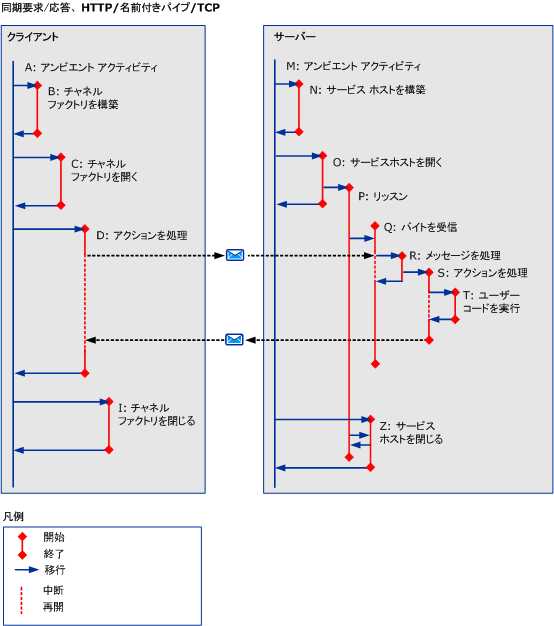

# HTTP、TCP、または名前付きパイプを使用した同期シナリオ
ここでは、シングル スレッド クライアントで HTTP、TCP、または名前付きパイプを使用したときの、さまざまな同期要求/応答シナリオでのアクティビティと転送について説明します。 参照してください[HTTP、TCP、または名前付きパイプを使用して非同期シナリオ](../../../../../docs/framework/wcf/diagnostics/tracing/asynchronous-scenarios-using-http-tcp-or-named-pipe.md)マルチ スレッドの要求についての詳細。  
  
## エラーを伴わない同期要求/応答  
 ここでは、シングル スレッド クライアントを使用したときの、有効な同期要求/応答シナリオでのアクティビティおよび転送について説明します。  
  
### クライアント  
  
#### サービス エンドポイントとの通信の確立  
 クライアントを構築して開きます。 各手順は、アンビエント アクティビティ (A) が、「クライアントの構築」(B) と「クライアントを開く」アクティビティ (C) にそれぞれ転送されます。 転送されるアクティビティごとに、転送が返されるまで (つまり、ServiceModel コードが実行されるまで) アンビエント アクティビティは中断されます。  
  
#### サービス エンドポイントへの要求  
 アンビエント アクティビティは、(D) アクションを「処理」アクティビティに転送されます。 このアクティビティでは、要求メッセージが送信され、応答メッセージが受信されます。 このアクティビティは、ユーザー コードに制御が戻ると終了します。 これは同期要求であるため、制御が戻るまでアンビエント アクティビティは中断されます。  
  
#### サービス エンドポイントとの通信の終了  
 クライアントの "閉じる" アクティビティ (I) が、アンビエント アクティビティから作成されます。 これは、"新規" や "開く" と同じです。  
  
### サーバー  
  
#### サービス ホストの設定  
 ServiceHost の "新規" アクティビティ (N) および "開く" アクティビティ (O) は、アンビエント アクティビティ (M) から作成されます。  
  
 リスナー アクティビティ (P) は、各リスナーの ServiceHost を開くと作成されます。 リスナー アクティビティは、待機してデータを受信および処理します。  
  
#### ネットワーク上のデータの受信  
 ネットワーク上でデータが到着すると、受信したデータを処理するには、(Q) を既に存在しない場合、「バイトを受信」アクティビティが作成されます。 このアクティビティは、接続またはキュー内の複数のメッセージに再使用できます。  
  
 SOAP アクション メッセージを作成するための十分なデータがある場合、"バイトを受信" アクティビティは "メッセージを処理" アクティビティ (R) を起動します。  
  
 アクティビティ R では、メッセージ ヘッダーが処理され、アクティビティ ID ヘッダーが確認されます。 このヘッダーが存在する場合、アクティビティ ID は "アクションを処理" アクティビティに設定されます。それ以外の場合は、新しい ID が作成されます。  
  
 呼び出しが処理されると、"アクションを処理" アクティビティ (S) が作成されて転送されます。 このアクティビティは、受信メッセージに関連するすべての処理 ("ユーザー コードを実行" (T) と "応答メッセージを送信" (該当する場合) を含む) が完了すると終了します。  
  
#### サービス ホストの終了  
 ServiceHost の "閉じる" アクティビティ (Z) は、アンビエント アクティビティから作成されます。  
  
   
  
 \<A: name >、`A`はアクティビティとテーブル 3 に、前の説明を表すショートカット シンボルです。 `Name` は、アクティビティの短縮名です。  
  
 場合`propagateActivity` = `true`、プロセス アクション、クライアントとサービスの両方で同じアクティビティ ID を持ちます  
  
## エラーを伴う同期要求/応答  
 前述のシナリオとの違いは、応答メッセージとして SOAP エラー メッセージが返されることだけです。 場合`propagateActivity` = `true`、要求メッセージのアクティビティ ID が SOAP エラー メッセージに追加します。  
  
## エラーを伴わない同期一方向  
 最初のシナリオとの違いは、メッセージがサーバーに返されないことだけです。 HTTP ベースのプロトコルの場合は、ステータス (有効またはエラー) がクライアントに返されます。 これは、HTTP が WCF プロトコル スタックの一部である要求-応答セマンティクスで唯一のプロトコルであるためです。 TCP 処理は、WCF の非表示であるために、クライアントに受信確認は送信されません。  
  
## エラーを伴う同期一方向  
 メッセージの処理中 (Q 以降) にエラーが発生しても、クライアントには通知が返されません。 これは、「エラーを伴わない同期一方向要求/応答」のシナリオと同じです。 エラー メッセージを受信する必要がある場合は、一方向のシナリオを使用しないでください。  
  
## 二重  
 上述のシナリオとの違いは、クライアントがサービスとして動作することです。この場合、非同期のシナリオと同様、クライアントは "バイトを受信" アクティビティと "メッセージを処理" アクティビティを作成します。
