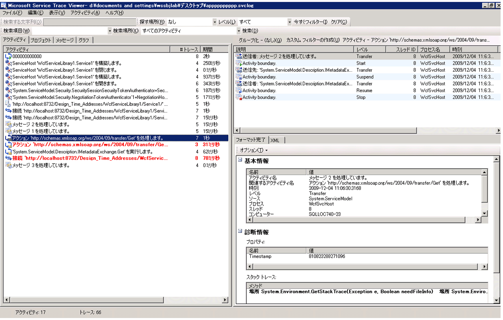
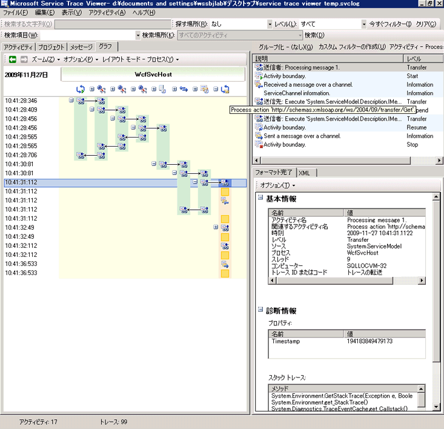
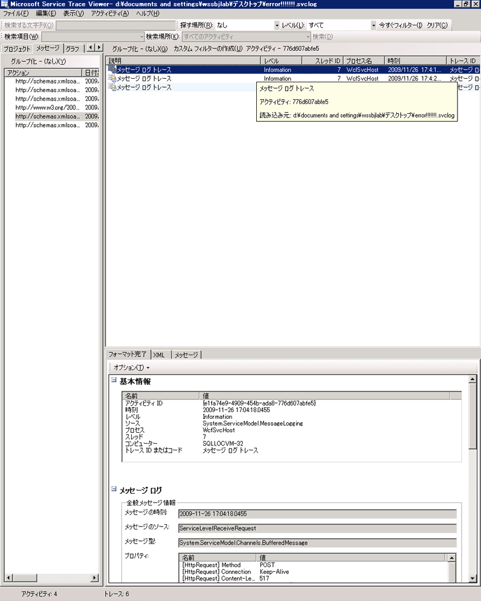
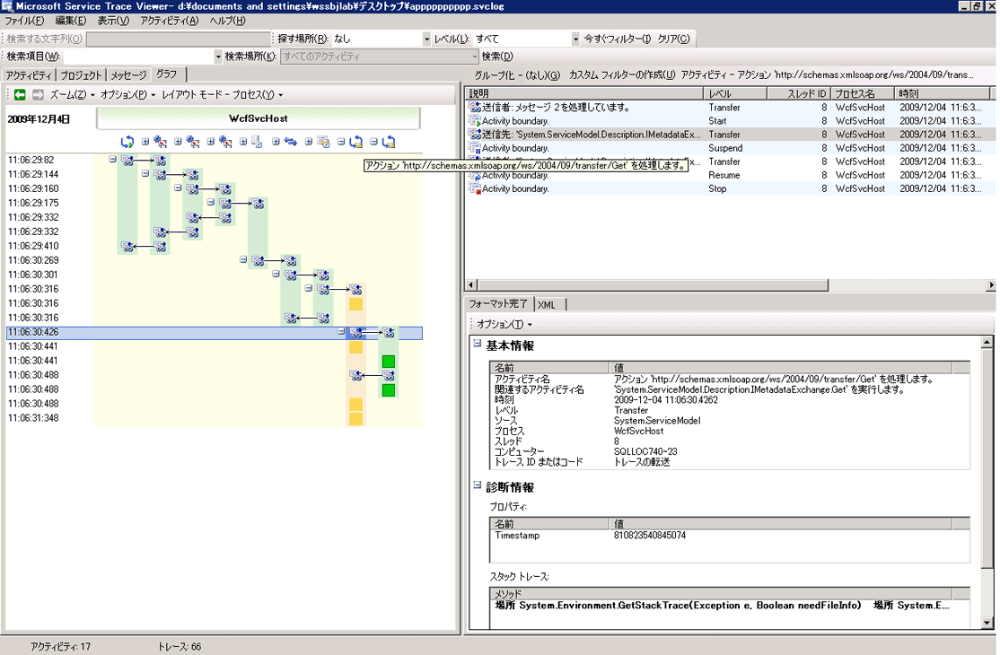
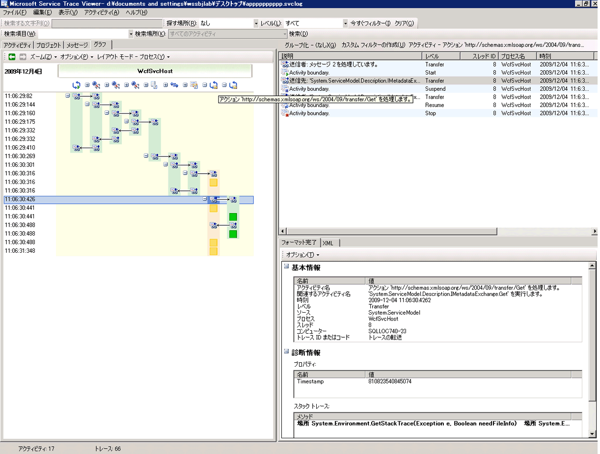
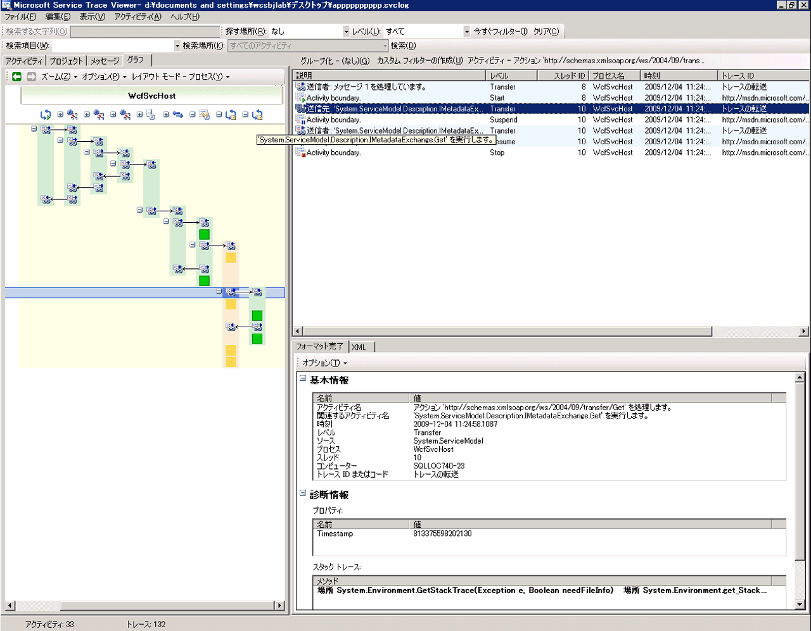
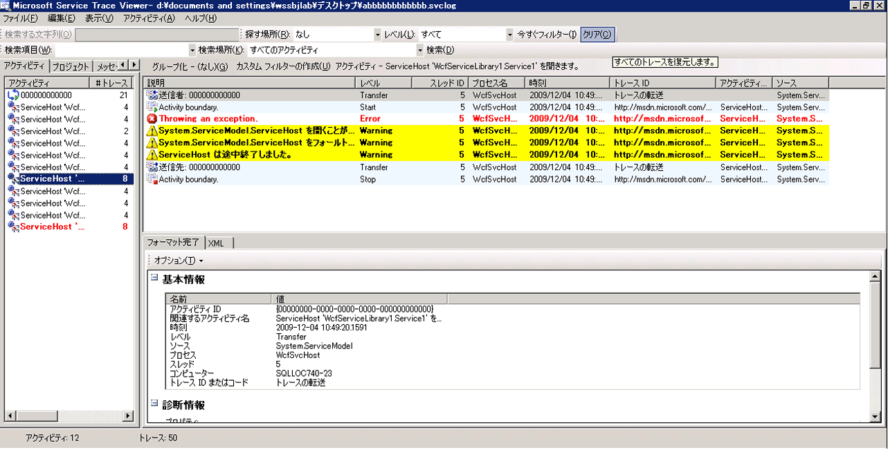
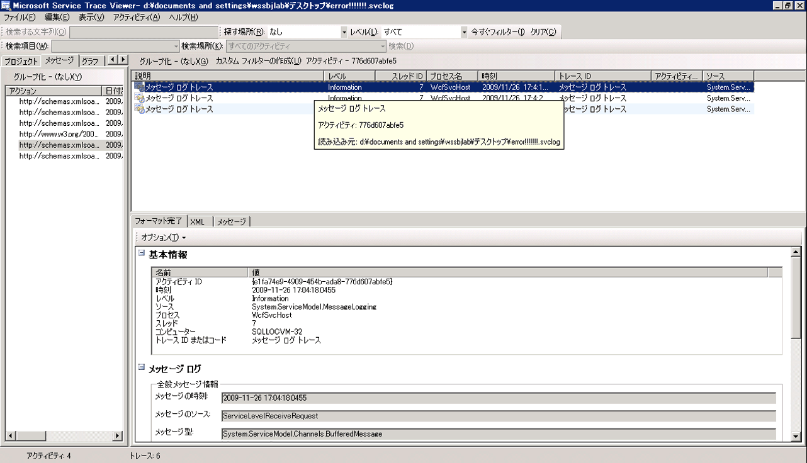

# <a name="using-service-trace-viewer-for-viewing-correlated-traces-and-troubleshooting"></a>サービス トレース ビューアーを使用した相関トレースの表示とトラブルシューティング
ここでは、トレース データの形式、表示方法、およびサービス トレース ビューアーを使用したアプリケーションのトラブルシューティングの方法について説明します。  
  
## <a name="using-the-service-trace-viewer-tool"></a>サービス トレース ビューアー ツールの使用  
 Windows Communication Foundation (WCF) サービス トレース ビューアー ツールを使用して、エラーの根本原因を検索する WCF リスナーによって生成された診断トレースを関連付けることができます。 このツールでは、簡単に表示、グループ、および診断、修復して WCF サービスの問題を確認できるように、トレースをフィルター処理する方法を使用します。 詳細については、このツールを使用して、次を参照してください。[サービス トレース ビューアー ツール (SvcTraceViewer.exe)](../../../../../docs/framework/wcf/service-trace-viewer-tool-svctraceviewer-exe.md)です。  
  
 このトピックを実行して生成されたトレースのスクリーン ショットが含まれています、[トレースとメッセージ ログ](../../../../../docs/framework/wcf/samples/tracing-and-message-logging.md)を使用して表示するときに、サンプリング、[サービス トレース ビューアー ツール (SvcTraceViewer.exe)](../../../../../docs/framework/wcf/service-trace-viewer-tool-svctraceviewer-exe.md)です。 ここでは、トレースの内容、アクティビティ、およびアクティビティの相関関係を理解する方法と、トラブルシューティングを行うときに多数のトレースを分析する方法について説明します。  
  
## <a name="viewing-trace-content"></a>トレースの内容の表示  
 トレース イベントには、次のような最も重要な情報が含まれています。  
  
-   設定時のアクティビティ名。  
  
-   出力時間。  
  
-   トレース レベル。  
  
-   トレース ソース名。  
  
-   プロセス名。  
  
-   スレッド ID。  
  
-   トレースに関連する詳細情報を取得することができます、Microsoft のドキュメントの送信先を指す URL は、一意のトレース識別子です。  
  
 これらのすべてでわかるように、右上のパネルや、サービス トレース ビューアーで、**基本的な情報**トレースを選択するときに右下のパネルの書式付き ビューのセクションです。  
  
> [!NOTE]
>  クライアントとサービスが同じコンピューター上にある場合、両方のアプリケーションのトレースが存在します。 これは、フィルター処理することを使用して、**プロセス名**列です。  
  
 また、[書式付き] ビューには、トレースの説明と追加詳細情報も表示されます (利用できる場合)。 追加詳細情報には、例外の種類とメッセージ、呼び出しスタック、メッセージ アクション、転送元/転送先フィールド、およびその他の例外情報が含まれる場合があります。  
  
 [XML] ビューには、以下の有用な XML タグが含まれます。  
  
-   \<サブタイプ > (トレース レベル)。  
  
-   \<TimeCreated >。  
  
-   \<ソース > (トレース ソース名)。  
  
-   \<相関関係 > (トレースの出力時に設定活動 id)。  
  
-   \<実行 > (プロセスとスレッド id)。  
  
-   \<コンピューター >。  
  
-   \<ExtendedData > など、\<アクション >、 \<MessageID >、および\<ActivityId > メッセージを送信するときに、メッセージ ヘッダーに設定します。  
  
 "チャネル経由でメッセージを送信しました" トレースを調べると、次のような内容を確認できます。  
  
```xml  
<E2ETraceEvent xmlns="http://schemas.microsoft.com/2004/06/E2ETraceEvent">  
   <System xmlns="http://schemas.microsoft.com/2004/06/windows/eventlog/system">  
      <EventID>262163</EventID>  
      <Type>3</Type>  
      <SubType Name="Information">0</SubType>  
      <Level>8</Level>  
      <TimeCreated SystemTime="2006-08-04T18:45:30.8491051Z" />  
      <Source Name="System.ServiceModel" />  
       <Correlation ActivityID="{27c6331d-8998-43aa-a382-03239013a6bd}"/>  
       <Execution ProcessName="client" ProcessID="1808" ThreadID="1" />  
       <Channel />  
       <Computer>TEST1</Computer>  
   </System>  
   <ApplicationData>  
       <TraceData>  
          <DataItem>  
             <TraceRecord xmlns="http://schemas.microsoft.com/2004/10/E2ETraceEvent/TraceRecord" Severity="Information">  
                 <TraceIdentifier>http://msdn.microsoft.com/library/System.ServiceModel.Channels.MessageSent.aspx</TraceIdentifier>  
                 <Description>Sent a message over a channel.</Description>  
                 <AppDomain>client.exe</AppDomain>  
                 <Source>System.ServiceModel.Channels.ClientFramingDuplexSessionChannel/35191196</Source>  
                <ExtendedData xmlns="http://schemas.microsoft.com/2006/08/ServiceModel/MessageTransmitTraceRecord">  
  
                  <MessageProperties>  
                     <AllowOutputBatching>False</AllowOutputBatching>  
                  </MessageProperties>  
                  <MessageHeaders>  
                     <Action d4p1:mustUnderstand="1" xmlns:d4p1="http://www.w3.org/2003/05/soap-envelope" xmlns="http://www.w3.org/2005/08/addressing">http://Microsoft.ServiceModel.Samples/ICalculator/Multiply</Action>  
                     <MessageID xmlns="http://www.w3.org/2005/08/addressing">urn:uuid:7c6670d8-4c9c-496e-b6a0-2ceb6db35338</MessageID>  
                     <ActivityId CorrelationId="b02e2189-0816-4387-980c-dd8e306440f5" xmlns="http://schemas.microsoft.com/2004/09/ServiceModel/Diagnostics">27c6331d-8998-43aa-a382-03239013a6bd</ActivityId>  
                     <ReplyTo xmlns="http://www.w3.org/2005/08/addressing">  
                        <Address>http://www.w3.org/2005/08/addressing/anonymous</Address>  
                    </ReplyTo>  
                    <To d4p1:mustUnderstand="1" xmlns:d4p1="http://www.w3.org/2003/05/soap-envelope" xmlns="http://www.w3.org/2005/08/addressing">net.tcp://localhost/servicemodelsamples/service</To>  
                  </MessageHeaders>  
                  <RemoteAddress>net.tcp://localhost/servicemodelsamples/service</RemoteAddress>  
                </ExtendedData>  
            </TraceRecord>  
          </DataItem>  
       </TraceData>  
   </ApplicationData>  
</E2ETraceEvent>  
```  
  
## <a name="servicemodel-e2e-tracing"></a>ServiceModel のエンドツーエンドのトレース  
 ときに、`System.ServiceModel`トレース ソースを設定すると、 `switchValue` Off 以外と`ActivityTracing`WCF は、アクティビティおよび転送について WCF 処理を作成します。  
  
 アクティビティとは、その処理単位に関連するすべてのトレースをグループ化する処理の論理単位です。 たとえば、要求ごとに 1 つのアクティビティを定義できます。 転送により、エンドポイント内のアクティビティ間の因果関係が作成されます。 アクティビティ ID を伝達することにより、エンドポイント間でアクティビティを関連付けることができます。 設定してこれ行う`propagateActivity` = `true`の各エンドポイントで構成します。 アクティビティ、転送、および伝達により、エラーの関連付けを行うことができます。 このようにして、エラーの根本原因をよりすばやく見つけることができるようになります。  
  
 クライアントでは、1 つの WCF アクティビティが作成オブジェクト モデルの呼び出し (たとえば、Open ChannelFactory、Add、Divide などおよびなどです。)各操作呼び出しは、「プロセス アクション」アクティビティで処理されます。  
  
 次のスクリーン ショットから抽出、[トレースとメッセージ ログ](../../../../../docs/framework/wcf/samples/tracing-and-message-logging.md)サンプル左側のパネルには、作成時刻順に並べ替えて、クライアントのプロセスで作成されたアクティビティの一覧が表示されます。 以下に、各アクティビティを時系列で示します。  
  
-   チャネル ファクトリ (ClientBase) を作成しました。  
  
-   チャネル ファクトリを開きました。  
  
-   Add アクションを処理しました。  
  
-   セキュリティで保護されたセッションを設定し (これは最初の要求で発生します)、RST、RSTR、SCT (プロセス メッセージ 1、2、3) の 3 つのセキュリティ インフラストラクチャ応答メッセージを処理しました。  
  
-   Subtract、Multiply、および Divide の各要求を処理しました。  
  
-   チャネル ファクトリを閉じ、これにより、セキュリティで保護されたセッションを閉じました。また、セキュリティ メッセージ応答の Cancel を処理しました。  
  
 セキュリティ インフラストラクチャ メッセージがあるのは、wsHttpBinding を使用しているためです。  
  
> [!NOTE]
>  WCF では、説明、別のアクティビティ (プロセス メッセージ) で最初に処理する応答メッセージは転送を介して、要求メッセージが含まれる、対応するプロセス アクション アクティビティに関連付ける前にします。 これは、インフラストラクチャ メッセージと非同期要求に対して行います。非同期要求の場合、インフラストラクチャ メッセージを調べて activityId ヘッダーを確認し、該当の ID を持つ既存の "プロセス アクション" アクティビティを特定してこれに関連付ける必要があるためです。 同期要求の場合は、応答のためにブロックするため、応答を関連付けるプロセス アクションがわかります。  
  
   
作成時刻に従って一覧表示された WCF クライアント アクティビティ (左のパネル)、および入れ子にされたアクティビティとトレース (右上のパネル)  
  
 左のパネルでアクティビティを選択すると、右上のパネルに入れ子にされたアクティビティとトレースが表示されます。 したがって、これは、選択した親アクティビティに基づいて、左側のアクティビティのリストの階層表示を減らしたものです。 選択した "プロセス アクション Add" は最初に作成された要求であるため、このアクティビティには、"セキュリティで保護されたセッションの設定" アクティビティ (転送先と返送元) と、Add アクションの実際の処理のトレースが含まれます。  
  
 左側のパネルでの活動の追加プロセス アクション ダブルクリックすると場合、Add に関連するクライアント WCF アクティビティのグラフィック表示がわかります。 左の最初のアクティビティがルート アクティビティ (0000) であり、既定のアクティビティです。 WCF は、アンビエント アクティビティから転送します。 定義されていない場合、WCF は 0000 から転送します。 ここでは、2 番目のアクティビティである "プロセス アクション Add" が 0 から転送します。 次に、"セキュリティで保護されたセッションの設定" が示されています。  
  
   
WCF クライアント アクティビティのグラフ ビュー: アンビエント アクティビティ (ここでは 0)、プロセス アクション、およびセキュリティで保護されたセッションの設定  
  
 右上のパネルでは、"プロセス アクション Add" アクティビティに関連するすべてのトレースを確認できます。 具体的には、同じアクティビティで、要求メッセージ ("チャネル経由でメッセージを送信しました") を送信し、応答 ("チャネル経由でメッセージを受信しました") を受け取っています。 これを次のグラフに示します。 わかりやすくするために、このグラフでは、"セキュリティで保護されたセッションの設定" アクティビティを折りたたんでいます。  
  
   
"プロセス アクション" アクティビティのトレースのリスト: 同じアクティビティで要求を送信し、応答を受信します。  
  
 ここでは、わかりやすくするため、クライアントのトレースのみを読み込むことがツールに読み込みしてもいる場合に、サービス トレース (受信した要求メッセージと送信される応答メッセージ) が同じアクティビティに表示し、`propagateActivity`に設定された`true.`後ほど図に表示されます。  
  
 サービスで、アクティビティ モデルようにマップする WCF の概念。  
  
1.  ServiceHost を作成して開きます (たとえば、セキュリティの場合、複数のホスト関連アクティビティを作成できます)。  
  
2.  ServiceHost のリスナーごとに "リッスン" アクティビティを作成します (Open ServiceHost との間の転送を使用)。  
  
3.  リスナーは、クライアントが開始した通信要求を検出すると、クライアントから送信されたすべてのバイトが処理される、「バイトを受信」アクティビティに転送します。 このアクティビティでは、クライアントとサーバーの対話中に発生したすべての接続エラーを確認できます。  
  
4.  セットごとに受信されるバイトのメッセージに対応する、処理、「プロセス メッセージ」アクティビティでこれらのバイト WCF メッセージ オブジェクトを作成しました。 このアクティビティでは、不正なエンベロープや誤った形式のメッセージに関連するエラーを確認できます。  
  
5.  メッセージが作成されたら、"プロセス アクション" アクティビティに転送します。 クライアントとサービスの両方で、`propagateActivity` が `true` に設定されている場合、既に説明したように、このアクティビティはクライアントに定義されている ID と同じ ID を持ちます。 このステージから利点を得る直接的な相関関係から、エンドポイント間で要求に関連付けられている、WCF で出力されたすべてのトレースが応答メッセージ処理も含め、その同じアクティビティであるためです。  
  
6.  アウト プロセス操作 で、WCF で出力されるからユーザー コードで出力されるトレースを分離する「ユーザー コードを実行」アクティビティを作成します。 上記の例では、該当する場合に「サービスが Add 応答を送信します」トレースは、クライアントによって伝達されたアクティビティではなく、「ユーザー コードを実行」アクティビティで出力されます。  
  
 次の図では、左の最初のアクティビティがルート アクティビティ (0000) であり、既定のアクティビティです。 次の 3 つのアクティビティは、ServiceHost を開くためのアクティビティです。 5 列目のアクティビティはリスナーです。残りのアクティビティ (6 ～ 8 列目) は、バイト処理からユーザー コードのアクティブ化までの、WCF でのメッセージ処理を示しています。  
  
   
WCF サービス アクティビティのリスト  
  
 次のスクリーンショットは、クライアントとサービスの両方のアクティビティを示しています。プロセス全体にわたり、"プロセス アクション Add" アクティビティはオレンジで強調表示されています。 矢印は、クライアントとサービスによって送受信された要求メッセージと応答メッセージを関連付けています。 このグラフでは、"プロセス アクション" のトレースはプロセス間で分かれていますが、右上のパネルには同じアクティビティの一部として示されています。 このパネルには、送信されたメッセージのクライアント トレースの後に、受信および処理されたメッセージのサービス トレースが表示されています。  
  
   
WCF クライアント アクティビティとサービス アクティビティのグラフ ビュー  
  
 次のエラー シナリオでは、サービスとクライアントのエラー トレースおよび警告トレースが関連付けられます。 サービスのユーザー コードで最初に例外がスローされています ("サービスはユーザー コードでこの要求を処理できません" という例外の警告トレースを含む右端の緑のアクティビティ)。 クライアントに応答が送信されると、警告トレースが再度出力されて、エラー メッセージが表示されます (左のピンクのアクティビティ)。 その後、クライアントは WCF クライアントを閉じます (左下の黄色のアクティビティ)。これにより、サービスへの接続が中止されます。 サービスはエラーをスローします (右側の最も長いピンクのアクティビティ)。  
  
   
サービスとクライアント間のエラーの相関関係  
  
 これらのトレースの生成に使用したサンプルは、wsHttpBinding を使用する一連の同期要求です。 セキュリティを使用しないシナリオ、または非同期要求を使用するシナリオの場合は、このグラフとは違う部分があります。非同期要求の場合、"プロセス アクション" アクティビティは、非同期呼び出しを構成する開始操作と終了操作の間に配置され、コールバック アクティビティへの転送が示されます。 その他のシナリオの詳細については、次を参照してください。[エンド ツー エンドのトレースのシナリオ](../../../../../docs/framework/wcf/diagnostics/tracing/end-to-end-tracing-scenarios.md)です。  
  
## <a name="troubleshooting-using-the-service-trace-viewer"></a>サービス トレース ビューアーを使用したトラブルシューティング  
 サービス トレース ビューアー ツールにトレース ファイルを読み込むと、左のパネルの赤または黄色のアクティビティを選択することによって、アプリケーションの問題の原因を突き止めることができます。 通常、000 アクティビティには、ユーザーにバブリングする未処理の例外が含まれます。  
  
   
赤または黄色のアクティビティを選択して問題の原因を特定します。  
  
 右上のパネルでは、左側で選択したアクティビティのトレースを調べることができます。 このパネルで赤または黄色のトレースを調べ、それらがどのように関連しているかを確認できます。 前のグラフで、同じ "プロセス アクション" アクティビティのクライアントとサービスの警告トレースを確認します。  
  
 これらのトレースからエラーの根本原因がわからない場合は、左のパネルで選択したアクティビティ (ここでは "プロセス アクション") をダブルクリックすることでグラフを利用できます。 関連アクティビティが含まれたグラフが表示されます。 (「+」記号をクリック) して関連アクティビティを展開することができますを赤または黄色、関連アクティビティで最初に出力されたトレースを検索します。 調べる対象の赤または黄色のトレースの直前に発生したアクティビティを展開し、エンドポイント間の関連アクティビティまたはメッセージ フローをたどって問題の根本原因を突き止めます。  
  
   
アクティビティを展開して問題の根本原因を追跡します。  
  
 ServiceModel の `ActivityTracing` が無効になっていても、ServiceModel トレースが有効であれば、0000 アクティビティで出力された ServiceModel のトレースを確認できます。 ただし、この場合、これらのトレースの相関関係を理解するには多くの労力を必要とします。  
  
 メッセージ ログを有効にすると、[メッセージ] タブを使用してエラーの影響を受けるメッセージを確認できます。 赤または黄色のメッセージをダブルクリックすると、関連アクティビティのグラフ ビューを表示できます。 これらのアクティビティは、エラーが発生した要求に最も密接に関連するアクティビティです。  
  
   
トラブルシューティングを開始するには、赤または黄色のメッセージ トレースを選択し、これをダブルクリックして根本原因を追跡します。  
  
## <a name="see-also"></a>関連項目  
 [エンドツーエンドのトレースのシナリオ](../../../../../docs/framework/wcf/diagnostics/tracing/end-to-end-tracing-scenarios.md)  
 [サービス トレース ビューアー ツール (SvcTraceViewer.exe)](../../../../../docs/framework/wcf/service-trace-viewer-tool-svctraceviewer-exe.md)  
 [トレース](../../../../../docs/framework/wcf/diagnostics/tracing/index.md)
