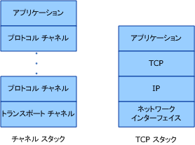
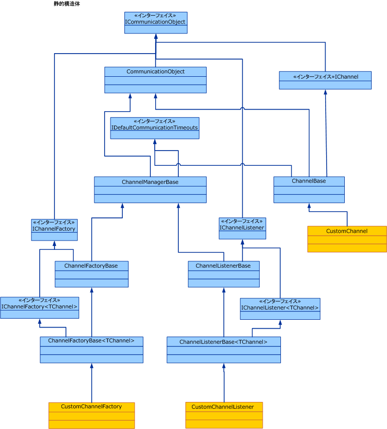

# チャネル モデルの概要Channel Model Overview
[!INCLUDE[indigo1](../../../../includes/indigo1-md.md)] チャネル スタックは、メッセージを処理する 1 つ以上のチャネルから成る階層構造の通信スタックです。The [!INCLUDE[indigo1](../../../../includes/indigo1-md.md)] channel stack is a layered communication stack with one or more channels that process messages. スタックの一番下には、基になるトランスポート (TCP、HTTP、SMTP、およびその他の種類のトランスポート) にチャネル スタックを適応させるためのトランスポート チャネルがあります。At the bottom of the stack is a transport channel that is responsible for adapting the channel stack to the underlying transport (for example, TCP, HTTP, SMTP and other types of transport.). チャネルによって、メッセージを送受信するための低レベルのプログラミング モデルが提供されます。Channels provide a low-level programming model for sending and receiving messages. このプログラミング モデルは、複数のインターフェイスと、[!INCLUDE[indigo2](../../../../includes/indigo2-md.md)] チャネル モデルとして総称されるその他のモデルを利用します。This programming model relies on several interfaces and other types collectively known as the [!INCLUDE[indigo2](../../../../includes/indigo2-md.md)] channel model. このトピックでは、チャネル形状、基本的なチャネル リスナーの構築 (サービス側)、およびチャネル ファクトリ (クライアント側) について説明します。This topic discusses channel shapes, the construction of a basic channel listener (on the service) and channel factory (on the client).  
  
## チャネル スタックChannel Stack  
 [!INCLUDE[indigo2](../../../../includes/indigo2-md.md)] エンドポイントでは、チャネル スタックと呼ばれる通信スタックを使用して通信が行われます。 endpoints communicate with the world using a communication stack called the channel stack. 次の図では、チャネル スタックと、TCP/IP などの他の通信スタックを比較します。The following diagram compares the channel stack with other communication stacks, for example TCP/IP.  
  
   
  
 まず次のような類似点があります。いずれのスタックでも、スタックの各レイヤーにおいて、そのレイヤーより下の部分のアブストラクションと、直上のレイヤーだけに公開されるアブストラクションが提供されます。First, the similarities: In both cases, each layer of the stack provides some abstraction of the world below that layer and exposed that abstraction only to the layer directly above it. 各レイヤーでは、直下のレイヤーのアブストラクションだけが使用されます。Each layer uses the abstraction of only the layer directly below it. また、いずれのスタックでも、2 つのスタックが通信するときは、各レイヤーがもう一方のスタック内の対応するレイヤーと通信します。たとえば、IP レイヤーは IP レイヤーと、TCP レイヤーは TCP レイヤーと通信します。Also in both cases, when two stacks communicate, each layer communicates with the corresponding layer in the other stack, for example, the IP layer communicates with the IP layer and the TCP layer with the TCP layer, and so on.  
  
 次に相違点です。TCP スタックは、物理ネットワークのアブストクラションを提供するように設計されていますが、チャネル スタックは、メッセージの配信方法、すなわちトランスポートのアブストラクションだけでなく、メッセージの内容や通信用のプロトコルなど、トランスポートとそれ以上の機能を含む他の機能のアブストラクションも提供するように設計されています。Now, the differences: While the TCP stack was designed to provide an abstraction of the physical network, the channel stack is designed to provide an abstraction of not only how the message is delivered, that is, the transport, but also other features such as what is in the message or what protocol is used for communication, including the transport but much more than that. たとえば、信頼できるセッションのバインド要素は、チャネル スタックの一部ですが、トランスポートの下位でもトランスポート自体でもありません。For example, reliable session binding element is part of the channel stack but is not below the transport or the transport itself. このアブストラクションは、スタック内の最下位チャネルに、基になるトランスポート プロトコルをチャネル スタック アーキテクチャに適応させるように要求し、スタック内の上位チャネルを利用して、信頼性の保証やセキュリティなどの通信機能を提供することによって、実現されます。This abstraction is achieved by requiring the bottom channel in the stack to adapt the underlying transport protocol to the channel stack architecture and then relying on channels further up in the stack to provide communication features such as reliability guarantees and security.  
  
 メッセージは、通信スタックを通して、<xref:System.ServiceModel.Channels.Message> オブジェクトとして転送されます。Messages flow through the communication stack as <xref:System.ServiceModel.Channels.Message> objects. 上の図に示されているように、最下位チャネルはトランスポート チャネルと呼ばれます。As shown in figure above, the bottom channel is called a transport channel. このチャネルは、他のパーティとメッセージの送受信を行うチャンネルです。It is the channel that is responsible for sending and receiving messages to and from other parties. これには、他のパーティとの通信で使用されるフォーマットへの <xref:System.ServiceModel.Channels.Message> オブジェクトの変換が含まれます。This includes the responsibility of transforming the <xref:System.ServiceModel.Channels.Message> object to and from the format used to communicate with other parties. トランスポート チャネルには、それぞれが信頼できる配信保証などの通信機能を提供する任意の数のプロトコル チャネルを設定することができます。Above the transport channel there can be any number of protocol channels each responsible for providing a communication function such as reliable delivery guarantees. プロトコル チャネルは、<xref:System.ServiceModel.Channels.Message> オブジェクトの形式で転送されるメッセージに対して機能します。Protocol channels operate on messages flowing through them in the form of the <xref:System.ServiceModel.Channels.Message> object. 通常プロトコル チャネルでは、メッセージの変換 (ヘッダーの付加、本文の暗号化など) や独自のプロトコル制御メッセージの送受信 (確認応答の受信など) が行われます。They typically either transform the message, for example, by adding headers or encrypting the body, or send and receive their own protocol control messages, for example, receipt acknowledgments.  
  
## チャネル形状Channel Shapes  
 各チャネルには、チャネル形状インターフェイスまたはチャネル形状と呼ばれる 1 つ以上のインターフェイスが実装されています。Each channel implements one or more interfaces known as channel shape interfaces or channel shapes. このようなチャネル形状によって、チャネルが実装し、チャネルのユーザーが呼び出す送受信や要求、応答などの通信指向のメソッドが提供されます。Those channel shapes provide the communication-oriented methods such as send and receive or request and reply that the channel implements and the user of the channel calls. チャネル形状のベースでは、<xref:System.ServiceModel.Channels.IChannel>インターフェイスを提供するインターフェイスである、 `GetProperty` \<T > メソッドの複数層の機構として、スタック内のチャネルで公開される機能にアクセスするためのものです。At the base of the channel shapes is the <xref:System.ServiceModel.Channels.IChannel> interface, which is an interface that provides a `GetProperty`\<T> method intended as a layered mechanism to access arbitrary features exposed by channels in the stack. <xref:System.ServiceModel.Channels.IChannel> を拡張する 5 つのチャネル形状は、次のとおりです。The five channel shapes that extend <xref:System.ServiceModel.Channels.IChannel> are:  
  
-   <xref:System.ServiceModel.Channels.IInputChannel>  
  
-   <xref:System.ServiceModel.Channels.IOutputChannel>  
  
-   <xref:System.ServiceModel.Channels.IRequestChannel>  
  
-   <xref:System.ServiceModel.Channels.IReplyChannel>  
  
-   <xref:System.ServiceModel.Channels.IDuplexChannel>  
  
 さらに、これらの形状には、それぞれ <xref:System.ServiceModel.Channels.ISessionChannel%601?displayProperty=nameWithType> を拡張してセッションをサポートする同等の形状があります。Further, each of these shapes has an equivalent that extends <xref:System.ServiceModel.Channels.ISessionChannel%601?displayProperty=nameWithType> to support sessions. これらの数値は、次のとおりです。These are:  
  
-   <xref:System.ServiceModel.Channels.IInputSessionChannel>  
  
-   <xref:System.ServiceModel.Channels.IOutputSessionChannel>  
  
-   <xref:System.ServiceModel.Channels.IRequestSessionChannel>  
  
-   <xref:System.ServiceModel.Channels.IReplySessionChannel>  
  
-   <xref:System.ServiceModel.Channels.IDuplexSessionChannel>  
  
 チャネル形状は、既存のトランスポート プロトコルでサポートされている基本的なメッセージ交換パターンにならってパターン化されます。The channel shapes are patterned after some of the fundamental message exchange patterns supported by existing transport protocols. たとえば、一方向メッセージングに対応しています、 <xref:System.ServiceModel.Channels.IInputChannel> / <xref:System.ServiceModel.Channels.IOutputChannel>にペアでは、要求/応答対応<xref:System.ServiceModel.Channels.IRequestChannel> / <xref:System.ServiceModel.Channels.IReplyChannel>ペアと双方向多重通信に対応しています<xref:System.ServiceModel.Channels.IDuplexChannel>。(両方を拡張する<xref:System.ServiceModel.Channels.IInputChannel>と<xref:System.ServiceModel.Channels.IOutputChannel>)。For example, one-way messaging corresponds to an <xref:System.ServiceModel.Channels.IInputChannel>/<xref:System.ServiceModel.Channels.IOutputChannel> pair, request-reply corresponds to <xref:System.ServiceModel.Channels.IRequestChannel>/<xref:System.ServiceModel.Channels.IReplyChannel> pairs and two-way duplex communications corresponds to <xref:System.ServiceModel.Channels.IDuplexChannel> (which extends both <xref:System.ServiceModel.Channels.IInputChannel> and <xref:System.ServiceModel.Channels.IOutputChannel>).  
  
## チャネル スタックを使用したプログラミングProgramming with the Channel Stack  
 通常、チャネル スタックは、バインドによってチャネル スタックが作成されるファクトリ パターンを使用して作成されます。Channel stacks are typically created using a factory pattern where a binding creates the channel stack. 送信側では、バインドを使用して <xref:System.ServiceModel.ChannelFactory> が作成されます。これにより、次々にチャネル スタックが作成され、スタック内の最上位チャネルへの参照が返されます。On the send side, a binding is used to build a <xref:System.ServiceModel.ChannelFactory>, which in turn builds a channel stack and returns a reference to the top channel in the stack. アプリケーションは、このチャネルを使用して、メッセージを送信できます。The application can then use this channel to send messages. 詳細については、次を参照してください。[クライアント チャネル レベルのプログラミング](../../../../docs/framework/wcf/extending/client-channel-level-programming.md)です。For more information, see [Client Channel-Level Programming](../../../../docs/framework/wcf/extending/client-channel-level-programming.md).  
  
 受信側では、バインドを使用して、入力メッセージを待ち受ける <xref:System.ServiceModel.Channels.IChannelListener> が作成されます。On the receive side a binding is used to build a <xref:System.ServiceModel.Channels.IChannelListener>, which listens for incoming messages. <xref:System.ServiceModel.Channels.IChannelListener> では、チャネル スタックを作成し、最上位チャネルへのアプリケーション参照を渡すことによって、待ち受けているアプリケーションにメッセージが提供されます。The <xref:System.ServiceModel.Channels.IChannelListener> provides messages to the listening application by creating channel stacks and handing the application reference to the top channel. アプリケーションは、このチャネルを使用して、入力メッセージを受信します。The application then uses this channel to receive incoming messages. 詳細については、次を参照してください。[サービス チャネル レベルのプログラミング](../../../../docs/framework/wcf/extending/service-channel-level-programming.md)です。For more information, see [Service Channel-Level Programming](../../../../docs/framework/wcf/extending/service-channel-level-programming.md).  
  
## チャネル オブジェクト モデルThe Channel Object Model  
 チャネル オブジェクト モデルは、チャネル、チャネル リスナー、およびチャネル ファクトリの実装に必要なインターフェイスのコア セットです。The channel object model is the core set of interfaces required to implement channels, channel listeners and channel factories. また、カスタム実装を支援するために基本クラスもいくつか提供されます。There are also some base classes provided to assist in custom implementations.  
  
 チャネル リスナーは、受信メッセージを待ち受け、チャネル リスナーによって作成されたチャネル経由で上位レイヤーに受信メッセージを配信します。Channel listeners are responsible for listening for incoming messages, then delivering them to the layer above through channels created by the channel listener.  
  
 チャネル ファクトリは、メッセージの送信用のチャネルを作成し、チャネル ファクトリが閉じられたときに、作成したすべてのチャネルを閉じます。Channel factories are responsible for creating channels that are used for sending messages and for closing all channels they created when the channel factory is closed.  
  
 <xref:System.ServiceModel.ICommunicationObject> は、すべての通信オブジェクトが実装する基本ステート マシンを定義するコア インターフェイスです。<xref:System.ServiceModel.ICommunicationObject> is the core interface that defines the basic state machine that all communication objects implement. <xref:System.ServiceModel.Channels.CommunicationObject> は、このコア インターフェイスの実装を提供し、他のチャネル クラスはインターフェイスを再実装せずに、これを派生させて利用できます。<xref:System.ServiceModel.Channels.CommunicationObject> provides an implementation of this core interface that other channel classes can derive from rather than re-implementing the interface. ただし、これは必須でありません。カスタム チャネルは、<xref:System.ServiceModel.ICommunicationObject> を直接実装できますが、<xref:System.ServiceModel.Channels.CommunicationObject> を継承できません。However, this is not required: a custom channel can implement <xref:System.ServiceModel.ICommunicationObject> directly and not inherit from <xref:System.ServiceModel.Channels.CommunicationObject>. 図 3 のクラスは、いずれもチャネル モデルの一部と見なされません。これらは、チャネルを作成するカスタム チャネル実装側が利用できるヘルパーです。None of the classes in Figure 3 are considered part of the channel model; they are helpers available to custom channel implementers who want to build channels.  
  
   
  
 以下のトピックでは、チャネル オブジェクト モデルと共に、カスタム チャネルの作成に役立つさまざまな開発分野について説明します。The following topics describe the channel object model as well as various development areas that help build custom channels.  
  
|トピックTopic|説明Description|  
|-----------|-----------------|  
|[サービス: チャネル リスナーとチャネルService: Channel Listeners and Channels](../../../../docs/framework/wcf/extending/service-channel-listeners-and-channels.md)|サービス アプリケーションで受信チャネルを待ち受けるチャネル リスナーについて説明します。Describes channel listeners, which listen for incoming channels in a service application.|  
|[クライアント: チャネル ファクトリとチャネルClient: Channel Factories and Channels](../../../../docs/framework/wcf/extending/client-channel-factories-and-channels.md)|サービス アプリケーションに接続するチャネルを作成するチャネル ファクトリについて説明します。Describes channel factories, which create channels to connect to a service application.|  
|[状態変更の理解Understanding State Changes](../../../../docs/framework/wcf/extending/understanding-state-changes.md)|<xref:System.ServiceModel.ICommunicationObject?displayProperty=nameWithType> インターフェイス モデルの状態がチャネルでどのように変化するかについて説明します。Describes how the <xref:System.ServiceModel.ICommunicationObject?displayProperty=nameWithType> interface models state changes in channels.|  
|[メッセージ交換パターンの選択Choosing a Message Exchange Pattern](../../../../docs/framework/wcf/extending/choosing-a-message-exchange-pattern.md)|チャネルがサポートできる 6 つの基本メッセージ交換パターンについて説明します。Describes the six basic message exchange patterns that channels can support.|  
|[例外とエラーの処理Handling Exceptions and Faults](../../../../docs/framework/wcf/extending/handling-exceptions-and-faults.md)|カスタム チャネルでエラーと例外を処理する方法について説明します。Describes how to handle faults and exceptions in custom channels.|  
|[構成とメタデータのサポートConfiguration and Metadata Support](../../../../docs/framework/wcf/extending/configuration-and-metadata-support.md)|アプリケーション モデルからカスタム チャネルを使用できるようにする方法と、バインディングとバインド要素を使用してメタデータをエクスポートおよびインポートする方法について説明します。Describes how to support the use of custom channels from the application model and how to export and import metadata using bindings and binding elements.|
