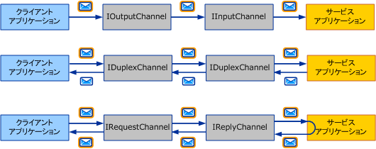
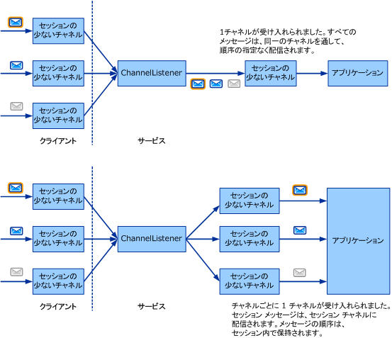

# メッセージ交換パターンの選択
カスタム トランスポートを記述する最初の手順は、これを決定する*メッセージ交換パターン*(Mep) を開発するチャネルに必要なです。 ここでは、使用できるオプションとさまざまな要件について説明します。 これで説明されているチャネル開発タスクの一覧の最初のタスクは、[開発チャネル](../../../../docs/framework/wcf/extending/developing-channels.md)です。  
  
## 6 つのメッセージ交換パターン  
 次の 3 つの MEP から選択できます。  
  
-   データグラム (<xref:System.ServiceModel.Channels.IInputChannel> と <xref:System.ServiceModel.Channels.IOutputChannel>)  
  
     クライアントが使用して、メッセージを送信してデータグラム MEP を使用する場合、*ファイア アンド忘れた*交換します。 このような交換では、配信の成否について帯域外での確認が必要になります。 メッセージが移動中に失われて、サービスに到達しない可能性があります。 クライアントで送信操作が正常に完了したとしても、リモート エンドポイントでメッセージが受信されたとは限りません。 データグラムはメッセージングの基礎となるビルド ブロックであり、その上に信頼できるプロトコルや安全なプロトコルなどの独自のプロトコルを構築できます。 クライアント データグラム チャネルには、<xref:System.ServiceModel.Channels.IOutputChannel> インターフェイスが実装され、サービス データグラム チャネルには <xref:System.ServiceModel.Channels.IInputChannel> インターフェイスが実装されます。  
  
-   要求 - 応答 (<xref:System.ServiceModel.Channels.IRequestChannel> と <xref:System.ServiceModel.Channels.IReplyChannel>)  
  
     この MEP では、メッセージが送信されて、応答が受信されます。 パターンは、要求 - 応答のペアで構成されます。 要求 - 応答呼び出しの例として、リモート プロシージャ コール (RPC) やブラウザー GET 要求などがあります。 このパターンは、半二重とも呼ばれます。 この MEP では、クライアント チャネルには <xref:System.ServiceModel.Channels.IRequestChannel> が実装され、サービス チャネルには <xref:System.ServiceModel.Channels.IReplyChannel> が実装されます。  
  
-   二重 (<xref:System.ServiceModel.Channels.IDuplexChannel>)  
  
     二重 MEP では、クライアントにより任意の数のメッセージを送信して、任意の順序で受信できます。 二重 MEP は、話される語の 1 つずつがメッセージである電話の会話に似ています。 この MEP ではどちらの側も送信および受信できるので、クライアントおよびサービス チャネルによって実装されるインターフェイスは <xref:System.ServiceModel.Channels.IDuplexChannel> になります。  
  
   
3 つの基本的なメッセージ交換パターンです。 上から順に、データグラム、要求 - 応答、二重。  
  
 これらの Mep それぞれをサポートできますも*セッション*です。 セッション (および <xref:System.ServiceModel.Channels.ISessionChannel%601?displayProperty=nameWithType> 型の <xref:System.ServiceModel.Channels.ISession?displayProperty=nameWithType> の実装) は、チャネルで送受信されるすべてのメッセージを相互に関連付けます。 要求 - 応答パターンはスタンドアロンの 2 メッセージ セッションで、要求と応答が相互に関連付けられています。 一方、セッションをサポートする要求 - 応答パターンは、そのチャネルのすべての要求 - 応答ペアが互いに関連付けられることを意味しています。 したがって、次のように合計 6 つの MEP から選択できます。  
  
-   データグラム  
  
-   要求 – 応答  
  
-   二重  
  
-   セッション対応データグラム  
  
-   セッション対応要求 – 応答  
  
-   セッション対応二重  
  
> [!NOTE]
>  UDP トランスポートでは、サポートされている MEP はデータグラムだけです。これは、UDP がファイア アンド フォーゲット (撃ち放し) のプロトコルだからです。  
  
## セッションとセッションの多いチャネル  
 ネットワーク プロトコルには、接続指向プロトコル (TCP など) とコネクションレス プロトコル (UDP など) があります。 WCF では、用語のセッションを使用して、接続に似た論理アブストラクションを意味します。 セッションの多い WCF プロトコルは、接続指向ネットワーク プロトコルに似ており、セッションの少ない WCF プロトコルは、コネクションレス ネットワーク プロトコルに似ています。  
  
 チャネル オブジェクト モデルでは、各論理セッションは、セッションの多いチャネルの 1 つのインスタンスとしてマニフェストされます。 したがって、クライアントによって作成され、サービスで受け入れられるすべての新しいセッションは、それぞれの側のセッションの多い新しいチャネルに対応します。 セッションの少ないチャネルの構造 (上) と、セッションの多いチャネルの構造 (下) を次の図に示します。  
  
   
  
 クライアントがセッションの多い新しいチャネルを作成し、メッセージを送信します。 サービス側では、チャネル リスナーがこのメッセージを受信し、メッセージが新しいセッションに属することを検出します。チャネル リスナーはセッションの多い新しいチャネルを作成し、(チャネル リスナーで AcceptChannel を呼び出しているアプリケーションへの応答として) アプリケーションに渡します。 アプリケーションは、同じセッションの多いチャネルを介して、このメッセージと同じセッションで送信される後続のすべてのメッセージを受信します。  
  
 別のクライアント (または同じクライアント) がセッションの多い新しいチャネルを作成し、メッセージを送信します。 チャネル リスナーは、このメッセージが新しいセッションに属することを検出し、セッションの多い新しいチャネルを作成してプロセスが繰り返されます。  
  
 セッションを使用しない場合、チャネルとセッション間に相関関係はありません。 したがって、チャネル リスナーが作成するチャネルは 1 つしかなく、このチャネルを介して、受信したすべてのメッセージをアプリケーションに配信します。 メッセージの順序を維持するためのセッションが存在しないため、メッセージの順序もありません。 前の図の上部は、セッションの少ないメッセージ交換を示しています。  
  
## セッションの開始と終了  
 セッションの多い新しいチャネルを作成することにより、クライアントでセッションが開始されます。 新しいセッションで送信されたメッセージをサービスが受信すると、サービスでセッションが開始されます。 同様に、セッションの多いチャネルを閉じるか中止すると、セッションが終了します。  
  
 セッションの多い双方向通信パターンで、メッセージの送信と受信の両方に使用する <xref:System.ServiceModel.Channels.IDuplexSessionChannel> はこの例外です。 一方の側がメッセージの送信を停止しても、メッセージの受信は続行する必要がある可能性があります。そのため、<xref:System.ServiceModel.Channels.IDuplexSessionChannel> を使用する場合には、これ以上メッセージを送信しないことを示すために出力セッションを閉じ、メッセージの受信は続行できるように、入力セッションは開いたまましておくことができる機構があります。  
  
 通常、セッションは受信側ではなく送信側で閉じます。 つまり、セッションの多い出力チャネルを閉じることで、セッションを完全に終了できます。 セッションの多い出力チャネルを閉じると、対応するセッションの多い入力チャネルは、<xref:System.ServiceModel.Channels.IInputChannel.Receive%2A?displayProperty=nameWithType> の <xref:System.ServiceModel.Channels.IDuplexSessionChannel> を呼び出しているアプリケーションに対して null を返します。  
  
 ただし、<xref:System.ServiceModel.Channels.IInputChannel.Receive%2A?displayProperty=nameWithType> の <xref:System.ServiceModel.Channels.IDuplexSessionChannel> が null を返して、セッションが既に閉じていることを示していない場合は、セッションの多い入力チャネルを閉じないようにする必要があります。 <xref:System.ServiceModel.Channels.IInputChannel.Receive%2A?displayProperty=nameWithType> の <xref:System.ServiceModel.Channels.IDuplexSessionChannel> が null を返していない場合に、セッションの多い入力チャネルを閉じると、例外がスローされることがあります。これは、チャネルを閉じている間に、予期しないメッセージを受信することがあるためです。 送信側がセッションを終了する前に、受信側でセッションを終了する必要がある場合は、入力チャネルで <xref:System.ServiceModel.ICommunicationObject.Abort%2A> を呼び出します。この呼び出しにより、セッションはその場で終了します。  
  
## セッションの多いチャネルの作成  
 セッションの多いチャネルを作成した場合、セッションを提供するためにチャネルで実行しなければならないことがいくつかあります。 送信側では、チャネルで以下を行う必要があります。  
  
-   新しいチャネルごとに、新しいセッションを作成し、新しいセッション ID (一意の文字列) に関連付けます。 または、スタック内で、作成したチャネルの下にあるセッションの多いチャネルから新しいセッションを取得します。  
  
-   (下のレイヤーからセッションを取得したのではなく) チャネルでセッションを作成した場合は、このチャネルを使用して送信される各メッセージについて、メッセージをセッションに関連付ける必要があります。 プロトコル チャネルの場合、通常は SOAP ヘッダーを追加することによってこの関連付けを行います。 トランスポート チャネルの場合は、新しいトランスポート接続を作成するか、フレーミング プロトコルにセッション情報を追加します。  
  
-   このチャネルを使用して送信される各メッセージについて、前述の配信保証を提供する必要があります。 下のレイヤーのチャネルを使用してセッションを提供している場合、そのチャネルでも配信保証を提供します。 セッションを独自に提供する場合は、これらの保証をプロトコルの一部として実装する必要があります。 通常、両方の側で WCF を想定したプロトコル チャネルを作成する場合、TCP トランスポート チャネルまたは信頼できるメッセージング チャネルが必要となり、セッションを提供するためにこれらのいずれかに依存します。  
  
-   チャネルで <xref:System.ServiceModel.ICommunicationObject.Close%2A?displayProperty=nameWithType> が呼び出されたときに、指定したタイムアウトまたは既定のタイムアウトを使用して、セッションを閉じるために必要な作業を実行します。 これは、下のレイヤーのチャネルで <xref:System.ServiceModel.ICommunicationObject.Close%2A> を呼び出すか (そのチャネルからセッションを取得しただけの場合)、特殊な SOAP メッセージを送信するか、またはトランスポート接続を閉じるだけです。  
  
-   チャネルで <xref:System.ServiceModel.ICommunicationObject.Abort%2A> が呼び出されたときに、I/O を実行せずにセッションをその場で終了します。 これは、何も実行しないことを意味する場合もあれば、ネットワーク接続または他の何らかのリソースの中止を伴う場合もあります。  
  
 受信側では、チャネルで以下を行う必要があります。  
  
-   各受信メッセージについて、チャネル リスナーは、そのメッセージが属しているセッションを検出する必要があります。 メッセージがセッションの最初のメッセージである場合、チャネル リスナーは新しいチャネルを作成し、<xref:System.ServiceModel.Channels.IChannelListener%601.AcceptChannel%2A?displayProperty=nameWithType> の呼び出しからそのチャネルを返す必要があります。 それ以外の場合は、チャネル リスナーはセッションに対応する既存のチャネルを検出し、そのチャネルを介してメッセージを配信する必要があります。  
  
-   独自のチャネルで (必要な配信保証と共に) セッションを提供する場合、受信側はメッセージの順序付けや受信確認の送信など、いくつかのアクションを実行することが必要になる場合があります。  
  
-   チャネルで <xref:System.ServiceModel.ICommunicationObject.Close%2A> が呼び出されたときに、指定したタイムアウトまたは既定のタイムアウトを使用して、セッションを閉じるために必要な作業を実行します。 この作業を実行すると、チャネルがタイムアウトになるのを待機している間にメッセージを受信した場合に、例外が発生することがあります。 これは、メッセージを受信したときに、チャネルが終了状態になっているためです。この場合、例外がスローされることになります。  
  
-   チャネルで <xref:System.ServiceModel.ICommunicationObject.Abort%2A> が呼び出されたときに、I/O を実行せずにセッションをその場で終了します。 このときも、何も実行しないことを意味する場合もあれば、ネットワーク接続または他のリソースの中止を伴う場合もあります。  
  
## 関連項目  
 [チャネル モデルの概要](../../../../docs/framework/wcf/extending/channel-model-overview.md)
