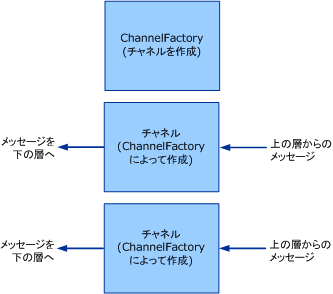

# クライアント : チャネル ファクトリとチャネル
ここでは、チャネル ファクトリとチャネルの作成について説明します。  
  
## チャネル ファクトリとチャネル  
 チャネル ファクトリには、チャネルを作成する役割があります。  チャネル ファクトリによって作成されるチャネルは、メッセージの送信に使用されます。  このチャネルは、上の層からメッセージを取得し、必要な処理を実行し、そのメッセージを下の層に送信する必要があります。  このプロセスを説明する図を次に示します。  
  
   
チャネル ファクトリがチャネルを作成します。  
  
 終了時に、チャネル ファクトリは、作成したチャネルのうちまだ閉じていないチャネルを閉じる必要があります。  チャネル リスナーを閉じたとき、新しいチャネルの受け入れだけが停止され、既存のチャネルは開いたままで、メッセージの受信を続行できるので、ここに示すモデルは非対称です。  
  
 [!INCLUDE[indigo2](../../../../includes/indigo2-md.md)] には、このプロセスに対する基本クラス ヘルパーが用意されています  \(このトピックで説明するチャネル ヘルパー クラスの図については、「[チャネル モデルの概要](../../../../docs/framework/wcf/extending/channel-model-overview.md)」を参照してください\)。  
  
-   <xref:System.ServiceModel.Channels.CommunicationObject> クラスには <xref:System.ServiceModel.ICommunicationObject> が実装され、[チャネルの開発](../../../../docs/framework/wcf/extending/developing-channels.md) の手順 2. で説明されているステート マシンが強制実行されます。  
  
-   ``  <xref:System.ServiceModel.Channels.ChannelManagerBase> クラスには <xref:System.ServiceModel.Channels.CommunicationObject> が実装され、<xref:System.ServiceModel.Channels.ChannelFactoryBase?displayProperty=fullName> と <xref:System.ServiceModel.Channels.ChannelListenerBase?displayProperty=fullName> の統合基本クラスが提供されます。  <xref:System.ServiceModel.Channels.ChannelManagerBase> クラスは、<xref:System.ServiceModel.Channels.IChannel> を実装する基本クラスである <xref:System.ServiceModel.Channels.ChannelBase> との組み合わせによって動作します。  
  
-   ``  <xref:System.ServiceModel.Channels.ChannelFactoryBase> クラスでは、<xref:System.ServiceModel.Channels.ChannelManagerBase> および <xref:System.ServiceModel.Channels.IChannelFactory> が実装され、`CreateChannel` オーバーロードが `OnCreateChannel` 抽象メソッドに統合されます。  
  
-   ``  <xref:System.ServiceModel.Channels.ChannelListenerBase> クラスは、<xref:System.ServiceModel.Channels.IChannelListener> を実装しています。  基本状態管理を行います。  
  
 次の説明は、「[トランスポート: UDP](../../../../docs/framework/wcf/samples/transport-udp.md)」のサンプルに基づいています。  
  
### チャネル ファクトリの作成  
 `UdpChannelFactory` は <xref:System.ServiceModel.Channels.ChannelFactoryBase> から派生します。  サンプルでは、<xref:System.ServiceModel.Channels.ChannelFactoryBase.GetProperty%2A> をオーバーライドして、メッセージ エンコーダーのメッセージ バージョンにアクセスできるようにします。  さらに、<xref:System.ServiceModel.Channels.ChannelFactoryBase.OnClose%2A> をオーバーライドして、ステート マシンの移行時に <xref:System.ServiceModel.Channels.BufferManager> のインスタンスを破棄します。  
  
#### UDP 出力チャネル  
 `UdpOutputChannel` では、<xref:System.ServiceModel.Channels.IOutputChannel> が実装されます。  このコンストラクターは、引数を検証し、渡される <xref:System.ServiceModel.EndpointAddress> に基づいて出力先の <xref:System.Net.EndPoint> オブジェクトを構築します。  
  
 <xref:System.ServiceModel.Channels.CommunicationObject.OnOpen%2A> のオーバーライドによって、この <xref:System.Net.EndPoint> にメッセージを送信するために使用されるソケットが作成されます。  
  
 `this.socket = new Socket(`  
  
 `this.remoteEndPoint.AddressFamily,`  
  
 `SocketType.Dgram,`  
  
 `ProtocolType.Udp`  
  
 `);`  
  
 チャネルが閉じる際には、正常終了することも異常終了することもあります。  チャネルが正常に閉じた場合はソケットも終了し、基本クラスの `OnClose` メソッドが呼び出されます。  このときに例外がスローされると、インフラストラクチャによって `Abort` が呼び出され、チャネルがクリーンアップされます。  
  
```  
this.socket.Close();  
base.OnClose(timeout);  
  
```  
  
 `Send()` と `BeginSend()`\/`EndSend()` を実装します。  この実装は、2 つの主要セクションに分かれます。  最初に、メッセージを次のようにシリアル化してバイト配列で表します。  
  
```  
ArraySegment<byte> messageBuffer = EncodeMessage(message);  
  
```  
  
 次に、結果として生成されたデータを次のようにネットワークに送信します。  
  
```  
this.socket.SendTo(  
  messageBuffer.Array,   
  messageBuffer.Offset,   
  messageBuffer.Count,   
  SocketFlags.None,   
  this.remoteEndPoint  
);  
```  
  
## 参照  
 [チャネルの開発](../../../../docs/framework/wcf/extending/developing-channels.md)