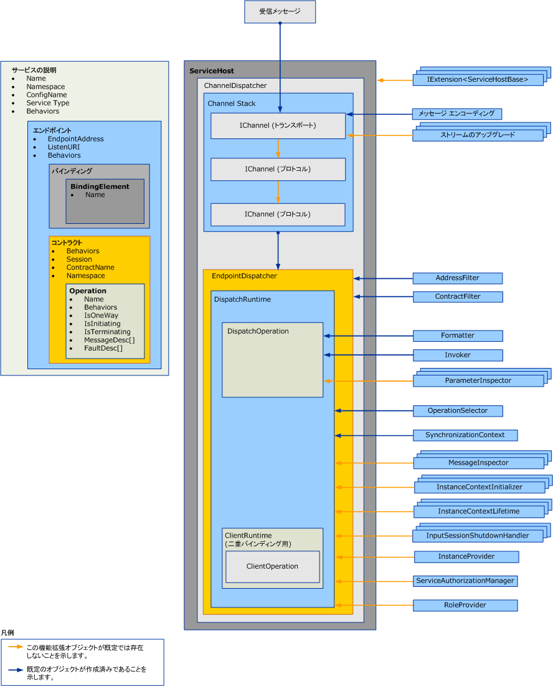

# ディスパッチャーの拡張
ディスパッチャーには、基になるチャネルから受信メッセージをプルし、そのメッセージをアプリケーション コードでのメソッド呼び出しに変換し、結果を呼び出し元に送信する役割があります。 ディスパッチャーの拡張を使用することで、この処理を変更できます。  メッセージやパラメーターの内容を検査または変更するメッセージ インスペクターまたはパラメーター インスペクターを実装できます。  また、メッセージが操作にルーティングされる方法を変更することも、他の機能を提供することもできます。  
  
 このトピックを使用する方法について説明、<xref:System.ServiceModel.Dispatcher.DispatchRuntime>と<xref:System.ServiceModel.Dispatcher.DispatchOperation>クラスでは、Windows Communication Foundation (WCF) サービス、ディスパッチャーの既定の実行動作を変更するかを途中受信、メッセージ、パラメーターを変更またはまたはを返すアプリケーション前後送信またはチャネル レイヤーから取得する値。 相当するクライアント ランタイムのメッセージ処理の詳細については、次を参照してください。[を拡張するクライアント](../../../../docs/framework/wcf/extending/extending-clients.md)です。 役割を理解するを<xref:System.ServiceModel.IExtensibleObject%601>型が実行時のカスタマイズのさまざまなオブジェクト間で共有状態へのアクセスを再生しを参照してください[拡張可能なオブジェクト](../../../../docs/framework/wcf/extending/extensible-objects.md)です。  
  
## ディスパッチャー  
 サービス モデル レイヤーは、開発者のプログラミング モデルと基になるメッセージ交換 (一般的に、チャネル レイヤーと呼ばれます) の間の変換を実行します。 WCF チャネルとエンドポイント ディスパッチャーに (<xref:System.ServiceModel.Dispatcher.ChannelDispatcher>と<xref:System.ServiceModel.Dispatcher.EndpointDispatcher>、それぞれ) は、サービス コンポーネントがメッセージを受信、操作のディスパッチと呼び出し、および応答の処理、新しいチャネルを受け入れるよう担当します。 ディスパッチャー オブジェクトは、受信者のオブジェクトですが、双方向サービスでのコールバック コントラクトの実装も、検査、変更、または拡張のためにディスパッチャー オブジェクトを公開します。  
  
 チャネル ディスパッチャー (およびコンパニオン <xref:System.ServiceModel.Channels.IChannelListener>) は、基になるチャネルからメッセージをプルし、そのメッセージをそれぞれのエンドポイント ディスパッチャーに渡します。 各エンドポイント ディスパッチャーには、メッセージを適切な <xref:System.ServiceModel.Dispatcher.DispatchRuntime> にルーティングする <xref:System.ServiceModel.Dispatcher.DispatchOperation> があります。これには、操作を実装するメソッドを呼び出す役割があります。 さまざまなオプションの拡張クラスおよび必須の拡張クラスが呼び出されます。 ここでは、この要素を組み合わせる方法、基本機能を拡張するためにプロパティを変更し、ユーザーのコードをプラグインする方法について説明します。  
  
 ディスパッチャーのプロパティと変更されたカスタマイズ オブジェクトは、サービス、エンドポイント、コントラクト、または操作の動作オブジェクトを使用して挿入します。 ここでは、動作を使用する方法については説明しません。 ディスパッチャーの変更を挿入するために使用する種類の詳細については、次を参照してください。[を構成すると、ランタイムのビヘイビアーの使用を拡張する](../../../../docs/framework/wcf/extending/configuring-and-extending-the-runtime-with-behaviors.md)です。  
  
 次の図は、サービスを構成する項目の概念図を示しています。  
  
   
  
### チャネル ディスパッチャー  
 特定の URI (リッスン URI と呼ばれます) にある <xref:System.ServiceModel.Dispatcher.ChannelDispatcher> をサービスのインスタンスと関連付けるために、<xref:System.ServiceModel.Channels.IChannelListener> オブジェクトが作成されます。 各 <xref:System.ServiceModel.ServiceHost> オブジェクトには、それぞれ 1 つのリスナーとリッスン URI にのみ関連付けられている <xref:System.ServiceModel.Dispatcher.ChannelDispatcher> オブジェクトを多数格納できます。 メッセージが到着すると、<xref:System.ServiceModel.Dispatcher.ChannelDispatcher> が、関連する各 <xref:System.ServiceModel.Dispatcher.EndpointDispatcher> オブジェクトにエンドポイントがメッセージを受け入れ可能かどうかを問い合わせ、受け入れ可能ならメッセージを渡します。  
  
 <xref:System.ServiceModel.Dispatcher.ChannelDispatcher> オブジェクトに定義されているチャネル セッションの有効期間および動作を制御するすべてのプロパティは、検査および変更可能です。 これには、カスタムのチャネル初期化子、チャネル リスナー、ホスト、関連する <xref:System.ServiceModel.InstanceContext> などがあります。  
  
### エンドポイント ディスパッチャー  
 メッセージの送信先アドレスが <xref:System.ServiceModel.Dispatcher.EndpointDispatcher> プロパティに一致しており、メッセージ アクションが <xref:System.ServiceModel.Dispatcher.ChannelDispatcher> プロパティに一致しているときは、<xref:System.ServiceModel.Dispatcher.EndpointDispatcher.AddressFilter%2A> オブジェクトが <xref:System.ServiceModel.Dispatcher.EndpointDispatcher.ContractFilter%2A> から送信されたメッセージの処理を担当します。 2 つの <xref:System.ServiceModel.Dispatcher.EndpointDispatcher> オブジェクトが 1 つのメッセージを受信する可能性があるときは、<xref:System.ServiceModel.Dispatcher.EndpointDispatcher.FilterPriority%2A> プロパティの値によって、優先度の高いエンドポイントが決まります。  
  
 <xref:System.ServiceModel.Dispatcher.EndpointDispatcher> を使用して、2 つの主要サービス モデル拡張ポイントである <xref:System.ServiceModel.Dispatcher.DispatchRuntime> クラスと <xref:System.ServiceModel.Dispatcher.DispatchOperation> クラスを取得します。このクラスは、ディスパッチャーの処理をカスタマイズするときに使用できます。 <xref:System.ServiceModel.Dispatcher.DispatchRuntime> クラスを使用すると、コントラクトのスコープで (つまり、コントラクトにあるすべてのメッセージに対して) ディスパッチャーを途中受信および拡張できます。 <xref:System.ServiceModel.Dispatcher.DispatchOperation> クラスを使用すると、操作のスコープで (つまり、操作にあるすべてのメッセージに対して) ディスパッチャーを途中受信および拡張できます。  
  
## シナリオ  
 ディスパッチャーを拡張する理由としては、次のようなさまざまなものがあります。  
  
-   カスタム メッセージの検証。 特定のスキーマに対してメッセージが有効になるようにすることができます。 これは、メッセージ インターセプター インターフェイスを実装することで対応できます。 例については、次を参照してください。[メッセージ インスペクタ](../../../../docs/framework/wcf/samples/message-inspectors.md)です。  
  
-   カスタム メッセージのログ記録。 エンドポイントを通過するアプリケーション メッセージの一部を検査して記録することができます。 これはメッセージ インターセプター インターフェイスで実行可能です。  
  
-   カスタム メッセージの変換。 ランタイムのメッセージに特定の変換を適用できます (バージョン管理の場合など)。 これもまた、メッセージ インターセプター インターフェイスで実行可能です。  
  
-   カスタム データ モデル。 ユーザーは、WCF では既定ではサポートされている以外のデータのシリアル化モデルを持つことができます (つまり、 <xref:System.Runtime.Serialization.DataContractSerializer?displayProperty=nameWithType>、 <xref:System.Xml.Serialization.XmlSerializer?displayProperty=nameWithType>、および未加工メッセージ)。 これは、メッセージ フォーマッタ インターフェイスを実装することで対応できます。 例については、次を参照してください。[操作フォーマッタと操作セレクター](../../../../docs/framework/wcf/samples/operation-formatter-and-operation-selector.md)です。  
  
-   カスタム パラメーターの検証。 XML ではなく、型指定されたパラメーターが有効になるようにすることができます。 これは、パラメーター インスペクター インターフェイスを使用して実行できます。  
  
-   カスタム操作ディスパッチ。 アクション以外の場所、たとえば、本文要素やカスタム メッセージ プロパティでディスパッチを実装できます。 これは、<xref:System.ServiceModel.Dispatcher.IDispatchOperationSelector> インターフェイスを使用して実行できます。 例については、次を参照してください。[操作フォーマッタと操作セレクター](../../../../docs/framework/wcf/samples/operation-formatter-and-operation-selector.md)です。  
  
-   オブジェクト プール。 呼び出しごとに新しいインスタンスを割り当てるのではなく、インスタンスをプールできます。 これは、インスタンス プロバイダー インターフェイスを使用して実装できます。 例については、次を参照してください。[プーリング](../../../../docs/framework/wcf/samples/pooling.md)です。  
  
-   インスタンス リース。 インスタンスの有効期間にリース パターンを実装できます。これは、.NET Framework リモートのパターンに似ています。 これは、インスタンス コンテキスト有効期間インターフェイスを使用して実行できます。  
  
-   カスタム エラー処理。 ローカル エラーの処理方法とエラーをクライアントに戻す方法を制御できます。 これは、<xref:System.ServiceModel.Dispatcher.IErrorHandler> インターフェイスを使用して実装できます。  
  
-   カスタム承認動作。 コントラクトまたは操作のランタイム要素を拡張し、メッセージに存在するトークンに基づくセキュリティ チェックを追加することによって、カスタムのアクセス制御を実装できます。 これは、メッセージ インターセプター インターフェイスまたはパラメーター インターセプター インターフェイスを使用して実行できます。 例については、次を参照してください。[セキュリティ拡張](../../../../docs/framework/wcf/samples/security-extensibility.md)です。  
  
    > [!CAUTION]
    >  セキュリティのプロパティを変更すると、WCF アプリケーションのセキュリティを侵害する可能性がある、ためセキュリティ関連の変更を慎重に着手するときし、展開する前に徹底的にテストすることを強くお勧めします。  
  
-   カスタム WCF ランタイム バリデーター。 WCF アプリケーションに対して企業レベルのポリシーを適用するには、サービス、コントラクト、およびバインドを確認するカスタム バリデーターをインストールすることができます。 (たとえばを参照してください[する方法: 企業内のロックのダウン エンドポイント](../../../../docs/framework/wcf/extending/how-to-lock-down-endpoints-in-the-enterprise.md))。  
  
### DispatchRuntime クラスの使用  
 <xref:System.ServiceModel.Dispatcher.DispatchRuntime> クラスを使用して、サービスまたは個別のエンドポイントの既定動作を変更するか、またはカスタム変更を実装したオブジェクトを次のサービス プロセス (または双方向クライアントの場合、クライアント プロセス) の一方または両方に挿入します。  
  
-   受信メッセージをオブジェクトに変換し、メソッド呼び出しとしてサービス オブジェクト上でそれらのオブジェクトを解放します。  
  
-   サービス操作呼び出しに対する応答から受信したオブジェクトを送信メッセージに変換します。  
  
 <xref:System.ServiceModel.Dispatcher.DispatchRuntime> を使用すると、メッセージが認識されない場合でも、特定のコントラクト全体のすべてのメッセージについて、特定のチャネルまたはエンドポイント ディスパッチャーを途中受信および拡張できます。 コントラクト内のどの宣言にも一致しないメッセージが到着した場合、<xref:System.ServiceModel.Dispatcher.DispatchRuntime.UnhandledDispatchOperation%2A> プロパティにより返された操作にディスパッチされます。 特定の操作についてすべてのメッセージを途中受信または拡張する方法については、<xref:System.ServiceModel.Dispatcher.DispatchOperation> クラスを参照してください。  
  
 <xref:System.ServiceModel.Dispatcher.DispatchRuntime> クラスによって公開されているディスパッチャー拡張性は次の 4 つの領域に大別できます。  
  
1.  <xref:System.ServiceModel.Dispatcher.DispatchRuntime> のプロパティおよび <xref:System.ServiceModel.Dispatcher.DispatchRuntime.ChannelDispatcher%2A> によって返される関連チャネル ディスパッチャーのプロパティを使用して、チャネル コンポーネントが、チャネル ディスパッチャーによるチャネルのアクセプトおよびクローズ方法をカスタマイズします。 この分類に属するプロパティとして、<xref:System.ServiceModel.Dispatcher.ChannelDispatcher.ChannelInitializers%2A> プロパティおよび <xref:System.ServiceModel.Dispatcher.DispatchRuntime.InputSessionShutdownHandlers%2A> があります。  
  
2.  メッセージ コンポーネントを、処理されるメッセージごとにカスタマイズします。 この分類に属するプロパティとして、<xref:System.ServiceModel.Dispatcher.DispatchRuntime.MessageInspectors%2A>、<xref:System.ServiceModel.Dispatcher.DispatchRuntime.OperationSelector%2A>、<xref:System.ServiceModel.Dispatcher.DispatchRuntime.Operations%2A>、<xref:System.ServiceModel.Dispatcher.ChannelDispatcher.ErrorHandlers%2A> があります。  
  
3.  インスタンス コンポーネントが、特定のサービス型のインスタンスの作成、有効期間、破棄をカスタマイズします。 サービス オブジェクトの有効期間の詳細については、<xref:System.ServiceModel.ServiceBehaviorAttribute.InstanceContextMode%2A> プロパティを参照してください。 このカテゴリには、<xref:System.ServiceModel.Dispatcher.DispatchRuntime.InstanceContextInitializers%2A> プロパティおよび <xref:System.ServiceModel.Dispatcher.DispatchRuntime.InstanceProvider%2A> プロパティが含まれます。  
  
4.  セキュリティ関連コンポーネントは、次のプロパティを使用できます。  
  
    -   <xref:System.ServiceModel.Dispatcher.DispatchRuntime.SecurityAuditLogLocation%2A> は、監査イベントが出力される場所を示します。  
  
    -   <xref:System.ServiceModel.Dispatcher.DispatchRuntime.ImpersonateCallerForAllOperations%2A> は、サービスが受信メッセージによって提供される資格情報を使用して偽装を試みるかどうかを制御します。  
  
    -   <xref:System.ServiceModel.Dispatcher.DispatchRuntime.MessageAuthenticationAuditLevel%2A> は、<xref:System.ServiceModel.Dispatcher.DispatchRuntime.SecurityAuditLogLocation%2A> によって指定されたイベント ログに、メッセージ認証成功イベントを出力するかどうかを制御します。  
  
    -   <xref:System.ServiceModel.Dispatcher.DispatchRuntime.PrincipalPermissionMode%2A> は、<xref:System.Threading.Thread.CurrentPrincipal%2A> プロパティの設定方法を制御します。  
  
    -   <xref:System.ServiceModel.Dispatcher.DispatchRuntime.ServiceAuthorizationAuditLevel%2A> は、承認イベントの監査の実行方法を指定します。  
  
    -   <xref:System.ServiceModel.Dispatcher.DispatchRuntime.SuppressAuditFailure%2A> は、ログ記録処理中に発生した致命的でない例外を抑制するかどうかを指定します。  
  
 カスタムの拡張オブジェクトは通常、<xref:System.ServiceModel.Dispatcher.DispatchRuntime> プロパティに割り当てるか、サービス動作 (<xref:System.ServiceModel.Description.IServiceBehavior> を実装するオブジェクト)、コントラクト動作 (<xref:System.ServiceModel.Description.IContractBehavior> を実装するオブジェクト)、またはエンドポイント動作 (<xref:System.ServiceModel.Description.IEndpointBehavior> を実装するオブジェクト) によってコレクションに挿入します。 次に、インストール動作オブジェクトを、プログラムで直接、またはカスタムの <xref:System.ServiceModel.Configuration.BehaviorExtensionElement> オブジェクトを実装して適切な動作コレクションに追加し、アプリケーション構成ファイルを使用して動作を挿入できるようにします。  
  
 双方向クライアント (双方向サービスによって指定されたコールバック コントラクトを実装したクライアント) にも、<xref:System.ServiceModel.Dispatcher.DispatchRuntime> プロパティを使用してアクセスできる <xref:System.ServiceModel.Dispatcher.ClientRuntime.CallbackDispatchRuntime%2A> オブジェクトがあります。  
  
### DispatchOperation クラスの使用  
 <xref:System.ServiceModel.Dispatcher.DispatchOperation> クラスは、1 つのサービス操作のスコープ内だけに適用されるカスタムの拡張を実現するために、ランタイムに対して変更または挿入を行う場所です  (コントラクト中のすべてのメッセージに対するサービスのランタイム動作を変更するには、<xref:System.ServiceModel.Dispatcher.DispatchRuntime> クラスを使用します)。  
  
 カスタムのサービス動作オブジェクトを使用して、<xref:System.ServiceModel.Dispatcher.DispatchOperation> の変更をインストールします。  
  
 <xref:System.ServiceModel.Dispatcher.DispatchRuntime.Operations%2A> プロパティを使用して、特定のサービス操作を表す <xref:System.ServiceModel.Dispatcher.DispatchOperation> オブジェクトを検索します。  
  
 次のプロパティは、操作レベルでランタイム実行を制御します。  
  
-   <xref:System.ServiceModel.Dispatcher.DispatchOperation.Action%2A>、<xref:System.ServiceModel.Dispatcher.DispatchOperation.ReplyAction%2A>、<xref:System.ServiceModel.Dispatcher.DispatchOperation.FaultContractInfos%2A>、<xref:System.ServiceModel.Dispatcher.DispatchOperation.IsOneWay%2A>、<xref:System.ServiceModel.Dispatcher.DispatchOperation.IsTerminating%2A>、および <xref:System.ServiceModel.Dispatcher.DispatchOperation.Name%2A> の各プロパティは、操作の値をそれぞれ取得します。  
  
-   <xref:System.ServiceModel.Dispatcher.DispatchOperation.TransactionAutoComplete%2A> と <xref:System.ServiceModel.Dispatcher.DispatchOperation.TransactionRequired%2A> は、トランザクション動作を指定します。  
  
-   <xref:System.ServiceModel.Dispatcher.DispatchOperation.ReleaseInstanceBeforeCall%2A> プロパティと <xref:System.ServiceModel.Dispatcher.DispatchOperation.ReleaseInstanceAfterCall%2A> プロパティは、<xref:System.ServiceModel.InstanceContext> に応じてユーザー定義サービス オブジェクトの有効期間を制御します。  
  
-   <xref:System.ServiceModel.Dispatcher.DispatchOperation.DeserializeRequest%2A>、<xref:System.ServiceModel.Dispatcher.DispatchOperation.SerializeReply%2A>、および <xref:System.ServiceModel.Dispatcher.DispatchOperation.Formatter%2A> の各プロパティでは、メッセージからオブジェクトへの変換およびオブジェクトからメッセージへの変換を明示的に制御できます。  
  
-   <xref:System.ServiceModel.Dispatcher.DispatchOperation.Impersonation%2A> プロパティは、操作の偽装レベルを指定します。  
  
-   <xref:System.ServiceModel.Dispatcher.DispatchOperation.CallContextInitializers%2A> プロパティは、操作のカスタム呼び出しコンテキスト拡張を挿入します。  
  
-   <xref:System.ServiceModel.Dispatcher.DispatchOperation.AutoDisposeParameters%2A> プロパティは、パラメーター オブジェクトが破棄されるタイミングを制御します。  
  
-   <xref:System.ServiceModel.Dispatcher.DispatchOperation.Invoker%2A> プロパティは、カスタムの呼び出しオブジェクトを挿入します。  
  
-   <xref:System.ServiceModel.Dispatcher.DispatchOperation.ParameterInspectors%2A> プロパティでは、パラメーターと戻り値の検査または変更に使用できるカスタム パラメーター インスペクターを挿入できます。  
  
## 関連項目  
 <xref:System.ServiceModel.Dispatcher.DispatchRuntime>  
 <xref:System.ServiceModel.Dispatcher.DispatchOperation>  
 [方法 : サービスのメッセージを検査および変更する](../../../../docs/framework/wcf/extending/how-to-inspect-and-modify-messages-on-the-service.md)  
 [方法 : パラメーターを検査または変更する](../../../../docs/framework/wcf/extending/how-to-inspect-or-modify-parameters.md)  
 [方法 : 企業内のエンドポイントをロックダウンする](../../../../docs/framework/wcf/extending/how-to-lock-down-endpoints-in-the-enterprise.md)
