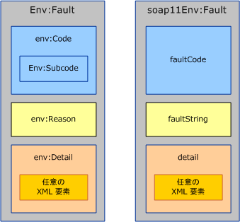
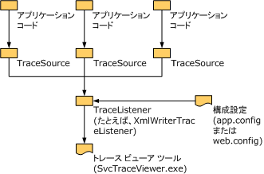

# <a name="handling-exceptions-and-faults"></a><span data-ttu-id="a384e-102">例外とエラーの処理</span><span class="sxs-lookup"><span data-stu-id="a384e-102">Handling Exceptions and Faults</span></span>
<span data-ttu-id="a384e-103">例外は、サービスまたはクライアント実装内でエラーをローカルに伝達するために使用されます。</span><span class="sxs-lookup"><span data-stu-id="a384e-103">Exceptions are used to communicate errors locally within the service or the client implementation.</span></span> <span data-ttu-id="a384e-104">一方、エラーは、サーバーからクライアントまたはクライアントからサーバーのように、サービス境界を越えてエラーを伝達するために使用されます。</span><span class="sxs-lookup"><span data-stu-id="a384e-104">Faults, on the other hand, are used to communicate errors across service boundaries, such as from the server to the client or vice versa.</span></span> <span data-ttu-id="a384e-105">このようなエラーに加え、多くの場合、トランスポート チャネルはトランスポート固有の機構を使用して、トランスポート レベルのエラーを伝達します。</span><span class="sxs-lookup"><span data-stu-id="a384e-105">In addition to faults, transport channels often use transport-specific mechanisms to communicate transport-level errors.</span></span> <span data-ttu-id="a384e-106">たとえば、HTTP トランスポートは、404 などのステータス コードを使用して、存在しないエンドポイントの URL (エラーを返信するエンドポイントが存在しないこと) を伝達します。</span><span class="sxs-lookup"><span data-stu-id="a384e-106">For example, HTTP transport uses status codes such as 404 to communicate a non-existing endpoint URL (there is no endpoint to send back a fault).</span></span> <span data-ttu-id="a384e-107">このドキュメントは、カスタム チャネル作成者にガイダンスを示す 3 つのセクションで構成されています。</span><span class="sxs-lookup"><span data-stu-id="a384e-107">This document consists of three sections that provide guidance to custom channel authors.</span></span> <span data-ttu-id="a384e-108">最初のセクションでは、例外を定義しスローする状況と方法に関するガイダンスを示します。</span><span class="sxs-lookup"><span data-stu-id="a384e-108">The first section provides guidance on when and how to define and throw exceptions.</span></span> <span data-ttu-id="a384e-109">2 番目のセクションでは、エラーの生成と使用に関するガイダンスを示します。</span><span class="sxs-lookup"><span data-stu-id="a384e-109">The second section provides guidance around generating and consuming faults.</span></span> <span data-ttu-id="a384e-110">3 番目のセクションでは、実行中のアプリケーションのトラブルシューティングを行う際に、カスタム チャネルのユーザーにとって役立つトレース情報を提供する方法について説明します。</span><span class="sxs-lookup"><span data-stu-id="a384e-110">The third section explains how to provide trace information to aid the user of your custom channel in troubleshooting running applications.</span></span>  
  
## <a name="exceptions"></a><span data-ttu-id="a384e-111">例外</span><span class="sxs-lookup"><span data-stu-id="a384e-111">Exceptions</span></span>  
 <span data-ttu-id="a384e-112">例外をスローする場合、2 つの点に留意します。まず、例外は、ユーザーがその例外に適切に対処できる正しいコードを作成できるような種類であることが必要です。</span><span class="sxs-lookup"><span data-stu-id="a384e-112">There are two things to keep in mind when throwing an exception: First it has to be of a type that allows users to write correct code that can react appropriately to the exception.</span></span> <span data-ttu-id="a384e-113">もう 1 つは、例外では、問題点、エラーの影響、およびエラーの修正方法をユーザーが理解できるだけの情報を提供する必要があります。</span><span class="sxs-lookup"><span data-stu-id="a384e-113">Second, it has to provide enough information for the user to understand what went wrong, the failure impact, and how to fix it.</span></span> <span data-ttu-id="a384e-114">次のセクションでは、例外の種類と Windows Communication Foundation (WCF) チャネルのメッセージに関するガイダンスを提供します。</span><span class="sxs-lookup"><span data-stu-id="a384e-114">The following sections give guidance around exception types and messages for Windows Communication Foundation (WCF) channels.</span></span> <span data-ttu-id="a384e-115">また、「Design Guidelines for Exceptions」に記載された .NET の例外に関する一般的なガイダンスも示します。</span><span class="sxs-lookup"><span data-stu-id="a384e-115">There is also general guidance around exceptions in .NET in the Design Guidelines for Exceptions document.</span></span>  
  
### <a name="exception-types"></a><span data-ttu-id="a384e-116">例外の種類</span><span class="sxs-lookup"><span data-stu-id="a384e-116">Exception Types</span></span>  
 <span data-ttu-id="a384e-117">チャネルがスローするすべての例外は、<xref:System.TimeoutException?displayProperty=nameWithType>、<xref:System.ServiceModel.CommunicationException?displayProperty=nameWithType>、または <xref:System.ServiceModel.CommunicationException> から派生した種類のいずれかである必要があります </span><span class="sxs-lookup"><span data-stu-id="a384e-117">All exceptions thrown by channels must be either a <xref:System.TimeoutException?displayProperty=nameWithType>, <xref:System.ServiceModel.CommunicationException?displayProperty=nameWithType>, or a type derived from <xref:System.ServiceModel.CommunicationException>.</span></span> <span data-ttu-id="a384e-118">(<xref:System.ObjectDisposedException> のような例外をスローすることもできますが、これは呼び出し元のコードがチャネルを誤用したことを示す場合だけです。</span><span class="sxs-lookup"><span data-stu-id="a384e-118">(Exceptions such as <xref:System.ObjectDisposedException> may also be thrown, but only to indicate that the calling code has misused the channel.</span></span> <span data-ttu-id="a384e-119">チャネルが正しく使用されている場合にする必要がありますのみ特定の例外をスローします。)派生する 7 つの例外型を提供する WCF<xref:System.ServiceModel.CommunicationException>チャネルで使用するよう設計されています。</span><span class="sxs-lookup"><span data-stu-id="a384e-119">If a channel is used correctly, it must only throw the given exceptions.) WCF provides seven exception types that derive from <xref:System.ServiceModel.CommunicationException> and are designed to be used by channels.</span></span> <span data-ttu-id="a384e-120"><xref:System.ServiceModel.CommunicationException> から派生した例外には、システムのその他の部分で使用するように設計されているものもあります。</span><span class="sxs-lookup"><span data-stu-id="a384e-120">There are other <xref:System.ServiceModel.CommunicationException>-derived exceptions that are designed to be used by other parts of the system.</span></span> <span data-ttu-id="a384e-121">これらの例外の種類を以下に示します。</span><span class="sxs-lookup"><span data-stu-id="a384e-121">These exception types are:</span></span>  
  
|<span data-ttu-id="a384e-122">例外の種類</span><span class="sxs-lookup"><span data-stu-id="a384e-122">Exception Type</span></span>|<span data-ttu-id="a384e-123">説明</span><span class="sxs-lookup"><span data-stu-id="a384e-123">Meaning</span></span>|<span data-ttu-id="a384e-124">内部例外の内容</span><span class="sxs-lookup"><span data-stu-id="a384e-124">Inner Exception Content</span></span>|<span data-ttu-id="a384e-125">回復方法</span><span class="sxs-lookup"><span data-stu-id="a384e-125">Recovery Strategy</span></span>|  
|--------------------|-------------|-----------------------------|-----------------------|  
|<xref:System.ServiceModel.AddressAlreadyInUseException>|<span data-ttu-id="a384e-126">リッスン用に指定されたエンドポイント アドレスは既に使用されています。</span><span class="sxs-lookup"><span data-stu-id="a384e-126">The endpoint address specified for listening is already in use.</span></span>|<span data-ttu-id="a384e-127">エラーの詳細情報が得られるようであれば、この例外の原因となったトランスポート エラーについての情報を提供します。</span><span class="sxs-lookup"><span data-stu-id="a384e-127">If present, provides more details about the transport error that caused this exception.</span></span> <span data-ttu-id="a384e-128">たとえば、</span><span class="sxs-lookup"><span data-stu-id="a384e-128">For example.</span></span> <span data-ttu-id="a384e-129"><xref:System.IO.PipeException>、<xref:System.Net.HttpListenerException> または <xref:System.Net.Sockets.SocketException></span><span class="sxs-lookup"><span data-stu-id="a384e-129"><xref:System.IO.PipeException>, <xref:System.Net.HttpListenerException>, or <xref:System.Net.Sockets.SocketException>.</span></span>|<span data-ttu-id="a384e-130">別のアドレスで実行してください。</span><span class="sxs-lookup"><span data-stu-id="a384e-130">Try a different address.</span></span>|  
|<xref:System.ServiceModel.AddressAccessDeniedException>|<span data-ttu-id="a384e-131">このプロセスは、リッスン用に指定されたエンドポイント アドレスへのアクセスを許可されていません。</span><span class="sxs-lookup"><span data-stu-id="a384e-131">The process is not allowed access to the endpoint address specified for listening.</span></span>|<span data-ttu-id="a384e-132">エラーの詳細情報が得られるようであれば、この例外の原因となったトランスポート エラーについての情報を提供します。</span><span class="sxs-lookup"><span data-stu-id="a384e-132">If present, provides more details about the transport error that caused this exception.</span></span> <span data-ttu-id="a384e-133">例 : <xref:System.IO.PipeException> または <xref:System.Net.HttpListenerException></span><span class="sxs-lookup"><span data-stu-id="a384e-133">For example, <xref:System.IO.PipeException>, or <xref:System.Net.HttpListenerException>.</span></span>|<span data-ttu-id="a384e-134">別の資格情報を使用して試行します。</span><span class="sxs-lookup"><span data-stu-id="a384e-134">Try with different credentials.</span></span>|  
|<xref:System.ServiceModel.CommunicationObjectFaultedException>|<span data-ttu-id="a384e-135"><xref:System.ServiceModel.ICommunicationObject> Faulted 状態では使用されている (詳細については、次を参照してください。[について状態の変化](../../../../docs/framework/wcf/extending/understanding-state-changes.md))。</span><span class="sxs-lookup"><span data-stu-id="a384e-135">The <xref:System.ServiceModel.ICommunicationObject> being used is in the Faulted state (for more information, see [Understanding State Changes](../../../../docs/framework/wcf/extending/understanding-state-changes.md)).</span></span> <span data-ttu-id="a384e-136">複数の呼び出しが保留になっているオブジェクトが Faulted 状態に遷移した場合、エラーに関連する例外をスローする呼び出しは 1 つだけであり、それ以外の呼び出しは <xref:System.ServiceModel.CommunicationObjectFaultedException> をスローします。</span><span class="sxs-lookup"><span data-stu-id="a384e-136">Note that when an object with multiple pending calls transitions to the Faulted state, only one call throws an exception that is related to the failure and the rest of the calls throw a <xref:System.ServiceModel.CommunicationObjectFaultedException>.</span></span> <span data-ttu-id="a384e-137">通常、この例外がスローされるのは、アプリケーションが何らかの例外を認識しておらず、おそらく最初の例外をキャッチしたスレッド以外のスレッドで、既に Faulted 状態のオブジェクトを使用しようとしたためです。</span><span class="sxs-lookup"><span data-stu-id="a384e-137">This exception is typically thrown because an application overlooks some exception and tries to use an already faulted object, possibly on a thread other than the one that caught the original exception.</span></span>|<span data-ttu-id="a384e-138">詳細情報を使用できる場合は、内部例外についての詳細を示します。</span><span class="sxs-lookup"><span data-stu-id="a384e-138">If present provides details about the inner exception.</span></span>|<span data-ttu-id="a384e-139">新規オブジェクトを作成します。</span><span class="sxs-lookup"><span data-stu-id="a384e-139">Create a new object.</span></span> <span data-ttu-id="a384e-140"><xref:System.ServiceModel.ICommunicationObject> にエラーが発生した第一の原因によっては、回復するために他の作業が必要になることがあります。</span><span class="sxs-lookup"><span data-stu-id="a384e-140">Note that depending on what caused the <xref:System.ServiceModel.ICommunicationObject> to fault in the first place, there may be other work required to recover.</span></span>|  
|<xref:System.ServiceModel.CommunicationObjectAbortedException>|<span data-ttu-id="a384e-141"><xref:System.ServiceModel.ICommunicationObject>使用されているが中止されました (詳細については、次を参照してください。[について状態の変化](../../../../docs/framework/wcf/extending/understanding-state-changes.md))。</span><span class="sxs-lookup"><span data-stu-id="a384e-141">The <xref:System.ServiceModel.ICommunicationObject> being used has been Aborted (for more information, see [Understanding State Changes](../../../../docs/framework/wcf/extending/understanding-state-changes.md)).</span></span> <span data-ttu-id="a384e-142"><xref:System.ServiceModel.CommunicationObjectFaultedException> と同様に、この例外は、アプリケーションがおそらく別のスレッドからオブジェクトに対して <xref:System.ServiceModel.ICommunicationObject.Abort%2A> を呼び出したときに、オブジェクトが既に Aborted 状態であるため、使用できなくなっていることを示しています。</span><span class="sxs-lookup"><span data-stu-id="a384e-142">Similar to <xref:System.ServiceModel.CommunicationObjectFaultedException>, his exception indicates the application has called <xref:System.ServiceModel.ICommunicationObject.Abort%2A> on the object, possibly from another thread, and the object is no longer usable for that reason.</span></span>|<span data-ttu-id="a384e-143">詳細情報を使用できる場合は、内部例外についての詳細を示します。</span><span class="sxs-lookup"><span data-stu-id="a384e-143">If present provides details about the inner exception.</span></span>|<span data-ttu-id="a384e-144">新規オブジェクトを作成します。</span><span class="sxs-lookup"><span data-stu-id="a384e-144">Create a new object.</span></span> <span data-ttu-id="a384e-145"><xref:System.ServiceModel.ICommunicationObject> が中止された第一の原因によっては、回復するために他の作業が必要になることがあります。</span><span class="sxs-lookup"><span data-stu-id="a384e-145">Note that depending on what caused the <xref:System.ServiceModel.ICommunicationObject> to abort in the first place, there may be other work required to recover.</span></span>|  
|<xref:System.ServiceModel.EndpointNotFoundException>|<span data-ttu-id="a384e-146">対象のリモート エンドポイントがリッスンしていません。</span><span class="sxs-lookup"><span data-stu-id="a384e-146">The target remote endpoint is not listening.</span></span> <span data-ttu-id="a384e-147">これは、エンドポイント アドレスの一部に誤りがある、エンドポイント アドレスの一部を解決できない、またはエンドポイントがダウンしていることが原因として考えられます </span><span class="sxs-lookup"><span data-stu-id="a384e-147">This can result from any part of the endpoint address being incorrect, irresolvable, or the endpoint being down.</span></span> <span data-ttu-id="a384e-148">(DNS エラー、キュー マネージャーを使用できない、サービスが実行されていないなど)。</span><span class="sxs-lookup"><span data-stu-id="a384e-148">Examples include DNS error, Queue Manager not available, and service not running.</span></span>|<span data-ttu-id="a384e-149">この内部例外では、一般に、基になるトランスポートの詳細が示されます。</span><span class="sxs-lookup"><span data-stu-id="a384e-149">The inner exception provides details, typically from the underlying transport.</span></span>|<span data-ttu-id="a384e-150">別のアドレスで実行してください。</span><span class="sxs-lookup"><span data-stu-id="a384e-150">Try a different address.</span></span> <span data-ttu-id="a384e-151">また、サービスがダウンしている場合は、送信元がしばらく待機し、再試行することもできます。</span><span class="sxs-lookup"><span data-stu-id="a384e-151">Alternatively, the sender may wait a while and try again in case the service was down</span></span>|  
|<xref:System.ServiceModel.ProtocolException>|<span data-ttu-id="a384e-152">エンドポイントのポリシーで示されている通信プロトコルがエンドポイント間で一致していません </span><span class="sxs-lookup"><span data-stu-id="a384e-152">The communication protocols, as described by the endpoint’s policy, are mismatched between endpoints.</span></span> <span data-ttu-id="a384e-153">(フレーム コンテンツの種類の不一致や、最大メッセージ サイズの超過など)。</span><span class="sxs-lookup"><span data-stu-id="a384e-153">For example, framing content type mismatch or max message size exceeded.</span></span>|<span data-ttu-id="a384e-154">詳細情報を使用できる場合は、特定のプロトコル エラーの詳細を示します。</span><span class="sxs-lookup"><span data-stu-id="a384e-154">If present provides more information about the specific protocol error.</span></span> <span data-ttu-id="a384e-155">たとえば、MaxReceivedMessageSize を超えていることがエラーの原因である場合、<xref:System.ServiceModel.QuotaExceededException> が内部例外です。</span><span class="sxs-lookup"><span data-stu-id="a384e-155">For example, <xref:System.ServiceModel.QuotaExceededException> is the inner exception when the error cause is exceeding MaxReceivedMessageSize.</span></span>|<span data-ttu-id="a384e-156">回復 : 受信したプロトコル設定が送信側と一致していることを確認します。</span><span class="sxs-lookup"><span data-stu-id="a384e-156">Recovery: Ensure sender and received protocol settings match.</span></span> <span data-ttu-id="a384e-157">この方法の 1 つとして、サービス エンドポイントのメタデータ (ポリシー) を再度インポートし、生成されたバインディングを使用してチャネルを再作成します。</span><span class="sxs-lookup"><span data-stu-id="a384e-157">One way to do this is to re-import the service endpoint’s metadata (policy) and use the generated binding to recreate the channel.</span></span>|  
|<xref:System.ServiceModel.ServerTooBusyException>|<span data-ttu-id="a384e-158">リモート エンドポイントはリッスンしていますが、メッセージを処理する準備ができていません。</span><span class="sxs-lookup"><span data-stu-id="a384e-158">The remote endpoint is listening but is not prepared to process messages.</span></span>|<span data-ttu-id="a384e-159">詳細情報を使用できる場合は、内部例外で SOAP エラーまたはトランスポート レベルのエラーの詳細を示します。</span><span class="sxs-lookup"><span data-stu-id="a384e-159">If present, the inner Exception provides the SOAP fault or transport-level error details.</span></span>|<span data-ttu-id="a384e-160">回復 : しばらく待機し、後で操作を再試行します。</span><span class="sxs-lookup"><span data-stu-id="a384e-160">Recovery: Wait and retry the operation later.</span></span>|  
|<xref:System.TimeoutException>|<span data-ttu-id="a384e-161">タイムアウト期間内に操作を完了できませんでした。</span><span class="sxs-lookup"><span data-stu-id="a384e-161">The operation failed to complete within the timeout period.</span></span>|<span data-ttu-id="a384e-162">タイムアウトの詳細を示します。</span><span class="sxs-lookup"><span data-stu-id="a384e-162">May provide details about the timeout.</span></span>|<span data-ttu-id="a384e-163">しばらく待機し、後で操作を再試行します。</span><span class="sxs-lookup"><span data-stu-id="a384e-163">Wait and retry the operation later.</span></span>|  
  
 <span data-ttu-id="a384e-164">新しい例外の種類を定義するのは、その種類が既存の例外の種類のいずれとも異なる回復方法に対応する場合だけです。</span><span class="sxs-lookup"><span data-stu-id="a384e-164">Define a new exception type only if that type corresponds to a specific recovery strategy different from all of the existing exception types.</span></span> <span data-ttu-id="a384e-165">新しい例外の種類を定義する場合は、<xref:System.ServiceModel.CommunicationException> または派生クラスのいずれかから派生する必要があります。</span><span class="sxs-lookup"><span data-stu-id="a384e-165">If you do define a new exception type, it must derive from <xref:System.ServiceModel.CommunicationException> or one of its derived classes.</span></span>  
  
### <a name="exception-messages"></a><span data-ttu-id="a384e-166">例外メッセージ</span><span class="sxs-lookup"><span data-stu-id="a384e-166">Exception Messages</span></span>  
 <span data-ttu-id="a384e-167">例外メッセージは、プログラムではなくユーザーを対象としています。したがって、ユーザーが問題を理解し、解決する上で役立つ十分な情報を提供する必要があります。</span><span class="sxs-lookup"><span data-stu-id="a384e-167">Exception messages are targeted at the user not the program so they should provide sufficient information to help the user understand and solve the problem.</span></span> <span data-ttu-id="a384e-168">優れた例外メッセージに不可欠な 3 つの構成要素を以下に示します。</span><span class="sxs-lookup"><span data-stu-id="a384e-168">The three essential parts of a good exception message are:</span></span>  
  
 <span data-ttu-id="a384e-169">問題の内容。</span><span class="sxs-lookup"><span data-stu-id="a384e-169">What happened.</span></span> <span data-ttu-id="a384e-170">ユーザーの経験に関連する用語を使用して、問題を明確に説明します。</span><span class="sxs-lookup"><span data-stu-id="a384e-170">Provide a clear description of the problem using terms that relate to the user’s experience.</span></span> <span data-ttu-id="a384e-171">たとえば、"無効な構成セクション" という例外メッセージは適切とはいえません。</span><span class="sxs-lookup"><span data-stu-id="a384e-171">For example, a bad exception message would be "Invalid configuration section".</span></span> <span data-ttu-id="a384e-172">このようなメッセージでは、ユーザーは、どの構成セクションに誤りがあり、それがなぜ誤りなのか疑問を抱いたままになります。</span><span class="sxs-lookup"><span data-stu-id="a384e-172">This leaves the user wondering which configuration section is incorrect and why it is incorrect.</span></span> <span data-ttu-id="a384e-173">強化されたメッセージが表示されます"無効な構成セクション\<customBinding >"です。</span><span class="sxs-lookup"><span data-stu-id="a384e-173">An improved message would be "Invalid configuration section \<customBinding>".</span></span> <span data-ttu-id="a384e-174">これをさらに改善し、"myBinding というバインディングには myTransport というトランスポートが既に含まれているため、このバインディングに myTransport というトランスポートを追加することはできません" というメッセージにします。</span><span class="sxs-lookup"><span data-stu-id="a384e-174">An even better message would be "Cannot add the transport named myTransport to the binding named myBinding because the binding already has a transport named myTransport".</span></span> <span data-ttu-id="a384e-175">これは、アプリケーションの構成ファイル内でユーザーが容易に特定できる用語と名前を使用した、非常に明確なメッセージです。</span><span class="sxs-lookup"><span data-stu-id="a384e-175">This is a very specific message using terms and names that the user can easily identify in the application’s configuration file.</span></span> <span data-ttu-id="a384e-176">ただし、まだ重要な要素がいくつか欠けています。</span><span class="sxs-lookup"><span data-stu-id="a384e-176">However, there are still a few key components missing.</span></span>  
  
 <span data-ttu-id="a384e-177">エラーの重大度。</span><span class="sxs-lookup"><span data-stu-id="a384e-177">The significance of the error.</span></span> <span data-ttu-id="a384e-178">メッセージがエラーの意味を明確に示していない場合、ユーザーはそれが致命的なエラーかどうか、または無視できるのかどうか疑問を抱くと考えられます。</span><span class="sxs-lookup"><span data-stu-id="a384e-178">Unless the message states clearly what the error means, the user is likely to wonder whether it is a fatal error or if it can be ignored.</span></span> <span data-ttu-id="a384e-179">一般に、メッセージではエラーの意味や重大度を示す必要があります。</span><span class="sxs-lookup"><span data-stu-id="a384e-179">In general, messages should lead with the meaning or significance of the error.</span></span> <span data-ttu-id="a384e-180">前述の例のメッセージは、"構成エラーが原因で ServiceHost を開くことができませんでした: myBinding というバインディングには myTransport というトランスポートが既に含まれているため、このバインディングに myTransport というトランスポートを追加することはできません" というメッセージに改善できます。</span><span class="sxs-lookup"><span data-stu-id="a384e-180">To improve the previous example, the message could be "ServiceHost failed to Open due to a configuration error: Cannot add the transport named myTransport to the binding named myBinding because the binding already has a transport named myTransport".</span></span>  
  
 <span data-ttu-id="a384e-181">ユーザーが問題を修正する方法。</span><span class="sxs-lookup"><span data-stu-id="a384e-181">How the user should correct the problem.</span></span> <span data-ttu-id="a384e-182">メッセージの最も重要な要素は、ユーザーによる問題の修正を支援することにあります。</span><span class="sxs-lookup"><span data-stu-id="a384e-182">The most important part of the message is helping the user fix the problem.</span></span> <span data-ttu-id="a384e-183">メッセージには、問題を改善するためのチェックや修正の内容に関する何らかのガイダンスやヒントを含める必要があります。</span><span class="sxs-lookup"><span data-stu-id="a384e-183">The message should include some guidance or hints about what to check or fix to remedy the problem.</span></span> <span data-ttu-id="a384e-184">たとえば、"構成エラーが原因で ServiceHost を開くことができませんでした: myBinding というバインディングには myTransport というトランスポートが既に含まれているため、このバインディングに myTransport というトランスポートを追加することはできません。</span><span class="sxs-lookup"><span data-stu-id="a384e-184">For example, "ServiceHost failed to Open due to a configuration error: Cannot add the transport named myTransport to the binding named myBinding because the binding already has a transport named myTransport.</span></span> <span data-ttu-id="a384e-185">バインディングに含まれているトランスポートが 1 つだけであることを確認してください" というメッセージにします。</span><span class="sxs-lookup"><span data-stu-id="a384e-185">Please ensure there is only one transport in the binding".</span></span>  
  
## <a name="communicating-faults"></a><span data-ttu-id="a384e-186">エラーの伝達</span><span class="sxs-lookup"><span data-stu-id="a384e-186">Communicating Faults</span></span>  
 <span data-ttu-id="a384e-187">SOAP 1.1 および SOAP 1.2 では、エラーの具体的な構造が定義されています。</span><span class="sxs-lookup"><span data-stu-id="a384e-187">SOAP 1.1 and SOAP 1.2 both define a specific structure for faults.</span></span> <span data-ttu-id="a384e-188">この 2 つの仕様にはいくつかの違いがありますが、通常、Message 型と MessageFault 型を使用して、エラーを作成および使用します。</span><span class="sxs-lookup"><span data-stu-id="a384e-188">There are some differences between the two specifications but in general, the Message and MessageFault types are used to create and consume faults.</span></span>  
  
 <span data-ttu-id="a384e-189"></span><span class="sxs-lookup"><span data-stu-id="a384e-189"></span></span>  
<span data-ttu-id="a384e-190">SOAP 1.2 エラー (左) と SOAP 1.1 エラー (右)。</span><span class="sxs-lookup"><span data-stu-id="a384e-190">SOAP 1.2 Fault (left) and SOAP 1.1 Fault (right).</span></span> <span data-ttu-id="a384e-191">Fault 要素が名前空間で修飾されているのは SOAP 1.1 のみ。</span><span class="sxs-lookup"><span data-stu-id="a384e-191">Note that in SOAP 1.1 only the Fault element is namespace qualified.</span></span>  
  
 <span data-ttu-id="a384e-192">SOAP では、エラー メッセージとは、`<env:Fault>` の子要素としてエラー要素 (`<env:Body>` という名前の要素) だけを含むメッセージと定義されています。</span><span class="sxs-lookup"><span data-stu-id="a384e-192">SOAP defines a fault message as a message that contains only a fault element (an element whose name is `<env:Fault>`) as a child of `<env:Body>`.</span></span> <span data-ttu-id="a384e-193">図 1 に示すように、エラー要素の内容は SOAP 1.1 と SOAP 1.2 で若干異なります。</span><span class="sxs-lookup"><span data-stu-id="a384e-193">The contents of the fault element differ slightly between SOAP 1.1 and SOAP 1.2 as shown in figure 1.</span></span> <span data-ttu-id="a384e-194">ただし、次のように、<xref:System.ServiceModel.Channels.MessageFault?displayProperty=nameWithType> クラスでは、これらの違いを 1 つのオブジェクト モデルに正規化します。</span><span class="sxs-lookup"><span data-stu-id="a384e-194">However, the <xref:System.ServiceModel.Channels.MessageFault?displayProperty=nameWithType> class normalizes these differences into one object model:</span></span>  
  
```  
public abstract class MessageFault  
{  
    protected MessageFault();  
  
    public virtual string Actor { get; }  
    public virtual string Node { get; }  
    public static string DefaultAction { get; }  
    public abstract FaultCode Code { get; }  
    public abstract bool HasDetail { get; }  
    public abstract FaultReason Reason { get; }  
  
    public T GetDetail<T>();  
    public T GetDetail<T>( XmlObjectSerializer serializer);  
    public System.Xml.XmlDictionaryReader GetReaderAtDetailContents();  
  
    // other methods omitted  
}  
```  
  
 <span data-ttu-id="a384e-195">`Code` プロパティは、`env:Code` (または SOAP 1.1 の `faultCode`) に対応し、エラーの種類を識別します。</span><span class="sxs-lookup"><span data-stu-id="a384e-195">The `Code` property corresponds to the `env:Code` (or `faultCode` in SOAP 1.1) and identifies the type of the fault.</span></span> <span data-ttu-id="a384e-196">SOAP 1.2 では、`faultCode` の 5 つの許容値 (Sender や Receiver など) が定義されており、サブコード値を格納できる `Subcode` 要素も定義されています </span><span class="sxs-lookup"><span data-stu-id="a384e-196">SOAP 1.2 defines five allowable values for `faultCode` (for example, Sender and Receiver) and defines a `Subcode` element which can contain any subcode value.</span></span> <span data-ttu-id="a384e-197">(を参照してください、 [SOAP 1.2 仕様](http://go.microsoft.com/fwlink/?LinkId=95176)許容されるエラー コードとその意味の一覧です)。SOAP 1.1 の機構は若干異なります。SOAP 1.1 では、`faultCode` の 4 つの値 (Client や Server など) が定義されています。これらの値は、まったく新しい値を定義するか、ドット表記を使用して Client.Authentication のようなより具体的な `faultCodes` を作成することによって拡張できます。</span><span class="sxs-lookup"><span data-stu-id="a384e-197">(See the [SOAP 1.2 specification](http://go.microsoft.com/fwlink/?LinkId=95176) for the list of allowable fault codes and their meaning.) SOAP 1.1 has a slightly different mechanism: It defines four `faultCode` values (for example, Client and Server) that can be extended either by defining entirely new ones or by using the dot notation to create more specific `faultCodes`, for example, Client.Authentication.</span></span>  
  
 <span data-ttu-id="a384e-198">MessageFault を使用してエラーをプログラミングする場合、FaultCode.Name と FaultCode.Namespace は、SOAP 1.2 の `env:Code` または SOAP 1.1 の `faultCode` の名前と名前空間に割り当てられます。</span><span class="sxs-lookup"><span data-stu-id="a384e-198">When you use MessageFault to program faults, the FaultCode.Name and FaultCode.Namespace maps to the name and namespace of the SOAP 1.2 `env:Code` or the SOAP 1.1 `faultCode`.</span></span> <span data-ttu-id="a384e-199">FaultCode.SubCode は、SOAP 1.2 では `env:Subcode` に割り当てられ、SOAP 1.1 では null になります。</span><span class="sxs-lookup"><span data-stu-id="a384e-199">The FaultCode.SubCode maps to `env:Subcode` for SOAP 1.2 and is null for SOAP 1.1.</span></span>  
  
 <span data-ttu-id="a384e-200">エラーをプログラムによって区別する場合は、新しいエラー サブコード (SOAP 1.1 を使用する場合は新しいエラー コード) を作成します。</span><span class="sxs-lookup"><span data-stu-id="a384e-200">You should create new fault subcodes (or new fault codes if using SOAP 1.1) if it is interesting to programmatically distinguish a fault.</span></span> <span data-ttu-id="a384e-201">これは、新しい例外の種類を作成することに似ています。</span><span class="sxs-lookup"><span data-stu-id="a384e-201">This is analogous to creating a new exception type.</span></span> <span data-ttu-id="a384e-202">SOAP 1.1 エラー コードではドット表記を使用しないようにすることをお勧めします </span><span class="sxs-lookup"><span data-stu-id="a384e-202">You should avoid using the dot notation with SOAP 1.1 fault codes.</span></span> <span data-ttu-id="a384e-203">(、 [WS-Basic profile](http://go.microsoft.com/fwlink/?LinkId=95177)もことフォールト コード ドット表記を使用します)。</span><span class="sxs-lookup"><span data-stu-id="a384e-203">(The [WS-I Basic Profile](http://go.microsoft.com/fwlink/?LinkId=95177) also discourages the use of the fault code dot notation.)</span></span>  
  
```  
public class FaultCode  
{  
    public FaultCode(string name);  
    public FaultCode(string name, FaultCode subCode);  
    public FaultCode(string name, string ns);  
    public FaultCode(string name, string ns, FaultCode subCode);  
  
    public bool IsPredefinedFault { get; }  
    public bool IsReceiverFault { get; }  
    public bool IsSenderFault { get; }  
    public string Name { get; }  
    public string Namespace { get; }  
    public FaultCode SubCode { get; }  
  
//  methods omitted  
  
}  
```  
  
 <span data-ttu-id="a384e-204">`Reason` プロパティは、`env:Reason` (または SOAP 1.1 の `faultString`) に対応しています。これは、例外のメッセージと同様に、ユーザーが判読できるエラー状態の記述です。</span><span class="sxs-lookup"><span data-stu-id="a384e-204">The `Reason` property corresponds to the `env:Reason` (or `faultString` in SOAP 1.1) a human-readable description of the error condition analogous to an exception’s message.</span></span> <span data-ttu-id="a384e-205">`FaultReason` クラス (および SOAP の `env:Reason/faultString`) には、グローバリゼーションのために、複数の変換を使用するためのサポートが組み込まれています。</span><span class="sxs-lookup"><span data-stu-id="a384e-205">The `FaultReason` class (and SOAP `env:Reason/faultString`) has built-in support for having multiple translations in the interest of globalization.</span></span>  
  
```  
public class FaultReason  
{  
    public FaultReason(FaultReasonText translation);  
    public FaultReason(IEnumerable<FaultReasonText> translations);  
    public FaultReason(string text);  
  
    public SynchronizedReadOnlyCollection<FaultReasonText> Translations   
    {   
       get;   
    }  
  
 }  
```  
  
 <span data-ttu-id="a384e-206">エラーの詳しい内容がなどさまざまな方法を使用して、MessageFault で公開されている、 `GetDetail` \<T > と`GetReaderAtDetailContents`()。</span><span class="sxs-lookup"><span data-stu-id="a384e-206">The fault detail contents are exposed on MessageFault using various methods including the `GetDetail`\<T> and `GetReaderAtDetailContents`().</span></span> <span data-ttu-id="a384e-207">エラーの詳細は、エラーに関する追加情報を伝達するための不透明な要素です。</span><span class="sxs-lookup"><span data-stu-id="a384e-207">The fault detail is an opaque element for carrying additional detail about the fault.</span></span> <span data-ttu-id="a384e-208">これは、エラーと共に伝達する任意の構造化された詳細がある場合に役立ちます。</span><span class="sxs-lookup"><span data-stu-id="a384e-208">This is useful if there is some arbitrary structured detail that you want to carry with the fault.</span></span>  
  
### <a name="generating-faults"></a><span data-ttu-id="a384e-209">エラーの生成</span><span class="sxs-lookup"><span data-stu-id="a384e-209">Generating Faults</span></span>  
 <span data-ttu-id="a384e-210">このセクションでは、チャネルまたはチャネルによって作成されたメッセージ プロパティで検出されるエラー状態に応じてエラーを生成するプロセスについて説明します。</span><span class="sxs-lookup"><span data-stu-id="a384e-210">This section explains the process of generating a fault in response to an error condition detected in a channel or in a message property created by the channel.</span></span> <span data-ttu-id="a384e-211">一般的な例として、無効なデータが含まれた要求メッセージに対するエラーの送信が挙げられます。</span><span class="sxs-lookup"><span data-stu-id="a384e-211">A typical example is sending back a fault in response to a request message that contains invalid data.</span></span>  
  
 <span data-ttu-id="a384e-212">エラーの生成時には、カスタム チャネルからエラーを直接送信するのではなく、例外をスローするようにし、その例外をエラーに変換するかどうかの判断とエラーの送信方法の決定は上位のレイヤーで行います。</span><span class="sxs-lookup"><span data-stu-id="a384e-212">When generating a fault, the custom channel should not send the fault directly, rather, it should throw an exception and let the layer above decide whether to convert that exception to a fault and how to send it.</span></span> <span data-ttu-id="a384e-213">この変換を支援するために、チャネルは `FaultConverter` を実装し、カスタム チャネルがスローした例外を適切なエラーに変換できるようにします。</span><span class="sxs-lookup"><span data-stu-id="a384e-213">To aid in this conversion, the channel should provide a `FaultConverter` implementation that can convert the exception thrown by the custom channel to the appropriate fault.</span></span> <span data-ttu-id="a384e-214">`FaultConverter` は次のように定義します。</span><span class="sxs-lookup"><span data-stu-id="a384e-214">`FaultConverter` is defined as:</span></span>  
  
```  
public class FaultConverter  
{  
    public static FaultConverter GetDefaultFaultConverter(  
                                   MessageVersion version);  
    protected abstract bool OnTryCreateFaultMessage(  
                                   Exception exception,   
                                   out Message message);  
    public bool TryCreateFaultMessage(  
                                   Exception exception,   
                                   out Message message);  
}  
```  
  
 <span data-ttu-id="a384e-215">カスタム エラーを生成する各チャネルは `FaultConverter` を実装し、`GetProperty<FaultConverter>` の呼び出しからこれを返す必要があります。</span><span class="sxs-lookup"><span data-stu-id="a384e-215">Each channel that generates custom faults must implement `FaultConverter` and return it from a call to `GetProperty<FaultConverter>`.</span></span> <span data-ttu-id="a384e-216">カスタム `OnTryCreateFaultMessage` 実装では、例外をエラーに変換するか、内部チャネルの `FaultConverter` に委任する必要があります。</span><span class="sxs-lookup"><span data-stu-id="a384e-216">The custom `OnTryCreateFaultMessage` implementation must either convert the exception to a fault or delegate to the inner channel’s `FaultConverter`.</span></span> <span data-ttu-id="a384e-217">場合は、チャネルがトランスポートにする必要がありますいずれかが例外を変換またはに委任エンコーダーの`FaultConverter`または既定`FaultConverter`WCF で提供します。</span><span class="sxs-lookup"><span data-stu-id="a384e-217">If the channel is a transport it must either convert the exception or delegate to the encoder’s `FaultConverter` or the default `FaultConverter` provided in WCF .</span></span> <span data-ttu-id="a384e-218">既定の `FaultConverter` は、WS-Addressing および SOAP で指定されたエラー メッセージに対応するエラーを変換します。</span><span class="sxs-lookup"><span data-stu-id="a384e-218">The default `FaultConverter` converts errors corresponding to fault messages specified by WS-Addressing and SOAP.</span></span> <span data-ttu-id="a384e-219">`OnTryCreateFaultMessage` 実装の例を次に示します。</span><span class="sxs-lookup"><span data-stu-id="a384e-219">Here is an example `OnTryCreateFaultMessage` implementation.</span></span>  
  
```  
public override bool OnTryCreateFaultMessage(Exception exception,   
                                             out Message message)  
{  
    if (exception is ...)  
    {  
        message = ...;  
        return true;  
    }  
  
#if IMPLEMENTING_TRANSPORT_CHANNEL  
    FaultConverter encoderConverter =   
                    this.encoder.GetProperty<FaultConverter>();  
    if ((encoderConverter != null) &&               
        (encoderConverter.TryCreateFaultMessage(  
         exception, out message)))  
    {  
        return true;  
    }  
  
    FaultConverter defaultConverter =   
                   FaultConverter.GetDefaultFaultConverter(  
                   this.channel.messageVersion);  
    return defaultConverter.TryCreateFaultMessage(  
                   exception,   
                   out message);  
#else  
    FaultConverter inner =   
                   this.innerChannel.GetProperty<FaultConverter>();  
    if (inner != null)  
    {  
        return inner.TryCreateFaultMessage(exception, out message);  
    }  
    else  
    {  
        message = null;  
        return false;  
    }  
#endif  
}  
```  
  
 <span data-ttu-id="a384e-220">このパターンでは、エラーを必要とするエラー状態についてレイヤー間でスローされる例外に、対応するエラー ジェネレーターが適切なエラーを作成できるだけの情報が含まれている必要があります。</span><span class="sxs-lookup"><span data-stu-id="a384e-220">An implication of this pattern is that exceptions thrown between layers for error conditions that require faults must contain enough information for the corresponding fault generator to create the correct fault.</span></span> <span data-ttu-id="a384e-221">カスタム チャネル作成者は、さまざまなエラー状態に対応する例外の種類を定義できます (特定のエラー状態に対応する既存の例外がない場合)。</span><span class="sxs-lookup"><span data-stu-id="a384e-221">As a custom channel author, you may define exception types that correspond to different fault conditions if such exceptions do not already exist.</span></span> <span data-ttu-id="a384e-222">チャネル レイヤーを越えて伝播する例外では、不明瞭なエラー データではなく、エラー状態を伝える必要があります。</span><span class="sxs-lookup"><span data-stu-id="a384e-222">Note that exceptions traversing channel layers should communicate the error condition rather than opaque fault data.</span></span>  
  
### <a name="fault-categories"></a><span data-ttu-id="a384e-223">エラーのカテゴリ</span><span class="sxs-lookup"><span data-stu-id="a384e-223">Fault Categories</span></span>  
 <span data-ttu-id="a384e-224">一般に、エラーは次の 3 つのカテゴリに分類されます。</span><span class="sxs-lookup"><span data-stu-id="a384e-224">There are generally three categories of faults:</span></span>  
  
1.  <span data-ttu-id="a384e-225">スタック全体にわたるエラー。</span><span class="sxs-lookup"><span data-stu-id="a384e-225">Faults that are pervasive throughout the entire stack.</span></span> <span data-ttu-id="a384e-226">このようなエラーは、チャネル スタックのどのレイヤーでも発生する可能性があります (例 : InvalidCardinalityAddressingException)。</span><span class="sxs-lookup"><span data-stu-id="a384e-226">These faults could be encountered at any layer in the channel stack, for example InvalidCardinalityAddressingException.</span></span>  
  
2.  <span data-ttu-id="a384e-227">スタックの特定のレイヤーより上位の任意の場所で発生する可能性があるエラー (例 : フローされたトランザクションやセキュリティ ロールに関するエラー)。</span><span class="sxs-lookup"><span data-stu-id="a384e-227">Faults that can be encountered anywhere above a certain layer in the stack for example some errors that pertain to a flowed transaction or to security roles.</span></span>  
  
3.  <span data-ttu-id="a384e-228">スタックの単一のレイヤーを対象とするエラー (例 : WS-RM シーケンス番号エラー)。</span><span class="sxs-lookup"><span data-stu-id="a384e-228">Faults that are directed at a single layer in the stack, for example errors like WS-RM sequence number faults.</span></span>  
  
 <span data-ttu-id="a384e-229">カテゴリ 1 です。</span><span class="sxs-lookup"><span data-stu-id="a384e-229">Category 1.</span></span> <span data-ttu-id="a384e-230">一般に、WS-Addressing エラーおよび SOAP エラーです。</span><span class="sxs-lookup"><span data-stu-id="a384e-230">Faults are generally WS-Addressing and SOAP faults.</span></span> <span data-ttu-id="a384e-231">基本`FaultConverter`WCF によってエラー メッセージに対応するエラーを変換で指定された Ws-addressing および SOAP のため、これらの例外の変換を処理する必要はありません自分で提供されるクラスです。</span><span class="sxs-lookup"><span data-stu-id="a384e-231">The base `FaultConverter` class provided by WCF converts errors corresponding to fault messages specified by WS-Addressing and SOAP so you do not have to handle conversion of these exceptions yourself.</span></span>  
  
 <span data-ttu-id="a384e-232">2 のカテゴリ。</span><span class="sxs-lookup"><span data-stu-id="a384e-232">Category 2.</span></span> <span data-ttu-id="a384e-233">レイヤーに関するメッセージ情報を完全に使用しているわけではないメッセージに対して、そのレイヤーがプロパティを追加したときに発生します。</span><span class="sxs-lookup"><span data-stu-id="a384e-233">Faults occur when a layer adds a property to the message that does not completely consume message information that pertains to that layer.</span></span> <span data-ttu-id="a384e-234">後で上位のレイヤーがメッセージ情報をさらに処理するために、メッセージ プロパティを要求したときに、エラーが検出されることがあります。</span><span class="sxs-lookup"><span data-stu-id="a384e-234">Errors may be detected later when a higher layer asks the message property to process message information further.</span></span> <span data-ttu-id="a384e-235">このようなチャネルでは、前述の `GetProperty` を実装して、上位のレイヤーが適切なエラーを返すことができるようにする必要があります。</span><span class="sxs-lookup"><span data-stu-id="a384e-235">Such channels should implement the `GetProperty` specified previously to enable the higher layer to send back the correct fault.</span></span> <span data-ttu-id="a384e-236">プロパティの例として、TransactionMessageProperty があります。</span><span class="sxs-lookup"><span data-stu-id="a384e-236">An example of this is the TransactionMessageProperty.</span></span> <span data-ttu-id="a384e-237">このプロパティは、ヘッダー内のすべてのデータが完全には検証されずにメッセージに追加されます (この検証には、分散トランザクション コーディネーター (DTC) への接続が必要になることがあります)。</span><span class="sxs-lookup"><span data-stu-id="a384e-237">This property is added to the message without fully validating all the data in the header (doing so may involve contacting the distributed transaction coordinator (DTC).</span></span>  
  
 <span data-ttu-id="a384e-238">カテゴリ 3. </span><span class="sxs-lookup"><span data-stu-id="a384e-238">Category 3.</span></span> <span data-ttu-id="a384e-239">エラーは、プロセッサ内の単一のレイヤーによって生成され、送信されるだけです。</span><span class="sxs-lookup"><span data-stu-id="a384e-239">Faults are only generated and sent by a single layer in the processor.</span></span> <span data-ttu-id="a384e-240">したがって、すべての例外はそのレイヤー内に含まれます。</span><span class="sxs-lookup"><span data-stu-id="a384e-240">Therefore all the exceptions are contained within the layer.</span></span> <span data-ttu-id="a384e-241">チャネル間の整合性を向上させ、保守を容易にするために、カスタム チャネルでは、前述のパターンを使用して、内部エラーについてもエラー メッセージを生成することをお勧めします。</span><span class="sxs-lookup"><span data-stu-id="a384e-241">To improve consistency among channels and ease maintenance, your custom channel should use the pattern specified previously to generate fault messages even for internal faults.</span></span>  
  
### <a name="interpreting-received-faults"></a><span data-ttu-id="a384e-242">受信したエラーの解釈</span><span class="sxs-lookup"><span data-stu-id="a384e-242">Interpreting Received Faults</span></span>  
 <span data-ttu-id="a384e-243">このセクションでは、エラー メッセージを受信したときに、適切な例外を生成するためのガイダンスを示します。</span><span class="sxs-lookup"><span data-stu-id="a384e-243">This section provides guidance for generating the appropriate exception when receiving a fault message.</span></span> <span data-ttu-id="a384e-244">スタックのすべてのレイヤーにおけるメッセージ処理に関するデシジョン ツリーを以下に示します。</span><span class="sxs-lookup"><span data-stu-id="a384e-244">The decision tree for processing a message at every layer in the stack is as follows:</span></span>  
  
1.  <span data-ttu-id="a384e-245">レイヤーがメッセージを無効と見なした場合、レイヤーは "無効なメッセージ" の処理を実行する必要があります。</span><span class="sxs-lookup"><span data-stu-id="a384e-245">If the layer considers the message to be invalid, the layer should do its ‘invalid message’ processing.</span></span> <span data-ttu-id="a384e-246">このような処理はレイヤーに固有のものですが、メッセージの破棄、トレース、エラーに変換される例外のスローなどの処理が可能です。</span><span class="sxs-lookup"><span data-stu-id="a384e-246">Such processing is specific to the layer but could include dropping the message, tracing, or throwing an exception that gets converted to a fault.</span></span> <span data-ttu-id="a384e-247">たとえば、適切に保護されていないメッセージをセキュリティが受信した場合や、RM が不正なシーケンス番号を持つメッセージを受信した場合などです。</span><span class="sxs-lookup"><span data-stu-id="a384e-247">Examples include security receiving a message that is not secured properly, or RM receiving a message with a bad sequence number.</span></span>  
  
2.  <span data-ttu-id="a384e-248">メッセージが特定のレイヤーに適用されるエラー メッセージであり、そのレイヤーの対話以外では意味がないものである場合、該当のレイヤーがエラー状態を処理する必要があります。</span><span class="sxs-lookup"><span data-stu-id="a384e-248">Otherwise, if the message is a fault message that applies specifically to the layer, and the message is not meaningful outside the layer’s interaction, the layer should handle the error condition.</span></span> <span data-ttu-id="a384e-249">この一例として、RM シーケンス拒否エラーが挙げられます。これは、RM チャネルにエラーが発生し、保留中の操作からスローされていることを示しており、RM チャネルより上位のレイヤーにとっては意味のないエラーです。</span><span class="sxs-lookup"><span data-stu-id="a384e-249">An example of this is an RM Sequence Refused fault that is meaningless to layers above the RM channel and that implies faulting the RM channel and throwing from pending operations.</span></span>  
  
3.  <span data-ttu-id="a384e-250">それ以外の場合は、Request() または Receive() からメッセージを返すようにします。</span><span class="sxs-lookup"><span data-stu-id="a384e-250">Otherwise, the message should be returned from Request() or Receive().</span></span> <span data-ttu-id="a384e-251">たとえば、レイヤーはエラーを認識しているが、そのエラーは要求が失敗したことを示しているにすぎず、チャネルにエラーが発生し、保留中の操作からスローされていることを意味しているわけではない場合などです。</span><span class="sxs-lookup"><span data-stu-id="a384e-251">This includes cases where the layer recognizes the fault, but the fault just indicates that a request failed and does not imply faulting the channel and throwing from pending operations.</span></span> <span data-ttu-id="a384e-252">このような場合にユーザビリティを向上させるには、レイヤーで `GetProperty<FaultConverter>` を実装し、`FaultConverter` 派生クラスを返すようにします。この派生クラスは、`OnTryCreateException` をオーバーライドすることで、エラーを例外に変換できます。</span><span class="sxs-lookup"><span data-stu-id="a384e-252">To improve usability in such a case, the layer should implement `GetProperty<FaultConverter>` and return a `FaultConverter` derived class that can convert the fault to an exception by overriding `OnTryCreateException`.</span></span>  
  
 <span data-ttu-id="a384e-253">次のオブジェクト モデルは、メッセージから例外への変換をサポートします。</span><span class="sxs-lookup"><span data-stu-id="a384e-253">The following object model supports converting messages to exceptions:</span></span>  
  
```  
public class FaultConverter  
{  
    public static FaultConverter GetDefaultFaultConverter(  
                                  MessageVersion version);  
    protected abstract bool OnTryCreateException(  
                                 Message message,   
                                 MessageFault fault,   
                                 out Exception exception);  
    public bool TryCreateException(  
                                 Message message,   
                                 MessageFault fault,   
                                 out Exception exception);  
}  
```  
  
 <span data-ttu-id="a384e-254">チャネル レイヤーは、`GetProperty<FaultConverter>` を実装することで、エラー メッセージから例外への変換をサポートできます。</span><span class="sxs-lookup"><span data-stu-id="a384e-254">A channel layer can implement `GetProperty<FaultConverter>` to support converting fault messages to exceptions.</span></span> <span data-ttu-id="a384e-255">これを行うには、`OnTryCreateException` をオーバーライドし、エラー メッセージを検査します。</span><span class="sxs-lookup"><span data-stu-id="a384e-255">To do so, override `OnTryCreateException` and inspect the fault message.</span></span> <span data-ttu-id="a384e-256">エラー メッセージを認識した場合は、変換を実行します。それ以外の場合は、エラー メッセージの変換を内部チャネルに要求します。</span><span class="sxs-lookup"><span data-stu-id="a384e-256">If recognized, do the conversion, otherwise ask the inner channel to convert it.</span></span> <span data-ttu-id="a384e-257">トランスポート チャネルでは、`FaultConverter.GetDefaultFaultConverter` に既定の SOAP/WS-Addressing FaultConverter の取得を委任する必要があります。</span><span class="sxs-lookup"><span data-stu-id="a384e-257">Transport channels should delegate to `FaultConverter.GetDefaultFaultConverter` to get the default SOAP/WS-Addressing FaultConverter.</span></span>  
  
 <span data-ttu-id="a384e-258">一般的な実装は、次のようになります。</span><span class="sxs-lookup"><span data-stu-id="a384e-258">A typical implementation looks like this:</span></span>  
  
```  
public override bool OnTryCreateException(  
                            Message message,   
                            MessageFault fault,   
                            out Exception exception)  
{  
    if (message.Action == "...")  
    {  
        exception = ...;  
        return true;  
    }  
    // OR  
    if ((fault.Code.Name == "...") && (fault.Code.Namespace == "..."))  
    {  
        exception = ...;  
        return true;  
    }  
  
    if (fault.IsMustUnderstand)  
    {  
        if (fault.WasHeaderNotUnderstood(  
                   message.Headers, "...", "..."))  
        {  
            exception = new ProtocolException(...);  
            return true;  
        }  
    }  
  
#if IMPLEMENTING_TRANSPORT_CHANNEL  
    FaultConverter encoderConverter =   
              this.encoder.GetProperty<FaultConverter>();  
    if ((encoderConverter != null) &&   
        (encoderConverter.TryCreateException(  
                              message, fault, out exception)))  
    {  
        return true;  
    }  
  
    FaultConverter defaultConverter =  
             FaultConverter.GetDefaultFaultConverter(  
                             this.channel.messageVersion);  
    return defaultConverter.TryCreateException(  
                             message, fault, out exception);  
#else  
    FaultConverter inner =   
                    this.innerChannel.GetProperty<FaultConverter>();  
    if (inner != null)  
    {  
        return inner.TryCreateException(message, fault, out exception);  
    }  
    else  
    {  
        exception = null;  
        return false;  
    }  
#endif  
}  
```  
  
 <span data-ttu-id="a384e-259">明確な回復シナリオが用意されたエラー状態については、`ProtocolException` の派生クラスを定義することを検討してください。</span><span class="sxs-lookup"><span data-stu-id="a384e-259">For specific fault conditions that have distinct recovery scenarios, consider defining a derived class of `ProtocolException`.</span></span>  
  
### <a name="mustunderstand-processing"></a><span data-ttu-id="a384e-260">MustUnderstand の処理</span><span class="sxs-lookup"><span data-stu-id="a384e-260">MustUnderstand Processing</span></span>  
 <span data-ttu-id="a384e-261">SOAP には、必須のヘッダーが受信側で認識されなかったことを通知するための一般的なエラーが定義されています。</span><span class="sxs-lookup"><span data-stu-id="a384e-261">SOAP defines a general fault for signaling that a required header was not understood by the receiver.</span></span> <span data-ttu-id="a384e-262">このエラーは、`mustUnderstand` エラーと呼ばれます。</span><span class="sxs-lookup"><span data-stu-id="a384e-262">This fault is known as the `mustUnderstand` fault.</span></span> <span data-ttu-id="a384e-263">カスタム チャネル WCF では、生成されません`mustUnderstand`エラーです。</span><span class="sxs-lookup"><span data-stu-id="a384e-263">In WCF, custom channels never generate `mustUnderstand` faults.</span></span> <span data-ttu-id="a384e-264">代わりに、WCF 通信スタックの最上部にある、WCF ディスパッチャーかを確認する、MustUndestand としてマークされたすべてのヘッダー = true、基になるスタックで認識します。</span><span class="sxs-lookup"><span data-stu-id="a384e-264">Instead, the WCF Dispatcher, which is located at the top of the WCF communication stack, checks to see that all headers that were marked as MustUndestand=true were understood by the underlying stack.</span></span> <span data-ttu-id="a384e-265">認識されていないヘッダーが見つかった場合、その時点で `mustUnderstand` エラーが生成されます </span><span class="sxs-lookup"><span data-stu-id="a384e-265">If any were not understood, a `mustUnderstand` fault is generated at that point.</span></span> <span data-ttu-id="a384e-266">(ユーザーは、この `mustUnderstand` の処理を無効にし、すべてのメッセージ ヘッダーをアプリケーションで受信するようにすることができます。</span><span class="sxs-lookup"><span data-stu-id="a384e-266">(The user can choose to turn off this `mustUnderstand` processing and have the application receive all message headers.</span></span> <span data-ttu-id="a384e-267">その場合、`mustUnderstand` の処理はアプリケーションが実行します)。生成されたエラーには、NotUnderstood ヘッダーが含まれます。このヘッダーには、MustUnderstand=true でマークされたヘッダーの中で、認識されなかったすべてのヘッダーの名前が含まれています。</span><span class="sxs-lookup"><span data-stu-id="a384e-267">In that case the application is responsible for performing `mustUnderstand` processing.) The generated fault includes a NotUnderstood header that contains the names of all headers with MustUnderstand=true that were not understood.</span></span>  
  
 <span data-ttu-id="a384e-268">プロトコル チャネルから MustUnderstand=true でマークされたカスタム ヘッダーを送信し、`mustUnderstand` エラーを受信した場合、そのエラーが送信したヘッダーに起因するものかどうかを確認する必要があります。</span><span class="sxs-lookup"><span data-stu-id="a384e-268">If your protocol channel sends a custom header with MustUnderstand=true and receives a `mustUnderstand` fault, it must figure out whether that fault is due to the header it sent.</span></span> <span data-ttu-id="a384e-269">`MessageFault` クラスには、このために役立つ 2 つのメンバーが存在します。</span><span class="sxs-lookup"><span data-stu-id="a384e-269">There are two members on the `MessageFault` class that are useful for this:</span></span>  
  
```  
public class MessageFault  
{  
    ...  
    public bool IsMustUnderstandFault { get; }  
    public static bool WasHeaderNotUnderstood(MessageHeaders headers,   
        string name, string ns) { }  
    ...  
  
}  
```  
  
 <span data-ttu-id="a384e-270">エラーが `IsMustUnderstandFault` エラーの場合、`true` は `mustUnderstand` を返します。</span><span class="sxs-lookup"><span data-stu-id="a384e-270">`IsMustUnderstandFault` returns `true` if the fault is a `mustUnderstand` fault.</span></span> <span data-ttu-id="a384e-271">指定した名前と名前空間を持つヘッダーが NotUnderstood ヘッダーとしてエラーに含まれている場合、`WasHeaderNotUnderstood` は `true` を返します。</span><span class="sxs-lookup"><span data-stu-id="a384e-271">`WasHeaderNotUnderstood` returns `true` if the header with the specified name and namespace is included in the fault as a NotUnderstood header.</span></span>  <span data-ttu-id="a384e-272">返しますそれ以外の場合、`false`です。</span><span class="sxs-lookup"><span data-stu-id="a384e-272">Otherwise, it returns `false`.</span></span>  
  
 <span data-ttu-id="a384e-273">MustUnderstand = true でマークされたヘッダーをチャネルで出力する場合は、該当のレイヤーも例外生成 API パターンを実装し、出力したヘッダーが原因で発生した `mustUnderstand` エラーを前述のより有用な例外に変換する必要があります。</span><span class="sxs-lookup"><span data-stu-id="a384e-273">If a channel emits a header that is marked MustUnderstand = true, then that layer should also implement the Exception Generation API pattern and should convert `mustUnderstand` faults caused by that header to a more useful exception as described previously.</span></span>  
  
## <a name="tracing"></a><span data-ttu-id="a384e-274">トレース</span><span class="sxs-lookup"><span data-stu-id="a384e-274">Tracing</span></span>  
 <span data-ttu-id="a384e-275">デバッガーをアタッチしてコードを段階的に実行できない場合に、運用アプリケーションや断続的な問題の診断を支援する 1 つの方法として、.NET Framework にはプログラムの実行をトレースする機構が用意されています。</span><span class="sxs-lookup"><span data-stu-id="a384e-275">The .NET Framework provides a mechanism to trace program execution as a way to aid diagnosing production applications or intermittent problems where it is not possible to just attach a debugger and step through the code.</span></span> <span data-ttu-id="a384e-276">この機構のコア コンポーネントは <xref:System.Diagnostics?displayProperty=nameWithType> 名前空間にあり、以下で構成されます。</span><span class="sxs-lookup"><span data-stu-id="a384e-276">The core components of this mechanism are in the <xref:System.Diagnostics?displayProperty=nameWithType> namespace and consist of:</span></span>  
  
-   <span data-ttu-id="a384e-277"><xref:System.Diagnostics.TraceSource?displayProperty=nameWithType> は、書き込むトレース情報のソースです。<xref:System.Diagnostics.TraceListener?displayProperty=nameWithType> は、<xref:System.Diagnostics.TraceSource> からトレースする情報を受け取り、リスナー固有の送信先に出力する具象リスナーの抽象基本クラスです。</span><span class="sxs-lookup"><span data-stu-id="a384e-277"><xref:System.Diagnostics.TraceSource?displayProperty=nameWithType>, which is the source of trace information to be written, <xref:System.Diagnostics.TraceListener?displayProperty=nameWithType>, which is an abstract base class for concrete listeners that receive the information to be traced from the <xref:System.Diagnostics.TraceSource> and output it to a listener-specific destination.</span></span> <span data-ttu-id="a384e-278">たとえば、<xref:System.Diagnostics.XmlWriterTraceListener> は、トレース情報を XML ファイルに出力します。</span><span class="sxs-lookup"><span data-stu-id="a384e-278">For example, <xref:System.Diagnostics.XmlWriterTraceListener> outputs trace information to an XML file.</span></span> <span data-ttu-id="a384e-279">最後に、<xref:System.Diagnostics.TraceSwitch?displayProperty=nameWithType> を使用すると、アプリケーション ユーザーがトレースの詳細出力レベルを制御できます。通常、このクラスは構成で指定します。</span><span class="sxs-lookup"><span data-stu-id="a384e-279">Finally, <xref:System.Diagnostics.TraceSwitch?displayProperty=nameWithType>, which lets the application user control the tracing verbosity and is typically specified in configuration.</span></span>  
  
-   <span data-ttu-id="a384e-280">コア コンポーネントに加えて使用できます、[サービス トレース ビューアー ツール (SvcTraceViewer.exe)](../../../../docs/framework/wcf/service-trace-viewer-tool-svctraceviewer-exe.md)トレースの表示と、WCF を検索します。</span><span class="sxs-lookup"><span data-stu-id="a384e-280">In addition to the core components, you can use the [Service Trace Viewer Tool (SvcTraceViewer.exe)](../../../../docs/framework/wcf/service-trace-viewer-tool-svctraceviewer-exe.md) to view and search WCF traces.</span></span> <span data-ttu-id="a384e-281">このツールは、WCF によって生成されるトレース ファイルを使用して書き込まれます専用に設計された<xref:System.Diagnostics.XmlWriterTraceListener>です。</span><span class="sxs-lookup"><span data-stu-id="a384e-281">The tool is designed specifically for trace files generated by WCF and written out using <xref:System.Diagnostics.XmlWriterTraceListener>.</span></span> <span data-ttu-id="a384e-282">トレースに関与するさまざまなコンポーネントを次の図に示します。</span><span class="sxs-lookup"><span data-stu-id="a384e-282">The following figure shows the various components involved in tracing.</span></span>  
  
 <span data-ttu-id="a384e-283"></span><span class="sxs-lookup"><span data-stu-id="a384e-283"></span></span>  
  
### <a name="tracing-from-a-custom-channel"></a><span data-ttu-id="a384e-284">カスタム チャネルからのトレース</span><span class="sxs-lookup"><span data-stu-id="a384e-284">Tracing from a Custom Channel</span></span>  
 <span data-ttu-id="a384e-285">実行中のアプリケーションにデバッガーをアタッチできないときに問題の診断を支援するために、カスタム チャネルはトレース メッセージを書き込む必要あります。</span><span class="sxs-lookup"><span data-stu-id="a384e-285">Custom channels should write out trace messages to assist in diagnosing problems when it is not possible to attach a debugger to the running application.</span></span> <span data-ttu-id="a384e-286">この場合、<xref:System.Diagnostics.TraceSource> のインスタンス化と、トレースを書き込むためのメソッドの呼び出しの 2 つの高度なタスクが必要となります。</span><span class="sxs-lookup"><span data-stu-id="a384e-286">This involves two high level tasks: Instantiating a <xref:System.Diagnostics.TraceSource> and calling its methods to write traces.</span></span>  
  
 <span data-ttu-id="a384e-287"><xref:System.Diagnostics.TraceSource> をインスタンス化する場合、指定した文字列が対象のソースの名前になります。</span><span class="sxs-lookup"><span data-stu-id="a384e-287">When instantiating a <xref:System.Diagnostics.TraceSource>, the string you specify becomes the name of that source.</span></span> <span data-ttu-id="a384e-288">この名前を使用して、トレース ソースを構成 (有効化/無効化/トレース レベルの設定) します。</span><span class="sxs-lookup"><span data-stu-id="a384e-288">This name is used to configure (enable/disable/set tracing level) the trace source.</span></span> <span data-ttu-id="a384e-289">また、トレース出力にもこの名前が表示されます。</span><span class="sxs-lookup"><span data-stu-id="a384e-289">It also appears in the trace output itself.</span></span> <span data-ttu-id="a384e-290">カスタム チャネルは、一意のソース名を使用して、トレース出力の利用者にトレース情報のソースがわかるようにする必要があります。</span><span class="sxs-lookup"><span data-stu-id="a384e-290">Custom channels should use a unique source name to help readers of the trace output understand where the trace information comes from.</span></span> <span data-ttu-id="a384e-291">トレース ソースの名前として、情報を書き込むアセンブリの名前を使用するのが一般的です。</span><span class="sxs-lookup"><span data-stu-id="a384e-291">Using the name of the assembly that is writing the information as the name of the trace source is the common practice.</span></span> <span data-ttu-id="a384e-292">たとえば、WCF System.ServiceModel トレース ソースとしては情報を使用、System.ServiceModel アセンブリから書き込まれます。</span><span class="sxs-lookup"><span data-stu-id="a384e-292">For example, WCF uses System.ServiceModel as the trace source for information written from the System.ServiceModel assembly.</span></span>  
  
 <span data-ttu-id="a384e-293">トレース ソースを用意したら、<xref:System.Diagnostics.TraceSource.TraceData%2A>、<xref:System.Diagnostics.TraceSource.TraceEvent%2A>、または <xref:System.Diagnostics.TraceSource.TraceInformation%2A> の各メソッドを呼び出して、トレース エントリをトレース リスナーに書き込みます。</span><span class="sxs-lookup"><span data-stu-id="a384e-293">Once you have a trace source, you call its <xref:System.Diagnostics.TraceSource.TraceData%2A>, <xref:System.Diagnostics.TraceSource.TraceEvent%2A>, or <xref:System.Diagnostics.TraceSource.TraceInformation%2A> methods to write trace entries to the trace listeners.</span></span> <span data-ttu-id="a384e-294">書き込む各トレース エントリのイベントの種類は、<xref:System.Diagnostics.TraceEventType> に定義されたイベントの種類のいずれかとして分類する必要があります。</span><span class="sxs-lookup"><span data-stu-id="a384e-294">For each trace entry you write, you need to classify the type of event as one of the event types defined in <xref:System.Diagnostics.TraceEventType>.</span></span> <span data-ttu-id="a384e-295">この分類と構成でのトレース レベルの設定によって、トレース エントリをリスナーに出力するかどうかが決まります。</span><span class="sxs-lookup"><span data-stu-id="a384e-295">This classification and the trace level setting in configuration determine whether the trace entry is output to the listener.</span></span> <span data-ttu-id="a384e-296">たとえば、構成でトレース レベルを `Warning` に設定すると、`Warning`、`Error`、および `Critical` の各トレース エントリを書き込むことができますが、Information エントリと Verbose エントリはブロックされます。</span><span class="sxs-lookup"><span data-stu-id="a384e-296">For example, setting the trace level in configuration to `Warning` allows `Warning`, `Error` and `Critical` trace entries to be written but blocks Information and Verbose entries.</span></span> <span data-ttu-id="a384e-297">トレース ソースをインスタンス化し、Information レベルでエントリを書き込む例を次に示します。</span><span class="sxs-lookup"><span data-stu-id="a384e-297">Here is an example of instantiating a trace source and writing out an entry at Information level:</span></span>  
  
```  
using System.Diagnostics;  
//...  
TraceSource udpSource=new TraceSource("Microsoft.Samples.Udp");  
//...  
udpsource.TraceInformation("UdpInputChannel received a message");  
```  
  
> [!IMPORTANT]
>  <span data-ttu-id="a384e-298">カスタム チャネル固有のトレース ソース名を指定して、トレース出力の利用者に出力のソースがわかるようにすることを強くお勧めします。</span><span class="sxs-lookup"><span data-stu-id="a384e-298">It is highly recommended that you specify a trace source name that is unique to your custom channel to help trace output readers understand where the output came from.</span></span>  
  
#### <a name="integrating-with-the-trace-viewer"></a><span data-ttu-id="a384e-299">トレース ビューアーとの統合</span><span class="sxs-lookup"><span data-stu-id="a384e-299">Integrating with the Trace Viewer</span></span>  
 <span data-ttu-id="a384e-300">読み取り可能な形式で出力できるは、チャネルによって生成されたトレース、[サービス トレース ビューアー ツール (SvcTraceViewer.exe)](../../../../docs/framework/wcf/service-trace-viewer-tool-svctraceviewer-exe.md)を使用して<xref:System.Diagnostics.XmlWriterTraceListener?displayProperty=nameWithType>トレース リスナーとして。</span><span class="sxs-lookup"><span data-stu-id="a384e-300">Traces generated by your channel can be output in a format readable by the [Service Trace Viewer Tool (SvcTraceViewer.exe)](../../../../docs/framework/wcf/service-trace-viewer-tool-svctraceviewer-exe.md) by using <xref:System.Diagnostics.XmlWriterTraceListener?displayProperty=nameWithType> as the trace listener.</span></span> <span data-ttu-id="a384e-301">これは、チャネル開発者が行う必要はありません。</span><span class="sxs-lookup"><span data-stu-id="a384e-301">This is not something you, as the channel developer, need to do.</span></span> <span data-ttu-id="a384e-302">アプリケーション ユーザー (またはアプリケーションのトラブルシューティング担当者) が、アプリケーションの構成ファイルでこのトレース リスナーを構成する必要があります。</span><span class="sxs-lookup"><span data-stu-id="a384e-302">Rather, it is the application user (or the person troubleshooting the application) that needs to configure this trace listener in the application’s configuration file.</span></span> <span data-ttu-id="a384e-303">たとえば、次の構成では、<xref:System.ServiceModel?displayProperty=nameWithType> と `Microsoft.Samples.Udp` の両方から `TraceEventsFile.e2e` というファイルにトレース情報が出力されます。</span><span class="sxs-lookup"><span data-stu-id="a384e-303">For example, the following configuration outputs trace information from both <xref:System.ServiceModel?displayProperty=nameWithType> and `Microsoft.Samples.Udp` to the file named `TraceEventsFile.e2e`:</span></span>  
  
```xml  
<configuration>  
  <system.diagnostics>  
    <sources>  
      <!-- configure System.ServiceModel trace source -->  
      <source name="System.ServiceModel" switchValue="Verbose"   
              propagateActivity="true">  
        <listeners>  
          <add name="e2e" />  
        </listeners>  
      </source>  
      <!-- configure Microsoft.Samples.Udp trace source -->  
      <source name="Microsoft.Samples.Udp" switchValue="Verbose" >  
        <listeners>  
          <add name="e2e" />  
        </listeners>  
      </source>  
    </sources>  
    <!--   
    Define a shared trace listener that outputs to TraceFile.e2e  
    The listener name is e2e   
    -->  
    <sharedListeners>  
      <add name="e2e" type="System.Diagnostics.XmlWriterTraceListener"  
        initializeData=".\TraceFile.e2e"/>  
    </sharedListeners>  
    <trace autoflush="true" />  
  </system.diagnostics>  
</configuration>  
```  
  
#### <a name="tracing-structured-data"></a><span data-ttu-id="a384e-304">構造化されたデータのトレース</span><span class="sxs-lookup"><span data-stu-id="a384e-304">Tracing Structured Data</span></span>  
 <span data-ttu-id="a384e-305"><xref:System.Diagnostics.TraceSource?displayProperty=nameWithType> には、トレース エントリに含まれる 1 つ以上のオブジェクトを取得する <xref:System.Diagnostics.TraceSource.TraceData%2A> メソッドがあります。</span><span class="sxs-lookup"><span data-stu-id="a384e-305"><xref:System.Diagnostics.TraceSource?displayProperty=nameWithType> has a <xref:System.Diagnostics.TraceSource.TraceData%2A> method that takes one or more objects that are to be included in the trace entry.</span></span> <span data-ttu-id="a384e-306">通常、<xref:System.Object.ToString%2A?displayProperty=nameWithType> メソッドは各オブジェクトに対して呼び出され、生成された文字列はトレース エントリの一部として書き込まれます。</span><span class="sxs-lookup"><span data-stu-id="a384e-306">In general, the <xref:System.Object.ToString%2A?displayProperty=nameWithType> method is called on each object and the resulting string is written as part of the trace entry.</span></span> <span data-ttu-id="a384e-307"><xref:System.Diagnostics.XmlWriterTraceListener?displayProperty=nameWithType> を使用してトレースを出力する場合、データ オブジェクトとして <xref:System.Xml.XPath.IXPathNavigable?displayProperty=nameWithType> を <xref:System.Diagnostics.TraceSource.TraceData%2A> に渡すことができます。</span><span class="sxs-lookup"><span data-stu-id="a384e-307">When using <xref:System.Diagnostics.XmlWriterTraceListener?displayProperty=nameWithType> to output traces, you can pass an <xref:System.Xml.XPath.IXPathNavigable?displayProperty=nameWithType> as the data object to <xref:System.Diagnostics.TraceSource.TraceData%2A>.</span></span> <span data-ttu-id="a384e-308">生成されるトレース エントリには、<xref:System.Xml.XPath.XPathNavigator?displayProperty=nameWithType> によって提供された XML が含まれます。</span><span class="sxs-lookup"><span data-stu-id="a384e-308">The resulting trace entry includes the XML provided by the <xref:System.Xml.XPath.XPathNavigator?displayProperty=nameWithType>.</span></span> <span data-ttu-id="a384e-309">XML アプリケーション データが含まれたエントリの例を次に示します。</span><span class="sxs-lookup"><span data-stu-id="a384e-309">Here is an example entry with XML application data:</span></span>  
  
```xml  
<E2ETraceEvent xmlns="http://schemas.microsoft.com/2004/06/E2ETraceEvent">  
  <System xmlns="...">  
    <EventID>12</EventID>  
    <Type>3</Type>  
    <SubType Name="Information">0</SubType>  
    <Level>8</Level>  
    <TimeCreated SystemTime="2006-01-13T22:58:03.0654832Z" />  
    <Source Name="Microsoft.ServiceModel.Samples.Udp" />  
    <Correlation ActivityID="{00000000-0000-0000-0000-000000000000}" />  
    <Execution  ProcessName="UdpTestConsole"   
                ProcessID="3348" ThreadID="4" />  
    <Channel />  
    <Computer>COMPUTER-LT01</Computer>  
  </System>  
<!-- XML application data -->  
  <ApplicationData>  
  <TraceData>  
   <DataItem>  
   <TraceRecord   
     Severity="Information"  
     xmlns="…">  
        <TraceIdentifier>some trace id</TraceIdentifier>  
        <Description>EndReceive called</Description>  
        <AppDomain>UdpTestConsole.exe</AppDomain>  
        <Source>UdpInputChannel</Source>  
      </TraceRecord>  
    </DataItem>  
  </TraceData>  
  </ApplicationData>  
</E2ETraceEvent>  
```  
  
 <span data-ttu-id="a384e-310">WCF トレース ビューアーのスキーマを認識する、`TraceRecord`前に示した要素とその子要素からデータを抽出し、それを表形式で表示します。</span><span class="sxs-lookup"><span data-stu-id="a384e-310">The WCF trace viewer understands the schema of the `TraceRecord` element shown previously and extracts the data from its child elements and displays it in a tabular format.</span></span> <span data-ttu-id="a384e-311">チャネルで構造化されたアプリケーション データをトレースするときには、このスキーマを使用して Svctraceviewer.exe のユーザーがデータを判読しやすいようにします。</span><span class="sxs-lookup"><span data-stu-id="a384e-311">Your channel should use this schema when tracing structured application data to help Svctraceviewer.exe users read the data.</span></span>
