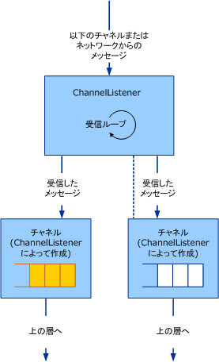

# <a name="service-channel-listeners-and-channels"></a><span data-ttu-id="7233d-102">サービス : チャネル リスナーとチャネル</span><span class="sxs-lookup"><span data-stu-id="7233d-102">Service: Channel Listeners and Channels</span></span>
<span data-ttu-id="7233d-103">チャネル オブジェクトには、チャネル、チャネル リスナー、およびチャネル ファクトリという 3 つのカテゴリがあります。</span><span class="sxs-lookup"><span data-stu-id="7233d-103">There are three categories of channel objects: channels, channel listeners and channel factories.</span></span> <span data-ttu-id="7233d-104">チャネルはアプリケーションおよびチャネル スタックとのインターフェイスです。</span><span class="sxs-lookup"><span data-stu-id="7233d-104">Channels are the interface between the application and the channel stack.</span></span> <span data-ttu-id="7233d-105">チャネル リスナーは受信 (またはリッスン) する側のチャネルを作成する役割を果たします。通常は、新しい受信メッセージまたは接続への応答を行います。</span><span class="sxs-lookup"><span data-stu-id="7233d-105">Channel listeners are responsible for creating channels on the receive (or listen) side, typically in response to a new incoming message or connection.</span></span> <span data-ttu-id="7233d-106">チャネル ファクトリは送信側のチャネルを作成し、エンドポイントとの通信を開始する役割を果たします。</span><span class="sxs-lookup"><span data-stu-id="7233d-106">Channel factories are responsible for creating channels on the send side to initiate communication with an endpoint.</span></span>  
  
## <a name="channel-listeners-and-channels"></a><span data-ttu-id="7233d-107">チャネル リスナーとチャネル</span><span class="sxs-lookup"><span data-stu-id="7233d-107">Channel Listeners and Channels</span></span>  
 <span data-ttu-id="7233d-108">チャネル リスナーには、チャネルを作成し、下の層またはネットワークからメッセージを受信する役割があります。</span><span class="sxs-lookup"><span data-stu-id="7233d-108">Channel listeners are responsible for creating channels and receiving messages from the layer below or from the network.</span></span> <span data-ttu-id="7233d-109">受信されたメッセージは、チャネル リスナーによって作成されるチャネルを使用して、上の層に配信されます。</span><span class="sxs-lookup"><span data-stu-id="7233d-109">Received messages are delivered to the layer above using a channel that is created by the channel listener.</span></span>  
  
 <span data-ttu-id="7233d-110">メッセージを受信して上の層に配信するプロセスを次の図に示します。</span><span class="sxs-lookup"><span data-stu-id="7233d-110">The following diagram illustrates the process of receiving messages and delivering them to the layer above.</span></span>  
  
 <span data-ttu-id="7233d-111"></span><span class="sxs-lookup"><span data-stu-id="7233d-111"></span></span>  
<span data-ttu-id="7233d-112">メッセージを受信してチャネル経由で上の層に配信するチャネル リスナー。</span><span class="sxs-lookup"><span data-stu-id="7233d-112">A channel listener receiving messages and delivering to the layer above through channels.</span></span>  
  
 <span data-ttu-id="7233d-113">このプロセスは、概念上、各チャネル内のキューとしてモデル化できますが、実際には実装がキューを使用しない場合もあります。</span><span class="sxs-lookup"><span data-stu-id="7233d-113">The process can be conceptually modeled as a queue inside each channel although the implementation may not actually use a queue.</span></span> <span data-ttu-id="7233d-114">チャネル リスナーには、下の層またはネットワークからメッセージを受信し、キューに配置する役割があります。</span><span class="sxs-lookup"><span data-stu-id="7233d-114">The channel listener is responsible for receiving messages from the layer below or the network and putting them in the queue.</span></span> <span data-ttu-id="7233d-115">また、チャネルには、キューからメッセージを取得し、上の層から (たとえば、チャネル上で `Receive` を呼び出すことによって) メッセージが要求されたときにそのメッセージを渡す役割があります。</span><span class="sxs-lookup"><span data-stu-id="7233d-115">The channel is responsible for getting messages from the queue and handing them to the layer above when that layer asks for a message, for example by calling `Receive` on the channel.</span></span>  
  
 <span data-ttu-id="7233d-116">WCF では、このプロセスの基本クラス ヘルパーが用意されています。</span><span class="sxs-lookup"><span data-stu-id="7233d-116">WCF provides base class helpers for this process.</span></span> <span data-ttu-id="7233d-117">(このトピックで説明するチャネルのヘルパー クラスのダイアグラムの場合、次を参照してください[チャネル モデルの概要](../../../../docs/framework/wcf/extending/channel-model-overview.md)。)。</span><span class="sxs-lookup"><span data-stu-id="7233d-117">(For a diagram of the channel helper classes discussed in this topic, see [Channel Model Overview](../../../../docs/framework/wcf/extending/channel-model-overview.md).)</span></span>  
  
-   <span data-ttu-id="7233d-118"><xref:System.ServiceModel.Channels.CommunicationObject>クラスが実装する<xref:System.ServiceModel.ICommunicationObject>し、適用のステップ 2 で説明されているステート マシン[開発チャネル](../../../../docs/framework/wcf/extending/developing-channels.md)です。</span><span class="sxs-lookup"><span data-stu-id="7233d-118">The <xref:System.ServiceModel.Channels.CommunicationObject> class implements <xref:System.ServiceModel.ICommunicationObject> and enforces the state machine described in step 2 of [Developing Channels](../../../../docs/framework/wcf/extending/developing-channels.md).</span></span>  
  
-   <span data-ttu-id="7233d-119"><xref:System.ServiceModel.Channels.ChannelManagerBase> クラスには <xref:System.ServiceModel.Channels.CommunicationObject> が実装され、<xref:System.ServiceModel.Channels.ChannelFactoryBase> と <xref:System.ServiceModel.Channels.ChannelListenerBase> の統合基本クラスが提供されます。</span><span class="sxs-lookup"><span data-stu-id="7233d-119">The <xref:System.ServiceModel.Channels.ChannelManagerBase> class implements <xref:System.ServiceModel.Channels.CommunicationObject> and provides a unified base class for <xref:System.ServiceModel.Channels.ChannelFactoryBase> and <xref:System.ServiceModel.Channels.ChannelListenerBase>.</span></span> <span data-ttu-id="7233d-120"><xref:System.ServiceModel.Channels.ChannelManagerBase> クラスは、<xref:System.ServiceModel.Channels.ChannelBase> を実装する基本クラスである <xref:System.ServiceModel.Channels.IChannel> との組み合わせによって動作します。</span><span class="sxs-lookup"><span data-stu-id="7233d-120">The <xref:System.ServiceModel.Channels.ChannelManagerBase> class works in conjunction with <xref:System.ServiceModel.Channels.ChannelBase>, which is a base class that implements <xref:System.ServiceModel.Channels.IChannel>.</span></span>  
  
-   <span data-ttu-id="7233d-121">'<xref:System.ServiceModel.Channels.ChannelFactoryBase>クラスが実装する<xref:System.ServiceModel.Channels.ChannelManagerBase>と<xref:System.ServiceModel.Channels.IChannelFactory>し、統合、`CreateChannel`を 1 つにオーバー ロード`OnCreateChannel`抽象メソッドです。</span><span class="sxs-lookup"><span data-stu-id="7233d-121">The``<xref:System.ServiceModel.Channels.ChannelFactoryBase> class implements <xref:System.ServiceModel.Channels.ChannelManagerBase> and <xref:System.ServiceModel.Channels.IChannelFactory> and consolidates the `CreateChannel` overloads into one `OnCreateChannel` abstract method.</span></span>  
  
-   <span data-ttu-id="7233d-122"><xref:System.ServiceModel.Channels.ChannelListenerBase> クラスは、<xref:System.ServiceModel.Channels.IChannelListener> を実装しています。</span><span class="sxs-lookup"><span data-stu-id="7233d-122">The <xref:System.ServiceModel.Channels.ChannelListenerBase> class implements <xref:System.ServiceModel.Channels.IChannelListener>.</span></span> <span data-ttu-id="7233d-123">基本状態管理を行います。</span><span class="sxs-lookup"><span data-stu-id="7233d-123">It takes care of basic state management.</span></span>  
  
 <span data-ttu-id="7233d-124">次の説明がに基づいて、[トランスポート: UDP](../../../../docs/framework/wcf/samples/transport-udp.md)サンプルです。</span><span class="sxs-lookup"><span data-stu-id="7233d-124">The following discussion is based upon the [Transport: UDP](../../../../docs/framework/wcf/samples/transport-udp.md) sample.</span></span>  
  
## <a name="creating-a-channel-listener"></a><span data-ttu-id="7233d-125">チャネル リスナーの作成</span><span class="sxs-lookup"><span data-stu-id="7233d-125">Creating a Channel Listener</span></span>  
 <span data-ttu-id="7233d-126">' から派生して、サンプルを実装する UdpChannelListener、<xref:System.ServiceModel.Channels.ChannelListenerBase>クラスです。</span><span class="sxs-lookup"><span data-stu-id="7233d-126">The``UdpChannelListener that the sample implements derives from the <xref:System.ServiceModel.Channels.ChannelListenerBase> class.</span></span> <span data-ttu-id="7233d-127">単一の UDP ソケットを使用して、データグラムを受信します。</span><span class="sxs-lookup"><span data-stu-id="7233d-127">It uses a single UDP socket to receive datagrams.</span></span> <span data-ttu-id="7233d-128">`OnOpen` メソッドは、非同期ループ内で UDP ソケットを使用してデータを受信します。</span><span class="sxs-lookup"><span data-stu-id="7233d-128">The `OnOpen` method receives data using the UDP socket in an asynchronous loop.</span></span> <span data-ttu-id="7233d-129">その後、メッセージ エンコーディング システムを使用して、データを次のようにメッセージに変換します。</span><span class="sxs-lookup"><span data-stu-id="7233d-129">The data are then converted into messages using the message encoding system:</span></span>  
  
```  
message = UdpConstants.MessageEncoder.ReadMessage(  
  new ArraySegment<byte>(buffer, 0, count),   
  bufferManager  
);  
```  
  
 <span data-ttu-id="7233d-130">複数のソースから到着するメッセージが同じデータグラム チャネルで表されるので、`UdpChannelListener` はシングルトン リスナーです。</span><span class="sxs-lookup"><span data-stu-id="7233d-130">Because the same datagram channel represents messages that arrive from a number of sources, the `UdpChannelListener` is a singleton listener.</span></span> <span data-ttu-id="7233d-131">ほとんどの 1 つのアクティブである<xref:System.ServiceModel.Channels.IChannel>'、時に、このリスナーに関連付けられています。</span><span class="sxs-lookup"><span data-stu-id="7233d-131">There is at most one active <xref:System.ServiceModel.Channels.IChannel>``associated with this listener at a time.</span></span> <span data-ttu-id="7233d-132">このサンプルでは、<xref:System.ServiceModel.Channels.ChannelListenerBase%601.AcceptChannel%2A> メソッドによって返されるチャネルがその後破棄される場合のみ、もう 1 つ生成されます。</span><span class="sxs-lookup"><span data-stu-id="7233d-132">The sample generates another one only if a channel that is returned by the <xref:System.ServiceModel.Channels.ChannelListenerBase%601.AcceptChannel%2A> method is subsequently disposed.</span></span> <span data-ttu-id="7233d-133">メッセージが受信されると、このシングルトン チャネルのキューに置かれます。</span><span class="sxs-lookup"><span data-stu-id="7233d-133">When a message is received, it is enqueued into this singleton channel.</span></span>  
  
### <a name="udpinputchannel"></a><span data-ttu-id="7233d-134">UdpInputChannel</span><span class="sxs-lookup"><span data-stu-id="7233d-134">UdpInputChannel</span></span>  
 <span data-ttu-id="7233d-135">`UdpInputChannel` クラスは、<xref:System.ServiceModel.Channels.IInputChannel> を実装しています。</span><span class="sxs-lookup"><span data-stu-id="7233d-135">The `UdpInputChannel` class implements <xref:System.ServiceModel.Channels.IInputChannel>.</span></span> <span data-ttu-id="7233d-136">このクラスは `UdpChannelListener` のソケットによって設定される受信メッセージのキューで構成されています。</span><span class="sxs-lookup"><span data-stu-id="7233d-136">It consists of a queue of incoming messages that is populated by the `UdpChannelListener`'s socket.</span></span> <span data-ttu-id="7233d-137">これらのメッセージは、<xref:System.ServiceModel.Channels.IInputChannel.Receive%2A> メソッドによってキューから削除されます。</span><span class="sxs-lookup"><span data-stu-id="7233d-137">These messages are dequeued by the <xref:System.ServiceModel.Channels.IInputChannel.Receive%2A> method.</span></span>
