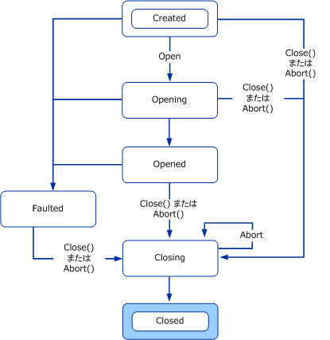
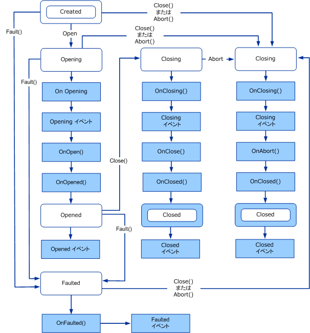
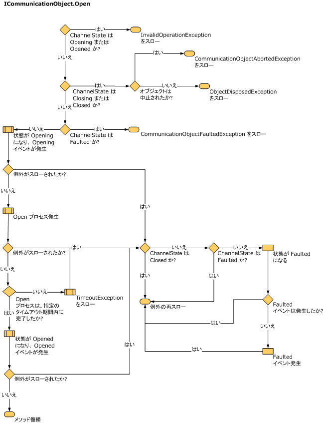
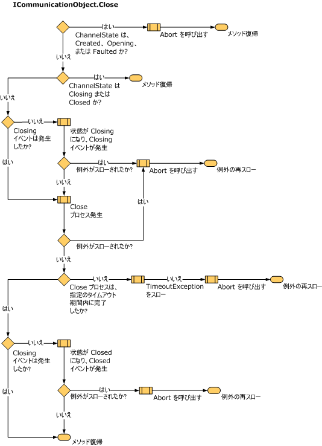
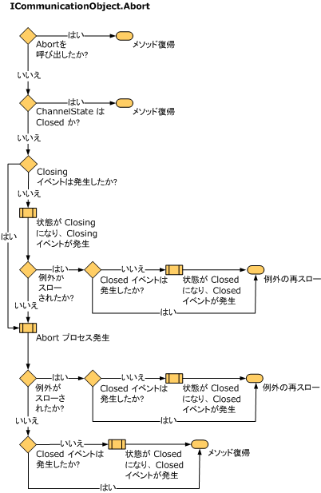

# 状態変更の理解Understanding State Changes
ここでは、チャネルの状態と遷移、チャネル状態の構成に使用する型、およびそれらの型の実装方法について説明します。This topic discusses the states and transitions that channels have, the types used to structure channel states, and how to implement them.  
  
## ステート マシンとチャネルState Machines and Channels  
 通信を処理する、ソケットなどのオブジェクトは、通常、ネットワーク リソースの割り当て、接続の確立や受け入れ、接続の閉鎖、および通信の終了に関連して状態が遷移するステート マシンを提供します。Objects that deal with communication, for example sockets, usually present a state machine whose state transitions relate to allocating network resources, making or accepting connections, closing connections and terminating communication. チャネル ステート マシンは、通信オブジェクトの状態の統一モデルを提供します。モデルでは、そのオブジェクトの基になる実装が抽出されます。The channel state machine provides a uniform model of the states of a communication object that abstracts the underlying implementation of that object. <xref:System.ServiceModel.ICommunicationObject> インターフェイスは、状態、状態遷移メソッド、および状態遷移イベントのセットを提供します。The <xref:System.ServiceModel.ICommunicationObject> interface provides a set of states, state transition methods and state transition events. すべてのチャネル、チャネル ファクトリ、およびチャネル リスナーは、チャネル ステート マシンを実装します。All channels, channel factories and channel listeners implement the channel state machine.  
  
 Closed、Closing、Faulted、Opened、および Opening の各イベントは、状態遷移の発生後に外部のオブザーバーに通知を行います。The events Closed, Closing, Faulted, Opened and Opening signal an external observer after a state transition occurs.  
  
 Abort、Close、Open の各メソッド (およびそれぞれと同等の非同期メソッド) は、状態遷移を発生させます。The methods Abort, Close, and Open (and their asynchronous equivalents) cause state transitions.  
  
 状態プロパティは、<xref:System.ServiceModel.CommunicationState> によって定義された現在の状態を返します。The state property returns the current state as defined by <xref:System.ServiceModel.CommunicationState>:  
  
## ICommunicationObject、CommunicationObject、および各状態と状態遷移ICommunicationObject, CommunicationObject, and States and State Transition  
 <xref:System.ServiceModel.ICommunicationObject> は、そのさまざまなプロパティを構成できる Created 状態で開始します。An <xref:System.ServiceModel.ICommunicationObject> starts out in the Created state where its various properties can be configured. Opened 状態になると、このオブジェクトは、メッセージを送受信するために利用できるようになりますが、プロパティは不変と見なされます。Once in the Opened state, the object is usable for sending and receiving messages but its properties are considered immutable. Closing 状態になると、このオブジェクトは新しい送受信要求を処理できなくなりますが、既存の要求は、Close タイムアウトに到達するまでに完了する可能性があります。Once in the Closing state, the object can no longer process new send or receive requests, but existing requests have a chance to complete until the Close timeout is reached.  回復不可能なエラーが発生した場合は、オブジェクトは Faulted 状態に遷移し、そこでエラーに関する情報を点検し、最終的に閉じることができます。If an unrecoverable error occurs, the object transitions to the Faulted state where it can be inspected for information about the error and ultimately closed. Closed 状態になると、このオブジェクトは、実質的にステート マシンの最後に到達します。When in the Closed state the object has essentially reached the end of the state machine. オブジェクトが、ある状態から次の状態に遷移すると、前の状態には戻りません。Once an object transitions from one state to the next, it does not go back to a previous state.  
  
 <xref:System.ServiceModel.ICommunicationObject> の各状態と状態遷移を次の図に示します。The following diagram shows the <xref:System.ServiceModel.ICommunicationObject> states and state transitions. 状態遷移は、Abort、Open、Close の 3 つのメソッドのいずれかを呼び出すことによって発生させることができます。State transitions can be caused by calling one of the three methods: Abort, Open, or Close. また、実装固有の他のメソッドを呼び出すことによって発生させることもできます。They could also be caused by calling other implementation-specific methods. Faulted 状態への遷移は、通信オブジェクトを開いている途中または開いた後に発生することがあります。Transitioning to the Faulted state could happen as a result of errors while opening or after having opened the communication object.  
  
 すべての <xref:System.ServiceModel.ICommunicationObject> は Created 状態から開始します。Every <xref:System.ServiceModel.ICommunicationObject> starts out in the Created state. この状態では、アプリケーションがプロパティを設定してオブジェクトを構成できます。In this state, an application can configure the object by setting its properties. オブジェクトが Created 以外の状態になると、オブジェクトは不変と見なされます。Once an object is in a state other than Created, it is considered immutable.  
  
   
図 1 です。Figure 1. ICommunicationObject ステート マシンThe ICommunicationObject State Machine.  
  
 Windows Communication Foundation (WCF) という名前の抽象基本クラスを提供する<xref:System.ServiceModel.Channels.CommunicationObject>を実装する<xref:System.ServiceModel.ICommunicationObject>とチャネル ステート マシンです。Windows Communication Foundation (WCF) provides an abstract base class named <xref:System.ServiceModel.Channels.CommunicationObject> that implements <xref:System.ServiceModel.ICommunicationObject> and the channel state machine. 次の図は、<xref:System.ServiceModel.Channels.CommunicationObject> に固有の、変更済みの状態図です。The following graphic is a modified state diagram that is specific to <xref:System.ServiceModel.Channels.CommunicationObject>. <xref:System.ServiceModel.ICommunicationObject> ステート マシンのほかに、追加の <xref:System.ServiceModel.Channels.CommunicationObject> メソッドが呼び出されるタイミングも示しています。In addition to the <xref:System.ServiceModel.ICommunicationObject> state machine, it shows the timing when additional <xref:System.ServiceModel.Channels.CommunicationObject> methods are invoked.  
  
   
図 2 になります。Figure 2. イベントと保護メソッドの呼び出しを含む、ICommunicationObject ステート マシンの CommunicationObject 実装The CommunicationObject implementation of the ICommunicationObject state machine including calls to events and protected methods.  
  
### ICommunicationObject イベントICommunicationObject Events  
 <xref:System.ServiceModel.Channels.CommunicationObject> は、<xref:System.ServiceModel.ICommunicationObject> によって定義された 5 つのイベントを公開します。<xref:System.ServiceModel.Channels.CommunicationObject> exposes the five events defined by <xref:System.ServiceModel.ICommunicationObject>. これらのイベントは、通信オブジェクトを使用するコードに状態遷移を通知するために設計されています。These events are designed for code using the communication object to be notified of state transitions. 上の図 2 に示されているように、オブジェクトの状態が、各イベントの名前が付けられた状態に遷移すると、該当するイベントが 1 回発生します。As shown in Figure 2 above, each event is fired once after the object’s state transitions to the state named by the event. イベントはすべて `EventHandler` 型であり、この型は次のように定義されています。All five events are of the `EventHandler` type which is defined as:  
  
 `public delegate void EventHandler(object sender, EventArgs e);`  
  
 <xref:System.ServiceModel.Channels.CommunicationObject> 実装では、送信側は <xref:System.ServiceModel.Channels.CommunicationObject> 自体、または送信側として <xref:System.ServiceModel.Channels.CommunicationObject> コンストラクターに渡されたオブジェクト (そのコンストラクター オーバーロードを使用した場合) になります。In the <xref:System.ServiceModel.Channels.CommunicationObject> implementation, the sender is either the <xref:System.ServiceModel.Channels.CommunicationObject> itself or whatever was passed in as the sender to the <xref:System.ServiceModel.Channels.CommunicationObject> constructor (if that constructor overload was used). EventArgs パラメーター `e` は、常に `EventArgs.Empty` です。The EventArgs parameter, `e`, is always `EventArgs.Empty`.  
  
### 派生オブジェクト コールバックDerived Object Callbacks  
 <xref:System.ServiceModel.Channels.CommunicationObject> は、5 つのイベントのほかに、状態遷移が発生する前後に派生オブジェクトのコールバックを可能にする 8 つの保護された仮想メソッドを宣言します。In addition to the five events, <xref:System.ServiceModel.Channels.CommunicationObject> declares eight protected virtual methods designed to allow a derived object to be called back before and after state transitions occur.  
  
 <xref:System.ServiceModel.Channels.CommunicationObject.Open%2A?displayProperty=nameWithType> メソッドと <xref:System.ServiceModel.Channels.CommunicationObject.Close%2A?displayProperty=nameWithType> メソッドには、このような 3 つのコールバックがそれぞれに関連付けられています。The <xref:System.ServiceModel.Channels.CommunicationObject.Open%2A?displayProperty=nameWithType> and <xref:System.ServiceModel.Channels.CommunicationObject.Close%2A?displayProperty=nameWithType> methods have three such callbacks associated with each of them. たとえば、<xref:System.ServiceModel.Channels.CommunicationObject.Open%2A?displayProperty=nameWithType> に対応するのは、<xref:System.ServiceModel.Channels.CommunicationObject.OnOpening%2A?displayProperty=nameWithType>、<xref:System.ServiceModel.Channels.CommunicationObject.OnOpen%2A?displayProperty=nameWithType>、および <xref:System.ServiceModel.Channels.CommunicationObject.OnOpened%2A?displayProperty=nameWithType> です。For example, corresponding to <xref:System.ServiceModel.Channels.CommunicationObject.Open%2A?displayProperty=nameWithType> there is <xref:System.ServiceModel.Channels.CommunicationObject.OnOpening%2A?displayProperty=nameWithType>, <xref:System.ServiceModel.Channels.CommunicationObject.OnOpen%2A?displayProperty=nameWithType>, and <xref:System.ServiceModel.Channels.CommunicationObject.OnOpened%2A?displayProperty=nameWithType>. <xref:System.ServiceModel.Channels.CommunicationObject.Close%2A?displayProperty=nameWithType> には、<xref:System.ServiceModel.Channels.CommunicationObject.OnClose%2A?displayProperty=nameWithType>、<xref:System.ServiceModel.Channels.CommunicationObject.OnClosing%2A?displayProperty=nameWithType>、および <xref:System.ServiceModel.Channels.CommunicationObject.OnClosed%2A?displayProperty=nameWithType> の各メソッドが関連付けられています。Associated with <xref:System.ServiceModel.Channels.CommunicationObject.Close%2A?displayProperty=nameWithType> are the <xref:System.ServiceModel.Channels.CommunicationObject.OnClose%2A?displayProperty=nameWithType>, <xref:System.ServiceModel.Channels.CommunicationObject.OnClosing%2A?displayProperty=nameWithType>, and <xref:System.ServiceModel.Channels.CommunicationObject.OnClosed%2A?displayProperty=nameWithType> methods.  
  
 同様に、<xref:System.ServiceModel.Channels.CommunicationObject.Abort%2A?displayProperty=nameWithType> メソッドには、対応する <xref:System.ServiceModel.Channels.CommunicationObject.OnAbort%2A?displayProperty=nameWithType> があります。Similarly, the <xref:System.ServiceModel.Channels.CommunicationObject.Abort%2A?displayProperty=nameWithType> method has a corresponding <xref:System.ServiceModel.Channels.CommunicationObject.OnAbort%2A?displayProperty=nameWithType>.  
  
 <xref:System.ServiceModel.Channels.CommunicationObject.OnOpen%2A?displayProperty=nameWithType>、<xref:System.ServiceModel.Channels.CommunicationObject.OnClose%2A?displayProperty=nameWithType>、および <xref:System.ServiceModel.Channels.CommunicationObject.OnAbort%2A?displayProperty=nameWithType> には既定の実装がありませんが、他のコールバックには、ステート マシンの正確さを保つために必要な既定の実装があります。While <xref:System.ServiceModel.Channels.CommunicationObject.OnOpen%2A?displayProperty=nameWithType>, <xref:System.ServiceModel.Channels.CommunicationObject.OnClose%2A?displayProperty=nameWithType>, and <xref:System.ServiceModel.Channels.CommunicationObject.OnAbort%2A?displayProperty=nameWithType> have no default implementation, the other callbacks do have a default implementation which is necessary for state machine correctness. これらのメソッドをオーバーライドする場合は、必ず基本実装を呼び出すか、正確に置き換えてください。If you override those methods be sure to call the base implementation or correctly replace it.  
  
 <xref:System.ServiceModel.Channels.CommunicationObject.OnOpening%2A?displayProperty=nameWithType>、<xref:System.ServiceModel.Channels.CommunicationObject.OnClosing%2A?displayProperty=nameWithType>、および <xref:System.ServiceModel.Channels.CommunicationObject.OnFaulted%2A?displayProperty=nameWithType> は、それぞれ対応する <xref:System.ServiceModel.Channels.CommunicationObject.Opening?displayProperty=nameWithType>、<xref:System.ServiceModel.Channels.CommunicationObject.Closing?displayProperty=nameWithType>、および <xref:System.ServiceModel.Channels.CommunicationObject.Faulted?displayProperty=nameWithType> の各イベントを発生させます。<xref:System.ServiceModel.Channels.CommunicationObject.OnOpening%2A?displayProperty=nameWithType>, <xref:System.ServiceModel.Channels.CommunicationObject.OnClosing%2A?displayProperty=nameWithType> and <xref:System.ServiceModel.Channels.CommunicationObject.OnFaulted%2A?displayProperty=nameWithType> fire the corresponding <xref:System.ServiceModel.Channels.CommunicationObject.Opening?displayProperty=nameWithType>, <xref:System.ServiceModel.Channels.CommunicationObject.Closing?displayProperty=nameWithType> and <xref:System.ServiceModel.Channels.CommunicationObject.Faulted?displayProperty=nameWithType> events. <xref:System.ServiceModel.Channels.CommunicationObject.OnOpened%2A?displayProperty=nameWithType> と <xref:System.ServiceModel.Channels.CommunicationObject.OnClosed%2A?displayProperty=nameWithType> は、オブジェクトの状態をそれぞれ Opened と Closed に設定してから、対応する <xref:System.ServiceModel.Channels.CommunicationObject.Opened?displayProperty=nameWithType> イベントと <xref:System.ServiceModel.Channels.CommunicationObject.Closed?displayProperty=nameWithType> イベントを発生させます。<xref:System.ServiceModel.Channels.CommunicationObject.OnOpened%2A?displayProperty=nameWithType> and <xref:System.ServiceModel.Channels.CommunicationObject.OnClosed%2A?displayProperty=nameWithType> set the object state to Opened and Closed respectively then fire the corresponding <xref:System.ServiceModel.Channels.CommunicationObject.Opened?displayProperty=nameWithType> and <xref:System.ServiceModel.Channels.CommunicationObject.Closed?displayProperty=nameWithType> events.  
  
### 状態遷移メソッドState Transition Methods  
 <xref:System.ServiceModel.Channels.CommunicationObject> は、Abort、Close、および Open の実装を提供します。<xref:System.ServiceModel.Channels.CommunicationObject> provides implementations of Abort, Close and Open. また、Faulted 状態への状態遷移を引き起こす Fault メソッドも提供します。It also provides a Fault method which causes a state transition to the Faulted state. 図 2 では、遷移の原因となったメソッドを各遷移に付記して <xref:System.ServiceModel.ICommunicationObject> ステート マシンを示しています (メソッドが付記されていない遷移は、メソッドが付記されている直前の遷移を発生させたメソッドの実装内部で発生します)。Figure 2 shows the <xref:System.ServiceModel.ICommunicationObject> state machine with each transition labeled by the method that causes it (unlabeled transitions happen inside the implementation of the method that caused the last labeled transition).  
  
> [!NOTE]
>  通信状態の取得/設定の <xref:System.ServiceModel.Channels.CommunicationObject> 実装はすべて、スレッド同期されます。All <xref:System.ServiceModel.Channels.CommunicationObject> implementations of communication state gets/sets are thread-synchronized.  
  
 コンストラクターConstructor  
  
 <xref:System.ServiceModel.Channels.CommunicationObject> は 3 つのコンストラクターを提供します。これらはすべて、オブジェクトを Created 状態にとどめます。<xref:System.ServiceModel.Channels.CommunicationObject> provides three constructors, all of which leave the object in the Created state. これらのコンストラクターは、次のように定義されています。The constructors are defined as:  
  
 最初のコンストラクターは既定のコンストラクターで、オブジェクトを取得するコンストラクター オーバーロードで代行されます。The first constructor is a default constructor that delegates to the constructor overload that takes an object:  
  
 `protected CommunicationObject() : this(new object()) { … }`  
  
 オブジェクトを取得するコンストラクターは、通信オブジェクトの状態へのアクセスを同期するときにロックされるオブジェクトとしてパラメーターを使用します。The constructor that takes an object uses that parameter as the object to be locked when synchronizing access to communication object state:  
  
 `protected CommunicationObject(object mutex) { … }`  
  
 最後に、3 番目のコンストラクターが、<xref:System.ServiceModel.ICommunicationObject> イベントが発生したときに送信側の引数として使用する追加のパラメーターを取得します。Finally, a third constructor takes an additional parameter that is used as the sender argument when <xref:System.ServiceModel.ICommunicationObject> events are fired.  
  
 `protected CommunicationObject(object mutex, object eventSender) { … }`  
  
 前の 2 つのコンストラクターは、送信側をこれに設定します。The previous two constructors set the sender to this.  
  
 Open メソッドOpen Method  
  
 事前条件 : 状態は Created です。Precondition: State is Created.  
  
 事後条件 : 状態は Opened または Faulted です。Post-condition: State is Opened or Faulted. 例外がスローされる場合があります。May throw an exception.  
  
 Open() メソッドは通信オブジェクトを開き、状態を Opened に設定しようとします。The Open() method will try to open the communication object and set the state to Opened. エラーが発生した場合は、状態を Faulted に設定します。If it encounters an error, it will set the state to Faulted.  
  
 このメソッドは、まず現在の状態が Created であるかを確認します。The method first checks that the current state is Created. 現在の状態が Opening または Opened の場合、<xref:System.InvalidOperationException> をスローします。If the current state is Opening or Opened it throws an <xref:System.InvalidOperationException>. 現在の状態が Closing または Closed の場合、オブジェクトが終了しているときは <xref:System.ServiceModel.CommunicationObjectAbortedException>、それ以外では <xref:System.ObjectDisposedException> をスローします。If the current state is Closing or Closed, it throws a <xref:System.ServiceModel.CommunicationObjectAbortedException> if the object has been terminated and <xref:System.ObjectDisposedException> otherwise. 現在の状態が Faulted の場合、<xref:System.ServiceModel.CommunicationObjectFaultedException> をスローします。If the current state is Faulted, it throws a <xref:System.ServiceModel.CommunicationObjectFaultedException>.  
  
 次に、状態を Opening に設定し、OnOpening() (Opening イベントを発生させます)、OnOpen()、および OnOpened() をこの順に呼び出します。It then sets the state to Opening and calls OnOpening() (which raises the Opening event), OnOpen() and OnOpened() in that order. OnOpened() は、状態を Opened に設定し、Opened イベントを発生させます。OnOpened() sets the state to Opened and raises the Opened event. これらのいずれかが例外をスローした場合、Open() は Fault() を呼び出して例外をバブリングさせます。If any of these throws an exception, Open()calls Fault() and lets the exception bubble up. Open プロセスの詳細を次の図に示します。The following diagram shows the Open process in more detail.  
  
   
カスタム オープン ロジック (内部通信オブジェクトを開くなど) を実装するように OnOpen メソッドをオーバーライドします。Override the OnOpen method to implement custom open logic such as opening an inner communication object.  
  
 Close メソッドClose Method  
  
 事前条件 : なし。Precondition: None.  
  
 事後条件 : 状態は Closed です。Post-condition: State is Closed. 例外がスローされる場合があります。May throw an exception.  
  
 Close() メソッドはどの状態でも呼び出すことができます。The Close() method can be called at any state. このメソッドは、オブジェクトを正常に閉じようとします。It tries to close the object normally. エラーが発生した場合は、オブジェクトを終了します。If an error is encountered, it terminates the object. 現在の状態が Closing または Closed の場合、このメソッドは何もしません。The method does nothing if the current state is Closing or Closed. それ以外の場合は、状態を Closing に設定します。Otherwise it sets the state to Closing. 元の状態が Created、Opening、または Faulted の場合は、Abort() を呼び出します (次の図を参照してください)。If the original state was Created, Opening or Faulted, it calls Abort() (see the following diagram). 元の状態が Opened の場合は、OnClosing() (Closing イベントを発生させます)、OnClose()、および OnClosed() をこの順に呼び出します。If the original state was Opened, it calls OnClosing() (which raises the Closing event), OnClose() and OnClosed() in that order. これらのいずれかが例外をスローした場合、Close() は Abort() を呼び出して例外をバブリングさせます。If any of these throws an exception, Close()calls Abort() and lets the exception bubble up. OnClosed() は状態をクローズに設定し、クローズ イベントを発生させます。OnClosed() sets the state to Closed and raises the Closed event. Close プロセスの詳細を次の図に示します。The following diagram shows the Close process in more detail.  
  
   
OnClose メソッドをオーバーライドして、カスタム クローズ ロジック (内部通信オブジェクトを閉じるなど) を実装します。Override the OnClose method to implement custom close logic, such as closing an inner communication object. OnClose() はタイムアウト パラメーターを取り、Abort() の一部として呼び出されないため、長時間にわたってブロックできる正常なクロージング ロジック (たとえば、もう一方の側が応答するまで待機するなど) はすべて OnClose() で実装してください。All graceful closing logic that may block for a long time (for example, waiting for the other side to respond) should be implemented in OnClose() because it takes a timeout parameter and because it is not called as part of Abort().  
  
 [中止]Abort  
  
 事前条件 : なし。Precondition: None.  
事後条件 : 状態は Closed です。Post-condition: State is Closed. 例外がスローされる場合があります。May throw an exception.  
  
 現在の状態が Closed の場合、またはオブジェクトが既に終了している場合 (Abort() を別のスレッドで実行するなどにより)、Abort() メソッドは何もしません。The Abort() method does nothing if the current state is Closed or if the object has been terminated before (for example, possibly by having Abort() executing on another thread). それ以外の場合は、状態を Closing に設定し、OnClosing() (Closing イベントを発生させます)、OnAbort()、および OnClosed をこの順に呼び出します (オブジェクトを閉じるのではなく、終了させるので OnClose を呼び出しません)。Otherwise it sets the state to Closing and calls OnClosing() (which raises the Closing event), OnAbort(), and OnClosed() in that order (does not call OnClose because the object is being terminated, not closed). OnClosed() は状態をクローズに設定し、クローズ イベントを発生させます。OnClosed() sets the state to Closed and raises the Closed event. これらのいずれかが例外をスローした場合は、Abort の呼び出し元に例外が再スローされます。If any of these throw an exception, it is re-thrown to the caller of Abort. OnClosing()、OnClosed()、および OnAbort() の実装は、入出力などでブロックしないでください。Implementations of OnClosing(), OnClosed() and OnAbort() should not block (for example, on input/output). Abort プロセスの詳細を次の図に示します。The following diagram shows the Abort process in more detail.  
  
   
カスタム終了ロジック (内部通信オブジェクトを終了するなど) を実装するように OnAbort メソッドをオーバーライドします。Override the OnAbort method to implement custom terminate logic such as terminating an inner communication object.  
  
 FaultFault  
  
 Fault は、<xref:System.ServiceModel.Channels.CommunicationObject> に固有のメソッドであり、<xref:System.ServiceModel.ICommunicationObject> インターフェイスの一部ではありません。The Fault method is specific to <xref:System.ServiceModel.Channels.CommunicationObject> and is not part of the <xref:System.ServiceModel.ICommunicationObject> interface. ここで説明するのは、完全性を期してのことです。It is included here for completeness.  
  
 事前条件 : なし。Precondition: None.  
  
 事後条件 : 状態は Faulted です。Post-condition: State is Faulted. 例外がスローされる場合があります。May throw an exception.  
  
 現在の状態が Faulted または Closed の場合、Fault() は何もしません。The Fault() method does nothing if the current state is Faulted or Closed. それ以外の場合は、状態を Faulted に設定し、Faulted イベントを発生させる OnFaulted() を呼び出します。Otherwise it sets the state to Faulted and call OnFaulted(), which raises the Faulted event. OnFaulted がスローした例外は再スローされます。If OnFaulted throws an exception it is re-thrown.  
  
### ThrowIfXxx メソッドThrowIfXxx Methods  
 CommunicationObject には、オブジェクトが特定の状態にある場合に例外をスローするために使用できる 3 つの保護メソッドがあります。CommunicationObject has three protected methods that can be used to throw exceptions if the object is in a specific state.  
  
 <xref:System.ServiceModel.Channels.CommunicationObject.ThrowIfDisposed%2A> は、状態が Closing、Closed、または Faulted の場合に例外をスローします。<xref:System.ServiceModel.Channels.CommunicationObject.ThrowIfDisposed%2A> throws an exception if the state is Closing, Closed or Faulted.  
  
 <xref:System.ServiceModel.Channels.CommunicationObject.ThrowIfDisposedOrImmutable%2A> は、状態が Created でない場合に例外をスローします。<xref:System.ServiceModel.Channels.CommunicationObject.ThrowIfDisposedOrImmutable%2A> throws an exception if the state is not Created.  
  
 <xref:System.ServiceModel.Channels.CommunicationObject.ThrowIfDisposedOrNotOpen%2A> は、状態が Opened でない場合に例外をスローします。<xref:System.ServiceModel.Channels.CommunicationObject.ThrowIfDisposedOrNotOpen%2A> throws an exception if the state is not Opened.  
  
 スローされる例外は状態によって決まります。The exceptions thrown depend on the state. それぞれ異なる状態で ThrowIfXxx を呼び出すことによってスローされる例外の種類を次の表に示します。The following table shows the different states and the corresponding exception type thrown by calling a ThrowIfXxx that throws on that state.  
  
|状態State|Abort を呼び出したかHas Abort been called?|例外Exception|  
|-----------|----------------------------|---------------|  
|作成日時Created|N/AN/A|<xref:System.InvalidOperationException?displayProperty=nameWithType>|  
|OpeningOpening|N/AN/A|<xref:System.InvalidOperationException?displayProperty=nameWithType>|  
|OpenedOpened|N/AN/A|<xref:System.InvalidOperationException?displayProperty=nameWithType>|  
|ClosingClosing|[はい]Yes|<xref:System.ServiceModel.CommunicationObjectAbortedException?displayProperty=nameWithType>|  
|ClosingClosing|×No|<xref:System.ObjectDisposedException?displayProperty=nameWithType>|  
|ClosedClosed|[はい]Yes|事前に Abort を明示的に呼び出してオブジェクトを閉じた場合、<xref:System.ServiceModel.CommunicationObjectAbortedException?displayProperty=nameWithType>。<xref:System.ServiceModel.CommunicationObjectAbortedException?displayProperty=nameWithType> in the case that an object was closed by a previous and explicit call of Abort. オブジェクトで Close を呼び出した場合は、<xref:System.ObjectDisposedException?displayProperty=nameWithType> がスローされます。If you call Close on the object then an <xref:System.ObjectDisposedException?displayProperty=nameWithType> is thrown.|  
|ClosedClosed|×No|<xref:System.ObjectDisposedException?displayProperty=nameWithType>|  
|FaultedFaulted|N/AN/A|<xref:System.ServiceModel.CommunicationObjectFaultedException?displayProperty=nameWithType>|  
  
### タイムアウトTimeouts  
 既に説明したメソッドには、タイムアウト パラメーターを取るものがあります。Several of the methods we discussed take timeout parameters. それらは、Close、Open (特定のオーバーロードと非同期バージョン)、OnClose、および OnOpen です。These are Close, Open (certain overloads and asynchronous versions), OnClose and OnOpen. これらのメソッドは、時間のかかる操作 (たとえば、入出力でブロックしながら、接続を正常に閉じる操作など) を可能にするように設計されているため、そのような操作が中断されるまでに利用できる時間をタイムアウト パラメーターが示します。These methods are designed to allow for lengthy operations (for example, blocking on input/output while gracefully closing down a connection) so the timeout parameter indicates how long such operations can take before being interrupted. これらのどのメソッドの実装も、指定されたタイムアウト値を使用して、そのタイムアウトの範囲内に呼び出し元に確実に復帰する必要があります。Implementations of any of these methods should use the supplied timeout value to ensure it returns to the caller within that timeout. タイムアウトを取らない他のメソッドの実装は、時間のかかる操作を目的として設計されていないため、入出力でブロックしないでください。Implementations of other methods that do not take a timeout are not designed for lengthy operations and should not block on input/output.  
  
 ただし、タイムアウトを取らない Open() オーバーロードと Close() オーバーロードは例外です。The exception are the Open() and Close() overloads that do not take a timeout. これらは、派生クラスによって提供される既定のタイムアウト値を使用します。These use a default timeout value supplied by the derived class. <xref:System.ServiceModel.Channels.CommunicationObject> は、<xref:System.ServiceModel.Channels.CommunicationObject.DefaultCloseTimeout%2A> および <xref:System.ServiceModel.Channels.CommunicationObject.DefaultOpenTimeout%2A> という名前の 2 つの保護された抽象プロパティを公開します。これらは、次のように定義されています。<xref:System.ServiceModel.Channels.CommunicationObject> exposes two protected abstract properties named <xref:System.ServiceModel.Channels.CommunicationObject.DefaultCloseTimeout%2A> and <xref:System.ServiceModel.Channels.CommunicationObject.DefaultOpenTimeout%2A> defined as:  
  
 `protected abstract TimeSpan DefaultCloseTimeout { get; }`  
  
 `protected abstract TimeSpan DefaultOpenTimeout { get; }`  
  
 派生クラスは、タイムアウト値をとらない Open() オーバーロードと Close() オーバーロードに既定のタイムアウトを提供するために、これらのプロパティを実装します。A derived class implements these properties to provide the default timeout for the Open() and Close() overloads that do not take a timeout value. その後、Open() 実装と Close() 実装は、タイムアウトを取らないオーバーロードに代行させ、既定のタイムアウト値を渡します。この例を次に示します。Then the Open() and Close() implementations delegate to the overload that takes a timeout passing it the default timeout value, for example:  
  
 `public void Open()`  
  
 `{`  
  
 `this.Open(this.DefaultOpenTimeout);`  
  
 `}`  
  
#### IDefaultCommunicationTimeoutsIDefaultCommunicationTimeouts  
 このインターフェイスには、オープン、送信、受信、およびクローズに適用する既定のタイムアウト値を提供する 4 つの読み取り専用プロパティがあります。This interface has four read-only properties for providing default timeout values for open, send, receive, and close. 各実装は、適切な方法で既定値を取得します。Each implementation is responsible for obtaining the default values in whatever manner appropriate. 便宜上、<xref:System.ServiceModel.Channels.ChannelFactoryBase> と <xref:System.ServiceModel.Channels.ChannelListenerBase> の既定値はそれぞれ 1 分です。As a convenience, <xref:System.ServiceModel.Channels.ChannelFactoryBase> and <xref:System.ServiceModel.Channels.ChannelListenerBase> default these values to 1 minute each.
