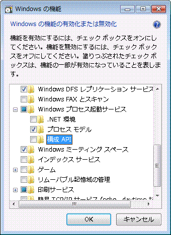
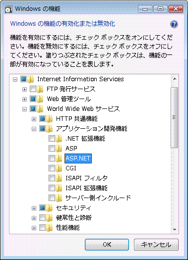
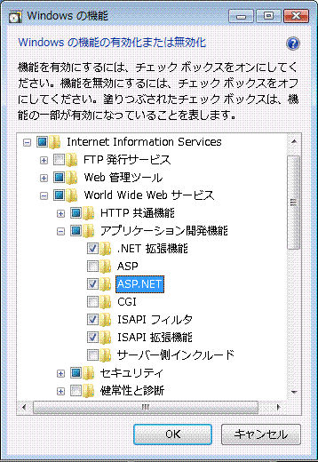
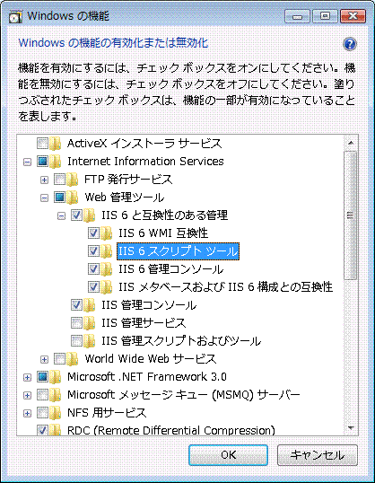

# Windows Communication Foundation での Internet Information Services 7.0 の構成Configuring Internet Information Services 7.0 for Windows Communication Foundation
Internet Information Services (IIS) 7.0 はモジュール設計になっており、必要なコンポーネントを選択してインストールできます。Internet Information Services (IIS) 7.0 has a modular design that allows you to selectively install components that are required. この設計は、[!INCLUDE[wv](../../../../includes/wv-md.md)] で新しく導入されたマニフェスト ドリブンのコンポーネント テクノロジに基づいています。This design is based on the new manifest-driven componentization technology introduced in [!INCLUDE[wv](../../../../includes/wv-md.md)]. [!INCLUDE[iisver](../../../../includes/iisver-md.md)] には、40 以上のスタンドアロン機能コンポーネントがあり、個別にインストールできます。There are more than 40 standalone feature components of [!INCLUDE[iisver](../../../../includes/iisver-md.md)] that can be installed independently. これにより、IT プロフェッショナルは必要に応じてインストールをカスタマイズできます。This allows IT professionals to easily customize the installation as required. このトピックで構成する方法について説明します[!INCLUDE[iisver](../../../../includes/iisver-md.md)]の Windows Communication Foundation (WCF) を使用し、必要なコンポーネントを決定します。This topic discusses how to configure [!INCLUDE[iisver](../../../../includes/iisver-md.md)] for use with Windows Communication Foundation (WCF) and determine which components are required.  
  
## 最小インストール : WAS のインストールMinimal Installation: Installing WAS  
 完全な [!INCLUDE[iisver](../../../../includes/iisver-md.md)] パッケージの最小インストールでは、Windows プロセス アクティブ化サービス (WAS: Windows Process Activation Service) をインストールします。The minimal installation of the whole [!INCLUDE[iisver](../../../../includes/iisver-md.md)] package is to install the Windows Process Activation Service (WAS). WAS はスタンドアロン機能であり、すべての [!INCLUDE[iisver](../../../../includes/iisver-md.md)] オペレーティング システム (Home Basic、Home Premium、Business、Ultimate、および Enterprise) で利用できる唯一の [!INCLUDE[wv](../../../../includes/wv-md.md)] の機能です。WAS is a standalone feature and it is the only feature from the [!INCLUDE[iisver](../../../../includes/iisver-md.md)] that is available for all [!INCLUDE[wv](../../../../includes/wv-md.md)] operating systems (Home Basic, Home Premium, Business, and Ultimate and Enterprise).  
  
 コントロール パネル からをクリックして**プログラム** をクリックし、 **Windows の機能のオンまたはオフ**の下に表示される**プログラムと機能**に WAS コンポーネントが表示、次の図のようにリストします。From the Control Panel, click **Programs** and then click **Turn Windows features on or off** which is listed under **Programs and Features**, the WAS component is shown in the list as in the following illustration.  
  
   
  
 この機能には、次のサブコンポーネントがあります。This feature has the following sub-components:  
  
-   .NET 環境.NET Environment  
  
-   構成 APIConfiguration APIs  
  
-   プロセス モデルProcess Model  
  
 WAS のルート ノードのみを選択するかどうか、**プロセス モデル**サブ ノードは既定でオンにします。If you select the root node of WAS, only the **Process Model** sub-node is checked by default. このインストールでは Web サーバーをサポートしないため、WAS のみをインストールすることに注意してください。Please note that with this installation you are only installing WAS, because there is no support for a Web server.  
  
 WCF またはいずれかに[!INCLUDE[vstecasp](../../../../includes/vstecasp-md.md)]するために、アプリケーションを確認して、 **.NET 環境**チェック ボックスをオンします。To make WCF or any [!INCLUDE[vstecasp](../../../../includes/vstecasp-md.md)] application to work, check the **.NET Environment** checkbox. つまり、すべての WAS コンポーネントは WCF のために必要と[!INCLUDE[vstecasp](../../../../includes/vstecasp-md.md)]を適切に機能します。This means that all of WAS components are required to make WCF and [!INCLUDE[vstecasp](../../../../includes/vstecasp-md.md)] to work well. これらのコンポーネントのいずれかを一度インストールすると、チェック ボックスは自動的にオンになります。These are automatically checked once you install any of those components.  
  
## IIS 7.0 : 既定のインストールIIS 7.0: Default Installation  
 チェックして、**インターネット インフォメーション サービス**サブ ノードの一部の機能は、次の図に示すように自動的にチェックします。By checking the **Internet Information Services** feature, some of the sub-nodes are automatically checked as shown in the following illustration.  
  
   
  
 これは [!INCLUDE[iisver](../../../../includes/iisver-md.md)] の既定のインストールです。This is the default installation of [!INCLUDE[iisver](../../../../includes/iisver-md.md)]. このインストールにより、[!INCLUDE[iisver](../../../../includes/iisver-md.md)] を使用して静的コンテンツ (HTML ページなど) を提供できます。With this installation, you can use [!INCLUDE[iisver](../../../../includes/iisver-md.md)] to service static content (such as HTML pages and other content). ただし、実行することはできません[!INCLUDE[vstecasp](../../../../includes/vstecasp-md.md)]または CGI アプリケーションまたは WCF サービスをホストします。However, you cannot run [!INCLUDE[vstecasp](../../../../includes/vstecasp-md.md)] or CGI applications or host WCF services.  
  
## IIS 7.0 : ASP.NET サポートを行うインストールIIS 7.0: Installation with ASP.NET Support  
 IIS 7.0 で [!INCLUDE[vstecasp](../../../../includes/vstecasp-md.md)] を機能させるには [!INCLUDE[vstecasp](../../../../includes/vstecasp-md.md)] をインストールする必要があります。You must install [!INCLUDE[vstecasp](../../../../includes/vstecasp-md.md)] to make [!INCLUDE[vstecasp](../../../../includes/vstecasp-md.md)] work on IIS 7.0. チェックした後**ASP.NET**画面に、次の図のようになります。After checking **ASP.NET**, your screen should look like the following illustration.  
  
   
  
 これは、両方の WCF の最低限の環境と[!INCLUDE[vstecasp](../../../../includes/vstecasp-md.md)]で動作するアプリケーション[!INCLUDE[iisver](../../../../includes/iisver-md.md)]です。This is the minimal environment for both WCF and [!INCLUDE[vstecasp](../../../../includes/vstecasp-md.md)] applications to work in [!INCLUDE[iisver](../../../../includes/iisver-md.md)].  
  
## IIS 7.0 : IIS 6.0 互換コンポーネントを備えたインストールIIS 7.0: Installation with IIS 6.0 Compatibility Components  
 インストールするときに[!INCLUDE[iisver](../../../../includes/iisver-md.md)]Visual Studio 2005 または他の自動化スクリプトまたはを使用した仮想アプリケーションを構成する (Adsutil.vbs) などのツールがシステムの[!INCLUDE[iis601](../../../../includes/iis601-md.md)]メタベース API では、確認することを確認してください、 [!INCLUDE[iis601](../../../../includes/iis601-md.md)]  **。スクリプト ツール**です。When installing [!INCLUDE[iisver](../../../../includes/iisver-md.md)] on a system with Visual Studio 2005 or some other automation scripts or tools (such as Adsutil.vbs) that configure virtual applications that use [!INCLUDE[iis601](../../../../includes/iis601-md.md)] Metabase API, ensure that you check the [!INCLUDE[iis601](../../../../includes/iis601-md.md)]**Scripting Tools**. 他のサブ ノードを自動的に確認[!INCLUDE[iis601](../../../../includes/iis601-md.md)]**互換性のある管理**です。This automatically checks the other sub-nodes of [!INCLUDE[iis601](../../../../includes/iis601-md.md)]**Management Compatibility**. 実行後の画面を次の図に示します。The following illustration shows the screen after this is done.  
  
   
  
 このインストールがあるを使用するために必要なすべて[!INCLUDE[iisver](../../../../includes/iisver-md.md)]、[!INCLUDE[vstecasp](../../../../includes/vstecasp-md.md)]および WCF の機能とサンプルは、Web でご確認いただけます。With this installation, you have everything required to use [!INCLUDE[iisver](../../../../includes/iisver-md.md)], [!INCLUDE[vstecasp](../../../../includes/vstecasp-md.md)] and WCF features and samples available on the Web.  
  
## 要求の制限Request Limits  
 IIS 7.0 がインストールされた [!INCLUDE[wv](../../../../includes/wv-md.md)] では、`maxUri` および `maxQueryStringSize` の設定の既定値が変更されています。On [!INCLUDE[wv](../../../../includes/wv-md.md)] with IIS 7 the default value of the `maxUri` and `maxQueryStringSize` settings have been changed. 既定では、IIS 7.0 における要求のフィルター処理で使用できる文字数は、URL が 4096 文字、クエリ文字列が 2048 文字です。By default, request filtering in IIS 7.0 allows a URL length of 4096 characters and a query string length of 2048 characters. これらの既定値を変更するには、App.config ファイルに次の XML を追加します。To change these defaults add the following XML to your App.config file.  
  
 `<system.webServer>`  
  
 `<security>`  
  
 `<requestFiltering>`  
  
 `<requestLimits maxUrl="8192" maxQueryString="8192" />`  
  
 `</requestFiltering>`  
  
 `</security>`  
  
 `</system.webServer>`  
  
## 関連項目See Also  
 [WAS アクティベーション アーキテクチャWAS Activation Architecture](../../../../docs/framework/wcf/feature-details/was-activation-architecture.md)  
 [WCF で使用するための WAS を設定するConfiguring WAS for Use with WCF](../../../../docs/framework/wcf/feature-details/configuring-the-wpa--service-for-use-with-wcf.md)  
 [方法 : WCF アクティブ化コンポーネントをインストールして設定するHow to: Install and Configure WCF Activation Components](../../../../docs/framework/wcf/feature-details/how-to-install-and-configure-wcf-activation-components.md)  
 [Windows Server App Fabric のホスティング機能Windows Server App Fabric Hosting Features](http://go.microsoft.com/fwlink/?LinkId=201276)
