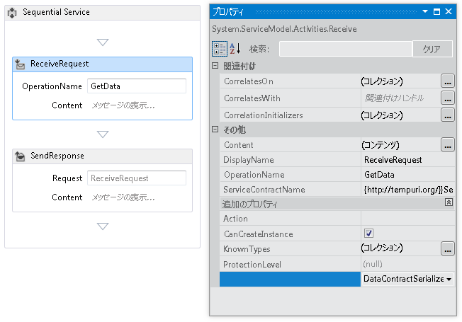
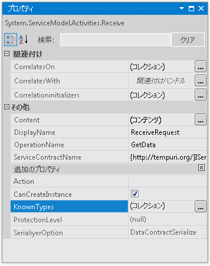

# <a name="configuring-serialization-in-a-workflow-service"></a><span data-ttu-id="308e3-102">ワークフロー サービス内でのシリアル化の構成</span><span class="sxs-lookup"><span data-stu-id="308e3-102">Configuring Serialization in a Workflow Service</span></span>
<span data-ttu-id="308e3-103">ワークフロー サービスは [!INCLUDE[indigo1](../../../../includes/indigo1-md.md)] サービスであるため、<xref:System.Runtime.Serialization.DataContractSerializer> (既定) または <xref:System.Xml.Serialization.XmlSerializer> を使用するオプションがあります。</span><span class="sxs-lookup"><span data-stu-id="308e3-103">Workflow services are [!INCLUDE[indigo1](../../../../includes/indigo1-md.md)] services and so have the option of using either the <xref:System.Runtime.Serialization.DataContractSerializer> (the default) or the <xref:System.Xml.Serialization.XmlSerializer>.</span></span> <span data-ttu-id="308e3-104">ワークフロー以外のサービスを記述する場合、使用するシリアライザーの型はサービスまたは操作コントラクトで指定されます。</span><span class="sxs-lookup"><span data-stu-id="308e3-104">When writing non-workflow services the type of serializer to use is specified on the service or operation contract.</span></span> <span data-ttu-id="308e3-105">[!INCLUDE[indigo2](../../../../includes/indigo2-md.md)] ワークフロー サービスを作成する場合、これらのコントラクトはコードで指定せずに、コントラクト推論で実行時に生成されます。</span><span class="sxs-lookup"><span data-stu-id="308e3-105">When creating [!INCLUDE[indigo2](../../../../includes/indigo2-md.md)] workflow services you don’t specify these contracts in code, but rather they are generated at runtime by contract inference.</span></span> <span data-ttu-id="308e3-106">コントラクト推論の詳細については、次を参照してください。[ワークフロー内のコントラクトの使用](../../../../docs/framework/wcf/feature-details/using-contracts-in-workflow.md)です。</span><span class="sxs-lookup"><span data-stu-id="308e3-106">For more information about contract inference, see  [Using Contracts in Workflow](../../../../docs/framework/wcf/feature-details/using-contracts-in-workflow.md).</span></span>  <span data-ttu-id="308e3-107">シリアライザーは、<xref:System.ServiceModel.Activities.Receive.SerializerOption%2A> プロパティを使用して指定されます。</span><span class="sxs-lookup"><span data-stu-id="308e3-107">The serializer is specified using the <xref:System.ServiceModel.Activities.Receive.SerializerOption%2A> property.</span></span> <span data-ttu-id="308e3-108">これは、次の図に示すようにデザイナーで設定できます。</span><span class="sxs-lookup"><span data-stu-id="308e3-108">This can be set in the designer as shown in the following illustration.</span></span>  
  
 <span data-ttu-id="308e3-109"></span><span class="sxs-lookup"><span data-stu-id="308e3-109"></span></span>  
  
 <span data-ttu-id="308e3-110">シリアライザーは、次の例に示すようにコードで設定することもできます。</span><span class="sxs-lookup"><span data-stu-id="308e3-110">The serializer can also be set in code as shown in the following example,</span></span>  
  
```  
Receive approveExpense = new Receive  
            {  
                OperationName = "ApproveExpense",  
                CanCreateInstance = true,  
                ServiceContractName = "FinanceService",  
                SerializerOption = SerializerOption.DataContractSerializer,  
                Content = ReceiveContent.Create(new OutArgument<Expense>(expense))  
            };  
```  
  
 <span data-ttu-id="308e3-111">ワークフロー サービスにも既知の型を指定できます。</span><span class="sxs-lookup"><span data-stu-id="308e3-111">Known types can be specified on Workflow services as well.</span></span> <span data-ttu-id="308e3-112">既知の型の詳細については、次を参照してください。[データ コントラクトの既知の型](../../../../docs/framework/wcf/feature-details/data-contract-known-types.md)です。</span><span class="sxs-lookup"><span data-stu-id="308e3-112">For more information about Known Types see [Data Contract Known Types](../../../../docs/framework/wcf/feature-details/data-contract-known-types.md).</span></span> <span data-ttu-id="308e3-113">既知の型は、デザイナーまたはコードで指定できます。</span><span class="sxs-lookup"><span data-stu-id="308e3-113">Known types can be specified in the designer or in code.</span></span> <span data-ttu-id="308e3-114">デザイナーで既知の型を指定するには、次の図に示すように <xref:System.ServiceModel.Activities.Receive> アクティビティのプロパティ ウィンドウで KnownTypes プロパティの横の省略記号ボタンをクリックします。</span><span class="sxs-lookup"><span data-stu-id="308e3-114">To specify known types in the designer, click the ellipsis button next to the KnownTypes property in the properties window for a <xref:System.ServiceModel.Activities.Receive> activity as shown in the following illustration.</span></span>  
  
 <span data-ttu-id="308e3-115"></span><span class="sxs-lookup"><span data-stu-id="308e3-115"></span></span>  
  
 <span data-ttu-id="308e3-116">これにより、既知の型を検索および指定できる型コレクション エディターが表示されます。</span><span class="sxs-lookup"><span data-stu-id="308e3-116">This will display the Type Collections Editor that will allow you to search for and specify known types.</span></span>  
  
 <span data-ttu-id="308e3-117"></span><span class="sxs-lookup"><span data-stu-id="308e3-117"></span></span>  
  
 <span data-ttu-id="308e3-118">クリックして、**新しいタイプの追加**リンクし、既知の型のコレクションに追加する型の選択や検索ドロップダウンを使用します。</span><span class="sxs-lookup"><span data-stu-id="308e3-118">Click the **Add new type** link and use the drop down to select or search for a type to add to the known types collection.</span></span> <span data-ttu-id="308e3-119">既知の型をコードで指定するには、次の例に示すように <xref:System.ServiceModel.Activities.Receive.KnownTypes%2A> プロパティを使用します。</span><span class="sxs-lookup"><span data-stu-id="308e3-119">To specify known types in code use the <xref:System.ServiceModel.Activities.Receive.KnownTypes%2A> property as shown in the following example.</span></span>  
  
```  
Receive approveExpense = new Receive  
            {  
                OperationName = "ApproveExpense",  
                CanCreateInstance = true,  
                ServiceContractName = "FinanceService",  
                SerializerOption = SerializerOption.DataContractSerializer,  
                Content = ReceiveContent.Create(new OutArgument<Expense>(expense))  
            };  
            approveExpense.KnownTypes.Add(typeof(Travel));  
            approveExpense.KnownTypes.Add(typeof(Meal));  
```  
  
 <span data-ttu-id="308e3-120">完全なコード例をワークフロー サービスのシリアル化を構成する方法を示すを参照してください「[ワークフロー サービス内メッセージを書式設定](../../../../docs/framework/windows-workflow-foundation/samples/formatting-messages-in-workflow-services.md)です。</span><span class="sxs-lookup"><span data-stu-id="308e3-120">To see a complete code example showing how to configure serialization for a workflow service see [Formatting messages in Workflow Services](../../../../docs/framework/windows-workflow-foundation/samples/formatting-messages-in-workflow-services.md).</span></span>
