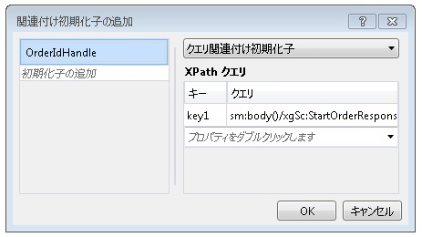

# コンテンツ ベースの相関関係。Content Based Correlation
ワークフロー サービスがクライアントや他のサービスと通信するときに、交換されるメッセージに、特定のインスタンスに一意に関連付けられたデータが含まれることがよくあります。When workflow services communicate with clients and other services, often there is some data in the exchanged messages that uniquely relates a message to a particular instance. コンテンツ ベースの相関関係では、顧客番号や注文 ID などのメッセージ内のデータを使用して、適切なワークフロー インスタンスにメッセージをルーティングします。Content-based correlation uses this data in the message, such as a customer number or order ID, to route messages to the proper workflow instance. このトピックでは、コンテンツ ベースの相関関係をワークフロー内で使用する方法について説明します。This topic explains how to use content-based correlation in workflows.  
  
## コンテンツ ベースの相関関係の使用Using Content-Based Correlation  
 コンテンツ ベースの相関関係は、単一のクライアントによってアクセスされる複数のメソッドがワークフロー サービスにあり、交換されるメッセージ内の一部のデータによって目的のインスタンスが識別される場合に使用されます。Content-based correlation is used when a workflow service has multiple methods that are accessed by a single client and a piece of data in the exchanged messages identifies the desired instance.  
  
> [!NOTE]
>  コンテンツ ベースの相関関係は、コンテキスト交換のバインドがサポート対象のものではないためにコンテキスト相関関係を使用できない場合に便利です。Content-based correlation is useful when context correlation cannot be used because the binding is not one of the supported context exchange bindings. コンテキスト相関関係の詳細については、次を参照してください。[コンテキスト交換](../../../../docs/framework/wcf/feature-details/context-exchange-correlation.md)です。For more information about context correlation, see [Context Exchange](../../../../docs/framework/wcf/feature-details/context-exchange-correlation.md).  
  
 これらの通信で使用される各メッセージ アクティビティでは、インスタンスを一意に識別するメッセージ内のデータの場所を指定する必要があります。Each messaging activity used in these communications must specify the location of the data in the message that uniquely identifies the instance. これを行うには、<xref:System.ServiceModel.MessageQuerySet> または <xref:System.ServiceModel.Activities.QueryCorrelationInitializer> を使用して <xref:System.ServiceModel.Activities.Receive.CorrelatesOn%2A> を指定し、インスタンスを一意に識別するデータを求めるクエリをメッセージに対して実行します。This is done by providing a <xref:System.ServiceModel.MessageQuerySet>, using either a <xref:System.ServiceModel.Activities.QueryCorrelationInitializer> or <xref:System.ServiceModel.Activities.Receive.CorrelatesOn%2A>, that queries the message for the piece or pieces of data that uniquely identify the instance.  
  
> [!WARNING]
>  インスタンスの識別に使用されるデータは、相関関係キーにハッシュされます。The data that is used to identify the instance is hashed into a correlation key. 相関関係による関連付けで使用するデータは必ず、一意にする必要があります。一意でない場合は、ハッシュされたキーで競合が発生し、誤った場所にメッセージがルーティングされる可能性があります。Care must be taken to ensure that the data used for correlation is unique or else collisions in the hashed key could occur and cause messages to be misrouted. たとえば、顧客名だけに基づいた関連付けでは、同じ名前の顧客が複数存在する場合があるため、競合が発生する可能性があります。For example, a correlation based solely on a customer name may cause a collision because there may be multiple customers with the same name. メッセージの関連付けに使用するデータの一部として、コロン (`:`) を使用することはできません。コロンは、メッセージ クエリのキーと値の区切り文字として既に使用されており、後でハッシュされる文字列に含まれるためです。The colon (`:`) should not be used as part of the data used to correlate the message because it is already used to delimit the message query’s key and value to form the string that is subsequently hashed.  
  
 次の例では、初期<xref:System.ServiceModel.Activities.Receive> / <xref:System.ServiceModel.Activities.SendReply>ワークフロー サービスで返されます、 `OrderId`、次の呼び出しに、クライアントから再び渡される<xref:System.ServiceModel.Activities.Receive>ワークフロー サービス内のアクティビティ。In the following example, the initial <xref:System.ServiceModel.Activities.Receive>/<xref:System.ServiceModel.Activities.SendReply> in a workflow service returns an `OrderId`, which is then passed back by the client on the call to the following <xref:System.ServiceModel.Activities.Receive> activity in the workflow service.  
  
 [!code-csharp[CFX_ContentCorrelation#1](../../../../samples/snippets/csharp/VS_Snippets_CFX/cfx_contentcorrelation/cs/program.cs#1)]  
  
 前の例は、<xref:System.ServiceModel.Activities.SendReply> によって初期化される、コンテンツ ベースの相関関係を示しています。The previous example shows a content-based correlation that is initialized by the <xref:System.ServiceModel.Activities.SendReply>. <xref:System.ServiceModel.MessageQuerySet> は、このサービスに送信される後続のメッセージを特定するために使用されるデータが `OrderId` であることを指定します。The <xref:System.ServiceModel.MessageQuerySet> specifies that the data used to identify subsequent messages to this service is the `OrderId`.  
  
 [!code-csharp[CFX_ContentCorrelation#2](../../../../samples/snippets/csharp/VS_Snippets_CFX/cfx_contentcorrelation/cs/program.cs#2)]  
  
 ワークフロー内で <xref:System.ServiceModel.Activities.Receive> に続く <xref:System.ServiceModel.Activities.SendReply> アクティビティは、<xref:System.ServiceModel.Activities.SendReply> によって初期化された関連付けに従います。The <xref:System.ServiceModel.Activities.Receive> activity that follows the <xref:System.ServiceModel.Activities.SendReply> in the workflow follows the correlation that was initialized by the <xref:System.ServiceModel.Activities.SendReply>. どちらのアクティビティも同じ <xref:System.ServiceModel.Activities.CorrelationHandle> を共有しますが、それぞれには、その特定のメッセージ内のどこに対象データがあるかを指定する独自の <xref:System.ServiceModel.MessageQuerySet> および <xref:System.ServiceModel.XPathMessageQuery> があります。Both activities share the same <xref:System.ServiceModel.Activities.CorrelationHandle>, but each one has its own <xref:System.ServiceModel.MessageQuerySet> and <xref:System.ServiceModel.XPathMessageQuery> that specifies where the identifying data is in that particular message. 関連付けを初期化するアクティビティでは、この <xref:System.ServiceModel.MessageQuerySet> が <xref:System.ServiceModel.Activities.Receive.CorrelationInitializers%2A> プロパティで指定され、後続のすべての <xref:System.ServiceModel.Activities.Receive> アクティビティについては、<xref:System.ServiceModel.Activities.Receive.CorrelatesOn%2A> プロパティを使用して指定されます。On the activity that initializes the correlation, this <xref:System.ServiceModel.MessageQuerySet> is specified in the <xref:System.ServiceModel.Activities.Receive.CorrelationInitializers%2A> property, and for any following <xref:System.ServiceModel.Activities.Receive> activities, it is specified using the <xref:System.ServiceModel.Activities.Receive.CorrelatesOn%2A> property.  
  
 [!code-csharp[CFX_ContentCorrelation#3](../../../../samples/snippets/csharp/VS_Snippets_CFX/cfx_contentcorrelation/cs/program.cs#3)]  
  
 コンテンツ ベースの相関関係は、すべてのメッセージ アクティビティ (<xref:System.ServiceModel.Activities.Send>、<xref:System.ServiceModel.Activities.Receive>、<xref:System.ServiceModel.Activities.SendReply>、<xref:System.ServiceModel.Activities.ReceiveReply>) によって、メッセージの一部としてデータが送信されるときに初期化できます。A content-based correlation can be initialized by any messaging activity (<xref:System.ServiceModel.Activities.Send>, <xref:System.ServiceModel.Activities.Receive>, <xref:System.ServiceModel.Activities.SendReply>, <xref:System.ServiceModel.Activities.ReceiveReply>) when the data flows as part of a message. 特定のデータがメッセージの一部として送信されない場合は、明示的に <xref:System.ServiceModel.Activities.InitializeCorrelation> アクティビティを使用することで初期化できます。If the particular piece of data does not flow as part of a message, then it can be initialized explicitly by using the <xref:System.ServiceModel.Activities.InitializeCorrelation> activity. データの複数の部分で一意にメッセージを識別する必要がある場合は、複数のクエリを <xref:System.ServiceModel.MessageQuerySet> に追加できます。If multiple pieces of data are required to uniquely identify the message, then multiple queries can be added to the <xref:System.ServiceModel.MessageQuerySet>. これらの例では、<xref:System.ServiceModel.Activities.CorrelationHandle> または `CorrelatesWith` プロパティを使用して、`CorrelationHandle` が各アクティビティに明示的に提供されていますが、すべてが `OrderId` で相関するこの例のように、ワークフロー全体で必要な関連付けが 1 つのみである場合は、<xref:System.ServiceModel.Activities.WorkflowServiceHost> で提供される、暗黙の関連付けハンドル管理で十分です。In these examples, a <xref:System.ServiceModel.Activities.CorrelationHandle> was explicitly provided to each of the activities using the `CorrelatesWith` or `CorrelationHandle` properties, but if there is only one correlation required for the entire workflow, such as in this example where everything correlates on `OrderId`, the implicit correlation handle management provided by <xref:System.ServiceModel.Activities.WorkflowServiceHost> is sufficient.  
  
## InitializeCorrelation アクティビティの使用Using the InitializeCorrelation Activity  
 前の例では、`OrderId` アクティビティを通じて、<xref:System.ServiceModel.Activities.SendReply> が呼び出し元に送信され、このアクティビティで関連付けが初期化されました。In the previous example, the `OrderId` flowed to the caller through the <xref:System.ServiceModel.Activities.SendReply> activity and this is where the correlation was initialized. 同じ動作を、<xref:System.ServiceModel.Activities.InitializeCorrelation> アクティビティを使用して実現することもできます。The same behavior can be accomplished by using the <xref:System.ServiceModel.Activities.InitializeCorrelation> activity. <xref:System.ServiceModel.Activities.InitializeCorrelation> アクティビティは、<xref:System.ServiceModel.Activities.CorrelationHandle> と、メッセージを適切なインスタンスに割り当てるために使用する項目を表す辞書を受け取ります。The <xref:System.ServiceModel.Activities.InitializeCorrelation> activity takes the <xref:System.ServiceModel.Activities.CorrelationHandle> and a dictionary of items that represent the data used to map the message to the correct instance. <xref:System.ServiceModel.Activities.InitializeCorrelation> アクティビティを前のサンプルで使用するには、<xref:System.ServiceModel.Activities.SendReply.CorrelationInitializers%2A> アクティビティから <xref:System.ServiceModel.Activities.SendReply> を削除し、<xref:System.ServiceModel.Activities.InitializeCorrelation> アクティビティを使用して、関連付けを初期化します。To use the <xref:System.ServiceModel.Activities.InitializeCorrelation> activity in the preceding sample, remove the <xref:System.ServiceModel.Activities.SendReply.CorrelationInitializers%2A> from the <xref:System.ServiceModel.Activities.SendReply> activity and initialize the correlation using the <xref:System.ServiceModel.Activities.InitializeCorrelation> activity.  
  
 [!code-csharp[CFX_ContentCorrelation#4](../../../../samples/snippets/csharp/VS_Snippets_CFX/cfx_contentcorrelation/cs/program.cs#4)]  
  
 その後、<xref:System.ServiceModel.Activities.InitializeCorrelation> アクティビティは、データを保持する変数が挿入された後、かつ、初期化された <xref:System.ServiceModel.Activities.Receive> との関連付けを行う <xref:System.ServiceModel.Activities.CorrelationHandle> アクティビティの前にワークフローで使用されます。The <xref:System.ServiceModel.Activities.InitializeCorrelation> activity is then used in the workflow, after the variables that hold the data are populated but before the <xref:System.ServiceModel.Activities.Receive> activity that correlates with the initialized <xref:System.ServiceModel.Activities.CorrelationHandle>.  
  
 [!code-csharp[CFX_ContentCorrelation#5](../../../../samples/snippets/csharp/VS_Snippets_CFX/cfx_contentcorrelation/cs/program.cs#5)]  
  
## ワークフロー デザイナーを使用した XPath クエリの構成Configuring XPath Queries Using the Workflow Designer  
 前の例では、メッセージ クエリで使用されているアクティビティおよび XPath クエリがコードで指定されています。In the previous examples, the activities and the XPath queries used in the message queries were specified in code. [!INCLUDE[vs_current_long](../../../../includes/vs-current-long-md.md)] のワークフロー デザイナーでは、XPath の生成を、コンテンツ ベースの相関関係の `DataContract` 型から行うための機能も提供されています。The workflow designer in [!INCLUDE[vs_current_long](../../../../includes/vs-current-long-md.md)] also provides the ability to generate XPaths from `DataContract` types for content-based correlation. 前の例に示した 1 つ目の XPath 構成は、<xref:System.ServiceModel.Activities.SendReply> 用に構成されていました。The first XPath configured in the previous example was configured for the <xref:System.ServiceModel.Activities.SendReply>.  
  
 [!code-csharp[CFX_ContentCorrelation#2](../../../../samples/snippets/csharp/VS_Snippets_CFX/cfx_contentcorrelation/cs/program.cs#2)]  
  
 XPath をワークフロー デザイナーでメッセージ アクティビティ用に構成するには、ワークフロー デザイナーでアクティビティを選択します。To configure the XPath for a messaging activity in the workflow designer, select the activity in the workflow designer. アクティビティが前の例のように、相関関係を初期化中の場合は、省略記号ボタンをクリックして、 **CorrelationInitializers**プロパティに、**プロパティ**ウィンドウです。If the activity is initializing the correlation, as in the previous example, click the ellipsis button for the **CorrelationInitializers** property in the **Properties** window. これが表示されます、 **関連付け初期化子**ダイアログ ウィンドウです。This displays the **Add Correlation Initializers** dialog window. このダイアログ ボックスで、関連付けの種類を指定し、関連付けに使用する内容を選択できます。From this dialog you can specify the correlation type and select the content that is used for the correlation. <xref:System.ServiceModel.Activities.CorrelationHandle>で変数が指定された、**初期化子の追加**からボックス、および関連付けの種類と、関連付けに使用されるデータが選択されている、 **XPath クエリ** ダイアログ ボックスのセクションでします。The <xref:System.ServiceModel.Activities.CorrelationHandle> variable is specified in the **Add initializer** box, and the correlation type and data used for the correlation is selected from the **XPath Queries** section of the dialog box.  
  
   
  
 前の例に示した 2 つ目の XPath クエリは、<xref:System.ServiceModel.Activities.Receive> アクティビティで構成されました。The second XPath query in the previous example was configured in the <xref:System.ServiceModel.Activities.Receive> activity.  
  
 [!code-csharp[CFX_ContentCorrelation#3](../../../../samples/snippets/csharp/VS_Snippets_CFX/cfx_contentcorrelation/cs/program.cs#3)]  
  
 初期化を行わない、関連付けメッセージ アクティビティ用の XPath クエリを構成するのに、ワークフロー デザイナーでアクティビティを選択し、省略記号ボタンをクリックして、 **CorrelatesOn**プロパティに、 **プロパティ**ウィンドウです。To configure the XPath query for a messaging activity that does not initialize the correlation, select the activity in the workflow designer and then click the ellipsis button for the **CorrelatesOn** property in the **Properties** window. これが表示されます、 **CorrelatesOn の定義**ダイアログ ウィンドウです。This displays the **CorrelatesOn Definition** dialog window.  
  
   
  
 指定するこのダイアログ ボックスで、<xref:System.ServiceModel.Activities.CorrelationHandle>内の項目を選択し、 **XPath クエリ**XPath クエリを構築する ボックスの一覧です。From this dialog you specify the <xref:System.ServiceModel.Activities.CorrelationHandle> and choose items in the **XPath Queries** list to build the XPath query.
