# <a name="creating-a-long-running-workflow-service"></a>長時間のワークフロー サービスの作成
ここでは、実行時間の長いワークフロー サービスを作成する方法について説明します。 実行時間の長いワークフロー サービスは、長期間にわたって実行できます。 ワークフローでは、いくつかの追加情報を待つ間アイドル状態になることがあります。 アイドル状態になると、ワークフローは SQL データベースに永続化され、メモリから削除されます。 追加情報が使用可能になると、ワークフロー インスタンスがメモリに読み込み直されて、実行を継続します。  このシナリオでは、非常に簡略化された注文システムを実装します。  クライアントは、最初のメッセージをワークフロー サービスに送信して注文を開始します。 ワークフロー サービスは、注文 ID をクライアントに返します。 この時点で、ワークフロー サービスは、クライアントからの別のメッセージを待機しており、アイドル状態に入って、SQL Server データベースに永続化されます。  クライアントが次のメッセージを送信して項目を注文すると、ワークフロー サービスはメモリに読み込み直されて、注文の処理を終了します。 次のコード例では、項目が注文に追加されたことを示す文字列を返します。 このコード例は、テクノロジの実際の適用を意図するものではなく、実行時間の長いワークフロー サービスを示す簡単な例です。 このトピックでは、[!INCLUDE[vs_current_long](../../../../includes/vs-current-long-md.md)] のプロジェクトおよびソリューションの作成方法を理解していることを前提としています。  
  
## <a name="prerequisites"></a>必須コンポーネント  
 このチュートリアルを使用するには、次のソフトウェアがインストールされている必要があります。  
  
1.  Microsoft SQL Server 2008  
  
2.  [!INCLUDE[vs_current_long](../../../../includes/vs-current-long-md.md)]  
  
3.  Microsoft [!INCLUDE[netfx_current_long](../../../../includes/netfx-current-long-md.md)]  
  
4.  ユーザーは WCF および [!INCLUDE[vs_current_long](../../../../includes/vs-current-long-md.md)] に精通しており、プロジェクトおよびソリューションの作成方法を理解している必要があります。  
  
### <a name="to-setup-the-sql-database"></a>SQL データベースを設定するには  
  
1.  ワークフロー サービス インスタンスが永続化されるようにするには、Microsoft SQL Server をインストールして、永続化ワークフロー インスタンスを保存するようにデータベースを設定する必要があります。 クリックして Microsoft SQL Management Studio を実行、**開始**ボタンをクリックし**すべてのプログラム**、 **Microsoft SQL Server 2008**、および**』Management Studio**です。  
  
2.  クリックして、**接続**SQL Server インスタンスにログオンするボタンをクリックします。  
  
3.  右クリックして**データベース**クリックし、ツリー ビューで**新しいデータベース.** という名前の新しいデータベースを作成する`SQLPersistenceStore`です。  
  
4.  SQLPersistenceStore データベースの C:\Windows\Microsoft.NET\Framework\v4.0\SQL\en ディレクトリにある SqlWorkflowInstanceStoreSchema.sql スクリプト ファイルを実行して、必要なデータベース スキーマを設定します。  
  
5.  SQLPersistenceStore データベースの C:\Windows\Microsoft.NET\Framework\v4.0\SQL\en ディレクトリにある SqlWorkflowInstanceStoreLogic.sql スクリプト ファイルを実行して、必要なデータベース ロジックを設定します。  
  
### <a name="to-create-the-web-hosted-workflow-service"></a>Web ホスト ワークフロー サービスを作成するには  
  
1.  空の [!INCLUDE[vs_current_long](../../../../includes/vs-current-long-md.md)] ソリューションを作成し、`OrderProcessing` という名前を付けます。  
  
2.  [!INCLUDE[indigo2](../../../../includes/indigo2-md.md)] という新しい `OrderService` ワークフロー サービス アプリケーション プロジェクトをソリューションに追加します。  
  
3.  プロジェクトのプロパティ ダイアログ ボックスで、 **Web**タブです。  
  
    1.  下にある**開始動作**選択**特定のページ**指定と`Service1.xamlx`です。  
  
         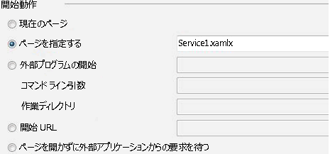  
  
    2.  **サーバー**選択**を使用してローカル IIS Web サーバー**です。  
  
         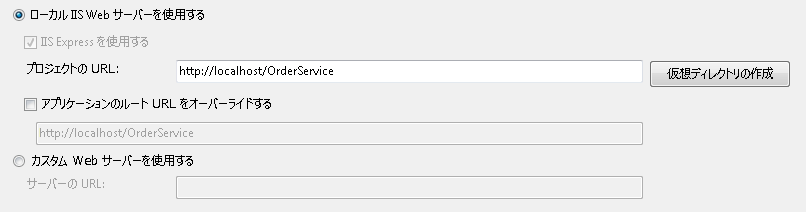  
  
        > [!WARNING]
        >  この設定を行うには、[!INCLUDE[vs_current_long](../../../../includes/vs-current-long-md.md)] を管理者モードで実行する必要があります。  
  
         次の 2 つの手順で、ワークフロー サービス プロジェクトが IIS でホストされるように設定します。  
  
4.  開く`Service1.xamlx`いない既にを開き、既存の削除である場合**ReceiveRequest**と**SendResponse**アクティビティ。  
  
5.  選択、**シーケンシャル サービス**アクティビティをクリック、**変数**リンクし、次の図に示すように変数を追加します。 こうするといくつかの変数が追加され、後でワークフロー サービスで使用されます。  
  
    > [!NOTE]
    >  CorrelationHandle が変数の型のドロップダウン リストにない場合は、選択**型の参照**ドロップダウン リストからです。 CorrelationHandle を入力、**型名**ボックス、リスト ボックスから CorrelationHandle を選択し、をクリックして**OK**です。  
  
     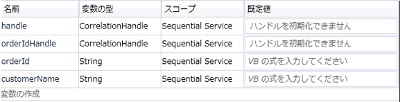  
  
6.  ドラッグ アンド ドロップ、 **ReceiveAndSendReply**アクティビティ テンプレートを**シーケンシャル サービス**アクティビティ。 このアクティビティのセットは、クライアントからメッセージを受信して、返信を送信します。  
  
    1.  選択、**受信**アクティビティとセットのプロパティは、次の図で強調表示されます。  
  
         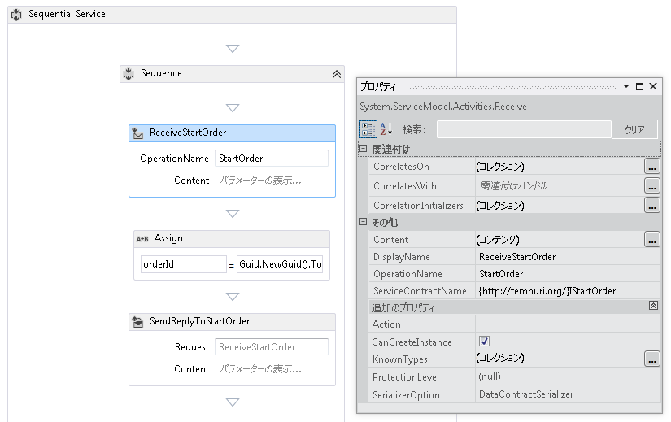  
  
         DisplayName プロパティは、デザイナーに表示される Receive アクティビティの名前を設定します。 ServiceContractName プロパティと OperationName プロパティは、Receive アクティビティで実装されるサービス コントラクトおよび操作の名前を指定します。 ワークフロー サービスでのコントラクトの使用方法の詳細については、次を参照してください。[ワークフロー内のコントラクトの使用](../../../../docs/framework/wcf/feature-details/using-contracts-in-workflow.md)です。  
  
    2.  クリックして、**を定義しています.** 内のリンク、 **ReceiveStartOrder**アクティビティし、次の図に示すようにプロパティを設定します。  注意して、**パラメーター**ラジオ ボタンが選択されている、という名前のパラメーター`p_customerName`にバインドされて、`customerName`変数。 これにより、構成、**受信**アクティビティをいくつかのデータを受け取り、そのデータをローカル変数にバインドします。  
  
         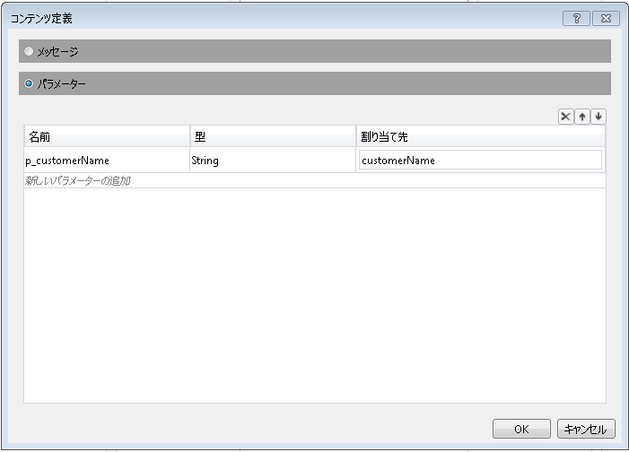  
  
    3.  選択、 **SendReplyToReceive**アクティビティと次の図で強調表示されているプロパティを設定します。  
  
         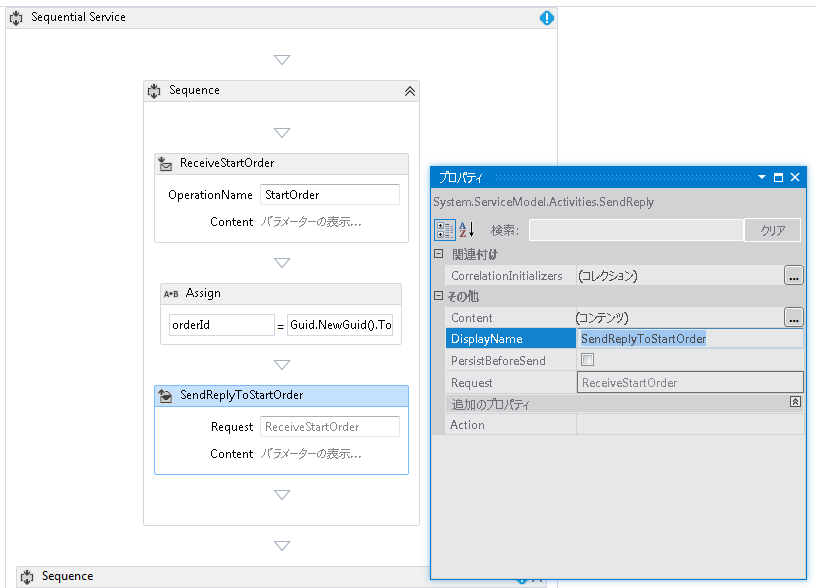  
  
    4.  クリックして、**を定義しています.** 内のリンク、 **SendReplyToStartOrder**アクティビティし、次の図に示すようにプロパティを設定します。 注意して、**パラメーター**ラジオ ボタンが選択されている以外の場合は、パラメーターと呼ばれる`p_orderId`にバインドされて、`orderId`変数。 この設定により、SendReplyToStartOrder アクティビティが型文字列の値を呼び出し元に返すように指定されます。  
  
         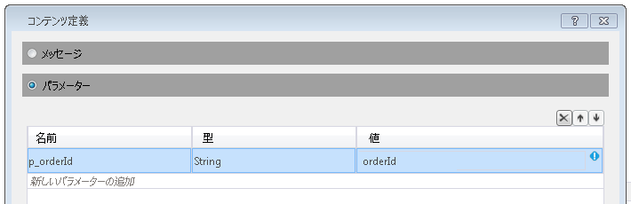  
  
    5.  ドラッグして、Assign アクティビティの間にドロップ、**受信**と**SendReply**アクティビティし、次の図に示すようにプロパティを設定します。  
  
         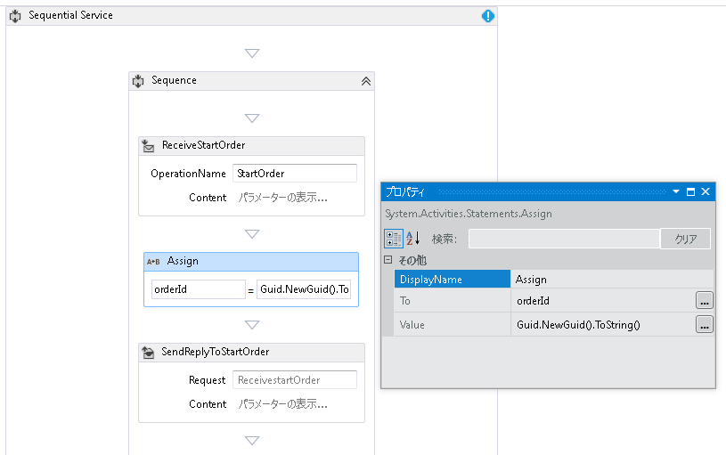  
  
         これにより、新しい注文 ID が作成され、orderId 変数に値が配置されます。  
  
    6.  選択、 **ReplyToStartOrder**アクティビティ。 プロパティ ウィンドウで省略記号ボタンをクリックして**CorrelationInitializers**です。 選択、**初期化子の追加**リンクで、入力`orderIdHandle`初期化子のテキスト ボックスで、関連付けの種類のクエリ関連付け初期化子を選択し、XPATH クエリ ボックスの p_orderId を選択します。 これらの設定を次の図に示します。 **[OK]** をクリックします。  これにより、クライアントとワークフロー サービスのこのインスタンス間の相関関係が初期化されます。 この注文 ID を含むメッセージが受信されると、ワークフロー サービスのこのインスタンスにルーティングされます。  
  
         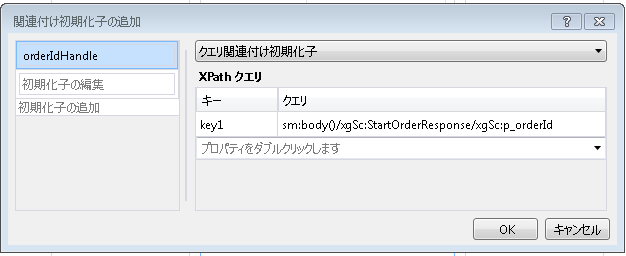  
  
7.  ドラッグ アンド ドロップ別**ReceiveAndSendReply**ワークフローの末尾にアクティビティ (外、**シーケンス**最初を含む**受信**と**SendReply**アクティビティ)。 これで、クライアントで送信された 2 つ目のメッセージを受信し、それに応答します。  
  
    1.  選択、**シーケンス**を含む、新しく追加した**受信**と**SendReply**活動をクリック、**変数**ボタンをクリックします。 次の図で強調表示されている変数を追加します。  
  
         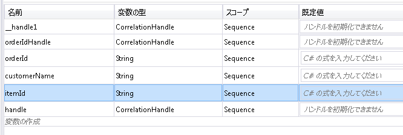  
  
    2.  選択、**受信**アクティビティし、次の図に示すようにプロパティを設定します。  
  
         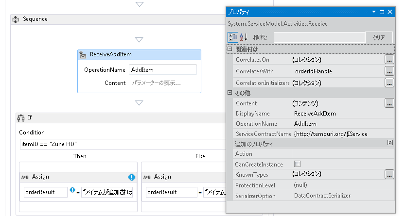  
  
    3.  クリックして、**を定義しています.** 内のリンク、 **ReceiveAddItem**アクティビティし、次の図に示すようにパラメーターを追加します。 これにより、receive アクティビティを、注文 ID、および注文されている項目の ID の 2 つのパラメーターを受け入れるように、構成します。  
  
         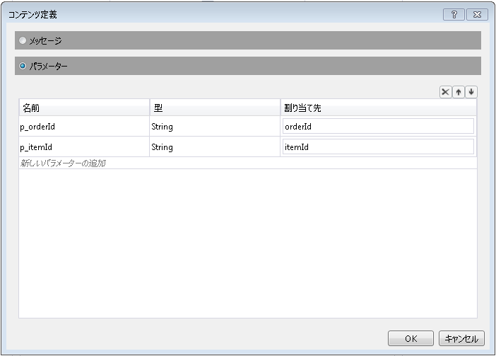  
  
    4.  クリックして、 **CorrelateOn**省略記号ボタンをクリックし、入力`orderIdHandle`です。 **XPath クエリ**ドロップダウン矢印をクリックし、選択`p_orderId`です。 これにより、2 つ目の Receive アクティビティに相関関係が設定されます。 相関関係の詳細については、次を参照してください。[相関](../../../../docs/framework/wcf/feature-details/correlation.md)です。  
  
         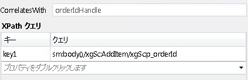  
  
    5.  ドラッグ アンド ドロップ、**場合**アクティビティの直後に、 **ReceiveAddItem**アクティビティ。 このアクティビティは、if ステートメントと同様に動作します。  
  
        1.  設定、**条件**プロパティ `itemId=="Zune HD" (itemId="Zune HD" for Visual Basic)`  
  
        2.  ドラッグ アンド ドロップ、**割り当てる**アクティビティを**し**セクションと、 **Else**セクションのプロパティを設定する、**割り当てる**次の図に示すように処理します。  
  
             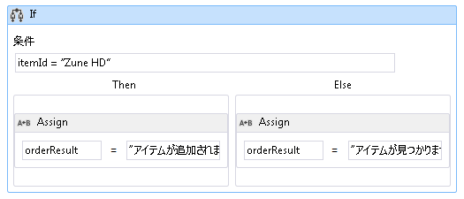  
  
             条件が場合`true`、**し**セクションが実行されます。 条件が場合`false`、 **Else**セクションが実行されます。  
  
        3.  選択、 **SendReplyToReceive**アクティビティとセット、 **DisplayName**プロパティは、次の図に示すようにします。  
  
             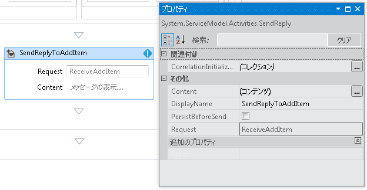  
  
        4.  クリックして、**を定義しています.** 内のリンク、 **SetReplyToAddItem**アクティビティし、次の図に示すように構成します。 これにより、構成、 **SendReplyToAddItem**で値を返すアクティビティ、`orderResult`変数。  
  
             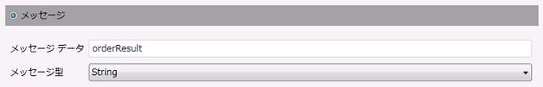  
  
8.  Web.config ファイルを開き、次の要素を追加、\<動作 > セクションをワークフローの永続化を有効にします。  
  
    ```xml  
    <sqlWorkflowInstanceStore connectionString="Data Source=your-machine\SQLExpress;Initial Catalog=SQLPersistenceStore;Integrated Security=True;Asynchronous Processing=True" instanceEncodingOption="None" instanceCompletionAction="DeleteAll" instanceLockedExceptionAction="BasicRetry" hostLockRenewalPeriod="00:00:30" runnableInstancesDetectionPeriod="00:00:02" />  
              <workflowIdle timeToUnload="0"/>  
    ```  
  
    > [!WARNING]
    >  前のコード スニペットでホストと SQL Server インスタンス名を置換するようにします。  
  
9. ソリューションをビルドします。  
  
### <a name="to-create-a-client-application-to-call-the-workflow-service"></a>クライアント アプリケーションを作成してワークフロー サービスを呼び出すには  
  
1.  `OrderClient` という新しいコンソール アプリケーション プロジェクトをソリューションに追加します。  
  
2.  次のアセンブリへの参照を `OrderClient` プロジェクトに追加します。  
  
    1.  System.ServiceModel.dll  
  
    2.  System.ServiceModel.Activities.dll  
  
3.  サービス参照をワークフロー サービスに追加し、`OrderService` を名前空間として指定します。  
  
4.  クライアント プロジェクトの `Main()` メソッド内に次のコードを追加します。  
  
    ```  
    static void Main(string[] args)  
    {  
       // Send initial message to start the workflow service  
       Console.WriteLine("Sending start message");  
       StartOrderClient startProxy = new StartOrderClient();  
       string orderId = startProxy.StartOrder("Kim Abercrombie");  
  
       // The workflow service is now waiting for the second message to be sent  
       Console.WriteLine("Workflow service is idle...");  
       Console.WriteLine("Press [ENTER] to send an add item message to reactivate the workflow service...");  
       Console.ReadLine();  
  
       // Send the second message  
       Console.WriteLine("Sending add item message");  
       AddItemClient addProxy = new AddItemClient();  
       AddItem item = new AddItem();  
       item.p_itemId = "Zune HD";  
       item.p_orderId = orderId;  
  
       string orderResult = addProxy.AddItem(item);  
       Console.WriteLine("Service returned: " + orderResult);  
    }  
    ```  
  
5.  ソリューションをビルドし、`OrderClient` アプリケーションを実行します。 クライアントに次のテキストが表示されます。  
  
    ```Output  
    Sending start messageWorkflow service is idle...Press [ENTER] to send an add item message to reactivate the workflow service...  
    ```  
  
6.  ワークフロー サービスが保持されていることを確認するに移動して、SQL Server Management Studio を開始、**開始** メニューを選択すると**すべてのプログラム**、 **Microsoft SQL Server 2008**、 **SQL Server Management Studio**です。  
  
    1.  左側のウィンドウで次のように展開して、**データベース**、 **SQLPersistenceStore**、**ビュー**を右クリックし、 **System.Activities.DurableInstancing.Instances**選択**上位 1000 行**です。 **結果**ウィンドウが表示されている、少なくとも 1 つのインスタンスを参照してくださいことを確認します。 実行中に例外が発生した場合は、前の実行のその他のインスタンスがある可能性があります。 右クリックして既存の行を削除することができます**System.Activities.DurableInstancing.Instances**を選択して**編集上位 200 行**、キーを押して、 **Execute**  ボタン結果ウィンドウで、すべての行を選択し、選択**削除**です。  データベースに表示されているインスタンスが、アプリケーションで作成されたインスタンスであることを確認するには、クライアントを実行する前に、Instances ビューが空であることを確認します。 クライアントが実行されると、クエリ ([上位 1000 行を選択]) を再実行し、新しいインスタンスが追加されていることを確認します。  
  
7.  Enter キーを押して、項目の追加メッセージをワークフロー サービスに送信します。 クライアントに次のテキストが表示されます。  
  
    ```Output  
    Sending add item messageService returned: Item added to orderPress any key to continue . . .  
    ```  
  
## <a name="see-also"></a>関連項目  
 [ワークフロー サービス](../../../../docs/framework/wcf/feature-details/workflow-services.md)
