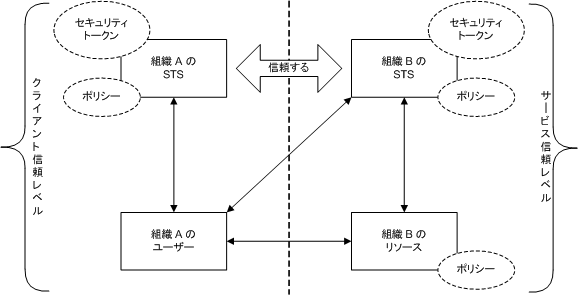
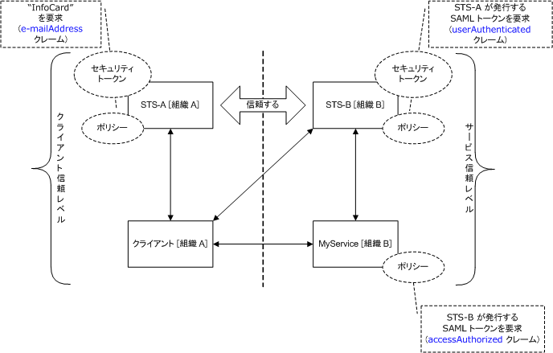
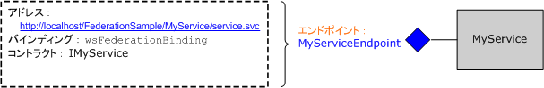
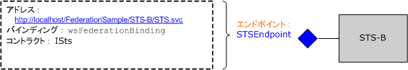
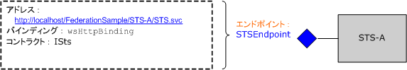
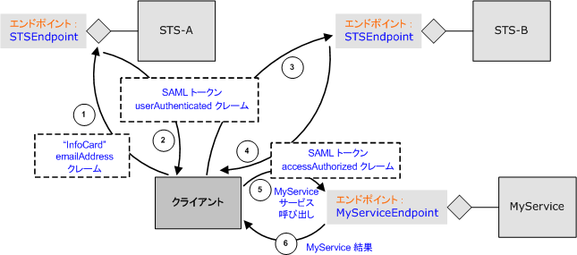

# フェデレーション
ここでは、フェデレーション セキュリティの概念について簡単に説明します。また、フェデレーション セキュリティ アーキテクチャを展開する際の [!INCLUDE[indigo1](../../../../includes/indigo1-md.md)] のサポートについても説明します。フェデレーションのサンプル アプリケーションについては、「[フェデレーション サンプル](../../../../docs/framework/wcf/samples/federation-sample.md)」を参照してください。  
  
## フェデレーション セキュリティの定義  
 フェデレーション セキュリティにより、クライアントがアクセスするサービスと、関連する認証および承認の手順を明確に分離できます。また、フェデレーション セキュリティを使用すると、異なる信頼レルムに属する複数のシステム、ネットワーク、および組織間のコラボレーションが可能になります。  
  
 [!INCLUDE[indigo2](../../../../includes/indigo2-md.md)] は、フェデレーション セキュリティを使用する分散システムの構築と展開をサポートします。  
  
### フェデレーション セキュリティ アーキテクチャの要素  
 次の表に示すように、フェデレーション セキュリティ アーキテクチャには 3 つの主要な要素があります。  
  
|要素|説明|  
|--------|--------|  
|ドメイン\/レルム|セキュリティ管理または信頼の単位。ドメインには通常、1 つの組織が含まれます。|  
|フェデレーション|信頼が確立されたドメインのコレクション。信頼のレベルはさまざまですが、通常は認証レベルが含まれ、ほとんどの場合に承認レベルが含まれます。典型的なフェデレーションには、一連のリソースへの共有アクセスを可能にする信頼を確立した多くの組織が含まれます。|  
|STS \(セキュリティ トークン サービス\)|セキュリティ トークンを発行する Web サービス。つまり、信頼できる証拠に基づいて、サービスを信頼する任意の相手に対してアサーションを行います。これによりドメイン間における信頼の橋渡しの基礎が形成されます。|  
  
### サンプル シナリオ  
 フェデレーション セキュリティの例を次の図に示します。  
  
   
  
 このシナリオでは、A と B の 2 つの組織があります。組織 B には、組織 A の一部のユーザーにとって有用な Web リソース \(Web サービス\) があります。  
  
> [!NOTE]
>  このセクションでは、*"リソース"*、*"サービス"*、および *"Web サービス"* を相互に置き換え可能な用語として使用します。  
  
 通常、組織 B は、組織 A のユーザーに対して、サービスにアクセスする前になんらかの有効な形式の認証を行うことを要求します。さらに、組織 B では、当該の特定リソースにアクセスするためにユーザーが承認されることを要求する場合もあります。この問題に対処し、組織 A のユーザーが組織 B のリソースにアクセスできるようにする 1 つの方法として、次のような方法があります。  
  
-   組織 A のユーザーは、各自の資格情報 \(ユーザー名とパスワード\) を組織 B に登録します。  
  
-   組織 A のユーザーがリソースにアクセスするには、リソースにアクセスする前に自分の資格情報を組織 B に提示して認証を受けます。  
  
 この方法には、次の 3 つの重大な欠点があります。  
  
-   組織 B では、ローカル ユーザーの資格情報の管理に加えて、組織 A のユーザーの資格情報の管理も必要になります。  
  
-   組織 A のユーザーは、組織 A 内のリソースにアクセスするために通常使用する資格情報以外に、別の資格情報セットを保持する \(つまり、別のユーザー名とパスワードを覚えておく\) 必要があります。通常、これは、複数のサービス サイトで同じユーザー名とパスワードが使用される可能性を高めるため、脆弱なセキュリティ対策と言えます。  
  
-   組織 B にあるリソースの価値を認識する組織の数が増えても、アーキテクチャを拡張できません。  
  
 上記の欠点に対処する別の方法として、フェデレーション セキュリティの使用があります。この方法では、組織 A と組織 B が信頼関係を確立し、セキュリティ トークン サービス \(STS: Security Token Service\) を使用して、確立された信頼を仲介できるようにします。  
  
 フェデレーション セキュリティ アーキテクチャでは、組織 A のユーザーが、組織 B の Web サービスにアクセスする場合に、組織 B の STS から発行された有効なセキュリティ トークンを提示する必要があることを認識しています。この STS が、特定のサービスへのアクセスを認証および承認します。  
  
 STS B に接続したユーザーは、STS に関連付けられたポリシーから別のレベルの間接指定を受け取ります。このユーザーは、STS B がセキュリティ トークンを発行する前に、STS A \(クライアントの信頼レルム\) の有効なセキュリティ トークンを提示しておく必要があります。これは、2 つの組織間で確立された信頼関係から生じた結果であり、組織 B には組織 A のユーザーの ID を管理する必要がないことを意味します。実際には、STS B の `issuerAddress` と `issuerMetadataAddress` は、通常 null になります。[!INCLUDE[crdefault](../../../../includes/crdefault-md.md)][方法 : ローカル発行者を設定する](../../../../docs/framework/wcf/feature-details/how-to-configure-a-local-issuer.md).この場合、クライアントは STS A を見つけるためにローカル ポリシーを調べます。この構成は、*"ホーム レルム フェデレーション"* と呼ばれ、STS B は STS A に関する情報を管理する必要がないため、拡張性が高まります。  
  
 ユーザーは、組織 A の STS に接続し、組織 A 内の他のリソースにアクセスする際に通常使用する認証資格情報を提示して、セキュリティ トークンを取得します。これにより、ユーザーが複数の資格情報セットを保持する必要があるという問題や、複数のサービス サイトで同じ資格情報セットを使用するという問題が、ある程度解決されます。  
  
 STS A からセキュリティ トークンを取得したユーザーは、このトークンを STS B に提示します。組織 B はユーザーの要求の承認手順を進め、独自のセキュリティ トークン セットからユーザーにセキュリティ トークンを発行します。ユーザーは、このトークンを組織 B のリソースに提示し、サービスにアクセスします。  
  
## WCF におけるフェデレーション セキュリティのサポート  
 [!INCLUDE[indigo2](../../../../includes/indigo2-md.md)] は、[\<wsFederationHttpBinding\>](../../../../docs/framework/configure-apps/file-schema/wcf/wsfederationhttpbinding.md)を使用して、フェデレーション セキュリティ アーキテクチャの展開を設定不要でサポートします。  
  
 [\<wsFederationHttpBinding\>](../../../../docs/framework/configure-apps/file-schema/wcf/wsfederationhttpbinding.md)は、安全で信頼性が高く相互運用可能なバインディングを提供します。このバインディングでは、要求\/応答形式の通信を実現するための基盤となるトランスポート機構として HTTP を使用する必要があり、エンコーディングのワイヤ形式としてテキストと XML を使用します。  
  
 フェデレーション セキュリティ シナリオで [\<wsFederationHttpBinding\>](../../../../docs/framework/configure-apps/file-schema/wcf/wsfederationhttpbinding.md)を使用する場合、次のセクションで説明するように、論理的に独立した 2 つのフェーズに分けることができます。  
  
### 第 1 フェーズ : 設計  
 設計フェーズでは、クライアントは [ServiceModel メタデータ ユーティリティ ツール \(Svcutil.exe\)](../../../../docs/framework/wcf/servicemodel-metadata-utility-tool-svcutil-exe.md) を使用してサービス エンドポイントが公開するポリシーを読み取り、サービスの認証と承認の要件を収集します。次のフェデレーション セキュリティの通信パターンをクライアントで作成するために、適切なプロキシが構築されます。  
  
-   クライアント信頼レルムにある STS からセキュリティ トークンを取得する。  
  
-   サービス信頼レルムにある STS にトークンを提示する。  
  
-   サービス信頼レルムにある STS からセキュリティ トークンを取得する。  
  
-   サービスにトークンを提示してサービスにアクセスする。  
  
### 第 2 フェーズ : 実行時  
 実行時フェーズでは、クライアントは [!INCLUDE[indigo2](../../../../includes/indigo2-md.md)] クライアント クラスのオブジェクトをインスタンス化し、この [!INCLUDE[indigo2](../../../../includes/indigo2-md.md)] クライアントを使用して呼び出しを行います。[!INCLUDE[indigo2](../../../../includes/indigo2-md.md)] の基盤となるフレームワークにより、フェデレーション セキュリティの通信パターンにおける前述の手順が処理され、クライアントがシームレスにサービスを利用できるようにします。  
  
## WCF を使用した実装のサンプル  
 [!INCLUDE[indigo2](../../../../includes/indigo2-md.md)] のネイティブ サポートを使用したフェデレーション セキュリティ アーキテクチャの実装サンプルを次の図に示します。  
  
   
  
### MyService の例  
 `MyService` サービスは、`MyServiceEndpoint` を介して単一のエンドポイントを公開します。このエンドポイントに関連付けられたアドレス、バインディング、およびコントラクトを次の図に示します。  
  
   
  
 サービス エンドポイント `MyServiceEndpoint` は、[\<wsFederationHttpBinding\>](../../../../docs/framework/configure-apps/file-schema/wcf/wsfederationhttpbinding.md) を使用し、STS B によって発行された `accessAuthorized` クレームを含む有効な SAML \(Security Assertions Markup Language\) トークンを要求します。これは、サービス構成で宣言によって指定されます。  
  
```  
<system.serviceModel>  
  <services>  
    <service type="FederationSample.MyService"      
        behaviorConfiguration='MyServiceBehavior'>  
        <endpoint address=""  
            binding=" wsFederationHttpBinding"  
            bindingConfiguration='MyServiceBinding'  
            contract="Federation.IMyService" />  
   </service>  
  </services>  
  
  <bindings>  
    <wsFederationHttpBinding>  
    <!-- This is the binding used by MyService. It redirects   
    clients to STS-B. -->  
      <binding name='MyServiceBinding'>  
        <security mode="Message">  
           <message issuedTokenType=  
"http://docs.oasis-open.org/wss/oasis-wss-saml-token-profile-1.1#SAMLV1.1">  
           <issuer address="http://localhost/FederationSample/STS-B/STS.svc" />  
            <issuerMetadata   
           address=  
"http://localhost/FederationSample/STS-B/STS.svc/mex" />  
         <requiredClaimTypes>  
            <add claimType="http://tempuri.org:accessAuthorized" />  
         </requiredClaimTypes>  
        </message>  
      </security>  
      </binding>  
    </wsFederationHttpBinding>  
  </bindings>  
  
  <behaviors>  
    <behavior name='MyServiceBehavior'>  
      <serviceAuthorization   
operationRequirementType="FederationSample.MyServiceOperationRequirement, MyService" />  
       <serviceCredentials>  
         <serviceCertificate findValue="CN=FederationSample.com"  
         x509FindType="FindBySubjectDistinguishedName"  
         storeLocation='LocalMachine'  
         storeName='My' />  
      </serviceCredentials>  
    </behavior>  
  </behaviors>  
</system.serviceModel>  
```  
  
> [!NOTE]
>  `MyService` が要求するクレームについては、細かい点に注意が必要です。2 番目の図は、`MyService` が `accessAuthorized` クレームを含む SAML トークンを要求していることを示しています。より正確には、これで、`MyService` が必要とするクレームの種類が指定されます。このクレームの種類の完全修飾名は http:\/\/tempuri.org:accessAuthorized \(関連する名前空間を含みます\) で、この名前がサービス構成ファイルで使用されます。このクレームの値は、このクレームが存在することが示しており、STS B によって `true` に設定されると想定されます。  
  
 このポリシーは、`MyService` の一部として実装されている `MyServiceOperationRequirement` クラスによって実行時に適用されます。  
  
 [!code-csharp[C_Federation#0](../../../../samples/snippets/csharp/VS_Snippets_CFX/c_federation/cs/source.cs#0)]
 [!code-vb[C_Federation#0](../../../../samples/snippets/visualbasic/VS_Snippets_CFX/c_federation/vb/source.vb#0)]  
[!code-csharp[C_Federation#1](../../../../samples/snippets/csharp/VS_Snippets_CFX/c_federation/cs/source.cs#1)]
[!code-vb[C_Federation#1](../../../../samples/snippets/visualbasic/VS_Snippets_CFX/c_federation/vb/source.vb#1)]  
  
#### STS B  
 STS B を次の図に示します。前述のように、セキュリティ トークン サービス \(STS\) も Web サービスであり、エンドポイントやポリシーなどを関連付けることができます。  
  
   
  
 STS B は、セキュリティ トークンを要求する際に使用できる `STSEndpoint` という単一のエンドポイントを公開します。具体的には、STS B は、`accessAuthorized` クレームを含む SAML トークンを発行します。このトークンは、サービスにアクセスするために `MyService` サービス サイトで提示できます。ただし、STS B は、STS A によって発行された `userAuthenticated` クレームを含む有効な SAML トークンを提示することをユーザーに要求します。これは、STS 構成で宣言によって指定されます。  
  
```  
<system.serviceModel>  
  <services>  
    <service type="FederationSample.STS_B" behaviorConfiguration=  
     "STS-B_Behavior">  
    <endpoint address=""  
              binding="wsFederationHttpBinding"  
              bindingConfiguration='STS-B_Binding'  
      contract="FederationSample.ISts" />  
    </service>  
  </services>  
  <bindings>  
    <wsFederationHttpBinding>  
    <!-- This is the binding used by STS-B. It redirects clients to   
         STS-A. -->  
      <binding name='STS-B_Binding'>  
        <security mode='Message'>  
          <message issuedTokenType="http://docs.oasis-open.org/wss/oasis-wss-saml-token-profile-1.1#SAMLV1.1">  
          <issuer address='http://localhost/FederationSample/STS-A/STS.svc' />  
          <issuerMetadata address='http://localhost/FederationSample/STS-A/STS.svc/mex'/>  
          <requiredClaimTypes>  
            <add claimType='http://tempuri.org:userAuthenticated'/>  
          </requiredClaimTypes>  
          </message>  
        </security>  
    </binding>  
   </wsFederationHttpBinding>  
  </bindings>  
  <behaviors>  
  <behavior name='STS-B_Behavior'>  
    <serviceAuthorization   operationRequirementType='FederationSample.STS_B_OperationRequirement, STS_B' />  
    <serviceCredentials>  
      <serviceCertificate findValue='CN=FederationSample.com'  
      x509FindType='FindBySubjectDistinguishedName'  
       storeLocation='LocalMachine'  
       storeName='My' />  
     </serviceCredentials>  
   </behavior>  
  </behaviors>  
</system.serviceModel>  
```  
  
> [!NOTE]
>  この場合も、`userAuthenticated` クレームは、STS B が必要とするクレームの種類です。このクレームの種類の完全修飾名は http:\/\/tempuri.org:userAuthenticated \(関連する名前空間を含みます\) で、この名前が STS 構成ファイルで使用されます。このクレームの値は、このクレームが存在することを示しており、STS A によって `true` に設定されると想定されます。  
  
 STS B の一部として実装されているこのポリシーは、`STS_B_OperationRequirement` クラスによって実行時に適用されます。  
  
 [!code-csharp[C_Federation#2](../../../../samples/snippets/csharp/VS_Snippets_CFX/c_federation/cs/source.cs#2)]
 [!code-vb[C_Federation#2](../../../../samples/snippets/visualbasic/VS_Snippets_CFX/c_federation/vb/source.vb#2)]  
  
 アクセス チェックで問題がなければ、STS B は、`accessAuthorized` クレームを含む SAML トークンを発行します。  
  
 [!code-csharp[C_Federation#3](../../../../samples/snippets/csharp/VS_Snippets_CFX/c_federation/cs/source.cs#3)]
 [!code-vb[C_Federation#3](../../../../samples/snippets/visualbasic/VS_Snippets_CFX/c_federation/vb/source.vb#3)]  
  
#### STS A  
 STS A を次の図に示します。  
  
   
  
 STS B と同様に、STS A もセキュリティ トークンを発行する Web サービスであり、そのための単一のエンドポイントを公開します。ただし、STS A は別のバインディング \(`wsHttpBinding`\) を使用し、`emailAddress` クレームを含む有効な [!INCLUDE[infocard](../../../../includes/infocard-md.md)] を提示することをユーザーに要求します。応答で、STS A は `userAuthenticated` クレームを含む SAML トークンを発行します。これは、サービス構成で宣言によって指定されます。  
  
```  
<system.serviceModel>  
  <services>  
    <service type="FederationSample.STS_A" behaviorConfiguration="STS-A_Behavior">  
      <endpoint address=""  
                binding="wsHttpBinding"  
                bindingConfiguration="STS-A_Binding"  
                contract="FederationSample.ISts">  
       <identity>  
       <certificateReference findValue="CN=FederationSample.com"    
                       x509FindType="FindBySubjectDistinguishedName"  
                       storeLocation="LocalMachine"   
                       storeName="My" />  
       </identity>  
    <endpoint>  
  </service>  
</services>  
  
<bindings>  
  <wsHttpBinding>  
  <!-- This is the binding used by STS-A. It requires users to present  
   a CardSpace. -->  
    <binding name='STS-A_Binding'>  
      <security mode='Message'>  
        <message clientCredentialType="CardSpace" />  
      </security>  
    </binding>  
  </wsHttpBinding>  
</bindings>  
  
<behaviors>  
  <behavior name='STS-A_Behavior'>  
    <serviceAuthorization operationRequirementType=  
     "FederationSample.STS_A_OperationRequirement, STS_A" />  
      <serviceCredentials>  
  <serviceCertificate findValue="CN=FederationSample.com"  
                     x509FindType='FindBySubjectDistinguishedName'  
                     storeLocation='LocalMachine'  
                     storeName='My' />  
      </serviceCredentials>  
    </behavior>  
  </behaviors>  
</system.serviceModel>  
```  
  
 STS A の一部として実装されているこのポリシーは、`STS_A_OperationRequirement` クラスによって実行時に適用されます。  
  
 [!code-csharp[C_Federation#4](../../../../samples/snippets/csharp/VS_Snippets_CFX/c_federation/cs/source.cs#4)]
 [!code-vb[C_Federation#4](../../../../samples/snippets/visualbasic/VS_Snippets_CFX/c_federation/vb/source.vb#4)]  
  
 アクセスが `true` であれば、STS A は、`userAuthenticated` クレームを含む SAML トークンを発行します。  
  
 [!code-csharp[C_Federation#5](../../../../samples/snippets/csharp/VS_Snippets_CFX/c_federation/cs/source.cs#5)]
 [!code-vb[C_Federation#5](../../../../samples/snippets/visualbasic/VS_Snippets_CFX/c_federation/vb/source.vb#5)]  
  
### 組織 A のクライアント  
 `MyService` サービスの呼び出しに必要な手順と共に、組織 A のクライアントを次の図に示します。全体の処理を示すために、他の機能コンポーネントも示します。  
  
   
  
## 概要  
 フェデレーション セキュリティを使用すると、役割を明確に分離できるため、安全で拡張性のあるサービス アーキテクチャを構築できます。分散アプリケーションの構築と展開を行うためのプラットフォームとして、[!INCLUDE[indigo2](../../../../includes/indigo2-md.md)] ではフェデレーション セキュリティの実装をネイティブにサポートをしています。  
  
## 参照  
 [セキュリティ](../../../../docs/framework/wcf/feature-details/security.md)