# <a name="flowing-transactions-into-and-out-of-workflow-services"></a><span data-ttu-id="27f80-102">ワークフロー サービスへのトランザクションのフロー</span><span class="sxs-lookup"><span data-stu-id="27f80-102">Flowing Transactions into and out of Workflow Services</span></span>
<span data-ttu-id="27f80-103">ワークフロー サービスとワークフロー クライアントはトランザクションに参加できます。</span><span class="sxs-lookup"><span data-stu-id="27f80-103">Workflow services and clients can participate in transactions.</span></span>  <span data-ttu-id="27f80-104">サービス操作をアンビエント トランザクションの一部にするには、<xref:System.ServiceModel.Activities.Receive> アクティビティを <xref:System.ServiceModel.Activities.TransactedReceiveScope> アクティビティの中に配置します。</span><span class="sxs-lookup"><span data-stu-id="27f80-104">For a service operation to become part of an ambient transaction, place a <xref:System.ServiceModel.Activities.Receive> activity within a <xref:System.ServiceModel.Activities.TransactedReceiveScope> activity.</span></span> <span data-ttu-id="27f80-105"><xref:System.ServiceModel.Activities.Send> 内の <xref:System.ServiceModel.Activities.SendReply> または <xref:System.ServiceModel.Activities.TransactedReceiveScope> アクティビティによる呼び出しが行われると、アンビエント トランザクション内でも呼び出しが行われます。</span><span class="sxs-lookup"><span data-stu-id="27f80-105">Any calls made by a <xref:System.ServiceModel.Activities.Send> or a <xref:System.ServiceModel.Activities.SendReply> activity within the <xref:System.ServiceModel.Activities.TransactedReceiveScope> will also be made within the ambient transaction.</span></span> <span data-ttu-id="27f80-106">ワークフロー クライアント アプリケーションでは、<xref:System.Activities.Statements.TransactionScope> アクティビティを使用してアンビエント トランザクションを作成し、そのアンビエント トランザクションを使用してサービス操作を呼び出すことができます。</span><span class="sxs-lookup"><span data-stu-id="27f80-106">A workflow client application can create an ambient transaction by using the <xref:System.Activities.Statements.TransactionScope> activity and call service operations using the ambient transaction.</span></span> <span data-ttu-id="27f80-107">ここでは、トランザクションに参加するワークフロー サービスとワークフロー クライアントを作成する手順について説明します。</span><span class="sxs-lookup"><span data-stu-id="27f80-107">This topic walks you through creating a workflow service and workflow client that participate in transactions.</span></span>  
  
> [!WARNING]
>  <span data-ttu-id="27f80-108">ワークフロー サービス インスタンスがトランザクション内に読み込まれて、ワークフローに <xref:System.Activities.Statements.Persist> アクティビティが含まれている場合、ワークフロー インスタンスはトランザクションがタイムアウトするまでハングします。</span><span class="sxs-lookup"><span data-stu-id="27f80-108">If a workflow service instance is loaded within a transaction and the workflow contains a <xref:System.Activities.Statements.Persist> activity, the workflow instance will hang until the transaction times out.</span></span>  
  
> [!IMPORTANT]
>  <span data-ttu-id="27f80-109"><xref:System.ServiceModel.Activities.TransactedReceiveScope> を使用する場合は、ワークフロー内のすべての受信を <xref:System.ServiceModel.Activities.TransactedReceiveScope> アクティビティに配置することをお勧めします。</span><span class="sxs-lookup"><span data-stu-id="27f80-109">Whenever you use a <xref:System.ServiceModel.Activities.TransactedReceiveScope> it is recommended to place all Receives in the workflow within <xref:System.ServiceModel.Activities.TransactedReceiveScope> activities.</span></span>  
  
> [!IMPORTANT]
>  <span data-ttu-id="27f80-110"><xref:System.ServiceModel.Activities.TransactedReceiveScope> を使用して、メッセージが不適切な順序で到着する場合、最初の順序を無視したメッセージを配信しようとするとワークフローは中止されます。</span><span class="sxs-lookup"><span data-stu-id="27f80-110">When using <xref:System.ServiceModel.Activities.TransactedReceiveScope> and messages arrive in the incorrect order, the workflow will be aborted when trying to deliver the first out of order message.</span></span> <span data-ttu-id="27f80-111">ワークフローがアイドル状態である場合、ワークフローは常に一致する停止ポイントにあるようにする必要があります。</span><span class="sxs-lookup"><span data-stu-id="27f80-111">You must make sure your workflow is always at a consistent stopping point when the workflow idles.</span></span> <span data-ttu-id="27f80-112">これによって、ワークフローが中止された場合、前の永続性ポイントからワークフローを再開することができます。</span><span class="sxs-lookup"><span data-stu-id="27f80-112">This will allow you to restart the workflow from a previous persistence point should the workflow be aborted.</span></span>  
  
### <a name="create-a-shared-library"></a><span data-ttu-id="27f80-113">共有ライブラリの作成</span><span class="sxs-lookup"><span data-stu-id="27f80-113">Create a shared library</span></span>  
  
1.  <span data-ttu-id="27f80-114">新しい空の Visual Studio ソリューションを作成します。</span><span class="sxs-lookup"><span data-stu-id="27f80-114">Create a new empty Visual Studio Solution.</span></span>  
  
2.  <span data-ttu-id="27f80-115">`Common` という新しいクラス ライブラリ プロジェクトを追加します。</span><span class="sxs-lookup"><span data-stu-id="27f80-115">Add a new class library project called `Common`.</span></span> <span data-ttu-id="27f80-116">次のアセンブリへの参照を追加します。</span><span class="sxs-lookup"><span data-stu-id="27f80-116">Add references to the following assemblies:</span></span>  
  
    -   <span data-ttu-id="27f80-117">System.Activities.dll</span><span class="sxs-lookup"><span data-stu-id="27f80-117">System.Activities.dll</span></span>  
  
    -   <span data-ttu-id="27f80-118">System.ServiceModel.dll</span><span class="sxs-lookup"><span data-stu-id="27f80-118">System.ServiceModel.dll</span></span>  
  
    -   <span data-ttu-id="27f80-119">System.ServiceModel.Activities.dll</span><span class="sxs-lookup"><span data-stu-id="27f80-119">System.ServiceModel.Activities.dll</span></span>  
  
    -   <span data-ttu-id="27f80-120">System.Transactions.dll</span><span class="sxs-lookup"><span data-stu-id="27f80-120">System.Transactions.dll</span></span>  
  
3.  <span data-ttu-id="27f80-121">`PrintTransactionInfo` という新しいクラスを `Common` プロジェクトに追加します。</span><span class="sxs-lookup"><span data-stu-id="27f80-121">Add a new class called `PrintTransactionInfo` to the `Common` project.</span></span> <span data-ttu-id="27f80-122">このクラスは <xref:System.Activities.NativeActivity> の派生クラスで、<xref:System.Activities.NativeActivity.Execute%2A> メソッドをオーバーロードします。</span><span class="sxs-lookup"><span data-stu-id="27f80-122">This class is derived from <xref:System.Activities.NativeActivity> and overloads the <xref:System.Activities.NativeActivity.Execute%2A> method.</span></span>  
  
    ```  
    using System;  
    using System;  
    using System.Activities;  
    using System.Transactions;  
  
    namespace Common  
    {  
        public class PrintTransactionInfo : NativeActivity  
        {  
            protected override void Execute(NativeActivityContext context)  
            {  
                RuntimeTransactionHandle rth = context.Properties.Find(typeof(RuntimeTransactionHandle).FullName) as RuntimeTransactionHandle;  
  
                if (rth == null)  
                {  
                    Console.WriteLine("There is no ambient RuntimeTransactionHandle");  
                }  
  
                Transaction t = rth.GetCurrentTransaction(context);  
  
                if (t == null)  
                {  
                    Console.WriteLine("There is no ambient transaction");  
                }  
                else  
                {  
                    Console.WriteLine("Transaction: {0} is {1}", t.TransactionInformation.DistributedIdentifier, t.TransactionInformation.Status);  
                }  
            }  
        }  
  
    }  
    ```  
  
     <span data-ttu-id="27f80-123">これは、アンビエント トランザクションに関する情報を表示するネイティブ アクティビティで、ここで使用するサービス ワークフローとクライアント ワークフローの両方で使用されます。</span><span class="sxs-lookup"><span data-stu-id="27f80-123">This is a native activity that displays information about the ambient transaction and is used in both the service and client workflows used in this topic.</span></span> <span data-ttu-id="27f80-124">ソリューションをビルドして、このアクティビティで使用できるように、**共通**のセクションで、**ツールボックス**です。</span><span class="sxs-lookup"><span data-stu-id="27f80-124">Build the solution to make this activity available in the **Common** section of the **Toolbox**.</span></span>  
  
### <a name="implement-the-workflow-service"></a><span data-ttu-id="27f80-125">ワークフロー サービスの実装</span><span class="sxs-lookup"><span data-stu-id="27f80-125">Implement the workflow service</span></span>  
  
1.  <span data-ttu-id="27f80-126">呼ばれる新しい WCF ワークフロー サービスの追加`WorkflowService`を`Common`プロジェクト。</span><span class="sxs-lookup"><span data-stu-id="27f80-126">Add a new WCF Workflow Service, called `WorkflowService` to the `Common` project.</span></span> <span data-ttu-id="27f80-127">右クリックを行うには、`Common`プロジェクトで、**追加**、**新しい項目の追加.****ワークフロー** **インストールされたテンプレート**を選択し、 **WCF ワークフロー サービス**です。</span><span class="sxs-lookup"><span data-stu-id="27f80-127">To do this right click the `Common` project, select **Add**, **New Item ...**, Select **Workflow** under **Installed Templates** and select **WCF Workflow Service**.</span></span>  
  
     <span data-ttu-id="27f80-128"></span><span class="sxs-lookup"><span data-stu-id="27f80-128"></span></span>  
  
2.  <span data-ttu-id="27f80-129">既定の `ReceiveRequest` アクティビティと `SendResponse` アクティビティを削除します。</span><span class="sxs-lookup"><span data-stu-id="27f80-129">Delete the default `ReceiveRequest` and `SendResponse` activities.</span></span>  
  
3.  <span data-ttu-id="27f80-130"><xref:System.Activities.Statements.WriteLine> アクティビティを `Sequential Service` アクティビティにドラッグ アンド ドロップします。</span><span class="sxs-lookup"><span data-stu-id="27f80-130">Drag and drop a <xref:System.Activities.Statements.WriteLine> activity into the `Sequential Service` activity.</span></span> <span data-ttu-id="27f80-131">次の例に示すように、Text プロパティを `"Workflow Service starting ..."` に設定します。</span><span class="sxs-lookup"><span data-stu-id="27f80-131">Set the text property to `"Workflow Service starting ..."` as shown in the following example.</span></span>  
  
     <span data-ttu-id="27f80-132">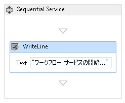</span><span class="sxs-lookup"><span data-stu-id="27f80-132"></span></span>  
  
4.  <span data-ttu-id="27f80-133"><xref:System.ServiceModel.Activities.TransactedReceiveScope> を <xref:System.Activities.Statements.WriteLine> アクティビティの後にドラッグ アンド ドロップします。</span><span class="sxs-lookup"><span data-stu-id="27f80-133">Drag and drop a <xref:System.ServiceModel.Activities.TransactedReceiveScope> after the <xref:System.Activities.Statements.WriteLine> activity.</span></span> <span data-ttu-id="27f80-134"><xref:System.ServiceModel.Activities.TransactedReceiveScope>アクティビティは含まれて、**メッセージング**のセクションで、**ツールボックス**です。</span><span class="sxs-lookup"><span data-stu-id="27f80-134">The <xref:System.ServiceModel.Activities.TransactedReceiveScope> activity can be found in the **Messaging** section of the **Toolbox**.</span></span> <span data-ttu-id="27f80-135"><xref:System.ServiceModel.Activities.TransactedReceiveScope>アクティビティが 2 つのセクションで構成される**要求**と**本文**です。</span><span class="sxs-lookup"><span data-stu-id="27f80-135">The <xref:System.ServiceModel.Activities.TransactedReceiveScope> activity is composed of two sections **Request** and **Body**.</span></span> <span data-ttu-id="27f80-136">**要求**セクションが含まれています、<xref:System.ServiceModel.Activities.Receive>アクティビティ。</span><span class="sxs-lookup"><span data-stu-id="27f80-136">The **Request** section contains the <xref:System.ServiceModel.Activities.Receive> activity.</span></span> <span data-ttu-id="27f80-137">**本文**セクションには、メッセージの受信後に、トランザクション内で実行されるアクティビティが含まれています。</span><span class="sxs-lookup"><span data-stu-id="27f80-137">The **Body** section contains the activities to execute within a transaction after a message has been received.</span></span>  
  
     <span data-ttu-id="27f80-138">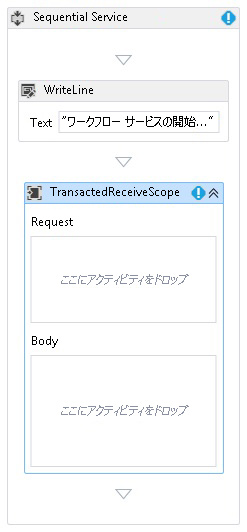</span><span class="sxs-lookup"><span data-stu-id="27f80-138"></span></span>  
  
5.  <span data-ttu-id="27f80-139">選択、<xref:System.ServiceModel.Activities.TransactedReceiveScope>アクティビティをクリック、**変数**ボタンをクリックします。</span><span class="sxs-lookup"><span data-stu-id="27f80-139">Select the <xref:System.ServiceModel.Activities.TransactedReceiveScope> activity and click the **Variables** button.</span></span> <span data-ttu-id="27f80-140">次の変数を追加します。</span><span class="sxs-lookup"><span data-stu-id="27f80-140">Add the following variables.</span></span>  
  
     <span data-ttu-id="27f80-141">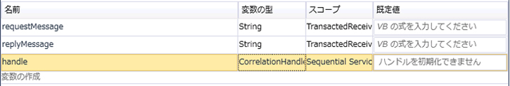</span><span class="sxs-lookup"><span data-stu-id="27f80-141"></span></span>  
  
    > [!NOTE]
    >  <span data-ttu-id="27f80-142">既定で含まれているデータ変数は削除してかまいません。</span><span class="sxs-lookup"><span data-stu-id="27f80-142">You can delete the data variable that is there by default.</span></span> <span data-ttu-id="27f80-143">既存のハンドル変数を使用することもできます。</span><span class="sxs-lookup"><span data-stu-id="27f80-143">You can also use the existing handle variable.</span></span>  
  
6.  <span data-ttu-id="27f80-144">ドラッグ アンド ドロップ、<xref:System.ServiceModel.Activities.Receive>内のアクティビティ、**要求**のセクションで、<xref:System.ServiceModel.Activities.TransactedReceiveScope>アクティビティ。</span><span class="sxs-lookup"><span data-stu-id="27f80-144">Drag and drop a <xref:System.ServiceModel.Activities.Receive> activity within the **Request** section of the <xref:System.ServiceModel.Activities.TransactedReceiveScope> activity.</span></span> <span data-ttu-id="27f80-145">次のプロパティを設定します。</span><span class="sxs-lookup"><span data-stu-id="27f80-145">Set the following properties:</span></span>  
  
    |<span data-ttu-id="27f80-146">プロパティ</span><span class="sxs-lookup"><span data-stu-id="27f80-146">Property</span></span>|<span data-ttu-id="27f80-147">[値]</span><span class="sxs-lookup"><span data-stu-id="27f80-147">Value</span></span>|  
    |--------------|-----------|  
    |<span data-ttu-id="27f80-148">CanCreateInstance</span><span class="sxs-lookup"><span data-stu-id="27f80-148">CanCreateInstance</span></span>|<span data-ttu-id="27f80-149">True (チェック ボックスをオンにする)</span><span class="sxs-lookup"><span data-stu-id="27f80-149">True (check the checkbox)</span></span>|  
    |<span data-ttu-id="27f80-150">OperationName</span><span class="sxs-lookup"><span data-stu-id="27f80-150">OperationName</span></span>|<span data-ttu-id="27f80-151">StartSample</span><span class="sxs-lookup"><span data-stu-id="27f80-151">StartSample</span></span>|  
    |<span data-ttu-id="27f80-152">ServiceContractName</span><span class="sxs-lookup"><span data-stu-id="27f80-152">ServiceContractName</span></span>|<span data-ttu-id="27f80-153">ITransactionSample</span><span class="sxs-lookup"><span data-stu-id="27f80-153">ITransactionSample</span></span>|  
  
     <span data-ttu-id="27f80-154">ワークフローは次のようになります。</span><span class="sxs-lookup"><span data-stu-id="27f80-154">The workflow should look like this:</span></span>  
  
     <span data-ttu-id="27f80-155">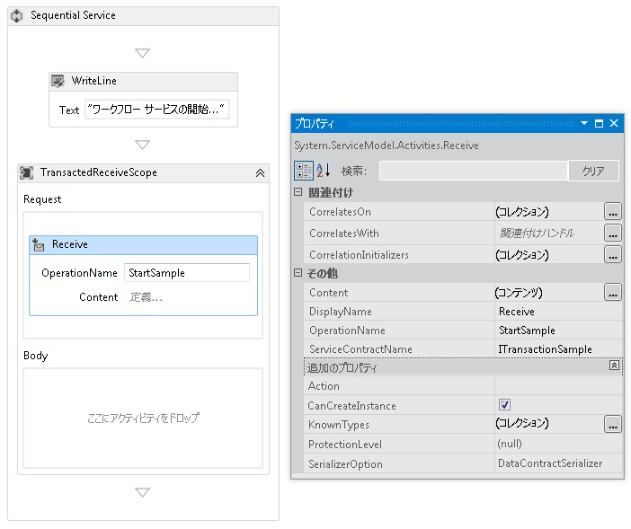</span><span class="sxs-lookup"><span data-stu-id="27f80-155"></span></span>  
  
7.  <span data-ttu-id="27f80-156">クリックして、**を定義しています.** 内のリンク、<xref:System.ServiceModel.Activities.Receive>アクティビティと、次の設定を行います。</span><span class="sxs-lookup"><span data-stu-id="27f80-156">Click the **Define...** link in the <xref:System.ServiceModel.Activities.Receive> activity and make the following settings:</span></span>  
  
     <span data-ttu-id="27f80-157">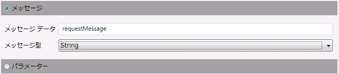</span><span class="sxs-lookup"><span data-stu-id="27f80-157"></span></span>  
  
8.  <span data-ttu-id="27f80-158"><xref:System.Activities.Statements.Sequence> アクティビティを <xref:System.ServiceModel.Activities.TransactedReceiveScope> の Body セクションにドラッグ アンド ドロップします。</span><span class="sxs-lookup"><span data-stu-id="27f80-158">Drag and drop a <xref:System.Activities.Statements.Sequence> activity into the Body section of the <xref:System.ServiceModel.Activities.TransactedReceiveScope>.</span></span> <span data-ttu-id="27f80-159"><xref:System.Activities.Statements.Sequence> アクティビティに 2 つの <xref:System.Activities.Statements.WriteLine> アクティビティをドラッグ アンド ドロップし、<xref:System.Activities.Statements.WriteLine.Text%2A> プロパティを次の表のとおりに設定します。</span><span class="sxs-lookup"><span data-stu-id="27f80-159">Within the <xref:System.Activities.Statements.Sequence> activity drag and drop two <xref:System.Activities.Statements.WriteLine> activities and set the <xref:System.Activities.Statements.WriteLine.Text%2A> properties as shown in the following table.</span></span>  
  
    |<span data-ttu-id="27f80-160">アクティビティ</span><span class="sxs-lookup"><span data-stu-id="27f80-160">Activity</span></span>|<span data-ttu-id="27f80-161">[値]</span><span class="sxs-lookup"><span data-stu-id="27f80-161">Value</span></span>|  
    |--------------|-----------|  
    |<span data-ttu-id="27f80-162">1 つ目の WriteLine</span><span class="sxs-lookup"><span data-stu-id="27f80-162">1st WriteLine</span></span>|<span data-ttu-id="27f80-163">"Service: 完了した受信"</span><span class="sxs-lookup"><span data-stu-id="27f80-163">"Service: Receive Completed"</span></span>|  
    |<span data-ttu-id="27f80-164">2 つ目の WriteLine</span><span class="sxs-lookup"><span data-stu-id="27f80-164">2nd WriteLine</span></span>|<span data-ttu-id="27f80-165">"Service: Received = " + requestMessage</span><span class="sxs-lookup"><span data-stu-id="27f80-165">"Service: Received = " + requestMessage</span></span>|  
  
     <span data-ttu-id="27f80-166">ワークフローは次のようになります。</span><span class="sxs-lookup"><span data-stu-id="27f80-166">The workflow should now look like this:</span></span>  
  
     <span data-ttu-id="27f80-167">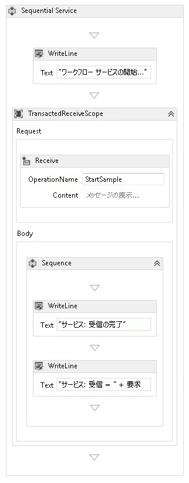</span><span class="sxs-lookup"><span data-stu-id="27f80-167"></span></span>  
  
9. <span data-ttu-id="27f80-168">ドラッグ アンド ドロップ、`PrintTransactionInfo`後、2 つ目のアクティビティ<xref:System.Activities.Statements.WriteLine>内のアクティビティ、**本文**で、<xref:System.ServiceModel.Activities.TransactedReceiveScope>アクティビティ。</span><span class="sxs-lookup"><span data-stu-id="27f80-168">Drag and drop the `PrintTransactionInfo` activity after the second <xref:System.Activities.Statements.WriteLine> activity in the **Body** in the <xref:System.ServiceModel.Activities.TransactedReceiveScope> activity.</span></span>  
  
     <span data-ttu-id="27f80-169">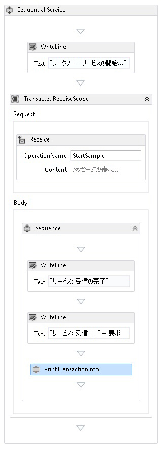</span><span class="sxs-lookup"><span data-stu-id="27f80-169"></span></span>  
  
10. <span data-ttu-id="27f80-170"><xref:System.Activities.Statements.Assign> アクティビティを `PrintTransactionInfo` アクティビティの後にドラッグ アンド ドロップし、次の表のとおりにプロパティを設定します。</span><span class="sxs-lookup"><span data-stu-id="27f80-170">Drag and drop an <xref:System.Activities.Statements.Assign> activity after the `PrintTransactionInfo` activity and set its properties according to the following table.</span></span>  
  
    |<span data-ttu-id="27f80-171">プロパティ</span><span class="sxs-lookup"><span data-stu-id="27f80-171">Property</span></span>|<span data-ttu-id="27f80-172">[値]</span><span class="sxs-lookup"><span data-stu-id="27f80-172">Value</span></span>|  
    |--------------|-----------|  
    |<span data-ttu-id="27f80-173">終了</span><span class="sxs-lookup"><span data-stu-id="27f80-173">To</span></span>|<span data-ttu-id="27f80-174">replyMessage</span><span class="sxs-lookup"><span data-stu-id="27f80-174">replyMessage</span></span>|  
    |<span data-ttu-id="27f80-175">[値]</span><span class="sxs-lookup"><span data-stu-id="27f80-175">Value</span></span>|<span data-ttu-id="27f80-176">"Service: Sending reply."</span><span class="sxs-lookup"><span data-stu-id="27f80-176">"Service: Sending reply."</span></span>|  
  
11. <span data-ttu-id="27f80-177"><xref:System.Activities.Statements.WriteLine> アクティビティを <xref:System.Activities.Statements.Assign> アクティビティの後にドラッグ アンド ドロップし、<xref:System.Activities.Statements.WriteLine.Text%2A> プロパティを "Service: Begin reply" に設定します。</span><span class="sxs-lookup"><span data-stu-id="27f80-177">Drag and drop a <xref:System.Activities.Statements.WriteLine> activity after the <xref:System.Activities.Statements.Assign> activity and set its <xref:System.Activities.Statements.WriteLine.Text%2A> property to "Service: Begin reply."</span></span>  
  
     <span data-ttu-id="27f80-178">ワークフローは次のようになります。</span><span class="sxs-lookup"><span data-stu-id="27f80-178">The workflow should now look like this:</span></span>  
  
     <span data-ttu-id="27f80-179">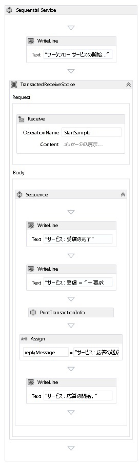</span><span class="sxs-lookup"><span data-stu-id="27f80-179"></span></span>  
  
12. <span data-ttu-id="27f80-180">右クリックして、<xref:System.ServiceModel.Activities.Receive>活動と選択**SendReply の作成**し、最後の後に貼り付けます<xref:System.Activities.Statements.WriteLine>アクティビティ。</span><span class="sxs-lookup"><span data-stu-id="27f80-180">Right click the <xref:System.ServiceModel.Activities.Receive> activity and select **Create SendReply** and paste it after the last <xref:System.Activities.Statements.WriteLine> activity.</span></span> <span data-ttu-id="27f80-181">クリックして、**を定義しています.** 内のリンク、`SendReplyToReceive`アクティビティと、次の設定を行います。</span><span class="sxs-lookup"><span data-stu-id="27f80-181">Click the **Define...** link in the `SendReplyToReceive` activity and make the following settings.</span></span>  
  
     <span data-ttu-id="27f80-182">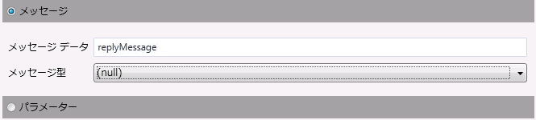</span><span class="sxs-lookup"><span data-stu-id="27f80-182"></span></span>  
  
13. <span data-ttu-id="27f80-183">ドラッグ アンド ドロップ、<xref:System.Activities.Statements.WriteLine>後に、`SendReplyToReceive`アクティビティとセットが<xref:System.Activities.Statements.WriteLine.Text%2A>プロパティを"Service: Reply sent"。</span><span class="sxs-lookup"><span data-stu-id="27f80-183">Drag and drop a <xref:System.Activities.Statements.WriteLine> activity after the `SendReplyToReceive` activity and set it’s <xref:System.Activities.Statements.WriteLine.Text%2A> property to "Service: Reply sent."</span></span>  
  
14. <span data-ttu-id="27f80-184"><xref:System.Activities.Statements.WriteLine> アクティビティをワークフローの末尾にドラッグ アンド ドロップし、<xref:System.Activities.Statements.WriteLine.Text%2A> プロパティを "Service: Workflow ends, press ENTER to exit" に設定します。</span><span class="sxs-lookup"><span data-stu-id="27f80-184">Drag and drop a <xref:System.Activities.Statements.WriteLine> activity at the bottom of the workflow and set its <xref:System.Activities.Statements.WriteLine.Text%2A> property to "Service: Workflow ends, press ENTER to exit."</span></span>  
  
     <span data-ttu-id="27f80-185">完成したサービス ワークフローは次のようになります。</span><span class="sxs-lookup"><span data-stu-id="27f80-185">The completed service workflow should look like this:</span></span>  
  
     <span data-ttu-id="27f80-186">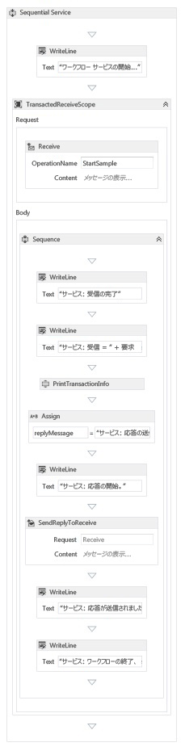</span><span class="sxs-lookup"><span data-stu-id="27f80-186"></span></span>  
  
### <a name="implement-the-workflow-client"></a><span data-ttu-id="27f80-187">ワークフロー クライアントの実装</span><span class="sxs-lookup"><span data-stu-id="27f80-187">Implement the workflow client</span></span>  
  
1.  <span data-ttu-id="27f80-188">`WorkflowClient` という新しい WCF ワークフロー アプリケーションを `Common` プロジェクトに追加します。</span><span class="sxs-lookup"><span data-stu-id="27f80-188">Add a new WCF Workflow application, called `WorkflowClient` to the `Common` project.</span></span> <span data-ttu-id="27f80-189">右クリックを行うには、`Common`プロジェクトで、**追加**、**新しい項目の追加.****ワークフロー** **インストールされたテンプレート**を選択し、**アクティビティ**です。</span><span class="sxs-lookup"><span data-stu-id="27f80-189">To do this right click the `Common` project, select **Add**, **New Item ...**, Select **Workflow** under **Installed Templates** and select **Activity**.</span></span>  
  
     <span data-ttu-id="27f80-190">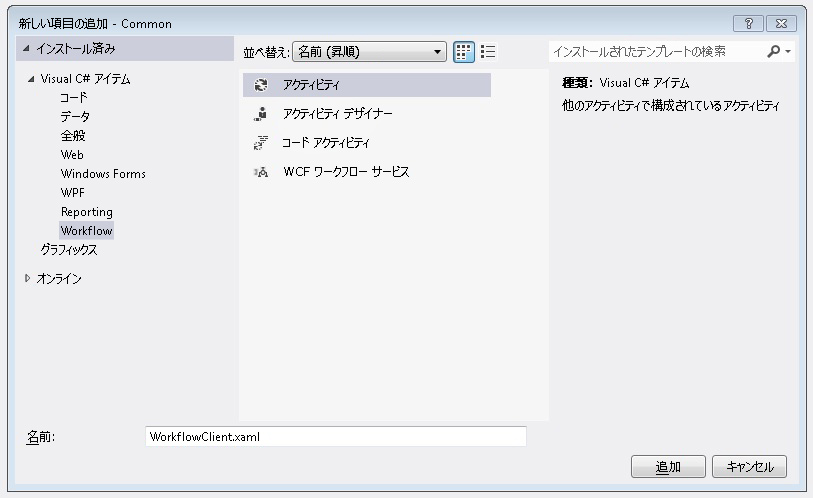</span><span class="sxs-lookup"><span data-stu-id="27f80-190"></span></span>  
  
2.  <span data-ttu-id="27f80-191"><xref:System.Activities.Statements.Sequence> アクティビティをデザイン画面にドラッグ アンド ドロップします。</span><span class="sxs-lookup"><span data-stu-id="27f80-191">Drag and drop a <xref:System.Activities.Statements.Sequence> activity onto the design surface.</span></span>  
  
3.  <span data-ttu-id="27f80-192"><xref:System.Activities.Statements.Sequence> アクティビティを <xref:System.Activities.Statements.WriteLine> アクティビティにドラッグ アンド ドロップし、<xref:System.Activities.Statements.WriteLine.Text%2A> プロパティを `"Client: Workflow starting"` に設定します。</span><span class="sxs-lookup"><span data-stu-id="27f80-192">Within the <xref:System.Activities.Statements.Sequence> activity drag and drop a <xref:System.Activities.Statements.WriteLine> activity and set its <xref:System.Activities.Statements.WriteLine.Text%2A> property to `"Client: Workflow starting"`.</span></span> <span data-ttu-id="27f80-193">ワークフローは次のようになります。</span><span class="sxs-lookup"><span data-stu-id="27f80-193">The workflow should now look like this:</span></span>  
  
     <span data-ttu-id="27f80-194">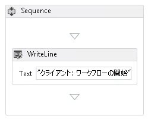</span><span class="sxs-lookup"><span data-stu-id="27f80-194"></span></span>  
  
4.  <span data-ttu-id="27f80-195"><xref:System.Activities.Statements.TransactionScope> アクティビティを <xref:System.Activities.Statements.WriteLine> アクティビティの後にドラッグ アンド ドロップします。</span><span class="sxs-lookup"><span data-stu-id="27f80-195">Drag and drop a <xref:System.Activities.Statements.TransactionScope> activity after the <xref:System.Activities.Statements.WriteLine> activity.</span></span>  <span data-ttu-id="27f80-196"><xref:System.Activities.Statements.TransactionScope> アクティビティを選択し、[変数] をクリックして次の変数を追加します。</span><span class="sxs-lookup"><span data-stu-id="27f80-196">Select the <xref:System.Activities.Statements.TransactionScope> activity, click the Variables button and add the following variables.</span></span>  
  
     <span data-ttu-id="27f80-197">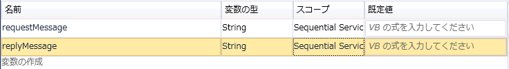</span><span class="sxs-lookup"><span data-stu-id="27f80-197"></span></span>  
  
5.  <span data-ttu-id="27f80-198"><xref:System.Activities.Statements.Sequence> アクティビティを <xref:System.Activities.Statements.TransactionScope> アクティビティの Body セクションにドラッグ アンド ドロップします。</span><span class="sxs-lookup"><span data-stu-id="27f80-198">Drag and drop a <xref:System.Activities.Statements.Sequence> activity into the body of the <xref:System.Activities.Statements.TransactionScope> activity.</span></span>  
  
6.  <span data-ttu-id="27f80-199">`PrintTransactionInfo` アクティビティを <xref:System.Activities.Statements.Sequence> アクティビティにドラッグ アンド ドロップします。</span><span class="sxs-lookup"><span data-stu-id="27f80-199">Drag and drop a `PrintTransactionInfo` activity within the <xref:System.Activities.Statements.Sequence></span></span>  
  
7.  <span data-ttu-id="27f80-200">ドラッグ アンド ドロップ、<xref:System.Activities.Statements.WriteLine>後に、`PrintTransactionInfo`アクティビティとその<xref:System.Activities.Statements.WriteLine.Text%2A>プロパティを"Client: Beginning Send"にします。</span><span class="sxs-lookup"><span data-stu-id="27f80-200">Drag and drop a <xref:System.Activities.Statements.WriteLine> activity after the `PrintTransactionInfo` activity and set its <xref:System.Activities.Statements.WriteLine.Text%2A> property to "Client: Beginning Send".</span></span> <span data-ttu-id="27f80-201">ワークフローは次のようになります。</span><span class="sxs-lookup"><span data-stu-id="27f80-201">The workflow should now look like this:</span></span>  
  
     <span data-ttu-id="27f80-202">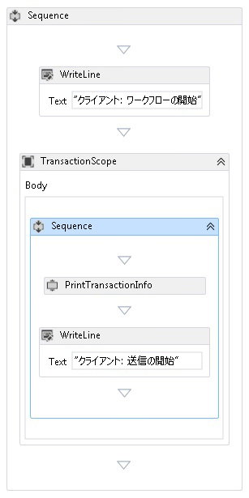</span><span class="sxs-lookup"><span data-stu-id="27f80-202"></span></span>  
  
8.  <span data-ttu-id="27f80-203"><xref:System.ServiceModel.Activities.Send> アクティビティを <xref:System.Activities.Statements.Assign> アクティビティの後にドラッグ アンド ドロップし、次のプロパティを設定します。</span><span class="sxs-lookup"><span data-stu-id="27f80-203">Drag and drop a <xref:System.ServiceModel.Activities.Send> activity after the <xref:System.Activities.Statements.Assign> activity and set the following properties:</span></span>  
  
    |<span data-ttu-id="27f80-204">プロパティ</span><span class="sxs-lookup"><span data-stu-id="27f80-204">Property</span></span>|<span data-ttu-id="27f80-205">[値]</span><span class="sxs-lookup"><span data-stu-id="27f80-205">Value</span></span>|  
    |--------------|-----------|  
    |<span data-ttu-id="27f80-206">EndpointConfigurationName</span><span class="sxs-lookup"><span data-stu-id="27f80-206">EndpointConfigurationName</span></span>|<span data-ttu-id="27f80-207">workflowServiceEndpoint</span><span class="sxs-lookup"><span data-stu-id="27f80-207">workflowServiceEndpoint</span></span>|  
    |<span data-ttu-id="27f80-208">OperationName</span><span class="sxs-lookup"><span data-stu-id="27f80-208">OperationName</span></span>|<span data-ttu-id="27f80-209">StartSample</span><span class="sxs-lookup"><span data-stu-id="27f80-209">StartSample</span></span>|  
    |<span data-ttu-id="27f80-210">ServiceContractName</span><span class="sxs-lookup"><span data-stu-id="27f80-210">ServiceContractName</span></span>|<span data-ttu-id="27f80-211">ITransactionSample</span><span class="sxs-lookup"><span data-stu-id="27f80-211">ITransactionSample</span></span>|  
  
     <span data-ttu-id="27f80-212">ワークフローは次のようになります。</span><span class="sxs-lookup"><span data-stu-id="27f80-212">The workflow should now look like this:</span></span>  
  
     <span data-ttu-id="27f80-213">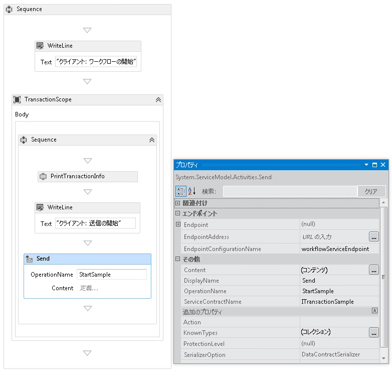</span><span class="sxs-lookup"><span data-stu-id="27f80-213"></span></span>  
  
9. <span data-ttu-id="27f80-214">クリックして、**を定義しています.** リンクし、次の設定を行います。</span><span class="sxs-lookup"><span data-stu-id="27f80-214">Click the **Define...** link and make the following settings:</span></span>  
  
     <span data-ttu-id="27f80-215">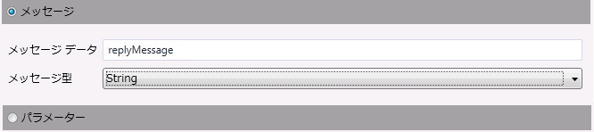</span><span class="sxs-lookup"><span data-stu-id="27f80-215"></span></span>  
  
10. <span data-ttu-id="27f80-216">右クリックして、<xref:System.ServiceModel.Activities.Send>活動と選択**receivereply の作成**です。</span><span class="sxs-lookup"><span data-stu-id="27f80-216">Right click the <xref:System.ServiceModel.Activities.Send> activity and select **Create ReceiveReply**.</span></span> <span data-ttu-id="27f80-217"><xref:System.ServiceModel.Activities.ReceiveReply> アクティビティが <xref:System.ServiceModel.Activities.Send> アクティビティの後に自動的に配置されます。</span><span class="sxs-lookup"><span data-stu-id="27f80-217">The <xref:System.ServiceModel.Activities.ReceiveReply> activity will be automatically placed after the <xref:System.ServiceModel.Activities.Send> activity.</span></span>  
  
11. <span data-ttu-id="27f80-218">ReceiveReplyForSend アクティビティの [定義] リンクをクリックし、次の設定を行います。</span><span class="sxs-lookup"><span data-stu-id="27f80-218">Click the Define... link on the ReceiveReplyForSend activity and make the following settings:</span></span>  
  
     <span data-ttu-id="27f80-219">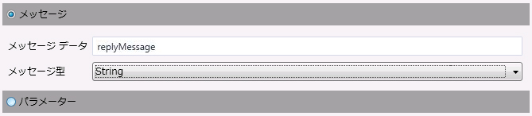</span><span class="sxs-lookup"><span data-stu-id="27f80-219"></span></span>  
  
12. <span data-ttu-id="27f80-220"><xref:System.Activities.Statements.WriteLine> アクティビティを <xref:System.ServiceModel.Activities.Send> アクティビティと <xref:System.ServiceModel.Activities.ReceiveReply> アクティビティの間にドラッグ アンド ドロップし、<xref:System.Activities.Statements.WriteLine.Text%2A> プロパティを "Client: Send complete" に設定します。</span><span class="sxs-lookup"><span data-stu-id="27f80-220">Drag and drop a <xref:System.Activities.Statements.WriteLine> activity between the <xref:System.ServiceModel.Activities.Send> and <xref:System.ServiceModel.Activities.ReceiveReply> activities and set its <xref:System.Activities.Statements.WriteLine.Text%2A> property to "Client: Send complete."</span></span>  
  
13. <span data-ttu-id="27f80-221"><xref:System.Activities.Statements.WriteLine> アクティビティを <xref:System.ServiceModel.Activities.ReceiveReply> アクティビティの後にドラッグ アンド ドロップし、<xref:System.Activities.Statements.WriteLine.Text%2A> プロパティを "Client side: Reply received = " + replyMessage に設定します。</span><span class="sxs-lookup"><span data-stu-id="27f80-221">Drag and drop a <xref:System.Activities.Statements.WriteLine> activity after the <xref:System.ServiceModel.Activities.ReceiveReply> activity and set its <xref:System.Activities.Statements.WriteLine.Text%2A> property to "Client side: Reply received = " + replyMessage</span></span>  
  
14. <span data-ttu-id="27f80-222">`PrintTransactionInfo` アクティビティを <xref:System.Activities.Statements.WriteLine> アクティビティの後にドラッグ アンド ドロップします。</span><span class="sxs-lookup"><span data-stu-id="27f80-222">Drag and drop a `PrintTransactionInfo` activity after the <xref:System.Activities.Statements.WriteLine> activity.</span></span>  
  
15. <span data-ttu-id="27f80-223"><xref:System.Activities.Statements.WriteLine> アクティビティをワークフローの末尾にドラッグ アンド ドロップし、<xref:System.Activities.Statements.WriteLine.Text%2A> プロパティを "Client workflow ends" に設定します。</span><span class="sxs-lookup"><span data-stu-id="27f80-223">Drag and drop a <xref:System.Activities.Statements.WriteLine> activity at the end of the workflow and set its <xref:System.Activities.Statements.WriteLine.Text%2A> property to "Client workflow ends."</span></span> <span data-ttu-id="27f80-224">完成したクライアント ワークフローは次の図のようになります。</span><span class="sxs-lookup"><span data-stu-id="27f80-224">The completed client workflow should look like the following diagram.</span></span>  
  
     <span data-ttu-id="27f80-225">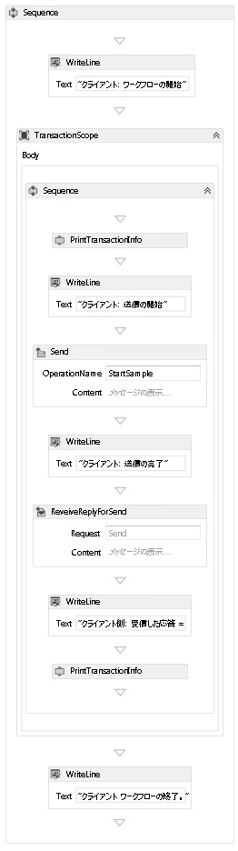</span><span class="sxs-lookup"><span data-stu-id="27f80-225"></span></span>  
  
16. <span data-ttu-id="27f80-226">ソリューションをビルドします。</span><span class="sxs-lookup"><span data-stu-id="27f80-226">Build the solution.</span></span>  
  
### <a name="create-the-service-application"></a><span data-ttu-id="27f80-227">サービス アプリケーションの作成</span><span class="sxs-lookup"><span data-stu-id="27f80-227">Create the Service application</span></span>  
  
1.  <span data-ttu-id="27f80-228">`Service` という新しいコンソール アプリケーション プロジェクトをソリューションに追加します。</span><span class="sxs-lookup"><span data-stu-id="27f80-228">Add a new Console Application project called `Service` to the solution.</span></span> <span data-ttu-id="27f80-229">次のアセンブリへの参照を追加します。</span><span class="sxs-lookup"><span data-stu-id="27f80-229">Add references to the following assemblies:</span></span>  
  
    1.  <span data-ttu-id="27f80-230">System.Activities.dll</span><span class="sxs-lookup"><span data-stu-id="27f80-230">System.Activities.dll</span></span>  
  
    2.  <span data-ttu-id="27f80-231">System.ServiceModel.dll</span><span class="sxs-lookup"><span data-stu-id="27f80-231">System.ServiceModel.dll</span></span>  
  
    3.  <span data-ttu-id="27f80-232">System.ServiceModel.Activities.dll</span><span class="sxs-lookup"><span data-stu-id="27f80-232">System.ServiceModel.Activities.dll</span></span>  
  
2.  <span data-ttu-id="27f80-233">生成された Program.cs ファイルを開き、次のコードを追加します。</span><span class="sxs-lookup"><span data-stu-id="27f80-233">Open the generated Program.cs file and the following code:</span></span>  
  
    ```  
    static void Main()  
          {  
              Console.WriteLine("Building the server.");  
              using (WorkflowServiceHost host = new WorkflowServiceHost(new DeclarativeServiceWorkflow(), new Uri("net.tcp://localhost:8000/TransactedReceiveService/Declarative")))  
              {                
                  //Start the server  
                  host.Open();  
                  Console.WriteLine("Service started.");  
  
                  Console.WriteLine();  
                  Console.ReadLine();  
                  //Shutdown  
                  host.Close();  
              };         
          }  
    ```  
  
3.  <span data-ttu-id="27f80-234">次の app.config ファイルをプロジェクトに追加します。</span><span class="sxs-lookup"><span data-stu-id="27f80-234">Add the following app.config file to the project.</span></span>  
  
    ```xml  
    <?xml version="1.0" encoding="utf-8" ?>  
    <!-- Copyright © Microsoft Corporation.  All rights reserved. -->  
    <configuration>  
        <system.serviceModel>  
            <bindings>  
                <netTcpBinding>  
                    <binding transactionFlow="true" />  
                </netTcpBinding>  
            </bindings>  
        </system.serviceModel>  
    </configuration>  
    ```  
  
### <a name="create-the-client-application"></a><span data-ttu-id="27f80-235">クライアント アプリケーションの作成</span><span class="sxs-lookup"><span data-stu-id="27f80-235">Create the client application</span></span>  
  
1.  <span data-ttu-id="27f80-236">`Client` という新しいコンソール アプリケーション プロジェクトをソリューションに追加します。</span><span class="sxs-lookup"><span data-stu-id="27f80-236">Add a new Console Application project called `Client` to the solution.</span></span> <span data-ttu-id="27f80-237">System.Activities.dll への参照を追加します。</span><span class="sxs-lookup"><span data-stu-id="27f80-237">Add a reference to System.Activities.dll.</span></span>  
  
2.  <span data-ttu-id="27f80-238">program.cs ファイルを開き、次のコードを追加します。</span><span class="sxs-lookup"><span data-stu-id="27f80-238">Open the program.cs file and add the following code.</span></span>  
  
    ```  
    class Program  
        {  
  
            private static AutoResetEvent syncEvent = new AutoResetEvent(false);  
  
            static void Main(string[] args)  
            {  
                //Build client  
                Console.WriteLine("Building the client.");  
                WorkflowApplication client = new WorkflowApplication(new DeclarativeClientWorkflow());  
                client.Completed = Program.Completed;  
                client.Aborted = Program.Aborted;  
                client.OnUnhandledException = Program.OnUnhandledException;  
  
                //Wait for service to start  
                Console.WriteLine("Press ENTER once service is started.");  
                Console.ReadLine();  
  
                //Start the client              
                Console.WriteLine("Starting the client.");  
                client.Run();  
                syncEvent.WaitOne();  
  
                //Sample complete  
                Console.WriteLine();  
                Console.WriteLine("Client complete. Press ENTER to exit.");  
                Console.ReadLine();  
            }  
  
            private static void Completed(WorkflowApplicationCompletedEventArgs e)  
            {  
                Program.syncEvent.Set();  
            }  
  
            private static void Aborted(WorkflowApplicationAbortedEventArgs e)  
            {  
                Console.WriteLine("Client Aborted: {0}", e.Reason);  
                Program.syncEvent.Set();  
            }  
  
            private static UnhandledExceptionAction OnUnhandledException(WorkflowApplicationUnhandledExceptionEventArgs e)  
            {  
                Console.WriteLine("Client had an unhandled exception: {0}", e.UnhandledException);  
                return UnhandledExceptionAction.Cancel;  
            }  
        }  
    ```  
  
## <a name="see-also"></a><span data-ttu-id="27f80-239">関連項目</span><span class="sxs-lookup"><span data-stu-id="27f80-239">See Also</span></span>  
 [<span data-ttu-id="27f80-240">ワークフロー サービス</span><span class="sxs-lookup"><span data-stu-id="27f80-240">Workflow Services</span></span>](../../../../docs/framework/wcf/feature-details/workflow-services.md)  
 [<span data-ttu-id="27f80-241">Windows Communication Foundation のトランザクションの概要</span><span class="sxs-lookup"><span data-stu-id="27f80-241">Windows Communication Foundation Transactions Overview</span></span>](../../../../docs/framework/wcf/feature-details/transactions-overview.md)  
 [<span data-ttu-id="27f80-242">TransactedReceiveScope の使用</span><span class="sxs-lookup"><span data-stu-id="27f80-242">Use of TransactedReceiveScope</span></span>](../../../../docs/framework/windows-workflow-foundation/samples/use-of-transactedreceivescope.md)
