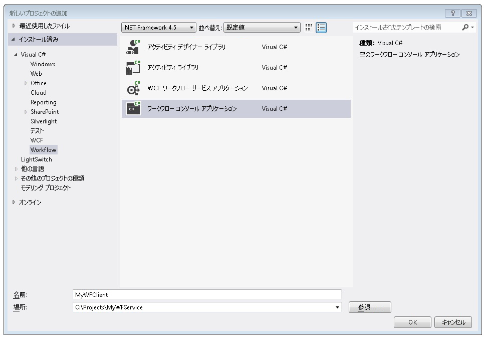
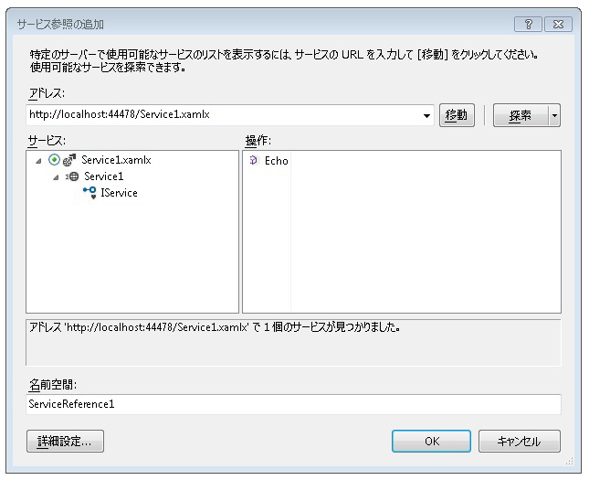
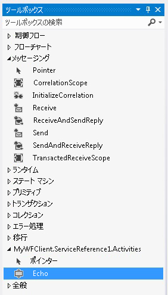
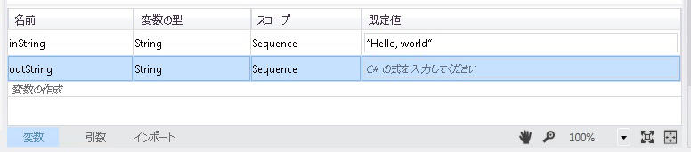
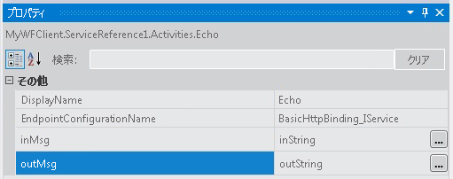
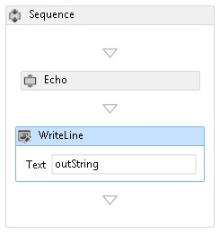
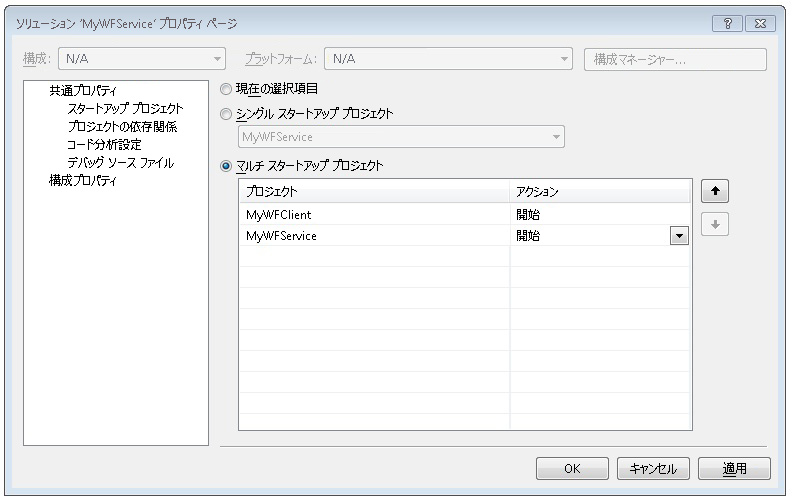

# 方法: ワークフロー アプリケーションからサービスにアクセスするHow To: Access a Service From a Workflow Application
このトピックでは、ワークフロー コンソール アプリケーションからワークフロー サービスを呼び出す方法について説明します。This topic describes how to call a workflow service from a workflow console application. 完了に依存している、[する方法: メッセージング アクティビティでワークフロー サービスを作成](../../../../docs/framework/wcf/feature-details/how-to-create-a-workflow-service-with-messaging-activities.md)トピックです。It depends on completion of the [How to: Create a Workflow Service with Messaging Activities](../../../../docs/framework/wcf/feature-details/how-to-create-a-workflow-service-with-messaging-activities.md) topic. このトピックでは、ワークフロー アプリケーションからワークフロー サービスを呼び出す方法について説明、ワークフロー アプリケーションから任意の Windows Communication Foundation (WCF) サービスを呼び出す場合と同じ方法を使用できます。Although this topic describes how to call a workflow service from a workflow application, the same methods can be used to call any Windows Communication Foundation (WCF) service from a workflow application.  
  
### ワークフロー コンソール アプリケーション プロジェクトの作成Create a Workflow Console Application Project  
  
1.  [!INCLUDE[vs_current_long](../../../../includes/vs-current-long-md.md)] を起動します。Start [!INCLUDE[vs_current_long](../../../../includes/vs-current-long-md.md)].  
  
2.  作成した MyWFService プロジェクトを読み込む、[する方法: メッセージング アクティビティでワークフロー サービスを作成](../../../../docs/framework/wcf/feature-details/how-to-create-a-workflow-service-with-messaging-activities.md)トピックです。Load the MyWFService project you created in the [How to: Create a Workflow Service with Messaging Activities](../../../../docs/framework/wcf/feature-details/how-to-create-a-workflow-service-with-messaging-activities.md) topic.  
  
3.  右クリックして、 **MyWFService**でソリューション、**ソリューション エクスプ ローラー**選択**追加**、**新しいプロジェクト**です。Right click the **MyWFService** solution in the **Solution Explorer** and select **Add**, **New Project**. 選択**ワークフロー**で、**インストールされたテンプレート**と**ワークフロー コンソール アプリケーション**プロジェクトの種類の一覧からです。Select **Workflow** in the **Installed Templates** and **Workflow Console Application** from the list of project types. 次の図に示すように、プロジェクトに MyWFClient という名前を付け、既定の場所を使用します。Name the project MyWFClient and use the default location as shown in the following illustration.  
  
       
  
     をクリックして、 **OK**を消去するボタン、**新しいプロジェクト ダイアログの追加**。Click the **OK** button to dismiss the **Add New Project Dialog**.  
  
4.  プロジェクトが作成されると、Workflow1.xaml ファイルがデザイナーで開かれます。After the project is created, the Workflow1.xaml file is opened in the designer. クリックして、**ツールボックス**タブを開き、[ツールボックス] ウィンドウを開いておき、プッシュピンをクリックして既にでない場合、ツールボックスを開きます。Click the **Toolbox** tab to open the toolbox if it is not already open and click the pushpin to keep the toolbox window open.  
  
5.  Ctrl キーを押しながら F5 キーを押して、サービスを起動します。Press Ctrl + F5 to build and launch the service. 以前と同様に、ASP.NET 開発サーバーが起動され、Internet Explorer に WCF ヘルプ ページが表示されます。As before, the ASP.NET Development Server is launched and Internet Explorer displays the WCF Help Page. このページの URI は、次の手順で使用する必要があるため、確認しておいてください。Notice the URI for this page as you must use it in the next step.  
  
       
  
6.  右クリックして、 **MyWFClient**でプロジェクトを**ソリューション エクスプ ローラー**選択**サービス参照の追加**です。Right click the **MyWFClient** project in the **Solution Explorer** and select **Add Service Reference**. クリックして、 **Discover**サービスの現在のソリューションを検索するボタンをクリックします。Click the **Discover** button to search the current solution for any services. [サービス] ボックスで、Service1.xamlx の横にある三角形をクリックします。Click the triangle next to Service1.xamlx in the Services list. Service1 の横にある三角形をクリックして、Service1 サービスによって実装されるコントラクトの一覧を表示します。Click the triangle next to Service1 to list the contracts implemented by the Service1 service. 展開、 **Service1**内のノード、 **Services**  ボックスの一覧です。Expand the **Service1** node in the **Services** list. Echo 操作が表示されます、 **Operations**次の図に示すように一覧表示します。The Echo operation is displayed in the **Operations** list as shown in the following illustration.  
  
       
  
     既定の名前空間を保持し、をクリックして**OK**を消去する、**サービス参照の追加**ダイアログ。Keep the default namespace and click **OK** to dismiss the **Add Service Reference** dialog. 次のダイアログ ボックスが表示されます。The following dialog is displayed.  
  
       
  
     をクリックして**OK**ダイアログ ボックスを閉じます。Click **OK** to dismiss the dialog. 次に、Ctrl キーと Shift キーを押しながら B キーを押して、ソリューションをビルドします。Next, press CTRL+SHIFT+B to build the solution. 新しいセクションが追加されたツールボックスの通知と呼ばれる**MyWFClient.ServiceReference1.Activities**です。Notice in the toolbox a new section has been added called **MyWFClient.ServiceReference1.Activities**. この選択肢を展開して、次の図のように、追加されている Echo アクティビティを確認します。Expand this section and notice the Echo activity that has been added as shown in the following illustration.  
  
       
  
7.  ドラッグ アンド ドロップ、 <!--zz <xref:System.ServiceModel.Activities.Sequence>--> `System.ServiceModel.Activities.Sequence`アクティビティをデザイナー画面にします。Drag and drop a <!--zz <xref:System.ServiceModel.Activities.Sequence>--> `System.ServiceModel.Activities.Sequence` activity onto the designer surface. 下、**制御フロー**ツールボックスのセクションです。It is under the **Control Flow** section of the toolbox.  
  
8.  <!--zz <xref:System.ServiceModel.Activities.Sequence>--> `System.ServiceModel.Activities.Sequence` 、フォーカスのあるアクティビティをクリックして、**変数**リンクし、という名前の文字列変数を追加`inString`です。With the <!--zz <xref:System.ServiceModel.Activities.Sequence>--> `System.ServiceModel.Activities.Sequence` activity in focus, click the **Variables** link and add a string variable named `inString`. 変数の既定値を付けます`"Hello, world"`という名前の文字列変数だけでなく`outString`次の図に示すようにします。Give the variable a default value of `"Hello, world"` as well as a string variable named `outString` as shown in the following diagram.  
  
       
  
9. ドラッグ アンド ドロップ、**エコー**にアクティビティ、 <!--zz <xref:System.ServiceModel.Activities.Sequence>--> `System.ServiceModel.Activities.Sequence`です。Drag and drop an **Echo** activity into the <!--zz <xref:System.ServiceModel.Activities.Sequence>--> `System.ServiceModel.Activities.Sequence`. プロパティ ウィンドウで次のようにバインドします。、`inMsg`への引数、`inString`変数および`outMsg`への引数、`outString`変数次の図に示すようにします。In the properties window bind the `inMsg` argument to the `inString` variable and the `outMsg` argument to the `outString` variable as shown in the following illustration. これにより、`inString` 変数の値を操作に渡し、戻り値を取得し、その戻り値を `outString` 変数に格納します。This passes in the value of the `inString` variable to the operation and then takes the return value and places it in the `outString` variable.  
  
       
  
10. ドラッグ アンド ドロップ、 **WriteLine**アクティビティの下、**エコー**サービス呼び出しによって返される文字列を表示するアクティビティ。Drag and drop a **WriteLine** activity below the **Echo** activity to display the string returned by the service call. **WriteLine**にアクティビティがある、**プリミティブ**ツールボックス内のノードです。The **WriteLine** activity is located in the **Primitives** node in the toolbox. バインド、**テキスト**の引数、 **WriteLine**アクティビティを`outString`」と入力して変数`outString`のテキスト ボックスに、 **WriteLine**アクティビティ。Bind the **Text** argument of the **WriteLine** activity to the `outString` variable by typing `outString` into the text box on the **WriteLine** activity. この時点で、ワークフローは次の図のようになります。The workflow should now look like the following illustration.  
  
       
  
11. MyWFService ソリューションを右クリックし **スタートアップ プロジェクトを設定しています.**.選択、**マルチ スタートアップ プロジェクト**ラジオ ボタンを選択**開始**内の各プロジェクト、**アクション**列の次の図に示すようにします。Right-click the MyWFService solution and select **Set Startup Projects ...**. Select the **Multiple startup projects** radio button and select **Start** for each project in the **Action** column as shown in the following illustration.  
  
       
  
12. Ctrl キーを押しながら F5 キーを押し、サービスとクライアントの両方を起動します。Press Ctrl + F5 to launch both the service and the client. ASP.NET 開発サーバー サービスをホストする、Internet Explorer に WCF ヘルプ ページが表示されます、およびクライアント ワークフロー アプリケーションは、コンソール ウィンドウで起動し、(「こんにちは, world」)、サービスから返される文字列が表示されます。The ASP.NET Development Server hosts the service, Internet Explorer displays the WCF help page, and the client workflow application is launched in a console window and displays the string returned from the service ("Hello, world").  
  
## 関連項目See Also  
 [ワークフロー サービスWorkflow Services](../../../../docs/framework/wcf/feature-details/workflow-services.md)  
 [方法 : メッセージング アクティビティを使用してワークフロー サービスを作成するHow to: Create a Workflow Service with Messaging Activities](../../../../docs/framework/wcf/feature-details/how-to-create-a-workflow-service-with-messaging-activities.md)  
 [Web プロジェクトでワークフローから WCF サービスの使用Consuming a WCF Service from a Workflow in a Web Project](http://go.microsoft.com/fwlink/?LinkId=207725)
