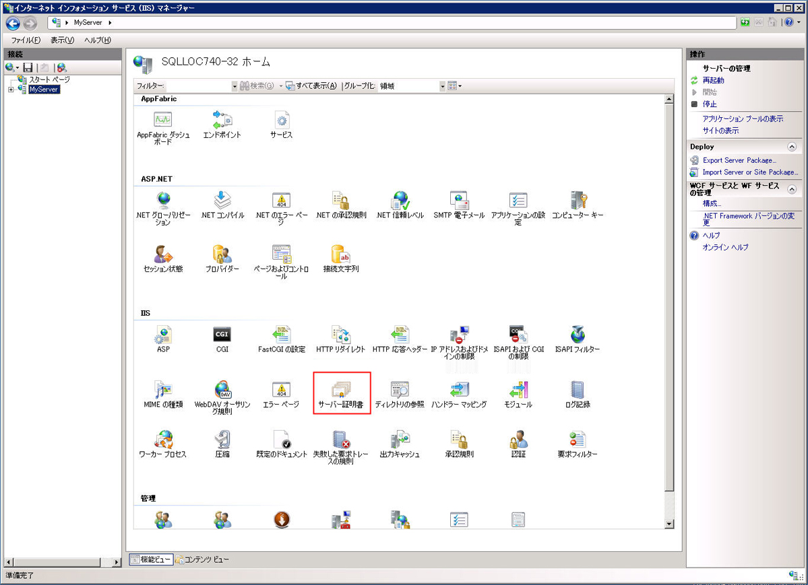
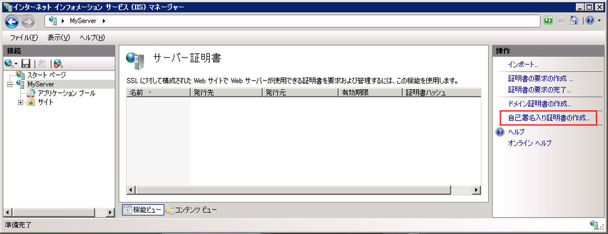
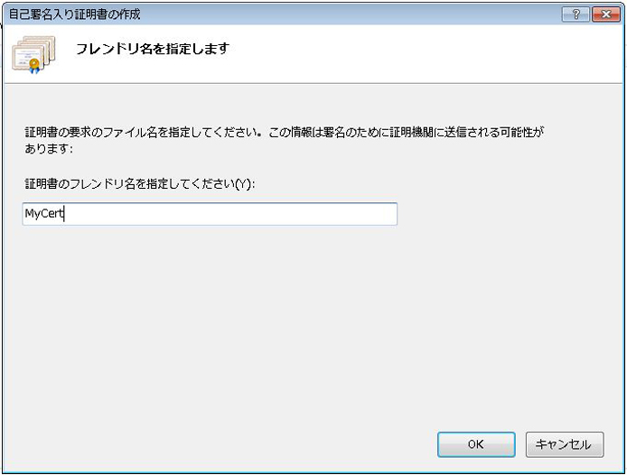
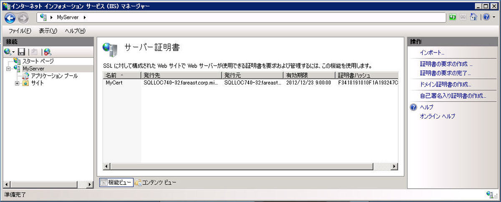
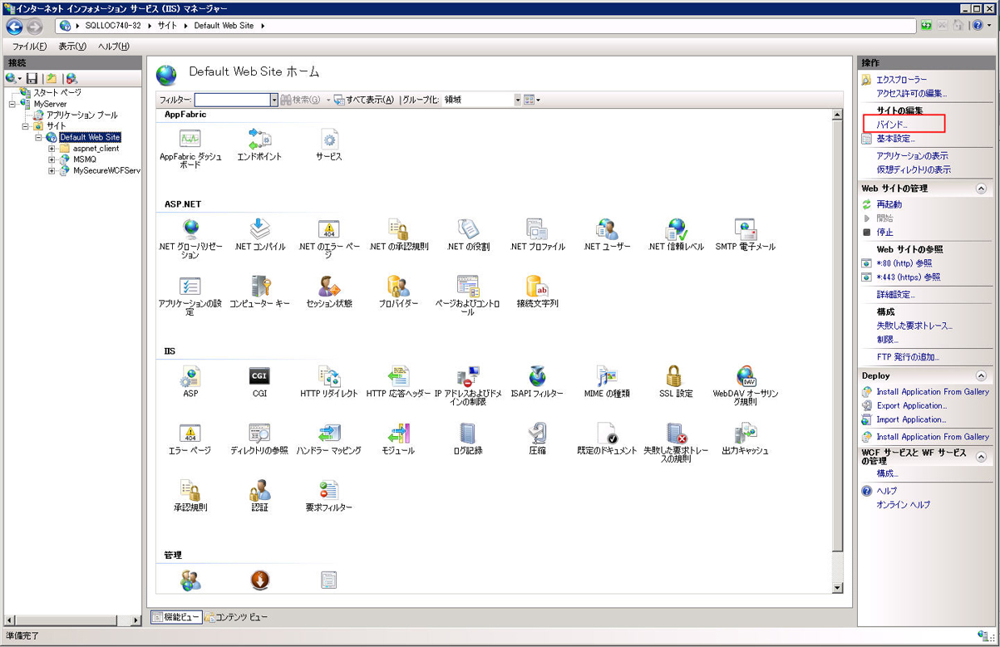
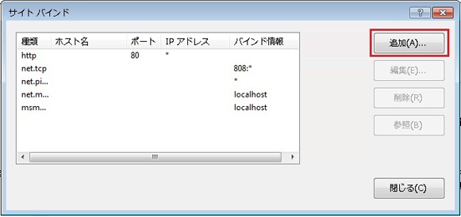
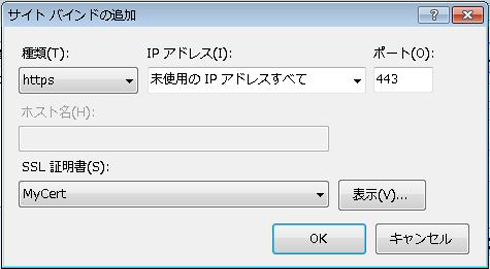
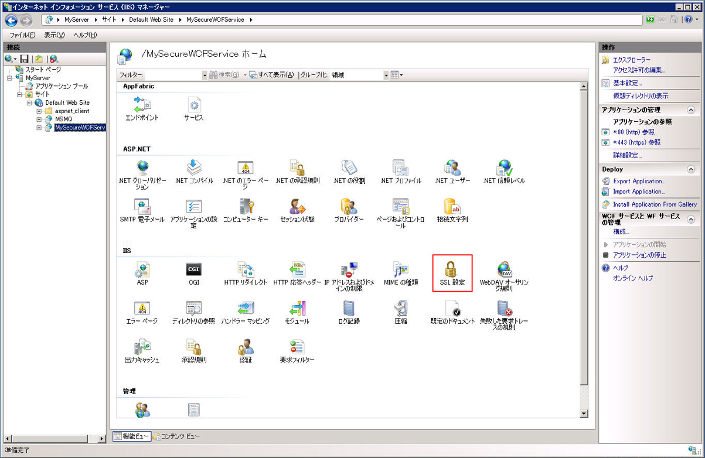
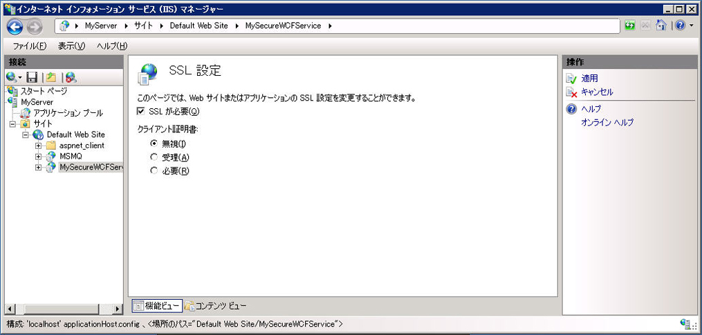

# IIS でホストされる WCF サービスに SSL を構成する方法
ここでは、HTTP トランスポート セキュリティを使用するように IIS でホストされる WCF サービスをセットアップする方法について説明します。  HTTP トランスポート セキュリティを使用するには、SSL 証明書が IIS に登録されている必要があります。  SSL 証明書がない場合は、IIS を使用してテスト証明書を生成できます。  次に、Web サイトに SSL バインディングを追加し、Web サイトの認証プロパティを構成する必要があります。  最後に、HTTPS を使用するように WCF サービスを構成する必要があります。  
  
### 自己署名証明書の作成  
  
1.  インターネット インフォメーション サービス マネージャー \(inetmgr.exe\) を開き、左側のツリー ビューでコンピューター名を選択します。  画面の右側で \[サーバー証明書\] を選択します。  
  
       
  
2.  \[サーバー証明書\] ウィンドウで、**\[自己署名入り証明書の作成\]** リンクをクリックします。  
  
       
  
3.  自己署名証明書の表示名を入力し、**\[OK\]** をクリックします。  
  
       
  
     これで、新しく作成された自己署名証明書の詳細が **\[サーバー証明書\]** ウィンドウに表示されます。  
  
       
  
     生成された証明書が、信頼されたルート証明機関ストアにインストールされます。  
  
### SSL バインドの追加  
  
1.  インターネット インフォメーション サービス マネージャーで、画面の左側にあるツリー ビューの **\[サイト\]** フォルダーを展開し、**\[既定の Web サイト\]** フォルダーを展開します。  
  
2.  ウィンドウの右上にある **\[操作\]** セクションの **\[バインド\]** リンクをクリックします。  
  
       
  
3.  \[サイト バインド\] ウィンドウで **\[追加\]** をクリックします。  
  
       
  
4.  **\[サイト バインドの追加\]** ダイアログ ボックスで、作成した自己署名証明書の種類 \(https\) と表示名を選択します。  
  
       
  
### SSL の仮想ディレクトリの構成  
  
1.  インターネット インフォメーション サービス マネージャーで、WCF のセキュリティで保護されたサービスが含まれている仮想ディレクトリを選択します。  
  
2.  ウィンドウの中央ペインにある IIS セクションで **\[SSL 設定\]** を選択します。  
  
       
  
3.  \[SSL 設定\] ペインで、**\[SSL が必要\]** チェック ボックスをオンにし、画面右側の **\[操作\]** セクションで **\[適用\]** リンクをクリックします。  
  
       
  
### HTTP トランスポート セキュリティのための WCF サービスの構成  
  
1.  WCF サービスの Web.config で、次の XML に示すように、トランスポート セキュリティを使用するよう HTTP バインドを構成します。  
  
    ```  
    <bindings>  
          <basicHttpBinding>  
            <binding name="secureHttpBinding">  
              <security mode="Transport">  
                <transport clientCredentialType="None"/>  
              </security>  
            </binding>  
          </basicHttpBinding>  
        </bindings>  
  
    ```  
  
2.  次の XML に示すように、サービスとサービス エンドポイントを指定します。  
  
    ```  
    <services>  
          <service name="MySecureWCFService.Service1">  
            <endpoint address=""  
                      binding="basicHttpBinding"  
                      bindingConfiguration="secureHttpBinding"  
                      contract="MySecureWCFService.IService1"/>  
  
            <endpoint address="mex"  
                      binding="mexHttpsBinding"  
                      contract="IMetadataExchange" />  
          </service>  
        </services>  
  
    ```  
  
## 使用例  
 次は、HTTP トランスポート セキュリティを使用した WCF サービスの web.config ファイルの詳細な例です。  
  
```  
<?xml version="1.0"?>  
<configuration>  
  
  <system.web>  
    <compilation debug="true" targetFramework="4.0" />  
  </system.web>  
  <system.serviceModel>  
    <services>  
      <service name="MySecureWCFService.Service1">  
        <endpoint address=""  
                  binding="basicHttpBinding"  
                  bindingConfiguration="secureHttpBinding"  
                  contract="MySecureWCFService.IService1"/>  
  
        <endpoint address="mex"  
                  binding="mexHttpsBinding"  
                  contract="IMetadataExchange" />  
      </service>  
    </services>  
    <bindings>  
      <basicHttpBinding>  
        <binding name="secureHttpBinding">  
          <security mode="Transport">  
            <transport clientCredentialType="None"/>  
          </security>  
        </binding>  
      </basicHttpBinding>  
    </bindings>  
    <behaviors>  
      <serviceBehaviors>  
        <behavior>  
          <!-- To avoid disclosing metadata information, set the value below to false and remove the metadata endpoint above before deployment -->  
          <serviceMetadata httpsGetEnabled="true"/>  
          <!-- To receive exception details in faults for debugging purposes, set the value below to true.  Set to false before deployment to avoid disclosing exception information -->  
          <serviceDebug includeExceptionDetailInFaults="false"/>  
        </behavior>  
      </serviceBehaviors>  
    </behaviors>  
    <serviceHostingEnvironment multipleSiteBindingsEnabled="true" />  
  </system.serviceModel>  
 <system.webServer>  
    <modules runAllManagedModulesForAllRequests="true"/>  
  </system.webServer>  
  
</configuration>  
  
```  
  
<!-- TODO: review snippet reference  [!CODE [Microsoft.Win32.RegistryKey#4](Microsoft.Win32.RegistryKey#4)]  -->  
  
## 参照  
 [インターネット インフォメーション サービスでのホスティング](../../../../docs/framework/wcf/feature-details/hosting-in-internet-information-services.md)   
 [インターネット インフォメーション サービスのホスティング手順](../../../../docs/framework/wcf/samples/internet-information-service-hosting-instructions.md)   
 [インターネット インフォメーション サービス ホスティングのベスト プラクティス](../../../../docs/framework/wcf/feature-details/internet-information-services-hosting-best-practices.md)   
 [インライン コードを使用した IIS ホスティング](../../../../docs/framework/wcf/samples/iis-hosting-using-inline-code.md)