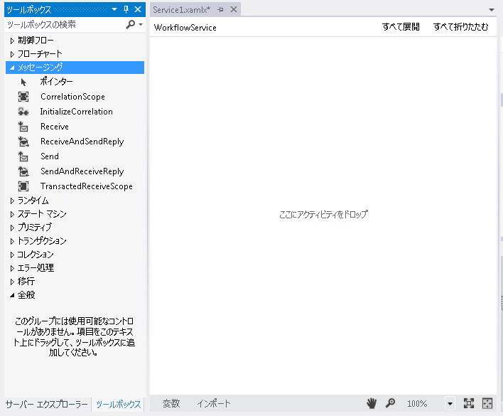
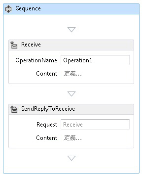
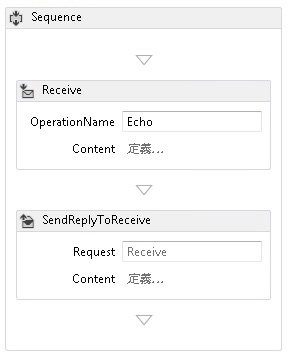
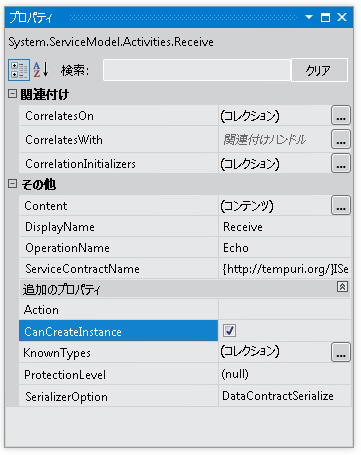
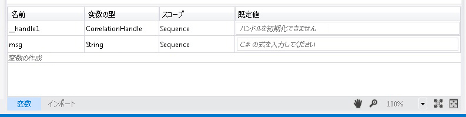
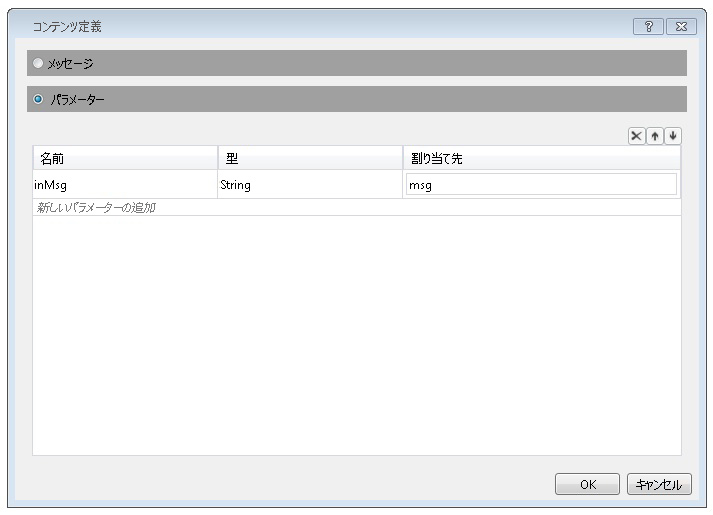
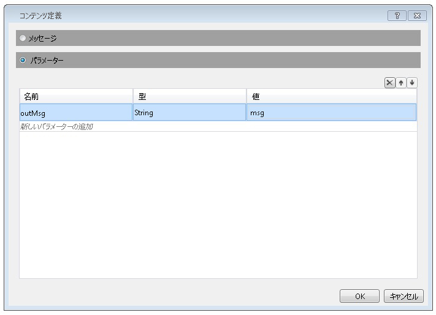

# 方法: メッセージング アクティビティを使用してワークフロー サービスを作成する
このトピックでは、メッセージング アクティビティを使用して単純なワークフロー サービスを作成する方法について説明します。 ここでは、メッセージング アクティビティだけで構成されるサービスのワークフロー サービスを作成する機構に重点を置きます。 実際のサービスでは、ワークフローに他の多くのアクティビティが含まれます。 このサービスは、文字列を取得して、それを呼び出し元に返す、Echo という 1 つの操作を実装します。 このトピックは、一連の 2 つのトピックの最初のものです。 次のトピック「 [How To: サービス アプリケーションからアクセスする、ワークフロー](../../../../docs/framework/wcf/feature-details/how-to-access-a-service-from-a-workflow-application.md)このトピックで作成したサービスを呼び出すことができるワークフロー アプリケーションを作成する方法について説明します。  
  
### ワークフロー サービス プロジェクトを作成するには  
  
1.  [!INCLUDE[vs_current_long](../../../../includes/vs-current-long-md.md)] を起動します。  
  
2.  クリックして、**ファイル**メニューの [**新規**、し**プロジェクト**を表示する、**新しいプロジェクト] ダイアログ**です。 選択**ワークフロー**インストールされたテンプレートの一覧から、 **WCF ワークフロー サービス アプリケーション**プロジェクトの種類の一覧からです。 プロジェクトに名前を`MyWFService`し、次の図に示すように既定の場所を使用します。  
  
     クリックして、 **ok**を消去するボタン、**新しいプロジェクト ダイアログ**です。  
  
3.  プロジェクトが作成されると、次の図に示すように、Service1.xamlx ファイルがデザイナーで開かれます。  
  
       
  
     ラベルの付いたアクティビティを右クリックして**シーケンシャル サービス**選択**削除**です。  
  
### ワークフロー サービスを実装するには  
  
1.  選択、**ツールボックス**ツールボックスを表示するウィンドウを開いておき、プッシュピンをクリックして、画面の左側にあるタブ。 展開、**メッセージング**セクションのツールボックスに次の図に示すように、メッセージング アクティビティおよびメッセージング アクティビティ テンプレートを表示します。  
  
       
  
2.  ドラッグ アンド ドロップ、 **ReceiveAndSendReply**テンプレートをワークフロー デザイナーにします。 これを作成、 <!--zz <xref:System.ServiceModel.Activities.Sequence>--> `System.ServiceModel.Activities.Sequence`アクティビティと、**受信**アクティビティの後に、<xref:System.ServiceModel.Activities.SendReply>アクティビティの次の図に示すようにします。  
  
       
  
     <xref:System.ServiceModel.Activities.SendReply> アクティビティの <xref:System.ServiceModel.Activities.SendReply.Request%2A> プロパティは `Receive` に設定されています。これは、<xref:System.ServiceModel.Activities.Receive> アクティビティが応答する <xref:System.ServiceModel.Activities.SendReply> アクティビティの名前です。  
  
3.  <xref:System.ServiceModel.Activities.Receive>アクティビティ タイプ`Echo`というラベルの付いたボックスに「 **OperationName**です。 これにより、サービスが実装する操作の名前が定義されます。  
  
       
  
4.  <xref:System.ServiceModel.Activities.Receive>  をクリックして開いていない場合は、アクティビティを選択すると、により、プロパティ ウィンドウを開き、**ビュー**メニューを選択して**プロパティ ウィンドウ**します。 **プロパティ ウィンドウ**が表示されるまで下へスクロール**CanCreateInstance**し、次の図に示すように、チェック ボックスをクリックします。 この設定によって、ワークフロー サービス ホストはメッセージが受信されると (必要に応じて) サービスの新しいインスタンスを作成できるようになります。  
  
       
  
5.  選択、 <!--zz <xref:System.ServiceModel.Activities.Sequence>--> `System.ServiceModel.Activities.Sequence`アクティビティをクリック、**変数**デザイナーの左下隅のボタンをクリックします。 これにより、変数エディターが開かれます。 クリックして、**変数を作成**リンクを操作に送信される文字列を格納する変数を追加します。 変数の名前`msg`設定とその**変数**次の図に示すように文字列を入力します。  
  
       
  
     クリックして、**変数**ボタンをもう一度、変数エディターを閉じます。  
  
6.  クリックして、**を定義する.** 内のリンク、**コンテンツ**テキスト ボックスに、<xref:System.ServiceModel.Activities.Receive>を表示するアクティビティ、**コンテンツ定義**ダイアログ。 選択、**パラメーター**ラジオ ボタンをクリックして、**新しいパラメーターを追加**リンクで、入力`inMsg`で、**名前**テキスト ボックスで、**文字列**で、**型**ドロップ ダウン リスト ボックス、および種類`msg`で、**を割り当てる**テキスト ボックスの次の図に示すようにします。  
  
       
  
     これにより、Receive アクティビティが文字列パラメーターを受け取り、そのデータが `msg` 変数にバインドされるように指定されます。 をクリックして**OK**を閉じる、**コンテンツ定義**ダイアログ。  
  
7.  クリックして、**を定義しています.**内のリンク、**コンテンツ**ボックスに、<xref:System.ServiceModel.Activities.SendReply>を表示するアクティビティ、**コンテンツ定義**ダイアログ。 選択、**パラメーター**ラジオ ボタンをクリックして、**新しいパラメーターを追加**リンクで、入力`outMsg`で、**名前** ボックスに、select**文字列**で、**型**ドロップダウン リスト ボックス、および`msg`で、**値**テキスト ボックスの次の図に示すようにします。  
  
       
  
     これにより、<xref:System.ServiceModel.Activities.SendReply> アクティビティがメッセージまたはメッセージ コントラクト型を送信し、そのデータが `msg` 変数にバインドされるように指定されます。 これは <xref:System.ServiceModel.Activities.SendReply> アクティビティであるため、`msg` のデータは、アクティビティがクライアントに送り返すメッセージの設定に使用されます。 をクリックして**OK**を閉じる、**コンテンツ定義**ダイアログ。  
  
8.  保存しをクリックして、ソリューションをビルド、**ビルド**メニューを選択して**ソリューションのビルド**です。  
  
## ワークフロー サービス プロジェクトの構成  
 ワークフロー サービスは完成しました。 ここでは、ホストと実行を容易にするように、ワークフロー サービス ソリューションを構成する方法について説明します。 このソリューションでは、ASP.NET 開発サーバーを使用してサービスをホストします。  
  
#### プロジェクトのスタートアップ オプションを設定するには  
  
1.  **ソリューション エクスプ ローラー**を右クリックして**MyWFService**選択**プロパティ**を表示する、**プロジェクトのプロパティ**ダイアログ。  
  
2.  選択、 **Web** ] タブを選択**特定のページ**[**開始動作**と型`Service1.xamlx`テキスト ボックスの次の図に示すようにします。  
  
     ![プロジェクトの [プロパティ] ダイアログ ボックス](../../../../docs/framework/wcf/feature-details/media/projectpropertiesdlg.JPG "ProjectPropertiesDlg")  
  
     これにより、ASP.NET 開発サーバーの Service1.xamlx で定義されたサービスがホストされます。  
  
3.  Ctrl キーを押しながら F5 キーを押して、サービスを起動します。 次の図に示すように、ASP.NET 開発サーバーのアイコンが、デスクトップの右下側に表示されます。  
  
       
  
     また、Internet Explorer に、サービスの WCF サービス ヘルプ ページが表示されます。  
  
       
  
4.  進んで、 [How To: サービス アプリケーションからアクセスする、ワークフロー](../../../../docs/framework/wcf/feature-details/how-to-access-a-service-from-a-workflow-application.md)このサービスを呼び出すワークフロー クライアントを作成するトピックです。  
  
## 関連項目  
 [ワークフロー サービス](../../../../docs/framework/wcf/feature-details/workflow-services.md)  
 [ホスト ワークフロー サービスの概要](../../../../docs/framework/wcf/feature-details/hosting-workflow-services-overview.md)  
 [メッセージング アクティビティ](../../../../docs/framework/wcf/feature-details/messaging-activities.md)
