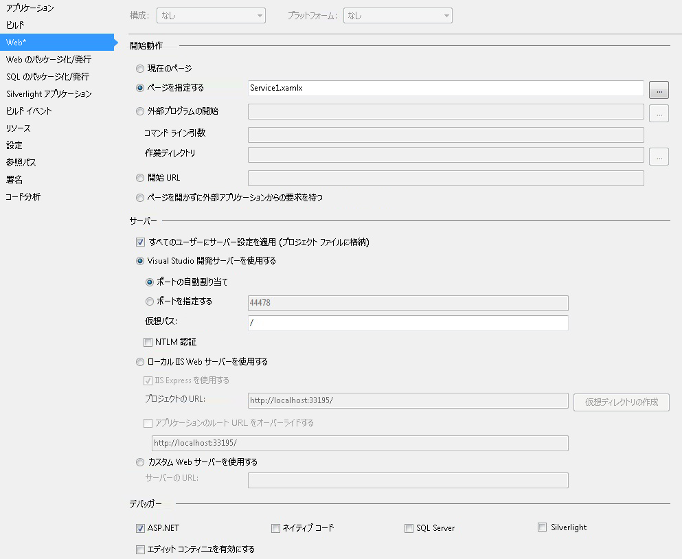

# 方法: メッセージング アクティビティを使用してワークフロー サービスを作成するHow to: Create a Workflow Service with Messaging Activities
このトピックでは、メッセージング アクティビティを使用して単純なワークフロー サービスを作成する方法について説明します。This topic describes how to create a simple workflow service using messaging activities. ここでは、メッセージング アクティビティだけで構成されるサービスのワークフロー サービスを作成する機構に重点を置きます。This topic focuses on the mechanics of creating a workflow service where the service consists solely of messaging activities. 実際のサービスでは、ワークフローに他の多くのアクティビティが含まれます。In a real-world service, the workflow contains many other activities. このサービスは、文字列を取得して、それを呼び出し元に返す、Echo という 1 つの操作を実装します。The service implements one operation called Echo, which takes a string and returns the string to the caller. このトピックは、一連の 2 つのトピックの最初のものです。This topic is the first in a series of two topics. 次のトピック「 [How To: サービス アプリケーションからアクセスする、ワークフロー](../../../../docs/framework/wcf/feature-details/how-to-access-a-service-from-a-workflow-application.md)このトピックで作成したサービスを呼び出すことができるワークフロー アプリケーションを作成する方法について説明します。The next topic [How To: Access a Service From a Workflow Application](../../../../docs/framework/wcf/feature-details/how-to-access-a-service-from-a-workflow-application.md) discusses how to create a workflow application that can call the service created in this topic.  
  
### ワークフロー サービス プロジェクトを作成するにはTo create a workflow service project  
  
1.  [!INCLUDE[vs_current_long](../../../../includes/vs-current-long-md.md)] を起動します。Start [!INCLUDE[vs_current_long](../../../../includes/vs-current-long-md.md)].  
  
2.  クリックして、**ファイル**メニューの [**新規**、し**プロジェクト**を表示する、**新しいプロジェクト] ダイアログ**です。Click the **File** menu, select **New**, and then **Project** to display the **New Project Dialog**. 選択**ワークフロー**インストールされたテンプレートの一覧から、 **WCF ワークフロー サービス アプリケーション**プロジェクトの種類の一覧からです。Select **Workflow** from the list of installed templates and **WCF Workflow Service Application** from the list of project types. プロジェクトに名前を`MyWFService`し、次の図に示すように既定の場所を使用します。Name the project `MyWFService` and use the default location as shown in the following illustration.  
  
     クリックして、 **ok**を消去するボタン、**新しいプロジェクト ダイアログ**です。Click the **OK** button to dismiss the **New Project Dialog**.  
  
3.  プロジェクトが作成されると、次の図に示すように、Service1.xamlx ファイルがデザイナーで開かれます。When the project is created, the Service1.xamlx file is opened in the designer as shown in the following illustration.  
  
       
  
     ラベルの付いたアクティビティを右クリックして**シーケンシャル サービス**選択**削除**です。Right-click the activity labeled **Sequential Service** and select **Delete**.  
  
### ワークフロー サービスを実装するにはTo implement the workflow service  
  
1.  選択、**ツールボックス**ツールボックスを表示するウィンドウを開いておき、プッシュピンをクリックして、画面の左側にあるタブ。Select the **Toolbox** tab on the left side of the screen to display the toolbox and click the pushpin to keep the window open. 展開、**メッセージング**セクションのツールボックスに次の図に示すように、メッセージング アクティビティおよびメッセージング アクティビティ テンプレートを表示します。Expand the **Messaging** section of the toolbox to display the messaging activities and the messaging activity templates as shown in the following illustration.  
  
       
  
2.  ドラッグ アンド ドロップ、 **ReceiveAndSendReply**テンプレートをワークフロー デザイナーにします。Drag and drop a **ReceiveAndSendReply** template to the workflow designer. これを作成、 <!--zz <xref:System.ServiceModel.Activities.Sequence>--> `System.ServiceModel.Activities.Sequence`アクティビティと、**受信**アクティビティの後に、<xref:System.ServiceModel.Activities.SendReply>アクティビティの次の図に示すようにします。This creates a <!--zz <xref:System.ServiceModel.Activities.Sequence>--> `System.ServiceModel.Activities.Sequence` activity with a **Receive** activity followed by a <xref:System.ServiceModel.Activities.SendReply> activity as shown in the following illustration.  
  
       
  
     <xref:System.ServiceModel.Activities.SendReply> アクティビティの <xref:System.ServiceModel.Activities.SendReply.Request%2A> プロパティは `Receive` に設定されています。これは、<xref:System.ServiceModel.Activities.Receive> アクティビティが応答する <xref:System.ServiceModel.Activities.SendReply> アクティビティの名前です。Notice that the <xref:System.ServiceModel.Activities.SendReply> activity’s <xref:System.ServiceModel.Activities.SendReply.Request%2A> property is set to `Receive`, the name of the <xref:System.ServiceModel.Activities.Receive> activity to which the <xref:System.ServiceModel.Activities.SendReply> activity is replying.  
  
3.  <xref:System.ServiceModel.Activities.Receive>アクティビティ タイプ`Echo`というラベルの付いたボックスに「 **OperationName**です。In the <xref:System.ServiceModel.Activities.Receive> activity type `Echo` into the textbox labeled **OperationName**. これにより、サービスが実装する操作の名前が定義されます。This defines the name of the operation the service implements.  
  
       
  
4.  <xref:System.ServiceModel.Activities.Receive>  をクリックして開いていない場合は、アクティビティを選択すると、により、プロパティ ウィンドウを開き、**ビュー**メニューを選択して**プロパティ ウィンドウ**します。With the <xref:System.ServiceModel.Activities.Receive> activity selected, open the properties window if not already open by clicking the **View** menu and selecting **Properties Window**. **プロパティ ウィンドウ**が表示されるまで下へスクロール**CanCreateInstance**し、次の図に示すように、チェック ボックスをクリックします。In the **Properties Window** scroll down until you see **CanCreateInstance** and click the checkbox as shown in the following illustration. この設定によって、ワークフロー サービス ホストはメッセージが受信されると (必要に応じて) サービスの新しいインスタンスを作成できるようになります。This setting enables the workflow service host to create a new instance of the service (if needed) when a message is received.  
  
       
  
5.  選択、 <!--zz <xref:System.ServiceModel.Activities.Sequence>--> `System.ServiceModel.Activities.Sequence`アクティビティをクリック、**変数**デザイナーの左下隅のボタンをクリックします。Select the <!--zz <xref:System.ServiceModel.Activities.Sequence>--> `System.ServiceModel.Activities.Sequence` activity and click the **Variables** button in the lower left corner of the designer. これにより、変数エディターが開かれます。This displays the variables editor. クリックして、**変数を作成**リンクを操作に送信される文字列を格納する変数を追加します。Click the **Create Variable** link to add a variable to store the string sent to the operation. 変数の名前`msg`設定とその**変数**次の図に示すように文字列を入力します。Name the variable `msg` and set its **Variable** type to String as shown in the following illustration.  
  
       
  
     クリックして、**変数**ボタンをもう一度、変数エディターを閉じます。Click the **Variables** button again to close the variables editor.  
  
6.  クリックして、**を定義する.**Click the **Define..** 内のリンク、**コンテンツ**テキスト ボックスに、<xref:System.ServiceModel.Activities.Receive>を表示するアクティビティ、**コンテンツ定義**ダイアログ。link in the **Content** text box in the <xref:System.ServiceModel.Activities.Receive> activity to display the **Content Definition** dialog. 選択、**パラメーター**ラジオ ボタンをクリックして、**新しいパラメーターを追加**リンクで、入力`inMsg`で、**名前**テキスト ボックスで、**文字列**で、**型**ドロップ ダウン リスト ボックス、および種類`msg`で、**を割り当てる**テキスト ボックスの次の図に示すようにします。Select the **Parameters** radio button, click the **Add new Parameter** link, type `inMsg` in the **name** text box, select **String** in the **Type** drop down list box, and type `msg` in the **Assign To** text box as shown in the following illustration.  
  
       
  
     これにより、Receive アクティビティが文字列パラメーターを受け取り、そのデータが `msg` 変数にバインドされるように指定されます。This specifies that the Receive activity receives string parameter and that data is bound to the `msg` variable. をクリックして**OK**を閉じる、**コンテンツ定義**ダイアログ。Click **OK** to close the **Content Definition** dialog.  
  
7.  クリックして、**を定義しています.**内のリンク、**コンテンツ**ボックスに、<xref:System.ServiceModel.Activities.SendReply>を表示するアクティビティ、**コンテンツ定義**ダイアログ。Click the **Define...** link in the **Content** box in the <xref:System.ServiceModel.Activities.SendReply> activity to display the **Content Definition** dialog. 選択、**パラメーター**ラジオ ボタンをクリックして、**新しいパラメーターを追加**リンクで、入力`outMsg`で、**名前** ボックスに、select**文字列**で、**型**ドロップダウン リスト ボックス、および`msg`で、**値**テキスト ボックスの次の図に示すようにします。Select the **Parameters** radio button, click the **Add new Parameter** link, type `outMsg` in the **name** textbox, select **String** in the **Type** dropdown list box, and `msg` in the **Value** text box as shown in the following illustration.  
  
       
  
     これにより、<xref:System.ServiceModel.Activities.SendReply> アクティビティがメッセージまたはメッセージ コントラクト型を送信し、そのデータが `msg` 変数にバインドされるように指定されます。This specifies that the <xref:System.ServiceModel.Activities.SendReply> activity sends a message or message contract type and that data is bound to the `msg` variable. これは <xref:System.ServiceModel.Activities.SendReply> アクティビティであるため、`msg` のデータは、アクティビティがクライアントに送り返すメッセージの設定に使用されます。Because this is a <xref:System.ServiceModel.Activities.SendReply> activity, this means the data in `msg` is used to populate the message the activity sends back to the client. をクリックして**OK**を閉じる、**コンテンツ定義**ダイアログ。Click **OK** to close the **Content Definition** dialog.  
  
8.  保存しをクリックして、ソリューションをビルド、**ビルド**メニューを選択して**ソリューションのビルド**です。Save and build the solution by clicking the **Build** menu and selecting **Build Solution**.  
  
## ワークフロー サービス プロジェクトの構成Configure the Workflow Service Project  
 ワークフロー サービスは完成しました。The workflow service is complete. ここでは、ホストと実行を容易にするように、ワークフロー サービス ソリューションを構成する方法について説明します。This section explains how to configure the workflow service solution to make it easy to host and run. このソリューションでは、ASP.NET 開発サーバーを使用してサービスをホストします。This solution uses the ASP.NET Development Server to host the service.  
  
#### プロジェクトのスタートアップ オプションを設定するにはTo set project start up options  
  
1.  **ソリューション エクスプ ローラー**を右クリックして**MyWFService**選択**プロパティ**を表示する、**プロジェクトのプロパティ**ダイアログ。In the **Solution Explorer**, right-click **MyWFService** and select **Properties** to display the **Project Properties** dialog.  
  
2.  選択、 **Web** ] タブを選択**特定のページ**[**開始動作**と型`Service1.xamlx`テキスト ボックスの次の図に示すようにします。Select the **Web** tab and select **Specific Page** under **Start Action** and type `Service1.xamlx` in the text box as shown in the following illustration.  
  
     ![プロジェクトの [プロパティ] ダイアログ ボックス](../../../../docs/framework/wcf/feature-details/media/projectpropertiesdlg.JPG "ProjectPropertiesDlg")  
  
     これにより、ASP.NET 開発サーバーの Service1.xamlx で定義されたサービスがホストされます。This hosts the service defined in Service1.xamlx in the ASP.NET Development Server.  
  
3.  Ctrl キーを押しながら F5 キーを押して、サービスを起動します。Press Ctrl + F5 to launch the service. 次の図に示すように、ASP.NET 開発サーバーのアイコンが、デスクトップの右下側に表示されます。The ASP.NET Development Server icon is displayed in the lower right side of the desktop as shown in the following image.  
  
       
  
     また、Internet Explorer に、サービスの WCF サービス ヘルプ ページが表示されます。In addition, Internet Explorer displays the WCF Service Help Page for the service.  
  
       
  
4.  進んで、 [How To: サービス アプリケーションからアクセスする、ワークフロー](../../../../docs/framework/wcf/feature-details/how-to-access-a-service-from-a-workflow-application.md)このサービスを呼び出すワークフロー クライアントを作成するトピックです。Continue on to the [How To: Access a Service From a Workflow Application](../../../../docs/framework/wcf/feature-details/how-to-access-a-service-from-a-workflow-application.md) topic to create a workflow client that calls this service.  
  
## 関連項目See Also  
 [ワークフロー サービスWorkflow Services](../../../../docs/framework/wcf/feature-details/workflow-services.md)  
 [ホスト ワークフロー サービスの概要Hosting Workflow Services Overview](../../../../docs/framework/wcf/feature-details/hosting-workflow-services-overview.md)  
 [メッセージング アクティビティMessaging Activities](../../../../docs/framework/wcf/feature-details/messaging-activities.md)
