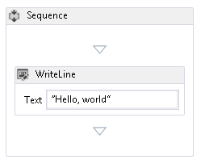
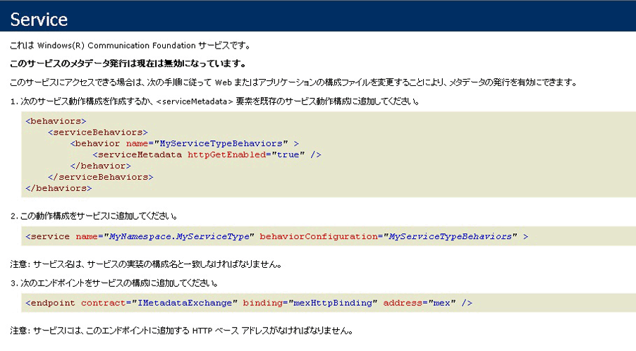

# <a name="how-to-host-a-non-service-workflow-in-iis"></a>方法 : IIS でサービス以外のワークフローをホストする
ワークフロー サービスではないワークフローは IIS/WAS でホストできます。 これは他の人が作成したワークフローをホストする必要がある場合に役に立ちます。 たとえば、ワークフロー デザイナーを再ホストして、ユーザーが独自のワークフローを作成できるようにする場合がその例です。  IIS でサービス以外のワークフローをホストすると、プロセス リサイクル、アイドル シャットダウン、処理状況の監視、メッセージ ベースのアクティブ化などの機能をサポートできます。 IIS でホストされるワークフロー サービスには <xref:System.ServiceModel.Activities.Receive> アクティビティが含まれ、IIS がメッセージを受け取るとアクティブ化されます。 サービス以外のワークフローにはメッセージング アクティビティは含まれないので、既定ではメッセージを送信することによってアクティブ化できません。  <xref:System.ServiceModel.Activities.WorkflowHostingEndpoint> からクラスを派生させ、そのワークフローのインスタンスを作成する操作を含むサービス コントラクトを定義する必要があります。 このトピックでは、手順、単純なワークフローを作成、クライアントが、ワークフローをアクティブ化に使用できるサービス コントラクトを定義およびからクラスを派生する<xref:System.ServiceModel.Activities.WorkflowHostingEndpoint>ワークフロー作成のリクエストをリッスンするように、サービス コントラクトを使用します。  
  
### <a name="create-a-simple-workflow"></a>単純なワークフローの作成  
  
1.  [!INCLUDE[vs_current_long](../../../../includes/vs-current-long-md.md)] という名前で、新しい空の `CreationEndpointTest` ソリューションを作成します。  
  
2.  `SimpleWorkflow` という新しい WCF ワークフロー サービス アプリケーション プロジェクトをソリューションに追加します。 ワークフロー デザイナーが開きます。  
  
3.  ReceiveRequest アクティビティと SendResponse アクティビティを削除します。 ワークフローはこれらのアクティビティによってワークフロー サービスになります。 ここではワークフロー サービスを使用しないので、これらのアクティビティは必要ありません。  
  
4.  DisplayName を"Sequential Workflow"にシーケンス アクティビティを設定します。  
  
5.  Service1.xamlx を Workflow1.xamlx という名前に変更します。  
  
6.  シーケンス アクティビティの外でデザイナーをクリックし、Name プロパティと ConfigurationName プロパティを"Workflow1"に設定  
  
7.  <xref:System.Activities.Statements.WriteLine> アクティビティを <xref:System.Activities.Statements.Sequence> にドラッグします。 <xref:System.Activities.Statements.WriteLine>アクティビティは含まれて、**プリミティブ**ツールボックスのセクションです。 設定、<xref:System.Activities.Statements.WriteLine.Text%2A>のプロパティ、<xref:System.Activities.Statements.WriteLine>アクティビティに「こんにちは, world」です。  
  
     この時点で、ワークフローは次の図のようになります。  
  
       
  
### <a name="create-the-workflow-creation-service-contract"></a>ワークフロー作成サービス コントラクトの作成  
  
1.  `Shared` に `CreationEndpointTest` という新しいクラス ライブラリ プロジェクトを追加します。  
  
2.  System.ServiceModel.dll、System.Configuration、および System.ServiceModel.Activities への参照を `Shared` プロジェクトに追加します。  
  
3.  Class1.cs ファイルの名前を IWorkflowCreation.cs に変更し、次のコードをそのファイルに追加します。  
  
    ```  
    using System;  
    using System.Collections.Generic;  
    using System.Linq;  
    using System.Text;  
    using System.ServiceModel;  
  
    namespace Shared  
    {  
        //service contract exposed from the endpoint  
        [ServiceContract(Name = "IWorkflowCreation")]  
        public interface IWorkflowCreation  
        {  
            [OperationContract(Name = "Create")]  
            Guid Create(IDictionary<string, object> inputs);  
  
            [OperationContract(Name = "CreateWithInstanceId", IsOneWay = true)]  
            void CreateWithInstanceId(IDictionary<string, object> inputs, Guid instanceId);  
        }  
    }  
    ```  
  
     このコントラクトは 2 つの操作を定義します。どちらも作成したサービス以外のワークフローの新しいインスタンスを作成します。 1 つは生成されたインスタンス ID を持つ新しいインスタンスを作成し、もう 1 つは新しいワークフロー インスタンスのインスタンス ID を指定できるようにします。  どちらの方法でも、新しいワークフロー インスタンスにパラメーターを渡すことができます。 このコントラクトによって公開される、<xref:System.ServiceModel.Activities.WorkflowHostingEndpoint>にクライアントがサービス以外のワークフローの新しいインスタンスを作成できるようにします。  
  
### <a name="derive-a-class-from-workflowhostingendpoint"></a>WorkflowHostingEndpoint からのクラスの派生  
  
1.  いう新しいクラスを追加`CreationEndpoint`から派生した<xref:System.ServiceModel.Activities.WorkflowHostingEndpoint>を`Shared`プロジェクト。  
  
    ```  
    using System;  
    using System.Collections.Generic;  
    using System.Diagnostics;  
    using System.Globalization;  
    using System.ServiceModel;  
    using System.ServiceModel.Activities;  
    using System.ServiceModel.Channels;  
  
    namespace Shared  
    {  
        public class CreationEndpoint : WorkflowHostingEndpoint  
        {  
        }  
    }  
    ```  
  
2.  <xref:System.Uri> というローカルの静的 `defaultBaseUri` 変数を `CreationEndpoint` クラスに追加します。  
  
    ```  
    public class CreationEndpoint : WorkflowHostingEndpoint  
    {  
        static Uri defaultBaseUri;  
    }  
    ```  
  
3.  `CreationEndpoint` クラスに次のコンストラクターを追加します。 基本コンストラクターへの呼び出しに `IWorkflowCreation` サービス コントラクトを指定することに注意してください。  
  
    ```  
    public CreationEndpoint(Binding binding, EndpointAddress address)  
       : base(typeof(IWorkflowCreation), binding, address)  
       {  
       }  
    ```  
  
4.  `CreationEndpoint` クラスに次の既定のコンストラクターを追加します。  
  
    ```  
    public CreationEndpoint()  
       : this(GetDefaultBinding(),  
       new EndpointAddress(new Uri(DefaultBaseUri, new Uri(Guid.NewGuid().ToString(), UriKind.Relative))))  
       {  
       }  
    ```  
  
5.  `DefaultBaseUri` という静的プロパティを `CreationEndpoint` クラスに追加します。 このプロパティは既定のベース URI の保持に使用されます (指定されない場合)。  
  
    ```  
    static Uri DefaultBaseUri  
    {  
       get  
       {  
          if (defaultBaseUri == null)  
          {  
             defaultBaseUri = new Uri(string.Format(CultureInfo.InvariantCulture, "net.pipe://localhost/workflowCreationEndpoint/{0}/{1}",  
                Process.GetCurrentProcess().Id,  
                AppDomain.CurrentDomain.Id));  
          }  
          return defaultBaseUri;  
       }  
     }  
    ```  
  
6.  作成エンドポイントに使用する既定のバインディングを取得するための次のメソッドを作成します。  
  
    ```  
    //defaults to NetNamedPipeBinding  
    public static Binding GetDefaultBinding()  
    {  
       return new NetNamedPipeBinding(NetNamedPipeSecurityMode.None) { TransactionFlow = true };  
    }  
    ```  
  
7.  <xref:System.ServiceModel.Activities.WorkflowHostingEndpoint.OnGetInstanceId%2A> メソッドをオーバーライドしてワークフロー インスタンス ID を返します。 場合、`Action`場合、ヘッダーが"Create"では空の GUID を返します、`Action`ヘッダーが"CreateWithInstanceId"return メソッドに渡す GUID で終了します。 それ以外の場合は、<xref:System.InvalidOperationException> がスローされます。 これらの `Action` ヘッダーは `IWorkflowCreation` サービス コントラクトで定義した 2 つの操作に対応しています。  
  
    ```  
    protected override Guid OnGetInstanceId(object[] inputs, OperationContext operationContext)  
    {  
       //Create was called by client  
       if (operationContext.IncomingMessageHeaders.Action.EndsWith("Create"))  
       {  
          return Guid.Empty;  
       }  
       //CreateWithInstanceId was called by client  
       else if (operationContext.IncomingMessageHeaders.Action.EndsWith("CreateWithInstanceId"))  
       {  
          return (Guid)inputs[1];  
       }  
       else  
       {  
          throw new InvalidOperationException("Invalid Action: " + operationContext.IncomingMessageHeaders.Action);  
       }  
    }  
    ```  
  
8.  <xref:System.ServiceModel.Activities.WorkflowHostingEndpoint.OnGetCreationContext%2A> メソッドをオーバーライドして <xref:System.ServiceModel.Activities.WorkflowCreationContext> を作成し、ワークフローに引数があれば追加し、クライアントにインスタンス ID を送信して、<xref:System.ServiceModel.Activities.WorkflowCreationContext> を返します。  
  
    ```  
    protected override WorkflowCreationContext OnGetCreationContext(object[] inputs, OperationContext operationContext, Guid instanceId, WorkflowHostingResponseContext responseContext)  
    {  
       WorkflowCreationContext creationContext = new WorkflowCreationContext();  
       if (operationContext.IncomingMessageHeaders.Action.EndsWith("Create") || (operationContext.IncomingMessageHeaders.Action.EndsWith("CreateWithInstanceId")))  
       {  
          Dictionary<string, object> arguments = (Dictionary<string, object>)inputs[0];  
          if (arguments != null && arguments.Count > 0)  
          {  
             foreach (KeyValuePair<string, object> pair in arguments)  
             {  
                //arguments to pass to the workflow  
                creationContext.WorkflowArguments.Add(pair.Key, pair.Value);  
             }  
          }  
          //reply to client with instanceId  
          responseContext.SendResponse(instanceId, null);  
       }  
       else  
       {  
          throw new InvalidOperationException("Invalid Action: " + operationContext.IncomingMessageHeaders.Action);  
       }  
       return creationContext;  
    }  
    ```  
  
### <a name="create-a-standard-endpoint-element-to-allow-you-to-configure-the-workflowcreationendpoint"></a>WorkflowCreationEndpoint の構成を可能にする標準エンドポイント要素の作成  
  
1.  `CreationEndpoint` プロジェクトの Shared への参照を追加します。  
  
2.  `CreationEndpointElement` という <xref:System.ServiceModel.Configuration.StandardEndpointElement> から派生された新しいクラスを `CreationEndpoint` プロジェクトに追加します。 このクラスは web.config ファイル内の `CreationEndpoint` を表します。  
  
    ```  
    using System;  
    using System.Configuration;  
    using System.ServiceModel.Activities;  
    using System.ServiceModel.Configuration;  
    using System.ServiceModel.Description;  
    using Shared;  
  
    namespace CreationEndpointTest  
    {  
        //config element for CreationEndpoint  
        public class CreationEndpointElement : StandardEndpointElement  
        {  
       }  
    ```  
  
3.  エンドポイントの型を返すために `EndpointType` というプロパティを追加します。  
  
    ```  
    protected override Type EndpointType  
    {  
       get { return typeof(CreationEndpoint); }  
    }  
    ```  
  
4.  <xref:System.ServiceModel.Configuration.StandardEndpointElement.CreateServiceEndpoint%2A> メソッドをオーバーライドし、`CreationEndpoint` を返します。  
  
    ```  
    protected override ServiceEndpoint CreateServiceEndpoint(ContractDescription contractDescription)  
    {  
       return new CreationEndpoint();  
    }  
    ```  
  
5.  <xref:System.ServiceModel.Configuration.StandardEndpointElement.OnApplyConfiguration%2A>、<xref:System.ServiceModel.Configuration.StandardEndpointElement.OnApplyConfiguration%2A>、<xref:System.ServiceModel.Configuration.StandardEndpointElement.OnInitializeAndValidate%2A>、および <xref:System.ServiceModel.Configuration.StandardEndpointElement.OnInitializeAndValidate%2A> の各メソッドをオーバーロードします。 これらのメソッドは定義する必要があるだけで、コードを追加する必要はありません。  
  
    ```  
    protected override void OnApplyConfiguration(ServiceEndpoint endpoint, ChannelEndpointElement channelEndpointElement)  
    {  
    }  
  
    protected override void OnApplyConfiguration(ServiceEndpoint endpoint, ServiceEndpointElement serviceEndpointElement)  
    {  
    }  
  
    protected override void OnInitializeAndValidate(ChannelEndpointElement channelEndpointElement)  
    {  
    }  
  
    protected override void OnInitializeAndValidate(ServiceEndpointElement serviceEndpointElement)  
    {  
    }  
    ```  
  
6.  `CreationEndpoint` のコレクション クラスを `CreationEndpoint` プロジェクト内の CreationEndpointElement.cs ファイルに追加します。 このクラスは構成によって使用され、web.config ファイル内に `CreationEndpoint` のインスタンス数を格納します。  
  
    ```  
    public class CreationEndpointCollection : StandardEndpointCollectionElement<CreationEndpoint, CreationEndpointElement>  
    {  
    }  
    ```  
  
7.  ソリューションをビルドします。  
  
### <a name="host-the-workflow-in-iis"></a>IIS でのワークフローのホスト  
  
1.  IIS 内に `MyCreationEndpoint` という新しいアプリケーションを作成します。  
  
2.  ワークフロー デザイナーによって生成された workflow1.xaml というファイルをアプリケーション ディレクトリにコピーして、その名前を workflow1.xamlx に変更します。  
  
3.  shared.dll と CreationEndpoint.dll というファイルをアプリケーションの bin ディレクトリにコピーします (bin ディレクトリは存在しなければ作成します)。  
  
4.  `CreationEndpoint` プロジェクト内の Web.config ファイルの内容を次のコードで置き換えます。  
  
    ```xaml  
    <?xml version="1.0" encoding="utf-8" ?>  
    <configuration>  
      <system.web>  
        <compilation debug="true" targetFramework="4.0" />  
      </system.web>   
    </configuration>  
    ```  
  
5.  `<system.web>` 要素の後に、次の構成コードを追加して、`CreationEndpoint` を登録します。  
  
    ```xml  
    <system.serviceModel>  
        <!--register CreationEndpoint-->  
        <serviceHostingEnvironment multipleSiteBindingsEnabled="true" />  
        <extensions>  
          <endpointExtensions>  
            <add name="creationEndpoint" type="CreationEndpointTest.CreationEndpointCollection, CreationEndpoint, Version=1.0.0.0, Culture=neutral, PublicKeyToken=null" />  
          </endpointExtensions>  
        </extensions>  
    </system.serviceModel>  
    ```  
  
     これによって、`CreationEndpointCollection` クラスが登録され、web.config ファイル内で `CreationEndpoint` を構成できるようになります。  
  
6.  追加、`<service>`要素 (後、 \</extensions > タグ) と、`CreationEndpoint`受信メッセージをリッスンします。  
  
    ```xml  
    <services>  
          <!-- add endpoint to service-->  
          <service name="Workflow1" behaviorConfiguration="basicConfig" >  
            <endpoint kind="creationEndpoint" binding="basicHttpBinding" address=""/>  
          </service>  
        </services>  
    ```  
  
7.  追加、\<動作 > 要素 (後、 \</サービス > タグ) をサービス メタデータを有効にします。  
  
    ```xml  
    <behaviors>  
          <serviceBehaviors>  
            <behavior name="basicConfig">  
              <serviceMetadata httpGetEnabled="true" />  
            </behavior>  
          </serviceBehaviors>  
        </behaviors>  
    ```  
  
8.  web.config ファイルを IIS アプリケーション ディレクトリにコピーします。  
  
9. 作成エンドポイントが機能して Internet Explorer を起動しを参照するかどうかを確認するテストhttp://localhost/MyCreationEndpoint/Workflow1.xamlxです。 Internet Explorer には次のような画面が表示されます。  
  
       
  
### <a name="create-a-client-that-will-call-the-creationendpoint"></a>CreationEndpoint を呼び出すクライアントの作成  
  
1.  新しいコンソール アプリケーションを `CreationEndpointTest` ソリューションに追加します。  
  
2.  System.ServiceModel.dll、System.ServiceModel.Activities、および `Shared` プロジェクトへの参照を追加します。  
  
3.  `Main`メソッドを作成、<xref:System.ServiceModel.ChannelFactory%601>型の`IWorkflowCreation`を呼び出すと<xref:System.ServiceModel.ChannelFactory%601.CreateChannel%2A>です。 これはプロキシを返します。 次に、そのプロキシの `Create` を呼び出して、IIS でホストされるワークフロー インスタンスを作成します。  
  
    ```  
    using System.Text;  
    using Shared;  
    using System.ServiceModel;  
  
    namespace CreationEndpointClient  
    {  
        class Program  
        {  
            static void Main(string[] args)  
            {  
                try  
                {  
                    //client using BasicHttpBinding  
                    IWorkflowCreation client = new ChannelFactory<IWorkflowCreation>(new BasicHttpBinding(), new EndpointAddress("http://localhost/CreationEndpoint/Workflow1.xamlx")).CreateChannel();  
  
                    Console.WriteLine("Workflow Instance created using CreationEndpoint added in config. Instance Id: {0}", client.Create(null));  
                    Console.WriteLine("Press return to exit ...");  
                    Console.ReadLine();  
                }  
                catch (Exception ex)  
                {  
                    Console.WriteLine(ex);  
                    Console.ReadLine();  
                }  
            }  
        }  
    }  
    ```  
  
4.  CreationEndpointClient を実行します。 出力の内容は次のようになります。  
  
    ```Output  
    Workflow Instance created using CreationEndpoint added in config. Instance Id: 0875dac0-2b8b-473e-b3cc-abcb235e9693Press return to exit ...  
    ```  
  
    > [!NOTE]
    >  ワークフローの出力は表示されません。これはコンソール出力を持たない IIS を使って実行しているためです。  
  
## <a name="example"></a>例  
 以下はこのサンプルの完全なコードです。  
  
```xaml  
<!-— workflow1.xamlx -->  
<WorkflowService mc:Ignorable="sap"   
                 ConfigurationName="Workflow1"   
                 sap:VirtualizedContainerService.HintSize="263,230"   
                 Name="Workflow1"   
                 mva:VisualBasic.Settings="Assembly references and imported namespaces serialized as XML namespaces"   
                 xmlns="http://schemas.microsoft.com/netfx/2009/xaml/servicemodel"   
                 xmlns:mc="http://schemas.openxmlformats.org/markup-compatibility/2006"   
                 xmlns:mv="clr-namespace:Microsoft.VisualBasic;assembly=System"   
                 xmlns:mva="clr-namespace:Microsoft.VisualBasic.Activities;assembly=System.Activities"   
                 xmlns:p="http://schemas.microsoft.com/netfx/2009/xaml/activities"   
                 xmlns:s="clr-namespace:System;assembly=mscorlib"   
                 xmlns:s1="clr-namespace:System;assembly=System"   
                 xmlns:s2="clr-namespace:System;assembly=System.Xml"   
                 xmlns:s3="clr-namespace:System;assembly=System.Core"   
                 xmlns:sad="clr-namespace:System.Activities.Debugger;assembly=System.Activities"   
                 xmlns:sap="http://schemas.microsoft.com/netfx/2009/xaml/activities/presentation"   
                 xmlns:scg="clr-namespace:System.Collections.Generic;assembly=System"   
                 xmlns:scg1="clr-namespace:System.Collections.Generic;assembly=System.ServiceModel"   
                 xmlns:scg2="clr-namespace:System.Collections.Generic;assembly=System.Core"   
                 xmlns:scg3="clr-namespace:System.Collections.Generic;assembly=mscorlib"   
                 xmlns:sd="clr-namespace:System.Data;assembly=System.Data"   
                 xmlns:sl="clr-namespace:System.Linq;assembly=System.Core"   
                 xmlns:st="clr-namespace:System.Text;assembly=mscorlib"   
                 xmlns:x="http://schemas.microsoft.com/winfx/2006/xaml">  
  <p:Sequence DisplayName="Sequential Service"   
              sad:XamlDebuggerXmlReader.FileName="c:\projects\CreationEndpointTest\CreationEndpoint\Service1.xamlx"   
              sap:VirtualizedContainerService.HintSize="233,200"   
              mva:VisualBasic.Settings="Assembly references and imported namespaces serialized as XML namespaces">  
    <p:Sequence.Variables>  
      <p:Variable x:TypeArguments="CorrelationHandle" Name="handle" />  
      <p:Variable x:TypeArguments="x:Int32" Name="data" />  
    </p:Sequence.Variables>  
    <sap:WorkflowViewStateService.ViewState>  
      <scg3:Dictionary x:TypeArguments="x:String, x:Object">  
        <x:Boolean x:Key="IsExpanded">True</x:Boolean>  
      </scg3:Dictionary>  
    </sap:WorkflowViewStateService.ViewState>  
    <p:WriteLine sap:VirtualizedContainerService.HintSize="211,61" Text="Hello, world" />  
  </p:Sequence>  
</WorkflowService>  
```  
  
```csharp  
// CreationEndpointElement.cs  
using System;  
using System.Configuration;  
using System.ServiceModel.Activities;  
using System.ServiceModel.Configuration;  
using System.ServiceModel.Description;  
using Shared;  
  
namespace CreationEndpointTest  
{  
    //config element for CreationEndpoint  
    public class CreationEndpointElement : StandardEndpointElement  
    {  
        protected override Type EndpointType  
        {  
            get { return typeof(CreationEndpoint); }  
        }  
  
        protected override ConfigurationPropertyCollection Properties  
        {  
            get  
            {  
                ConfigurationPropertyCollection properties = base.Properties;  
                properties.Add(new ConfigurationProperty("name", typeof(String), null, ConfigurationPropertyOptions.IsRequired));  
                return properties;  
            }  
        }  
  
        protected override ServiceEndpoint CreateServiceEndpoint(ContractDescription contractDescription)  
        {  
            return new CreationEndpoint();  
        }  
  
        protected override void OnApplyConfiguration(ServiceEndpoint endpoint, ChannelEndpointElement channelEndpointElement)  
        {  
        }  
  
        protected override void OnApplyConfiguration(ServiceEndpoint endpoint, ServiceEndpointElement serviceEndpointElement)  
        {  
        }  
  
        protected override void OnInitializeAndValidate(ChannelEndpointElement channelEndpointElement)  
        {  
        }  
  
        protected override void OnInitializeAndValidate(ServiceEndpointElement serviceEndpointElement)  
        {  
        }  
    }  
  
    public class CreationEndpointCollection : StandardEndpointCollectionElement<CreationEndpoint, CreationEndpointElement>  
    {  
    }  
}  
```  
  
```xml  
<!-- web.config -->  
<?xml version="1.0" encoding="utf-8" ?>  
<configuration>  
  <system.web>  
    <compilation debug="true" targetFramework="4.0" />  
  </system.web>  
  <system.serviceModel>  
    <!--register CreationEndpoint-->  
    <serviceHostingEnvironment multipleSiteBindingsEnabled="true" />  
    <extensions>  
      <endpointExtensions>  
        <add name="creationEndpoint" type="CreationEndpointTest.CreationEndpointCollection, Shared, Version=1.0.0.0, Culture=neutral, PublicKeyToken=null" />  
      </endpointExtensions>  
    </extensions>  
    <services>  
      <!-- add endpoint to service-->  
      <service name="Workflow1" behaviorConfiguration="basicConfig" >  
        <endpoint kind="creationEndpoint" binding="basicHttpBinding" address=""/>  
      </service>  
    </services>  
    <behaviors>  
      <serviceBehaviors>  
        <behavior name="basicConfig">  
          <serviceMetadata httpGetEnabled="true" />  
        </behavior>  
      </serviceBehaviors>  
    </behaviors>  
  </system.serviceModel>  
</configuration>  
```  
  
```csharp  
// IWorkflowCreation.cs  
using System;  
using System.Collections.Generic;  
using System.Linq;  
using System.Text;  
using System.ServiceModel;  
  
namespace Shared  
{  
    //service contract exposed from the endpoint  
    [ServiceContract(Name = "IWorkflowCreation")]  
    public interface IWorkflowCreation  
    {  
        [OperationContract(Name = "Create")]  
        Guid Create(IDictionary<string, object> inputs);  
  
        [OperationContract(Name = "CreateWithInstanceId", IsOneWay = true)]  
        void CreateWithInstanceId(IDictionary<string, object> inputs, Guid instanceId);  
    }  
}  
```  
  
```csharp  
// CreationEndpoint.cs  
using System;  
using System.Collections.Generic;  
using System.Linq;  
using System.Text;  
using System.ServiceModel.Activities;  
using System.ServiceModel.Channels;  
using System.ServiceModel;  
using System.Globalization;  
using System.Diagnostics;  
  
namespace Shared  
{  
    public class CreationEndpoint : WorkflowHostingEndpoint  
    {  
        static Uri defaultBaseUri;  
  
        public CreationEndpoint(Binding binding, EndpointAddress address)  
            : base(typeof(IWorkflowCreation), binding, address) { }  
  
        public CreationEndpoint()  
            : this(GetDefaultBinding(),  
                new EndpointAddress(new Uri(DefaultBaseUri, new Uri(Guid.NewGuid().ToString(), UriKind.Relative)))) { }  
  
        static Uri DefaultBaseUri  
        {  
            get  
            {  
                if (defaultBaseUri == null)  
                {  
                    defaultBaseUri = new Uri(string.Format(CultureInfo.InvariantCulture, "net.pipe://localhost/workflowCreationEndpoint/{0}/{1}",  
                        Process.GetCurrentProcess().Id,  
                        AppDomain.CurrentDomain.Id));  
                }  
                return defaultBaseUri;  
            }  
        }  
  
        //defaults to NetNamedPipeBinding  
        public static Binding GetDefaultBinding()  
        {  
            return new NetNamedPipeBinding(NetNamedPipeSecurityMode.None) { TransactionFlow = true };  
        }  
  
        protected override Guid OnGetInstanceId(object[] inputs, OperationContext operationContext)  
        {  
            //Create was called by client  
            if (operationContext.IncomingMessageHeaders.Action.EndsWith("Create"))  
            {  
                return Guid.Empty;  
            }  
  
            //CreateWithInstanceId was called by client  
            else if (operationContext.IncomingMessageHeaders.Action.EndsWith("CreateWithInstanceId"))  
            {  
                return (Guid)inputs[1];  
            }  
            else  
            {  
                throw new InvalidOperationException("Invalid Action: " + operationContext.IncomingMessageHeaders.Action);  
            }  
        }  
  
        protected override WorkflowCreationContext OnGetCreationContext(object[] inputs, OperationContext operationContext, Guid instanceId, WorkflowHostingResponseContext responseContext)  
        {  
            WorkflowCreationContext creationContext = new WorkflowCreationContext();  
            if (operationContext.IncomingMessageHeaders.Action.EndsWith("Create"))  
            {  
                Dictionary<string, object> arguments = (Dictionary<string, object>)inputs[0];  
                if (arguments != null && arguments.Count > 0)  
                {  
                    foreach (KeyValuePair<string, object> pair in arguments)  
                    {  
                        //arguments to pass to the workflow  
                        creationContext.WorkflowArguments.Add(pair.Key, pair.Value);  
                    }  
                }  
                //reply to client with instanceId  
                responseContext.SendResponse(instanceId, null);  
            }  
            else if (operationContext.IncomingMessageHeaders.Action.EndsWith("CreateWithInstanceId"))  
            {  
                Dictionary<string, object> arguments = (Dictionary<string, object>)inputs[0];  
                if (arguments != null && arguments.Count > 0)  
                {  
                    foreach (KeyValuePair<string, object> pair in arguments)  
                    {  
                        //arguments to pass to workflow  
                        creationContext.WorkflowArguments.Add(pair.Key, pair.Value);  
                    }  
                }  
            }  
            else  
            {  
                throw new InvalidOperationException("Invalid Action: " + operationContext.IncomingMessageHeaders.Action);  
            }  
            return creationContext;  
        }  
    }  
}  
```  
  
```csharp  
// CreationEndpointClient.cs  
using System;  
using System.Collections.Generic;  
using System.Linq;  
using System.Text;  
using Shared;  
using System.ServiceModel;  
  
namespace CreationClient  
{  
    class Program  
    {  
        static void Main(string[] args)  
        {  
            try  
            {  
                //client using BasicHttpBinding  
                IWorkflowCreation client = new ChannelFactory<IWorkflowCreation>(new BasicHttpBinding(), new EndpointAddress("http://localhost/MyCreationEndpoint/Workflow1.xamlx")).CreateChannel();  
  
                Console.WriteLine("Workflow Instance created using CreationEndpoint added in config. Instance Id: {0}", client.Create(null));  
                Console.WriteLine("Press return to exit ...");  
                Console.ReadLine();  
            }  
            catch (Exception ex)  
            {  
                Console.WriteLine(ex);  
                Console.ReadLine();  
            }  
  
        }  
    }  
  
}  
```  
  
 この例では `IWorkflowCreation` を実装するサービスを実装しないので、わかりにくい可能性があります。 これは、`CreationEndpoint` がユーザーに代わって実装するためです。  
  
## <a name="see-also"></a>関連項目  
 [ワークフロー サービス](../../../../docs/framework/wcf/feature-details/workflow-services.md)  
 [インターネット インフォメーション サービスでのホスティング](../../../../docs/framework/wcf/feature-details/hosting-in-internet-information-services.md)  
 [インターネット インフォメーション サービス ホスティングのベスト プラクティス](../../../../docs/framework/wcf/feature-details/internet-information-services-hosting-best-practices.md)  
 [インターネット インフォメーション サービスのホスティング手順](../../../../docs/framework/wcf/samples/internet-information-service-hosting-instructions.md)  
 [Windows Workflow のアーキテクチャ](../../../../docs/framework/windows-workflow-foundation/architecture.md)  
 [WorkflowHostingEndpoint 再開ブックマーク](../../../../docs/framework/windows-workflow-foundation/samples/workflowhostingendpoint-resume-bookmark.md)  
 [ワークフロー デザイナーのホスト変更](../../../../docs/framework/windows-workflow-foundation/rehosting-the-workflow-designer.md)  
 [Windows Workflow の概要](../../../../docs/framework/windows-workflow-foundation/overview.md)
