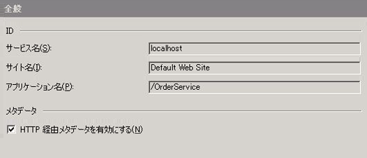
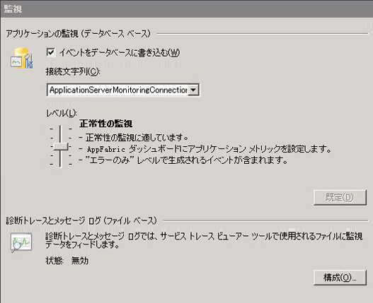
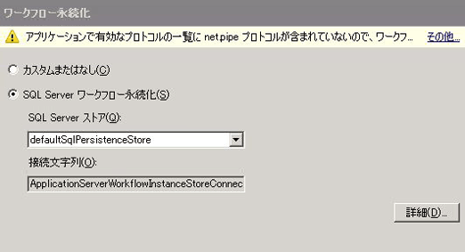
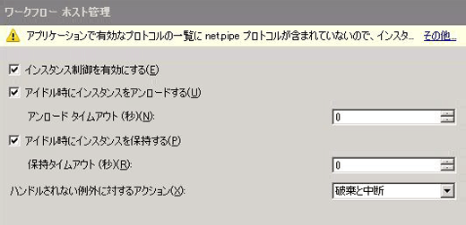
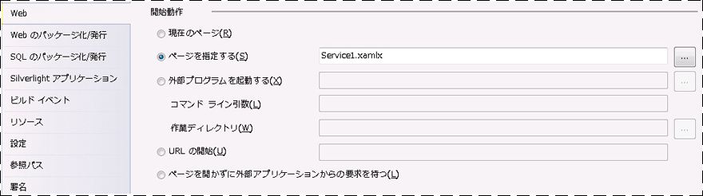
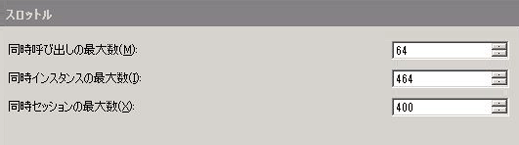
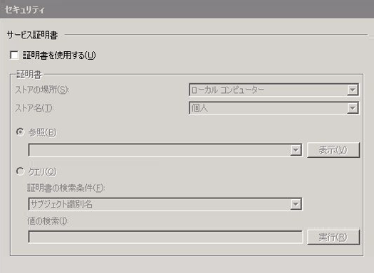
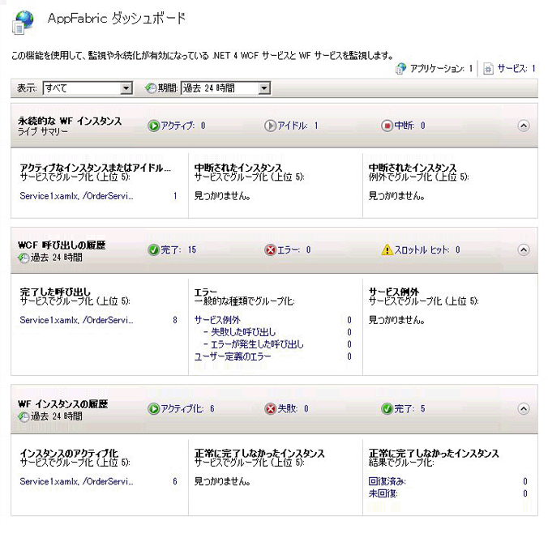
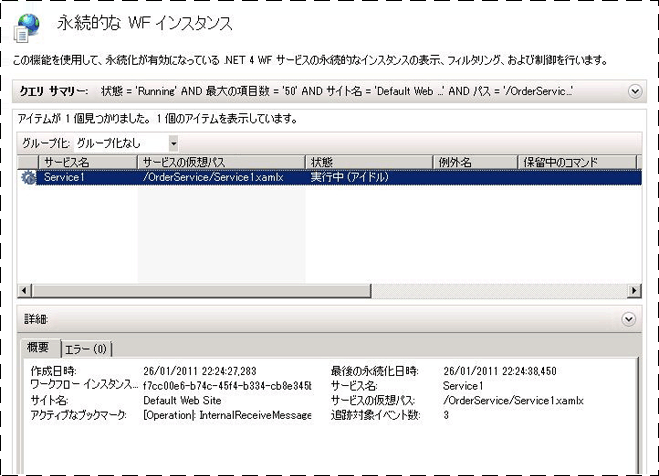

# 方法 : Windows Server AppFabric を使用してワークフロー サービスをホストする
AppFabric でのワークフロー サービスのホスティングは IIS\/WAS でのホスティングに似ています。唯一の違いは、ワークフロー サービスの投入、監視、および管理のために AppFabric に用意されているツールです。このトピックでは「[長時間のワークフロー サービスの作成](../../../../docs/framework/wcf/feature-details/creating-a-long-running-workflow-service.md)」で作成されたワークフロー サービスを使用します。ワークフロー サービスの作成方法はそちらのトピックで説明されています。このトピックでは、AppFabric を使用したワークフロー サービスのホスティング方法を説明します。Windows Server AppFabric [!INCLUDE[crabout](../../../../includes/crabout-md.md)]、[Windows Server AppFabric のドキュメント](http://go.microsoft.com/fwlink/?LinkID=193037&clcid=0x409)を参照してください。下の手順を完了する前に、Windows Server AppFabric がインストールされていることを確認してください。それには、Internet Information Services \(inetmgr.exe\) を開いて、**\[接続\]** ビューでサーバー名をクリックし、\[サイト\] をクリックして、**\[既定の Web サイト\]** をクリックします。画面の右側に **\[AppFabric\]** というセクションが表示されます。\(右側のペインの一番上に表示される\) このセクションが表示されないのであれば、AppFabric がインストールされていません。Windows Server AppFabric のインストール[!INCLUDE[crabout](../../../../includes/crabout-md.md)]、「[Windows Server AppFabric のインストール](http://go.microsoft.com/fwlink/?LinkId=193136)」を参照してください。  
  
### 単純なワークフロー サービスの作成  
  
1.  [!INCLUDE[vs_current_long](../../../../includes/vs-current-long-md.md)] を開き、「[長時間のワークフロー サービスの作成](../../../../docs/framework/wcf/feature-details/creating-a-long-running-workflow-service.md)」のトピックで作成した OrderProcessing ソリューションを読み込みます。  
  
2.  **\[OrderService\]** プロジェクトを右クリックし、**\[プロパティ\]** をクリックして、**\[Web\]** タブをクリックします。  
  
3.  プロパティ ページの **\[開始動作\]** セクションで **\[ページを指定する\]** をクリックして、編集ボックスに「Service1.xamlx」と入力します。  
  
4.  プロパティ ページの **\[サーバー\]** セクションで **\[ローカル IIS Web サーバーを使用する\]** をクリックして、「`http://localhost/OrderService`」と入力します。  
  
5.  **\[仮想ディレクトリの作成\]** ボタンをクリックします。これで新しい仮想ディレクトリが作成され、プロジェクトが作成されるときに必要なファイルが仮想ディレクトリにコピーされるようにプロジェクトが設定されます。または、仮想ディレクトリに .xamlx、web.config、および必要な DLL を手動でコピーすることもできます。  
  
### Windows Server AppFabric でホストされるワークフロー サービスの構成  
  
1.  インターネット インフォメーション サービス マネージャー \(inetmgr.exe\) を開きます。  
  
2.  **\[接続\]** ペインで OrderService 仮想ディレクトリに移動します。  
  
3.  OrderService を右クリックし、**\[WCF サービスと WF サービスの管理\]**、**\[構成\]** の順にクリックします。**\[アプリケーションの WCF と WF の構成\]** ダイアログ ボックスが表示されます。  
  
4.  **\[全般\]** タブをクリックして、次のスクリーン ショットに示すようなアプリケーションに関する全般的な情報を表示します。  
  
       
  
5.  **\[監視\]** タブをクリックします。次のスクリーン ショットに示すような各種の監視設定が表示されます。  
  
       
  
     AppFabric におけるワークフロー サービスの監視を構成する手順[!INCLUDE[crabout](../../../../includes/crabout-md.md)]、AppFabric ドキュメントの「[監視を構成する](http://go.microsoft.com/fwlink/?LinkId=193153)」を参照してください。  
  
6.  **\[ワークフローの永続化\]** タブをクリックします。ここでは、次のスクリーン ショットに示すように、AppFabric の既定の永続化プロバイダーをアプリケーションで使用するように構成できます。  
  
       
  
     Windows Server AppFabric におけるワークフロー永続化を構成する手順[!INCLUDE[crabout](../../../../includes/crabout-md.md)]、AppFabric ドキュメントの「[ワークフロー永続化を構成する](http://go.microsoft.com/fwlink/?LinkId=193148)」を参照してください。  
  
7.  **\[ワークフロー ホスト管理\]** タブをクリックします。ここでは、次のスクリーン ショットに見られるように、アイドル状態のワークフロー サービス インスタンスをいつアンロードして永続化するかを指定できます。  
  
       
  
     ワークフロー ホスト管理の構成[!INCLUDE[crabout](../../../../includes/crabout-md.md)]、AppFabric ドキュメントの「[ワークフロー ホスト管理を構成する](http://go.microsoft.com/fwlink/?LinkId=193151)」を参照してください。  
  
8.  **\[自動開始\]** タブをクリックします。ここでは、次のスクリーン ショットに示すように、アプリケーションでのワークフロー サービスに対する自動開始の設定を指定できます。  
  
       
  
     自動開始の構成手順[!INCLUDE[crabout](../../../../includes/crabout-md.md)]、AppFabric ドキュメントの「[自動開始の構成](http://go.microsoft.com/fwlink/?LinkId=193150)」を参照してください。  
  
9. **\[スロットル\]** タブをクリックします。ここでは、次のスクリーン ショットに示すように、ワークフロー サービスのスロットル設定を構成できます。  
  
       
  
     スロットルの構成手順[!INCLUDE[crabout](../../../../includes/crabout-md.md)]、AppFabric ドキュメントの「[スロットルを構成する](http://go.microsoft.com/fwlink/?LinkId=193149)」を参照してください。  
  
10. **\[セキュリティ\]** タブをクリックします。ここでは、次のスクリーン ショットに示すように、アプリケーションに対するセキュリティの設定を構成できます。  
  
       
  
     Windows Server AppFabric でのセキュリティの構成手順[!INCLUDE[crabout](../../../../includes/crabout-md.md)]、AppFabric ドキュメントの「[セキュリティの構成](http://go.microsoft.com/fwlink/?LinkId=193152)」を参照してください。  
  
### Windows Server AppFabric の使用  
  
1.  ソリューションを作成して、仮想ディレクトリに必要なファイルをコピーします。  
  
2.  OrderClient プロジェクトを右クリックし、**\[デバッグ\]**、**\[新しいインスタンスを開始\]** の順にクリックして、クライアント アプリケーションを実行します。  
  
3.  クライアントが実行され、Visual Studio により **\[アタッチのセキュリティ警告\]** ダイアログ ボックスが表示されたら、**\[アタッチしない\]** ボタンをクリックします。これにより、IIS プロセスにアタッチしてデバッグしないように Visual Studio に指示します。  
  
4.  クライアント アプリケーションは直ちにワークフロー サービスを呼び出して待機します。ワークフロー サービスはアイドル状態になり永続化されます。これは、インターネット インフォメーション サービス \(inetmgr.exe\) を開始して、\[接続\] ペインで \[OrderService\] に移動し、それを選択することによって確認できます。次に、右側のペインで \[AppFabric ダッシュボード\] のアイコンをクリックします。次のスクリーン ショットに示すように、\[永続的な WF インスタンス\] の下に、永続化されたワークフロー サービスのインスタンスが 1 つ表示されます。  
  
       
  
     **\[WF インスタンスの履歴\]** には、ワークフロー サービスのアクティベーション数、ワークフロー サービス インスタンスの完了数、ワークフロー インスタンスの失敗数など、そのワークフロー サービスに関する情報が表示されます。\[アクティブなインスタンスまたはアイドル状態のインスタンス\] の下に表示されるリンクをクリックすると、次のスクリーン ショットに示すように、アイドル状態のワークフロー インスタンスの詳細情報が表示されます。  
  
       
  
     Windows Server AppFabric の機能に関する詳細については、「[AppFabric のホスティング機能](http://go.microsoft.com/fwlink/?LinkID=193143&clcid=0x409)」を参照してください。  
  
## 参照  
 [長時間のワークフロー サービスの作成](../../../../docs/framework/wcf/feature-details/creating-a-long-running-workflow-service.md)   
 [AppFabric のホスティング機能](http://go.microsoft.com/fwlink/?LinkId=193143)   
 [Windows Server AppFabric のインストール](http://go.microsoft.com/fwlink/?LinkId=193136)   
 [Windows Server AppFabric のドキュメント](http://go.microsoft.com/fwlink/?LinkID=193037&clcid=0x409)