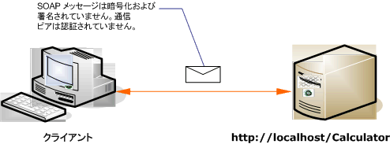

# <a name="internet-unsecured-client-and-service"></a><span data-ttu-id="5b2b7-102">セキュリティで保護されていないインターネット環境のクライアントとサービス</span><span class="sxs-lookup"><span data-stu-id="5b2b7-102">Internet Unsecured Client and Service</span></span>
<span data-ttu-id="5b2b7-103">セキュリティで保護されていないパブリックな [!INCLUDE[indigo1](../../../../includes/indigo1-md.md)] クライアントとサービスの例を次の図に示します。</span><span class="sxs-lookup"><span data-stu-id="5b2b7-103">The following illustration shows an example of a public, unsecured [!INCLUDE[indigo1](../../../../includes/indigo1-md.md)] client and service.</span></span>  
  
 <span data-ttu-id="5b2b7-104"></span><span class="sxs-lookup"><span data-stu-id="5b2b7-104"></span></span>  
  
|<span data-ttu-id="5b2b7-105">特徴</span><span class="sxs-lookup"><span data-stu-id="5b2b7-105">Characteristic</span></span>|<span data-ttu-id="5b2b7-106">説明</span><span class="sxs-lookup"><span data-stu-id="5b2b7-106">Description</span></span>|  
|--------------------|-----------------|  
|<span data-ttu-id="5b2b7-107">セキュリティ モード</span><span class="sxs-lookup"><span data-stu-id="5b2b7-107">Security Mode</span></span>|<span data-ttu-id="5b2b7-108">なし</span><span class="sxs-lookup"><span data-stu-id="5b2b7-108">None</span></span>|  
|<span data-ttu-id="5b2b7-109">Transport</span><span class="sxs-lookup"><span data-stu-id="5b2b7-109">Transport</span></span>|<span data-ttu-id="5b2b7-110">HTTP</span><span class="sxs-lookup"><span data-stu-id="5b2b7-110">HTTP</span></span>|  
|<span data-ttu-id="5b2b7-111">バインド</span><span class="sxs-lookup"><span data-stu-id="5b2b7-111">Binding</span></span>|<span data-ttu-id="5b2b7-112"><xref:System.ServiceModel.BasicHttpBinding>コードでは、または[ \<basicHttpBinding >](../../../../docs/framework/configure-apps/file-schema/wcf/basichttpbinding.md)構成内の要素。</span><span class="sxs-lookup"><span data-stu-id="5b2b7-112"><xref:System.ServiceModel.BasicHttpBinding> in code, or the [\<basicHttpBinding>](../../../../docs/framework/configure-apps/file-schema/wcf/basichttpbinding.md) element in configuration.</span></span>|  
|<span data-ttu-id="5b2b7-113">相互運用性</span><span class="sxs-lookup"><span data-stu-id="5b2b7-113">Interoperability</span></span>|<span data-ttu-id="5b2b7-114">既存の Web サービス クライアントとサービスを使用する</span><span class="sxs-lookup"><span data-stu-id="5b2b7-114">With existing Web service clients and services</span></span>|  
|<span data-ttu-id="5b2b7-115">認証</span><span class="sxs-lookup"><span data-stu-id="5b2b7-115">Authentication</span></span>|<span data-ttu-id="5b2b7-116">なし</span><span class="sxs-lookup"><span data-stu-id="5b2b7-116">None</span></span>|  
|<span data-ttu-id="5b2b7-117">整合性</span><span class="sxs-lookup"><span data-stu-id="5b2b7-117">Integrity</span></span>|<span data-ttu-id="5b2b7-118">なし</span><span class="sxs-lookup"><span data-stu-id="5b2b7-118">None</span></span>|  
|<span data-ttu-id="5b2b7-119">機密性</span><span class="sxs-lookup"><span data-stu-id="5b2b7-119">Confidentiality</span></span>|<span data-ttu-id="5b2b7-120">なし</span><span class="sxs-lookup"><span data-stu-id="5b2b7-120">None</span></span>|  
  
## <a name="service"></a><span data-ttu-id="5b2b7-121">サービス</span><span class="sxs-lookup"><span data-stu-id="5b2b7-121">Service</span></span>  
 <span data-ttu-id="5b2b7-122">次のコードと構成は、別々に実行します。</span><span class="sxs-lookup"><span data-stu-id="5b2b7-122">The following code and configuration are meant to run independently.</span></span> <span data-ttu-id="5b2b7-123">次のいずれかの操作を行います。</span><span class="sxs-lookup"><span data-stu-id="5b2b7-123">Do one of the following:</span></span>  
  
-   <span data-ttu-id="5b2b7-124">構成を使用せずに、コードを使用してスタンドアロン サービスを作成します。</span><span class="sxs-lookup"><span data-stu-id="5b2b7-124">Create a stand-alone service using the code with no configuration.</span></span>  
  
-   <span data-ttu-id="5b2b7-125">提供された構成を使用してサービスを作成しますが、エンドポイントを定義しません。</span><span class="sxs-lookup"><span data-stu-id="5b2b7-125">Create a service using the supplied configuration, but do not define any endpoints.</span></span>  
  
### <a name="code"></a><span data-ttu-id="5b2b7-126">コード</span><span class="sxs-lookup"><span data-stu-id="5b2b7-126">Code</span></span>  
 <span data-ttu-id="5b2b7-127">次のコードは、セキュリティで保護されないエンドポイントを作成する方法を示しています。</span><span class="sxs-lookup"><span data-stu-id="5b2b7-127">The following code shows how to create an endpoint with no security.</span></span> <span data-ttu-id="5b2b7-128">既定では、<xref:System.ServiceModel.BasicHttpBinding> のセキュリティ モードは <xref:System.ServiceModel.BasicHttpSecurityMode.None> に設定されます。</span><span class="sxs-lookup"><span data-stu-id="5b2b7-128">By default, the <xref:System.ServiceModel.BasicHttpBinding> has the security mode set to <xref:System.ServiceModel.BasicHttpSecurityMode.None>.</span></span>  
  
 [!code-csharp[C_UnsecuredService#1](../../../../samples/snippets/csharp/VS_Snippets_CFX/c_unsecuredservice/cs/source.cs#1)]
 [!code-vb[C_UnsecuredService#1](../../../../samples/snippets/visualbasic/VS_Snippets_CFX/c_unsecuredservice/vb/source.vb#1)]  
  
### <a name="service-configuration"></a><span data-ttu-id="5b2b7-129">サービス構成</span><span class="sxs-lookup"><span data-stu-id="5b2b7-129">Service Configuration</span></span>  
 <span data-ttu-id="5b2b7-130">次のコードは、構成を使用して同一のエンドポイントをセットアップします。</span><span class="sxs-lookup"><span data-stu-id="5b2b7-130">The following code sets up the same endpoint using configuration.</span></span>  
  
```xml  
<?xml version="1.0" encoding="utf-8"?>  
<configuration>  
  <system.serviceModel>  
    <behaviors />  
    <services>  
      <service behaviorConfiguration="" name="ServiceModel.Calculator">  
        <endpoint address="http://localhost/Calculator"   
                  binding="basicHttpBinding"  
                  bindingConfiguration="Basic_Unsecured"   
                  name="BasicHttp_ICalculator"  
                  contract="ServiceModel.ICalculator" />  
      </service>  
    </services>  
    <bindings>  
      <basicHttpBinding>  
        <binding name="Basic_Unsecured" />  
      </basicHttpBinding>  
    </bindings>  
    <client />  
  </system.serviceModel>  
</configuration>  
```  
  
## <a name="client"></a><span data-ttu-id="5b2b7-131">クライアント</span><span class="sxs-lookup"><span data-stu-id="5b2b7-131">Client</span></span>  
 <span data-ttu-id="5b2b7-132">次のコードと構成は、別々に実行します。</span><span class="sxs-lookup"><span data-stu-id="5b2b7-132">The following code and configuration are meant to run independently.</span></span> <span data-ttu-id="5b2b7-133">次のいずれかの操作を行います。</span><span class="sxs-lookup"><span data-stu-id="5b2b7-133">Do one of the following:</span></span>  
  
-   <span data-ttu-id="5b2b7-134">コード (およびクライアント コード) を使用してスタンドアロン クライアントを作成します。</span><span class="sxs-lookup"><span data-stu-id="5b2b7-134">Create a stand-alone client using the code (and client code).</span></span>  
  
-   <span data-ttu-id="5b2b7-135">エンドポイント アドレスを定義しないクライアントを作成します。</span><span class="sxs-lookup"><span data-stu-id="5b2b7-135">Create a client that does not define any endpoint addresses.</span></span> <span data-ttu-id="5b2b7-136">代わりに、引数として構成名を受け取るクライアント コンストラクターを使用します。</span><span class="sxs-lookup"><span data-stu-id="5b2b7-136">Instead, use the client constructor that takes the configuration name as an argument.</span></span> <span data-ttu-id="5b2b7-137">次に例を示します。</span><span class="sxs-lookup"><span data-stu-id="5b2b7-137">For example:</span></span>  
  
     [!code-csharp[C_SecurityScenarios#0](../../../../samples/snippets/csharp/VS_Snippets_CFX/c_securityscenarios/cs/source.cs#0)]
     [!code-vb[C_SecurityScenarios#0](../../../../samples/snippets/visualbasic/VS_Snippets_CFX/c_securityscenarios/vb/source.vb#0)]  
  
### <a name="code"></a><span data-ttu-id="5b2b7-138">コード</span><span class="sxs-lookup"><span data-stu-id="5b2b7-138">Code</span></span>  
 <span data-ttu-id="5b2b7-139">次のコードは、セキュリティで保護されていないエンドポイントにアクセスする基本的な [!INCLUDE[indigo2](../../../../includes/indigo2-md.md)] クライアントを示します。</span><span class="sxs-lookup"><span data-stu-id="5b2b7-139">The following code shows a basic [!INCLUDE[indigo2](../../../../includes/indigo2-md.md)] client that accesses an unsecured endpoint.</span></span>  
  
 [!code-csharp[C_UnsecuredClient#1](../../../../samples/snippets/csharp/VS_Snippets_CFX/c_unsecuredclient/cs/source.cs#1)]
 [!code-vb[C_UnsecuredClient#1](../../../../samples/snippets/visualbasic/VS_Snippets_CFX/c_unsecuredclient/vb/source.vb#1)]  
  
### <a name="client-configuration"></a><span data-ttu-id="5b2b7-140">クライアント構成</span><span class="sxs-lookup"><span data-stu-id="5b2b7-140">Client Configuration</span></span>  
 <span data-ttu-id="5b2b7-141">クライアントを構成する場合のコード例を次に示します。</span><span class="sxs-lookup"><span data-stu-id="5b2b7-141">The following code configures the client.</span></span>  
  
```xml  
<?xml version="1.0" encoding="utf-8"?>  
<configuration>  
  <system.serviceModel>  
    <bindings>  
      <basicHttpBinding>  
        <binding name="BasicHttpBinding_ICalculator" >  
          <security mode="None">  
          </security>  
        </binding>  
      </basicHttpBinding>  
    </bindings>  
    <client>  
      <endpoint address="http://localhost/Calculator/Unsecured"  
          binding="basicHttpBinding"   
          bindingConfiguration="BasicHttpBinding_ICalculator"  
          contract="ICalculator"   
          name="BasicHttpBinding_ICalculator" />  
    </client>  
  </system.serviceModel>  
</configuration>  
```  
  
## <a name="see-also"></a><span data-ttu-id="5b2b7-142">関連項目</span><span class="sxs-lookup"><span data-stu-id="5b2b7-142">See Also</span></span>  
 [<span data-ttu-id="5b2b7-143">一般的なセキュリティ シナリオ</span><span class="sxs-lookup"><span data-stu-id="5b2b7-143">Common Security Scenarios</span></span>](../../../../docs/framework/wcf/feature-details/common-security-scenarios.md)  
 [<span data-ttu-id="5b2b7-144">セキュリティの概要</span><span class="sxs-lookup"><span data-stu-id="5b2b7-144">Security Overview</span></span>](../../../../docs/framework/wcf/feature-details/security-overview.md)  
 [<span data-ttu-id="5b2b7-145">Windows Server App Fabric のセキュリティ モデル</span><span class="sxs-lookup"><span data-stu-id="5b2b7-145">Security Model for Windows Server App Fabric</span></span>](http://go.microsoft.com/fwlink/?LinkID=201279&clcid=0x409)
