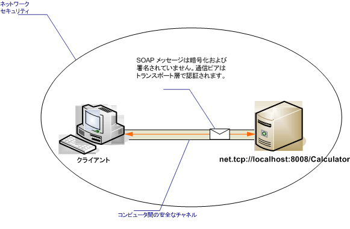

# セキュリティで保護されていないイントラネットのクライアントとサービス
次の図は、セキュリティで保護されたプライベート ネットワーク上で [!INCLUDE[indigo2](../../../../includes/indigo2-md.md)] アプリケーションに情報を提供するために開発された単純な [!INCLUDE[indigo1](../../../../includes/indigo1-md.md)] サービスを示しています。  データの重要性が低いか、ネットワークが本質的に安全であることが期待されるか、または [!INCLUDE[indigo2](../../../../includes/indigo2-md.md)] インフラストラクチャよりも下位層でセキュリティが提供されているため、セキュリティは必要ではありません。  
  
   
  
|特徴|説明|  
|--------|--------|  
|セキュリティ モード|なし|  
|Transport|TCP|  
|バインディング|<xref:System.ServiceModel.NetTcpBinding>|  
|相互運用性|[!INCLUDE[indigo2](../../../../includes/indigo2-md.md)] のみ|  
|認証|なし|  
|整合性|なし|  
|機密性|なし|  
  
## サービス  
 次のコードと構成は、別々に実行します。  次のいずれかの操作を行います。  
  
-   構成を使用せずに、コードを使用してスタンドアロン サービスを作成します。  
  
-   提供された構成を使用してサービスを作成しますが、エンドポイントを定義しません。  
  
### コード  
 次のコードは、セキュリティで保護されないエンドポイントを作成する方法を示しています。  
  
 [!code-csharp[C_UnsecuredService#2](../../../../samples/snippets/csharp/VS_Snippets_CFX/c_unsecuredservice/cs/source.cs#2)]
 [!code-vb[C_UnsecuredService#2](../../../../samples/snippets/visualbasic/VS_Snippets_CFX/c_unsecuredservice/vb/source.vb#2)]  
  
### 構成  
 次のコードは、次に示す構成を使用して同一のエンドポイントをセットアップします。  
  
```  
<?xml version="1.0" encoding="utf-8"?>  
<configuration>  
  <system.serviceModel>  
    <behaviors />  
    <services>  
      <service behaviorConfiguration=""   
               name="ServiceModel.Calculator">  
        <endpoint address="net.tcp://localhost:8008/Calculator"   
                  binding="netTcpBinding"  
                  bindingConfiguration="tcp_Unsecured"   
                  name="netTcp_ICalculator"  
                  contract="ServiceModel.ICalculator" />  
      </service>  
    </services>  
    <bindings>  
      <netTcpBinding>  
        <binding name="tcp_Unsecured">  
          <security mode="None" />  
        </binding>  
      </netTcpBinding>  
    </bindings>  
    <client />  
  </system.serviceModel>  
</configuration>  
```  
  
## Client  
 次のコードと構成は、別々に実行します。  次のいずれかの操作を行います。  
  
-   コード \(およびクライアント コード\) を使用してスタンドアロン クライアントを作成します。  
  
-   エンドポイント アドレスを定義しないクライアントを作成します。  代わりに、引数として構成名を受け取るクライアント コンストラクターを使用します。  次に例を示します。  
  
     [!code-csharp[C_SecurityScenarios#0](../../../../samples/snippets/csharp/VS_Snippets_CFX/c_securityscenarios/cs/source.cs#0)]
     [!code-vb[C_SecurityScenarios#0](../../../../samples/snippets/visualbasic/VS_Snippets_CFX/c_securityscenarios/vb/source.vb#0)]  
  
### コード  
 次のコードは、TCP プロトコルを使用してセキュリティで保護されていないエンドポイントにアクセスする基本的な [!INCLUDE[indigo2](../../../../includes/indigo2-md.md)] クライアントの作成方法を示します。  
  
 [!code-csharp[C_UnsecuredClient#2](../../../../samples/snippets/csharp/VS_Snippets_CFX/c_unsecuredclient/cs/source.cs#2)]
 [!code-vb[C_UnsecuredClient#2](../../../../samples/snippets/visualbasic/VS_Snippets_CFX/c_unsecuredclient/vb/source.vb#2)]  
  
### 構成  
 次の構成コードは、クライアントに適用されます。  
  
```  
<?xml version="1.0" encoding="utf-8"?>  
<configuration>  
  <system.serviceModel>  
    <bindings>  
      <netTcpBinding>  
        <binding name="NetTcpBinding_ICalculator" >  
          <security mode="None">  
          </security>  
        </binding>  
      </netTcpBinding>  
    </bindings>  
    <client>  
      <endpoint address="net.tcp://machineName:8008/Calculator "  
                binding="netTcpBinding"   
                bindingConfiguration="NetTcpBinding_ICalculator"  
                contract="ICalculator"   
                name="NetTcpBinding_ICalculator" />  
    </client>  
  </system.serviceModel>  
</configuration>  
```  
  
## 参照  
 <xref:System.ServiceModel.NetTcpBinding>   
 [セキュリティの概要](../../../../docs/framework/wcf/feature-details/security-overview.md)   
 [Windows Server AppFabric のセキュリティ モデル](http://go.microsoft.com/fwlink/?LinkID=201279&clcid=0x409)