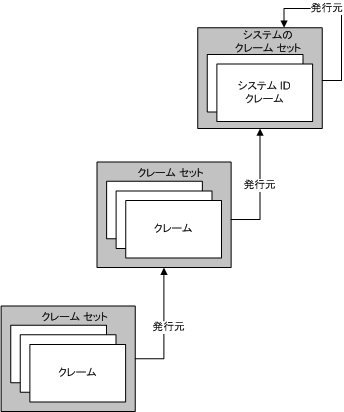
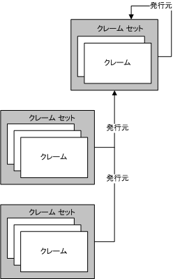
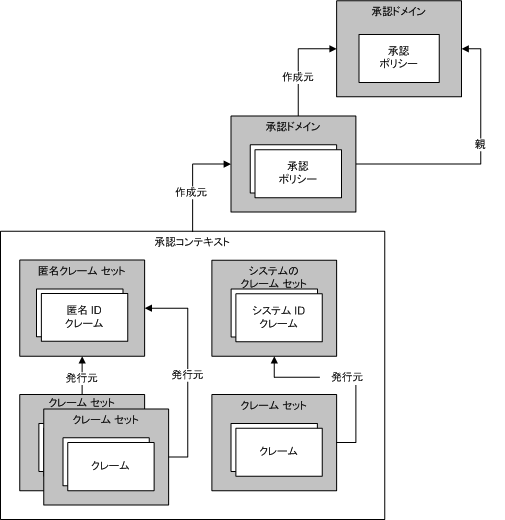

# ID モデルを使用したクレームと承認の管理
承認は、コンピューター リソースを変更または表示したり、コンピューター リソースにアクセスしたりする権限を持つエンティティを特定するプロセスです。 たとえば、ある業務で、管理者だけが従業員のファイルへのアクセスを許可される場合があります。 Windows Communication Foundation (WCF) には、承認処理を実行するための 2 つのメカニズムがサポートしています。 1 つ目の機構では、既存の共通言語ランタイム (CLR: Common Language Runtime) 構造を使用して承認を制御できます。 2 つ目は、クレームに基づくモデルと呼ばれる、 *Id モデル*です。 WCF の着信メッセージからクレームを作成するのに、Id モデルを使用します。カスタム承認スキームでは新しいクレームの種類をサポートするためには、id モデル クラスを拡張できます。 このトピックでは、ID モデル機能のプログラミングの主要概念について概説し、この機能で使用する最も重要なクラスの一覧を示します。  
  
## ID モデルのシナリオ  
 ID モデルの使用例を以下のシナリオに示します。  
  
### シナリオ 1 : ID、ロール、およびグループの各クレームをサポートする場合  
 複数のユーザーが Web サービスにメッセージを送信します。 この Web サービスのアクセス制御要件では、ID、ロール、またはグループを使用します。 メッセージ送信者は、一連のロールまたはグループに割り当てられます。 ロールまたはグループの情報は、アクセス チェックを実行する際に使用されます。  
  
### シナリオ 2 : 多様なクレームをサポートする場合  
 複数のユーザーが Web サービスにメッセージを送信します。 この Web サービスのアクセス制御要件では、ID、ロール、またはグループよりも多様なモデルを必要とします。 Web サービスは、クレームに基づく多様なモデルを使用して、指定のユーザーが保護された特定のリソースにアクセスできるかどうかを判断します。 たとえば、あるユーザーは、他のユーザーがアクセスできない給与情報などの特定の情報を読み取ることができます。  
  
### シナリオ 3 : さまざまなクレームを割り当てる場合  
 ユーザーが Web サービスにメッセージを送信します。 ユーザーは、X.509 証明書、ユーザー名トークン、または Kerberos トークンを使用して資格情報を指定できます。 Web サービスは、ユーザーの資格情報の種類を問わず、アクセス制御チェックを同様に実行する必要があります。 時間の経過に伴って、サポート対象となる資格情報の種類が追加された場合、それに応じてシステムを拡張する必要があります。  
  
### シナリオ 4 : 複数のリソースへのアクセスを特定する場合  
 ある Web サービスでは、複数のリソースへのアクセスを試みます。 このサービスは、指定のユーザーに関連付けられたクレームと、保護されたリソースにアクセスするために必要なクレームを比較することによって、そのユーザーがアクセスできるリソースを特定します。  
  
## ID モデルの用語  
 ID モデルの概念の説明に使用される重要な用語の定義を以下に示します。  
  
 承認ポリシー  
 入力クレーム セットを出力クレーム セットに割り当てる一連のルール。 承認ポリシーを評価すると、クレーム セットが評価コンテキストに追加され、次に承認コンテキストに追加されます。  
  
 承認コンテキスト  
 一連のクレーム セットと 0 個以上のプロパティ。 1 つ以上の承認ポリシーの評価結果です。  
  
 クレーム  
 クレームの種類、権限、および値の組み合わせ。  
  
 クレーム セット  
 特定の発行者によって発行された一連のクレーム。  
  
 クレームの種類  
 クレームの種類。 ID モデル API によって定義されたクレームは、<xref:System.IdentityModel.Claims.Claim.ClaimType%2A> クラスのプロパティです。 システムが提供するクレームの種類には、<xref:System.IdentityModel.Claims.ClaimTypes.Dns%2A>、<xref:System.IdentityModel.Claims.ClaimTypes.Email%2A>、<xref:System.IdentityModel.Claims.ClaimTypes.Hash%2A>、<xref:System.IdentityModel.Claims.ClaimTypes.Name%2A>、<xref:System.IdentityModel.Claims.ClaimTypes.Rsa%2A>、<xref:System.IdentityModel.Claims.ClaimTypes.Sid%2A>、<xref:System.IdentityModel.Claims.ClaimTypes.Spn%2A>、<xref:System.IdentityModel.Claims.ClaimTypes.System%2A>、<xref:System.IdentityModel.Claims.ClaimTypes.Thumbprint%2A>、<xref:System.IdentityModel.Claims.ClaimTypes.Uri%2A>、<xref:System.IdentityModel.Claims.ClaimTypes.X500DistinguishedName%2A> などがあります。  
  
 評価コンテキスト  
 承認ポリシーが評価されるコンテキスト。 プロパティとクレーム セットが含まれます。 評価が完了すると、評価コンテキストは承認コンテキストの基礎となります。  
  
 ID クレーム  
 権限が ID であるクレーム。  
  
 発行者  
 1 つ以上の ID クレームを含み、別のクレーム セットを発行したと見なされているクレーム セット。  
  
 プロパティ  
 評価コンテキストまたは承認コンテキストに関連付けられた一連の情報。  
  
 保護されたリソース  
 システム内に存在するものの中で、まず特定の要件が満たされた場合にのみ、使用、アクセス、または操作が可能になるもの。  
  
 権限  
 リソースに対する使用能力。 ID モデル API によって定義された権限は、<xref:System.IdentityModel.Claims.Rights> クラスのプロパティです。 システムが提供する権限には、<xref:System.IdentityModel.Claims.Rights.Identity%2A> や <xref:System.IdentityModel.Claims.Rights.PossessProperty%2A> などがあります。  
  
 [値]  
 権限がクレームされる対象。  
  
## クレーム  
 ID モデルはクレームに基づくシステムです。 クレームは、システム内の何らかのエンティティ (多くの場合システムのユーザー) に関連する機能について記述します。 指定のエンティティに関連するクレームのセットをキーと考えることができます。 個別のクレームによりキーの形状が定義されます。このしくみは、ドアを開けるための物理的なキーと似ています。 クレームは、リソースへのアクセスを取得するために使用されます。 保護された指定のリソースへのアクセスの可否は、そのリソースにアクセスするために必要なクレームと、アクセスを試みるエンティティに関連付けられたクレームを比較することにより特定されます。  
  
 クレームは、特定の値に関連付けられる権限の表現です。 権限には、"読み取り"、"書き込み"、"実行" などがあります。 値には、データベース、ファイル、メールボックス、またはプロパティが使用できます。 クレームはまた、特定のクレームの種類に属します。 クレームの種類と権限の組み合わせにより、値に関する機能を指定するための機構が得られます。 たとえば、値 "Biography.doc" に対して権限 "読み取り" を持つ種類 "File" のクレームは、そのようなクレームに関連するエンティティが Biography.doc ファイルに対して読み取りアクセスを持つことを示します。また、値 "Martin" に対して権限 "PossessProperty" を持つ種類 "Name" のクレームは、そのようなクレームに関連するエンティティが値 "Martin" を持つ "Name" プロパティを所有することを示します。  
  
 さまざまなクレームの種類と権限が ID モデルの一部として定義されています。ただし、システムは拡張できるため、ID モデル インフラストラクチャ上に構築するさまざまなシステムで、必要に応じて他のクレームの種類や権限を定義できます。  
  
### ID クレーム  
 特殊な権限の 1 つとして、ID の権限があります。 この権限を持つクレームは、エンティティの ID を示します。 たとえば、「ユーザー プリンシパル名」の種類のクレーム (UPN) で、値は"someone@example.com"を示し、Id の権限は、特定のドメイン内の特定の id。  
  
#### System ID クレーム  
 ID モデルでは、System という ID クレームが定義されています。 System ID クレームは、エンティティが現在のアプリケーションまたはシステムであることを示します。  
  
### クレーム セット  
 クレームは、システム内の何らかのエンティティによって常に発行されるため、ID を表すクレームのモデルは重要です。エンティティが最終的には何らかの "自己" の概念である場合でも、クレームは発行されます。 クレームは 1 つのセットとしてグループ化され、各セットは発行者を持ちます。 発行者は、1 つのクレーム セットにすぎません。 このような再帰的な関係は最終的に終了する必要があるため、どのクレーム セットもそれ自体の発行者になることができます。  
  
 次の図は、3 つのクレーム セットの一例を示しています。この例では、1 つ目のクレーム セットの発行者は 2 つ目のクレーム セットであり、さらにこの 2 つ目のクレーム セットの発行者は System クレーム セットです。 このように、クレーム セットは任意の深さの階層を形成します。  
  
   
  
 次の図に示すように、複数のクレーム セットが同じクレーム セットから発行されている場合もあります。  
  
   
  
 クレーム セットがそれ自体の発行者である場合を除き、ID モデルではクレーム セットによるループの形成を一切サポートしていません。 したがって、クレーム セット A がクレーム セット B によって発行された場合に、クレーム セット B 自体がクレーム セット A によって発行されたという状況はありえません。 また、ID モデルでは、クレーム セットが複数の発行者を持つことはできません。 ある特定のクレーム セットを複数の発行者が発行する必要がある場合は、同じクレームを含み、発行者がそれぞれ異なる複数のクレーム セットを使用する必要があります。  
  
### クレームの発生元  
 クレームは、さまざまな発生元から発生する可能性があります。 たとえば、Web サービスに送信されるメッセージの一部としてユーザーから提示される資格情報は、クレームの一般的な発生元の 1 つです。 このようなクレームはシステムによって検証され、そのユーザーに関連付けられたクレーム セットの一部になります。 システムの他のコンポーネント (オペレーティング システム、ネットワーク スタック、ランタイム環境、アプリケーションなど) もクレームの発生元になることがあります。 また、リモート サービスが発生元になる場合もあります。  
  
### 承認ポリシー  
 ID モデルでは、承認ポリシーの評価プロセスの一環としてクレームが生成されます。 承認ポリシーは、既存のクレーム セット (空の場合もあります) を調べます。そして、既に存在するクレームやクレームが破棄された時点の追加情報に基づいて、別のクレームを追加する場合があります。 これは、クレーム間のマッピングの基盤となります。 システム内でのクレームの有無は、別のクレームを追加するかどうかという承認ポリシーの動作に影響します。  
  
 たとえば、システムを使用するさまざまなエンティティの誕生日が含まれたデータベースにアクセスできる承認ポリシーがあるとします。 承認ポリシーは、この情報を使用して "Over18" というクレームをコンテキストに追加します。 この Over18 クレームは、エンティティが 18 歳以上であるということ以外に、エンティティに関する情報を公開しません。 "Over18" クレームの解釈は、このクレームのセマンティクスの認識によって異なります。 クレームを追加した承認ポリシーは、何らかのレベルでこれらのセマンティクスを認識しています。 ポリシー評価の結果として生成されたクレームを調べるコードにも、これらのセマンティクスが通知されます。  
  
 特定の承認ポリシーを複数回評価することが必要になる場合があります。これは、他の承認ポリシーがクレームを追加したときに、該当の承認ポリシーがさらにクレームを追加する可能性があるためです。 ID モデルは、適用されているすべての承認ポリシーがクレームをコンテキストに追加しなくなるまで、評価を続行するように設計されています。 このように、承認ポリシーの評価を続行することにより、承認ポリシーに関して一定の評価順序を適用する必要性がなくなります。つまり、承認ポリシーを任意の順序で評価できます。 たとえば、ポリシー A がクレーム B を追加した場合にのみ、ポリシー X がクレーム Z を追加するとします。この場合、X が先に評価されると、その時点ではクレーム Z は追加されません。その後、A が評価され、クレーム B が追加されます。次に、X の 2 回目の評価が行われ、この時点でクレーム Z が追加されます。  
  
 システムによっては多数の承認ポリシーが適用されている場合があります。  
  
### キーを作成するマシン  
 関連する承認ポリシーのグループを評価することは、キーを作成する機械を使用することに似ています。 承認ポリシーがそれぞれ評価され、クレーム セットが生成されて、キーの形状が確立されていきます。 キーの形状が完成すると、このキーを使用していくつかのロックを開いてみることができます。 キーの形状は、承認マネージャーによって作成される "承認コンテキスト" に格納されます。  
  
### 承認コンテキスト  
 既に説明したように、承認マネージャーはさまざまな承認ポリシーを評価します。この評価の結果が承認コンテキスト (一連のクレーム セットと関連する複数のプロパティ) です。 承認コンテキストを調べて、そのコンテキスト内に存在するクレームや、それらのさまざまなクレーム間の関係 (発行側クレーム セットなど) を確認し、最終的にリソースにアクセスするために満たす必要のある要件と比較できます。  
  
### ロック  
 承認コンテキスト (クレーム セット) がキーであるとすれば、保護された特定のリソースへのアクセスを許可するために満たす必要のある要件は、このキーが適合する必要のあるロックに相当します。 ID モデルでは、このような要件を表現する方法は形式化されていませんが、クレームに基づくというシステムの特性により、これらの要件には、承認コンテキスト内のクレームと一部の必須のクレーム セットの比較が必ず含まれることになります。  
  
### まとめ  
 ID モデルは、クレームの概念に基づいています。 クレームはセットにグループ化され、承認コンテキストに集約されます。 承認コンテキストは、承認マネージャーに関連付けられた 1 つ以上の承認ポリシーの評価結果であり、クレーム セットを含んでいます。 これらのクレーム セットを調べて、アクセス要件が満たされているかどうか確認できます。 ID モデルのさまざまな概念の関係を次の図に示します。  
  
   
  
## WCF と ID モデル  
 WCF は、承認を実行するため、基盤として Id モデル インフラストラクチャを使用します。 WCF では、<xref:System.ServiceModel.Description.ServiceAuthorizationBehavior>クラスを指定できます。*承認*サービスの一部としてポリシー。 このような承認ポリシーと呼ばれる*外部承認ポリシー*、リモート サービスと対話してローカル ポリシーに基づく請求処理を行うことです。 承認マネージャーは、によって表される、<xref:System.ServiceModel.ServiceAuthorizationManager>クラスは、各種の資格情報の種類 (トークン) を認識する承認ポリシーと共に外部承認ポリシーを評価し、設定と呼ばれるもの、 *承認コンテキスト*受信メッセージに適切な要求を使用します。 承認コンテキストは、<xref:System.IdentityModel.Policy.AuthorizationContext> クラスによって表されます。  
  
## ID モデルのプログラミング  
 ID モデル拡張のプログラミングに使用するオブジェクト モデルを次の表に示します。 これらのクラスはすべて、<xref:System.IdentityModel.Policy> 名前空間または <xref:System.IdentityModel.Claims> 名前空間にあります。  
  
|クラス|説明|  
|-----------|-----------------|  
|Authorization Component|<xref:System.IdentityModel.Policy.IAuthorizationComponent> インターフェイスを実装する ID モデル クラス。|  
|<xref:System.IdentityModel.Policy.IAuthorizationComponent>|単一の読み取り専用文字列プロパティ (Id) を提供するインターフェイス。このプロパティの値は、システム内でこのインターフェイスを実装するインスタンスごとに一意です。|  
|<xref:System.IdentityModel.Policy.AuthorizationContext>|*承認コンポーネント*のセットを含む`ClaimSet`0 個以上のプロパティを持つインスタンス 1 つまたは複数の承認ポリシーの評価結果です。|  
|<xref:System.IdentityModel.Claims.Claim>|クレームの種類、権限、および値の組み合わせ。 権限と値の部分は、クレームの種類によって制約されます。|  
|<xref:System.IdentityModel.Claims.ClaimSet>|抽象基本クラス。 `Claim` インスタンスのコレクション。|  
|<xref:System.IdentityModel.Claims.DefaultClaimSet>|シール クラス。 `ClaimSet` クラスの実装。|  
|<xref:System.IdentityModel.Policy.EvaluationContext>|抽象基本クラス。 ポリシーの評価時に承認ポリシーに渡されます。|  
|<xref:System.IdentityModel.Policy.IAuthorizationPolicy>|派生したインターフェイス`IAuthorizationComponent`承認ポリシーのクラスによって実装されるとします。|  
|<xref:System.IdentityModel.Claims.Rights>|定義済みの権限値が格納された静的クラス。|  
  
 以下のクラスも ID モデルのプログラミングに使用しますが、<xref:System.IdentityModel.Policy> 名前空間または <xref:System.IdentityModel.Claims> 名前空間には含まれません。  
  
|クラス|説明|  
|-----------|-----------------|  
|<xref:System.ServiceModel.ServiceAuthorizationManager>|サービスでの操作ごとにクレームに基づく承認チェックを実行するメソッド (<xref:System.ServiceModel.ServiceAuthorizationManager.CheckAccessCore%2A>) を提供するクラス。 このクラスから派生し、メソッドをオーバーライドする必要があります。|  
|<xref:System.ServiceModel.Description.ServiceAuthorizationBehavior>|承認に関係するサービスの動作に関連するさまざまなプロパティを提供するシール クラス。|  
|<xref:System.ServiceModel.ServiceSecurityContext>|現在実行中 (または実行直前) の操作のセキュリティ コンテキスト (承認コンテキストなど) を提供するクラス。 このクラスのインスタンスは、<xref:System.ServiceModel.OperationContext> に含まれます。|  
  
### 重要なメンバー  
 次のメンバーは、新しいクレームの種類を作成する際に一般的に使用されます。  
  
|メンバー|説明|  
|------------|-----------------|  
|<xref:System.ServiceModel.ServiceAuthorizationManager.CheckAccessCore%2A>|派生クラスは、このメソッドを実装して、サービスで操作を実行する前にクレームに基づくアクセス チェックを実行します。 アクセス チェックの決定を行うときに、指定された <xref:System.ServiceModel.OperationContext>、または他の場所にあるすべての情報を確認できます。 <xref:System.ServiceModel.ServiceAuthorizationManager.CheckAccessCore%2A> が `true` を返した場合は、アクセスが許可され、操作を実行できるようになります。 `CheckAccessCore` が `false` を返した場合は、アクセスが拒否され、操作は実行されません。 例については、次を参照してください。[する方法: サービスのカスタム承認マネージャーを作成する](../../../../docs/framework/wcf/extending/how-to-create-a-custom-authorization-manager-for-a-service.md)です。|  
|<xref:System.ServiceModel.Description.ServiceAuthorizationBehavior.ServiceAuthorizationManager%2A>|サービスの <xref:System.ServiceModel.ServiceAuthorizationManager> を返します。 承認決定は、<xref:System.ServiceModel.ServiceAuthorizationManager> が行います。|  
|<xref:System.ServiceModel.Description.ServiceAuthorizationBehavior.ExternalAuthorizationPolicies%2A>|サービスに指定されたカスタム承認ポリシーのコレクション。 受信メッセージの資格情報に関連するポリシーに加え、これらのポリシーも評価されます。|  
  
## 関連項目  
 <xref:System.IdentityModel.Policy.AuthorizationContext>  
 <xref:System.IdentityModel.Claims.Claim>  
 <xref:System.IdentityModel.Policy.EvaluationContext>  
 <xref:System.IdentityModel.Policy.IAuthorizationComponent>  
 <xref:System.IdentityModel.Policy.IAuthorizationPolicy>  
 <xref:System.IdentityModel.Claims.Rights>  
 <xref:System.IdentityModel.Claims>  
 <xref:System.IdentityModel.Policy>  
 <xref:System.IdentityModel.Tokens>  
 <xref:System.IdentityModel.Selectors>  
 [クレームとトークン](../../../../docs/framework/wcf/feature-details/claims-and-tokens.md)  
 [リソースへのアクセスのクレームと拒否](../../../../docs/framework/wcf/feature-details/claims-and-denying-access-to-resources.md)  
 [クレームの作成とリソース値](../../../../docs/framework/wcf/feature-details/claim-creation-and-resource-values.md)  
 [方法 : カスタム クレームを作成する](../../../../docs/framework/wcf/extending/how-to-create-a-custom-claim.md)  
 [方法 : クレームを比較する](../../../../docs/framework/wcf/extending/how-to-compare-claims.md)  
 [方法 : カスタム承認ポリシーを作成する](../../../../docs/framework/wcf/extending/how-to-create-a-custom-authorization-policy.md)  
 [方法 : サービスで使用するカスタム承認マネージャーを作成する](../../../../docs/framework/wcf/extending/how-to-create-a-custom-authorization-manager-for-a-service.md)  
 [セキュリティの概要](../../../../docs/framework/wcf/feature-details/security-overview.md)  
 [承認](../../../../docs/framework/wcf/feature-details/authorization-in-wcf.md)
