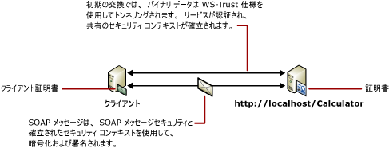

# <a name="message-security-with-a-certificate-client"></a><span data-ttu-id="4cf5d-102">メッセージ セキュリティと証明書クライアント</span><span class="sxs-lookup"><span data-stu-id="4cf5d-102">Message Security with a Certificate Client</span></span>
<span data-ttu-id="4cf5d-103">次のシナリオでは、Windows Communication Foundation (WCF) クライアントとメッセージ セキュリティ モードを使用してセキュリティ保護サービスを示します。</span><span class="sxs-lookup"><span data-stu-id="4cf5d-103">The following scenario shows a Windows Communication Foundation (WCF) client and service secured using message security mode.</span></span> <span data-ttu-id="4cf5d-104">クライアントとサービスは、どちらも証明書を使用して認証されます。</span><span class="sxs-lookup"><span data-stu-id="4cf5d-104">Both the client and the service are authenticated with certificates.</span></span> <span data-ttu-id="4cf5d-105">詳細については、次を参照してください。[分散アプリケーションのセキュリティ](../../../../docs/framework/wcf/feature-details/distributed-application-security.md)です。</span><span class="sxs-lookup"><span data-stu-id="4cf5d-105">For more information, see [Distributed Application Security](../../../../docs/framework/wcf/feature-details/distributed-application-security.md).</span></span>  
  
 <span data-ttu-id="4cf5d-106">サンプル アプリケーションについては、次を参照してください。[メッセージのセキュリティ証明書](../../../../docs/framework/wcf/samples/message-security-certificate.md)です。</span><span class="sxs-lookup"><span data-stu-id="4cf5d-106">For a sample application, see [Message Security Certificate](../../../../docs/framework/wcf/samples/message-security-certificate.md).</span></span>  
  
 <span data-ttu-id="4cf5d-107"></span><span class="sxs-lookup"><span data-stu-id="4cf5d-107"></span></span>  
  
|<span data-ttu-id="4cf5d-108">特徴</span><span class="sxs-lookup"><span data-stu-id="4cf5d-108">Characteristic</span></span>|<span data-ttu-id="4cf5d-109">説明</span><span class="sxs-lookup"><span data-stu-id="4cf5d-109">Description</span></span>|  
|--------------------|-----------------|  
|<span data-ttu-id="4cf5d-110">セキュリティ モード</span><span class="sxs-lookup"><span data-stu-id="4cf5d-110">Security Mode</span></span>|<span data-ttu-id="4cf5d-111">メッセージ</span><span class="sxs-lookup"><span data-stu-id="4cf5d-111">Message</span></span>|  
|<span data-ttu-id="4cf5d-112">相互運用性</span><span class="sxs-lookup"><span data-stu-id="4cf5d-112">Interoperability</span></span>|<span data-ttu-id="4cf5d-113">WCF のみ</span><span class="sxs-lookup"><span data-stu-id="4cf5d-113">WCF only</span></span>|  
|<span data-ttu-id="4cf5d-114">認証 (サーバー)</span><span class="sxs-lookup"><span data-stu-id="4cf5d-114">Authentication (Server)</span></span>|<span data-ttu-id="4cf5d-115">サービス証明書を使用</span><span class="sxs-lookup"><span data-stu-id="4cf5d-115">Using service certificate</span></span>|  
|<span data-ttu-id="4cf5d-116">認証 (クライアント)</span><span class="sxs-lookup"><span data-stu-id="4cf5d-116">Authentication (Client)</span></span>|<span data-ttu-id="4cf5d-117">クライアント証明書を使用</span><span class="sxs-lookup"><span data-stu-id="4cf5d-117">Using client certificate</span></span>|  
|<span data-ttu-id="4cf5d-118">整合性</span><span class="sxs-lookup"><span data-stu-id="4cf5d-118">Integrity</span></span>|<span data-ttu-id="4cf5d-119">はい</span><span class="sxs-lookup"><span data-stu-id="4cf5d-119">Yes</span></span>|  
|<span data-ttu-id="4cf5d-120">機密性</span><span class="sxs-lookup"><span data-stu-id="4cf5d-120">Confidentiality</span></span>|<span data-ttu-id="4cf5d-121">はい</span><span class="sxs-lookup"><span data-stu-id="4cf5d-121">Yes</span></span>|  
|<span data-ttu-id="4cf5d-122">Transport</span><span class="sxs-lookup"><span data-stu-id="4cf5d-122">Transport</span></span>|<span data-ttu-id="4cf5d-123">HTTP</span><span class="sxs-lookup"><span data-stu-id="4cf5d-123">HTTP</span></span>|  
|<span data-ttu-id="4cf5d-124">バインディング</span><span class="sxs-lookup"><span data-stu-id="4cf5d-124">Binding</span></span>|<xref:System.ServiceModel.WSHttpBinding>|  
  
## <a name="service"></a><span data-ttu-id="4cf5d-125">サービス</span><span class="sxs-lookup"><span data-stu-id="4cf5d-125">Service</span></span>  
 <span data-ttu-id="4cf5d-126">次のコードと構成は、別々に実行します。</span><span class="sxs-lookup"><span data-stu-id="4cf5d-126">The following code and configuration are meant to run independently.</span></span> <span data-ttu-id="4cf5d-127">次のいずれかの操作を行います。</span><span class="sxs-lookup"><span data-stu-id="4cf5d-127">Do one of the following:</span></span>  
  
-   <span data-ttu-id="4cf5d-128">構成を使用せずに、コードを使用してスタンドアロン サービスを作成します。</span><span class="sxs-lookup"><span data-stu-id="4cf5d-128">Create a stand-alone service using the code with no configuration.</span></span>  
  
-   <span data-ttu-id="4cf5d-129">提供された構成を使用してサービスを作成しますが、エンドポイントを定義しません。</span><span class="sxs-lookup"><span data-stu-id="4cf5d-129">Create a service using the supplied configuration, but do not define any endpoints.</span></span>  
  
### <a name="code"></a><span data-ttu-id="4cf5d-130">コード</span><span class="sxs-lookup"><span data-stu-id="4cf5d-130">Code</span></span>  
 <span data-ttu-id="4cf5d-131">次のコードは、メッセージ セキュリティを使用するサービス エンドポイントを作成し、セキュリティで保護されたコンテキストを確立する方法を示しています。</span><span class="sxs-lookup"><span data-stu-id="4cf5d-131">The following code shows how to create a service endpoint that uses message security to establish a secure context.</span></span>  
  
 [!code-csharp[C_SecurityScenarios#10](../../../../samples/snippets/csharp/VS_Snippets_CFX/c_securityscenarios/cs/source.cs#10)]
 [!code-vb[C_SecurityScenarios#10](../../../../samples/snippets/visualbasic/VS_Snippets_CFX/c_securityscenarios/vb/source.vb#10)]  
  
### <a name="configuration"></a><span data-ttu-id="4cf5d-132">構成</span><span class="sxs-lookup"><span data-stu-id="4cf5d-132">Configuration</span></span>  
 <span data-ttu-id="4cf5d-133">コードの代わりに次の構成を使用できます。</span><span class="sxs-lookup"><span data-stu-id="4cf5d-133">The following configuration can be used instead of the code.</span></span>  
  
```xml  
<?xml version="1.0" encoding="utf-8"?>  
<configuration>  
  <system.serviceModel>  
    <behaviors>  
      <serviceBehaviors>  
        <behavior name="ServiceCredentialsBehavior">  
          <serviceCredentials>  
            <serviceCertificate findValue="Contoso.com"  
                                x509FindType="FindBySubjectName" />  
          </serviceCredentials>  
        </behavior>  
      </serviceBehaviors>  
    </behaviors>  
    <services>  
      <service behaviorConfiguration="ServiceCredentialsBehavior"   
               name="ServiceModel.Calculator">  
        <endpoint address="http://localhost/Calculator"   
                  binding="wsHttpBinding"  
                  bindingConfiguration="MessageAndCerficiateClient"   
                  name="SecuredByClientCertificate"  
                  contract="ServiceModel.ICalculator" />  
      </service>  
    </services>  
    <bindings>  
      <wsHttpBinding>  
        <binding name="WSHttpBinding_ICalculator">  
          <security mode="Message">  
            <message clientCredentialType="Certificate" />  
          </security>  
        </binding>  
      </wsHttpBinding>  
    </bindings>  
    <client />  
  </system.serviceModel>  
</configuration>  
```  
  
## <a name="client"></a><span data-ttu-id="4cf5d-134">Client</span><span class="sxs-lookup"><span data-stu-id="4cf5d-134">Client</span></span>  
 <span data-ttu-id="4cf5d-135">次のコードと構成は、別々に実行します。</span><span class="sxs-lookup"><span data-stu-id="4cf5d-135">The following code and configuration are meant to run independently.</span></span> <span data-ttu-id="4cf5d-136">次のいずれかの操作を行います。</span><span class="sxs-lookup"><span data-stu-id="4cf5d-136">Do one of the following:</span></span>  
  
-   <span data-ttu-id="4cf5d-137">コード (およびクライアント コード) を使用してスタンドアロン クライアントを作成します。</span><span class="sxs-lookup"><span data-stu-id="4cf5d-137">Create a stand-alone client using the code (and client code).</span></span>  
  
-   <span data-ttu-id="4cf5d-138">エンドポイント アドレスを定義しないクライアントを作成します。</span><span class="sxs-lookup"><span data-stu-id="4cf5d-138">Create a client that does not define any endpoint addresses.</span></span> <span data-ttu-id="4cf5d-139">代わりに、引数として構成名を受け取るクライアント コンストラクターを使用します。</span><span class="sxs-lookup"><span data-stu-id="4cf5d-139">Instead, use the client constructor that takes the configuration name as an argument.</span></span> <span data-ttu-id="4cf5d-140">次に例を示します。</span><span class="sxs-lookup"><span data-stu-id="4cf5d-140">For example:</span></span>  
  
     [!code-csharp[C_SecurityScenarios#0](../../../../samples/snippets/csharp/VS_Snippets_CFX/c_securityscenarios/cs/source.cs#0)]
     [!code-vb[C_SecurityScenarios#0](../../../../samples/snippets/visualbasic/VS_Snippets_CFX/c_securityscenarios/vb/source.vb#0)]  
  
### <a name="code"></a><span data-ttu-id="4cf5d-141">コード</span><span class="sxs-lookup"><span data-stu-id="4cf5d-141">Code</span></span>  
 <span data-ttu-id="4cf5d-142">クライアントを作成する場合のコード例を次に示します。</span><span class="sxs-lookup"><span data-stu-id="4cf5d-142">The following code creates the client.</span></span> <span data-ttu-id="4cf5d-143">バインディングではメッセージ モード セキュリティを使用し、クライアント資格情報の種類は `Certificate` に設定します。</span><span class="sxs-lookup"><span data-stu-id="4cf5d-143">The binding is to message mode security, and the client credential type is set to `Certificate`.</span></span>  
  
 [!code-csharp[C_SecurityScenarios#17](../../../../samples/snippets/csharp/VS_Snippets_CFX/c_securityscenarios/cs/source.cs#17)]
 [!code-vb[C_SecurityScenarios#17](../../../../samples/snippets/visualbasic/VS_Snippets_CFX/c_securityscenarios/vb/source.vb#17)]  
  
### <a name="configuration"></a><span data-ttu-id="4cf5d-144">構成</span><span class="sxs-lookup"><span data-stu-id="4cf5d-144">Configuration</span></span>  
 <span data-ttu-id="4cf5d-145">次の構成は、エンドポイントの動作を使用してクライアント証明書を指定します。</span><span class="sxs-lookup"><span data-stu-id="4cf5d-145">The following configuration specifies the client certificate using an endpoint behavior.</span></span> <span data-ttu-id="4cf5d-146">証明書の詳細については、「[証明書の使用](../../../../docs/framework/wcf/feature-details/working-with-certificates.md)」を参照してください。</span><span class="sxs-lookup"><span data-stu-id="4cf5d-146">For more information about certificates, see [Working with Certificates](../../../../docs/framework/wcf/feature-details/working-with-certificates.md).</span></span> <span data-ttu-id="4cf5d-147">コードを使用しても、<`identity`> 要素を予想されるサーバー id のドメイン ネーム システム (DNS) を指定します。</span><span class="sxs-lookup"><span data-stu-id="4cf5d-147">The code also uses an <`identity`> element to specify a Domain Name System (DNS) of the expected server identity.</span></span> <span data-ttu-id="4cf5d-148">Id に関する詳細については、次を参照してください。[サービス Id と認証](../../../../docs/framework/wcf/feature-details/service-identity-and-authentication.md)です。</span><span class="sxs-lookup"><span data-stu-id="4cf5d-148">For more information about identity, see [Service Identity and Authentication](../../../../docs/framework/wcf/feature-details/service-identity-and-authentication.md).</span></span>  
  
```xml  
<?xml version="1.0" encoding="utf-8"?>  
<configuration>  
  <system.serviceModel>  
    <behaviors>  
      <endpointBehaviors>  
        <behavior name="endpointCredentialsBehavior">  
          <clientCredentials>  
            <clientCertificate findValue="Cohowinery.com"   
               storeLocation="LocalMachine"  
              x509FindType="FindBySubjectName" />  
          </clientCredentials>  
        </behavior>  
      </endpointBehaviors>  
    </behaviors>  
    <bindings>  
      <wsHttpBinding>  
        <binding name="WSHttpBinding_ICalculator" >  
          <security mode="Message">  
            <message clientCredentialType="Certificate" />  
          </security>  
        </binding>  
      </wsHttpBinding>  
    </bindings>  
    <client>  
      <endpoint address="http://machineName/Calculator"   
                behaviorConfiguration="endpointCredentialsBehavior"  
                binding="wsHttpBinding"  
                bindingConfiguration="WSHttpBinding_ICalculator"  
                contract="ICalculator"  
                name="WSHttpBinding_ICalculator">  
        <identity>  
          <dns value="Contoso.com" />  
        </identity>  
      </endpoint>  
    </client>  
  </system.serviceModel>  
</configuration>  
```  
  
## <a name="see-also"></a><span data-ttu-id="4cf5d-149">関連項目</span><span class="sxs-lookup"><span data-stu-id="4cf5d-149">See Also</span></span>  
 [<span data-ttu-id="4cf5d-150">セキュリティの概要</span><span class="sxs-lookup"><span data-stu-id="4cf5d-150">Security Overview</span></span>](../../../../docs/framework/wcf/feature-details/security-overview.md)  
 [<span data-ttu-id="4cf5d-151">サービス ID と認証</span><span class="sxs-lookup"><span data-stu-id="4cf5d-151">Service Identity and Authentication</span></span>](../../../../docs/framework/wcf/feature-details/service-identity-and-authentication.md)  
 [<span data-ttu-id="4cf5d-152">証明書の使用</span><span class="sxs-lookup"><span data-stu-id="4cf5d-152">Working with Certificates</span></span>](../../../../docs/framework/wcf/feature-details/working-with-certificates.md)  
 [<span data-ttu-id="4cf5d-153">Windows Server App Fabric のセキュリティ モデル</span><span class="sxs-lookup"><span data-stu-id="4cf5d-153">Security Model for Windows Server App Fabric</span></span>](http://go.microsoft.com/fwlink/?LinkID=201279&clcid=0x409)
