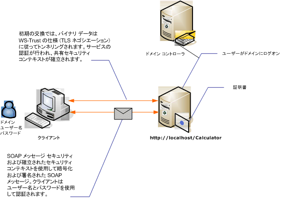

# <a name="message-security-with-a-user-name-client"></a>ユーザー名クライアントを使用したメッセージ セキュリティ
メッセージ レベルのセキュリティで保護された [!INCLUDE[indigo1](../../../../includes/indigo1-md.md)] サービスとクライアントを次の図に示します。 サービスは X.509 証明書を使用して認証されます。 クライアントはユーザー名とパスワードを使用して認証されます。  
  
 サンプル アプリケーションについては、次を参照してください。[メッセージ セキュリティ ユーザー名](../../../../docs/framework/wcf/samples/message-security-user-name.md)です。  
  
   
  
|特徴|説明|  
|--------------------|-----------------|  
|セキュリティ モード|メッセージ|  
|相互運用性|[!INCLUDE[indigo1](../../../../includes/indigo1-md.md)] のみ|  
|認証 (サーバー)|初期ネゴシエーションにはサーバー認証が必要|  
|認証 (クライアント)|ユーザー名/パスワード|  
|整合性|はい、共有のセキュリティ コンテキストを使用します|  
|機密性|はい、共有のセキュリティ コンテキストを使用します|  
|Transport|HTTP|  
|バインディング|<xref:System.ServiceModel.WSHttpBinding>|  
  
## <a name="service"></a>サービス  
 次のコードと構成は、別々に実行します。 次のいずれかの操作を行います。  
  
-   構成を使用せずに、コードを使用してスタンドアロン サービスを作成します。  
  
-   提供された構成を使用してサービスを作成しますが、エンドポイントを定義しません。  
  
### <a name="code"></a>コード  
 次のコードは、メッセージ セキュリティを使用するサービス エンドポイントの作成方法を示します。  
  
 [!code-csharp[C_SecurityScenarios#9](../../../../samples/snippets/csharp/VS_Snippets_CFX/c_securityscenarios/cs/source.cs#9)]
 [!code-vb[C_SecurityScenarios#9](../../../../samples/snippets/visualbasic/VS_Snippets_CFX/c_securityscenarios/vb/source.vb#9)]  
  
### <a name="configuration"></a>構成  
 コードの代わりに次の構成を使用できます。  
  
```xml  
<?xml version="1.0" encoding="utf-8"?>  
<configuration>  
  <system.serviceModel>  
    <behaviors>  
      <serviceBehaviors>  
        <behavior name="ServiceCredentialsBehavior">  
          <serviceCredentials>  
            <serviceCertificate findValue="Contoso.com"   
                                storeLocation="LocalMachine"  
                                storeName="My"     
                                x509FindType="FindBySubjectName" />  
          </serviceCredentials>  
        </behavior>  
      </serviceBehaviors>  
    </behaviors>  
    <services>  
      <service behaviorConfiguration="ServiceCredentialsBehavior"  
               name="ServiceModel.Calculator">  
        <endpoint address="http://localhost/Calculator"  
                  binding="wsHttpBinding"  
                  bindingConfiguration="MessageAndUserName"  
                  name="SecuredByTransportEndpoint"  
                  contract="ServiceModel.ICalculator" />  
      </service>  
    </services>  
    <bindings>  
      <wsHttpBinding>  
        <binding name="MessageAndUserName">  
          <security mode="Message">              
            <message clientCredentialType="UserName" />  
          </security>  
        </binding>  
      </wsHttpBinding>  
    </bindings>  
    <client />  
  </system.serviceModel>  
</configuration>  
```  
  
## <a name="client"></a>クライアント  
  
### <a name="code"></a>コード  
 クライアントを作成する場合のコード例を次に示します。 バインディングではメッセージ モード セキュリティを使用し、クライアント資格情報の種類は `UserName` に設定します。 ユーザー名とパスワードの指定はコードを使用する場合に限られます (構成可能ではありません)。 ユーザー名とパスワードを返すコードは、アプリケーション レベルで実行される必要があるため、ここには示しません。 たとえば、Windows フォーム ダイアログ ボックスを使用してユーザーにデータを照会します。  
  
 [!code-csharp[C_SecurityScenarios#16](../../../../samples/snippets/csharp/VS_Snippets_CFX/c_securityscenarios/cs/source.cs#16)]
 [!code-vb[C_SecurityScenarios#16](../../../../samples/snippets/visualbasic/VS_Snippets_CFX/c_securityscenarios/vb/source.vb#16)]  
  
### <a name="configuration"></a>構成  
 クライアントを構成する場合のコード例を次に示します。 バインディングではメッセージ モード セキュリティを使用し、クライアント資格情報の種類は `UserName` に設定します。 ユーザー名とパスワードの指定はコードを使用する場合に限られます (構成可能ではありません)。  
  
```xml  
<?xml version="1.0" encoding="utf-8"?>  
<configuration>  
  <system.serviceModel>  
    <bindings>  
      <wsHttpBinding>  
        <binding name="WSHttpBinding_ICalculator" >  
          <security mode="Message">  
            <message clientCredentialType="UserName" />  
          </security>  
        </binding>  
      </wsHttpBinding>  
    </bindings>  
    <client>  
      <endpoint address="http://machineName/Calculator"   
                binding="wsHttpBinding"  
                bindingConfiguration="WSHttpBinding_ICalculator"   
                contract="ICalculator"  
                name="WSHttpBinding_ICalculator">  
        <identity>  
          <dns value ="Contoso.com" />  
        </identity>  
      </endpoint>  
    </client>  
  </system.serviceModel>  
</configuration>  
```  
  
## <a name="see-also"></a>参照  
 [セキュリティの概要](../../../../docs/framework/wcf/feature-details/security-overview.md)  
 [メッセージ セキュリティ ユーザー名](../../../../docs/framework/wcf/samples/message-security-user-name.md)  
 [サービス ID と認証](../../../../docs/framework/wcf/feature-details/service-identity-and-authentication.md)  
 [\<id >](../../../../docs/framework/configure-apps/file-schema/wcf/identity.md)  
 [Windows Server App Fabric のセキュリティ モデル](http://go.microsoft.com/fwlink/?LinkID=201279&clcid=0x409)
