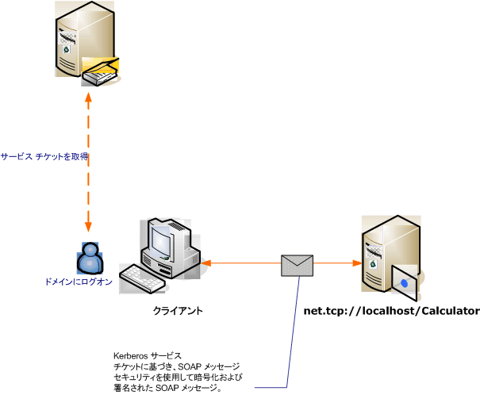

# <a name="message-security-with-a-windows-client-without-credential-negotiation"></a><span data-ttu-id="e6e4f-102">資格情報ネゴシエーションを使用しない Windows クライアントを使用するメッセージ セキュリティ</span><span class="sxs-lookup"><span data-stu-id="e6e4f-102">Message Security with a Windows Client without Credential Negotiation</span></span>
<span data-ttu-id="e6e4f-103">次のシナリオは、Kerberos プロトコルによって保護される [!INCLUDE[indigo1](../../../../includes/indigo1-md.md)] のクライアントとサービスを示します。</span><span class="sxs-lookup"><span data-stu-id="e6e4f-103">The following scenario shows a [!INCLUDE[indigo1](../../../../includes/indigo1-md.md)] client and service secured by the Kerberos protocol.</span></span>  
  
 <span data-ttu-id="e6e4f-104">サービスとクライアントは、いずれも同じドメインまたは信頼できるドメインに配置されています。</span><span class="sxs-lookup"><span data-stu-id="e6e4f-104">Both the service and the client are in the same domain or trusted domains.</span></span>  
  
> [!NOTE]
>  <span data-ttu-id="e6e4f-105">このシナリオの違いと[メッセージ セキュリティと Windows クライアント](../../../../docs/framework/wcf/feature-details/message-security-with-a-windows-client.md)は、このシナリオがアプリケーションのメッセージを送信する前に、サービスとサービスの資格情報をネゴシエートできません。</span><span class="sxs-lookup"><span data-stu-id="e6e4f-105">The difference between this scenario and [Message Security with a Windows Client](../../../../docs/framework/wcf/feature-details/message-security-with-a-windows-client.md) is that this scenario does not negotiate the service credential with the service prior to sending the application message.</span></span> <span data-ttu-id="e6e4f-106">また、このシナリオでは Kerberos プロトコルを使用するので、Windows ドメイン環境が必要になります。</span><span class="sxs-lookup"><span data-stu-id="e6e4f-106">Additionally, because this requires the Kerberos protocol, this scenario requires a Windows domain environment.</span></span>  
  
 <span data-ttu-id="e6e4f-107"></span><span class="sxs-lookup"><span data-stu-id="e6e4f-107"></span></span>  
  
|<span data-ttu-id="e6e4f-108">特徴</span><span class="sxs-lookup"><span data-stu-id="e6e4f-108">Characteristic</span></span>|<span data-ttu-id="e6e4f-109">説明</span><span class="sxs-lookup"><span data-stu-id="e6e4f-109">Description</span></span>|  
|--------------------|-----------------|  
|<span data-ttu-id="e6e4f-110">セキュリティ モード</span><span class="sxs-lookup"><span data-stu-id="e6e4f-110">Security Mode</span></span>|<span data-ttu-id="e6e4f-111">メッセージ</span><span class="sxs-lookup"><span data-stu-id="e6e4f-111">Message</span></span>|  
|<span data-ttu-id="e6e4f-112">相互運用性</span><span class="sxs-lookup"><span data-stu-id="e6e4f-112">Interoperability</span></span>|<span data-ttu-id="e6e4f-113">○ Kerberos トークン プロファイル互換クライアントを使用する WS-Security</span><span class="sxs-lookup"><span data-stu-id="e6e4f-113">Yes, WS-Security with Kerberos token-profile compatible clients</span></span>|  
|<span data-ttu-id="e6e4f-114">認証 (サーバー)</span><span class="sxs-lookup"><span data-stu-id="e6e4f-114">Authentication (Server)</span></span>|<span data-ttu-id="e6e4f-115">サーバーとクライアントの相互認証</span><span class="sxs-lookup"><span data-stu-id="e6e4f-115">Mutual authentication of the server and client</span></span>|  
|<span data-ttu-id="e6e4f-116">認証 (クライアント)</span><span class="sxs-lookup"><span data-stu-id="e6e4f-116">Authentication (Client)</span></span>|<span data-ttu-id="e6e4f-117">サーバーとクライアントの相互認証</span><span class="sxs-lookup"><span data-stu-id="e6e4f-117">Mutual authentication of the server and client</span></span>|  
|<span data-ttu-id="e6e4f-118">整合性</span><span class="sxs-lookup"><span data-stu-id="e6e4f-118">Integrity</span></span>|<span data-ttu-id="e6e4f-119">はい</span><span class="sxs-lookup"><span data-stu-id="e6e4f-119">Yes</span></span>|  
|<span data-ttu-id="e6e4f-120">機密性</span><span class="sxs-lookup"><span data-stu-id="e6e4f-120">Confidentiality</span></span>|<span data-ttu-id="e6e4f-121">はい</span><span class="sxs-lookup"><span data-stu-id="e6e4f-121">Yes</span></span>|  
|<span data-ttu-id="e6e4f-122">Transport</span><span class="sxs-lookup"><span data-stu-id="e6e4f-122">Transport</span></span>|<span data-ttu-id="e6e4f-123">HTTP</span><span class="sxs-lookup"><span data-stu-id="e6e4f-123">HTTP</span></span>|  
|<span data-ttu-id="e6e4f-124">バインディング</span><span class="sxs-lookup"><span data-stu-id="e6e4f-124">Binding</span></span>|<xref:System.ServiceModel.WSHttpBinding>|  
  
## <a name="service"></a><span data-ttu-id="e6e4f-125">サービス</span><span class="sxs-lookup"><span data-stu-id="e6e4f-125">Service</span></span>  
 <span data-ttu-id="e6e4f-126">次のコードと構成は、別々に実行します。</span><span class="sxs-lookup"><span data-stu-id="e6e4f-126">The following code and configuration are meant to run independently.</span></span> <span data-ttu-id="e6e4f-127">次のいずれかの操作を行います。</span><span class="sxs-lookup"><span data-stu-id="e6e4f-127">Do one of the following:</span></span>  
  
-   <span data-ttu-id="e6e4f-128">構成を使用せずに、コードを使用してスタンドアロン サービスを作成します。</span><span class="sxs-lookup"><span data-stu-id="e6e4f-128">Create a stand-alone service using the code with no configuration.</span></span>  
  
-   <span data-ttu-id="e6e4f-129">提供された構成を使用してサービスを作成しますが、エンドポイントを定義しません。</span><span class="sxs-lookup"><span data-stu-id="e6e4f-129">Create a service using the supplied configuration, but do not define any endpoints.</span></span>  
  
### <a name="code"></a><span data-ttu-id="e6e4f-130">コード</span><span class="sxs-lookup"><span data-stu-id="e6e4f-130">Code</span></span>  
 <span data-ttu-id="e6e4f-131">次のコードは、メッセージ セキュリティを使用するサービス エンドポイントを作成します。</span><span class="sxs-lookup"><span data-stu-id="e6e4f-131">The following code creates a service endpoint that uses message security.</span></span> <span data-ttu-id="e6e4f-132">このコードは、サービス資格情報のネゴシエーションとセキュリティ コンテキスト トークン (SCT) の確立を無効にします。</span><span class="sxs-lookup"><span data-stu-id="e6e4f-132">The code disables service credential negotiation, and the establishment of a security context token (SCT).</span></span>  
  
> [!NOTE]
>  <span data-ttu-id="e6e4f-133">ネゴシエートせずに Windows の資格情報を使用するには、サービスのユーザー アカウントが、Active Directory ドメインを使用して登録されたサービス プリンシパル名 (SPN) にアクセスする必要があります。</span><span class="sxs-lookup"><span data-stu-id="e6e4f-133">To use the Windows credential type without negotiation, the service's user account must have access to service principal name (SPN) that is registered with the Active Directory domain.</span></span> <span data-ttu-id="e6e4f-134">これは次の 2 つの方法で実行できます。</span><span class="sxs-lookup"><span data-stu-id="e6e4f-134">You can do this in two ways:</span></span>  
  
1.  <span data-ttu-id="e6e4f-135">`NetworkService` アカウントまたは `LocalSystem` アカウントを使用してサービスを実行します。</span><span class="sxs-lookup"><span data-stu-id="e6e4f-135">Use the `NetworkService` or `LocalSystem` account to run your service.</span></span> <span data-ttu-id="e6e4f-136">これらのアカウントは、コンピューターが Active Directory ドメインに参加したときに確立されたコンピューターの SPN にアクセスできるため、[!INCLUDE[indigo2](../../../../includes/indigo2-md.md)] は適切な SPN 要素をサービスのメタデータ (Web サービス記述言語 (WSDL)) にあるサービスのエンドポイント内部に自動的に生成します。</span><span class="sxs-lookup"><span data-stu-id="e6e4f-136">Because those accounts have access to the machine SPN that is established when the machine joins the Active Directory domain, [!INCLUDE[indigo2](../../../../includes/indigo2-md.md)] automatically generates the proper SPN element inside the service's endpoint in the service's metadata (Web Services Description Language, or WSDL).</span></span>  
  
2.  <span data-ttu-id="e6e4f-137">任意の Active Directory ドメイン アカウントを使用してサービスを実行します。</span><span class="sxs-lookup"><span data-stu-id="e6e4f-137">Use an arbitrary Active Directory domain account to run your service.</span></span> <span data-ttu-id="e6e4f-138">この場合、そのドメイン アカウント用の SPN を確立する必要があります。</span><span class="sxs-lookup"><span data-stu-id="e6e4f-138">In this case, you need to establish an SPN for that domain account.</span></span> <span data-ttu-id="e6e4f-139">これを行うには、Setspn.exe ユーティリティ ツールを使用する方法があります。</span><span class="sxs-lookup"><span data-stu-id="e6e4f-139">One way of doing this is to use the Setspn.exe utility tool.</span></span> <span data-ttu-id="e6e4f-140">サービスのアカウント用の SPN を作成したら、SPN をそのメタデータ (WSDL) を通じてサービスのクライアントに公開するように [!INCLUDE[indigo2](../../../../includes/indigo2-md.md)] を構成します。</span><span class="sxs-lookup"><span data-stu-id="e6e4f-140">Once the SPN is created for the service's account, configure [!INCLUDE[indigo2](../../../../includes/indigo2-md.md)] to publish that SPN to the service's clients through its metadata (WSDL).</span></span> <span data-ttu-id="e6e4f-141">これを行うには、アプリケーション構成ファイルまたはコードのどちらかを使用して、公開されるエンドポイントのエンドポイント ID を設定します。</span><span class="sxs-lookup"><span data-stu-id="e6e4f-141">This is done by setting the endpoint identity for the exposed endpoint, either though an application configuration file or code.</span></span> <span data-ttu-id="e6e4f-142">プログラムで ID を公開する方法を次の例に示します。</span><span class="sxs-lookup"><span data-stu-id="e6e4f-142">The following example publishes the identity programmatically.</span></span>  
  
 [!INCLUDE[crabout](../../../../includes/crabout-md.md)]<span data-ttu-id="e6e4f-143">Spn、Kerberos プロトコル、および Active Directory を参照してください。 [Kerberos テクニカル Supplement for Windows](http://go.microsoft.com/fwlink/?LinkId=88330)です。</span><span class="sxs-lookup"><span data-stu-id="e6e4f-143"> SPNs, the Kerberos protocol, and Active Directory, see [Kerberos Technical Supplement for Windows](http://go.microsoft.com/fwlink/?LinkId=88330).</span></span> [!INCLUDE[crabout](../../../../includes/crabout-md.md)]<span data-ttu-id="e6e4f-144">エンドポイントの id を参照してください[SecurityBindingElement 認証モード](../../../../docs/framework/wcf/feature-details/securitybindingelement-authentication-modes.md)です。</span><span class="sxs-lookup"><span data-stu-id="e6e4f-144"> endpoint identities, see [SecurityBindingElement Authentication Modes](../../../../docs/framework/wcf/feature-details/securitybindingelement-authentication-modes.md).</span></span>  
  
 [!code-csharp[C_SecurityScenarios#12](../../../../samples/snippets/csharp/VS_Snippets_CFX/c_securityscenarios/cs/source.cs#12)]
 [!code-vb[C_SecurityScenarios#12](../../../../samples/snippets/visualbasic/VS_Snippets_CFX/c_securityscenarios/vb/source.vb#12)]  
  
### <a name="configuration"></a><span data-ttu-id="e6e4f-145">構成</span><span class="sxs-lookup"><span data-stu-id="e6e4f-145">Configuration</span></span>  
 <span data-ttu-id="e6e4f-146">コードの代わりに次の構成を使用できます。</span><span class="sxs-lookup"><span data-stu-id="e6e4f-146">The following configuration can be used instead of the code.</span></span>  
  
```xml  
<?xml version="1.0" encoding="utf-8"?>  
<configuration>  
  <system.serviceModel>  
    <behaviors />  
    <services>  
      <service behaviorConfiguration="" name="ServiceModel.Calculator">  
        <endpoint address="http://localhost/Calculator"   
                  binding="wsHttpBinding"  
                  bindingConfiguration="KerberosBinding"  
                  name="WSHttpBinding_ICalculator"  
                  contract="ServiceModel.ICalculator"   
                  listenUri="net.tcp://localhost/metadata" >  
         <identity>  
            <servicePrincipalName value="service_spn_name" />  
         </identity>  
        </endpoint>  
      </service>  
    </services>  
    <bindings>  
      <wsHttpBinding>  
        <binding name="KerberosBinding">  
          <security>  
            <message negotiateServiceCredential="false"   
                     establishSecurityContext="false" />  
          </security>  
        </binding>  
      </wsHttpBinding>  
    </bindings>  
    <client />  
  </system.serviceModel>  
</configuration>  
```  
  
## <a name="client"></a><span data-ttu-id="e6e4f-147">Client</span><span class="sxs-lookup"><span data-stu-id="e6e4f-147">Client</span></span>  
 <span data-ttu-id="e6e4f-148">次のコードと構成は、別々に実行します。</span><span class="sxs-lookup"><span data-stu-id="e6e4f-148">The following code and configuration are meant to run independently.</span></span> <span data-ttu-id="e6e4f-149">次のいずれかの操作を行います。</span><span class="sxs-lookup"><span data-stu-id="e6e4f-149">Do one of the following:</span></span>  
  
-   <span data-ttu-id="e6e4f-150">コード (およびクライアント コード) を使用してスタンドアロン クライアントを作成します。</span><span class="sxs-lookup"><span data-stu-id="e6e4f-150">Create a stand-alone client using the code (and client code).</span></span>  
  
-   <span data-ttu-id="e6e4f-151">エンドポイント アドレスを定義しないクライアントを作成します。</span><span class="sxs-lookup"><span data-stu-id="e6e4f-151">Create a client that does not define any endpoint addresses.</span></span> <span data-ttu-id="e6e4f-152">代わりに、引数として構成名を受け取るクライアント コンストラクターを使用します。</span><span class="sxs-lookup"><span data-stu-id="e6e4f-152">Instead, use the client constructor that takes the configuration name as an argument.</span></span> <span data-ttu-id="e6e4f-153">次に例を示します。</span><span class="sxs-lookup"><span data-stu-id="e6e4f-153">For example:</span></span>  
  
     [!code-csharp[C_SecurityScenarios#0](../../../../samples/snippets/csharp/VS_Snippets_CFX/c_securityscenarios/cs/source.cs#0)]
     [!code-vb[C_SecurityScenarios#0](../../../../samples/snippets/visualbasic/VS_Snippets_CFX/c_securityscenarios/vb/source.vb#0)]  
  
### <a name="code"></a><span data-ttu-id="e6e4f-154">コード</span><span class="sxs-lookup"><span data-stu-id="e6e4f-154">Code</span></span>  
 <span data-ttu-id="e6e4f-155">クライアントを構成する場合のコード例を次に示します。</span><span class="sxs-lookup"><span data-stu-id="e6e4f-155">The following code configures the client.</span></span> <span data-ttu-id="e6e4f-156">セキュリティ モードは Message に設定され、クライアント資格情報の種類は Windows に設定されています。</span><span class="sxs-lookup"><span data-stu-id="e6e4f-156">The security mode is set to Message, and the client credential type is set to Windows.</span></span> <span data-ttu-id="e6e4f-157"><xref:System.ServiceModel.MessageSecurityOverHttp.NegotiateServiceCredential%2A> プロパティと <xref:System.ServiceModel.NonDualMessageSecurityOverHttp.EstablishSecurityContext%2A> プロパティには、`false` が設定されていることに注意してください。</span><span class="sxs-lookup"><span data-stu-id="e6e4f-157">Note that the <xref:System.ServiceModel.MessageSecurityOverHttp.NegotiateServiceCredential%2A> and <xref:System.ServiceModel.NonDualMessageSecurityOverHttp.EstablishSecurityContext%2A> properties are set to `false`.</span></span>  
  
> [!NOTE]
>  <span data-ttu-id="e6e4f-158">ネゴシエートせずに Windows の資格情報を使用するには、サービスとの通信を開始する前に、サービスのアカウントの SPN を使用してクライアントを構成する必要があります。</span><span class="sxs-lookup"><span data-stu-id="e6e4f-158">To use Windows credential type without negotiation, the client must be configured with the service's account SPN prior to commencing the communication with the service.</span></span> <span data-ttu-id="e6e4f-159">クライアントは SPN を使用して Kerberos トークンを取得し、サービスとの通信を認証し保護します。</span><span class="sxs-lookup"><span data-stu-id="e6e4f-159">The client uses the SPN to get the Kerberos token to authenticate and secure the communication with the service.</span></span> <span data-ttu-id="e6e4f-160">サービスの SPN を使用してクライアントを構成する方法を次の例に示します。</span><span class="sxs-lookup"><span data-stu-id="e6e4f-160">The following sample shows how to configure the client with the service's SPN.</span></span> <span data-ttu-id="e6e4f-161">使用している場合、 [ServiceModel メタデータ ユーティリティ ツール (Svcutil.exe)](../../../../docs/framework/wcf/servicemodel-metadata-utility-tool-svcutil-exe.md)クライアントを生成するに、サービスの SPN は自動的に反映されますをクライアントにサービスのメタデータ (WSDL) から、サービスのメタデータが含まれている場合その情報です。</span><span class="sxs-lookup"><span data-stu-id="e6e4f-161">If you are using the [ServiceModel Metadata Utility Tool (Svcutil.exe)](../../../../docs/framework/wcf/servicemodel-metadata-utility-tool-svcutil-exe.md) to generate the client, the service's SPN will be automatically propagated to the client from the service's metadata (WSDL), if the service's metadata contains that information.</span></span> <span data-ttu-id="e6e4f-162">サービスのメタデータにその SPN を含めるようにサービスを構成する方法[!INCLUDE[crabout](../../../../includes/crabout-md.md)]、このトピックの「サービス」を参照してください。</span><span class="sxs-lookup"><span data-stu-id="e6e4f-162">[!INCLUDE[crabout](../../../../includes/crabout-md.md)] how to configure the service to include its SPN in the service's metadata, see the "Service" section later in this topic .</span></span>  
>   
>  <span data-ttu-id="e6e4f-163">Spn、Kerberos、および Active Directory の詳細については、次を参照してください。 [Kerberos テクニカル Supplement for Windows](http://go.microsoft.com/fwlink/?LinkId=88330)です。</span><span class="sxs-lookup"><span data-stu-id="e6e4f-163">For more information about SPNs, Kerberos, and Active Directory, see [Kerberos Technical Supplement for Windows](http://go.microsoft.com/fwlink/?LinkId=88330).</span></span> [!INCLUDE[crabout](../../../../includes/crabout-md.md)]<span data-ttu-id="e6e4f-164">エンドポイントの id を参照してください[SecurityBindingElement 認証モード](../../../../docs/framework/wcf/feature-details/securitybindingelement-authentication-modes.md)トピックです。</span><span class="sxs-lookup"><span data-stu-id="e6e4f-164"> endpoint identities, see [SecurityBindingElement Authentication Modes](../../../../docs/framework/wcf/feature-details/securitybindingelement-authentication-modes.md) topic.</span></span>  
  
 [!code-csharp[C_SecurityScenarios#19](../../../../samples/snippets/csharp/VS_Snippets_CFX/c_securityscenarios/cs/source.cs#19)]
 [!code-vb[C_SecurityScenarios#19](../../../../samples/snippets/visualbasic/VS_Snippets_CFX/c_securityscenarios/vb/source.vb#19)]  
  
### <a name="configuration"></a><span data-ttu-id="e6e4f-165">構成</span><span class="sxs-lookup"><span data-stu-id="e6e4f-165">Configuration</span></span>  
 <span data-ttu-id="e6e4f-166">クライアントを構成する場合のコード例を次に示します。</span><span class="sxs-lookup"><span data-stu-id="e6e4f-166">The following code configures the client.</span></span> <span data-ttu-id="e6e4f-167">なお、 [ \<servicePrincipalName >](../../../../docs/framework/configure-apps/file-schema/wcf/serviceprincipalname.md)要素は、サービスの SPN を Active Directory ドメイン サービスのアカウントに登録されている一致するように設定する必要があります。</span><span class="sxs-lookup"><span data-stu-id="e6e4f-167">Note that the [\<servicePrincipalName>](../../../../docs/framework/configure-apps/file-schema/wcf/serviceprincipalname.md) element must be set to match the service's SPN as registered for the service's account in the Active Directory domain.</span></span>  
  
```xml  
<?xml version="1.0" encoding="utf-8"?>  
<configuration>  
  <system.serviceModel>  
    <bindings>  
      <wsHttpBinding>  
        <binding name="WSHttpBinding_ICalculator" >  
          <security mode="Message">  
            <message clientCredentialType="Windows"   
                     negotiateServiceCredential="false"  
                     establishSecurityContext="false" />  
          </security>  
        </binding>  
      </wsHttpBinding>  
    </bindings>  
    <client>  
      <endpoint address="http://localhost/Calculator"   
                binding="wsHttpBinding"  
                bindingConfiguration="WSHttpBinding_ICalculator"  
                contract="ICalculator"  
                name="WSHttpBinding_ICalculator">  
        <identity>  
          <servicePrincipalName value="service_spn_name" />  
        </identity>  
      </endpoint>  
    </client>  
  </system.serviceModel>  
</configuration>  
```  
  
## <a name="see-also"></a><span data-ttu-id="e6e4f-168">関連項目</span><span class="sxs-lookup"><span data-stu-id="e6e4f-168">See Also</span></span>  
 [<span data-ttu-id="e6e4f-169">セキュリティの概要</span><span class="sxs-lookup"><span data-stu-id="e6e4f-169">Security Overview</span></span>](../../../../docs/framework/wcf/feature-details/security-overview.md)  
 [<span data-ttu-id="e6e4f-170">サービス Id と認証</span><span class="sxs-lookup"><span data-stu-id="e6e4f-170">Service Identity and Authentication</span></span>](../../../../docs/framework/wcf/feature-details/service-identity-and-authentication.md)  
 [<span data-ttu-id="e6e4f-171">Windows Server App Fabric のセキュリティ モデル</span><span class="sxs-lookup"><span data-stu-id="e6e4f-171">Security Model for Windows Server App Fabric</span></span>](http://go.microsoft.com/fwlink/?LinkID=201279&clcid=0x409)
