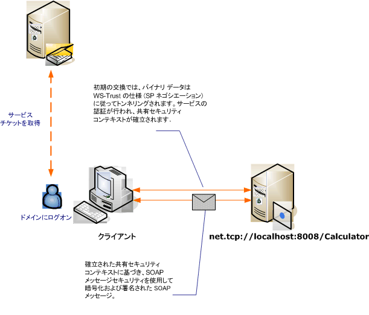

# Windows クライアントとのメッセージ セキュリティ
このシナリオでは、メッセージ セキュリティ モードによって保護されている [!INCLUDE[indigo1](../../../../includes/indigo1-md.md)] クライアントおよびサーバーを示します。クライアントとサービスは、Windows 資格情報を使用して認証します。  
  
   
  
|特性|説明|  
|--------|--------|  
|セキュリティ モード|メッセージ|  
|相互運用性|[!INCLUDE[indigo2](../../../../includes/indigo2-md.md)] のみ|  
|認証 \(サーバー\)|サーバーとクライアントの相互認証|  
|認証 \(クライアント\)|サーバーとクライアントの相互認証|  
|整合性|はい、共有のセキュリティ コンテキストを使用します|  
|機密性|はい、共有のセキュリティ コンテキストを使用します|  
|トランスポート|NET.TCP|  
|バインディング|<xref:System.ServiceModel.NetTcpBinding>|  
  
## サービス  
 次のコードと構成は、別々に実行します。以下のいずれかを実行します。  
  
-   構成を使用せずに、コードを使用してスタンドアロン サービスを作成します。  
  
-   提供された構成を使用してサービスを作成しますが、エンドポイントを定義しません。  
  
### コード  
 次のコードでは、メッセージ セキュリティを使用するサービス エンドポイントを作成し、Windows コンピューターとの間にセキュリティで保護されたコンテキストを確立する方法を示します。  
  
 [!code-csharp[C_SecurityScenarios#11](../../../../samples/snippets/csharp/VS_Snippets_CFX/c_securityscenarios/cs/source.cs#11)]
 [!code-vb[C_SecurityScenarios#11](../../../../samples/snippets/visualbasic/VS_Snippets_CFX/c_securityscenarios/vb/source.vb#11)]  
  
### 構成  
 コードの代わりに次の構成を使用して、サービスをセットアップできます。  
  
```  
<?xml version="1.0" encoding="utf-8"?>  
<configuration>  
  <system.serviceModel>  
    <services>  
      <service behaviorConfiguration=""  
               name="ServiceModel.Calculator">  
        <endpoint address="net.tcp://localhost:8008/Calculator"  
                  binding="netTcpBinding"  
                  bindingConfiguration="Windows"  
                  name="WindowsOverMessage"  
                  contract="ServiceModel.ICalculator" />  
      </service>  
    </services>  
    <bindings>  
      <netTcpBinding>  
        <binding name="Windows">  
          <security mode="Message">  
            <message clientCredentialType="Windows" />  
          </security>  
        </binding>  
      </netTcpBinding>  
    </bindings>  
    <client />  
  </system.serviceModel>  
</configuration>  
```  
  
## クライアント  
 次のコードと構成は、別々に実行します。以下のいずれかの操作を行います。  
  
-   コード \(およびクライアント コード\) を使用してスタンドアロン クライアントを作成します。  
  
-   エンドポイント アドレスを定義しないクライアントを作成します。代わりに、引数として構成名を受け取るクライアント コンストラクターを使用します。例 :  
  
     [!code-csharp[C_SecurityScenarios#0](../../../../samples/snippets/csharp/VS_Snippets_CFX/c_securityscenarios/cs/source.cs#0)]
     [!code-vb[C_SecurityScenarios#0](../../../../samples/snippets/visualbasic/VS_Snippets_CFX/c_securityscenarios/vb/source.vb#0)]  
  
### コード  
 クライアントを作成する場合のコード例を次に示します。バインディングはメッセージ モード セキュリティに対して行い、クライアント資格情報の種類は `Windows` に設定します。  
  
 [!code-csharp[C_SecurityScenarios#18](../../../../samples/snippets/csharp/VS_Snippets_CFX/c_securityscenarios/cs/source.cs#18)]
 [!code-vb[C_SecurityScenarios#18](../../../../samples/snippets/visualbasic/VS_Snippets_CFX/c_securityscenarios/vb/source.vb#18)]  
  
### 構成  
 次の構成を使用してクライアントのプロパティを設定します。  
  
```  
<?xml version="1.0" encoding="utf-8"?>  
<configuration>  
  <system.serviceModel>  
    <bindings>  
      <netTcpBinding>  
        <binding name="NetTcpBinding_ICalculator" >  
         <security mode="Message">  
            <message clientCredentialType="Windows" />  
          </security>  
        </binding>  
      </netTcpBinding>  
    </bindings>  
    <client>  
      <endpoint address="net.tcp://machineName:8008/Calculator"   
                binding="netTcpBinding"  
                bindingConfiguration="NetTcpBinding_ICalculator"  
                contract="ICalculator"  
                name="NetTcpBinding_ICalculator">          
      </endpoint>  
    </client>  
  </system.serviceModel>  
</configuration>  
```  
  
## 参照  
 [セキュリティの概要](../../../../docs/framework/wcf/feature-details/security-overview.md)   
 [Windows Server AppFabric のセキュリティ モデル](http://go.microsoft.com/fwlink/?LinkID=201279&clcid=0x409)