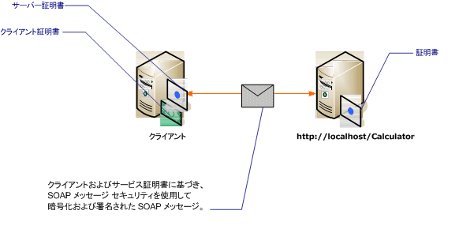

# <a name="message-security-with-mutual-certificates"></a><span data-ttu-id="87c57-102">メッセージ セキュリティと相互の証明書</span><span class="sxs-lookup"><span data-stu-id="87c57-102">Message Security with Mutual Certificates</span></span>
<span data-ttu-id="87c57-103">次のシナリオでは、メッセージ セキュリティ モードを使用して保護されている [!INCLUDE[indigo1](../../../../includes/indigo1-md.md)] サービスおよびクライアントを示します。</span><span class="sxs-lookup"><span data-stu-id="87c57-103">The following scenario shows a [!INCLUDE[indigo1](../../../../includes/indigo1-md.md)] service and client secured using message security mode.</span></span> <span data-ttu-id="87c57-104">クライアントとサービスは、証明書を使用して認証されます。</span><span class="sxs-lookup"><span data-stu-id="87c57-104">The client and the service are authenticated with certificates.</span></span>  
  
 <span data-ttu-id="87c57-105">このシナリオは、X.509 証明書トークン プロファイルと共に WS-Security を使用するため、相互運用性があります。</span><span class="sxs-lookup"><span data-stu-id="87c57-105">This scenario is interoperable because it uses WS-Security with the X.509 certificate token profile.</span></span>  
  
> [!NOTE]
>  <span data-ttu-id="87c57-106">このシナリオでは、サービス証明書のネゴシエーションは実行されません。</span><span class="sxs-lookup"><span data-stu-id="87c57-106">This scenario does not perform negotiation of the service certificate.</span></span> <span data-ttu-id="87c57-107">通信を開始する前に、サービス証明書をクライアントに提供しておく必要があります。</span><span class="sxs-lookup"><span data-stu-id="87c57-107">The service certificate must be provided to the client in advance of any communication.</span></span> <span data-ttu-id="87c57-108">サーバー証明書は、アプリケーションと共に配布したり、帯域外通信で提供できます。</span><span class="sxs-lookup"><span data-stu-id="87c57-108">The server certificate can be distributed with the application or provided in an out-of-band communication.</span></span>  
  
 <span data-ttu-id="87c57-109"></span><span class="sxs-lookup"><span data-stu-id="87c57-109"></span></span>  
  
|<span data-ttu-id="87c57-110">特徴</span><span class="sxs-lookup"><span data-stu-id="87c57-110">Characteristic</span></span>|<span data-ttu-id="87c57-111">説明</span><span class="sxs-lookup"><span data-stu-id="87c57-111">Description</span></span>|  
|--------------------|-----------------|  
|<span data-ttu-id="87c57-112">セキュリティ モード</span><span class="sxs-lookup"><span data-stu-id="87c57-112">Security Mode</span></span>|<span data-ttu-id="87c57-113">メッセージ</span><span class="sxs-lookup"><span data-stu-id="87c57-113">Message</span></span>|  
|<span data-ttu-id="87c57-114">相互運用性</span><span class="sxs-lookup"><span data-stu-id="87c57-114">Interoperability</span></span>|<span data-ttu-id="87c57-115">○ WS-Security および X.509 証明書トークン プロファイルと互換性があるクライアントとサービスで相互運用性があります。</span><span class="sxs-lookup"><span data-stu-id="87c57-115">Yes, with WS-Security and X.509 certificate token profile compatible clients and services.</span></span>|  
|<span data-ttu-id="87c57-116">認証</span><span class="sxs-lookup"><span data-stu-id="87c57-116">Authentication</span></span>|<span data-ttu-id="87c57-117">サーバーとクライアントの相互認証</span><span class="sxs-lookup"><span data-stu-id="87c57-117">Mutual authentication of the server and client.</span></span>|  
|<span data-ttu-id="87c57-118">整合性</span><span class="sxs-lookup"><span data-stu-id="87c57-118">Integrity</span></span>|<span data-ttu-id="87c57-119">はい</span><span class="sxs-lookup"><span data-stu-id="87c57-119">Yes</span></span>|  
|<span data-ttu-id="87c57-120">機密性</span><span class="sxs-lookup"><span data-stu-id="87c57-120">Confidentiality</span></span>|<span data-ttu-id="87c57-121">はい</span><span class="sxs-lookup"><span data-stu-id="87c57-121">Yes</span></span>|  
|<span data-ttu-id="87c57-122">Transport</span><span class="sxs-lookup"><span data-stu-id="87c57-122">Transport</span></span>|<span data-ttu-id="87c57-123">HTTP</span><span class="sxs-lookup"><span data-stu-id="87c57-123">HTTP</span></span>|  
|<span data-ttu-id="87c57-124">バインディング</span><span class="sxs-lookup"><span data-stu-id="87c57-124">Binding</span></span>|<xref:System.ServiceModel.WSHttpBinding>|  
  
## <a name="service"></a><span data-ttu-id="87c57-125">サービス</span><span class="sxs-lookup"><span data-stu-id="87c57-125">Service</span></span>  
 <span data-ttu-id="87c57-126">次のコードと構成は、別々に実行します。</span><span class="sxs-lookup"><span data-stu-id="87c57-126">The following code and configuration are meant to run independently.</span></span> <span data-ttu-id="87c57-127">次のいずれかの操作を行います。</span><span class="sxs-lookup"><span data-stu-id="87c57-127">Do one of the following:</span></span>  
  
-   <span data-ttu-id="87c57-128">構成を使用せずに、コードを使用してスタンドアロン サービスを作成します。</span><span class="sxs-lookup"><span data-stu-id="87c57-128">Create a stand-alone service using the code with no configuration.</span></span>  
  
-   <span data-ttu-id="87c57-129">提供された構成を使用してサービスを作成しますが、エンドポイントを定義しません。</span><span class="sxs-lookup"><span data-stu-id="87c57-129">Create a service using the supplied configuration, but do not define any endpoints.</span></span>  
  
### <a name="code"></a><span data-ttu-id="87c57-130">コード</span><span class="sxs-lookup"><span data-stu-id="87c57-130">Code</span></span>  
 <span data-ttu-id="87c57-131">次のコードでは、メッセージ セキュリティを使用するサービス エンドポイントを作成します。</span><span class="sxs-lookup"><span data-stu-id="87c57-131">The following code shows creates a service endpoint that uses message security.</span></span> <span data-ttu-id="87c57-132">サービスには、自身を認証するための証明書が必要です。</span><span class="sxs-lookup"><span data-stu-id="87c57-132">The service requires a certificate to authenticate itself.</span></span>  
  
 [!code-csharp[C_SecurityScenarios#13](../../../../samples/snippets/csharp/VS_Snippets_CFX/c_securityscenarios/cs/source.cs#13)]
 [!code-vb[C_SecurityScenarios#13](../../../../samples/snippets/visualbasic/VS_Snippets_CFX/c_securityscenarios/vb/source.vb#13)]  
  
### <a name="configuration"></a><span data-ttu-id="87c57-133">構成</span><span class="sxs-lookup"><span data-stu-id="87c57-133">Configuration</span></span>  
 <span data-ttu-id="87c57-134">コードの代わりに次の構成を使用して、同じサービスを作成できます。</span><span class="sxs-lookup"><span data-stu-id="87c57-134">The following configuration can be used instead of the code to create the same service.</span></span>  
  
```xml  
<?xml version="1.0" encoding="utf-8"?>  
<configuration>  
  <system.serviceModel>  
    <behaviors>  
      <serviceBehaviors>  
        <behavior name="serviceCredentialBehavior">  
          <serviceCredentials>  
            <serviceCertificate findValue="Contoso.com"   
                                storeLocation="LocalMachine"  
                                storeName="My"   
                                x509FindType="FindBySubjectName" />  
          </serviceCredentials>  
        </behavior>  
      </serviceBehaviors>  
    </behaviors>  
    <services>  
      <service behaviorConfiguration="serviceCredentialBehavior"   
               name="ServiceModel.Calculator">  
        <endpoint address="http://localhost/Calculator"   
                  binding="wsHttpBinding"  
                  bindingConfiguration="InteropCertificateBinding"  
                  name="WSHttpBinding_ICalculator"  
                  contract="ServiceModel.ICalculator" />  
      </service>  
    </services>  
    <bindings>  
      <wsHttpBinding>  
        <binding name="InteropCertificateBinding">  
          <security mode="Message">  
            <message clientCredentialType="Certificate"  
                     negotiateServiceCredential="false"  
                     establishSecurityContext="false" />  
          </security>  
        </binding>  
      </wsHttpBinding>  
    </bindings>  
    <client />  
  </system.serviceModel>  
</configuration>  
```  
  
## <a name="client"></a><span data-ttu-id="87c57-135">クライアント</span><span class="sxs-lookup"><span data-stu-id="87c57-135">Client</span></span>  
 <span data-ttu-id="87c57-136">次のコードと構成は、別々に実行します。</span><span class="sxs-lookup"><span data-stu-id="87c57-136">The following code and configuration are meant to run independently.</span></span> <span data-ttu-id="87c57-137">次のいずれかの操作を行います。</span><span class="sxs-lookup"><span data-stu-id="87c57-137">Do one of the following:</span></span>  
  
-   <span data-ttu-id="87c57-138">コード (およびクライアント コード) を使用してスタンドアロン クライアントを作成します。</span><span class="sxs-lookup"><span data-stu-id="87c57-138">Create a stand-alone client using the code (and client code).</span></span>  
  
-   <span data-ttu-id="87c57-139">エンドポイント アドレスを定義しないクライアントを作成します。</span><span class="sxs-lookup"><span data-stu-id="87c57-139">Create a client that does not define any endpoint addresses.</span></span> <span data-ttu-id="87c57-140">代わりに、引数として構成名を受け取るクライアント コンストラクターを使用します。</span><span class="sxs-lookup"><span data-stu-id="87c57-140">Instead, use the client constructor that takes the configuration name as an argument.</span></span> <span data-ttu-id="87c57-141">次に例を示します。</span><span class="sxs-lookup"><span data-stu-id="87c57-141">For example:</span></span>  
  
     [!code-csharp[C_SecurityScenarios#0](../../../../samples/snippets/csharp/VS_Snippets_CFX/c_securityscenarios/cs/source.cs#0)]
     [!code-vb[C_SecurityScenarios#0](../../../../samples/snippets/visualbasic/VS_Snippets_CFX/c_securityscenarios/vb/source.vb#0)]  
  
### <a name="code"></a><span data-ttu-id="87c57-142">コード</span><span class="sxs-lookup"><span data-stu-id="87c57-142">Code</span></span>  
 <span data-ttu-id="87c57-143">クライアントを作成する場合のコード例を次に示します。</span><span class="sxs-lookup"><span data-stu-id="87c57-143">The following code creates the client.</span></span> <span data-ttu-id="87c57-144">セキュリティ モードは Message に設定され、クライアント資格情報の種類は Certificate に設定されています。</span><span class="sxs-lookup"><span data-stu-id="87c57-144">The security mode is set to Message, and the client credential type is set to Certificate.</span></span>  
  
 [!code-csharp[C_SecurityScenarios#20](../../../../samples/snippets/csharp/VS_Snippets_CFX/c_securityscenarios/cs/source.cs#20)]
 [!code-vb[C_SecurityScenarios#20](../../../../samples/snippets/visualbasic/VS_Snippets_CFX/c_securityscenarios/vb/source.vb#20)]  
  
### <a name="configuration"></a><span data-ttu-id="87c57-145">構成</span><span class="sxs-lookup"><span data-stu-id="87c57-145">Configuration</span></span>  
 <span data-ttu-id="87c57-146">次のコードは、クライアントを構成します。</span><span class="sxs-lookup"><span data-stu-id="87c57-146">The following configures the client.</span></span> <span data-ttu-id="87c57-147">使用してクライアント証明書を指定する必要があります、 [ \<clientCertificate >](../../../../docs/framework/configure-apps/file-schema/wcf/clientcertificate-of-clientcredentials-element.md)です。</span><span class="sxs-lookup"><span data-stu-id="87c57-147">A client certificate must be specified using the [\<clientCertificate>](../../../../docs/framework/configure-apps/file-schema/wcf/clientcertificate-of-clientcredentials-element.md).</span></span> <span data-ttu-id="87c57-148">また、サービス証明書を使用して指定、 [ \<defaultCertificate >](../../../../docs/framework/configure-apps/file-schema/wcf/defaultcertificate-element.md)です。</span><span class="sxs-lookup"><span data-stu-id="87c57-148">Also, the service certificate is specified using the [\<defaultCertificate>](../../../../docs/framework/configure-apps/file-schema/wcf/defaultcertificate-element.md).</span></span>  
  
```xml  
<?xml version="1.0" encoding="utf-8"?>  
<configuration>  
  <system.serviceModel>  
    <behaviors>  
      <endpointBehaviors>  
        <behavior name="ClientCredentialsBehavior">  
          <clientCredentials>  
            <clientCertificate findValue="Cohowinery.com"   
                 storeLocation="CurrentUser"  
                 storeName="My"  
                 x509FindType="FindBySubjectName" />  
            <serviceCertificate>  
              <defaultCertificate findValue="Contoso.com"   
                                  storeLocation="CurrentUser"  
                                  storeName="TrustedPeople"  
                                  x509FindType="FindBySubjectName" />  
            </serviceCertificate>  
          </clientCredentials>  
        </behavior>  
      </endpointBehaviors>  
    </behaviors>  
    <bindings>  
      <wsHttpBinding>  
        <binding name="WSHttpBinding_ICalculator" >  
          <security mode="Message">  
            <message clientCredentialType="Certificate"   
                     negotiateServiceCredential="false"  
                     establishSecurityContext="false" />  
          </security>  
        </binding>  
      </wsHttpBinding>  
    </bindings>  
    <client>  
      <endpoint address="http://machineName/Calculator"   
                behaviorConfiguration="ClientCredentialsBehavior"  
                binding="wsHttpBinding"   
                bindingConfiguration="WSHttpBinding_ICalculator"  
                contract="ICalculator"  
                name="WSHttpBinding_ICalculator">  
        <identity>  
          <certificate encodedValue="Encoded_Value_Not_Shown" />  
        </identity>  
      </endpoint>  
    </client>  
  </system.serviceModel>  
</configuration>  
```  
  
## <a name="see-also"></a><span data-ttu-id="87c57-149">関連項目</span><span class="sxs-lookup"><span data-stu-id="87c57-149">See Also</span></span>  
 [<span data-ttu-id="87c57-150">セキュリティの概要</span><span class="sxs-lookup"><span data-stu-id="87c57-150">Security Overview</span></span>](../../../../docs/framework/wcf/feature-details/security-overview.md)  
 [<span data-ttu-id="87c57-151">Windows Server App Fabric のセキュリティ モデル</span><span class="sxs-lookup"><span data-stu-id="87c57-151">Security Model for Windows Server App Fabric</span></span>](http://go.microsoft.com/fwlink/?LinkID=201279&clcid=0x409)  
 [<span data-ttu-id="87c57-152">方法: を作成し、開発時に、トランスポート セキュリティに WCF で一時的な証明書をインストール</span><span class="sxs-lookup"><span data-stu-id="87c57-152">How to: Create and Install Temporary Certificates in WCF for Transport Security During Development</span></span>](http://go.microsoft.com/fwlink/?LinkId=244264)
