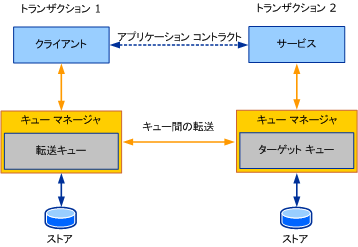

# キューの概要Queues Overview
ここでは、キューを使った通信の概要とその基本概念を解説します。This section introduces the general and core concepts behind queued communication. 後の各セクションでは、キューの概念がどのように [!INCLUDE[indigo1](../../../../includes/indigo1-md.md)] に活かされているかを詳しく説明します。Subsequent sections go into details about how the queuing concepts described here are manifested in [!INCLUDE[indigo1](../../../../includes/indigo1-md.md)].  
  
## キューの基本概念Basic Queuing Concepts  
 分散アプリケーションの設計では、サービスとクライアントとの間の通信に適したトランスポートを選択することが重要になります。When designing a distributed application, choosing the right transport for communication between services and clients is important. 使用するトランスポートの種類の決定には、いくつかの要素が影響します。Several factors affect the kind of transport to use. そのうちの 1 つである、サービス、クライアント、トランスポートの分離という重要な要素により、キューを使用するトランスポートと、TCP や HTTP などの直接的なトランスポートのどちらを使用するかが決定します。One important factor—isolation between the service, the client, and the transport—determines use of a queued transport or a direct transport, such as TCP or HTTP. TCP や HTTP などの直接的なトランスポートの性質により、サービスやクライアントの機能が停止したり、ネットワークに障害が発生したりすると、通信全体が停止します。Due to the nature of direct transports such as TCP and HTTP, communication stops altogether if the service or the client stop functioning or if the network fails. アプリケーションが全体として正常に機能するためには、サービス、クライアント、ネットワークがすべて揃って稼働している必要があります。The service, the client, and the network must be running at the same time for the application to work. キューを使用するトランスポートでは、分離が実現されます。つまり、サービスやクライアントが停止したり、これらの間の通信リンクに障害が発生したりしても、障害が発生していないサービスやクライアントは引き続き機能します。Queued transports provide isolation, which means that if the service or client fail or if communication links between them fail, the client and service can continue to function.  
  
 キューとは、通信ノードやネットワークの障害時にも通信の信頼性を確保するための手段です。Queues provide reliable communication even with failures in the communicating parties or the network. 通信ノード間で交換されたメッセージは、いったんキューに取り込まれ、それから配信されます。Queues capture and deliver messages exchanged between the communicating parties. 通常、キューはその過程で、記憶装置に保存されます。これは、一時的に記憶されるだけの場合も、ある程度の期間保存される場合もあります。Queues are typically backed by some kind of a store, which can be volatile or durable. キューは、クライアントからのメッセージをサービスに代わって保存しておき、後でサービスに転送します。Queues store messages from a client on behalf of a service and later forward these messages to the service. このように、仲介の役割を果たすキューにより、いずれかの通信ノードで生じた障害が分離されるので、システムの可用性およびサービスの分離を実現するには、キューを使用するトランスポートが適しています。The indirection queues provide ensured isolation of failure by either party, thus making it the preferred communication mechanism for high-availability systems and disconnected services. しかしその一方で、通信の遅延が大きい、という欠点があります。The indirection comes with the cost of high latency. *待機時間*サービスでは受信時間と、クライアントは、メッセージ送信時間の時間遅延がします。*Latency* is the time delay between the time the client sends a message and the time the service receives it. 遅延が大きいと、メッセージを送ってから実際に処理されるまでに、時間がかかります。This means that once a message is sent, you do not know when that message may be processed. キューを使用する多くのアプリケーションでは、この遅延への対策が講じられています。Most queued applications cope with high latency. 次の図は、キューに置かれた通信の概念モデルを表したものです。The following illustration shows a conceptual model of queued communication.  
  
   
  
 キューを使う通信の概念モデルQueued communication conceptual model  
  
 現実には、キューの概念は分散処理モデルに基づいています。In reality, the queue is a distributed concept. キューはサービスまたはクライアントと同じホスト上に配置される場合も、この両方から独立している場合もあります。As such, they can be local to either party or remote to both parties. 一般的には、キューはサービスと同じホスト上に配置します。Typically, the queue is local to the service. このような構成の場合、クライアント側では、リモート キューに接続していつでも使用できると想定することはできません。In this configuration, the client cannot depend on connectivity to the remote queue to be constantly available. 同様に、キューを使用するサービスの可用性に関係なく、キューの可用性が確保されなければなりません。Similarly, the queue must be available independent of the availability of the service reading from the queue. そこで、キューの管理がキュー マネージャーによって行われます。A queue manager manages a collection of queues. キュー マネージャーは、他のキュー マネージャーからキューに送信されたメッセージを受け取ります。It is responsible for accepting messages sent to its queues from other queue managers. さらに、リモート キューとの接続を管理し、これらのリモート キューにメッセージを転送するのもキュー マネージャーの役割です。It is also responsible for managing connectivity to remote queues and transferring messages to those remote queues. クライアントやサービスに障害が発生してもキューの可用性を確保できるように、キュー マネージャーは通常、外部サービスとして実行されます。To ensure availability of queues despite client or service application failures, the queue manager is typically run as an external service.  
  
 クライアントがメッセージをキューに送信すると、そのメッセージがターゲット キュー (サービス側のキュー マネージャーが管理するキュー) に送信されます。When a client sends a message to a queue, it addresses the message to the target queue, which is the queue managed by the service's queue manager. クライアント側のキュー マネージャーは、メッセージを転送キュー (送信キュー) に送ります。The queue manager on the client sends the message to a transmission (or outgoing) queue. 転送キューとは、クライアントのキュー マネージャーが管理するキューであり、ここではターゲット キューに転送されるメッセージがいったん蓄積されます。The transmission queue is a queue on the client queue manager that stores messages for transmission to the target queue. 次にキュー マネージャーは、ターゲット キューを管理するキュー マネージャーとの通信経路を検索し、転送します。The queue manager then finds a path to the queue manager that owns the target queue and transfers the message to it. 通信の信頼性を確保するために、キュー マネージャーには、データの損失を防止する転送プロトコルが実装されています。To ensure reliable communication, the queue managers implement a reliable transfer protocol to prevent data loss. 送信先のキュー マネージャーは、ターゲット キュー宛てのメッセージを受信してターゲット キューに格納します。The destination queue manager accepts messages addressed to the target queues it owns and stores the messages. ターゲット キューからの読み出しをサービスが要求すると、キュー マネージャーから目的のアプリケーションにメッセージが配信されます。The service makes requests to read from the target queue, at which time the queue manager then delivers the message to the destination application. 以上のやり取りに関与する 4 者の関係を図に示します。The following illustration shows communication between the four parties.  
  
   
  
 キューを使った通信 - 標準的な構成Queued communication in a typical deployment scenario  
  
 このように、キュー マネージャーによりサービスとクライアントが分離されているため、送信側または受信側のいずれかが停止していても、実際の通信には影響しません。Thus, the queue manager provides the required isolation so that the sender and receiver can independently fail without affecting actual communication. キューの導入によるもう 1 つの利点として、複数のアプリケーションが同じキューからメッセージを読み込めるため、各ノードが個別に通信する場合に比べ、スループットを改善できるという点があります。The benefit of extra indirection that queues provide also enables multiple application instances to read from the same queue, so that farming work among the nodes achieves higher throughput. 実際、拡張性やスループットを改善するためにキューを使用するケースも少なくありません。Therefore, it is not uncommon to see queues being used to achieve higher scale and throughput requirements.  
  
## キューとトランザクションQueues and Transactions  
 トランザクションでは、複数の操作をグループ化できるため、トランザクションに含まれる操作が 1 つでも失敗すると、すべての処理が失敗となります。Transactions allow you to group a set of operations together so that if one operation fails, all of the operations fail. 例として、ATM を使用して 10 万円を普通預金から当座預金に移すことを考えてみましょう。An example of how to use transactions is when a person uses an ATM to transfer $1,000 from his savings account to his checking account. これは、次の操作を伴います。This entails the following operations:  
  
-   普通預金から 10 万円を引き出す。Withdrawing $1,000 from the savings account.  
  
-   当座預金に 10 万円を預ける。Depositing $1,000 into the checking account.  
  
 最初の処理が成功して 10 万円が引き出された後、2 番目の操作が失敗すれば、既に引き出された 10 万円が失われてしまいます。If the first operation succeeds and $1,000 is withdrawn from the savings account but the second operation fails, the $1,000 is lost because it has already been withdrawn from the savings account. このような状況を避けて口座の状態を有効に維持するには、いずれか一方の操作に失敗したら、両方の操作を失敗と見なす必要があります。To keep the accounts in a valid state, if one operation fails, both operations must fail.  
  
 トランザクション メッセージでは、メッセージをキューに送る操作やキューから読み出す操作を、トランザクション内で行えます。In transactional messaging, messages can be sent to the queue and received from the queue under a transaction. つまり、トランザクション内でメッセージをキューに送った後でそのトランザクションがロールバックされると、その結果は、始めからメッセージを送らなかった場合と同じになります。Thus, if a message is sent in a transaction and the transaction is rolled back, then the outcome is as if the message had never been sent to the queue. 同様に、トランザクション内でメッセージを受け取った後でそのトランザクションがロールバックされると、その結果は、メッセージを受信しなかった場合と同じになります。Similarly if a message is received in a transaction and the transaction is rolled back, then the outcome is as if the message had never been received. メッセージはキューに残り、読み出せる状態になります。The message remains in the queue to be read.  
  
 遅延が大きいため、メッセージを送る時点では、ターゲット キューに到達するまでどれぐらいかかるか、サービスがそのメッセージを処理するのにどれぐらいかかるかを知る手段はありません。Because of high latency, when you send a message you have no way of knowing how long it takes to reach its target queue, nor do you know how long it takes for the service to process the message. したがって、単一のトランザクションを使用してメッセージの送信、受信、処理を行うことは、望ましくありません。Because of this, you do not want to use a single transaction to send the message, receive the message, and then process the message. トランザクション全体がコミットされるまでの時間が予測できないからです。This creates a transaction that is not committed for an indeterminate amount of time. トランザクションを使用してクライアントとサービスがキューを介して通信する場合は、クライアントとサービスでそれぞれトランザクションが必要になります。When a client and service communicate through a queue using a transaction, two transactions are involved: one on the client and one on the service. 下の図は、キューを使った典型的な通信でのトランザクション境界を示しています。The following illustration shows the transaction boundaries in typical queued communication.  
  
   
  
 キューを使った通信 - 送受信の別個のトランザクションQueued communication showing separate transactions for capture and delivery  
  
 クライアントのトランザクションでは、メッセージを処理し、送信します。The client transaction processes and sends the message. トランザクションがコミットされると、メッセージは転送キューに入ります。When the transaction is committed, the message is in the transmission queue. 一方、サービスでは、ターゲット キューからメッセージを読み取り、メッセージを処理して、トランザクションをコミットします。On the service, the transaction reads the message from the target queue, processes the message, and then commits the transaction. メッセージの処理中にエラーが発生すると、そのメッセージはロールバックされ、ターゲット キューに置かれます。If an error occurs during the processing, the message is rolled back and placed in the target queue.  
  
## キューを使った非同期通信Asynchronous Communication Using Queues  
 キューを利用すると非同期通信も可能です。Queues provide an asynchronous means of communication. キューを使用してメッセージを送信するアプリケーションは、キュー マネージャーで生じる遅延が大きいため、メッセージが受信側で受信および処理されるまで待機することができません。Applications that send messages using queues cannot wait for the message to be received and processed by the receiver because of high latency introduced by the queue manager. 想定以上に長い期間、メッセージがキューに残ったままになる可能性があるからです。Messages can remain in the queue for a far longer time than the application intended. この状況を回避するために、メッセージに有効期間 (TTL: Time-To-Live) を設定できるようになっています。To avoid this, the application can specify a Time-To-Live value on the message. これはメッセージが転送キューに留まっていられる時間を表す値です。This value specifies how long the message should remain in the transmission queue. この時間が経過してもターゲット キューに送信されなかったメッセージは、配信不能キューに転送することができます。If this time value is exceeded, and the message still has not been sent to the target queue, the message can be transferred to a dead-letter queue.  
  
 送信側がメッセージを送信した時点で、送信操作から制御が戻っても、送信側の転送キューにメッセージが到達したことを示しているにすぎません。When the sender sends a message, the return from the send operation implies that the message only made it to the transmission queue on the sender. ターゲット キューへの転送に失敗していても、送信元アプリケーションで、すぐにそれを知ることはできないのです。As such, if there is a failure in getting the message to the target queue, the sending application cannot know about it immediately. このような失敗を記録するために、失敗したメッセージは配信不能キューに転送されます。To take note of such failures, the failed message is transferred to a dead-letter queue.  
  
 ターゲット キューに到達できなかったり有効期間を経過したエラーは、個別に処理する必要があります。Any error, such as a message failing to reach the target queue or the Time-To-Live expiring, must be processed separately. このため、キューを使用するアプリケーションでは、次の 2 つに分けてロジックを記述することも少なくありません。It is not uncommon, therefore, for queued applications to write two sets of logic:  
  
-   正常時にクライアントおよびサービスがメッセージを送受信するためのロジックThe normal client and service logic of sending and receiving messages.  
  
-   失敗した転送や配信からのメッセージを処理するための補正ロジックCompensation logic to handle messages from the failed transmission or delivery.  
  
 以下のセクションで、これらの概念について説明します。The following sections discuss these concepts.  
  
## 配信不能キューのプログラミングDead-Letter Queue Programming  
 配信不能キューには、さまざまな原因によりターゲット キューに到達できなかったメッセージが収容されます。Dead-letter queues contain messages that failed to reach the target queue for various reasons. 原因としては、有効期限の経過や、ターゲット キューとの接続経路の異常などが考えられます。The reasons can range from expired messages to connectivity issues preventing transfer of the message to the target queue.  
  
 通常、アプリケーションは、システム全体の配信不能キューを読み取り、エラー原因を調べたうえで、エラー状態を修復して再送したり、エラーを記録したりするなどの適切な処理を行うことができます。Typically, an application can read messages from a system-wide dead-letter queue, determine what went wrong, and take appropriate action, such as correcting the errors and resending the message or taking note of it.  
  
## 有害メッセージ キューのプログラミングPoison Message Queue Programming  
 メッセージがターゲット キューに到達しても、サービス側で繰り返し処理に失敗する場合があります。After a message makes it to the target queue, the service may repeatedly fail to process the message. 原因としては、アプリケーションがトランザクション内でキューからメッセージを読み込み、データベースを更新しようとしたところ、データベースの接続が一時的に切断されていた、というような状況が考えられます。For example, an application reading a message from the queue under a transaction and updating a database may find the database temporarily disconnected. この場合は、トランザクションのロールバック、新たなトランザクションの作成、メッセージの再読み込みが行われます。In this case, the transaction is rolled back, a new transaction is created, and the message is reread from the queue. ただし、2 回目の試行で成功するかどうかはわかりません。A second attempt may succeed or fail. エラーの原因によっては、メッセージをアプリケーションに配信する処理が繰り返し失敗することがあります。In some cases, depending on the cause of the error, the message may repeatedly fail delivery to the application. このようなメッセージは "有害" であると見なされ、In this case, the message is deemed as "poison." 有害メッセージ キューに移されます。このキューの内容は、有害メッセージを処理するアプリケーションに渡すことができます。Such messages are moved to a poison queue that can be read by a poison-handling application.  
  
## 関連項目See Also  
 [WCF でのキューQueuing in WCF](../../../../docs/framework/wcf/feature-details/queuing-in-wcf.md)  
 [WCF でのキューQueuing in WCF](../../../../docs/framework/wcf/feature-details/queuing-in-wcf.md)  
 [セッションおよびキューSessions and Queues](../../../../docs/framework/wcf/samples/sessions-and-queues.md)  
 [配信不能キューDead Letter Queues](../../../../docs/framework/wcf/samples/dead-letter-queues.md)  
 [揮発性キューによる通信Volatile Queued Communication](../../../../docs/framework/wcf/samples/volatile-queued-communication.md)  
 [メッセージ キューへの Windows Communication FoundationWindows Communication Foundation to Message Queuing](../../../../docs/framework/wcf/samples/wcf-to-message-queuing.md)  
 [メッセージ キュー (MSMQ) をインストールします。Installing Message Queuing (MSMQ)](../../../../docs/framework/wcf/samples/installing-message-queuing-msmq.md)  
 [メッセージ キュー統合バインディングのサンプルMessage Queuing Integration Binding Samples](http://msdn.microsoft.com/en-us/997d11cb-f2c5-4ba0-9209-92843d4d0e1a)  
 [Windows Communication foundation キュー メッセージMessage Queuing to Windows Communication Foundation](../../../../docs/framework/wcf/samples/message-queuing-to-wcf.md)  
 [メッセージ キューを介したメッセージ セキュリティMessage Security over Message Queuing](../../../../docs/framework/wcf/samples/message-security-over-message-queuing.md)
