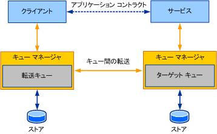

# メッセージ セキュリティを使用したメッセージのセキュリティ保護
ここでは、[!INCLUDE[indigo2](../../../../includes/indigo2-md.md)] を使用した場合の <xref:System.ServiceModel.NetMsmqBinding> メッセージ セキュリティについて説明します。  
  
> [!NOTE]
>  このトピック全体を読み取る前にお勧めお読みになる[セキュリティの基本概念](../../../../docs/framework/wcf/feature-details/security-concepts.md)です。  
  
 次の図は、[!INCLUDE[indigo2](../../../../includes/indigo2-md.md)] を使用する、キューに置かれた通信の概念モデルを表したものです。 この図および用語を使用して、トランスポート セキュリティの  
  
 概念について解説します。  
  
   
  
 [!INCLUDE[indigo2](../../../../includes/indigo2-md.md)] を使用してキューに置かれたメッセージを送信すると、[!INCLUDE[indigo2](../../../../includes/indigo2-md.md)] メッセージはメッセージ キュー (MSMQ) メッセージの本文として添付されます。 トランスポート セキュリティが MSMQ メッセージ全体を保護するのに対し、メッセージ (SOAP) セキュリティは MSMQ メッセージの本文だけを保護します。  
  
 メッセージ セキュリティの重要な概念は、クライアントが受信側アプリケーション (サービス) のメッセージを保護する点にあります。これは、クライアントがターゲット キューのメッセージを保護するトランスポート セキュリティとは異なります。 したがって、メッセージ セキュリティを使用して [!INCLUDE[indigo2](../../../../includes/indigo2-md.md)] メッセージを保護する場合、MSMQ は何の役割も果たしません。  
  
 [!INCLUDE[indigo2](../../../../includes/indigo2-md.md)] メッセージ セキュリティでは、[!INCLUDE[indigo2](../../../../includes/indigo2-md.md)] メッセージにセキュリティ ヘッダーが追加されます。これは、既存のセキュリティ インフラストラクチャ (証明書や Kerberos プロトコルなど) と統合されます。  
  
## メッセージ資格情報の種類  
 メッセージ セキュリティを使用すると、サービスとクライアントは、資格情報を提示して相互を認証します。 メッセージ セキュリティを選択するには、<xref:System.ServiceModel.NetMsmqBinding.Security%2A> モードを `Message` または `Both` (トランスポート セキュリティとメッセージ セキュリティの両方を使用) に設定します。  
  
 サービスは、<xref:System.ServiceModel.ServiceSecurityContext.Current%2A> プロパティを使用して、クライアントを認証するために使用される資格情報を検査できます。 このプロパティを使用して承認チェックも追加できますが、これを実装するかどうかはサービスで選択します。  
  
 ここでは、さまざまな資格情報の種類およびそれらをキューで使用する方法について説明します。  
  
### 証明書  
 資格情報の種類に証明書を設定すると、X509 証明書を使用してサービスとクライアントが識別されます。  
  
 一般的なシナリオでは、信頼された証明機関によってクライアントとサービスに有効な証明書が発行されます。 その後、接続が確立され、クライアントは、サービスの証明書を使用してサービスの有効性を確認することにより、サービスを信頼できるかどうかを判断します。 同様に、サービスは、クライアントの証明書を使用してクライアントの信頼性を検証します。  
  
 キューは切断されているため、クライアントとサービスが同時にオンライン状態にならない可能性があります。 したがって、クライアントとサービスは、帯域外で証明書を交換する必要があります。 特にクライアントは、信頼されたストア内にサービスの証明書 (証明機関にチェーンできる) を保持しているという理由で、正しいサービスと通信していると信じる必要があります。 クライアントを認証する場合、サービスはメッセージに添付された X509 証明書を使用し、ストア内の証明書と照合してクライアントの信頼性を確認します。 この場合も、証明書は証明機関にチェーンされている必要があります。  
  
 Windows を実行しているコンピューターでは、証明書は数種類のストアで保持されています。 [!INCLUDE[crabout](../../../../includes/crabout-md.md)]別のストアを参照してください[証明書のストア](http://go.microsoft.com/fwlink/?LinkId=87787)です。  
  
### Windows  
 メッセージ資格情報の種類に Windows を設定すると、Kerberos プロトコルが使用されます。  
  
 Kerberos プロトコルは、ドメインのユーザーを認証するためのセキュリティ機構で、認証済みユーザーは、ドメインの他のエンティティとの間にセキュリティで保護されたコンテキストを確立できます。  
  
 キューを使用した通信で Kerberos プロトコルを使用する場合の問題は、キー配布センター (KDC) が配布するクライアント ID を含むチケットの有効期間が比較的短いことです。 A*有効期間*チケットの有効性を示す、Kerberos チケットに関連付けられています。 そのため、遅延が大きい場合、クライアントを認証するサービスに対してトークンがまだ有効であるかどうかを確信できなくなります。  
  
 この種類の資格情報を使用する場合、SERVICE アカウントでサービスが実行されている必要があります。  
  
 メッセージ資格情報を選択すると、既定で Kerberos プロトコルが使用されます。 [!INCLUDE[crdefault](../../../../includes/crdefault-md.md)][のプロトコルは Kerberos を検索するには、Windows 2000 のセキュリティを分散](http://go.microsoft.com/fwlink/?LinkId=87790)です。  
  
### ユーザー名とパスワード  
 このプロパティを使用すると、クライアントは、メッセージのセキュリティ ヘッダーに含まれるユーザー名とパスワードを使用してサーバーに認証できます。  
  
### IssuedToken  
 クライアントは、セキュリティ トークン サービスを使用してトークンを発行できます。発行されたトークンをサービスへのメッセージに添付することで、クライアントが認証されます。  
  
## トランスポート セキュリティとメッセージ セキュリティの使用  
 トランスポート セキュリティとメッセージ セキュリティの両方を使用する場合は、トランスポート レベルと SOAP メッセージ レベルの両方で同じ証明書を使用してメッセージを保護する必要があります。  
  
## 関連項目  
 [トランスポート セキュリティを使用してメッセージをセキュリティで保護します。](../../../../docs/framework/wcf/feature-details/securing-messages-using-transport-security.md)  
 [メッセージ キューを介したメッセージ セキュリティ](../../../../docs/framework/wcf/samples/message-security-over-message-queuing.md)  
 [セキュリティの基本概念](../../../../docs/framework/wcf/feature-details/security-concepts.md)  
 [サービスとクライアントのセキュリティ保護](../../../../docs/framework/wcf/feature-details/securing-services-and-clients.md)
