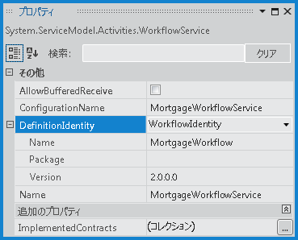

# WorkflowServiceHost による side-by-side でのバージョン管理
[!INCLUDE[net_v45](../../../../includes/net-v45-md.md)] で導入された <xref:System.ServiceModel.Activities.WorkflowServiceHost> による side\-by\-side でのバージョン管理は、1 つのエンドポイントでワークフロー サービスの複数のバージョンをホストする機能を提供します。  提供される side\-by\-side 機能により、既存の定義を使用してインスタンスを実行しているときに、新しいワークフロー定義を使用してワークフロー サービスの新しいインスタンスが作成されるように、ワークフロー サービスを構成できます。  このトピックでは、<xref:System.ServiceModel.Activities.WorkflowServiceHost> を使用したワークフロー サービスの side\-by\-side での実行の概要を提供します。  
  
> [!NOTE]
>  サンプルをダウンロードしてワークフロー サービスの side\-by\-side でのバージョン管理のチュートリアル ビデオを閲覧するには、「[Side by Side Versioning with a Web\-Hosted Xamlx Workflow Service \(Web ホスト XAMLX ワークフロー サービスによる side\-by\-side でのバージョン管理\)](http://go.microsoft.com/fwlink/?LinkId=393746)」を参照してください。  
  
## ワークフロー サービスでの複数のバージョンのホスティング  
 <xref:System.ServiceModel.Activities.WorkflowServiceHost> には、ワークフローの複数のバージョンを side\-by\-side 実行するように構成できる <xref:System.ServiceModel.Activities.WorkflowServiceHost.SupportedVersions%2A> と <xref:System.ServiceModel.Activities.WorkflowService.DefinitionIdentity%2A> の 2 つのプロパティが含まれています。  <xref:System.ServiceModel.Activities.WorkflowServiceHost.SupportedVersions%2A> には、ワークフロー サービスのサポートされているバージョンが含まれます。<xref:System.ServiceModel.Activities.WorkflowService.DefinitionIdentity%2A> は、各ワークフロー サービスを一意に識別するために使用されます。  これは、<xref:System.Activities.WorkflowIdentity> をワークフロー サービスと関連付けることによって行われます。  <xref:System.Activities.WorkflowIdentity> には 3 種類の識別情報が格納されます。  <xref:System.Activities.WorkflowIdentity.Name%2A> と <xref:System.Activities.WorkflowIdentity.Version%2A> は必須で、名前と <xref:System.Version> を表します。また、<xref:System.Activities.WorkflowIdentity.Package%2A> は省略可能で、アセンブリ名やその他の必要な情報などの情報を格納する追加文字列の指定に使用できます。  <xref:System.ServiceModel.Activities.WorkflowServiceHost.SupportedVersions%2A> コレクションに含まれる各ワークフロー サービスは、一意の <xref:System.Activities.WorkflowIdentity> を持つ必要があります。  <xref:System.Activities.WorkflowIdentity> は、その 3 つのプロパティのいずれかが他の <xref:System.Activities.WorkflowIdentity> と異なる場合に一意です。  `null` の <xref:System.Activities.WorkflowIdentity> は、<xref:System.ServiceModel.Activities.WorkflowService.DefinitionIdentity%2A> に有効な値でし。しかし、ワークフロー サービスの以前のバージョンのうちの 1 つだけが `null` の <xref:System.Activities.WorkflowIdentity> を持つことができます。  
  
> [!IMPORTANT]
>  <xref:System.Activities.WorkflowIdentity> には、個人を特定できる情報 \(PII\) を含めないでください。  <xref:System.Activities.WorkflowIdentity> は、<xref:System.Activities.WorkflowIdentity.Name%2A> \(<xref:System.String>\)、<xref:System.Activities.WorkflowIdentity.Version%2A> \(<xref:System.Version>\)、および <xref:System.Activities.WorkflowIdentity.Package%2A> \(<xref:System.String>\) の 3 つの部分で構成されます。  インスタンスの作成に使用される <xref:System.Activities.WorkflowIdentity> に関する情報は、ランタイムによるアクティビティ ライフ サイクルのさまざまなポイントで構成されているすべての追跡サービスに出力されます。  WF の追跡には PII \(機密ユーザー データ\) を非表示にするメカニズムがありません。  そのため、<xref:System.Activities.WorkflowIdentity> インスタンスには PII データを含めないでください。PII データは、ランタイムによって追跡レコードに出力され、追跡レコードを表示するためのアクセス権を持つユーザーに表示できます。  
  
### ワークフロー サービスでの複数のバージョンのホスティングに関する規則  
 ユーザーが追加のバージョンを <xref:System.ServiceModel.Activities.WorkflowServiceHost> に追加する場合、エンドポイントと説明の同じセットを使用してワークフロー サービスをホストするために満たす必要があるいくつかの条件があります。  追加のバージョンのいずれかがこれらの条件を満たすことができない場合、<xref:System.ServiceModel.Activities.WorkflowServiceHost> は `Open` が呼び出されたときに例外をスローします。  追加のバージョンとしてホストに提供される各ワークフロー定義は、次の要件を満たす必要があります \(プライマリ バージョンは、ホストのコンストラクターに提供されるワークフロー サービス定義です\)。  追加のワークフローのバージョンは、次の条件を満たす必要があります。  
  
-   ワークフロー サービスのプライマリ バージョンと同じ <xref:System.ServiceModel.Activities.WorkflowService.Name%2A> を持つ必要があります。  
  
-   プライマリ バージョンにない <xref:System.ServiceModel.Activities.WorkflowService.Body%2A> に <xref:System.ServiceModel.Activities.Receive> アクティビティまたは <xref:System.ServiceModel.Activities.SendReply> アクティビティがあってはならず、これらは操作コントラクトに一致する必要があります。  
  
-   一意の <xref:System.ServiceModel.Activities.WorkflowService.DefinitionIdentity%2A> を持つ必要があります。  `null`<xref:System.ServiceModel.Activities.WorkflowService.DefinitionIdentity%2A> を持つことができるワークフロー定義は 1 つだけです。  
  
 一部の変更は可能です。  次の項目は、バージョン間で異なることができます。  
  
-   <xref:System.ServiceModel.Activities.WorkflowService.DefinitionIdentity%2A> は、プライマリ バージョンと異なる名前およびパッケージを持つことができます。  
  
-   <xref:System.ServiceModel.Activities.WorkflowService.AllowBufferedReceive%2A> 値は、プライマリ バージョンと異なることができます。  
  
-   <xref:System.ServiceModel.Activities.WorkflowService.ConfigurationName%2A> 値は、プライマリ バージョンと異なることができます。  
  
-   <xref:System.ServiceModel.Activities.WorkflowService.ImplementedContracts%2A> 値は、プライマリ バージョンと異なることができます。  
  
### DefinitionIdentity の構成  
 ワークフロー デザイナーを使用してワークフロー サービスを作成する場合、**\[プロパティ\]** ウィンドウを使用して <xref:System.ServiceModel.Activities.WorkflowService.DefinitionIdentity%2A> を設定します。  デザイナーのサービスのルート アクティビティの外部でクリックしてワークフロー サービスを選択し、**\[表示\]** メニューの **\[プロパティ ウィンドウ\]** を選択します。  **DefinitionIdentity** プロパティの横にあるドロップダウン リストから **\[WorkflowIdentity\]** を選択して展開し、目的の <xref:System.Activities.WorkflowIdentity> プロパティを指定します。  次の例の <xref:System.ServiceModel.Activities.WorkflowService.DefinitionIdentity%2A> では、<xref:System.Activities.WorkflowIdentity.Name%2A> に `MortgageWorkflow` が構成され、<xref:System.Activities.WorkflowIdentity.Version%2A> に `1.0.0.0` が構成されています。  <xref:System.Activities.WorkflowIdentity.Package%2A> は省略可能です。この例では、`null` です。  
  
   
  
 ワークフロー サービスが自己ホスト型の場合、<xref:System.ServiceModel.Activities.WorkflowService.DefinitionIdentity%2A> はワークフロー サービスを構築するときに構成されます。  次の例では、<xref:System.ServiceModel.Activities.WorkflowService.DefinitionIdentity%2A> が前の例と同じ値を使用して構成されています \(つまり <xref:System.Activities.WorkflowIdentity.Name%2A> が `MortgageWorkflow`、<xref:System.Activities.WorkflowIdentity.Name%2A> が `1.0.0.0`\)。  
  
```csharp  
WorkflowService service = new WorkflowService  
{  
    Name = "MortgageWorkflowService",  
    Body = new MortgageWorkflow(),  
    DefinitionIdentity = new WorkflowIdentity  
    {  
        Name = "MortgageWorkflow",  
        Version = new Version(1, 0, 0, 0)  
    }  
};  
  
```  
  
```vb  
Dim service As New WorkflowService  
With service  
    .Name = "MortgageWorkflowService"  
    .Body = New MortgageWorkflow  
    .DefinitionIdentity = New WorkflowIdentity With _  
    { _  
        .Name = "MortgageWorkflow", _  
        .Version = New Version(1, 0, 0, 0) _  
    }  
End With  
```  
  
 ワークフロー サービスのただ 1 つのバージョンだけが **null** の <xref:System.ServiceModel.Activities.WorkflowService.DefinitionIdentity%2A> を持つことができますが、<xref:System.ServiceModel.Activities.WorkflowService.DefinitionIdentity%2A> は必須ではありません。  
  
> [!NOTE]
>  これは、最初に <xref:System.ServiceModel.Activities.WorkflowService.DefinitionIdentity%2A> を構成せずにサービスを配置し、後で更新されたバージョンを作成する場合に便利です。  
  
### Web ホスト ワークフロー サービスへの新しいバージョンの追加  
 Web ホスト サービスで新しいバージョンのワークフロー サービスを構成する最初の手順では、`App_Code` フォルダーにサービス ファイルと同じ名前を持つ新しいフォルダーを作成します。  たとえば、サービスの `xamlx` ファイルの名前が `MortgageWorkflow.xamlx` である場合は、フォルダーに `MortgageWorkflow` という名前を付ける必要があります。  元のサービスの `xamlx` ファイルをこのフォルダーにコピーした後、新しい名前 \(たとえば、`MortgageWorkflowV1.xamlx`\) に変更します。  プライマリ サービスに必要な変更を加え、その <xref:System.ServiceModel.Activities.WorkflowService.DefinitionIdentity%2A> を更新し、サービスを展開します。  次の例の <xref:System.ServiceModel.Activities.WorkflowService.DefinitionIdentity%2A> は、`MortageWorkflow` という値の <xref:System.Activities.WorkflowIdentity.Name%2A> と `2.0.0.0` という値の <xref:System.Activities.WorkflowIdentity.Version%2A> で更新されています。  
  
   
  
 サービスが再起動されたとき、以前のバージョンは指定された `App_Code` サブフォルダーにないため、<xref:System.ServiceModel.Activities.WorkflowServiceHost.SupportedVersions%2A> コレクションに自動的に追加されます。  ワークフロー サービスのプライマリ バージョンに `null`<xref:System.ServiceModel.Activities.WorkflowService.DefinitionIdentity%2A> がある場合は以前のバージョンは追加されないことに注意してください。  `null` の <xref:System.ServiceModel.Activities.WorkflowService.DefinitionIdentity%2A> を持つことができるのは 1 つのバージョンのみです。しかし、複数のバージョンがある場合、プライマリ バージョンは `null`<xref:System.ServiceModel.Activities.WorkflowService.DefinitionIdentity%2A> を持つバージョンであることはできません。そうでないと、以前のバージョンが <xref:System.ServiceModel.Activities.WorkflowServiceHost.SupportedVersions%2A> コレクションに追加されません。  
  
### 自己ホスト型ワークフロー サービスへの新しいバージョンの追加  
 自己ホスト型ワークフロー サービスに新しいバージョンを追加する場合、ワークフロー サービスのプライマリ バージョンを使用して <xref:System.ServiceModel.Activities.WorkflowServiceHost> が構成されます。以前のバージョンは明示的に <xref:System.ServiceModel.Activities.WorkflowServiceHost.SupportedVersions%2A> コレクションに追加する必要があります。  次の例では、`MortgageWorkflowV2` ワークフロー定義を使用するプライマリ ワークフロー サービスを使用して <xref:System.ServiceModel.Activities.WorkflowServiceHost> が構成されています。さらに、`MortgageWorkflowV1` ワークフロー定義を使用して構成されたワークフロー サービスが <xref:System.ServiceModel.Activities.WorkflowServiceHost.SupportedVersions%2A> コレクションに追加されています。  各ワークフロー サービスは、ワークフロー定義のバージョンを反映する一意の <xref:System.ServiceModel.Activities.WorkflowService.DefinitionIdentity%2A> で構成されます。  
  
```csharp  
// Create the primary version of the workflow service.  
WorkflowService serviceV2 = new WorkflowService  
{  
    Name = "MortgageWorkflowService",  
    Body = new MortgageWorkflowV2(),  
    DefinitionIdentity = new WorkflowIdentity  
    {  
        Name = "MortgageWorkflow",  
        Version = new Version(2, 0, 0, 0)  
    }  
};  
  
// Configure the WorkflowServiceHost with the current version  
// of the workflow service. This code requires Administrator  
// privileges to function correctly. If running from Visual  
// Studio, Visual Studio must be run with Administrator privileges.  
WorkflowServiceHost host = new WorkflowServiceHost(serviceV2,   
    new Uri("http://localhost:8080/MortgageWorkflowService"));  
  
// Create the previous version of the workflow service.  
WorkflowService serviceV1 = new WorkflowService  
{  
    Name = "MortgageWorkflowService",  
    Body = new MortgageWorkflowV1(),  
    DefinitionIdentity = new WorkflowIdentity  
    {  
        Name = "MortgageWorkflow",  
        Version = new Version(1, 0, 0, 0)  
    }  
};  
  
// Add the previous version of the service to the SupportedVersions collection.  
host.SupportedVersions.Add(serviceV1);  
  
```  
  
```vb  
'Create the primary version of the workflow service  
Dim serviceV2 As New WorkflowService  
With serviceV2  
    .Name = "MortgageWorkflowService"  
    .Body = New MortgageWorkflowV2  
    .DefinitionIdentity = New WorkflowIdentity With _  
    { _  
        .Name = "MortgageWorkflow", _  
        .Version = New Version(2, 0, 0, 0) _  
    }  
End With  
  
'Configure the WorkflowServiceHost with the current version  
'of the workflow service. This code requires Administrator  
'privileges to function correctly. If running from Visual  
'Studio, Visual Studio must be run with Administrator privileges.  
  
Dim host As New WorkflowServiceHost(serviceV2, _  
    New Uri("http://localhost:8080/MortgageWorkflowService"))  
  
'Create the previous version of the workflow service.  
Dim serviceV1 As New WorkflowService  
With serviceV1  
    .Name = "MortgageWorkflowService"  
    .Body = New MortgageWorkflowV1  
    .DefinitionIdentity = New WorkflowIdentity With _  
    { _  
        .Name = "MortgageWorkflow", _  
        .Version = New Version(1, 0, 0, 0) _  
    }  
End With  
  
'Add the previous version of the service to the SupportedVersions collection.  
host.SupportedVersions.Add(serviceV1)  
```