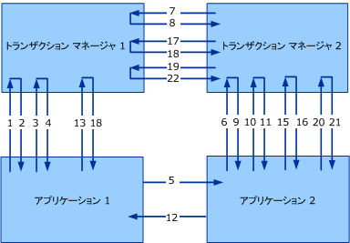

# <a name="transaction-protocols-version-10"></a>トランザクション プロトコル バージョン 1.0
Windows Communication Foundation (WCF) バージョン 1 は、Ws-atomic Transaction プロトコルおよび Ws-coordination プロトコルの version 1.0 を実装します。 バージョン 1.1 の詳細については、次を参照してください。[トランザクション プロトコル](../../../../docs/framework/wcf/feature-details/transaction-protocols.md)です。  
  
|仕様/ドキュメント|Link|  
|-----------------------------|----------|  
|WS-Coordination|http://msdn.microsoft.com/ws/2005/08/ws-coordination/|  
|WS-AtomicTransaction|http://msdn.microsoft.com/ws/2005/08/ws-atomictransaction/|  
  
 これらのプロトコル仕様の相互運用性は、アプリケーション間とトランザクション マネージャー間の 2 つのレベルで必要です (次の図を参照)。 仕様では、相互運用性の両方のレベルについて、メッセージ形式とメッセージ交換が詳細に説明されます。 アプリケーション間での交換に必要な一定のセキュリティ、信頼性、およびエンコーディングは、通常のアプリケーションによる交換にも当てはまります。 ただし、トランザクション マネージャー間で適切な相互運用性を実現するには、特定のバインディングを使用するという合意が必要となります。通常、バインディングはユーザーによって構成されないためです。  
  
 ここでは、WS-AtomicTransaction (WS-AT) 仕様のセキュリティに関する構成と、トランザクション マネージャー間の通信に使用されるセキュリティで保護されたバインディングについて説明します。 このドキュメントで説明されているアプローチは、IBM、IONA、Sun Microsystems などを含む WS-AT および WS-Coordination の各種の実装でテスト済みのものです。  
  
 次の図は、2 つのトランザクション マネージャー (Transaction Manager 1 と Transaction Manager 2)、および 2 つのアプリケーション (Application 1 と Application 2) 間の相互運用性を示しています。  
  
   
  
 1 つのイニシエーター (I) と 1 つの参加要素 (P) を持つ、一般的な WS-Coordination/WS-AtomicTransaction のシナリオを考えます。 イニシエーターと参加要素の両方にトランザクション マネージャー (それぞれ ITM および PTM と呼びます) があります。 2 フェーズ コミットは、このトピックでは 2PC と呼びます。  
  
|||  
|-|-|  
|1.CreateCoordinationContext|12.アプリケーション メッセージ応答|  
|2.CreateCoordinationContextResponse|13.Commit (完了)|  
|3.Register (完了)|14.Prepare (2PC)|  
|4.RegisterResponse|15.Prepare (2PC)|  
|5.アプリケーション メッセージ|16.Prepared (2PC)|  
|6.CreateCoordinationContext with Context|17.Prepared (2PC)|  
|7.Register (永続的)|18.Committed (完了)|  
|8.RegisterResponse|19.Commit (2PC)|  
|9.CreateCoordinationContextResponse|20.Commit (2PC)|  
|10.Register (永続的)|21.Committed (2PC)|  
|11.RegisterResponse|22.Committed (2PC)|  
  
 このドキュメントでは、WS-AtomicTransaction 仕様のセキュリティに関する構成と、トランザクション マネージャー間の通信に使用されるセキュリティで保護されたバインディングについて説明します。 このドキュメントで説明されているアプローチは、WS-AT および WS-Coordination の各種の実装でテスト済みのものです。  
  
 この図および表では、セキュリティの観点から見た次の 4 つのクラスのメッセージを示しています。  
  
-   アクティベーション メッセージ (CreateCoordinationContext と CreateCoordinationContextResponse)  
  
-   登録メッセージ (Register と RegisterResponse)  
  
-   プロトコル メッセージ (Prepare、Rollback、Commit、Aborted など)  
  
-   アプリケーション メッセージ  
  
 最初の 3 つのメッセージ クラスはトランザクション マネージャーのメッセージと考えられます。これらのクラスのバインディング構成については、後の「アプリケーション メッセージ交換」で説明します。 4 番目のメッセージ クラスは、アプリケーション間のメッセージであり、後の「メッセージの例」で説明します。 このセクションでは、これらのクラスの各 WCF によって使用されるプロトコル バインディングについて説明します。  
  
 このドキュメントでは、次の XML 名前空間と関連付けられたプレフィックスが使用されます。  
  
|プレフィックス|名前空間の URI|  
|------------|-------------------|  
|s11|http://schemas.xmlsoap.org/soap/envelope|  
|wsa|http://www.w3.org/2004/08/addressing|  
|wscoor|http://schemas.xmlsoap.org/ws/2004/10/wscoor|  
|wsat|http://schemas.xmlsoap.org/ws/2004/10/wsat|  
|t|http://schemas.xmlsoap.org/ws/2005/02/trust|  
|o|http://docs.oasis-open.org/wss/2004/01/oasis-200401-wss-wssecurity-secext-1.0.xsd|  
|xsd|http://www.w3.org/2001/XMLSchema|  
  
## <a name="transaction-manager-bindings"></a>トランザクション マネージャー バインディング  
 R1001 : トランザクション マネージャーは、SOAP 1.1、WS-Addressing 2004/08 for WS-AtomicTransaction、および WS-Coordination メッセージ交換を使用する必要があります。  
  
 アプリケーション メッセージは、後で説明するように、これらのバインディングに制限されません。  
  
### <a name="transaction-manager-https-binding"></a>トランザクション マネージャー HTTPS バインディング  
 トランザクション マネージャー HTTPS バインディングは、セキュリティを実現してトランザクション ツリー内の送信者と受信者の各ペア間で信頼を確立するトランスポート セキュリティにのみ依存します。  
  
#### <a name="https-transport-configuration"></a>HTTPS トランスポート構成  
 トランザクション マネージャー ID を確立するために X.509 証明書が使用されます。 クライアントおよびサーバーの承認が必要です。クライアントおよびサーバーの承認は、以下のような実装詳細の状態にしておきます。  
  
-   R1111 : ネットワーク経由で示された X.509 証明書は、発信元コンピューターの完全修飾ドメイン名 (FQDN) と一致するサブジェクト名を持っている必要があります。  
  
-   B1112 : X.509 のサブジェクト名のチェックが成功するには、システム内の送信者と受信者の各ペア間で、DNS が機能している必要があります。  
  
#### <a name="activation-and-registration-binding-configuration"></a>アクティベーションと登録のバインド構成  
 WCF では、HTTPS 経由での相関関係と共に、要求/応答の二重バインディングが必要です。 (関連付けと要求/応答メッセージ交換パターンの詳細については、WS-AtomicTransaction 仕様のセクション 8 を参照してください)。  
  
#### <a name="2pc-protocol-binding-configuration"></a>2PC プロトコルのバインド構成  
 WCF では、HTTPS 経由で一方向 (データグラム) メッセージをサポートします。 メッセージ間の関連付けは、実装詳細の状態にしておきます。  
  
 B2131: 実装をサポートする必要があります`wsa:ReferenceParameters`WCF の 2 pc メッセージの関連付けを実現するために WS アドレス指定」の説明に従ってします。  
  
### <a name="transaction-manager-mixed-security-binding"></a>トランザクション マネージャーによる混合セキュリティ バインディング  
 これは、代替 (混在モード) をトランスポート セキュリティと組み合わせて使用 Ws-coordination 発行済みトークンの id を確立するためのモデルをバインドします。  2 つのバインディングを区別する要素は、アクティベーションと登録のみです。  
  
#### <a name="https-transport-configuration"></a>HTTPS トランスポート構成  
 トランザクション マネージャー ID を確立するために X.509 証明書が使用されます。 クライアントおよびサーバーの承認が必要です。クライアントおよびサーバーの承認は、以下のような実装詳細の状態にしておきます。  
  
#### <a name="activation-message-binding-configuration"></a>アクティベーション メッセージのバインド構成  
 アクティベーション メッセージは通常、アプリケーションとローカルのトランザクション マネージャー間で発生するため、相互運用には参加しません。  
  
 B1221: 双方向の HTTPS バインドを使用する WCF (」に記載[メッセージング プロトコル](../../../../docs/framework/wcf/feature-details/messaging-protocols.md)) アクティベーション メッセージにします。 要求および応答メッセージは、WS-Addressing 2004/08 を使用して関連付けられます。  
  
 WS-AtomicTransaction 仕様のセクション 8 では、関連付けとメッセージ交換のパターンについて詳細に説明されています。  
  
-   R1222 : `CreateCoordinationContext` を受信すると、コーディネーターは、関連付けられている秘密の `SecurityContextToken` を使用して `STx` を発行します。 このトークンは、WS-Trust の仕様に従って、`t:IssuedTokens` ヘッダー内に返されます。  
  
-   R1223 : アクティベーションが既存のコーディネーション コンテキスト内で発生した場合、既存のコンテキストに関連付けられた `t:IssuedTokens` がある `SecurityContextToken` ヘッダーは、`CreateCoordinationContext` メッセージでフローする必要があります。  
  
 新しい`t:IssuedTokens`送信にアタッチするためのヘッダーを生成する必要があります`wscoor:CreateCoordinationContextResponse`メッセージ。  
  
#### <a name="registration-message-binding-configuration"></a>登録メッセージのバインド構成  
 B1231: 双方向の HTTPS バインドを使用する WCF (記載[メッセージング プロトコル](../../../../docs/framework/wcf/feature-details/messaging-protocols.md))。 要求および応答メッセージは、WS-Addressing 2004/08 を使用して関連付けられます。  
  
 WS-AtomicTransaction 仕様のセクション 8 では、関連付けとメッセージ交換のパターンについて詳細に説明されています。  
  
 R1232: 発信`wscoor:Register`メッセージで使用する必要があります、`IssuedTokenOverTransport`で説明されている認証モード[セキュリティ プロトコル](../../../../docs/framework/wcf/feature-details/security-protocols.md)です。  
  
 `wsse:Timestamp`要素を使用して署名する必要があります、`SecurityContextToken``STx`発行します。 この署名は特定のトランザクションに関連付けられたトークンを所有していることの証明であり、トランザクションに登録されている参加要素の認証で使用されます。 RegistrationResponse メッセージは、HTTPS を使用して返信されます。  
  
#### <a name="2pc-protocol-binding-configuration"></a>2PC プロトコルのバインド構成  
 WCF では、HTTPS 経由で一方向 (データグラム) メッセージをサポートします。 メッセージ間の関連付けは、実装詳細の状態にしておきます。  
  
 B2131: 実装をサポートする必要があります`wsa:ReferenceParameters`WCF の 2 pc メッセージの関連付けを実現するために WS アドレス指定」の説明に従ってします。  
  
## <a name="application-message-exchange"></a>アプリケーション メッセージ交換  
 アプリケーションでは、バインディングが次のセキュリティ要件を満たしている限り、アプリケーション間メッセージに任意のバインディングを使用できます。  
  
-   R2001 : アプリケーション間メッセージでは、メッセージのヘッダーの `t:IssuedTokens` に加えて `CoordinationContext` ヘッダーをフローする必要があります。  
  
-   R2002 : `t:IssuedToken` の整合性と機密性が提供される必要があります。  
  
 `CoordinationContext` ヘッダーには `wscoor:Identifier` が含まれます。 定義`xsd:AnyURI`、絶対と相対 Uri の使用できるように WCF のみがサポート`wscoor:Identifiers`、絶対 Uri であります。  
  
 場合、`wscoor:Identifier`の`wscoor:CoordinationContext`相対 uri では、トランザクションの WCF サービスからエラーが返されます。  
  
## <a name="message-examples"></a>メッセージの例  
  
### <a name="createcoordinationcontext-requestresponse-messages"></a>CreateCoordinationContext 要求/応答メッセージ  
 次のメッセージは、要求/応答のパターンに従います。  
  
#### <a name="createcoordinationcontext"></a>CreateCoordinationContext  
  
```xml  
<s:Envelope>  
  <s:Header>  
    <a:Action>http://.../ws/2004/10/wscoor/CreateCoordinationContext</Action>  
    <a:MessageID>urn:uuid:069f5104-fd88-4264-9f99-60032a82854e</MessageID>  
    <a:ReplyTo>  
      <Address>https://...</a:Address>  
    </a:ReplyTo>  
    <a:To>https://...</a:To>  
    <wsse:Security>  
      <u:Timestamp>  
        <wsu:Created>2005-12-15T23:36:09.921Z</u:Created>  
        <wsu:Expires>2005-12-15T23:41:09.921Z</u:Expires>  
      </u:Timestamp>  
    </wsse:Security>  
  </s:Header>  
  <s:Body xmlns:s="http://schemas.xmlsoap.org/soap/envelope/">  
    <wscoor:CreateCoordinationContext>  
      <wscoor:CoordinationType>...</wscoor:CoordinationType>  
    </wscoor:CreateCoordinationContext>  
  </s:Body>  
</s11:Envelope>  
```  
  
#### <a name="createcoordinationcontextresponse"></a>CreateCoordinationContextResponse  
  
```xml  
<s:Envelope>  
  <!-- Data below is shown in the clear for  
       illustration purposes only. -->  
  <s:Header>  
    <a:Action>./ws/2004/10/wscoor/CreateCoordinationContextResponse </a:Action>  
    <a:RelatesTo>urn:uuid:069f5104-fd88-4264-9f99-60032a82854e</a:RelatesTo>  
    <a:To s:mustUnderstand="1">https://... </a:To>  
    <t:IssuedTokens>  
 <wst:RequestSecurityTokenResponse     
    xmlns:wsse="http://docs.oasis-open.org/wss/2004/01/oasis-200401-wss-wssecurity-secext-1.0.xsd"  
    xmlns:wssu="http://docs.oasis-open.org/wss/2004/01/oasis-200401-wss-wssecurity-utility-1.0.xsd"   
    xmlns:wst="http://schemas.xmlsoap.org/ws/2005/02/trust"  
    xmlns:wsc="http://schemas.xmlsoap.org/ws/2005/02/sc"  
    xmlns:wsp="http://schemas.xmlsoap.org/ws/2004/09/policy">  
    <wst:TokenType>http://schemas.xmlsoap.org/ws/2005/02/sc/sct</wst:TokenType>  
    <wst:RequestedSecurityToken>  
      <wsc:SecurityContextToken>  
        <wssu:Identifier>  
          http://fabrikam123.com/SCTi  
        </wssu:Identifier>  
      </wsc:SecurityContextToken>   
    </wst:RequestedSecurityToken>  
    <wsp:AppliesTo>  
        http://fabrikam123.com/CCi  
    </wsp:AppliesTo>    
    <wst:RequestedAttachedReference>  
      <wsse:SecurityTokenReference >  
        <wsse:Reference   
           ValueType="http://schemas.xmlsoap.org/ws/2005/02/sc/sct"  
           URI="http://fabrikam123.com/SCTi"/>  
      </wsse:SecurityTokenReference>  
    </wst:RequestedAttachedReference>  
    <wst:RequestedUnattachedReference>  
      <wsse:SecurityTokenReference>  
        <wsse:Reference   
          ValueType="http://schemas.xmlsoap.org/ws/2005/02/sc/sct"  
          URI="http://fabrikam123.com/SCTi"/>  
      </wsse:SecurityTokenReference>  
    </wst:RequestedUnattachedReference>  
    <wst:RequestedProofToken>  
      <wst:BinarySecret   
        Type="http://schemas.xmlsoap.org/ws/2005/02/trust/SymmetricKey">  
        <!-- base64 encoded value -->  
      </wst:BinarySecret>  
    </wst:RequestedProofToken>  
    <wst:Lifetime>  
      <wssu:Created>2005-10-24T20:19:26.526Z</wssu:Created>  
      <wssu:Expires>2005-10-25T06:24:26.526Z</wssu:Expires>  
    </wst:Lifetime>  
    <wst:KeySize>256</wst:KeySize>  
</wst:RequestSecurityTokenResponse>  
    </t:IssuedTokens>  
    <o:Security xmlns:o="http://docs.oasis-open.org/wss/2004/01/oasis-200401-wss-wssecurity-secext-1.0.xsd">  
      <u:Timestamp u:Id="_0">  
        <u:Created>2005-12-15T23:36:12.015Z</u:Created>  
        <u:Expires>2005-12-15T23:41:12.015Z</u:Expires>  
      </u:Timestamp>  
    </o:Security>  
  </s:Header>  
  <s:Body>  
    <wscoor:CreateCoordinationContextResponse>  
      <wscoor:CoordinationContext>  
        <wscoor:Identifier>  
     http://fabrikam123.com/CCi  
      </wscoor:Identifier>  
        <wscoor:Expires>...</wscoor:Expires>  
        <wscoor:CoordinationType>...</wscoor:CoordinationType>  
        <wscoor:RegistrationService>  
          <a:Address>https://...</a:Address>  
          <a:ReferenceParameters>  
             ...  
          </a:ReferenceParameters>  
        </wscoor:RegistrationService>  
      </wscoor:CoordinationContext>  
    </wscoor:CreateCoordinationContextResponse>  
  </s:Body>  
</s:Envelope>  
```  
  
### <a name="registration-messages"></a>登録メッセージ  
 次のメッセージは、登録メッセージです。  
  
#### <a name="register"></a>登録  
  
```xml  
<s:Envelope>  
  <s:Header>  
    <a:Action>http://schemas.xmlsoap.org/ws/2004/10/wscoor/Register</a:Action>  
    <a:MessageID>urn:uuid:ed418b86-a75e-4aea-9d4e-a5d0cb5c088e</a:MessageID>  
    <a:ReplyTo>  
      <a:Address>https://...</a:Address>        
    </a:ReplyTo>  
    <a:To>https://...</a:To>  
    <wsse:Security   
      s:mustUnderstand="1"   
      xmlns:wsse="http://docs.oasis-open.org/wss/2004/01/oasis-200401-wss-wssecurity-secext-1.0.xsd"  
      xmlns:wssu="http://docs.oasis-open.org/wss/2004/01/oasis-200401-wss-wssecurity-utility-1.0.xsd">  
      <wssu:Timestamp wssu:Id="_0" >  
        <wssu:Created>2005-12-15T23:36:13.827Z</wssu:Created>  
        <wssu:Expires>2005-12-15T23:41:13.827Z</wssu:Expires>  
      </wssu:Timestamp>  
      <wsc:SecurityContextToken>  
      <wssu:Identifier>  
          http://fabrikam123.com/SCTi  
      </wssu:Identifier>  
      </wsc:SecurityContextToken>  
      <!-- supporting signature over the timestamp -->  
      <wsse:Signature xmlns:ds="http://www.w3.org/2000/09/xmldsig#">  
        <ds:SignedInfo>  
          <ds:CanonicalizationMethod Algorithm="http://www.w3.org/2001/10/xml-exc-c14n#"/>  
          <ds:SignatureMethod Algorithm="http://www.w3.org/2000/09/xmldsig#hmac-sha1"/>  
          <ds:Reference URI="#_0">  
            <ds:Transforms>  
              <ds:Transform Algorithm="http://www.w3.org/2001/10/xml-exc-c14n#"/>  
            </ds:Transforms>  
            <ds:DigestMethod Algorithm="http://www.w3.org/2000/09/xmldsig#sha1"/>  
            <ds:DigestValue>  
              alRzyhjLgoUOYoh8cx4n75eTcUk=  
            </ds:DigestValue>  
          </ds:Reference>  
        </ds:SignedInfo>  
        <ds:SignatureValue>YZYjnVvSOVasAQqQxaaviTSWtqI=</ds:SignatureValue>  
        <ds:KeyInfo>  
          <wsse:SecurityTokenReference  
            xmlns:wsse="http://docs.oasis-open.org/wss/2004/01/oasis-200401-wss-wssecurity-secext-1.0.xsd">  
            <wsse:Reference   
              URI="http://fabrikam123.com/SCTi"/>  
          </wsse:SecurityTokenReference>  
        </ds:KeyInfo>  
      </wsse:Signature>  
    </wsse:Security>  
  </s:Header>  
  <s:Body xmlns:s="http://schemas.xmlsoap.org/soap/envelope/">  
    <wscoor:Register>  
      <wscoor:ProtocolIdentifier>...</wscoor:ProtocolIdentifier>  
      <wscoor:ParticipantProtocolService>  
        <a:Address>https://... </a:Address>  
      </wscoor:ParticipantProtocolService>  
    </wscoor:Register>  
  </s:Body>  
</s:Envelope>  
```  
  
#### <a name="register-response"></a>RegisterResponse  
  
```xml  
<s:Envelope>  
  <s:Header>  
    <a:Action>  
      http://schemas.xmlsoap.org/ws/2004/10/wscoor/RegisterResponse  
    </a:Action>  
    <a:MessageID>urn:uuid:ed418b86-a75e-4aea-9d4e-a5d0cb5c088d</a:MessageID>  
    <a:RelatesTo>  
      urn:uuid:ed418b86-a75e-4aea-9d4e-a5d0cb5c088e        
    </a:RelatesTo>  
    <a:To>https://...</a:To>  
    <wsse:Security   
      s:mustUnderstand="1"   
      xmlns:wsse="http://docs.oasis-open.org/wss/2004/01/oasis-200401-wss-wssecurity-secext-1.0.xsd"  
      xmlns:wssu="http://docs.oasis-open.org/wss/2004/01/oasis-200401-wss-wssecurity-utility-1.0.xsd">  
      <wssu:Timestamp>  
        <wssu:Created>2005-12-15T23:36:13.827Z</wssu:Created>  
        <wssu:Expires>2005-12-15T23:41:13.827Z</wssu:Expires>  
      </wssu:Timestamp>  
    </wsse:Security>  
  </s:Header>  
  <s:Body xmlns:s="http://schemas.xmlsoap.org/soap/envelope/">  
    <wscoor:RegisterResponse>  
      <wscoor:CoordinatorProtocolService>  
        <a:Address>https://...</a:Address>  
        <a:ReferenceParameters>  
          ...  
        </a:ReferenceParameters>  
      </wscoor:CoordinatorProtocolService>  
    </wscoor:RegisterResponse>  
  </s:Body>  
</s:Envelope>  
```  
  
### <a name="two-phase-commit-protocol-messages"></a>2 フェーズ コミット プロトコル メッセージ  
 次のメッセージは、2 フェーズ コミット (2PC) プロトコルに関連しています。  
  
#### <a name="commit"></a>コミット  
  
```xml  
<s:Envelope>  
  <s:Header>  
    <a:Action>http://.../ws/2004/10/wsat/Commit</a:Action>  
    <a:To>https://...</a:To>  
    <wsse:Security   
      s:mustUnderstand="1"   
      xmlns:wsse="http://docs.oasis-open.org/wss/2004/01/oasis-200401-wss-wssecurity-secext-1.0.xsd"  
      xmlns:wssu="http://docs.oasis-open.org/wss/2004/01/oasis-200401-wss-wssecurity-utility-1.0.xsd">  
      <wssu:Timestamp wssu:Id="_0" >  
        <wssu:Created>2005-12-15T23:36:13.827Z</wssu:Created>  
        <wssu:Expires>2005-12-15T23:41:13.827Z</wssu:Expires>  
      </wssu:Timestamp>  
   </wsse:Security>  
  </s:Header>  
  <s:Body xmlns:s="http://schemas.xmlsoap.org/soap/envelope/">  
    <wsat:Commit />  
  </s:Body>  
</s:Envelope>  
```  
  
### <a name="application-messages"></a>アプリケーション メッセージ  
 次のメッセージは、アプリケーション メッセージです。  
  
#### <a name="application-message-request"></a>アプリケーション メッセージ (要求)  
  
```xml  
<s:Envelope>  
  <s:Header>  
<!-- Addressing headers, all signed-->  
    <wsse:Security s:mustUnderstand="1">  
      <wssu:Timestamp wssu:Id="timestamp">   
        <wssu:Created>2005-10-25T06:29:18.703Z</wssu:Created>  
        <wssu:Expires>2005-10-25T06:34:18.703Z</wssu:Expires>  
      </wssu:Timestamp>  
      <wsse:BinarySecurityToken   
          wssu:Id="IA_Certificate"   
          ValueType="...#X509v3"   
          EncodingType="...#Base64Binary">  
        <!-- IA certificate -->  
      </wsse:BinarySecurityToken>  
      <e:EncryptedKey Id="encrypted_key">  
            <!-- ephemeral key encrypted for PA certificate -->    
        <e:ReferenceList xmlns:e="http://www.w3.org/2001/04/xmlenc#">  
          <e:DataReference URI="#encrypted_body"/>  
          <e:DataReference URI="#encrypted_CCi"/>  
          <e:DataReference URI="#encrypted_issuedtokens"/>  
        </e:ReferenceList>  
      </e:EncryptedKey>  
      <Signature xmlns="http://www.w3.org/2000/09/xmldsig#">  
        <!-- signature over Addressing headers, Timestamp, and Body -->  
      </Signature>  
    </wsse:Security>  
    <wsse11:EncryptedHeader >  
     <!-- encrypted wscoor:CoordinationContext header containing CCi -->  
    </wsse11:EncryptedHeader>  
    <wsse11:EncryptedHeader   
      <!-- encrypted wst:IssuedTokens header containing SCTi -->  
      <!-- wst:IssuedTokens header is taken verbatim from message #2 above, omitted for brevity -->  
    </wsse11:EncryptedHeader>  
  </s:Header>  
  <s:Body wssu:Id="body">  
    <!-- encrypted content of the Body element of the application message -->      
    <e:EncryptedData Id="encrypted_body"   
           Type="http://www.w3.org/2001/04/xmlenc#Content"   
           xmlns:e="http://www.w3.org/2001/04/xmlenc#">  
...  
    </e:EncryptedData>  
  </s:Body>  
</s:Envelope>  
```
