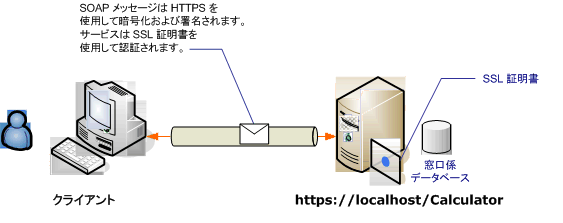

# <a name="transport-security-with-an-anonymous-client"></a><span data-ttu-id="28060-102">トランスポート セキュリティと匿名クライアント</span><span class="sxs-lookup"><span data-stu-id="28060-102">Transport Security with an Anonymous Client</span></span>
<span data-ttu-id="28060-103">この Windows Communication Foundation (WCF) シナリオでは、トランスポート セキュリティ (HTTPS) を使用して、機密性と整合性を確認してください。</span><span class="sxs-lookup"><span data-stu-id="28060-103">This Windows Communication Foundation (WCF) scenario uses transport security (HTTPS) to ensure confidentiality and integrity.</span></span> <span data-ttu-id="28060-104">サーバーは SSL (Secure Sockets Layer) 証明書で認証される必要があり、クライアントはサーバーの証明書を信頼する必要があります。</span><span class="sxs-lookup"><span data-stu-id="28060-104">The server must be authenticated with a Secure Sockets Layer (SSL) certificate, and the clients must trust the server's certificate.</span></span> <span data-ttu-id="28060-105">クライアントを認証する機構はないため、匿名となります。</span><span class="sxs-lookup"><span data-stu-id="28060-105">The client is not authenticated by any mechanism and is, therefore, anonymous.</span></span>  
  
 <span data-ttu-id="28060-106">サンプル アプリケーションについては、次を参照してください。 [WS トランスポート セキュリティ](../../../../docs/framework/wcf/samples/ws-transport-security.md)です。</span><span class="sxs-lookup"><span data-stu-id="28060-106">For a sample application, see [WS Transport Security](../../../../docs/framework/wcf/samples/ws-transport-security.md).</span></span> <span data-ttu-id="28060-107">トランスポート セキュリティの詳細については、次を参照してください。[トランスポート セキュリティの概要](../../../../docs/framework/wcf/feature-details/transport-security-overview.md)です。</span><span class="sxs-lookup"><span data-stu-id="28060-107">For more information about transport security, see [Transport Security Overview](../../../../docs/framework/wcf/feature-details/transport-security-overview.md).</span></span>  
  
 <span data-ttu-id="28060-108">サービスと証明書の使用の詳細については、次を参照してください。[証明書の使用](../../../../docs/framework/wcf/feature-details/working-with-certificates.md)と[する方法: SSL 証明書でポートを構成する](../../../../docs/framework/wcf/feature-details/how-to-configure-a-port-with-an-ssl-certificate.md)です。</span><span class="sxs-lookup"><span data-stu-id="28060-108">For more information about using a certificate with a service, see [Working with Certificates](../../../../docs/framework/wcf/feature-details/working-with-certificates.md) and [How to: Configure a Port with an SSL Certificate](../../../../docs/framework/wcf/feature-details/how-to-configure-a-port-with-an-ssl-certificate.md).</span></span>  
  
 <span data-ttu-id="28060-109"></span><span class="sxs-lookup"><span data-stu-id="28060-109"></span></span>  
  
|<span data-ttu-id="28060-110">特徴</span><span class="sxs-lookup"><span data-stu-id="28060-110">Characteristic</span></span>|<span data-ttu-id="28060-111">説明</span><span class="sxs-lookup"><span data-stu-id="28060-111">Description</span></span>|  
|--------------------|-----------------|  
|<span data-ttu-id="28060-112">セキュリティ モード</span><span class="sxs-lookup"><span data-stu-id="28060-112">Security Mode</span></span>|<span data-ttu-id="28060-113">Transport</span><span class="sxs-lookup"><span data-stu-id="28060-113">Transport</span></span>|  
|<span data-ttu-id="28060-114">相互運用性</span><span class="sxs-lookup"><span data-stu-id="28060-114">Interoperability</span></span>|<span data-ttu-id="28060-115">既存の Web サービスとクライアントを使用する</span><span class="sxs-lookup"><span data-stu-id="28060-115">With existing Web services and clients</span></span>|  
|<span data-ttu-id="28060-116">認証 (サーバー)</span><span class="sxs-lookup"><span data-stu-id="28060-116">Authentication (Server)</span></span><br /><br /> <span data-ttu-id="28060-117">認証 (クライアント)</span><span class="sxs-lookup"><span data-stu-id="28060-117">Authentication (Client)</span></span>|<span data-ttu-id="28060-118">[はい]</span><span class="sxs-lookup"><span data-stu-id="28060-118">Yes</span></span><br /><br /> <span data-ttu-id="28060-119">アプリケーション レベル (WCF はサポートされません)</span><span class="sxs-lookup"><span data-stu-id="28060-119">Application level (no WCF support)</span></span>|  
|<span data-ttu-id="28060-120">整合性</span><span class="sxs-lookup"><span data-stu-id="28060-120">Integrity</span></span>|<span data-ttu-id="28060-121">はい</span><span class="sxs-lookup"><span data-stu-id="28060-121">Yes</span></span>|  
|<span data-ttu-id="28060-122">機密性</span><span class="sxs-lookup"><span data-stu-id="28060-122">Confidentiality</span></span>|<span data-ttu-id="28060-123">はい</span><span class="sxs-lookup"><span data-stu-id="28060-123">Yes</span></span>|  
|<span data-ttu-id="28060-124">Transport</span><span class="sxs-lookup"><span data-stu-id="28060-124">Transport</span></span>|<span data-ttu-id="28060-125">HTTPS</span><span class="sxs-lookup"><span data-stu-id="28060-125">HTTPS</span></span>|  
|<span data-ttu-id="28060-126">バインド</span><span class="sxs-lookup"><span data-stu-id="28060-126">Binding</span></span>|<span data-ttu-id="28060-127"><<!--zz xref:System.ServiceModel.WsHttpBinding --> `xref:System.ServiceModel.WsHttpBinding`></span><span class="sxs-lookup"><span data-stu-id="28060-127"><<!--zz xref:System.ServiceModel.WsHttpBinding --> `xref:System.ServiceModel.WsHttpBinding`></span></span>|  
  
## <a name="service"></a><span data-ttu-id="28060-128">サービス</span><span class="sxs-lookup"><span data-stu-id="28060-128">Service</span></span>  
 <span data-ttu-id="28060-129">次のコードと構成は、別々に実行します。</span><span class="sxs-lookup"><span data-stu-id="28060-129">The following code and configuration are meant to run independently.</span></span> <span data-ttu-id="28060-130">次のいずれかの操作を行います。</span><span class="sxs-lookup"><span data-stu-id="28060-130">Do one of the following:</span></span>  
  
-   <span data-ttu-id="28060-131">構成を使用せずに、コードを使用してスタンドアロン サービスを作成します。</span><span class="sxs-lookup"><span data-stu-id="28060-131">Create a stand-alone service using the code with no configuration.</span></span>  
  
-   <span data-ttu-id="28060-132">提供された構成を使用してサービスを作成しますが、エンドポイントを定義しません。</span><span class="sxs-lookup"><span data-stu-id="28060-132">Create a service using the supplied configuration, but do not define any endpoints.</span></span>  
  
### <a name="code"></a><span data-ttu-id="28060-133">コード</span><span class="sxs-lookup"><span data-stu-id="28060-133">Code</span></span>  
 <span data-ttu-id="28060-134">次のコードは、トランスポート セキュリティを使用してエンドポイントを作成する方法を示しています。</span><span class="sxs-lookup"><span data-stu-id="28060-134">The following code shows how to create an endpoint using transport security:</span></span>  
  
 [!code-csharp[c_SecurityScenarios#5](../../../../samples/snippets/csharp/VS_Snippets_CFX/c_securityscenarios/cs/source.cs#5)]
 [!code-vb[c_SecurityScenarios#5](../../../../samples/snippets/visualbasic/VS_Snippets_CFX/c_securityscenarios/vb/source.vb#5)]  
  
### <a name="configuration"></a><span data-ttu-id="28060-135">構成</span><span class="sxs-lookup"><span data-stu-id="28060-135">Configuration</span></span>  
 <span data-ttu-id="28060-136">次のコードは、構成を使用して同一のエンドポイントをセットアップします。</span><span class="sxs-lookup"><span data-stu-id="28060-136">The following code sets up the same endpoint using configuration.</span></span> <span data-ttu-id="28060-137">クライアントを認証する機構はないため、匿名となります。</span><span class="sxs-lookup"><span data-stu-id="28060-137">The client is not authenticated by any mechanism, and is therefore anonymous.</span></span>  
  
```xml  
<?xml version="1.0" encoding="utf-8"?>  
<configuration>  
  <system.serviceModel>  
    <services>  
      <service name="ServiceModel.Calculator">  
        <endpoint address="http://localhost/Calculator"   
                  binding="wsHttpBinding"  
                  bindingConfiguration="WSHttpBinding_ICalculator"   
                  name="SecuredByTransportEndpoint"  
                  contract="ServiceModel.ICalculator" />  
      </service>  
    </services>  
    <bindings>  
      <wsHttpBinding>  
        <binding name="WSHttpBinding_ICalculator">  
          <security mode="Transport">  
            <transport clientCredentialType="None" />  
          </security>  
        </binding>  
      </wsHttpBinding>  
    </bindings>  
    <client />  
  </system.serviceModel>  
</configuration>  
```  
  
## <a name="client"></a><span data-ttu-id="28060-138">クライアント</span><span class="sxs-lookup"><span data-stu-id="28060-138">Client</span></span>  
 <span data-ttu-id="28060-139">次のコードと構成は、別々に実行します。</span><span class="sxs-lookup"><span data-stu-id="28060-139">The following code and configuration are meant to run independently.</span></span> <span data-ttu-id="28060-140">次のいずれかの操作を行います。</span><span class="sxs-lookup"><span data-stu-id="28060-140">Do one of the following:</span></span>  
  
-   <span data-ttu-id="28060-141">コード (およびクライアント コード) を使用してスタンドアロン クライアントを作成します。</span><span class="sxs-lookup"><span data-stu-id="28060-141">Create a stand-alone client using the code (and client code).</span></span>  
  
-   <span data-ttu-id="28060-142">エンドポイント アドレスを定義しないクライアントを作成します。</span><span class="sxs-lookup"><span data-stu-id="28060-142">Create a client that does not define any endpoint addresses.</span></span> <span data-ttu-id="28060-143">代わりに、引数として構成名を受け取るクライアント コンストラクターを使用します。</span><span class="sxs-lookup"><span data-stu-id="28060-143">Instead, use the client constructor that takes the configuration name as an argument.</span></span> <span data-ttu-id="28060-144">次に例を示します。</span><span class="sxs-lookup"><span data-stu-id="28060-144">For example:</span></span>  
  
     [!code-csharp[C_SecurityScenarios#0](../../../../samples/snippets/csharp/VS_Snippets_CFX/c_securityscenarios/cs/source.cs#0)]
     [!code-vb[C_SecurityScenarios#0](../../../../samples/snippets/visualbasic/VS_Snippets_CFX/c_securityscenarios/vb/source.vb#0)]  
  
### <a name="code"></a><span data-ttu-id="28060-145">コード</span><span class="sxs-lookup"><span data-stu-id="28060-145">Code</span></span>  
 [!code-csharp[c_SecurityScenarios#6](../../../../samples/snippets/csharp/VS_Snippets_CFX/c_securityscenarios/cs/source.cs#6)]
 [!code-vb[c_SecurityScenarios#6](../../../../samples/snippets/visualbasic/VS_Snippets_CFX/c_securityscenarios/vb/source.vb#6)]  
  
### <a name="configuration"></a><span data-ttu-id="28060-146">構成</span><span class="sxs-lookup"><span data-stu-id="28060-146">Configuration</span></span>  
 <span data-ttu-id="28060-147">コードの代わりに次の構成を使用して、サービスをセットアップできます。</span><span class="sxs-lookup"><span data-stu-id="28060-147">The following configuration can be used instead of the code to set up the service.</span></span>  
  
```xml  
<configuration>  
  <system.serviceModel>  
    <bindings>  
      <wsHttpBinding>  
        <binding name="WSHttpBinding_ICalculator" >  
          <security mode="Transport">  
            <transport clientCredentialType="None" />  
          </security>  
        </binding>  
      </wsHttpBinding>  
    </bindings>  
    <client>  
      <endpoint address="https://machineName/Calculator"   
                binding="wsHttpBinding"  
                bindingConfiguration="WSHttpBinding_ICalculator"   
                contract="ICalculator"  
                name="WSHttpBinding_ICalculator" />  
    </client>  
  </system.serviceModel>  
</configuration>  
```  
  
## <a name="see-also"></a><span data-ttu-id="28060-148">関連項目</span><span class="sxs-lookup"><span data-stu-id="28060-148">See Also</span></span>  
 [<span data-ttu-id="28060-149">セキュリティの概要</span><span class="sxs-lookup"><span data-stu-id="28060-149">Security Overview</span></span>](../../../../docs/framework/wcf/feature-details/security-overview.md)  
 [<span data-ttu-id="28060-150">WS トランスポート セキュリティ</span><span class="sxs-lookup"><span data-stu-id="28060-150">WS Transport Security</span></span>](../../../../docs/framework/wcf/samples/ws-transport-security.md)  
 [<span data-ttu-id="28060-151">トランスポート セキュリティの概要</span><span class="sxs-lookup"><span data-stu-id="28060-151">Transport Security Overview</span></span>](../../../../docs/framework/wcf/feature-details/transport-security-overview.md)  
 [<span data-ttu-id="28060-152">Windows Server App Fabric のセキュリティ モデル</span><span class="sxs-lookup"><span data-stu-id="28060-152">Security Model for Windows Server App Fabric</span></span>](http://go.microsoft.com/fwlink/?LinkID=201279&clcid=0x409)
