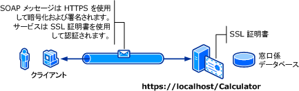

# <a name="transport-security-with-basic-authentication"></a><span data-ttu-id="00077-102">基本認証でのトランスポート セキュリティ</span><span class="sxs-lookup"><span data-stu-id="00077-102">Transport Security with Basic Authentication</span></span>
<span data-ttu-id="00077-103">次の図は、[!INCLUDE[indigo1](../../../../includes/indigo1-md.md)] のサービスとクライアントを示しています。</span><span class="sxs-lookup"><span data-stu-id="00077-103">The following illustration shows a [!INCLUDE[indigo1](../../../../includes/indigo1-md.md)] service and client.</span></span> <span data-ttu-id="00077-104">サーバーには、SSL (Secure Sockets Layer) に使用できる有効な X509 証明書が必要であり、クライアントはサーバーの証明書を信頼する必要があります。</span><span class="sxs-lookup"><span data-stu-id="00077-104">The server needs a valid X.509 certificate that can be used for Secure Sockets Layer (SSL), and the clients must trust the server’s certificate.</span></span> <span data-ttu-id="00077-105">さらに、Web サービスには使用可能な SSL が既に実装されています。</span><span class="sxs-lookup"><span data-stu-id="00077-105">Further, the Web service already has an SSL implementation that can be used.</span></span> [!INCLUDE[crabout](../../../../includes/crabout-md.md)]<span data-ttu-id="00077-106">インターネット インフォメーション サービス (IIS) で基本認証を有効にするを参照してください[http://go.microsoft.com/fwlink/?LinkId=83822](http://go.microsoft.com/fwlink/?LinkId=83822)です。</span><span class="sxs-lookup"><span data-stu-id="00077-106"> enabling basic authentication on Internet Information Services (IIS), see [http://go.microsoft.com/fwlink/?LinkId=83822](http://go.microsoft.com/fwlink/?LinkId=83822).</span></span>  
  
 <span data-ttu-id="00077-107"></span><span class="sxs-lookup"><span data-stu-id="00077-107"></span></span>  
  
|<span data-ttu-id="00077-108">特徴</span><span class="sxs-lookup"><span data-stu-id="00077-108">Characteristic</span></span>|<span data-ttu-id="00077-109">説明</span><span class="sxs-lookup"><span data-stu-id="00077-109">Description</span></span>|  
|--------------------|-----------------|  
|<span data-ttu-id="00077-110">セキュリティ モード</span><span class="sxs-lookup"><span data-stu-id="00077-110">Security Mode</span></span>|<span data-ttu-id="00077-111">Transport</span><span class="sxs-lookup"><span data-stu-id="00077-111">Transport</span></span>|  
|<span data-ttu-id="00077-112">相互運用性</span><span class="sxs-lookup"><span data-stu-id="00077-112">Interoperability</span></span>|<span data-ttu-id="00077-113">既存の Web サービス クライアントとサービスを使用する</span><span class="sxs-lookup"><span data-stu-id="00077-113">With existing Web service clients and services</span></span>|  
|<span data-ttu-id="00077-114">認証 (サーバー)</span><span class="sxs-lookup"><span data-stu-id="00077-114">Authentication (Server)</span></span><br /><br /> <span data-ttu-id="00077-115">認証 (クライアント)</span><span class="sxs-lookup"><span data-stu-id="00077-115">Authentication (Client)</span></span>|<span data-ttu-id="00077-116">○ (HTTPS を使用)</span><span class="sxs-lookup"><span data-stu-id="00077-116">Yes (using HTTPS)</span></span><br /><br /> <span data-ttu-id="00077-117">○ (ユーザー名とパスワードを使用)</span><span class="sxs-lookup"><span data-stu-id="00077-117">Yes (through User name/Password)</span></span>|  
|<span data-ttu-id="00077-118">整合性</span><span class="sxs-lookup"><span data-stu-id="00077-118">Integrity</span></span>|<span data-ttu-id="00077-119">はい</span><span class="sxs-lookup"><span data-stu-id="00077-119">Yes</span></span>|  
|<span data-ttu-id="00077-120">機密性</span><span class="sxs-lookup"><span data-stu-id="00077-120">Confidentiality</span></span>|<span data-ttu-id="00077-121">はい</span><span class="sxs-lookup"><span data-stu-id="00077-121">Yes</span></span>|  
|<span data-ttu-id="00077-122">Transport</span><span class="sxs-lookup"><span data-stu-id="00077-122">Transport</span></span>|<span data-ttu-id="00077-123">HTTPS</span><span class="sxs-lookup"><span data-stu-id="00077-123">HTTPS</span></span>|  
|<span data-ttu-id="00077-124">バインディング</span><span class="sxs-lookup"><span data-stu-id="00077-124">Binding</span></span>|<xref:System.ServiceModel.WSHttpBinding>|  
  
## <a name="service"></a><span data-ttu-id="00077-125">サービス</span><span class="sxs-lookup"><span data-stu-id="00077-125">Service</span></span>  
 <span data-ttu-id="00077-126">次のコードと構成は、別々に実行します。</span><span class="sxs-lookup"><span data-stu-id="00077-126">The following code and configuration are meant to run independently.</span></span> <span data-ttu-id="00077-127">次のいずれかの操作を行います。</span><span class="sxs-lookup"><span data-stu-id="00077-127">Do one of the following:</span></span>  
  
-   <span data-ttu-id="00077-128">構成を使用せずに、コードを使用してスタンドアロン サービスを作成します。</span><span class="sxs-lookup"><span data-stu-id="00077-128">Create a stand-alone service using the code with no configuration.</span></span>  
  
-   <span data-ttu-id="00077-129">提供された構成を使用してサービスを作成しますが、エンドポイントを定義しません。</span><span class="sxs-lookup"><span data-stu-id="00077-129">Create a service using the supplied configuration, but do not define any endpoints.</span></span>  
  
### <a name="code"></a><span data-ttu-id="00077-130">コード</span><span class="sxs-lookup"><span data-stu-id="00077-130">Code</span></span>  
 <span data-ttu-id="00077-131">次のコードでは、転送セキュリティ用の Windows ドメイン ユーザー名とパスワードを使用するサービス エンドポイントを作成する方法を示します。</span><span class="sxs-lookup"><span data-stu-id="00077-131">The following code shows how to create a service endpoint that uses a Windows domain user name and password for transfer security.</span></span> <span data-ttu-id="00077-132">サービスには、クライアントに対する認証を行うための X 509 証明書が必要になります。</span><span class="sxs-lookup"><span data-stu-id="00077-132">Note that the service requires an X.509 certificate to authenticate to the client.</span></span> <span data-ttu-id="00077-133">詳細については、次を参照してください。[証明書の使用](../../../../docs/framework/wcf/feature-details/working-with-certificates.md)と[する方法: SSL 証明書でポートを構成する](../../../../docs/framework/wcf/feature-details/how-to-configure-a-port-with-an-ssl-certificate.md)です。</span><span class="sxs-lookup"><span data-stu-id="00077-133">For more information, see [Working with Certificates](../../../../docs/framework/wcf/feature-details/working-with-certificates.md) and [How to: Configure a Port with an SSL Certificate](../../../../docs/framework/wcf/feature-details/how-to-configure-a-port-with-an-ssl-certificate.md).</span></span>  
  
 [!code-csharp[C_SecurityScenarios#1](../../../../samples/snippets/csharp/VS_Snippets_CFX/c_securityscenarios/cs/source.cs#1)]
 [!code-vb[C_SecurityScenarios#1](../../../../samples/snippets/visualbasic/VS_Snippets_CFX/c_securityscenarios/vb/source.vb#1)]  
  
## <a name="configuration"></a><span data-ttu-id="00077-134">構成</span><span class="sxs-lookup"><span data-stu-id="00077-134">Configuration</span></span>  
 <span data-ttu-id="00077-135">次の例では、トランスポート レベルのセキュリティの基本認証を使用するサービスを構成します。</span><span class="sxs-lookup"><span data-stu-id="00077-135">The following configures a service to use basic authentication with transport-level security:</span></span>  
  
```xml  
<?xml version="1.0" encoding="utf-8"?>  
<configuration>  
    <system.serviceModel>  
        <bindings>  
            <wsHttpBinding>  
                <binding name="UsernameWithTransport">  
                    <security mode="Transport">  
                        <transport clientCredentialType="Basic" />  
                    </security>  
                </binding>  
            </wsHttpBinding>  
        </bindings>  
        <services>  
            <service name="BasicAuthentication.Calculator">  
                <endpoint address="https://localhost/Calculator"  
                          binding="wsHttpBinding"   
                          bindingConfiguration="UsernameWithTransport"  
                          name="BasicEndpoint"   
                          contract="BasicAuthentication.ICalculator" />  
            </service>  
        </services>  
    </system.serviceModel>  
</configuration>  
```  
  
## <a name="client"></a><span data-ttu-id="00077-136">Client</span><span class="sxs-lookup"><span data-stu-id="00077-136">Client</span></span>  
  
### <a name="code"></a><span data-ttu-id="00077-137">コード</span><span class="sxs-lookup"><span data-stu-id="00077-137">Code</span></span>  
 <span data-ttu-id="00077-138">次のコードは、ユーザー名とパスワードが含まれるクライアント コードを示しています。</span><span class="sxs-lookup"><span data-stu-id="00077-138">The following code shows the client code that includes the user name and password.</span></span> <span data-ttu-id="00077-139">ユーザーは、有効な Windows ユーザー名とパスワードを指定する必要があります。</span><span class="sxs-lookup"><span data-stu-id="00077-139">Note that the user must provide a valid Windows user name and password.</span></span> <span data-ttu-id="00077-140">ユーザー名とパスワードを返すコードは、ここに示されていません。</span><span class="sxs-lookup"><span data-stu-id="00077-140">The code to return the user name and password is not shown here.</span></span> <span data-ttu-id="00077-141">ダイアログボックスまたは他のインターフェースを使用して、ユーザーにこれらの情報を照会してください。</span><span class="sxs-lookup"><span data-stu-id="00077-141">Use a dialog box or other interface to query the user for the information.</span></span>  
  
> [!NOTE]
>  <span data-ttu-id="00077-142">ユーザー名とパスワードは、コードを使ってのみ設定できます。</span><span class="sxs-lookup"><span data-stu-id="00077-142">User name and password can only be set using code.</span></span>  
  
 [!code-csharp[C_SecurityScenarios#2](../../../../samples/snippets/csharp/VS_Snippets_CFX/c_securityscenarios/cs/source.cs#2)]
 [!code-vb[C_SecurityScenarios#2](../../../../samples/snippets/visualbasic/VS_Snippets_CFX/c_securityscenarios/vb/source.vb#2)]  
  
### <a name="configuration"></a><span data-ttu-id="00077-143">構成</span><span class="sxs-lookup"><span data-stu-id="00077-143">Configuration</span></span>  
 <span data-ttu-id="00077-144">次のコードは、クライアントの構成を示しています。</span><span class="sxs-lookup"><span data-stu-id="00077-144">The following code shows the client configuration.</span></span>  
  
> [!NOTE]
>  <span data-ttu-id="00077-145">構成を使用してユーザー名とパスワードを設定することはできません。</span><span class="sxs-lookup"><span data-stu-id="00077-145">You cannot use configuration to set the user name and password.</span></span> <span data-ttu-id="00077-146">ここに示した構成には、ユーザー名とパスワードを設定するためのコードを補う必要があります。</span><span class="sxs-lookup"><span data-stu-id="00077-146">The configuration shown here must be augmented using code to set the user name and password.</span></span>  
  
```xml  
<?xml version="1.0" encoding="utf-8"?>  
<configuration>  
  <system.serviceModel>  
    <bindings>  
      <wsHttpBinding>  
        <binding name="WSHttpBinding_ICalculator" >  
          <security mode="Transport">  
            <transport clientCredentialType="Basic" />  
          </security>  
        </binding>  
      </wsHttpBinding>  
    </bindings>  
    <client>  
      <endpoint address="https://machineName/Calculator"   
                binding="wsHttpBinding"  
                bindingConfiguration="WSHttpBinding_ICalculator"   
                contract="ICalculator"  
                name="WSHttpBinding_ICalculator" />  
    </client>  
  </system.serviceModel>  
</configuration>  
```  
  
## <a name="see-also"></a><span data-ttu-id="00077-147">関連項目</span><span class="sxs-lookup"><span data-stu-id="00077-147">See Also</span></span>  
 <xref:System.ServiceModel.ClientBase%601.ClientCredentials%2A>  
 <xref:System.ServiceModel.Security.UserNamePasswordClientCredential>  
 [<span data-ttu-id="00077-148">証明書の使用</span><span class="sxs-lookup"><span data-stu-id="00077-148">Working with Certificates</span></span>](../../../../docs/framework/wcf/feature-details/working-with-certificates.md)  
 [<span data-ttu-id="00077-149">方法: SSL 証明書でポートを構成します。</span><span class="sxs-lookup"><span data-stu-id="00077-149">How to: Configure a Port with an SSL Certificate</span></span>](../../../../docs/framework/wcf/feature-details/how-to-configure-a-port-with-an-ssl-certificate.md)  
 [<span data-ttu-id="00077-150">セキュリティの概要</span><span class="sxs-lookup"><span data-stu-id="00077-150">Security Overview</span></span>](../../../../docs/framework/wcf/feature-details/security-overview.md)  
 [<span data-ttu-id="00077-151">\<clientCredentials ></span><span class="sxs-lookup"><span data-stu-id="00077-151">\<clientCredentials></span></span>](../../../../docs/framework/configure-apps/file-schema/wcf/clientcredentials.md)  
 [<span data-ttu-id="00077-152">Windows Server App Fabric のセキュリティ モデル</span><span class="sxs-lookup"><span data-stu-id="00077-152">Security Model for Windows Server App Fabric</span></span>](http://go.microsoft.com/fwlink/?LinkID=201279&clcid=0x409)
