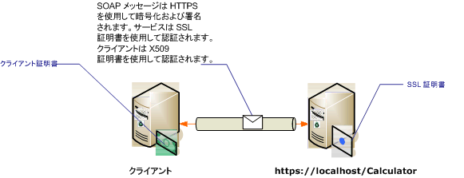

# <a name="transport-security-with-certificate-authentication"></a><span data-ttu-id="fc335-102">トランスポート セキュリティと証明書認証</span><span class="sxs-lookup"><span data-stu-id="fc335-102">Transport Security with Certificate Authentication</span></span>
<span data-ttu-id="fc335-103">このトピックでは、トランスポート セキュリティを使用する場合にサーバーとクライアントの認証に X.509 証明書を使用する方法について説明します。</span><span class="sxs-lookup"><span data-stu-id="fc335-103">This topic discusses using X.509 certificates for server and client authentication when using transport security.</span></span> <span data-ttu-id="fc335-104">詳細については、X.509 証明書を参照してください[X.509 公開キー証明書](http://msdn.microsoft.com/library/bb540819\(VS.85\).aspx)です。</span><span class="sxs-lookup"><span data-stu-id="fc335-104">For more information about X.509 certificates see [X.509 Public Key Certificates](http://msdn.microsoft.com/library/bb540819\(VS.85\).aspx).</span></span> <span data-ttu-id="fc335-105">これは多くの場合、証明書のサード パーティ発行元証明機関証明書を発行する必要があります。</span><span class="sxs-lookup"><span data-stu-id="fc335-105">Certificates must be issued by a certification authority, which is often a third-party issuer of certificates.</span></span> <span data-ttu-id="fc335-106">Windows サーバー ドメインでは、そのドメインのクライアント コンピューターに対して証明書を発行する際に Active Directory 証明書サービスを使用できます。</span><span class="sxs-lookup"><span data-stu-id="fc335-106">On a Windows Server domain, Active Directory Certificate Services can be used to issue certificates to client computers on the domain.</span></span> <span data-ttu-id="fc335-107">詳細については、次を参照してください。 [Windows 2008 R2 の証明書サービス](http://go.microsoft.com/fwlink/?LinkID=209949&clcid=0x409)です。</span><span class="sxs-lookup"><span data-stu-id="fc335-107">For more information see [Windows 2008 R2 Certificate Services](http://go.microsoft.com/fwlink/?LinkID=209949&clcid=0x409).</span></span> <span data-ttu-id="fc335-108">このシナリオでは、Secure Sockets Layer (SSL) を使用して構成されたインターネット インフォメーション サービス (IIS) でサービスをホストします。</span><span class="sxs-lookup"><span data-stu-id="fc335-108">In this scenario, the service is hosted under Internet Information Services (IIS) which is configured with Secure Sockets Layer (SSL).</span></span> <span data-ttu-id="fc335-109">サービスは、クライアントがサーバーの ID を確認するための SSL (X.509) 証明書を使用して構成されます。</span><span class="sxs-lookup"><span data-stu-id="fc335-109">The service is configured with an SSL (X.509) certificate to allow clients to verify the identity of the server.</span></span> <span data-ttu-id="fc335-110">クライアントも、サービスがクライアントの ID を確認するための X.509 証明書を使用して構成されます。</span><span class="sxs-lookup"><span data-stu-id="fc335-110">The client is also configured with an X.509 certificate that allows the service to verify the identity of the client.</span></span> <span data-ttu-id="fc335-111">サーバーの証明書はクライアントによって信頼されている必要があり、クライアントの証明書はサーバーによって信頼されている必要があります。</span><span class="sxs-lookup"><span data-stu-id="fc335-111">The server’s certificate must be trusted by the client and the client’s certificate must be trusted by the server.</span></span> <span data-ttu-id="fc335-112">サービスとクライアントが互いの ID を確認する方法の実際のしくみについては、このトピックでは説明しません。</span><span class="sxs-lookup"><span data-stu-id="fc335-112">The actual mechanics of how the service and client verifies each other’s identity is beyond the scope of this topic.</span></span> <span data-ttu-id="fc335-113">詳細については、次を参照してください。 [Wikipedia のデジタル署名](http://go.microsoft.com/fwlink/?LinkId=253157)です。</span><span class="sxs-lookup"><span data-stu-id="fc335-113">For more information see [Digital Signature on Wikipedia](http://go.microsoft.com/fwlink/?LinkId=253157).</span></span>  
  
 <span data-ttu-id="fc335-114">このシナリオでは、次の図に示すような要求/応答のメッセージ パターンを実装します。</span><span class="sxs-lookup"><span data-stu-id="fc335-114">This scenario implements a request/reply message pattern as illustrated by the following diagram.</span></span>  
  
 <span data-ttu-id="fc335-115"></span><span class="sxs-lookup"><span data-stu-id="fc335-115"></span></span>  
  
 <span data-ttu-id="fc335-116">サービスと証明書の使用の詳細については、次を参照してください。[証明書の使用](../../../../docs/framework/wcf/feature-details/working-with-certificates.md)と[する方法: SSL 証明書でポートを構成する](../../../../docs/framework/wcf/feature-details/how-to-configure-a-port-with-an-ssl-certificate.md)です。</span><span class="sxs-lookup"><span data-stu-id="fc335-116">For more information about using a certificate with a service, see [Working with Certificates](../../../../docs/framework/wcf/feature-details/working-with-certificates.md) and [How to: Configure a Port with an SSL Certificate](../../../../docs/framework/wcf/feature-details/how-to-configure-a-port-with-an-ssl-certificate.md).</span></span> <span data-ttu-id="fc335-117">このシナリオのさまざまな特性を次の表に示します。</span><span class="sxs-lookup"><span data-stu-id="fc335-117">The following table describes the various characteristics of the scenario.</span></span>  
  
|<span data-ttu-id="fc335-118">特徴</span><span class="sxs-lookup"><span data-stu-id="fc335-118">Characteristic</span></span>|<span data-ttu-id="fc335-119">説明</span><span class="sxs-lookup"><span data-stu-id="fc335-119">Description</span></span>|  
|--------------------|-----------------|  
|<span data-ttu-id="fc335-120">セキュリティ モード</span><span class="sxs-lookup"><span data-stu-id="fc335-120">Security Mode</span></span>|<span data-ttu-id="fc335-121">Transport</span><span class="sxs-lookup"><span data-stu-id="fc335-121">Transport</span></span>|  
|<span data-ttu-id="fc335-122">相互運用性</span><span class="sxs-lookup"><span data-stu-id="fc335-122">Interoperability</span></span>|<span data-ttu-id="fc335-123">既存の Web サービス クライアントおよびサービスとの相互運用性</span><span class="sxs-lookup"><span data-stu-id="fc335-123">With existing Web service clients and services.</span></span>|  
|<span data-ttu-id="fc335-124">認証 (サーバー)</span><span class="sxs-lookup"><span data-stu-id="fc335-124">Authentication (Server)</span></span><br /><br /> <span data-ttu-id="fc335-125">認証 (クライアント)</span><span class="sxs-lookup"><span data-stu-id="fc335-125">Authentication (Client)</span></span>|<span data-ttu-id="fc335-126">○ (SSL 証明書を使用)</span><span class="sxs-lookup"><span data-stu-id="fc335-126">Yes (using an SSL certificate)</span></span><br /><br /> <span data-ttu-id="fc335-127">○ (X.509 証明書を使用)</span><span class="sxs-lookup"><span data-stu-id="fc335-127">Yes (using an X.509 certificate)</span></span>|  
|<span data-ttu-id="fc335-128">データの整合性</span><span class="sxs-lookup"><span data-stu-id="fc335-128">Data Integrity</span></span>|<span data-ttu-id="fc335-129">[はい]</span><span class="sxs-lookup"><span data-stu-id="fc335-129">Yes</span></span>|  
|<span data-ttu-id="fc335-130">データの機密性</span><span class="sxs-lookup"><span data-stu-id="fc335-130">Data Confidentiality</span></span>|<span data-ttu-id="fc335-131">[はい]</span><span class="sxs-lookup"><span data-stu-id="fc335-131">Yes</span></span>|  
|<span data-ttu-id="fc335-132">Transport</span><span class="sxs-lookup"><span data-stu-id="fc335-132">Transport</span></span>|<span data-ttu-id="fc335-133">HTTPS</span><span class="sxs-lookup"><span data-stu-id="fc335-133">HTTPS</span></span>|  
|<span data-ttu-id="fc335-134">バインド</span><span class="sxs-lookup"><span data-stu-id="fc335-134">Binding</span></span>|<xref:System.ServiceModel.WSHttpBinding>|  
  
## <a name="configure-the-service"></a><span data-ttu-id="fc335-135">サービスの構成</span><span class="sxs-lookup"><span data-stu-id="fc335-135">Configure the Service</span></span>  
 <span data-ttu-id="fc335-136">このシナリオのサービスは IIS でホストされるので、web.config ファイルを使用して構成します。</span><span class="sxs-lookup"><span data-stu-id="fc335-136">Since the service in this scenario is hosted under IIS, it is configured with a web.config file.</span></span> <span data-ttu-id="fc335-137">次の web.config は、トランスポート セキュリティと X.509 クライアント資格情報を使用するように <xref:System.ServiceModel.WSHttpBinding> を構成する方法を示しています。</span><span class="sxs-lookup"><span data-stu-id="fc335-137">The following web.config shows how to configure the <xref:System.ServiceModel.WSHttpBinding> to use transport security and X.509 client credentials.</span></span>  
  
```xml  
<configuration>  
  <system.serviceModel>  
    <protocolMapping>  
      <add scheme="https" binding="wsHttpBinding" />  
    </protocolMapping>  
    <bindings>  
      <wsHttpBinding>  
        <!-- configure wsHttp binding with Transport security mode and clientCredentialType as Certificate -->  
        <binding>  
          <security mode="Transport">  
            <transport clientCredentialType="Certificate"/>              
          </security>  
        </binding>  
      </wsHttpBinding>  
    </bindings>  
    <!--For debugging purposes set the includeExceptionDetailInFaults attribute to true-->  
    <behaviors>  
      <serviceBehaviors>  
        <behavior>            
           <serviceDebug includeExceptionDetailInFaults="True" />  
        </behavior>  
      </serviceBehaviors>  
    </behaviors>  
  </system.serviceModel>  
</configuration>  
```  
  
## <a name="configure-the-client"></a><span data-ttu-id="fc335-138">クライアントの構成</span><span class="sxs-lookup"><span data-stu-id="fc335-138">Configure the Client</span></span>  
 <span data-ttu-id="fc335-139">クライアントはコードまたは app.config ファイルで構成できます。</span><span class="sxs-lookup"><span data-stu-id="fc335-139">The client can be configured in code or in an app.config file.</span></span> <span data-ttu-id="fc335-140">次の例は、クライアントをコードで構成する方法を示しています。</span><span class="sxs-lookup"><span data-stu-id="fc335-140">The following example shows how to configure the client in code.</span></span>  
  
```vb  
// Create the binding.  
WSHttpBinding myBinding = new WSHttpBinding();  
myBinding.Security.Mode = SecurityMode.Transport;  
myBinding.Security.Transport.ClientCredentialType =  
   HttpClientCredentialType.Certificate;  
  
// Create the endpoint address. Note that the machine name   
// must match the subject or DNS field of the X.509 certificate  
// used to authenticate the service.   
EndpointAddress ea = new  
   EndpointAddress("https://localhost/CalculatorService/service.svc");  
  
// Create the client. The code for the calculator   
// client is not shown here. See the sample applications  
// for examples of the calculator code.  
CalculatorClient cc =  
   new CalculatorClient(myBinding, ea);  
  
// The client must specify a certificate trusted by the server.  
cc.ClientCredentials.ClientCertificate.SetCertificate(  
    StoreLocation.CurrentUser,  
    StoreName.My,  
    X509FindType.FindBySubjectName,  
    "contoso.com");  
  
// Begin using the client.  
Console.WriteLine(cc.Add(100, 1111));  
//...  
cc.Close();  
```  
  
 <span data-ttu-id="fc335-141">また、次の例のように App.config ファイルでクライアントを構成することもできます。</span><span class="sxs-lookup"><span data-stu-id="fc335-141">Alternatively you can configure the client in an App.config file as shown in the following example:</span></span>  
  
```xml  
<configuration>  
  <system.serviceModel>  
    <client>  
      <!-- this endpoint has an https: address -->  
      <endpoint address=" https://localhost/CalculatorService/service.svc "   
                behaviorConfiguration="endpointCredentialBehavior"  
                binding="wsHttpBinding"   
                bindingConfiguration="Binding1"   
                contract="Microsoft.Samples.TransportSecurity.ICalculator"/>  
    </client>  
    <behaviors>  
      <endpointBehaviors>  
        <behavior name="endpointCredentialBehavior">  
          <clientCredentials>  
            <clientCertificate findValue="contoso.com"  
                               storeLocation="CurrentUser"  
                               storeName="My"  
                               x509FindType="FindBySubjectName" />  
          </clientCredentials>  
        </behavior>  
      </endpointBehaviors>  
    </behaviors>  
    <bindings>  
      <wsHttpBinding>  
        <!-- configure wsHttpbinding with Transport security mode  
                   and clientCredentialType as Certificate -->  
        <binding name="Binding1">  
          <security mode="Transport">  
            <transport clientCredentialType="Certificate"/>  
          </security>  
        </binding>  
      </wsHttpBinding>  
    </bindings>  
  </system.serviceModel>  
  
<startup><supportedRuntime version="v4.0" sku=".NETFramework,Version=v4.0"/></startup></configuration>  
```  
  
## <a name="see-also"></a><span data-ttu-id="fc335-142">関連項目</span><span class="sxs-lookup"><span data-stu-id="fc335-142">See Also</span></span>  
 [<span data-ttu-id="fc335-143">セキュリティの概要</span><span class="sxs-lookup"><span data-stu-id="fc335-143">Security Overview</span></span>](../../../../docs/framework/wcf/feature-details/security-overview.md)  
 [<span data-ttu-id="fc335-144">Windows Server App Fabric のセキュリティ モデル</span><span class="sxs-lookup"><span data-stu-id="fc335-144">Security Model for Windows Server App Fabric</span></span>](http://go.microsoft.com/fwlink/?LinkID=201279&clcid=0x409)
