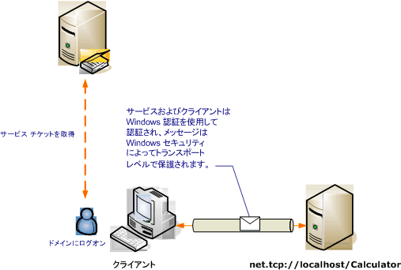

# <a name="transport-security-with-windows-authentication"></a>トランスポート セキュリティと Windows 認証
次のシナリオでは、Windows Communication Foundation (WCF) クライアントと Windows セキュリティによって保護されたサービスを示します。 プログラミングの詳細については、次を参照してください。[する方法: Windows 資格情報でサービスをセキュリティで保護された](../../../../docs/framework/wcf/how-to-secure-a-service-with-windows-credentials.md)です。  
  
 イントラネットの Web サービスでは人事情報を表示しています。 クライアントは Windows フォーム アプリケーションです。 このアプリケーションは、Kerberos コントローラーで保護されたドメインに展開されています。  
  
   
  
|特徴|説明|  
|--------------------|-----------------|  
|セキュリティ モード|Transport|  
|相互運用性|WCF のみ|  
|認証 (サーバー)<br /><br /> 認証 (クライアント)|○ (Windows 統合認証を使用)<br /><br /> ○ (Windows 統合認証を使用)|  
|整合性|はい|  
|機密性|はい|  
|Transport|NET.TCP|  
|バインド|<xref:System.ServiceModel.NetTcpBinding>|  
  
## <a name="service"></a>サービス  
 次のコードと構成は、別々に実行します。 次のいずれかの操作を行います。  
  
-   構成を使用せずに、コードを使用してスタンドアロン サービスを作成します。  
  
-   提供された構成を使用してサービスを作成しますが、エンドポイントを定義しません。  
  
### <a name="code"></a>コード  
 次のコードは、Windows セキュリティを使用するサービス エンドポイントの作成方法を示します。  
  
 [!code-csharp[C_SecurityScenarios#3](../../../../samples/snippets/csharp/VS_Snippets_CFX/c_securityscenarios/cs/source.cs#3)]
 [!code-vb[C_SecurityScenarios#3](../../../../samples/snippets/visualbasic/VS_Snippets_CFX/c_securityscenarios/vb/source.vb#3)]  
  
### <a name="configuration"></a>構成  
 コードの代わりに次の構成を使用して、サービス エンドポイントをセットアップできます。  
  
```xml  
<?xml version="1.0" encoding="utf-8"?>  
<configuration>  
  <system.serviceModel>  
    <behaviors />  
    <services>  
      <service behaviorConfiguration="" name="ServiceModel.Calculator">  
        <endpoint address="net.tcp://localhost:8008/Calculator"   
                  binding="netTcpBinding"  
          bindingConfiguration="WindowsClientOverTcp"   
                  name="WindowsClientOverTcp"  
                  contract="ServiceModel.ICalculator" />  
      </service>  
    </services>  
    <bindings>  
      <netTcpBinding>  
        <binding name="WindowsClientOverTcp">  
          <security mode="Transport">  
            <transport clientCredentialType="Windows" />  
          </security>  
        </binding>  
      </netTcpBinding>  
    </bindings>  
    <client />  
  </system.serviceModel>  
</configuration>  
```  
  
## <a name="client"></a>クライアント  
 次のコードと構成は、別々に実行します。 次のいずれかの操作を行います。  
  
-   コード (およびクライアント コード) を使用してスタンドアロン クライアントを作成します。  
  
-   エンドポイント アドレスを定義しないクライアントを作成します。 代わりに、引数として構成名を受け取るクライアント コンストラクターを使用します。 次に例を示します。  
  
     [!code-csharp[C_SecurityScenarios#0](../../../../samples/snippets/csharp/VS_Snippets_CFX/c_securityscenarios/cs/source.cs#0)]
     [!code-vb[C_SecurityScenarios#0](../../../../samples/snippets/visualbasic/VS_Snippets_CFX/c_securityscenarios/vb/source.vb#0)]  
  
### <a name="code"></a>コード  
 クライアントを作成する場合のコード例を次に示します。 バインディングは、クライアントの資格情報の種類が Windows に設定された、TCP トランスポートによるトランスポート モード セキュリティを使用するように構成されます。  
  
 [!code-csharp[C_SecurityScenarios#4](../../../../samples/snippets/csharp/VS_Snippets_CFX/c_securityscenarios/cs/source.cs#4)]
 [!code-vb[C_SecurityScenarios#4](../../../../samples/snippets/visualbasic/VS_Snippets_CFX/c_securityscenarios/vb/source.vb#4)]  
  
### <a name="configuration"></a>構成  
 コードの代わりに次の構成を使用して、クライアントを作成できます。  
  
```xml  
<?xml version="1.0" encoding="utf-8"?>  
<configuration>  
  <system.serviceModel>  
    <bindings>  
      <netTcpBinding>  
        <binding name="NetTcpBinding_ICalculator" >  
          <security mode="Transport">  
            <transport clientCredentialType="Windows" />  
          </security>  
        </binding>  
      </netTcpBinding>  
    </bindings>  
    <client>  
      <endpoint address="net.tcp://localhost:8008/Calculator"   
                binding="netTcpBinding"            
                bindingConfiguration="NetTcpBinding_ICalculator"   
                contract="ICalculator"  
                name="NetTcpBinding_ICalculator">  
      </endpoint>  
    </client>  
  </system.serviceModel>  
</configuration>  
```  
  
## <a name="see-also"></a>関連項目  
 [セキュリティの概要](../../../../docs/framework/wcf/feature-details/security-overview.md)  
 [方法: Windows 資格情報でサービスをセキュリティで保護する](../../../../docs/framework/wcf/how-to-secure-a-service-with-windows-credentials.md)  
 [Windows Server App Fabric のセキュリティ モデル](http://go.microsoft.com/fwlink/?LinkID=201279&clcid=0x409)
