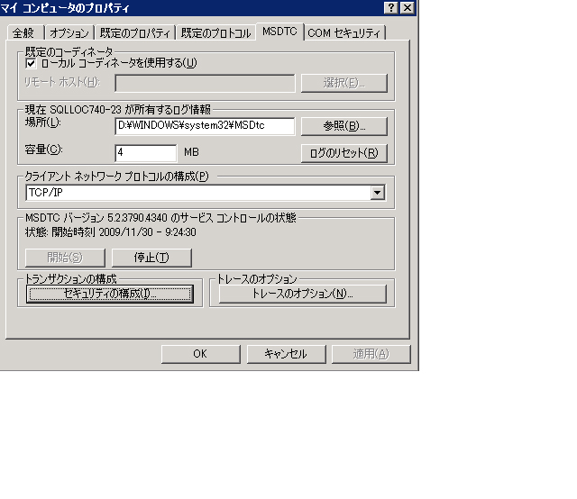
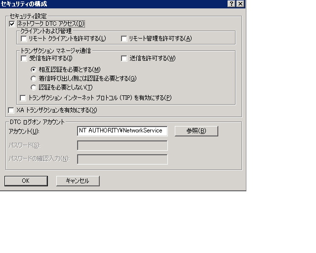

# <a name="troubleshooting-queued-messaging"></a>キューに置かれたメッセージングのトラブルシューティング
ここでは、[!INCLUDE[indigo1](../../../../includes/indigo1-md.md)] でのキューの使用に関する一般的な質問とトラブルシューティング ヘルプについて説明します。  
  
## <a name="common-questions"></a>一般的な質問  
 **Q:** 使用[!INCLUDE[indigo2](../../../../includes/indigo2-md.md)]ベータ 1 とは、MSMQ の修正プログラムをインストールします。 この修正プログラムを削除する必要がありますか。  
  
 **A:** できます。 この修正プログラムのサポートは終了しています。 [!INCLUDE[indigo2](../../../../includes/indigo2-md.md)] は、現在、MSMQ で正常に動作し、修正プログラムは不要です。  
  
 **Q:** MSMQ 用の 2 つのバインディングがある:<xref:System.ServiceModel.NetMsmqBinding>と<xref:System.ServiceModel.MsmqIntegration.MsmqIntegrationBinding>です。 それぞれの用途を教えてください。  
  
 **A:** を使用して、<xref:System.ServiceModel.NetMsmqBinding>の 2 つのキューに置かれた通信をトランスポートとして MSMQ を使用するときに[!INCLUDE[indigo2](../../../../includes/indigo2-md.md)]アプリケーションです。 また、<xref:System.ServiceModel.MsmqIntegration.MsmqIntegrationBinding> を使用するのは、既存の MSMQ アプリケーションを使用して、新しい [!INCLUDE[indigo2](../../../../includes/indigo2-md.md)] アプリケーションと通信する場合です。  
  
 **Q:** を使用するように MSMQ をアップグレードする必要は、<xref:System.ServiceModel.NetMsmqBinding>と`MsmqIntegration`バインドしますか?  
  
 **A:** いいえ。 これらは共に [!INCLUDE[wxp](../../../../includes/wxp-md.md)] および [!INCLUDE[ws2003](../../../../includes/ws2003-md.md)] 上の MSMQ 3.0 で使用できます。 [!INCLUDE[wv](../../../../includes/wv-md.md)] で MSMQ 4.0 にアップグレードすると、バインディングの特定の機能が使用可能になります。  
  
 **Q:** のどの機能、<xref:System.ServiceModel.NetMsmqBinding>と<xref:System.ServiceModel.MsmqIntegration.MsmqIntegrationBinding>バインドが MSMQ 4.0 ではなく MSMQ 3.0 で使用可能ですか?  
  
 **A:** 次の機能は、MSMQ 4.0 ではなく MSMQ 3.0 で使用します。  
  
-   カスタム配信不能キューは、MSMQ 4.0 でのみサポートされます。  
  
-   MSMQ 3.0 と 4.0 では、有害メッセージの処理方法が異なります。  
  
-   MSMQ 4.0 のみが、リモート トランザクション読み取りをサポートします。  
  
 詳細については、次を参照してください。 [Windows Vista、Windows Server 2003、および Windows XP におけるキューの機能の相違点](../../../../docs/framework/wcf/feature-details/diff-in-queue-in-vista-server-2003-windows-xp.md)です。  
  
 **Q:** 相手側のキューに置かれた通信および MSMQ 4.0 の一方の側で MSMQ 3.0 を使用できますか。  
  
 **A:** できます。  
  
 **Q:** 新規と既存の MSMQ アプリケーションを統合する[!INCLUDE[indigo2](../../../../includes/indigo2-md.md)]クライアントまたはサーバー。 使用している MSMQ インフラストラクチャの両方の側をアップグレードする必要がありますか。  
  
 **A:** いいえ。 どちら側も MSMQ 4.0 にアップグレードする必要はありません。  
  
## <a name="troubleshooting"></a>トラブルシューティング  
 ここでは、一般的なトラブルシューティングの問題に対する解答を示します。 既知の制限である一部の問題は、リリース ノートにも記載されています。  
  
 **Q:** プライベート キューを使用して、次の例外を取得します。 `System.InvalidOperationException`: URL が無効です。 キューの URL に '$' 文字を使用することはできません。 net.msmq://machine/private/queueName の構文を使用して、プライベート キューをアドレス指定してください。  
  
 **A:** 構成またはコードでキュー (Uniform Resource Identifier) を確認してください。 URI では、"$" 文字を使用できません。 たとえば、OrdersQueue という名前のプライベート キューのアドレスを指定する場合は、URI を net.msmq://localhost/private/ordersQueue と指定してください。  
  
 **Q:** 呼び出す`ServiceHost.Open()`キューに置かれたアプリケーションで、次の例外をスローします。 `System.ArgumentException`: ベース アドレスに URI クエリ文字列を含めることはできません。 なぜでしょうか。  
  
 **A:** URI の構成ファイルと、コードでキューを確認します。 MSMQ のキューでは '?' 文字の使用がサポートされていますが、URI はこれを文字列クエリの開始と解釈します。 この問題を回避するには、'?' 文字を含まないキュー名を使用してください。  
  
 **Q:** 送信が成功しましたが、受信者側でサービス操作が呼び出されません。 なぜでしょうか。  
  
 **A:** への回答を決定するには、次のチェック ボックスの一覧から作業します。  
  
-   トランザクション キューの要件と指定済みの保証が適合することを確認します。 次の原則に注意してください。  
  
    -   メッセージを送信できます持続性のある (データグラムとセッション) に「1 回限り」保証 (<xref:System.ServiceModel.MsmqBindingBase.ExactlyOnce%2A> = `true`)、トランザクション キューだけにします。  
  
    -   "1 回限りの" 配信の保証付きのセッションのみを送信できます。  
  
    -   セッションでトランザクション キューからメッセージを受け取るには、1 つのトランザクションが必要です。  
  
    -   保証なしの揮発性または持続性のメッセージ (ダイアグラムのみ) を送受信する (<xref:System.ServiceModel.MsmqBindingBase.ExactlyOnce%2A> = `false`)、非トランザクション キューにのみです。  
  
-   配信不能キューを確認します。 このキューにメッセージが置かれている場合は、メッセージが配信されなかった理由を特定してください。  
  
-   送信キューを確認して、接続性またはアドレス指定の問題を特定します。  
  
 **Q:** カスタムの配信不能キューを指定したが、送信側のアプリケーションを起動したとき、いずれかの配信不能キューが含まれていない例外を取得または送信元アプリケーションに、配信不能キューへのアクセス許可がありません。 なぜ、こうなるのでしょうか。  
  
 **A:** カスタム配信不能キューの URI は、たとえば、net.msmq://localhost/private/myAppdead-letter queue の最初のセグメントに"localhost"またはコンピューター名を含める必要があります。  
  
 **Q:** 常にする必要があるカスタムの配信不能キューを定義または既定の配信不能キューではありますか。  
  
 **A:** 保証が「1 回限り」の場合 (<xref:System.ServiceModel.MsmqBindingBase.ExactlyOnce%2A> = `true`)、およびカスタム配信不能キューを指定しないと、既定値がシステム全体のトランザクション配信不能キュー。  
  
 保証がない場合 (<xref:System.ServiceModel.MsmqBindingBase.ExactlyOnce%2A> = `false`)、既定値には、配信不能キューの機能は不要です。  
  
 **Q:** メッセージ SvcHost.Open で「EndpointListener 要件満たすことができません ListenerFactory」サービスがスローされます。 なぜでしょうか。  
  
 A:  サービス コントラクトを確認してください。 配置を忘れた"IsOneWay =`true`"すべてのサービス操作にします。 キューは、一方向のサービス操作しかサポートしません。  
  
 **Q:** キューにメッセージがあるが、サービス操作が呼び出されません。 何が問題なのでしょうか。  
  
 **A:** サービス ホストに障害があるかを判断します。 確認するには、トレースを調べるか、`IErrorHandler` を実装します。 既定では、有害メッセージが検出された場合、サービス ホストはエラーになります。  
  
 **Q:** キューにメッセージがあるが、Web ホストのキューに置かれたサービスがアクティブになりません。 なぜでしょうか。  
  
 **A:** 最も一般的な理由はアクセス許可。  
  
1.  `NetMsmqActivator` プロセスが実行され、そのキューで、`NetMsmqActivator` の ID に読み取りおよびシーク アクセス許可が割り当てられていることを確認してください。  
  
2.  `NetMsmqActivator` がリモート コンピューター上のキューを監視している場合は、`NetMsmqActivator` が制限付きトークンの下で実行されていないことを確認してください。 無制限のトークンを使用して `NetMsmqActivator` を実行するには、以下を実行します。  
  
    ```  
    sc sidtype NetMsmqActivator unrestricted  
    ```  
  
 関連する Web ホストの問題のないセキュリティを参照してください:[キューに置かれたアプリケーションをホストしている Web](../../../../docs/framework/wcf/feature-details/web-hosting-a-queued-application.md)です。  
  
 **Q:** access セッションに最も簡単な方法は何ですか。  
  
 **A:** オートコンプリートの設定 =`true`の最後に対応した操作には、セッションで、メッセージし、オートコンプリートの設定 =`false`残りのすべてのサービス操作にします。  
  
 **Q:** MSMQ によく寄せられる質問に対する回答を見つける場所ですか?  
  
 **A:** [!INCLUDE[crabout](../../../../includes/crabout-md.md)] MSMQ を参照してください[Microsoft メッセージ キュー](http://go.microsoft.com/fwlink/?LinkId=87810)です。  
  
 **Q:** 理由は、サービスをスロー、`ProtocolException`両方を含むキューからの読み取りがセッション メッセージをキューに登録および使用するデータグラム メッセージをキューに登録しますか?  
  
 **A:** までキューに置かれたセッションのメッセージでの基本的な違いがあるし、キューに置かれた使用するデータグラム メッセージを構成します。 このため、キューを使用するセッション メッセージを読み取ろうとするサービスは、キューを使用するデータグラム メッセージを受信できず、キューを使用するデータグラム メッセージを読み取ろうとするサービスは、セッション メッセージを受信できません。 これら両方の種類のメッセージを同じキューから読み取ろうとすると、次の例外がスローされます。  
  
```  
System.ServiceModel.MsmqPoisonMessageException: The transport channel detected a poison message. This occurred because the message exceeded the maximum number of delivery attempts or because the channel detected a fundamental problem with the message. The inner exception may contain additional information.   
---> System.ServiceModel.ProtocolException: An incoming MSMQ message contained invalid or unexpected .NET Message Framing information in its body. The message cannot be received. Ensure that the sender is using a compatible service contract with a matching SessionMode.  
```  
  
 アプリケーションが同じコンピューターからキューを使用するセッション メッセージとキューを使用するデータグラム メッセージの両方を送信する場合は、任意のカスタム配信不能キューだけでなくシステム配信不能キューで特にこの問題が発生する可能性があります。 メッセージを正常に送信できない場合、メッセージは配信不能キューに移されます。 このような場合は、セッション メッセージとデータグラム メッセージの両方が配信不能キューに置かれる可能性があります。 実行時にキューから読み取るときに両方の種類のメッセージを分離することはできません。そのため、アプリケーションでは、キューを使用するセッション メッセージとキューを使用するデータグラム メッセージの両方を同じコンピューターから送信しないでください。  
  
### <a name="msmq-integration-specific-troubleshooting"></a>MSMQ 統合 : 固有のトラブルシューティング  
 **Q:** メッセージを送信するとき、またはサービス ホストを開くときに、スキームが間違っているかを示すエラーが発生します。 なぜでしょうか。  
  
 **A:** MSMQ 統合バインディングを使用する場合は、msmq.formatname スキームを使用する必要があります。 たとえば、msmq.formatname:DIRECT=OS:.\private$\OrdersQueue などです。 ただし、カスタム配信不能キューを指定するときは、net.msmq スキームを使用する必要があります。  
  
 **Q:** public または private 形式名を使用し、上のサービス ホストを開いてすればとき[!INCLUDE[wv](../../../../includes/wv-md.md)]、エラーが発生します。 なぜでしょうか。  
  
 **A:** 、[!INCLUDE[indigo2](../../../../includes/indigo2-md.md)]で統合チャネル[!INCLUDE[wv](../../../../includes/wv-md.md)]サブキュー有害なメッセージを処理するため、アプリケーションのメイン キューを開くことができるかどうかを確認します。 サブキューの名前は、リスナーに渡される msmq.formatname URI から派生します。 MSMQ でのサブキュー名は、直接形式名に限定されます。 そのためにエラーが発生します。 キュー URI を直接形式名に変更してください。  
  
 **Q:** MSMQ アプリケーションからメッセージを受信するときに、メッセージがキューに置かれ、受信側によって読み取られません[!INCLUDE[indigo2](../../../../includes/indigo2-md.md)]アプリケーションです。 なぜでしょうか。  
  
 **A:** メッセージ本文が含まれるかどうかを確認します。 メッセージに本文がない場合、MSMQ 統合チャネルはメッセージを無視します。 例外を通知する `IErrorHandler` を実装し、トレースを確認してください。  
  
### <a name="security-related-troubleshooting"></a>セキュリティ関連のトラブルシューティング  
 **Q:** メッセージが送信されたようですが、受信側で受信されませんワークグループ モードで、既定のバインディングを使用するサンプルを実行するとします。  
  
 **A:** を Active Directory ディレクトリ サービスを必要とする MSMQ 内部の証明書を使用して既定では、メッセージは署名されます。 ワークグループ モードでは、Active Directory が使用できないため、メッセージに署名できません。 したがって、メッセージが配信不能キューに入るれ、「署名が正しくありません」などの障害の原因が示されます。  
  
 この問題を回避するには、セキュリティを無効にします。 これは、設定で<xref:System.ServiceModel.NetMsmqSecurity.Mode%2A>  =  <xref:System.ServiceModel.NetMsmqSecurityMode.None>ワークグループ モードで動作させるのにします。  
  
 また、<xref:System.ServiceModel.MsmqTransportSecurity> プロパティから <xref:System.ServiceModel.NetMsmqSecurity.Transport%2A> を取得し、それを <xref:System.ServiceModel.MsmqAuthenticationMode.Certificate> に設定して、クライアント証明書を設定する方法もあります。  
  
 さらに、MSMQ と Active Directory 統合をインストールして回避することもできます。  
  
 **Q:** 既定のバインディングでメッセージを送信するときに (トランスポート セキュリティが有効)「内部証明書が見つかりません」メッセージが表示されるキューを Active Directory でします。 これを修復する方法を教えてください。  
  
 **A:** つまり、送信者の Active Directory で証明書を更新する必要があります。 これを行うには、開く**コントロール パネルの **、**管理ツール**、**コンピューターの管理**を右クリックして**MSMQ**を選択し、**プロパティ**です。 選択、**ユーザー証明書** タブでをクリックし、**書き換え**ボタンをクリックします。  
  
 **Q:** を使用して、メッセージ送信時に<xref:System.ServiceModel.MsmqAuthenticationMode.Certificate>使用する証明書を指定して、「無効な証明書」メッセージが表示されます。 これを修復する方法を教えてください。  
  
 **A:** 証明書のモードでローカル コンピューターの証明書ストアを使用することはできません。 証明書スナップインを使用して、コンピューターの証明書ストアから現在のユーザー ストアに証明書をコピーする必要があります。 証明書スナップインを開くには、以下を実行します。  
  
1.  をクリックして**開始**を選択**実行**、型`mmc`、 をクリック**OK**です。  
  
2.  **Microsoft 管理コンソール**を開き、**ファイル**メニュー**スナップインの追加と削除**です。  
  
3.  **スナップインの追加と削除**ダイアログ ボックスで、をクリックして、**追加**ボタンをクリックします。  
  
4.  **スタンドアロン スナップインの追加** ダイアログ ボックス、選択の証明書およびクリック**追加**です。  
  
5.  **証明書**スナップイン ダイアログ ボックスで、 **ユーザー アカウント** をクリック**完了**です。  
  
6.  スナップインで、前の手順を使用して、2 番目の証明書が、今回の選択を次に、追加**コンピューター アカウント** をクリック**次**です。  
  
7.  選択**ローカル コンピューター**  をクリック**完了**です。 これで、コンピューターの証明書ストアから現在のユーザー ストアに証明書をドラッグ アンド ドロップできます。  
  
 **Q:** ときに、サービス、キューから読み取るワークグループ モードで別のコンピューターに"access denied"例外を取得します。  
  
 **A:** リモート アプリケーション キューにアクセスするために、ワークグループ モードでアプリケーションのキューへのアクセス権限が必要です。 キューのアクセス制御リスト (ACL) に「匿名ログイン」を追加し、読み取りアクセス許可を付けます。  
  
 **Q:** ネットワーク サービス クライアント (またはドメイン アカウントを持たない任意のクライアント) は、キューに置かれたメッセージを送信するとき、送信が無効な証明書で失敗します。 これを修復する方法を教えてください。  
  
 **A:** バインディング構成を確認します。 既定のバインディングでは、メッセージに署名するために MSMQ トランスポート セキュリティを有効にしています。 これを無効にしてください。  
  
### <a name="remote-transacted-receives"></a>リモート トランザクション受信  
 **Q:** コンピューター A で、キューがある場合、[!INCLUDE[indigo2](../../../../includes/indigo2-md.md)]サービスを読み取るメッセージの B (リモート トランザクション受信シナリオ)、コンピューター上のキューからメッセージがキューから読み取られません。 受信側は、メッセージ「トランザクションをインポートできません」で失敗しました。 トレース情報を示します これを修正するのには、どうすればよいですか  
  
 **A:** この 3 つの理由が考えられます。  
  
-   ドメイン モードの場合、リモート トランザクション受信には、Microsoft 分散トランザクション コーディネーター (MSDTC) ネットワーク アクセスが必要です。 有効にできますこれを使用して**コンポーネントの追加/削除**です。  
  
       
  
-   トランザクション マネージャーと通信するための認証モードを確認します。 ワークグループ モードの場合は、「認証が必要です」を選択する必要があります。 ドメイン モードの場合は、「相互認証が必要です」を選択する必要があります。  
  
       
  
-   MSDTC が内の例外の一覧であるかどうかを確認、**インターネット接続ファイアウォール**設定します。  
  
-   [!INCLUDE[wv](../../../../includes/wv-md.md)] を使用していることを確認します。 [!INCLUDE[wv](../../../../includes/wv-md.md)] 上の MSMQ は、リモート トランザクション読み取りをサポートします。 以前の Windows リリース上の MSMQ は、リモート トランザクション読み取りをサポートしません。  
  
 **Q:** キューから読み取るサービスがネットワーク サービスの場合は、たとえば、Web でホスト、アクセス拒否例外を取得する理由が発生、キューから読み取るときにしますか?  
  
 **A:** ネットワーク サービス読み取りアクセスは、キュー、ネットワーク サービスがキューから読み取ることができますを確実に ACL に追加する必要があります。  
  
 **Q:** をリモート コンピューター上のキュー内のメッセージに基づくアプリケーションをアクティブ化する、MSMQ アクティブ化サービスを使用できますか。  
  
 **A:** できます。 これには、ネットワーク サービスとして動作するように MSMQ アクティベーション サービスを構成し、リモート コンピューター上のキューへのネットワーク サービス アクセスを追加する必要があります。  
  
## <a name="using-custom-msmq-bindings-with-receivecontext-enabled"></a>ReceiveContext を有効にしたカスタム MSMQ バインディングの使用  
 <xref:System.ServiceModel.Channels.ReceiveContext> を有効にしてカスタム MSMQ バインディングを使用すると、ネイティブの MSMQ が非同期の <xref:System.ServiceModel.Channels.ReceiveContext> 受信の I/O 完了をサポートしないために、着信メッセージの処理にスレッド プール内のスレッドが使用されます。 これは、このようなメッセージの処理に <xref:System.ServiceModel.Channels.ReceiveContext> の内部トランザクションが使用され、MSMQ が非同期処理をサポートしないためです。 この問題を回避するには、<xref:System.ServiceModel.Description.SynchronousReceiveBehavior> をエンドポイントに追加して同期処理を強制するか、<xref:System.ServiceModel.Description.DispatcherSynchronizationBehavior.MaxPendingReceives%2A> を 1 に設定します。
