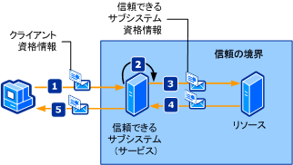

# <a name="trusted-subsystem"></a><span data-ttu-id="99f43-102">信頼できるサブシステム</span><span class="sxs-lookup"><span data-stu-id="99f43-102">Trusted Subsystem</span></span>
<span data-ttu-id="99f43-103">クライアントは、ネットワーク全体に分散している 1 つ以上の Web サービスにアクセスします。</span><span class="sxs-lookup"><span data-stu-id="99f43-103">A client accesses one or more Web services that are distributed across a network.</span></span> <span data-ttu-id="99f43-104">Web サービスは、追加のリソース (データベースや他の Web サービスなど) に対するアクセスが、Web サービスのビジネス ロジック内にカプセル化されるように設計されています。</span><span class="sxs-lookup"><span data-stu-id="99f43-104">The Web services are designed so that access to additional resources (such as databases or other Web services) is encapsulated in the business logic of the Web service.</span></span> <span data-ttu-id="99f43-105">これらのリソースは、非承認のアクセスに対して保護する必要があります。</span><span class="sxs-lookup"><span data-stu-id="99f43-105">These resources must be protected against unauthorized access.</span></span> <span data-ttu-id="99f43-106">信頼できるサブシステムの処理を次の図に示します。</span><span class="sxs-lookup"><span data-stu-id="99f43-106">The following illustration depicts a trusted subsystem process.</span></span>  
  
 <span data-ttu-id="99f43-107"></span><span class="sxs-lookup"><span data-stu-id="99f43-107"></span></span>  
  
 <span data-ttu-id="99f43-108">上図に示した信頼できるサブシステムの処理について、以下の手順で説明します。</span><span class="sxs-lookup"><span data-stu-id="99f43-108">The following steps describe the trusted subsystem process as illustrated:</span></span>  
  
1.  <span data-ttu-id="99f43-109">クライアントが、信頼できるサブシステムに、資格情報と共に要求を送信します。</span><span class="sxs-lookup"><span data-stu-id="99f43-109">The client submits a request to the trusted subsystem, along with credentials.</span></span>  
  
2.  <span data-ttu-id="99f43-110">信頼できるサブシステムが、ユーザーの認証と承認を行います。</span><span class="sxs-lookup"><span data-stu-id="99f43-110">The trusted subsystem authenticates and authorizes the user.</span></span>  
  
3.  <span data-ttu-id="99f43-111">信頼できるサブシステムは、リモート リソースに要求メッセージを送信します。</span><span class="sxs-lookup"><span data-stu-id="99f43-111">The trusted subsystem sends a request message to the remote resource.</span></span> <span data-ttu-id="99f43-112">この要求には、信頼できるサブシステムの資格情報 (または信頼できるサブシステムの処理を実行しているサービス アカウント) が付属しています。</span><span class="sxs-lookup"><span data-stu-id="99f43-112">This request is accompanied by the credentials for the trusted subsystem (or the service account under which the trusted subsystem process is being executed).</span></span>  
  
4.  <span data-ttu-id="99f43-113">バックエンド リソースが、信頼できるサブシステムの認証と承認を行います。</span><span class="sxs-lookup"><span data-stu-id="99f43-113">The back-end resource authenticates and authorizes the trusted subsystem.</span></span> <span data-ttu-id="99f43-114">次にバックエンド リソースは要求を処理し、信頼できるサブシステムへの応答を発行します。</span><span class="sxs-lookup"><span data-stu-id="99f43-114">It then processes the request and issues a response to the trusted subsystem.</span></span>  
  
5.  <span data-ttu-id="99f43-115">信頼できるサブシステムはこの応答を処理し、自身の応答をクライアントに発行します。</span><span class="sxs-lookup"><span data-stu-id="99f43-115">The trusted subsystem processes the response and issues its own response to the client.</span></span>  
  
|<span data-ttu-id="99f43-116">特徴</span><span class="sxs-lookup"><span data-stu-id="99f43-116">Characteristic</span></span>|<span data-ttu-id="99f43-117">説明</span><span class="sxs-lookup"><span data-stu-id="99f43-117">Description</span></span>|  
|--------------------|-----------------|  
|<span data-ttu-id="99f43-118">セキュリティ モード</span><span class="sxs-lookup"><span data-stu-id="99f43-118">Security Mode</span></span>|<span data-ttu-id="99f43-119">メッセージ</span><span class="sxs-lookup"><span data-stu-id="99f43-119">Message</span></span>|  
|<span data-ttu-id="99f43-120">相互運用性</span><span class="sxs-lookup"><span data-stu-id="99f43-120">Interoperability</span></span>|[!INCLUDE[indigo1](../../../../includes/indigo1-md.md)]<span data-ttu-id="99f43-121"> のみ。</span><span class="sxs-lookup"><span data-stu-id="99f43-121"> only.</span></span>|  
|<span data-ttu-id="99f43-122">認証 (サービス)</span><span class="sxs-lookup"><span data-stu-id="99f43-122">Authentication (service)</span></span>|<span data-ttu-id="99f43-123">セキュリティ トークン サービスはクライアントの認証と承認を行います。</span><span class="sxs-lookup"><span data-stu-id="99f43-123">Security token service authenticates and authorizes clients.</span></span>|  
|<span data-ttu-id="99f43-124">認証 (クライアント)</span><span class="sxs-lookup"><span data-stu-id="99f43-124">Authentication (client)</span></span>|<span data-ttu-id="99f43-125">信頼できるサブシステムがクライアントを認証し、リソースが信頼できるサブシステム サービスを認証します。</span><span class="sxs-lookup"><span data-stu-id="99f43-125">The trusted subsystem authenticates the client and the resource authenticates the trusted subsystem service.</span></span>|  
|<span data-ttu-id="99f43-126">整合性</span><span class="sxs-lookup"><span data-stu-id="99f43-126">Integrity</span></span>|<span data-ttu-id="99f43-127">はい</span><span class="sxs-lookup"><span data-stu-id="99f43-127">Yes</span></span>|  
|<span data-ttu-id="99f43-128">機密性</span><span class="sxs-lookup"><span data-stu-id="99f43-128">Confidentiality</span></span>|<span data-ttu-id="99f43-129">はい</span><span class="sxs-lookup"><span data-stu-id="99f43-129">Yes</span></span>|  
|<span data-ttu-id="99f43-130">Transport</span><span class="sxs-lookup"><span data-stu-id="99f43-130">Transport</span></span>|<span data-ttu-id="99f43-131">クライアントと信頼できるサブシステム サービス間にある HTTP</span><span class="sxs-lookup"><span data-stu-id="99f43-131">HTTP between client and the trusted subsystem service.</span></span><br /><br /> <span data-ttu-id="99f43-132">信頼できるサブシステム サービスとリソース (バックエンド サービス) の間にある NET.TCP</span><span class="sxs-lookup"><span data-stu-id="99f43-132">NET.TCP between trusted subsystem service and the resource (back-end service).</span></span>|  
|<span data-ttu-id="99f43-133">バインド</span><span class="sxs-lookup"><span data-stu-id="99f43-133">Binding</span></span>|<span data-ttu-id="99f43-134"><xref:System.ServiceModel.WSHttpBinding>および<xref:System.ServiceModel.NetTcpBinding> [ \<wsFederationHttpBinding >](../../../../docs/framework/configure-apps/file-schema/wcf/wsfederationhttpbinding.md)</span><span class="sxs-lookup"><span data-stu-id="99f43-134"><xref:System.ServiceModel.WSHttpBinding> and <xref:System.ServiceModel.NetTcpBinding>[\<wsFederationHttpBinding>](../../../../docs/framework/configure-apps/file-schema/wcf/wsfederationhttpbinding.md)</span></span>|  
  
## <a name="resource-back-end-service"></a><span data-ttu-id="99f43-135">リソース (バックエンド サービス)</span><span class="sxs-lookup"><span data-stu-id="99f43-135">Resource (Back-End Service)</span></span>  
  
### <a name="code"></a><span data-ttu-id="99f43-136">コード</span><span class="sxs-lookup"><span data-stu-id="99f43-136">Code</span></span>  
 <span data-ttu-id="99f43-137">次のコードでは、TCP トランスポート プロトコル上でトランスポート セキュリティを使用するリソースのサービス エンドポイントを作成する方法を示します。</span><span class="sxs-lookup"><span data-stu-id="99f43-137">The following code shows how to create a service endpoint for the resource, which uses transport security over the TCP transport protocol.</span></span>  
  
 [!code-csharp[TrustedSubSystemsResource#1](../../../../samples/snippets/csharp/VS_Snippets_CFX/trustedsubsystemsresource/cs/source.cs#1)]
 [!code-vb[TrustedSubSystemsResource#1](../../../../samples/snippets/visualbasic/VS_Snippets_CFX/trustedsubsystemsresource/vb/source.vb#1)]  
  
### <a name="configuration"></a><span data-ttu-id="99f43-138">構成</span><span class="sxs-lookup"><span data-stu-id="99f43-138">Configuration</span></span>  
 <span data-ttu-id="99f43-139">次の構成では、構成を使用して同一のエンドポイントをセットアップします。</span><span class="sxs-lookup"><span data-stu-id="99f43-139">The following configuration sets up the same endpoint using configuration.</span></span>  
  
```xml  
<?xml version="1.0" encoding="utf-8" ?>  
<configuration>  
  <system.serviceModel>  
    <services>  
      <service name="Microsoft.ServiceModel.Samples.BackendService"  
               behaviorConfiguration="BackendServiceBehavior">  
        <endpoint address="net.tcp://localhost.com:8001/BackendService"  
                  binding="customBinding"  
                  bindingConfiguration="Binding1"  
                  contract="Microsoft.ServiceModel.Samples.ICalculator"/>  
      </service>  
    </services>  
    <bindings>  
      <customBinding>  
        <binding name="Binding1">  
          <security authenticationMode="UserNameOverTransport"/>  
          <windowsStreamSecurity/>  
          <tcpTransport/>  
        </binding>  
      </customBinding>  
    </bindings>  
    <behaviors>  
      <serviceBehaviors>  
        <behavior name="BackendServiceBehavior">  
          <serviceCredentials>  
            <userNameAuthentication userNamePasswordValidationMode="Custom"  
                                    customUserNamePasswordValidatorType="Microsoft.ServiceModel.Samples.MyUserNamePasswordValidator, BackendService"/>  
          </serviceCredentials>  
        </behavior>  
      </serviceBehaviors>  
    </behaviors>  
  </system.serviceModel>  
</configuration>  
```  
  
## <a name="trusted-subsystem"></a><span data-ttu-id="99f43-140">信頼できるサブシステム</span><span class="sxs-lookup"><span data-stu-id="99f43-140">Trusted Subsystem</span></span>  
  
### <a name="code"></a><span data-ttu-id="99f43-141">コード</span><span class="sxs-lookup"><span data-stu-id="99f43-141">Code</span></span>  
 <span data-ttu-id="99f43-142">次のコードでは、HTTP プロトコル上のメッセージ セキュリティで認証にユーザー名とパスワードを使用する、信頼できるサブシステムのサービス エンドポイントを作成する方法を示します。</span><span class="sxs-lookup"><span data-stu-id="99f43-142">The following code shows how to create a service endpoint for the trusted subsystem that uses message security over the HTTP protocol and a user name and password for authentication.</span></span>  
  
 [!code-csharp[TrustedSubSystems#1](../../../../samples/snippets/csharp/VS_Snippets_CFX/trustedsubsystems/cs/source.cs#1)]
 [!code-vb[TrustedSubSystems#1](../../../../samples/snippets/visualbasic/VS_Snippets_CFX/trustedsubsystems/vb/source.vb#1)]  
  
 <span data-ttu-id="99f43-143">次のコードでは、TCP トランスポート プロトコル上でトランスポート セキュリティを使用してバックエンド サービスと通信を行う、信頼できるサブシステムのサービスを示します。</span><span class="sxs-lookup"><span data-stu-id="99f43-143">The following code shows a service in a trusted subsystem that communicates with a back-end service using transport security over the TCP transport protocol.</span></span>  
  
 [!code-csharp[TrustedSubSystems#2](../../../../samples/snippets/csharp/VS_Snippets_CFX/trustedsubsystems/cs/source.cs#2)]
 [!code-vb[TrustedSubSystems#2](../../../../samples/snippets/visualbasic/VS_Snippets_CFX/trustedsubsystems/vb/source.vb#2)]  
  
### <a name="configuration"></a><span data-ttu-id="99f43-144">構成</span><span class="sxs-lookup"><span data-stu-id="99f43-144">Configuration</span></span>  
 <span data-ttu-id="99f43-145">次の構成では、構成を使用して同一のエンドポイントをセットアップします。</span><span class="sxs-lookup"><span data-stu-id="99f43-145">The following configuration sets up the same endpoint using configuration.</span></span> <span data-ttu-id="99f43-146">2 つのバインディングがあることに注意してください。1 つは、信頼できるサブシステムでホストされるサービスをセキュリティで保護するバインディングで、もう 1 つは、信頼できるサブシステムとバックエンド サービスの間の通信のためのバインディングです。</span><span class="sxs-lookup"><span data-stu-id="99f43-146">Note the two bindings: One secures the service hosted in the trusted subsystem and the other communicates between the trusted subsystem and the back-end service.</span></span>  
  
```xml  
<?xml version="1.0" encoding="utf-8" ?>  
<configuration>  
  <system.serviceModel>  
    <services>  
      <service name="Microsoft.ServiceModel.Samples.FacadeService"  
               behaviorConfiguration="FacadeServiceBehavior">  
        <host>  
          <baseAddresses>  
            <add baseAddress="http://localhost:8000/FacadeService"/>  
          </baseAddresses>  
        </host>  
        <endpoint address="http://localhost:8000/FacadeService"  
                  binding="wsHttpBinding"  
                  bindingConfiguration="Binding1"  
                  contract="Microsoft.ServiceModel.Samples.ICalculator"/>  
      </service>  
    </services>  
    <client>  
      <endpoint name=""   
                address="net.tcp://contoso.com:8001/BackendService"  
                binding="customBinding"  
                bindingConfiguration="ClientBinding"  
                contract="Microsoft.ServiceModel.Samples.ICalculator"/>  
    </client>  
    <bindings>  
      <wsHttpBinding>  
        <binding name="Binding1">  
          <security mode="Message">  
            <message clientCredentialType="UserName"/>  
          </security>  
        </binding>  
      </wsHttpBinding>  
      <customBinding>  
        <binding name="ClientBinding">  
          <security authenticationMode="UserNameOverTransport"/>  
          <windowsStreamSecurity/>  
          <tcpTransport/>  
        </binding>  
      </customBinding>  
    </bindings>  
    <behaviors>  
      <serviceBehaviors>  
        <behavior name="FacadeServiceBehavior">  
          <serviceMetadata httpGetEnabled="True"/>  
          <serviceCredentials>  
            <serviceCertificate findValue="Contoso.com"  
                                storeLocation="LocalMachine"  
                                storeName="My"  
                                x509FindType="FindBySubjectName" />  
            <userNameAuthentication userNamePasswordValidationMode="Custom"  
                                    customUserNamePasswordValidatorType="Microsoft.ServiceModel.Samples.MyUserNamePasswordValidator, FacadeService"/>  
          </serviceCredentials>  
        </behavior>  
      </serviceBehaviors>  
    </behaviors>  
  </system.serviceModel>  
</configuration>  
```  
  
## <a name="client"></a><span data-ttu-id="99f43-147">クライアント</span><span class="sxs-lookup"><span data-stu-id="99f43-147">Client</span></span>  
  
### <a name="code"></a><span data-ttu-id="99f43-148">コード</span><span class="sxs-lookup"><span data-stu-id="99f43-148">Code</span></span>  
 <span data-ttu-id="99f43-149">次のコードでは、HTTP プロトコル上のメッセージ セキュリティで認証にユーザー名とパスワードを使用することで、信頼できるサブシステムと通信を行うクライアントを作成する方法を示します。</span><span class="sxs-lookup"><span data-stu-id="99f43-149">The following code shows how to create the client that communicates with the trusted subsystem by using message security over the HTTP protocol and a user name and password for authentication.</span></span>  
  
 [!code-csharp[TrustedSubSystemsClient#1](../../../../samples/snippets/csharp/VS_Snippets_CFX/trustedsubsystemsclient/cs/source.cs#1)]
 [!code-vb[TrustedSubSystemsClient#1](../../../../samples/snippets/visualbasic/VS_Snippets_CFX/trustedsubsystemsclient/vb/source.vb#1)]  
  
### <a name="configuration"></a><span data-ttu-id="99f43-150">構成</span><span class="sxs-lookup"><span data-stu-id="99f43-150">Configuration</span></span>  
 <span data-ttu-id="99f43-151">次のコードでは、HTTP プロトコル上のメッセージ セキュリティ、および認証用のユーザー名とパスワードを使用するようにクライアントを構成します。</span><span class="sxs-lookup"><span data-stu-id="99f43-151">The following code configures the client to use message security over the HTTP protocol and a user name and password for authentication.</span></span> <span data-ttu-id="99f43-152">ユーザー名とパスワードの指定はコードを使用する場合に限られます (構成可能ではありません)。</span><span class="sxs-lookup"><span data-stu-id="99f43-152">The user name and password can only be specified using code (it is not configurable).</span></span>  
  
```xml  
<?xml version="1.0" encoding="utf-8" ?>  
<configuration>  
  <system.serviceModel>  
    <client>  
        <endpoint name=""   
                  address="http://www.cohowinery.com:8000/FacadeService"  
                  binding="wsHttpBinding"  
                  bindingConfiguration="Binding1"  
                  behaviorConfiguration="ClientUserNameBehavior"  
                  contract="Microsoft.ServiceModel.Samples.ICalculator"/>  
    </client>  
    <bindings>  
      <wsHttpBinding>  
        <binding name="Binding1">  
          <security mode="Message">  
            <message clientCredentialType="UserName"/>  
          </security>  
        </binding>  
      </wsHttpBinding>  
    </bindings>  
    <behaviors>  
      <endpointBehaviors>  
        <behavior name="ClientUserNameBehavior">  
          <clientCredentials>  
            <serviceCertificate>  
              <authentication certificateValidationMode="PeerOrChainTrust"/>  
            </serviceCertificate>  
          </clientCredentials>  
        </behavior>  
      </endpointBehaviors>  
    </behaviors>  
  </system.serviceModel>  
</configuration>  
```  
  
## <a name="see-also"></a><span data-ttu-id="99f43-153">関連項目</span><span class="sxs-lookup"><span data-stu-id="99f43-153">See Also</span></span>  
 [<span data-ttu-id="99f43-154">セキュリティの概要</span><span class="sxs-lookup"><span data-stu-id="99f43-154">Security Overview</span></span>](../../../../docs/framework/wcf/feature-details/security-overview.md)  
 [<span data-ttu-id="99f43-155">Windows Server App Fabric のセキュリティ モデル</span><span class="sxs-lookup"><span data-stu-id="99f43-155">Security Model for Windows Server App Fabric</span></span>](http://go.microsoft.com/fwlink/?LinkID=201279&clcid=0x409)
