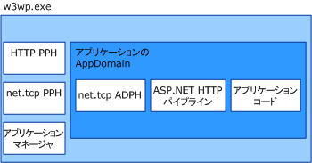

# <a name="was-activation-architecture"></a>WAS アクティベーション アーキテクチャ
ここでは、Windows プロセス アクティブ化サービス (WAS とも呼ばれます) の各コンポーネントについて説明します。  
  
## <a name="activation-components"></a>アクティベーション コンポーネント  
 WAS は、複数のアーキテクチャ コンポーネントで構成されます。  
  
-   リスナー アダプター :  特定のネットワーク プロトコルでメッセージを受信し、WAS と通信して、受信メッセージを適切なワーカー プロセスにルーティングする Windows サービス。  
  
-   WAS :  ワーカー プロセスの作成と有効期間を管理する Windows サービス。  
  
-   汎用ワーカー プロセス実行可能ファイル (w3wp.exe)。  
  
-   アプリケーション マネージャー :  ワーカー プロセス内のアプリケーションをホストするアプリケーション ドメインの作成と有効期間を管理します。  
  
-   プロトコル ハンドラー :  ワーカー プロセスで実行され、ワーカー プロセスと個々のリスナー アダプター間の通信を管理するプロトコル固有のコンポーネント。 プロトコル ハンドラーには、プロセス プロトコル ハンドラーと AppDomain プロトコル ハンドラーの 2 種類があります。  
  
 ワーカー プロセス インスタンスをアクティブ化する場合、WAS は必要なプロセス プロトコル ハンドラーをワーカー プロセスに読み込み、アプリケーション マネージャーを使用して、アプリケーションをホストするアプリケーション ドメインを作成します。 アプリケーション ドメインは、アプリケーションのコードと、アプリケーションが使用するネットワーク プロトコルに必要な AppDomain プロトコル ハンドラーを読み込みます。  
  
   
  
### <a name="listener-adapters"></a>リスナー アダプター  
 リスナー アダプターは個別の Windows サービスであり、リッスンするネットワーク プロトコルを使用して、メッセージ受信に使用されるネットワーク通信ロジックを実装します。 次の表には、Windows Communication Foundation (WCF) プロトコルのリスナー アダプターが一覧表示します。  
  
|リスナー アダプターのサービス名|プロトコル|メモ|  
|-----------------------------------|--------------|-----------|  
|W3SVC|http|IIS 7.0 と WCF HTTP アクティブ化を提供する共通のコンポーネント。|  
|NetTcpActivator|net.tcp|NetTcpPortSharing サービスに依存します。|  
|NetPipeActivator|net.pipe||  
|NetMsmqActivator|net.msmq|メッセージ キューの WCF ベースのアプリケーションで使用します。|  
|NetMsmqActivator|msmq.formatname|既存のメッセージ キュー アプリケーションとの下位互換性を提供します。|  
  
 次の XML サンプルに示すように、特定プロトコルのリスナー アダプターは、インストール時に applicationHost.config ファイルに登録されます。  
  
```xml  
<system.applicationHost>  
    <listenerAdapters>  
        <add name="http" />  
        <add name="net.tcp"   
          identity="S-1-5-80-3579033775-2824656752-1522793541-1960352512-462907086" />  
         <add name="net.pipe"   
           identity="S-1-5-80-2943419899-937267781-4189664001-1229628381-3982115073" />  
          <add name="net.msmq"   
            identity="S-1-5-80-89244771-1762554971-1007993102-348796144-2203111529" />  
           <add name="msmq.formatname"   
             identity="S-1-5-80-89244771-1762554971-1007993102-348796144-2203111529" />  
    </listenerAdapters>  
</system.applicationHost>  
```  
  
### <a name="protocol-handlers"></a>プロトコル ハンドラー  
 特定のプロトコルのプロセス プロトコル ハンドラーと AppDomain プロトコル ハンドラーは、コンピューター レベルの Web.config ファイルに登録されます。  
  
```xml  
<system.web>  
   <protocols>  
      <add name="net.tcp"   
        processHandlerType=  
         "System.ServiceModel.WasHosting.TcpProcessProtocolHandler"  
        appDomainHandlerType=  
         "System.ServiceModel.WasHosting.TcpAppDomainProtocolHandler"  
        validate="false" />  
      <add name="net.pipe"   
        processHandlerType=  
         "System.ServiceModel.WasHosting.NamedPipeProcessProtocolHandler"  
          appDomainHandlerType=  
           "System.ServiceModel.WasHosting.NamedPipeAppDomainProtocolHandler"/>  
      <add name="net.msmq"  
        processHandlerType=  
         "System.ServiceModel.WasHosting.MsmqProcessProtocolHandler"  
        appDomainHandlerType=  
         "System.ServiceModel.WasHosting.MsmqAppDomainProtocolHandler"  
        validate="false" />  
   </protocols>  
</system.web>  
```  
  
## <a name="see-also"></a>関連項目  
 [WCF で使用するための WAS を設定する](../../../../docs/framework/wcf/feature-details/configuring-the-wpa--service-for-use-with-wcf.md)  
 [Windows Server App Fabric のホスティング機能](http://go.microsoft.com/fwlink/?LinkId=201276)
