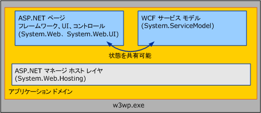

# <a name="wcf-services-and-aspnet"></a>WCF サービスと ASP.NET
ここでは、[!INCLUDE[indigo1](../../../../includes/indigo1-md.md)] サービスを ASP.NET とサイド バイ サイドでホストし、これらを ASP.NET 互換モードでホストする方法について解説します。  
  
## <a name="hosting-wcf-side-by-side-with-aspnet"></a>WCF を ASP.NET とサイド バイ サイドでホストする方法  
 [!INCLUDE[indigo2](../../../../includes/indigo2-md.md)] サービスを Internet Information Services (IIS) 上で稼働させる場合、これを .ASPX ページや ASMX Web サービスと同じアプリケーション ドメイン内に置くことができます。 ASP.NET には、AppDomain の管理、動的コンパイルなどの共通インフラストラクチャ サービスが組み込まれており、[!INCLUDE[indigo2](../../../../includes/indigo2-md.md)] と ASP.NET HTTP ランタイムのどちらにも対応しています。 [!INCLUDE[indigo2](../../../../includes/indigo2-md.md)] の既定の構成は、ASP.NET とサイド バイ サイドになっています。  
  
   
  
 ASP.NET の HTTP ランタイムは、ASP.NET 向けの要求を処理しますが、同じ AppDomain 上で稼働していても、[!INCLUDE[indigo2](../../../../includes/indigo2-md.md)] サービスに対する要求の処理には関与しません。 [!INCLUDE[indigo2](../../../../includes/indigo2-md.md)] のサービス モデルは、個々の [!INCLUDE[indigo2](../../../../includes/indigo2-md.md)] サービスに向けられたメッセージを途中受信し、[!INCLUDE[indigo2](../../../../includes/indigo2-md.md)] のトランスポート/チャネル スタックを介して転送します。  
  
 この結果、サイド バイ サイド モデルは次のようになります。  
  
-   ASP.NET と [!INCLUDE[indigo2](../../../../includes/indigo2-md.md)] サービスは、AppDomain の状態を共有できます。 どちらのフレームワークも同じ AppDomain に共存できるので、[!INCLUDE[indigo2](../../../../includes/indigo2-md.md)] は AppDomain の状態 (静的変数、イベントなど) も、ASP.NET と共有できます。  
  
-   [!INCLUDE[indigo2](../../../../includes/indigo2-md.md)] サービスは、ホスティング環境や伝送方式にかかわらず、動作が一貫しています。 ASP.NET HTTP ランタイムは意図的に、IIS/ASP.NET ホスティング環境や HTTP 通信と強く結合する形で設計されています。 一方 [!INCLUDE[indigo2](../../../../includes/indigo2-md.md)] は、ホスティング環境やトランスポートの種類に関係なく同じように動作します。[!INCLUDE[indigo2](../../../../includes/indigo2-md.md)] の動作は IIS の内部でも外部でも同じであり、IIS 7.0 以降でホストされているサービスは、HTTP 以外のプロトコルを使用するエンドポイントを含め、すべてのエンドポイントで動作が同じです。  
  
-   HTTP ランタイムに実装された機能は、同じ AppDomain 内でも、ASP.NET のコンテンツには適用されますが、[!INCLUDE[indigo2](../../../../includes/indigo2-md.md)] には適用されません。 ASP.NET アプリケーション プラットフォームに含まれている HTTP 固有の機能の多くは、ASP.NET コンテンツが含まれている AppDomain 内でホストされている [!INCLUDE[indigo2](../../../../includes/indigo2-md.md)] サービスには適用されません。 このような機能の例を次に示します。  
  
    -   HttpContext : <xref:System.Web.HttpContext.Current%2A> のサービスからアクセスされた場合、`null` は常に [!INCLUDE[indigo2](../../../../includes/indigo2-md.md)] を返します。 使用して<!--zz <xref:System.ServiceModel.OperationContext.Current.RequestContext>-->`RequestContext`代わりにします。  
  
    -   ファイル ベースの承認 : [!INCLUDE[indigo2](../../../../includes/indigo2-md.md)] のセキュリティ モデルでは、サービス要求が承認済みであるかどうかを判断する際、アクセス制御リスト (ACL) をサービスの .svc ファイルに適用することはできません。  
  
    -   構成ベースの URL 承認: 同様に、[!INCLUDE[indigo2](../../../../includes/indigo2-md.md)]セキュリティ モデルは、System.Web に指定された URL ベースの承認規則に従っていない\<authorization > 構成要素。 ASP.NET の URL 承認規則によって保護された URL 空間にサービスが存在する場合、[!INCLUDE[indigo2](../../../../includes/indigo2-md.md)] 要求に関しては、これらの設定が無視されます。  
  
    -   HttpModule の拡張機能 : [!INCLUDE[indigo2](../../../../includes/indigo2-md.md)] ホスティング インフラストラクチャは、[!INCLUDE[indigo2](../../../../includes/indigo2-md.md)] イベントが発生すると <xref:System.Web.HttpApplication.PostAuthenticateRequest> に対する要求を途中受信します。ASP.NET HTTP パイプラインには制御を返しません。 したがって、パイプラインのこれ以降の段階で要求を途中受信するよう設計されたモジュールは、[!INCLUDE[indigo2](../../../../includes/indigo2-md.md)] に対する要求を途中受信できません。  
  
    -   ASP.NET の偽装: 既定では、[!INCLUDE[indigo2](../../../../includes/indigo2-md.md)]要求常に実行するように IIS のプロセス id、System.Web を使用して偽装を有効にする ASP.NET が設定されている場合でも\<identity impersonate ="true"/> 構成オプション。  
  
 以上の制約は、IIS アプリケーション上で稼働する [!INCLUDE[indigo2](../../../../includes/indigo2-md.md)] サービスにのみ適用されます。 ASP.NET コンテンツの動作が、[!INCLUDE[indigo2](../../../../includes/indigo2-md.md)] の有無によって変わることはありません。  
  
 従来 HTTP パイプラインにより提供されていた機能を必要とする [!INCLUDE[indigo2](../../../../includes/indigo2-md.md)] アプリケーションは、[!INCLUDE[indigo2](../../../../includes/indigo2-md.md)] に組み込まれている、同等の機能の使用を検討します。これらは、特定のホストやトランスポートに依存しません。  
  
-   <xref:System.ServiceModel.OperationContext> (<xref:System.Web.HttpContext> の代わり)  
  
-   <xref:System.ServiceModel.Description.ServiceAuthorizationBehavior> (ASP.NET のファイル ベースまたは URL ベースの承認の代わり)  
  
-   <xref:System.ServiceModel.Dispatcher.IDispatchMessageInspector> または独自の階層チャネル (HTTP モジュールの代わり)  
  
-   [!INCLUDE[indigo2](../../../../includes/indigo2-md.md)] による各操作の偽装 (System.Web による偽装の代わり)  
  
 また、サービスを [!INCLUDE[indigo2](../../../../includes/indigo2-md.md)] の ASP.NET 互換モードで実行することも検討します。  
  
## <a name="hosting-wcf-services-in-aspnet-compatibility-mode"></a>WCF サービスを ASP.NET 互換モードで提供する方法  
 [!INCLUDE[indigo2](../../../../includes/indigo2-md.md)] モデルはホスティング環境やトランスポートにかかわらず一貫した動作をするように設計されていますが、アプリケーションによっては、このレベルの柔軟性が必要とされない場合も少なくありません。 [!INCLUDE[indigo2](../../../../includes/indigo2-md.md)] の ASP.NET 互換モードはこのように、IIS 以外で動作したり、HTTP 以外のプロトコルで通信したりする必要がない代わりに、ASP.NET Web アプリケーション プラットフォームのあらゆる機能を活用したい場合に適しています。  
  
 既定であるサイド バイド サイドの構成では、[!INCLUDE[indigo2](../../../../includes/indigo2-md.md)] ホスティング インフラストラクチャが [!INCLUDE[indigo2](../../../../includes/indigo2-md.md)] メッセージを途中受信し、HTTP パイプラインを使用せずに処理されました。これと異なり、ASP.NET 互換モードで実行される [!INCLUDE[indigo2](../../../../includes/indigo2-md.md)] サービスは、ASP.NET の HTTP 要求と同じライフサイクルになります。 互換モードでは、[!INCLUDE[indigo2](../../../../includes/indigo2-md.md)] サービスは、<xref:System.Web.IHttpHandler> を実装することにより HTTP パイプラインを使用します。これはASPX ページや ASMX Web サービスに対する要求を処理する方法と同じです。 したがって、[!INCLUDE[indigo2](../../../../includes/indigo2-md.md)] は、次に挙げるような ASP.NET の機能に関して、ASMX とまったく同じように動作します。  
  
-   ASP.NET 互換モードで動作する <xref:System.Web.HttpContext>: [!INCLUDE[indigo2](../../../../includes/indigo2-md.md)] サービスは、<xref:System.Web.HttpContext.Current%2A> やこれに関連する状態にアクセスできます。  
  
-   ファイル ベースの承認 : ASP.NET 互換モードで稼動する [!INCLUDE[indigo2](../../../../includes/indigo2-md.md)] サービスは、ファイル システムのアクセス制御リスト (ACL) をサービスの .svc ファイルに関連付けることによって、セキュリティで保護されます。  
  
-   URL 承認の設定 : ASP.NET の URL 承認規則は、[!INCLUDE[indigo2](../../../../includes/indigo2-md.md)] のサービスが ASP.NET 互換モードで動作していれば、[!INCLUDE[indigo2](../../../../includes/indigo2-md.md)] に対する要求にも適用されます。  
  
-   <xref:System.Web.HttpModuleCollection> の拡張機能 : [!INCLUDE[indigo2](../../../../includes/indigo2-md.md)] サービスを ASP.NET 互換モードで実行した場合は、ASP.NET の HTTP 要求と同じライフサイクルになるので、HTTP パイプラインに構成された HTTP モジュールはすべて、サービス起動の前後で、[!INCLUDE[indigo2](../../../../includes/indigo2-md.md)] に対する要求を処理できます。  
  
-   ASP.NET の偽装 : [!INCLUDE[indigo2](../../../../includes/indigo2-md.md)] サービスは、ASP.NET の偽装されたスレッドの ID で動作します。アプリケーションで ASP.NET の偽装が有効になっている場合、これは IIS プロセスの ID とは異なります。 特定のサービス操作に対して ASP.NET と [!INCLUDE[indigo2](../../../../includes/indigo2-md.md)] の両方の偽装が有効になっている場合、サービスは最終的に [!INCLUDE[indigo2](../../../../includes/indigo2-md.md)] から取得された ID で動作します。  
  
 [!INCLUDE[indigo2](../../../../includes/indigo2-md.md)] の ASP.NET 互換モードは、アプリケーションごとに、その Web.config ファイルに次のような記述をすることにより有効になります。  
  
```xml  
<system.serviceModel>  
    <serviceHostingEnvironment aspNetCompatibilityEnabled="true" />  
</system.serviceModel>  
```  
  
 既定値"`true`"を指定しない場合。 この値を設定"`false`"ことを示しますすべて[!INCLUDE[indigo2](../../../../includes/indigo2-md.md)]ASP.NET 互換モードでは、アプリケーションで実行されているサービスは実行できません。  
  
 ASP.NET 互換モードでは、要求の処理方法が [!INCLUDE[indigo2](../../../../includes/indigo2-md.md)] の既定の構成とまったく異なるので、個々のサービス実装は、ASP.NET 互換モードが有効化されているアプリケーション内で動作するかどうかを制御できます。 各サービスは、ASP.NET 互換モードをサポートするかどうかを、<xref:System.ServiceModel.Activation.AspNetCompatibilityRequirementsAttribute> で示すことができます。 この属性の既定値は <xref:System.ServiceModel.Activation.AspNetCompatibilityRequirementsMode.Allowed> です。  
  
 `[AspNetCompatibilityRequirements(RequirementsMode = AspNetCompatibilityRequirementsMode.Allowed)]`  
  
 `public class CalculatorService : ICalculatorSession`  
  
 `{//Implement calculator service methods.}`  
  
 アプリケーション全体を互換モードにしたとき、個々のサービスのサポート レベルがどうなるかを表に示します。  
  
|アプリケーション全体の互換モード設定|AspNetCompatibilityRequirementsMode <br /><br /> 設定|実際の動作|  
|--------------------------------------------------|---------------------------------------------------------|---------------------|  
|aspNetCompatibilityEnabled ="`true`"|<xref:System.ServiceModel.Activation.AspNetCompatibilityRequirementsMode.Required>|サービスは正常に動作します。|  
|aspNetCompatibilityEnabled ="`true`"|<xref:System.ServiceModel.Activation.AspNetCompatibilityRequirementsMode.Allowed>|サービスは正常に動作します。|  
|aspNetCompatibilityEnabled ="`true`"|<xref:System.ServiceModel.Activation.AspNetCompatibilityRequirementsMode.NotAllowed>|サービスがメッセージを受信した時点でアクティベーション エラーが発生します。|  
|aspNetCompatibilityEnabled ="`false`"|<xref:System.ServiceModel.Activation.AspNetCompatibilityRequirementsMode.Required>|サービスがメッセージを受信した時点でアクティベーション エラーが発生します。|  
|aspNetCompatibilityEnabled ="`false`"|<xref:System.ServiceModel.Activation.AspNetCompatibilityRequirementsMode.Allowed>|サービスは正常に動作します。|  
|aspNetCompatibilityEnabled ="`false`"|<xref:System.ServiceModel.Activation.AspNetCompatibilityRequirementsMode.NotAllowed>|サービスは正常に動作します。|  
  
> [!NOTE]
>  IIS 7.0 や WAS 上で稼働する [!INCLUDE[indigo2](../../../../includes/indigo2-md.md)] サービスは、HTTP 以外のプロトコルでも通信できます。 しかし [!INCLUDE[indigo2](../../../../includes/indigo2-md.md)] サービスが ASP.NET 互換モードのアプリケーション上で動作している場合、HTTP 以外のエンドポイントと通信することはできません。 最初のメッセージを受信した時点で、アクティベーション例外が発生します。  
  
 ASP.NET 互換モードを有効化の詳細については[!INCLUDE[indigo2](../../../../includes/indigo2-md.md)]services, を参照してください<xref:System.ServiceModel.Activation.AspNetCompatibilityRequirementsMode>と[ASP.NET との互換性](../../../../docs/framework/wcf/samples/aspnet-compatibility.md)サンプルです。  
  
## <a name="see-also"></a>関連項目  
 <xref:System.ServiceModel.Activation.AspNetCompatibilityRequirementsAttribute>  
 [Windows Server App Fabric のホスティング機能](http://go.microsoft.com/fwlink/?LinkId=201276)
