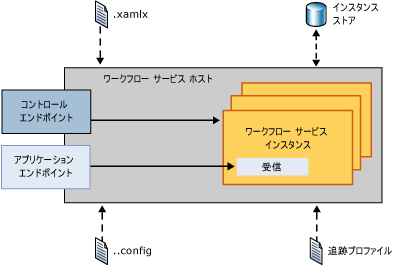
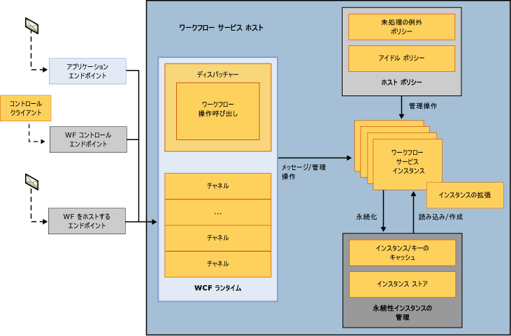
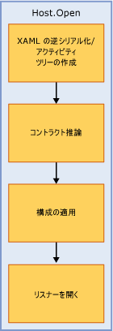
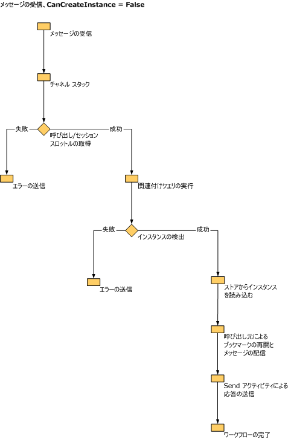

# ワークフロー サービス ホストの内部Workflow Service Host Internals
<xref:System.ServiceModel.WorkflowServiceHost> では、ワークフロー サービスのホストが提供されます。<xref:System.ServiceModel.WorkflowServiceHost> provides a host for workflow services. これにより、受信メッセージをリッスンして、該当するワークフロー サービス インスタンスにルーティングし、アイドル状態のワークフローのアンロードおよび永続化を制御できます。It is responsible for listening for incoming messages and routing them to the appropriate workflow service instance, it controls unloading and persisting of idle workflows, and more. このトピックでは、WorkflowServiceHost がどのように受信メッセージを処理するかについて説明します。This topic describes how WorkflowServiceHost processes incoming messages.  
  
## WorkflowServiceHost の概要WorkflowServiceHost Overview  
 <xref:System.ServiceModel.WorkflowServiceHost> クラスは、ワークフロー サービスをホストするために使用されます。The <xref:System.ServiceModel.WorkflowServiceHost> class is used to host workflow services. このクラスは、受信メッセージをリッスンして、該当するサービス インスタンスにルーティングし、必要に応じて、新しいインスタンスを作成するか、永続ストレージから既存のインスタンスを読み込みます。It listens for incoming messages and routes them to the appropriate service instance, creating new instances or loading existing instances from durable storage as needed.  次の図は、<xref:System.ServiceModel.WorkflowServiceHost> の動作の概要を示しています。The following diagram illustrates on a high level how <xref:System.ServiceModel.WorkflowServiceHost> works.  
  
   
  
 この図では、<xref:System.ServiceModel.WorkflowServiceHost> は .xamlx ファイルからワークフロー サービス定義を読み込み、構成ファイルから構成情報を読み込みます。This diagram shows that <xref:System.ServiceModel.WorkflowServiceHost> loads workflow service definitions from .xamlx files and loads configuration information from a configuration file. また、追跡プロファイルから追跡構成を読み込みます。It also loads tracking configuration from the tracking profile. <xref:System.ServiceModel.WorkflowServiceHost> によって、ワークフロー インスタンスへの制御操作の送信を可能にするワークフロー コントロール エンドポイントが公開されます。<xref:System.ServiceModel.WorkflowServiceHost> exposes a workflow control endpoint which allows you to send control operations to workflow instances.  詳細については、次を参照してください。[ワークフロー コントロール エンドポイント](../../../../docs/framework/wcf/feature-details/workflow-control-endpoint.md)と[ワークフロー管理エンドポイントのサンプル](../../../../docs/framework/windows-workflow-foundation/samples/workflow-management-endpoint-sample.md)です。For more information see [Workflow Control Endpoint](../../../../docs/framework/wcf/feature-details/workflow-control-endpoint.md) and [Workflow Management Endpoint Sample](../../../../docs/framework/windows-workflow-foundation/samples/workflow-management-endpoint-sample.md).  
  
 <xref:System.ServiceModel.WorkflowServiceHost> によって、受信アプリケーション メッセージをリッスンするアプリケーション エンドポイントも公開されます。<xref:System.ServiceModel.WorkflowServiceHost> also exposes application endpoints that listen for incoming application messages. 受信メッセージが到着すると、該当するワークフロー サービス インスタンスに送られます (現在読み込み中の場合)。When an incoming message arrives it is sent to the appropriate workflow service instance (if it is currently loaded). 必要に応じて、新しいワークフロー インスタンスが作成されます。If needed a new workflow instance is created. 既存のインスタンスが永続化されている場合は、永続ストアから読み込まれます。Or if an existing instance has been persisted it is loaded from the persistence store.  
  
## WorkflowServiceHost の詳細WorkflowServiceHost Details  
 次の図は、<xref:System.ServiceModel.WorkflowServiceHost> がメッセージを処理する方法をさらに詳細に示しています。The following diagram shows how <xref:System.ServiceModel.WorkflowServiceHost> handles messages in a bit more detail.  
  
   
  
 この図には、3 つの異なるエンドポイント (アプリケーション エンドポイント、ワークフロー コントロール エンドポイント、およびワークフローをホストするエンドポイント) が示されています。This diagram shows three different endpoints, an application endpoint, a workflow control endpoint, and a workflow hosting endpoint. アプリケーション エンドポイントは、特定のワークフロー インスタンスにバインドされたメッセージを受信します。The application endpoint receives messages that are bound for a specific workflow instance. ワークフロー コントロール エンドポイントは、制御操作をリッスンします。The workflow control endpoint listens for control operations. ワークフローをホストするエンドポイントは、<xref:System.ServiceModel.WorkflowServiceHost> がサービス以外のワークフローを読み込んで実行するためのメッセージをリッスンします。The workflow hosting endpoint listens for messages that cause <xref:System.ServiceModel.WorkflowServiceHost> to load and execute non-service workflows. この図が示すように、すべてのメッセージは、WCF ランタイム中に処理されます。As shown in the diagram all messages are processed through the WCF runtime.  ワークフロー サービス インスタンスの調整は、<xref:System.ServiceModel.Description.ServiceThrottlingBehavior.MaxConcurrentInstances%2A> プロパティを使用して実現されます。Workflow service instance throttling is achieved by using the <xref:System.ServiceModel.Description.ServiceThrottlingBehavior.MaxConcurrentInstances%2A> property. このプロパティは、同時ワークフロー サービス インスタンスの数を制限します。This property will limit the number of concurrent workflow service instances. この調整を超過すると、新しいワークフロー サービス インスタンスの追加要求または永続化されたワークフロー インスタンスのアクティブ化の要求がキューに置かれます。When this throttle is exceeded any additional requests for new workflow service instances or requests to activate persisted workflow instances will be queued. キューに置かれた要求は、新規インスタンスと実行中の永続化されたインスタンスのどちらに対するものであるかにかかわらず、FIFO 順で処理されます。The queued requests are processed in FIFO order regardless of whether they are requests for a new instance or a running, persisted instance. 未処理の例外の処理方法およびアイドル状態のワークフロー サービスのアンロードおよび永続化方法を指定するホスト ポリシー情報が読み込まれます。Host policy information is loaded that determines how unhandled exceptions are dealt with, and how idle workflow services are unloaded and persisted. これらのトピックの詳細については、次を参照してください。[する方法: WorkflowServiceHost での例外動作の構成ワークフロー未処理](../../../../docs/framework/wcf/feature-details/config-workflow-unhandled-exception-workflowservicehost.md)と[する方法: WorkflowServiceHost でのアイドル動作の構成](../../../../docs/framework/wcf/feature-details/how-to-configure-idle-behavior-with-workflowservicehost.md)です。For more information about these topics see [How to: Configure Workflow Unhandled Exception Behavior with WorkflowServiceHost](../../../../docs/framework/wcf/feature-details/config-workflow-unhandled-exception-workflowservicehost.md) and [How to: Configure Idle Behavior with WorkflowServiceHost](../../../../docs/framework/wcf/feature-details/how-to-configure-idle-behavior-with-workflowservicehost.md). ワークフロー インスタンスは、ホスト ポリシーに従って永続化され、必要に応じて再度読み込まれます。Workflow instances are persisted according to host policies and are reloaded when needed. ワークフローの永続化の詳細については、次を参照してください:[する方法: WorkflowServiceHost で永続化を構成する](../../../../docs/framework/wcf/feature-details/how-to-configure-persistence-with-workflowservicehost.md)、[実行時間の長いワークフロー サービスを作成する](../../../../docs/framework/wcf/feature-details/creating-a-long-running-workflow-service.md)、および[ワークフローの永続化](../../../../docs/framework/windows-workflow-foundation/workflow-persistence.md)。For more information about workflow persistence see: [How to: Configure Persistence with WorkflowServiceHost](../../../../docs/framework/wcf/feature-details/how-to-configure-persistence-with-workflowservicehost.md), [Creating a Long-running Workflow Service](../../../../docs/framework/wcf/feature-details/creating-a-long-running-workflow-service.md), and [Workflow Persistence](../../../../docs/framework/windows-workflow-foundation/workflow-persistence.md).  
  
 次の図は、WorkflowServiceHost.Open が呼び出されたときの動作を示しています。The following illustration shows what the WorkflowServiceHost.Open is called.  
  
   
  
 ワークフローが XAML から読み込まれ、アクティビティ ツリーが作成されます。The workflow is loaded from XAML and the activity tree is created. <xref:System.ServiceModel.WorkflowServiceHost> は、アクティビティ ツリーに従い、サービスの記述を作成します。<xref:System.ServiceModel.WorkflowServiceHost> walks the activity tree and creates the service description. 構成がホストに適用されます。Configuration is applied to the host. 最後に、ホストは受信メッセージのリッスンを開始します。Finally the host begins to listen for incoming messages.  
  
 次の図は、CanCreateInstance が <xref:System.ServiceModel.WorkflowServiceHost> に設定された場合の Receive アクティビティにバインドされたメッセージを受信したときの `true` の動作を示しています。The following illustration shows what the <xref:System.ServiceModel.WorkflowServiceHost> does when it receives a message bound for a Receive activity that has CanCreateInstance set to `true`.  
  
   
  
 メッセージが到着し、WCF チャネル スタックによって処理されます。The message arrives and is processed by the WCF channel stack. スロットルがチェックされ、関連付けクエリが実行されます。Throttles are checked and correlation queries are executed. 既存のインスタンスにバインドされているメッセージは配信されます。If the message is bound for an existing instance the message is delivered. 新しいインスタンスを作成する必要がある場合は、Receive アクティビティの CanCreateInstance プロパティが確認されます。If a new instance needs to be created, the Receive activity’s CanCreateInstance property is checked. true に設定されている場合、新しいインスタンスが作成され、メッセージが配信されます。If it is set to true, a new instance is created and the message is delivered.  
  
 次の図は、CanCreateInstance が false に設定された場合の Receive アクティビティにバインドされたメッセージを受信したときの <xref:System.ServiceModel.WorkflowServiceHost> の動作を示しています。The following illustration shows what the <xref:System.ServiceModel.WorkflowServiceHost> does when it receives a message bound for a Receive activity that has CanCreateInstance set to false.  
  
   
  
 メッセージが到着し、WCF チャネル スタックによって処理されます。The message arrives and is processed by the WCF channel stack. スロットルがチェックされ、関連付けクエリが実行されます。Throttles are checked and correlation queries are executed. メッセージが既存のインスタンスにバインドされている場合は (CanCreateInstance が false に設定されているため) インスタンスが永続ストアから読み込まれ、ブックマークが再開され、ワークフローが実行されます。The message is bound for an existing instance (because CanCreateInstance is false) so the instance is loaded from persistence store, the bookmark is resumed and the workflow executes.  
  
> [!WARNING]
>  SQL Server が NamedPipe プロトコルでのみリッスンするように設定されている場合、ワークフロー サービス ホストは開きません。Workflow Service Host will fail to open if SQL Server is configured to listen on NamedPipe protocol only.  
  
## 関連項目See Also  
 [ワークフロー サービスWorkflow Services](../../../../docs/framework/wcf/feature-details/workflow-services.md)  
 [ワークフロー サービスのホスティングHosting Workflow Services](../../../../docs/framework/wcf/feature-details/hosting-workflow-services.md)  
 [ワークフロー コントロール エンドポイントWorkflow Control Endpoint](../../../../docs/framework/wcf/feature-details/workflow-control-endpoint.md)  
 [ワークフロー管理エンドポイントのサンプルWorkflow Management Endpoint Sample](../../../../docs/framework/windows-workflow-foundation/samples/workflow-management-endpoint-sample.md)  
 [ワークフロー サービスのハンドルされない例外動作を構成する方法How to: Configure Workflow Unhandled Exception Behavior with WorkflowServiceHost](../../../../docs/framework/wcf/feature-details/config-workflow-unhandled-exception-workflowservicehost.md)  
 [長時間のワークフロー サービスの作成Creating a Long-running Workflow Service](../../../../docs/framework/wcf/feature-details/creating-a-long-running-workflow-service.md)  
 [ワークフローの永続性Workflow Persistence](../../../../docs/framework/windows-workflow-foundation/workflow-persistence.md)
