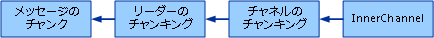

# <a name="chunking-channel"></a>チャネルのチャンキング
Windows Communication Foundation (WCF) を使用してサイズの大きいメッセージを送信するときに、それらのメッセージをバッファーに使用されるメモリの量を制限することが望ましいは多くの場合です。 解決策の 1 つとして、メッセージ本文のストリーミングが考えられます (データの大部分が本文にある場合)。 ただし、一部のプロトコルではメッセージ全体のバッファが必要です。 たとえば、信頼できるメッセージとセキュリティの 2 つがこの例として挙げられます。 そこで別の解決策として、サイズの大きいメッセージをチャンクと呼ばれるサイズの小さいメッセージに分割し、そうしたチャンクを 1 つずつ送信し、受信側でサイズの大きいメッセージに再構成するという方法が考えられます。 アプリケーション自体でこうしたチャンキングおよびチャンキング解除を行うことができるほか、カスタム チャネルを使用して行うこともできます。 チャネルのチャンキングのサンプルでは、カスタム プロトコル チャネルまたはカスタム階層チャネルを使用して、サイズの大きい任意のメッセージのチャンキングおよびチャンキング解除を行う方法を示します。  
  
 チャンキングは常に、送信されるメッセージ全体が構築された後にのみ使用する必要があります。 チャネルのチャンキングは常に、セキュリティ チャネルおよび信頼できるセッション チャネルの下位の階層に置く必要があります。  
  
> [!NOTE]
>  このサンプルのセットアップ手順とビルド手順については、このトピックの最後を参照してください。  
  
> [!IMPORTANT]
>  サンプルは、既にコンピューターにインストールされている場合があります。 続行する前に、次の (既定の) ディレクトリを確認してください。  
>   
>  `<InstallDrive>:\WF_WCF_Samples`  
>   
>  このディレクトリが存在しない場合に、 [Windows Communication Foundation (WCF) および .NET Framework 4 向けの Windows Workflow Foundation (WF) サンプル](http://go.microsoft.com/fwlink/?LinkId=150780)すべて Windows Communication Foundation (WCF) をダウンロードして[!INCLUDE[wf1](../../../../includes/wf1-md.md)]サンプルです。 このサンプルは、次のディレクトリに格納されます。  
>   
>  `<InstallDrive>:\WF_WCF_Samples\WCF\Extensibility\Channels\ChunkingChannel`  
  
## <a name="chunking-channel-assumptions-and-limitations"></a>チャネルのチャンキングにおける前提と制限  
  
### <a name="message-structure"></a>メッセージ構造  
 チャネルのチャンキングでは、チャンク対象のメッセージについて、次のメッセージ構造を想定しています。  
  
```xml  
<soap:Envelope ...>  
  <!-- headers -->  
  <soap:Body>  
    <operationElement>  
      <paramElement>data to be chunked</paramElement>  
    </operationElement>  
  </soap:Body>  
</soap:Envelope>  
```  
  
 ServiceModel を使用する場合、1 つの入力パラメータを持つコントラクト操作は、入力メッセージについてこのメッセージ形式に準拠します。 同様に、1 つの出力パラメータまたは 1 つの戻り値を持つコントラクト操作は、出力メッセージについてこのメッセージ形式に準拠します。 このような操作の例を次に示します。  
  
```  
[ServiceContract]  
interface ITestService  
{  
    [OperationContract]  
    Stream EchoStream(Stream stream);  
  
    [OperationContract]  
    Stream DownloadStream();  
  
    [OperationContract(IsOneWay = true)]  
    void UploadStream(Stream stream);  
}  
```  
  
### <a name="sessions"></a>セッション  
 チャネルのチャンキングでは、メッセージ (チャンク) の順序付き配信でメッセージが正確に 1 回だけ配信される必要があります。 つまり、基になるチャネル スタックはセッションフルであることが必要です。 セッションは、トランスポート (TCP トランスポートなど) またはセッションフル プロトコル チャネル (信頼できるセッション チャネルなど) によって提供されます。  
  
### <a name="asynchronous-send-and-receive"></a>非同期の送受信  
 非同期の送受信方法は、このバージョンのチャネルのチャンキング サンプルには実装されていません。  
  
## <a name="chunking-protocol"></a>プロトコルのチャンキング  
 チャネルのチャンキングでは、一連のチャンクの開始と終了、および各チャンクのシーケンス番号を示すプロトコルを定義します。 次の 3 つのメッセージ例では、開始メッセージ、チャンク メッセージ、および終了メッセージを、それぞれの主要な特徴を説明するコメントと共に示します。  
  
### <a name="start-message"></a>開始メッセージ  
  
```xml  
<s:Envelope xmlns:a="http://www.w3.org/2005/08/addressing"   
            xmlns:s="http://www.w3.org/2003/05/soap-envelope">  
  <s:Header>  
<!—Original message action is replaced with a chunking-specific action. -->  
    <a:Action s:mustUnderstand="1">http://samples.microsoft.com/chunkingAction</a:Action>  
<!--  
Original message is assigned a unique id that is transmitted   
in a MessageId header. Note that this is different from the WS-Addressing MessageId header.  
-->  
    <MessageId s:mustUnderstand="1" xmlns="http://samples.microsoft.com/chunking">  
53f183ee-04aa-44a0-b8d3-e45224563109  
</MessageId>  
<!--  
ChunkingStart header signals the start of a chunked message.  
-->  
    <ChunkingStart s:mustUnderstand="1" i:nil="true" xmlns:i="http://www.w3.org/2001/XMLSchema-instance" xmlns="http://samples.microsoft.com/chunking" />  
<!--  
Original message action is transmitted in OriginalAction.  
This is required to re-create the original message on the other side.  
-->  
    <OriginalAction xmlns="http://samples.microsoft.com/chunking">  
http://tempuri.org/ITestService/EchoStream  
    </OriginalAction>  
   <!--  
    All original message headers are included here.  
   -->  
  </s:Header>  
  <s:Body>  
<!--  
Chunking assumes this structure of Body content:  
<element>  
  <childelement>large data to be chunked<childelement>  
</element>  
The start message contains just <element> and <childelement> without  
the data to be chunked.  
-->  
    <EchoStream xmlns="http://tempuri.org/">  
      <stream />  
    </EchoStream>  
  </s:Body>  
</s:Envelope>  
```  
  
### <a name="chunk-message"></a>チャンク メッセージ  
  
```xml  
<s:Envelope   
  xmlns:a="http://www.w3.org/2005/08/addressing"   
  xmlns:s="http://www.w3.org/2003/05/soap-envelope">  
  <s:Header>  
   <!--  
    All chunking protocol messages have this action.  
   -->  
    <a:Action s:mustUnderstand="1">  
      http://samples.microsoft.com/chunkingAction  
    </a:Action>  
<!--  
Same as MessageId in the start message. The GUID indicates which original message this chunk belongs to.  
-->  
    <MessageId s:mustUnderstand="1"   
               xmlns="http://samples.microsoft.com/chunking">  
      53f183ee-04aa-44a0-b8d3-e45224563109  
    </MessageId>  
<!--  
The sequence number of the chunk.  
This number restarts at 1 with each new sequence of chunks.  
-->  
    <ChunkNumber s:mustUnderstand="1"   
                 xmlns="http://samples.microsoft.com/chunking">  
      1096  
    </ChunkNumber>  
  </s:Header>  
  <s:Body>  
<!--  
The chunked data is wrapped in a chunk element.  
The encoding of this data (and the entire message)   
depends on the encoder used. The chunking channel does not mandate an encoding.  
-->  
    <chunk xmlns="http://samples.microsoft.com/chunking">  
kfSr2QcBlkHTvQ==  
    </chunk>  
  </s:Body>  
</s:Envelope>  
```  
  
### <a name="end-message"></a>終了メッセージ  
  
```xml  
<s:Envelope xmlns:a="http://www.w3.org/2005/08/addressing"   
            xmlns:s="http://www.w3.org/2003/05/soap-envelope">  
  <s:Header>  
    <a:Action s:mustUnderstand="1">  
      http://samples.microsoft.com/chunkingAction  
    </a:Action>  
<!--  
Same as MessageId in the start message. The GUID indicates which original message this chunk belongs to.  
-->  
    <MessageId s:mustUnderstand="1"   
               xmlns="http://samples.microsoft.com/chunking">  
      53f183ee-04aa-44a0-b8d3-e45224563109  
    </MessageId>  
<!--  
ChunkingEnd header signals the end of a chunk sequence.  
-->  
    <ChunkingEnd s:mustUnderstand="1" i:nil="true"   
                 xmlns:i="http://www.w3.org/2001/XMLSchema-instance"   
                 xmlns="http://samples.microsoft.com/chunking" />  
<!--  
ChunkingEnd messages have a sequence number.  
-->  
    <ChunkNumber s:mustUnderstand="1"   
                 xmlns="http://samples.microsoft.com/chunking">  
      79  
    </ChunkNumber>  
  </s:Header>  
  <s:Body>  
<!--  
The ChunkingEnd message has the same <element><childelement> structure  
as the ChunkingStart message.  
-->  
    <EchoStream xmlns="http://tempuri.org/">  
      <stream />  
    </EchoStream>  
  </s:Body>  
</s:Envelope>  
```  
  
## <a name="chunking-channel-architecture"></a>チャネルのチャンキングのアーキテクチャ  
 チャンキングを行うチャネルは `IDuplexSessionChannel` で、高レベルで通常のチャネル アーキテクチャに従います。 `ChunkingBindingElement` と `ChunkingChannelFactory` を作成できる `ChunkingChannelListener` があります。 `ChunkingChannelFactory` は、作成を要求されたときに `ChunkingChannel` のインスタンスを作成します。 `ChunkingChannelListener` は、新しい内部チャネルが受け入れられると `ChunkingChannel` のインスタンスを作成します。 メッセージの送受信は `ChunkingChannel` 自体が行います。  
  
 1 つ下のレベルでは、`ChunkingChannel` がいくつかのコンポーネントに依存して、チャンキングを行うプロトコルを実装します。 送信側では、このチャネルは、実際にチャンキングを行う `XmlDictionaryWriter` というカスタム `ChunkingWriter` を使用します。 `ChunkingWriter` は内部チャネルを使用して直接チャンクを送信します。 カスタム `XmlDictionaryWriter` を使用すると、本文のサイズが大きい元のメッセージの書き込みと同時にチャンクを送信できます。 つまり、元のメッセージ全体はバッファされません。  
  
   
  
 受信側では、`ChunkingChannel` は内部チャネルからメッセージをプルし、`XmlDictionaryReader` というカスタム `ChunkingReader` に渡します。これにより、受信チャンクから元のメッセージが再構成されます。 `ChunkingChannel` は、この `ChunkingReader` を `Message` というカスタム `ChunkingMessage` 実装でラップし、このメッセージを上の層に戻します。 `ChunkingReader` と `ChunkingMessage` を組み合わせて使用すると、元のメッセージ本文全体をバッファーする代わりに、元のメッセージ本文が上の層によって読み取られるのと同時にメッセージのチャンキング解除を行うことができます。 `ChunkingReader` には、バッファー対象のチャンクの構成可能な最大数を上限として受信チャンクをバッファーするキューがあります。 この上限に達すると、リーダーは、上の層によってメッセージがキューから出される (つまり元のメッセージ本文の読み取りだけが行われる) まで待機するか、または受信タイムアウトの上限に達するまで待機します。  
  
   
  
## <a name="chunking-programming-model"></a>プログラミング モデルのチャンキング  
 サービス開発者は `ChunkingBehavior` 属性をコントラクト内の操作に適用することにより、チャンク対象のメッセージを指定できます。 この属性は `AppliesTo` プロパティを公開します。このプロパティを使用すると、開発者は、入力メッセージと出力メッセージのどちらか、またはその両方にチャンキングを適用するように指定できます。 `ChunkingBehavior` 属性の使用方法を次の例に示します。  
  
```  
[ServiceContract]  
interface ITestService  
{  
    [OperationContract]  
    [ChunkingBehavior(ChunkingAppliesTo.Both)]  
    Stream EchoStream(Stream stream);  
  
    [OperationContract]  
    [ChunkingBehavior(ChunkingAppliesTo.OutMessage)]  
    Stream DownloadStream();  
  
    [OperationContract(IsOneWay=true)]  
    [ChunkingBehavior(ChunkingAppliesTo.InMessage)]  
    void UploadStream(Stream stream);  
  
}  
```  
  
 このプログラミング モデルから、`ChunkingBindingElement` は、チャンク対象のメッセージを識別するアクション URI のリストをコンパイルします。 各送信メッセージのアクションはこのリストと比較され、そのメッセージはチャンク対象なのか、または直接送信する必要があるのかが判断されます。  
  
## <a name="implementing-the-send-operation"></a>Send 操作の実装  
 高レベルの Send 操作では、送信メッセージをチャンクする必要があるかどうかを最初にチェックし、その必要がない場合は内部チャネルを使用して直接メッセージを送信します。  
  
 メッセージのチャンキングが必要な場合、Send は新しい `ChunkingWriter` を作成して、この `WriteBodyContents` を渡す送信メッセージで `ChunkingWriter` を呼び出します。 次に、`ChunkingWriter` はメッセージのチャンキング (およびチャンク開始メッセージへの元のメッセージ ヘッダーのコピー) を行い、内部チャネルを使用してチャンクを送信します。  
  
 いくつかの細かい点に注意してください。  
  
-   Send は最初に `ThrowIfDisposedOrNotOpened` を呼び出し、`CommunicationState` が開かれた状態にします。  
  
-   Send は、セッションごとに一度に 1 つのメッセージだけを送信できるように同期されます。 `ManualResetEvent` という `sendingDone` があり、これはチャンキングが行われたメッセージが送信されたときにリセットされます。 チャンク終了メッセージが送信されると、このイベントが設定されます。 Send メソッドは、このイベントが設定されるのを待機した後でメッセージの送信を試行します。  
  
-   Send は `CommunicationObject.ThisLock` をロックし、送信中に同期状態が変更されないようにします。 <xref:System.ServiceModel.Channels.CommunicationObject> の状態とステート マシンの詳細については、<xref:System.ServiceModel.Channels.CommunicationObject> のドキュメントを参照してください。  
  
-   Send に渡されるタイムアウトは、すべてのチャンクの送信を含む送信操作全体のタイムアウトとして使用されます。  
  
-   元のメッセージ本文全体がバッファされないように、カスタムの `XmlDictionaryWriter` デザインが選択されています。 `XmlDictionaryReader` を使用して本文の `message.GetReaderAtBodyContents` を取得する場合、本文全体がバッファされます。 この場合は、代わりに、`XmlDictionaryWriter` に渡されるカスタムの `message.WriteBodyContents` があります。 メッセージがライタの WriteBase64 を呼び出すと、ライタはチャンクをパッケージ化してメッセージを作成し、内部チャンネルを使用して送信します。 WriteBase64 は、チャンクが送信されるまでブロックされます。  
  
## <a name="implementing-the-receive-operation"></a>Receive 操作の実装  
 高レベルの Receive 操作では、最初に受信メッセージが `null` でないことをチェックすると共に、アクションが `ChunkingAction` であることをチェックします。 どちらかの条件が満たされていない場合、メッセージは Receive によって変更されないまま返されます。 それ以外の場合、Receive は新しい `ChunkingReader` と、それを (`ChunkingMessage` を呼び出して) ラップする新しい `GetNewChunkingMessage` を作成します。 Receive は、新しい `ChunkingMessage` を返す前に、スレッド プールのスレッドを使用して `ReceiveChunkLoop` を実行します。これによってループ内に `innerChannel.Receive` が呼び出され、チャンク終了メッセージを受信するか、または受信タイムアウトに達するまで、チャンクが `ChunkingReader` に渡されます。  
  
 いくつかの細かい点に注意してください。  
  
-   Send と同様、Receive は最初に `ThrowIfDisposedOrNotOepned` を呼び出して、`CommunicationState` が開かれた状態にします。  
  
-   また Receive も、セッションから一度に 1 つのメッセージだけを受信できるように同期されます。 これは特に重要です。チャンク開始メッセージが受信されると、それ以降受信されるすべてのメッセージは、チャンク終了メッセージが受信されるまで、この新しいチャンク シーケンス内のチャンクであると想定されるためです。 Receive は、現在チャンキングを解除中のメッセージに属するすべてのチャンクが受信されるまでは、内部チャネルからメッセージをプルできません。 これを実現するため、Receive は `ManualResetEvent` という `currentMessageCompleted` を使用します。これはチャンク終了メッセージが受信されたときに設定され、新しいチャンク開始メッセージが受信されたときにリセットされます。  
  
-   Receive は Send と異なり、受信中に同期状態の遷移を妨げません。 たとえば、受信中に Close を呼び出して、保留中の元のメッセージの受信が完了するか、または指定されたタイムアウト値に達するまで待機できます。  
  
-   Receive に渡されるタイムアウトは、すべてのチャンクの受信を含む受信操作全体のタイムアウトとして使用されます。  
  
-   メッセージを処理するレイヤでメッセージ本文を処理する速度が、チャンク メッセージを受信する速度より遅い場合、`ChunkingReader` は、`ChunkingBindingElement.MaxBufferedChunks` で指定された上限に達するまでこうした受信チャンクをバッファします。 この上限に達すると、バッファされたチャンクが処理されるか、または受信タイムアウトに達するまで、チャンクは下位層からプルされなくなります。  
  
## <a name="communicationobject-overrides"></a>CommunicationObject のオーバーライド  
  
### <a name="onopen"></a>OnOpen  
 `OnOpen` は `innerChannel.Open` を呼び出して内部チャネルを開きます。  
  
### <a name="onclose"></a>OnClose  
 `OnClose` は、保留状態の `stopReceive` が停止したことを通知するため、最初に `true` を `ReceiveChunkLoop` に設定します。 待機し、`receiveStopped``ManualResetEvent`が設定されている場合に`ReceiveChunkLoop`を停止します。 `ReceiveChunkLoop` が指定されたタイムアウト内で停止した場合、`OnClose` はタイムアウトの残り時間で `innerChannel.Close` を呼び出します。  
  
### <a name="onabort"></a>OnAbort  
 `OnAbort` は、`innerChannel.Abort` を呼び出して内部チャネルを中止します。 保留中の `ReceiveChunkLoop` がある場合は、保留中の `innerChannel.Receive` 呼び出しから例外を受け取ります。  
  
### <a name="onfaulted"></a>OnFaulted  
 チャネルでエラーが発生した場合、`ChunkingChannel` では特別な動作は必要ありません。したがって、`OnFaulted` はオーバーライドされません。  
  
## <a name="implementing-channel-factory"></a>チャネル ファクトリの実装  
 `ChunkingChannelFactory` は `ChunkingDuplexSessionChannel` のインスタンスを作成し、遷移した状態を内部チャネル ファクトリに転送します。  
  
 `OnCreateChannel` は内部チャネル ファクトリを使用して、`IDuplexSessionChannel` 内部チャネルを作成します。 次に、新しい `ChunkingDuplexSessionChannel` を作成し、それに内部チャネル、チャンク対象のメッセージ アクションのリスト、および受信時にバッファするチャンクの最大数を渡します。 チャンク対象のメッセージ アクションのリストと、バッファするチャンクの最大数の 2 つは、パラメータとしてコンストラクタの `ChunkingChannelFactory` に渡されます。 `ChunkingBindingElement` に関するセクションでは、これらの値の発生元について説明します。  
  
 `OnOpen`、`OnClose`、`OnAbort`、およびそれぞれと同等の非同期のメソッドは、対応する状態遷移メソッドを内部チャネル ファクトリで呼び出します。  
  
## <a name="implementing-channel-listener"></a>チャネル リスナの実装  
 `ChunkingChannelListener` は、内部チャネル リスナのラッパーです。 この主な機能は、内部チャネル リスナへの呼び出しを代行するほか、内部チャネル リスナから受け入れられたチャネルを新しい `ChunkingDuplexSessionChannels` でラップすることです。 これは、`OnAcceptChannel` と `OnEndAcceptChannel` で行われます。 新しく作成された `ChunkingDuplexSessionChannel` は、以前説明した他のパラメータと共に内部チャネルに渡されます。  
  
## <a name="implementing-binding-element-and-binding"></a>バインディング要素とバインディングの実装  
 `ChunkingBindingElement` は、`ChunkingChannelFactory` および `ChunkingChannelListener` を作成します。 `ChunkingBindingElement`を確認するかどうかで T `CanBuildChannelFactory` \<T > と`CanBuildChannelListener` \<T > の型は`IDuplexSessionChannel`(チャネルのチャンキングでサポートされている唯一のチャネル)、バインディング内の他のバインド要素がこれをサポートし、チャネルの型。  
  
 `BuildChannelFactory`\<T > まず、要求されたチャネルの種類が作成できるし、チャンク対象のメッセージ アクションの一覧を取得します。 詳細については、次のセクションを参照してください。 次に、新しい `ChunkingChannelFactory` を作成し、それに内部チャネル ファクトリ (`context.BuildInnerChannelFactory<IDuplexSessionChannel>` から返されたままの状態での)、メッセージ アクションのリスト、およびバッファするチャンクの最大数を渡します。 チャンクの最大数は、`MaxBufferedChunks` によって公開される `ChunkingBindingElement` というプロパティによって指定されます。  
  
 `BuildChannelListener<T>` には、`ChunkingChannelListener` を作成してこれに内部チャネル リスナーを渡す同様の実装があります。  
  
 このサンプルには、`TcpChunkingBinding` というバインディング例が含まれています。 このバインディングは、`TcpTransportBindingElement` と `ChunkingBindingElement` の 2 つのバインディング要素で構成されています。 このバインディングは、`MaxBufferedChunks` プロパティを公開する他にも、`TcpTransportBindingElement` プロパティの一部を設定します。たとえば、ヘッダーについて、`MaxReceivedMessageSize` を `ChunkingUtils.ChunkSize` + 100 KB に設定します。  
  
 また、`TcpChunkingBinding` は、`IBindingRuntimePreferences` を実装し、`ReceiveSynchronously` メソッドに対して true を返すことで、同期 Receive 呼び出しのみが実装されていることを示します。  
  
### <a name="determining-which-messages-to-chunk"></a>チャンク対象のメッセージの判断  
 チャネルのチャンキングによってチャンクされるメッセージは、`ChunkingBehavior` 属性を介して識別されるメッセージのみです。 `ChunkingBehavior` クラスは `IOperationBehavior` を実装し、`AddBindingParameter` メソッドの呼び出しによって実装されます。 このメソッドでは、`ChunkingBehavior` が `AppliesTo` プロパティの値 (`InMessage` または`OutMessage` のいずれか、またはその両方) を調べ、どのメッセージがチャンク対象かを判断します。 次に、チャンク対象の各メッセージのアクションを (`OperationDescription` の Messages コレクションから) 取得し、これを `ChunkingBindingParameter` のインスタンス内に含まれている文字列コレクションに追加します。 そして、この `ChunkingBindingParameter` を指定された `BindingParameterCollection` に追加します。  
  
 この `BindingParameterCollection` は、バインディング要素がチャネル ファクトリまたはチャネル リスナを作成するときに、`BindingContext` 内でバインディングの各バインディング要素に渡されます。 `ChunkingBindingElement`の実装の`BuildChannelFactory<T>`と`BuildChannelListener<T>`この`ChunkingBindingParameter`のうち、 `BindingContext’`s`BindingParameterCollection`です。 次に、`ChunkingBindingParameter` に含まれているアクションのコレクションが `ChunkingChannelFactory` または `ChunkingChannelListener` に渡され、その後 `ChunkingDuplexSessionChannel` に渡されます。  
  
## <a name="running-the-sample"></a>サンプルの実行  
  
#### <a name="to-set-up-build-and-run-the-sample"></a>サンプルをセットアップ、ビルド、および実行するには  
  
1.  次のコマンドを使用して、[!INCLUDE[vstecasp](../../../../includes/vstecasp-md.md)] 4.0 をインストールします。  
  
    ```  
    %windir%\Microsoft.NET\Framework\v4.0.XXXXX\aspnet_regiis.exe /i /enable  
    ```  
  
2.  実行したことを確認してください、 [Windows Communication Foundation サンプルの 1 回限りのセットアップ手順](../../../../docs/framework/wcf/samples/one-time-setup-procedure-for-the-wcf-samples.md)です。  
  
3.  指示に従って、ソリューションをビルドする[Windows Communication Foundation サンプルのビルド](../../../../docs/framework/wcf/samples/building-the-samples.md)です。  
  
4.  1 つまたは複数コンピューター構成でサンプルを実行する手順についてで[Windows Communication Foundation サンプルの実行](../../../../docs/framework/wcf/samples/running-the-samples.md)です。  
  
5.  最初に Service.exe を実行して次に Client.exe を実行し、両方のコンソール ウィンドウで出力を表示します。  
  
 このサンプルを実行すると、次の出力が予測されます。  
  
 クライアント:  
  
```  
Press enter when service is available  
  
 > Sent chunk 1 of message 867c1fd1-d39e-4be1-bc7b-32066d7ced10  
 > Sent chunk 2 of message 867c1fd1-d39e-4be1-bc7b-32066d7ced10  
 > Sent chunk 3 of message 867c1fd1-d39e-4be1-bc7b-32066d7ced10  
 > Sent chunk 4 of message 867c1fd1-d39e-4be1-bc7b-32066d7ced10  
 > Sent chunk 5 of message 867c1fd1-d39e-4be1-bc7b-32066d7ced10  
 > Sent chunk 6 of message 867c1fd1-d39e-4be1-bc7b-32066d7ced10  
 > Sent chunk 7 of message 867c1fd1-d39e-4be1-bc7b-32066d7ced10  
 > Sent chunk 8 of message 867c1fd1-d39e-4be1-bc7b-32066d7ced10  
 > Sent chunk 9 of message 867c1fd1-d39e-4be1-bc7b-32066d7ced10  
 > Sent chunk 10 of message 867c1fd1-d39e-4be1-bc7b-32066d7ced10  
 < Received chunk 1 of message 5b226ad5-c088-4988-b737-6a565e0563dd  
 < Received chunk 2 of message 5b226ad5-c088-4988-b737-6a565e0563dd  
 < Received chunk 3 of message 5b226ad5-c088-4988-b737-6a565e0563dd  
 < Received chunk 4 of message 5b226ad5-c088-4988-b737-6a565e0563dd  
 < Received chunk 5 of message 5b226ad5-c088-4988-b737-6a565e0563dd  
 < Received chunk 6 of message 5b226ad5-c088-4988-b737-6a565e0563dd  
 < Received chunk 7 of message 5b226ad5-c088-4988-b737-6a565e0563dd  
 < Received chunk 8 of message 5b226ad5-c088-4988-b737-6a565e0563dd  
 < Received chunk 9 of message 5b226ad5-c088-4988-b737-6a565e0563dd  
 < Received chunk 10 of message 5b226ad5-c088-4988-b737-6a565e0563dd  
```  
  
 サーバー:  
  
```  
Service started, press enter to exit  
 < Received chunk 1 of message 867c1fd1-d39e-4be1-bc7b-32066d7ced10  
 < Received chunk 2 of message 867c1fd1-d39e-4be1-bc7b-32066d7ced10  
 < Received chunk 3 of message 867c1fd1-d39e-4be1-bc7b-32066d7ced10  
 < Received chunk 4 of message 867c1fd1-d39e-4be1-bc7b-32066d7ced10  
 < Received chunk 5 of message 867c1fd1-d39e-4be1-bc7b-32066d7ced10  
 < Received chunk 6 of message 867c1fd1-d39e-4be1-bc7b-32066d7ced10  
 < Received chunk 7 of message 867c1fd1-d39e-4be1-bc7b-32066d7ced10  
 < Received chunk 8 of message 867c1fd1-d39e-4be1-bc7b-32066d7ced10  
 < Received chunk 9 of message 867c1fd1-d39e-4be1-bc7b-32066d7ced10  
 < Received chunk 10 of message 867c1fd1-d39e-4be1-bc7b-32066d7ced10  
 > Sent chunk 1 of message 5b226ad5-c088-4988-b737-6a565e0563dd  
 > Sent chunk 2 of message 5b226ad5-c088-4988-b737-6a565e0563dd  
 > Sent chunk 3 of message 5b226ad5-c088-4988-b737-6a565e0563dd  
 > Sent chunk 4 of message 5b226ad5-c088-4988-b737-6a565e0563dd  
 > Sent chunk 5 of message 5b226ad5-c088-4988-b737-6a565e0563dd  
 > Sent chunk 6 of message 5b226ad5-c088-4988-b737-6a565e0563dd  
 > Sent chunk 7 of message 5b226ad5-c088-4988-b737-6a565e0563dd  
 > Sent chunk 8 of message 5b226ad5-c088-4988-b737-6a565e0563dd  
 > Sent chunk 9 of message 5b226ad5-c088-4988-b737-6a565e0563dd  
 > Sent chunk 10 of message 5b226ad5-c088-4988-b737-6a565e0563dd  
```  
  
## <a name="see-also"></a>関連項目
